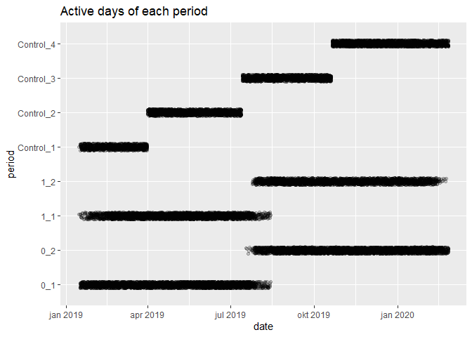
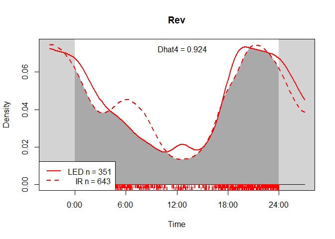
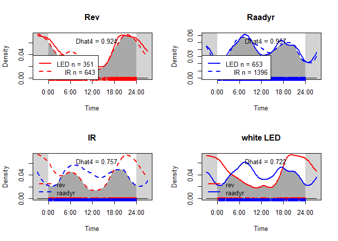
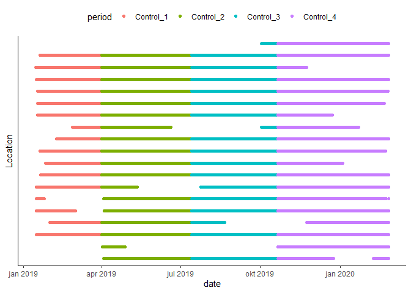

Flashing Large Mammals - exploring the data
================
Torgeir
23 februar, 2021

``` r
library(tidyverse)
```

    ## -- Attaching packages --------------------------------------- tidyverse 1.3.0 --

    ## v ggplot2 3.3.3     v purrr   0.3.4
    ## v tibble  3.0.6     v dplyr   1.0.4
    ## v tidyr   1.1.2     v stringr 1.4.0
    ## v readr   1.4.0     v forcats 0.5.0

    ## -- Conflicts ------------------------------------------ tidyverse_conflicts() --
    ## x dplyr::filter() masks stats::filter()
    ## x dplyr::lag()    masks stats::lag()

``` r
library(lubridate)
```

    ## 
    ## Attaching package: 'lubridate'

    ## The following objects are masked from 'package:base':
    ## 
    ##     date, intersect, setdiff, union

``` r
library(overlap)
# All the tibbles from Data_explor_setup.R, and package + function from Density.R
  effort   <- readRDS("Effort_prepared.rds")
  obs      <- readRDS("Observations_prepared1.rds")
  stations <- readRDS("stations.rds")

# functions building on overlap package
overlap_flash <- function(x, colour = c("black", "blue"), rug = FALSE) {
  x0 <- obs[obs$validated_species %in% x & obs$flash == FALSE, ]$rad
  x1 <- obs[obs$validated_species %in% x & obs$flash == TRUE, ]$rad
  overlapPlot(x1, x0, main = str_to_title(x), linecol = rep(colour, 2), rug = rug, linewidth = c(2, 2), olapcol = "darkgrey", extend = "lightgrey")
  x.est <- round(overlapEst(x1, x0, type = "Dhat4"), 3)
  n0 <- length(x0)
  n1 <- length(x1)
  legend("top", legend = str_c("Dhat4", x.est, sep = " = "), bty = "n")
  legend("bottomleft", legend = c(str_c("LED n", n1, sep = " = "), str_c("    IR n", n0, sep = " = ")),
         col = colour, lty = c(1, 2), lwd = 2, bty = "7")
}
overlap_flash_2sp <- function(x, y, col_x, col_y, rug = FALSE) {
  x0 <- obs[obs$validated_species %in% x & obs$flash == FALSE, ]$rad # - - | | - -    = FALSE
  x1 <- obs[obs$validated_species %in% x & obs$flash == TRUE, ]$rad  # sp X when flash = TRUE
  y0 <- obs[obs$validated_species %in% y & obs$flash == FALSE, ]$rad # - - | | - -    = FALSE
  y1 <- obs[obs$validated_species %in% y & obs$flash == TRUE, ]$rad # sp Y when flash = TRUE
  par(mfrow = c(2, 2)) # setting plot parameters: 2x2 windows
  overlap_flash(x, col_x, rug) # using the overlap_flash function for single species w/w/o flash-plot
  overlap_flash(y, col_y, rug) #                 - - | | - -
  overlapPlot(x0, y0,  # overlapping 2 species plot - flash = FALSE
    main = "IR", rug = rug, linecol = c(col_x, col_y),
    linetype = c(2, 2), linewidth = c(2, 2), olapcol = "darkgrey", extend = "lightgrey"
  )
  xy0.est <- round(overlapEst(x0, y0, type = "Dhat4"), 3)  # estimated overlap using Dhat4 - flash = FALSE
  xy1.est <- round(overlapEst(x1, y1, type = "Dhat4"), 3)  #           - - | | - -         - flash = TRUE
  legend("top", legend = str_c("Dhat4", xy0.est, sep = " = "), bty = "n") # Dhat4 label
  legend("bottomleft", legend = c(x, y), col = c(col_x, col_y), lty = c(2, 2), lwd = 2, bty = "n") # legend
  overlapPlot(x1, y1,  # overlapping 2 species plot - flash = TRUE
    main = "white LED", rug = rug, linecol = c(col_x, col_y),
    linetype = c(1, 1), linewidth = c(2, 2), olapcol = "darkgrey", extend = "lightgrey"
  )
  legend("top", legend = str_c("Dhat4", xy1.est, sep = " = "), bty = "n")
  legend("bottomleft", legend = c(x, y), col = c(col_x, col_y), lty = c(1, 1), lwd = 2, bty = "n")
  par(mfrow = c(1, 1)) # return normal plot parameters: 1x1 windows
}
```

# Presenting the data

``` r
min(obs$date) # [1] "2019-01-15"
```

    ## [1] "2019-01-15"

``` r
max(obs$date) # [1] "2020-02-17"  #but last field date was 2020-02-26 at camera 850 & 822!!
```

    ## [1] "2020-02-26"

``` r
sp_focus <- c("ekorn", "elg", "grevling", "hare", "raadyr", "rev")
obstation <- obs %>% left_join(stations, by = "loc") %>% filter(validated_species %in% sp_focus) %>% unite(abc, abc, flash) # unite lager ny faktor med alle kombinasjoner

#obstation %>% with(table(validated_species, abc)) %>% 
 # knitr::kable(caption = "Table with kable")

# Total nr of image (rapidfire)series can be presented by:
length(unique(obs$timeserie_id)) # identical numbers for timeserie_id and image_id
```

    ## [1] 25710

``` r
length(unique(obs$image_id))     # is it because only one picture is selected per timeseries?
```

    ## [1] 25710

``` r
obs_by_loc <- obs %>% group_by(loc) %>% summarise(n = length(timeserie_id)) %>% arrange(desc(n))
# plot(obs_by_loc)
```

### Blank images

``` r
# Filtering out timelapse-pictures in Reconyx (455 is the only Browning-camera that has significant number of pictures here)
timelapse <- obs %>% left_join(stations, by = "loc") %>%
  filter(hour %in% c(8, 13) & mins == 0  &  secs == 0  &  validated_species == "nothing") # == "nothing" to single out tinelapse-photos
summary(timelapse)
table(timelapse$hour[timelapse$cam_mod =="Reconyx"])

table(timelapse$cam_mod)


# table(timelapse$loc[timelapse$cam_mod == "Browning"])  #455 maybe has two cameras?
# table(timelapse$validated_species)  # when val_sp == "nothing" not specified: 10 other species present
# table(timelapse$validated_species[timelapse$hour == 13]) # elg:1, maar:2, menneske:3, raadyr:1
# table(timelapse$validated_species[timelapse$hour == 8]) # ekorn:1, fugl:9, gaupe:1, katt:1, menneske:1, raadyr:4, rev:2, ukjent:4

# Differentiate "nothing"-sequences and "nothing"-one-shots
# validated_species == "nothing" #by loc,
# and making an "independent event" criteria to distinguish repeated vegetation-triggering and other single-triggered events. 
# TODO
library(data.table)
setDT(obs)[, event_id := 1L + cumsum(c(0L, diff(datetime) > 720)), by=.(loc, validated_species)]

# TODO obs %>% group_by(validated_species, event_id) %>% filter(validated_species == "nothing") %>% table(obs$loc)


names(obs)
```

## time series of all cameras

``` r
p_timeseries <- ggplot(data = effort) +
  geom_jitter(mapping = aes(date, period), alpha = 1 / 5, width = 0, height = 0.1)
p_timeseries +   labs(title = "Active days of each period")  # TODO # find a way to mark n cameras by groups (A = 19, B = 20, C = 20)
```

<!-- -->

``` r
p_timeseries_facet <- ggplot(effort, aes(date, as.factor(loc))) +
  theme(axis.text.x = element_text(angle = 20)) +
  facet_wrap(~period, nrow = 2) +
  scale_y_discrete(guide = guide_axis(check.overlap = T))
p_timeseries_facet + geom_point(size = .8) + labs(title = "Active days of each camera faceted by periods")
```

<!-- -->

The cameras were divided into 3 groups a 20 cameras. Group A were the
control group, and stayed unchanged. Group B and C were each equipped
with an additional PC850 Reconyx camera, which has a white LED flash,
with alternating periods of 3 months. Group B was first in each period,
as seen in the first plot.

The second plots shows the effort from each camera, faceted by the
periods. Unfortunately there is some debugging to do as *a camera from
group B and one from C has fallen into the control period.* In addition,
two cameras from group C enters/ stays in the second period without
flash (0\_2), instead of entering the 1\_2-period. The same is true for
a B camera, that enters 1\_2 with the C group, a period late!

## Which species did we get?

``` r
sp_all <- c("hare", "elg", "rev", "grevling", "maar", "gaupe", "ekorn", "raadyr", "hjort") # interesting species with enough datapoints
by_sp <- obs %>%
  left_join(stations, by = "loc") %>%
  group_by(validated_species)
passes <- summarise(by_sp,
  count = n(),   # flashed = mean(flash, na.rm = T), # don't know if i can find a relevant use of this
  abc = abc, period = period, flash = flash)
```

    ## `summarise()` has grouped output by 'validated_species'. You can override using the `.groups` argument.

``` r
passes %>% 
  filter(!is.na(validated_species), !(validated_species %in% "nothing")) %>% 
  ggplot() +
  geom_bar(aes(reorder(validated_species, count, FUN = mean)), position = "dodge") +  # shows actual counts of each species
  geom_hline(yintercept = 200) + coord_flip() # flip the axes
```

<!-- -->

``` r
# most datapoints on ekorn, elg, grevling, hare, raadyr, rev, 
fjern <- c("nothing","hund", "menneske", "kjoeretoey", "motorsykkel", "ukjent", "sau", "ku", "fugl") # uninteresting or too general groups
p_sp_focus <- passes %>% 
  filter(count > 200, !(validated_species %in% fjern), !is.na(validated_species)) %>%  # removing low counts and sp in 'fjern'
  ggplot() + scale_fill_brewer() + geom_hline(yintercept = 200) + coord_flip()
p_sp_focus + geom_bar(aes(reorder(validated_species, count, FUN = mean)), position = "dodge") + geom_hline(yintercept = 200) # same as first plot, more filtered
```

<!-- -->

``` r
p_sp_focus + geom_bar(aes(abc, fill = validated_species), position = "dodge")  # same as first plot, more filtered
```

<!-- -->

``` r
p_sp_focus + geom_bar(aes(period, fill = validated_species), position = "dodge")
```

<!-- -->

``` r
p_sp_focus + geom_bar(aes(flash, fill = validated_species), position = "dodge")
```

<!-- -->

Removing sightings of “nothing”, things related to humans, as well as
NAs and birds (too general group), I am left with quite a few species
still. Filtering for counts lower than 200 renders me the selection
shown in the dark themed plots.

Roe deer and red fox are the species with decidedly most data. The flash
true/false-plot reveals similar proportions of detection abundances
between the eight most common species.

## Density plots showing activity patterns with and without flash

``` r
obs$hour <- as.numeric(format(obs$datetime, "%H"))
obs$mins <- as.numeric(format(obs$datetime, "%M"))
obs$rad <- ((obs$hour * 60 + obs$mins)/(24 * 60)) * 2 * pi  # Converting hours to minutes and dividing the number of minutes by the 

overlap_flash("rev", "red", rug = TRUE) 
```

<!-- -->

``` r
overlap_flash_2sp("rev", "raadyr", "red", "blue", rug=TRUE)
```

<!-- -->

Sites without white flash produces a more bumpy curve than does the
sites with a flash. Proportion of foxes at sites are markedly lower
before sunrise, and then higher afterwards. Could this simply be because
of a lower detection rate when lacking the additional white flash? There
is a resembling phenomenon happening in the evening twilight as well,
right before the peak activity time of the fox, which happens before
midnight.

The Dhat4 calculation reveals a larger difference in activity for foxes,
than for roe deer, but seems to mainly stem from the twilight hours.
Thus, it could be because of the size of the animals, rather than a
reaction to the flash.

### Controlling for day-length

``` r
# Dates <- as.POSIXct(obs$date, tz="CET")
# coords <- matrix(c(60.1, 10.6), nrow=1) # Rett nord for Oslo i longlat
# Coords <- sp::SpatialPoints(coords, proj4string=sp::CRS("+proj=longlat +datum=WGS84"))
# st <- sunTime(obs$rad, Dates, Coords)
# 
# par(mfrow=2:1)
# densityPlot(st, col='red', lwd=2, xaxt='n', main="Sun time")
# axis(1, at=c(0, 6, 12, 18, 24),
#   labels=c("midnight", "sunrise", "noon", "sunset", "midnight"))
# densityPlot(simCalls$time, lwd = 2, main = "Clock time")
# par(mfrow=c(1,1))

# TODO # Sjå density.r for oppdatert skript 
```

## Box plots

### of periods

``` r
freq     <- readRDS("freq.rds") #from line 79 in Data_exploration2_nesting.R
# Setting 20 days as an arbitrary limit
freq <- freq[freq$n.days > 19, ]
# frequency on periods, single or plural species
sp <- c("elg", "grevling","hjort", "maar", "raadyr", "rev") # Species with the most datapoints
p_freq_per <- freq %>% # plot of frequency grouped by period
  filter(validated_species %in% sp) %>%
  left_join(stations, by = "loc") %>%
  ggplot(aes(period, freq)) +
  facet_wrap(~validated_species, scales = "free", nrow = 2) +
  labs(title = "Frequencies of species in periods")

# coloured with abc-grouping
p_freq_per + geom_boxplot(outlier.shape = NA) + # Remove outliers when overlaying boxplot with original data points
  geom_jitter(aes(col = abc), width = 0.1) + coord_flip() # add points for each camera
```

<!-- -->

### of flash on/of

``` r
freq %>% # plot of frequency grouped by abc and flash T/F
  filter(validated_species %in% sp) %>%
  left_join(stations, by = "loc") %>%
  ggplot(aes(abc, freq)) +
  facet_wrap(~validated_species, scales = "free", nrow = 2) + # scales = "free"
  labs(title = "Frequencies of species w/ | w/o flash") +
  geom_boxplot(aes(fill = flash))
```

<!-- -->

------------------------------------------------------------------------

# Some final plots I want to add in my thesis

## Timeseries plot of periods from the troubleshooting and organisation with Neri

``` r
ctrl <- c("Control_1","Control_2","Control_3","Control_4")
effort %>% filter(!period %in% ctrl) %>% 
ggplot()+
  geom_point(aes(date, as.factor(loc), col=factor(flash))) +
  theme_classic() + labs(y = "Location") +
  theme(axis.ticks.y = element_blank(), axis.text.y = element_blank(),
        legend.position = "top")
```

<!-- -->

``` r
effort %>% filter(period %in% ctrl) %>% 
ggplot()+
  geom_point(aes(date, as.factor(loc), col = period)) +
  theme_classic() + labs(y = "Location") +
  theme(axis.ticks.y = element_blank(), axis.text.y = element_blank(),
        legend.position = "top")
```

<!-- -->

## Maps

# Session Info

``` r
sessionInfo()
```

    ## R version 4.0.3 (2020-10-10)
    ## Platform: x86_64-w64-mingw32/x64 (64-bit)
    ## Running under: Windows 10 x64 (build 19041)
    ## 
    ## Matrix products: default
    ## 
    ## locale:
    ## [1] LC_COLLATE=Norwegian Bokmål_Norway.1252 
    ## [2] LC_CTYPE=Norwegian Bokmål_Norway.1252   
    ## [3] LC_MONETARY=Norwegian Bokmål_Norway.1252
    ## [4] LC_NUMERIC=C                            
    ## [5] LC_TIME=Norwegian Bokmål_Norway.1252    
    ## 
    ## attached base packages:
    ## [1] stats     graphics  grDevices utils     datasets  methods   base     
    ## 
    ## other attached packages:
    ##  [1] overlap_0.3.3     lubridate_1.7.9.2 forcats_0.5.0     stringr_1.4.0    
    ##  [5] dplyr_1.0.4       purrr_0.3.4       readr_1.4.0       tidyr_1.1.2      
    ##  [9] tibble_3.0.6      ggplot2_3.3.3     tidyverse_1.3.0  
    ## 
    ## loaded via a namespace (and not attached):
    ##  [1] tidyselect_1.1.0   xfun_0.20          haven_2.3.1        colorspace_2.0-0  
    ##  [5] vctrs_0.3.6        generics_0.1.0     htmltools_0.5.1.1  yaml_2.2.1        
    ##  [9] rlang_0.4.10       pillar_1.4.7       glue_1.4.2         withr_2.4.1       
    ## [13] DBI_1.1.1          RColorBrewer_1.1-2 dbplyr_2.0.0       modelr_0.1.8      
    ## [17] readxl_1.3.1       lifecycle_0.2.0    munsell_0.5.0      gtable_0.3.0      
    ## [21] cellranger_1.1.0   rvest_0.3.6        evaluate_0.14      labeling_0.4.2    
    ## [25] knitr_1.31         parallel_4.0.3     highr_0.8          broom_0.7.4       
    ## [29] Rcpp_1.0.6         scales_1.1.1       backports_1.2.1    jsonlite_1.7.2    
    ## [33] farver_2.0.3       fs_1.5.0           hms_1.0.0          digest_0.6.27     
    ## [37] stringi_1.5.3      grid_4.0.3         cli_2.3.0          tools_4.0.3       
    ## [41] magrittr_2.0.1     crayon_1.4.1       pkgconfig_2.0.3    ellipsis_0.3.1    
    ## [45] xml2_1.3.2         reprex_0.3.0       assertthat_0.2.1   rmarkdown_2.6     
    ## [49] httr_1.4.2         rstudioapi_0.13    R6_2.5.0           compiler_4.0.3

``` r
# packrat
# checkpoint
```

If you want your code to be reproducible in the long-run (i.e. so you
can come back to run it next month or next year), you’ll need to track
the versions of the packages that your code uses. A rigorous approach is
to use *packrat*, [link](http://rstudio.github.io/packrat/), which
stores packages in your project directory, or *checkpoint*,
[link](https://github.com/RevolutionAnalytics/checkpoint), which will
reinstall packages available on a specified date. A quick and dirty hack
is to include a chunk that runs sessionInfo() — that won’t let you
easily recreate your packages as they are today, but at least you’ll
know what they were.
