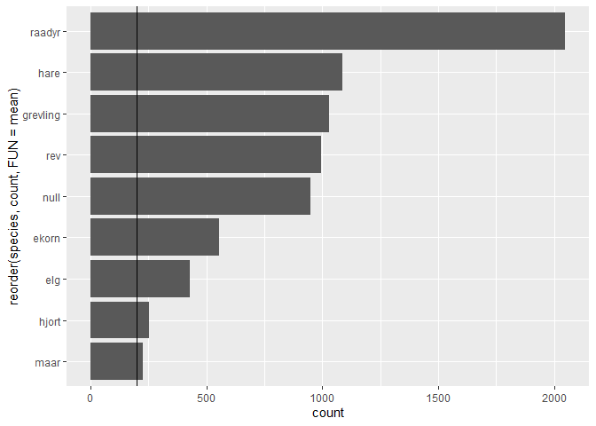
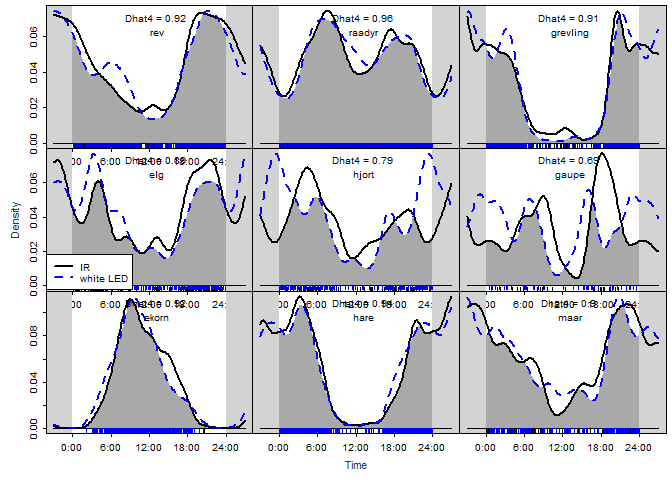
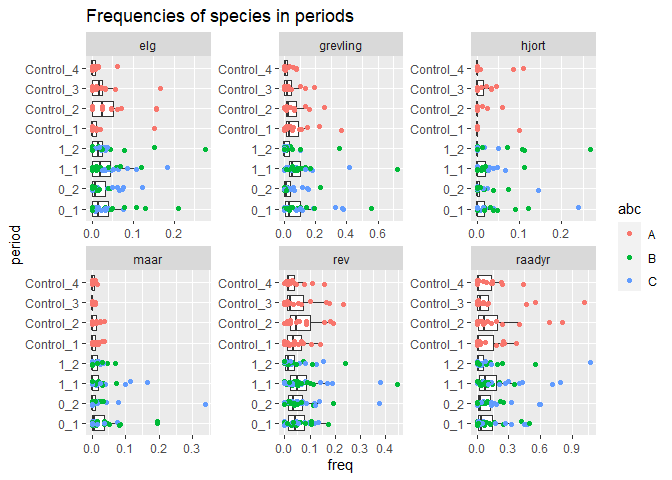

Flashing Large Mammals - exploring the data
================
Torgeir Holmgard Valle
08 april, 2021

``` r
library(tidyverse)
```

    ## -- Attaching packages --------------------------------------- tidyverse 1.3.0 --

    ## v ggplot2 3.3.3     v purrr   0.3.4
    ## v tibble  3.1.0     v dplyr   1.0.5
    ## v tidyr   1.1.3     v stringr 1.4.0
    ## v readr   1.4.0     v forcats 0.5.1

    ## -- Conflicts ------------------------------------------ tidyverse_conflicts() --
    ## x dplyr::filter() masks stats::filter()
    ## x dplyr::lag()    masks stats::lag()

``` r
library(lubridate)
```

    ## 
    ## Attaching package: 'lubridate'

    ## The following objects are masked from 'package:base':
    ## 
    ##     date, intersect, setdiff, union

``` r
library(overlap)
library(sf) # for handling spatial data
```

    ## Linking to GEOS 3.9.0, GDAL 3.2.1, PROJ 7.2.1

``` r
# All the tibbles from Data_explor_setup.R, and package + function from Density.R
obs      <- readRDS("Observations_prepared1.rds") %>%
  mutate(species = validated_species)
stations <- readRDS("stations.rds")
# Tweaking obs to resemble time.dep in glmm_sp.Rmd
ctrl <- c("Control_1", "Control_2", "Control_3","Control_4")
effort   <- readRDS("Effort_prepared.rds") %>%
    mutate(flash = factor(
            ifelse(period %in% ctrl, "Control", flash)), # Including Control in flash
          week = lubridate::isoweek(date), # extracting week-column
          period = factor(period, labels = c("IR_1", "IR_2", "LED_1", "LED_2", # turning period into a factor
                          "Control_1", "Control_2", "Control_3", "Control_4"))) # and relabeling periods
effort <- effort %>% 
   mutate(flash = factor(flash, levels = c("Control","0","1"),
                ordered = T, labels = c("Control","IR","LED"))) # relevel to make Control the model intercept
```

# Presenting the data

``` r
min(obs$date) # [1] "2019-01-15"
```

    ## [1] "2019-01-15"

``` r
max(obs$date) # [1] "2020-02-17"  #but last field date was 2020-02-26 at camera 850 & 822!!
```

    ## [1] "2020-02-26"

``` r
sp_focus <- c("ekorn", "elg", "grevling", "hare", "raadyr", "rev")
obstation <- obs %>% left_join(stations, by = "loc") %>% filter(species %in% sp_focus) %>%
  unite(abc, abc, flash) # unite lager ny faktor med alle kombinasjoner

#obstation %>% with(table(species, abc)) %>% 
 # knitr::kable(caption = "Table with kable")

# Total nr of image (rapidfire)series can be presented by:
length(unique(obs$timeserie_id)) # identical numbers for timeserie_id and image_id
```

    ## [1] 25710

``` r
length(unique(obs$image_id))     # is it because only one picture is selected per timeseries?
```

    ## [1] 25710

``` r
# obs_by_loc <- obs %>% group_by(loc) %>% summarise(n = length(timeserie_id)) %>% arrange(desc(n))
# plot(obs_by_loc)

x <- obs %>% left_join(stations) %>% group_by(abc, loc, cam_mod) %>% 
  summarise(n=n())
```

    ## Joining, by = "loc"

    ## `summarise()` has grouped output by 'abc', 'loc'. You can override using the `.groups` argument.

``` r
x %>% group_by(abc) %>% count() %>% pander::pander()
```

| abc |  n  |
|:---:|:---:|
|  A  | 19  |
|  B  | 19  |
|  C  | 18  |

``` r
x %>% group_by(cam_mod) %>% count() %>% pander::pander()
```

| cam\_mod |  n  |
|:--------:|:---:|
| Reconyx  | 25  |
| Browning | 31  |

``` r
stations %>% group_by(cam_mod) %>% count() %>% pander::pander()
```

| cam\_mod |  n  |
|:--------:|:---:|
| Reconyx  | 27  |
| Browning | 33  |

## Timeseries plot of periods from the troubleshooting and organisation with Neri

    ##     loc       date timeserie_id image_id dataset    captured_at_exif
    ## 1  1254 2019-04-14       308526  1972038    2600 2019:04:14 04:39:44
    ## 2  1254 2019-05-03       308522  1971502    2600 2019:05:03 05:21:12
    ## 3  1254 2019-05-06       308486  1971805    2600 2019:05:06 05:30:01
    ## 4  1254 2019-05-29       308520  1971365    2600 2019:05:29 04:26:04
    ## 5  1254 2019-08-25       534413  3692706    4444 2019:08:25 05:49:40
    ## 6    15 2019-08-12       482569  3171229    3910 2019:08:12 04:17:41
    ## 7    15 2019-09-17       519314  3411930    4156 2019:09:17 05:48:00
    ## 8   257 2019-04-25       302328  1935752    2531 2019:04:25 05:41:40
    ## 9   257 2019-05-08       302308  1935770    2531 2019:05:08 04:26:39
    ## 10  835 2019-06-26       450345  2945631    3646 2019:06:26 03:41:37
    ## 11  842 2019-05-21       303309  1946977    2540 2019:05:21 03:10:04
    ## 12  843 2019-04-06       286407  1847469    2404 2019:04:06 04:57:50
    ## 13  848 2019-05-17       304291  1952097    2549 2019:05:17 04:06:31
    ##        predicted_species distance num_animals            datetime
    ## 1         {"nothing": 1}     <NA>           1 2019-04-14 04:39:44
    ## 2  {"ekorn": 0.97147983}     <NA>           1 2019-05-03 05:21:12
    ## 3         {"nothing": 1}     <NA>           1 2019-05-06 05:30:01
    ## 4         {"nothing": 1}     <NA>           1 2019-05-29 04:26:04
    ## 5         {"nothing": 1}     <NA>           1 2019-08-25 05:49:40
    ## 6         {"nothing": 1}        1           1 2019-08-12 04:17:41
    ## 7         {"nothing": 1}        2           1 2019-09-17 05:48:00
    ## 8         {"nothing": 1}        3           1 2019-04-25 05:41:40
    ## 9         {"nothing": 1}        2           1 2019-05-08 04:26:39
    ## 10 {"ekorn": 0.99724966}     <NA>           1 2019-06-26 03:41:37
    ## 11        {"nothing": 1}     <NA>           1 2019-05-21 03:10:04
    ## 12        {"nothing": 1}     <NA>           1 2019-04-06 04:57:50
    ## 13        {"nothing": 1}     <NA>           1 2019-05-17 04:06:31
    ##    Kam.nr. til blitskamera validated_species flash period species hour
    ## 1                     3173             ekorn     1    1_1   ekorn    4
    ## 2                     3173             ekorn     1    1_1   ekorn    5
    ## 3                     3173             ekorn     1    1_1   ekorn    5
    ## 4                     3173             ekorn     1    1_1   ekorn    4
    ## 5                     3173             ekorn     1    1_2   ekorn    5
    ## 6                     3201             ekorn     1    1_2   ekorn    4
    ## 7                     3201             ekorn     1    1_2   ekorn    5
    ## 8                     3211             ekorn     1    1_1   ekorn    5
    ## 9                     3211             ekorn     1    1_1   ekorn    4
    ## 10                    3186             ekorn     1    1_1   ekorn    3
    ## 11                    3197             ekorn     1    1_1   ekorn    3
    ## 12                    3185             ekorn     1    1_1   ekorn    4
    ## 13                    3196             ekorn     1    1_1   ekorn    4

``` r
p_eff <- effort %>%
  mutate(trt_gr = ifelse(period %in% ctrl, "Control", "Treatment"), # faceting factor
         # renaming control-groups in order to extract period-breaks, and not confuse with ctrl_1,2,3,4
         flash = factor(ifelse(period %in% ctrl[c(2,4)], 4, flash), ordered = T,
                      levels = c(2,3,1,4),
                      labels = c("IR", "White LED","Control","period splits added for analysis"))) %>% 
ggplot() +
  facet_grid(rows = "trt_gr", scales = "free_y", space = "free_y") +
  geom_point(aes(date, as.factor(loc), col=flash), size = 0.9) +
  theme_classic() + labs(y = "Location") +
  theme(axis.ticks.y = element_blank(), axis.text.y = element_blank(),
        legend.position = "top")+
  scale_color_manual(values = c("#abd9e9","#4575b4",     # ctrl-col
                                 "#fdae61","#f46d43")) + # trt-col
  scale_x_date(NULL, breaks = f_work, date_labels = "%d-%b",
               sec.axis = sec_axis(~., breaks = c(c$c,f_work[10]), labels = scales::date_format("%d-%b %y") ) ) +
  geom_vline(xintercept = f_work, linetype = "dashed",  alpha =.5) +
  geom_rect(data = rects, aes(xmin = xstart, xmax = xend, ymin = -Inf, ymax = Inf),
            alpha = 0.1 )
p_eff +   theme(legend.title = element_blank()) +
  guides(colour = guide_legend(override.aes = list(size = 2), #ncol = 2, 
                               reverse = F, byrow = T), #adjust rows of legend
                x = guide_axis(n.dodge = 2)) # dodge axis text into n rows
```

<!-- -->

``` r
                # x = guide_axis(angle = -10))  #adjust axis-text angle
```

------------------------------------------------------------------------

# Some final plots I want to add in my thesis

## Maps

    ## Classes 'sf' and 'data.frame':   53 obs. of  2 variables:
    ##  $ navn    : chr  "Hvaler" "Fredrikstad" "Råde" "Sarpsborg" ...
    ##  $ geometry:sfc_POLYGON of length 53; first list element: List of 1
    ##   ..$ : num [1:63, 1:2] 596106 595326 594861 593803 593685 ...
    ##   ..- attr(*, "class")= chr [1:3] "XY" "POLYGON" "sfg"
    ##  - attr(*, "sf_column")= chr "geometry"
    ##  - attr(*, "agr")= Factor w/ 3 levels "constant","aggregate",..: NA
    ##   ..- attr(*, "names")= chr "navn"

    ## Simple feature collection with 60 features and 3 fields
    ## Geometry type: MULTIPOINT
    ## Dimension:     XY
    ## Bounding box:  xmin: 516948 ymin: 6581339 xmax: 619655 ymax: 6701802
    ## Projected CRS: ED50 / UTM zone 32N
    ## First 10 features:
    ##     loc  cam_mod abc                       geometry
    ## 1  1254 Browning   B MULTIPOINT ((516948 6701802...
    ## 2   855 Browning   A MULTIPOINT ((516948 6701802...
    ## 3   824 Browning   C MULTIPOINT ((516948 6701802...
    ## 4   828 Browning   C MULTIPOINT ((516948 6701802...
    ## 5  1255 Browning   A MULTIPOINT ((516948 6701802...
    ## 6   834 Browning   B MULTIPOINT ((516948 6701802...
    ## 7   825 Browning   B MULTIPOINT ((516948 6701802...
    ## 8   829 Browning   C MULTIPOINT ((516948 6701802...
    ## 9   863 Browning   A MULTIPOINT ((516948 6701802...
    ## 10  861 Browning   A MULTIPOINT ((516948 6701802...

    ## [1] "sf"         "data.frame"

    ## Classes 'sf' and 'data.frame':   60 obs. of  4 variables:
    ##  $ loc     : int  1254 855 824 828 1255 834 825 829 863 861 ...
    ##  $ cam_mod : Factor w/ 2 levels "Reconyx","Browning": 2 2 2 2 2 2 2 2 2 2 ...
    ##  $ abc     : chr  "B" "A" "C" "C" ...
    ##  $ geometry:sfc_MULTIPOINT of length 60; first list element:  'XY' int [1:60, 1:2] 516948 530220 529884 529481 528206 534627 535199 536947 540277 540095 ...
    ##  - attr(*, "sf_column")= chr "geometry"
    ##  - attr(*, "agr")= Factor w/ 3 levels "constant","aggregate",..: NA NA NA
    ##   ..- attr(*, "names")= chr [1:3] "loc" "cam_mod" "abc"

``` r
library(maps)
```

    ## 
    ## Attaching package: 'maps'

    ## The following object is masked from 'package:purrr':
    ## 
    ##     map

``` r
library(tmap)
Norge <- map("world",'Norway', plot = FALSE, fill = TRUE)
Norge <- st_as_sf(Norge)
ggplot() + geom_sf(data = Norge)
```

<!-- -->

``` r
Scandinavia <- st_as_sf(map("world",c("Norway","Sweden", "Finland","Denmark","UK",
                                      "Germany", "Estonia", "Latvia","Lithuania"), plot = F, fill = T))
# loc_trans <- st_sfc(loc_sf, crs=)
xy <- st_bbox(loc_sf) # retrieve xlim+ylim from geometry
ggplot() +
  geom_sf(data =Scandinavia) +
#  geom_sf(data = Viken, fill = "blue", alpha = .02) +  # Viken polygon
#  geom_sf(data = loc_sf, fill = "blue", alpha = .2) +  # loc range

  # annotate("rect", xmin = xy[1], xmax = xy[3],
  #        ymin = xy[2], ymax = xy[4],
  #        alpha = .4) +
   annotate(geom="rect", xmin = 9.3, xmax = 11.5, # i samsvar med excel-
            ymin = 59.3, ymax = 60.5,              # kjørearket mitt
            alpha = .5, col = "black") +
  coord_sf(xlim = c(0.7,25), ylim = c(57,71)) +
  theme_bw()
```

<!-- -->

``` r
# ggmap(Norge1) + 
#   theme_void() +
#   theme(
#     plot.title = element_text(colour = "orange"), 
#     panel.border = element_rect(colour = "grey", fill=NA, size=2)
#   ) +   annotate(geom="rect", xmin = 9.28, xmax = 11.4, # i samsvar med excel-
#             ymin = 59.2, ymax = 60.5,              # kjørearket mitt
#             alpha = .5, col = "black")
```

``` r
# Library
library(sf)
library(ggspatial)
library(ggmap)
```

    ## Google's Terms of Service: https://cloud.google.com/maps-platform/terms/.

    ## Please cite ggmap if you use it! See citation("ggmap") for details.

``` r
library(gridExtra)
```

    ## 
    ## Attaching package: 'gridExtra'

    ## The following object is masked from 'package:dplyr':
    ## 
    ##     combine

``` r
library(cowplot)
```

    ## 
    ## Attaching package: 'cowplot'

    ## The following object is masked from 'package:ggmap':
    ## 
    ##     theme_nothing

    ## The following object is masked from 'package:lubridate':
    ## 
    ##     stamp

``` r
p_norge <- ggplot() +
  geom_sf(data = Norge) + #fill= "antiquewhite"
#  geom_sf(data = Viken, fill = "blue", alpha = .02) +  # Viken polygon
#  geom_sf(data = loc_sf, fill = "blue", alpha = .2) +  # loc range
   annotate(geom="rect", xmin = 9.3, xmax = 11.5, # i samsvar med excel-
                         ymin = 59.3, ymax = 60.5,# kjørearket mitt
                         col = "black", #alpha = .5, 
                         fill = NA) +
  coord_sf(xlim = c(0.7,31), ylim = c(57,71)) +
  theme_void()

# mysite <- c(11.5, 60.5, 9.3, 59.3)
# mysite2 <- c(11, 60, 9, 59)

p <-
  get_googlemap(center = c(lon = 10.3, lat = 59.9), #location =  mysite ,
                    zoom = 8, 
                    scale = 2, #size = c(2000, 1500),
                    maptype ='hybrid',
                   source = "google",
                   style = c(feature = "all", element = "labels", visibility = "off"),
                  # crop=F
           ) %>% ggmap( extent = "device")  + theme_void() + theme(legend.position = "none") +
          geom_point(aes(x = lon, y = lat,  colour = cam_mod), 
               data = stations, size = 2.2)
```

    ## Source : https://maps.googleapis.com/maps/api/staticmap?center=59.9,10.3&zoom=8&size=640x640&scale=2&maptype=hybrid&style=feature:all%7Celement:labels%7Cvisibility:off&key=xxx

``` r
p1 <- p  + scale_color_manual(values = c("#d73027","#4575b4", "white")) +  
  geom_point(aes(x=lon, y=lat, colour = "white LED "), 
             data = filter(stations, !abc  %in% "C"), size = .7 )
```

``` r
ggdraw(p_norge, xlim = c(0.325,1)) +
  draw_plot(
    {
      p1 + 
        theme(legend.position = c(.85, .95), legend.justification = c(.5, 1), #legend placement
        legend.title = element_blank(), #legend.key.size = unit(2, 'mm'),
        legend.background = element_rect(fill="darkgray", size=.5))
      },
    # The distance along a (0,1) x-axis to draw the left edge of the plot
    x = 0.55, 
    # The distance along a (0,1) y-axis to draw the bottom edge of the plot
    y = 0.02,
    # The width and height of the plot expressed as proportion of the entire ggdraw object
    width = 0.5, 
    height = 0.85)+
  draw_line(
    x = c(.44, 0.596, 0.596, 0.44),
    y = c(0.196, 0.02, 0.87, 0.27),
    color = "black", size = .5, linetype = "dashed",
  ) + theme(legend.position = c(1,1))
```

<!-- -->

``` r
loc_brown <- filter(loc_sf, cam_mod %in% "Browning")
ggplot(data = Viken) +
        geom_sf() +     # Viken
        # geom_sf_label(aes(label = navn)) + #denne kommandoen kan også hente ut namnelapper
       # geom_sf_text(aes(label = navn)) + #denne kommandoen kan også hente ut namnelapper
        geom_sf(data = loc_brown, size = 2,   # CT sites
        show.legend = "point", color="brown") + #alle loc får begge cam_mod levels ...
        theme_minimal() +
        theme(axis.title = element_blank()) +
        coord_sf(xlim = xy[c(1,3)], ylim = xy[c(2,4)])
```

<!-- -->

## Which species did we get?

``` r
sp_all <- c("hare", "elg", "rev", "grevling", "maar", "gaupe", "ekorn", "raadyr", "hjort") # interesting species with enough datapoints
by_sp <- obs %>%
  left_join(stations, by = "loc") %>%
  group_by(species)
passes <- summarise(by_sp,
  count = n(),   # flashed = mean(flash, na.rm = T), # don't know if i can find a relevant use of this
  abc = abc, period = period, flash = flash)
```

    ## `summarise()` has grouped output by 'species'. You can override using the `.groups` argument.

``` r
passes %>% 
  filter(!is.na(species), !(species %in% "nothing")) %>% 
  ggplot() +
  geom_bar(aes(reorder(species, count, FUN = mean)), position = "dodge") +  # shows actual counts of each species
  geom_hline(yintercept = 200) + coord_flip() # flip the axes
```

<!-- -->

``` r
passes %>% filter(!species %in% c("nothing","null") ) %>% 
  summary(n = n())
```

    ##    species              count          abc               period         
    ##  Length:10600       Min.   :   1   Length:10600       Length:10600      
    ##  Class :character   1st Qu.: 578   Class :character   Class :character  
    ##  Mode  :character   Median :1031   Mode  :character   Mode  :character  
    ##                     Mean   :1115                                        
    ##                     3rd Qu.:1557                                        
    ##                     Max.   :2049                                        
    ##      flash       
    ##  Min.   :0.0000  
    ##  1st Qu.:0.0000  
    ##  Median :0.0000  
    ##  Mean   :0.3094  
    ##  3rd Qu.:1.0000  
    ##  Max.   :1.0000

``` r
# most datapoints on ekorn, elg, grevling, hare, raadyr, rev, 
fjern <- c("nothing","hund", "menneske", "kjoeretoey", "motorsykkel", "ukjent", "sau", "ku", "fugl") # uninteresting or too general groups
p_sp_focus <- passes %>% 
  filter(count > 200, !(species %in% fjern), !is.na(species)) %>%  # removing low counts and sp in 'fjern'
  ggplot() + scale_fill_brewer() + geom_hline(yintercept = 200) + coord_flip()
p_sp_focus + geom_bar(aes(reorder(species, count, FUN = mean)), position = "dodge") + geom_hline(yintercept = 200) # same as first plot, more filtered
```

<!-- -->

``` r
p_sp_focus + geom_bar(aes(abc, fill = species), position = "dodge")  # same as first plot, more filtered
```

<!-- -->

``` r
p_sp_focus + geom_bar(aes(period, fill = species), position = "dodge")
```

<!-- -->

``` r
p_sp_focus + geom_bar(aes(flash, fill = species), position = "dodge")
```

<!-- -->

Removing sightings of “nothing”, things related to humans, as well as
NAs and birds (too general group), I am left with quite a few species
still. Filtering for counts lower than 200 renders me the selection
shown in the dark themed plots.

Roe deer and red fox are the species with decidedly most data. The flash
true/false-plot reveals similar proportions of detection abundances
between the eight most common species.

## Density plots showing activity patterns with and without flash

``` r
overlap_flash("rev", "red", rug = TRUE) 
```

<!-- -->

``` r
overlap_flash_2sp("rev", "raadyr", "red", "blue", rug=TRUE)
```

<!-- -->

Sites without white flash produces a more bumpy curve than does the
sites with a flash. Proportion of foxes at sites are markedly lower
before sunrise, and then higher afterwards. Could this simply be because
of a lower detection rate when lacking the additional white flash? There
is a resembling phenomenon happening in the evening twilight as well,
right before the peak activity time of the fox, which happens before
midnight.

The Dhat4 calculation reveals a larger difference in activity for foxes,
than for roe deer, but seems to mainly stem from the twilight hours.
Thus, it could be because of the size of the animals, rather than a
reaction to the flash.

### Separate plot for each species

``` r
sp <- c("rev", "raadyr", "grevling", "elg", "hjort", "gaupe", "ekorn", "hare", "maar")
# 1. Open jpeg file
png("png/rev.png")
# jpeg(cat(".jpg"), width = 350, height = "350")
# 2. Create the plot
overlap_flash(sp[1], rug = TRUE, main = "")
# 3. Close the file
dev.off()
```

### One plot for all species

``` r
sp <- c("rev", "raadyr", "grevling", "elg", "hjort", "gaupe", "ekorn", "hare", "maar")
par(mfrow = c(3, 3))
 par(cex = 0.6)
 par(mar = c(0, 0, 0, 0), oma = c(4, 4, 0.5, 0.5))
 par(tcl = -0.25)
 par(mgp = c(2, 0.6, 0))
overlap_flash(sp[1], main=NULL, rug=T) 
   legend("top", legend = str_c("\n ",sp[1]), bty = "n") # art 
for (i in sp[2:3]) {
 overlap_flash(i, axes = FALSE,  ann=F, rug=T, xaxt="n")
  legend("top", legend = str_c("\n ",i), bty = "n") # art
}
overlap_flash(sp[4], main=NULL, rug=T) 
   legend("top", legend = str_c("\n ",sp[4]), bty = "n") # art 
   legend(x=-4.2, y=0.018, legend = c("IR", "white LED"), #x+y sets legend position
         col = c("black","blue"), lty = c(1, 2), lwd = 2, bty = "o")
for (i in sp[5:6]){
 overlap_flash(i, axes = FALSE,  ann=F, rug=T) 
   legend("top", legend = str_c("\n ",i), bty = "n") # art
}
overlap_flash(sp[7], main=NULL, rug=T) 
   legend("top", legend = str_c("\n ",sp[7]), bty = "n") # art 
for (i in sp[8:9]){
 overlap_flash(i, axes = FALSE,  ann=F, rug=T) 
   legend("top", legend = str_c("\n ",i), bty = "n") # art
}
 mtext("Time", side = 1, outer = TRUE, cex = 0.7, line = 2.2,
 col = "grey20")
 mtext("Density", side = 2, outer = TRUE, cex = 0.7, line = 2.2,
 col = "grey20")
```

<!-- -->

### Controlling for day-length

``` r
# Dates <- as.POSIXct(obs$date, tz="CET")
# coords <- matrix(c(60.1, 10.6), nrow=1) # Rett nord for Oslo i longlat
# Coords <- sp::SpatialPoints(coords, proj4string=sp::CRS("+proj=longlat +datum=WGS84"))
# st <- sunTime(obs$rad, Dates, Coords)
# 
# par(mfrow=2:1)
# densityPlot(st, col='red', lwd=2, xaxt='n', main="Sun time")
# axis(1, at=c(0, 6, 12, 18, 24),
#   labels=c("midnight", "sunrise", "noon", "sunset", "midnight"))
# densityPlot(simCalls$time, lwd = 2, main = "Clock time")
# par(mfrow=c(1,1))

# TODO # Sjå density.r for oppdatert skript 
```

## Box plots

### of periods

``` r
freq     <- readRDS("freq.rds") %>%  #from line 79 in Data_exploration2_nesting.R
  mutate(species = validated_species)
# Setting 20 days as an arbitrary limit
freq <- freq[freq$n.days > 19, ]
# frequency on periods, single or plural species
sp <- c("elg", "grevling","hjort", "maar", "raadyr", "rev") # Species with the most datapoints
p_freq_per <- freq %>% # plot of frequency grouped by period
  filter(species %in% sp) %>%
  left_join(stations, by = "loc") %>%
  ggplot(aes(period, freq)) +
  facet_wrap(~species, scales = "free", nrow = 2) +
  labs(title = "Frequencies of species in periods")

# coloured with abc-grouping
p_freq_per + geom_boxplot(outlier.shape = NA) + # Remove outliers when overlaying boxplot with original data points
  geom_jitter(aes(col = abc), width = 0.1) + coord_flip() # add points for each camera
```

<!-- -->

### of flash on/of

``` r
freq %>% # plot of frequency grouped by abc and flash T/F
  filter(species %in% sp) %>%
  left_join(stations, by = "loc") %>%
  ggplot(aes(abc, freq)) +
  facet_wrap(~species, scales = "free", nrow = 2) + # scales = "free"
  labs(title = "Frequencies of species w/ | w/o flash") +
  geom_boxplot(aes(fill = flash))
```

<!-- -->

### Blank images

``` r
# Filtering out timelapse-pictures in Reconyx (455 is the only Browning-camera that has significant number of pictures here)
timelapse <- obs %>% left_join(stations, by = "loc") %>%
  filter(hour %in% c(8, 13) & mins == 0  &  secs == 0  &  species == "nothing") # == "nothing" to single out tinelapse-photos
summary(timelapse)
table(timelapse$hour[timelapse$cam_mod =="Reconyx"])

table(timelapse$cam_mod)


# table(timelapse$loc[timelapse$cam_mod == "Browning"])  #455 maybe has two cameras?
# table(timelapse$species)  # when val_sp == "nothing" not specified: 10 other species present
# table(timelapse$species[timelapse$hour == 13]) # elg:1, maar:2, menneske:3, raadyr:1
# table(timelapse$species[timelapse$hour == 8]) # ekorn:1, fugl:9, gaupe:1, katt:1, menneske:1, raadyr:4, rev:2, ukjent:4

# Differentiate "nothing"-sequences and "nothing"-one-shots
# species == "nothing" #by loc,
# and making an "independent event" criteria to distinguish repeated vegetation-triggering and other single-triggered events. 
# TODO
library(data.table)
setDT(obs)[, event_id := 1L + cumsum(c(0L, diff(datetime) > 720)), by=.(loc, species)]

# TODO obs %>% group_by(species, event_id) %>% filter(species == "nothing") %>% table(obs$loc)


names(obs)
```

------------------------------------------------------------------------

# Models with spatial covariates

## Summary of spatial variables

``` r
obs$house_d2 %>% summary()
```

    ##    Min. 1st Qu.  Median    Mean 3rd Qu.    Max.    NA's 
    ##   111.8   269.3   495.0   632.9   813.9  2961.8    1336

## Transforming the variables, and looking at correlations

``` r
obs$forestroad_d2_ln<-ifelse(obs$forestroad_d2>0,log(obs$forestroad_d2), 0)
obs$forestroad_d2_io <- ifelse(obs$forestroad_d2>10, 0, 1)
obs$house_d2_ln<-ifelse(obs$house_d2>0,log(obs$house_d2), 0)
# plotting distances
qplot(forestroad_d2_io, loc, data =obs)
```

    ## Warning: Removed 1336 rows containing missing values (geom_point).

<!-- -->

``` r
qplot(house_d2, loc, data =obs)
```

    ## Warning: Removed 1336 rows containing missing values (geom_point).

<!-- -->

``` r
library(reshape2) # for melt function
```

    ## 
    ## Attaching package: 'reshape2'

    ## The following object is masked from 'package:tidyr':
    ## 
    ##     smiths

``` r
p_theme <- theme(
  panel.grid.major.x = element_blank(),panel.grid.minor.x = element_blank(),
  panel.grid.minor.y = element_blank(),axis.text.x = element_blank())   
  #theme(panel.background = element_rect(fill = "white", colour = "grey50"))

obs %>% melt(id = "loc", measure = c("forestroad_d2", "house_d2")) %>% 
  ggplot(aes(as.factor(loc), value)) + geom_point(aes(col=variable)) + 
  labs(title = "Distance") + p_theme 
```

    ## Warning: Removed 2672 rows containing missing values (geom_point).

<!-- -->

``` r
obs %>% melt(id = "loc", measure = c("forestroad_d2_ln", "house_d2_ln")) %>% 
  ggplot(aes(as.factor(loc), value)) + geom_point(aes(col=variable)) + 
  geom_smooth(span = 0.7) + labs(title = "Log-transformed distance") +
  p_theme #+ theme(legend.position = "top")
```

    ## `geom_smooth()` using method = 'gam' and formula 'y ~ s(x, bs = "cs")'

    ## Warning: Removed 2672 rows containing non-finite values (stat_smooth).

    ## Warning: Removed 2672 rows containing missing values (geom_point).

<!-- -->

``` r
ggplot(obs, aes(forestroad_d2, house_d2)) + geom_point() + 
  geom_smooth(method = "glm", formula = y ~ x, se = T) +
  labs(title = "Distance correlation")
```

    ## Warning: Removed 1336 rows containing non-finite values (stat_smooth).

    ## Warning: Removed 1336 rows containing missing values (geom_point).

<!-- -->

``` r
  #geom_smooth(span =.5)
library(corrplot)
```

    ## corrplot 0.84 loaded

``` r
covs %>% select(!c(1,3,4)) %>% cor() %>% 
corrplot(type = "upper", method = "number")
```

<!-- -->

``` r
names(covs)
```

    ##  [1] "LokalitetID"   "Latitude"      "Longitude"     "geometry"     
    ##  [5] "elev"          "slope"         "house_dens"    "build_dens"   
    ##  [9] "field_dens"    "house_d2"      "build_d2"      "field_d2"     
    ## [13] "forestroad_d2" "publicroad_d2"

# Session Info

``` r
sessionInfo()
```

    ## R version 4.0.4 (2021-02-15)
    ## Platform: x86_64-w64-mingw32/x64 (64-bit)
    ## Running under: Windows 10 x64 (build 19041)
    ## 
    ## Matrix products: default
    ## 
    ## locale:
    ## [1] LC_COLLATE=Norwegian Bokmål_Norway.1252 
    ## [2] LC_CTYPE=Norwegian Bokmål_Norway.1252   
    ## [3] LC_MONETARY=Norwegian Bokmål_Norway.1252
    ## [4] LC_NUMERIC=C                            
    ## [5] LC_TIME=Norwegian Bokmål_Norway.1252    
    ## 
    ## attached base packages:
    ## [1] stats     graphics  grDevices utils     datasets  methods   base     
    ## 
    ## other attached packages:
    ##  [1] corrplot_0.84    reshape2_1.4.4   cowplot_1.1.1    gridExtra_2.3   
    ##  [5] ggmap_3.0.0      ggspatial_1.1.5  tmap_3.3         maps_3.3.0      
    ##  [9] sf_0.9-8         overlap_0.3.3    lubridate_1.7.10 forcats_0.5.1   
    ## [13] stringr_1.4.0    dplyr_1.0.5      purrr_0.3.4      readr_1.4.0     
    ## [17] tidyr_1.1.3      tibble_3.1.0     ggplot2_3.3.3    tidyverse_1.3.0 
    ## 
    ## loaded via a namespace (and not attached):
    ##  [1] nlme_3.1-152        bitops_1.0-6        fs_1.5.0           
    ##  [4] RColorBrewer_1.1-2  httr_1.4.2          tools_4.0.4        
    ##  [7] backports_1.2.1     utf8_1.1.4          R6_2.5.0           
    ## [10] KernSmooth_2.23-18  mgcv_1.8-34         DBI_1.1.1          
    ## [13] colorspace_2.0-0    raster_3.4-5        withr_2.4.1        
    ## [16] sp_1.4-5            tidyselect_1.1.0    leaflet_2.0.4.1    
    ## [19] curl_4.3            compiler_4.0.4      leafem_0.1.3       
    ## [22] cli_2.3.1           rvest_1.0.0         xml2_1.3.2         
    ## [25] labeling_0.4.2      scales_1.1.1        classInt_0.4-3     
    ## [28] digest_0.6.27       rmarkdown_2.7.3     jpeg_0.1-8.1       
    ## [31] base64enc_0.1-3     dichromat_2.0-0     pkgconfig_2.0.3    
    ## [34] htmltools_0.5.1.1   dbplyr_2.1.0        highr_0.8          
    ## [37] htmlwidgets_1.5.3   rlang_0.4.10        readxl_1.3.1       
    ## [40] rstudioapi_0.13     farver_2.1.0        generics_0.1.0     
    ## [43] jsonlite_1.7.2      crosstalk_1.1.1     magrittr_2.0.1     
    ## [46] Matrix_1.3-2        Rcpp_1.0.6          munsell_0.5.0      
    ## [49] fansi_0.4.2         abind_1.4-5         lifecycle_1.0.0    
    ## [52] stringi_1.5.3       leafsync_0.1.0      yaml_2.2.1         
    ## [55] plyr_1.8.6          tmaptools_3.1-1     grid_4.0.4         
    ## [58] parallel_4.0.4      crayon_1.4.1        lattice_0.20-41    
    ## [61] splines_4.0.4       stars_0.5-1         haven_2.3.1        
    ## [64] pander_0.6.3        hms_1.0.0           knitr_1.31         
    ## [67] pillar_1.5.1        rjson_0.2.20        codetools_0.2-18   
    ## [70] reprex_1.0.0        XML_3.99-0.5        glue_1.4.2         
    ## [73] evaluate_0.14       modelr_0.1.8        vctrs_0.3.6        
    ## [76] png_0.1-7           RgoogleMaps_1.4.5.3 cellranger_1.1.0   
    ## [79] gtable_0.3.0        assertthat_0.2.1    xfun_0.22          
    ## [82] lwgeom_0.2-5        broom_0.7.5         e1071_1.7-4        
    ## [85] class_7.3-18        viridisLite_0.3.0   units_0.7-0        
    ## [88] ellipsis_0.3.1

``` r
# packrat
# checkpoint
```

If you want your code to be reproducible in the long-run (i.e. so you
can come back to run it next month or next year), you’ll need to track
the versions of the packages that your code uses. A rigorous approach is
to use *packrat*, [link](http://rstudio.github.io/packrat/), which
stores packages in your project directory, or *checkpoint*,
[link](https://github.com/RevolutionAnalytics/checkpoint), which will
reinstall packages available on a specified date. A quick and dirty hack
is to include a chunk that runs sessionInfo() — that won’t let you
easily recreate your packages as they are today, but at least you’ll
know what they were.
