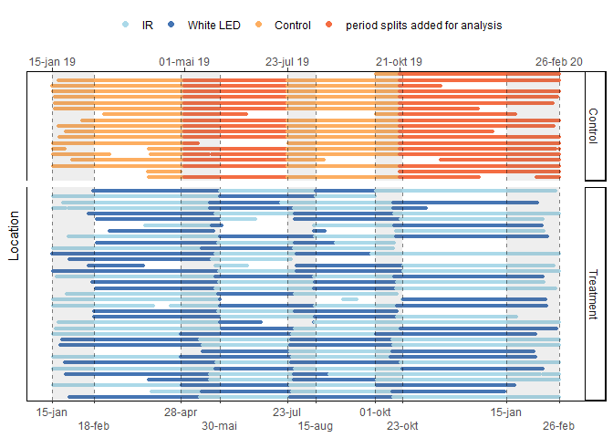
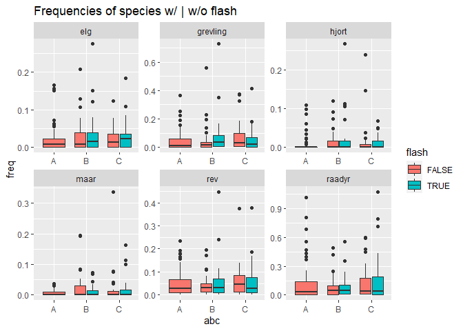

Flashing Large Mammals - exploring the data
================
Torgeir Holmgard Valle
09 mars, 2021

``` r
library(tidyverse)
```

    ## -- Attaching packages --------------------------------------- tidyverse 1.3.0 --

    ## v ggplot2 3.3.3     v purrr   0.3.4
    ## v tibble  3.1.0     v dplyr   1.0.5
    ## v tidyr   1.1.3     v stringr 1.4.0
    ## v readr   1.4.0     v forcats 0.5.0

    ## Warning: package 'tibble' was built under R version 4.0.4

    ## -- Conflicts ------------------------------------------ tidyverse_conflicts() --
    ## x dplyr::filter() masks stats::filter()
    ## x dplyr::lag()    masks stats::lag()

``` r
library(lubridate)
```

    ## 
    ## Attaching package: 'lubridate'

    ## The following objects are masked from 'package:base':
    ## 
    ##     date, intersect, setdiff, union

``` r
library(overlap)
library(sf) # for handling spatial data
```

    ## Linking to GEOS 3.9.0, GDAL 3.2.1, PROJ 7.2.1

``` r
# All the tibbles from Data_explor_setup.R, and package + function from Density.R
obs      <- readRDS("Observations_prepared1.rds") %>%
  mutate(species = validated_species)
stations <- readRDS("stations.rds")
# Tweaking obs to resemble time.dep in glmm_sp.Rmd
ctrl <- c("Control_1", "Control_2", "Control_3","Control_4")
effort   <- readRDS("Effort_prepared.rds") %>%
    mutate(flash = factor(
            ifelse(period %in% ctrl, "Control", flash)), # Including Control in flash
          week = lubridate::isoweek(date), # extracting week-column
          period = factor(period, labels = c("IR_1", "IR_2", "LED_1", "LED_2", # turning period into a factor
                          "Control_1", "Control_2", "Control_3", "Control_4"))) # and relabeling periods
effort <- effort %>% 
   mutate(flash = factor(flash, levels = c("Control","0","1"),
                ordered = T, labels = c("Control","IR","LED"))) # relevel to make Control the model intercept
```

# Presenting the data

``` r
min(obs$date) # [1] "2019-01-15"
```

    ## [1] "2019-01-15"

``` r
max(obs$date) # [1] "2020-02-17"  #but last field date was 2020-02-26 at camera 850 & 822!!
```

    ## [1] "2020-02-26"

``` r
sp_focus <- c("ekorn", "elg", "grevling", "hare", "raadyr", "rev")
obstation <- obs %>% left_join(stations, by = "loc") %>% filter(species %in% sp_focus) %>% unite(abc, abc, flash) # unite lager ny faktor med alle kombinasjoner

#obstation %>% with(table(species, abc)) %>% 
 # knitr::kable(caption = "Table with kable")

# Total nr of image (rapidfire)series can be presented by:
length(unique(obs$timeserie_id)) # identical numbers for timeserie_id and image_id
```

    ## [1] 25710

``` r
length(unique(obs$image_id))     # is it because only one picture is selected per timeseries?
```

    ## [1] 25710

``` r
# obs_by_loc <- obs %>% group_by(loc) %>% summarise(n = length(timeserie_id)) %>% arrange(desc(n))
# plot(obs_by_loc)

x <- obs %>% left_join(stations) %>% group_by(abc, loc) %>% 
  summarise(n=n())
```

    ## Joining, by = "loc"

    ## `summarise()` has grouped output by 'abc'. You can override using the `.groups` argument.

``` r
x %>% group_by(abc) %>% count() %>% pander::pander()
```

| abc |  n  |
|:---:|:---:|
|  A  | 19  |
|  B  | 19  |
|  C  | 18  |

## Timeseries plot of periods from the troubleshooting and organisation with Neri

``` r
p_eff <- effort %>%
  mutate(trt_gr = ifelse(period %in% ctrl, "Control", "Treatment"), # faceting factor
         flash = factor(ifelse(period %in% ctrl[c(2,4)], 4, flash), ordered = T, # colouring factor
                      levels = c(2,3,1,4), labels = c("IR", "LED", "Control", " "))) %>% 
ggplot() +
  facet_grid(rows = "trt_gr", scales = "free_y", space = "free_y") +
  geom_point(aes(date, as.factor(loc), col=flash), size = 0.9) +
  theme_classic() + labs(y = "Location") +
  theme(axis.ticks.y = element_blank(), axis.text.y = element_blank(),
        legend.position = "top")+
  # scale_color_manual(values = c(rep(c("#abd9e9","#4575b4"),each=2), # trt-colr
  #                               rep(c("#f46d43","#fdae61"),2) ), #ctrl-colr
  #                    labels = c("IR", "LED", "Control", "Control")) + 
  scale_color_manual(values = c(c("#abd9e9","#4575b4"),          # trt-colr
                                rep(c("#f46d43","#fdae61")) )) + # ctrl-colr
  guides(colour = guide_legend(override.aes = list(size = 2)), #adjust rows of legend
                x = guide_axis(n.dodge = 2)) # dodge axis text into n rows
                # x = guide_axis(angle = -10))  #adjust axis-text angle
p_eff +   theme(legend.title = element_blank()) +
  scale_x_date(NULL, breaks = f_work, date_labels = "%d-%b",
               sec.axis = sec_axis(~., breaks = c(c$c,f_work[10]), labels = scales::date_format("%d-%b %y") ) ) +
  geom_vline(xintercept = f_work, linetype = "dashed",  alpha =.5) +
  geom_rect(data = rects, aes(xmin = xstart, xmax = xend, ymin = -Inf, ymax = Inf),
            alpha = 0.1 )
```

<!-- -->

## Which species did we get?

``` r
sp_all <- c("hare", "elg", "rev", "grevling", "maar", "gaupe", "ekorn", "raadyr", "hjort") # interesting species with enough datapoints
by_sp <- obs %>%
  left_join(stations, by = "loc") %>%
  group_by(species)
passes <- summarise(by_sp,
  count = n(),   # flashed = mean(flash, na.rm = T), # don't know if i can find a relevant use of this
  abc = abc, period = period, flash = flash)
```

    ## `summarise()` has grouped output by 'species'. You can override using the `.groups` argument.

``` r
passes %>% 
  filter(!is.na(species), !(species %in% "nothing")) %>% 
  ggplot() +
  geom_bar(aes(reorder(species, count, FUN = mean)), position = "dodge") +  # shows actual counts of each species
  geom_hline(yintercept = 200) + coord_flip() # flip the axes
```

<!-- -->

``` r
# most datapoints on ekorn, elg, grevling, hare, raadyr, rev, 
fjern <- c("nothing","hund", "menneske", "kjoeretoey", "motorsykkel", "ukjent", "sau", "ku", "fugl") # uninteresting or too general groups
p_sp_focus <- passes %>% 
  filter(count > 200, !(species %in% fjern), !is.na(species)) %>%  # removing low counts and sp in 'fjern'
  ggplot() + scale_fill_brewer() + geom_hline(yintercept = 200) + coord_flip()
p_sp_focus + geom_bar(aes(reorder(species, count, FUN = mean)), position = "dodge") + geom_hline(yintercept = 200) # same as first plot, more filtered
```

<!-- -->

``` r
p_sp_focus + geom_bar(aes(abc, fill = species), position = "dodge")  # same as first plot, more filtered
```

<!-- -->

``` r
p_sp_focus + geom_bar(aes(period, fill = species), position = "dodge")
```

<!-- -->

``` r
p_sp_focus + geom_bar(aes(flash, fill = species), position = "dodge")
```

<!-- -->

Removing sightings of “nothing”, things related to humans, as well as
NAs and birds (too general group), I am left with quite a few species
still. Filtering for counts lower than 200 renders me the selection
shown in the dark themed plots.

Roe deer and red fox are the species with decidedly most data. The flash
true/false-plot reveals similar proportions of detection abundances
between the eight most common species.

## Density plots showing activity patterns with and without flash

``` r
overlap_flash("rev", "red", rug = TRUE) 
```

<!-- -->

``` r
overlap_flash_2sp("rev", "raadyr", "red", "blue", rug=TRUE)
```

<!-- -->

Sites without white flash produces a more bumpy curve than does the
sites with a flash. Proportion of foxes at sites are markedly lower
before sunrise, and then higher afterwards. Could this simply be because
of a lower detection rate when lacking the additional white flash? There
is a resembling phenomenon happening in the evening twilight as well,
right before the peak activity time of the fox, which happens before
midnight.

The Dhat4 calculation reveals a larger difference in activity for foxes,
than for roe deer, but seems to mainly stem from the twilight hours.
Thus, it could be because of the size of the animals, rather than a
reaction to the flash.

### One plot for all species

``` r
sp <- c("rev", "raadyr", "grevling", "elg", "hjort", "gaupe", "ekorn", "hare", "maar")
par(mfrow = c(3, 3))
 par(cex = 0.6)
 par(mar = c(0, 0, 0, 0), oma = c(4, 4, 0.5, 0.5))
 par(tcl = -0.25)
 par(mgp = c(2, 0.6, 0))
overlap_flash(sp[1], main=NULL, rug=T) 
   legend("top", legend = str_c("\n ",sp[1]), bty = "n") # art 
for (i in sp[2:3]) {
 overlap_flash(i, axes = FALSE,  ann=F, rug=T, xaxt="n")
  legend("top", legend = str_c("\n ",i), bty = "n") # art
}
overlap_flash(sp[4], main=NULL, rug=T) 
   legend("top", legend = str_c("\n ",sp[4]), bty = "n") # art 
   legend(x=-4.2, y=0.018, legend = c("IR", "white LED"), #x+y sets legend position
         col = c("black","blue"), lty = c(1, 2), lwd = 2, bty = "o")
for (i in sp[5:6]){
 overlap_flash(i, axes = FALSE,  ann=F, rug=T) 
   legend("top", legend = str_c("\n ",i), bty = "n") # art
}
overlap_flash(sp[7], main=NULL, rug=T) 
   legend("top", legend = str_c("\n ",sp[7]), bty = "n") # art 
for (i in sp[8:9]){
 overlap_flash(i, axes = FALSE,  ann=F, rug=T) 
   legend("top", legend = str_c("\n ",i), bty = "n") # art
}
 mtext("Time", side = 1, outer = TRUE, cex = 0.7, line = 2.2,
 col = "grey20")
 mtext("Density", side = 2, outer = TRUE, cex = 0.7, line = 2.2,
 col = "grey20")
```

<!-- -->

### Controlling for day-length

``` r
# Dates <- as.POSIXct(obs$date, tz="CET")
# coords <- matrix(c(60.1, 10.6), nrow=1) # Rett nord for Oslo i longlat
# Coords <- sp::SpatialPoints(coords, proj4string=sp::CRS("+proj=longlat +datum=WGS84"))
# st <- sunTime(obs$rad, Dates, Coords)
# 
# par(mfrow=2:1)
# densityPlot(st, col='red', lwd=2, xaxt='n', main="Sun time")
# axis(1, at=c(0, 6, 12, 18, 24),
#   labels=c("midnight", "sunrise", "noon", "sunset", "midnight"))
# densityPlot(simCalls$time, lwd = 2, main = "Clock time")
# par(mfrow=c(1,1))

# TODO # Sjå density.r for oppdatert skript 
```

## Box plots

### of periods

``` r
freq     <- readRDS("freq.rds") %>%  #from line 79 in Data_exploration2_nesting.R
  mutate(species = validated_species)
# Setting 20 days as an arbitrary limit
freq <- freq[freq$n.days > 19, ]
# frequency on periods, single or plural species
sp <- c("elg", "grevling","hjort", "maar", "raadyr", "rev") # Species with the most datapoints
p_freq_per <- freq %>% # plot of frequency grouped by period
  filter(species %in% sp) %>%
  left_join(stations, by = "loc") %>%
  ggplot(aes(period, freq)) +
  facet_wrap(~species, scales = "free", nrow = 2) +
  labs(title = "Frequencies of species in periods")

# coloured with abc-grouping
p_freq_per + geom_boxplot(outlier.shape = NA) + # Remove outliers when overlaying boxplot with original data points
  geom_jitter(aes(col = abc), width = 0.1) + coord_flip() # add points for each camera
```

<!-- -->

### of flash on/of

``` r
freq %>% # plot of frequency grouped by abc and flash T/F
  filter(species %in% sp) %>%
  left_join(stations, by = "loc") %>%
  ggplot(aes(abc, freq)) +
  facet_wrap(~species, scales = "free", nrow = 2) + # scales = "free"
  labs(title = "Frequencies of species w/ | w/o flash") +
  geom_boxplot(aes(fill = flash))
```

<!-- -->

------------------------------------------------------------------------

# Some final plots I want to add in my thesis

## Maps

    ## options:        GML 
    ## Reading layer `Kommune' from data source `C:\Users\Nora.Familie-PC\Documents\TorgeiR\flm\R\Basisdata_30_Viken_25833_Kommuner_GML.gml' using driver `GML'
    ## Integer64 values larger than 9.0072e+15 lost significance after conversion to double;
    ## use argument int64_as_string = TRUE to import them lossless, as character
    ## Simple feature collection with 52 features and 10 fields
    ## Geometry type: POLYGON
    ## Dimension:     XY
    ## Bounding box:  xmin: 82868.22 ymin: 6521821 xmax: 328157.6 ymax: 6791455
    ## Projected CRS: ETRS89 / UTM zone 33N

    ## options:        GML 
    ## Reading layer `Kommune' from data source `C:\Users\Nora.Familie-PC\Documents\TorgeiR\flm\R\Basisdata_03_Oslo_25833_Kommuner_GML.gml' using driver `GML'
    ## Simple feature collection with 1 feature and 10 fields
    ## Geometry type: POLYGON
    ## Dimension:     XY
    ## Bounding box:  xmin: 248657.3 ymin: 6637442 xmax: 273925.9 ymax: 6674529
    ## Projected CRS: ETRS89 / UTM zone 33N

    ## Simple feature collection with 60 features and 3 fields
    ## Geometry type: MULTIPOINT
    ## Dimension:     XY
    ## Bounding box:  xmin: 516948 ymin: 6581339 xmax: 619655 ymax: 6701802
    ## Projected CRS: ED50 / UTM zone 32N
    ## First 10 features:
    ##     loc  cam_mod abc                       geometry
    ## 1  1254 Browning   B MULTIPOINT ((516948 6701802...
    ## 2   855 Browning   A MULTIPOINT ((516948 6701802...
    ## 3   824 Browning   C MULTIPOINT ((516948 6701802...
    ## 4   828 Browning   C MULTIPOINT ((516948 6701802...
    ## 5  1255 Browning   A MULTIPOINT ((516948 6701802...
    ## 6   834 Browning   B MULTIPOINT ((516948 6701802...
    ## 7   825 Browning   B MULTIPOINT ((516948 6701802...
    ## 8   829 Browning   C MULTIPOINT ((516948 6701802...
    ## 9   863 Browning   A MULTIPOINT ((516948 6701802...
    ## 10  861 Browning   A MULTIPOINT ((516948 6701802...

    ## [1] "sf"         "data.frame"

    ## Classes 'sf' and 'data.frame':   60 obs. of  4 variables:
    ##  $ loc     : int  1254 855 824 828 1255 834 825 829 863 861 ...
    ##  $ cam_mod : Factor w/ 2 levels "Reconyx","Browning": 2 2 2 2 2 2 2 2 2 2 ...
    ##  $ abc     : chr  "B" "A" "C" "C" ...
    ##  $ geometry:sfc_MULTIPOINT of length 60; first list element:  'XY' int [1:60, 1:2] 516948 530220 529884 529481 528206 534627 535199 536947 540277 540095 ...
    ##  - attr(*, "sf_column")= chr "geometry"
    ##  - attr(*, "agr")= Factor w/ 3 levels "constant","aggregate",..: NA NA NA
    ##   ..- attr(*, "names")= chr [1:3] "loc" "cam_mod" "abc"

``` r
library(maps)
```

    ## 
    ## Attaching package: 'maps'

    ## The following object is masked from 'package:purrr':
    ## 
    ##     map

``` r
library(tmap)
Norge <- st_as_sf(map("world",'Norway', plot = FALSE, fill = TRUE))
ggplot() + geom_sf(data = Norge)
```

<!-- -->

``` r
Scandinavia <- st_as_sf(map("world",c("Norway","Sweden", "Finland","Denmark","UK", "Germany"), plot = F, fill = T))
# loc_trans <- st_sfc(loc_sf, crs=)
xy <- st_bbox(loc_sf) # retrieve xlim+ylim from geometry
ggplot() +
  geom_sf(data =Scandinavia) +
#  geom_sf(data = Viken, fill = "blue", alpha = .02) +  # Viken polygon
#  geom_sf(data = loc_sf, fill = "blue", alpha = .2) +  # loc range

  # annotate("rect", xmin = xy[1], xmax = xy[3],
  #        ymin = xy[2], ymax = xy[4],
  #        alpha = .4) +
   annotate(geom="rect", xmin = 9.28, xmax = 11.4, # i samsvar med excel-
            ymin = 59.2, ymax = 60.5,              # kjørearket mitt
            alpha = .5, col = "black") +
  coord_sf(xlim = c(0,25), ylim = c(57,71)) +
  theme_bw()
```

<!-- -->

``` r
# ggplot(Viken) +
#   stat_sf_coordinates()
```

``` r
ggplot(data = Viken) +
        geom_sf() +     # Viken
        # geom_sf_label(aes(label = navn)) + #denne kommandoen kan også hente ut namnelapper
        geom_sf_text(aes(label = navn)) + #denne kommandoen kan også hente ut namnelapper
        geom_sf(data = loc_sf, aes(color = cam_mod, fill = cam_mod, shape = cam_mod), size = 2,   # CT sites
        show.legend = "point", alpha = 0.4) + #alle loc får begge cam_mod levels ...
        theme_minimal() +
        theme(axis.title = element_blank()) +
        coord_sf(xlim = xy[c(1,3)], ylim = xy[c(2,4)])
```

<!-- -->

### Blank images

``` r
# Filtering out timelapse-pictures in Reconyx (455 is the only Browning-camera that has significant number of pictures here)
timelapse <- obs %>% left_join(stations, by = "loc") %>%
  filter(hour %in% c(8, 13) & mins == 0  &  secs == 0  &  species == "nothing") # == "nothing" to single out tinelapse-photos
summary(timelapse)
table(timelapse$hour[timelapse$cam_mod =="Reconyx"])

table(timelapse$cam_mod)


# table(timelapse$loc[timelapse$cam_mod == "Browning"])  #455 maybe has two cameras?
# table(timelapse$species)  # when val_sp == "nothing" not specified: 10 other species present
# table(timelapse$species[timelapse$hour == 13]) # elg:1, maar:2, menneske:3, raadyr:1
# table(timelapse$species[timelapse$hour == 8]) # ekorn:1, fugl:9, gaupe:1, katt:1, menneske:1, raadyr:4, rev:2, ukjent:4

# Differentiate "nothing"-sequences and "nothing"-one-shots
# species == "nothing" #by loc,
# and making an "independent event" criteria to distinguish repeated vegetation-triggering and other single-triggered events. 
# TODO
library(data.table)
setDT(obs)[, event_id := 1L + cumsum(c(0L, diff(datetime) > 720)), by=.(loc, species)]

# TODO obs %>% group_by(species, event_id) %>% filter(species == "nothing") %>% table(obs$loc)


names(obs)
```

# Session Info

``` r
sessionInfo()
```

    ## R version 4.0.3 (2020-10-10)
    ## Platform: x86_64-w64-mingw32/x64 (64-bit)
    ## Running under: Windows 10 x64 (build 19041)
    ## 
    ## Matrix products: default
    ## 
    ## locale:
    ## [1] LC_COLLATE=Norwegian Bokmål_Norway.1252 
    ## [2] LC_CTYPE=Norwegian Bokmål_Norway.1252   
    ## [3] LC_MONETARY=Norwegian Bokmål_Norway.1252
    ## [4] LC_NUMERIC=C                            
    ## [5] LC_TIME=Norwegian Bokmål_Norway.1252    
    ## 
    ## attached base packages:
    ## [1] stats     graphics  grDevices utils     datasets  methods   base     
    ## 
    ## other attached packages:
    ##  [1] tmap_3.3          maps_3.3.0        sf_0.9-8          overlap_0.3.3    
    ##  [5] lubridate_1.7.9.2 forcats_0.5.0     stringr_1.4.0     dplyr_1.0.5      
    ##  [9] purrr_0.3.4       readr_1.4.0       tidyr_1.1.3       tibble_3.1.0     
    ## [13] ggplot2_3.3.3     tidyverse_1.3.0  
    ## 
    ## loaded via a namespace (and not attached):
    ##  [1] fs_1.5.0           RColorBrewer_1.1-2 httr_1.4.2         tools_4.0.3       
    ##  [5] backports_1.2.1    utf8_1.1.4         R6_2.5.0           KernSmooth_2.23-17
    ##  [9] DBI_1.1.1          colorspace_2.0-0   raster_3.4-5       withr_2.4.1       
    ## [13] sp_1.4-5           tidyselect_1.1.0   leaflet_2.0.4.1    compiler_4.0.3    
    ## [17] leafem_0.1.3       cli_2.3.1          rvest_0.3.6        xml2_1.3.2        
    ## [21] labeling_0.4.2     scales_1.1.1       classInt_0.4-3     digest_0.6.27     
    ## [25] rmarkdown_2.7.3    base64enc_0.1-3    dichromat_2.0-0    pkgconfig_2.0.3   
    ## [29] htmltools_0.5.1.1  dbplyr_2.0.0       highr_0.8          htmlwidgets_1.5.3 
    ## [33] rlang_0.4.10       readxl_1.3.1       rstudioapi_0.13    farver_2.1.0      
    ## [37] generics_0.1.0     jsonlite_1.7.2     crosstalk_1.1.1    magrittr_2.0.1    
    ## [41] Rcpp_1.0.6         munsell_0.5.0      fansi_0.4.2        abind_1.4-5       
    ## [45] lifecycle_1.0.0    stringi_1.5.3      leafsync_0.1.0     yaml_2.2.1        
    ## [49] tmaptools_3.1-1    grid_4.0.3         parallel_4.0.3     crayon_1.4.1      
    ## [53] lattice_0.20-41    stars_0.5-1        haven_2.3.1        pander_0.6.3      
    ## [57] hms_1.0.0          knitr_1.31         pillar_1.5.1       codetools_0.2-16  
    ## [61] reprex_0.3.0       XML_3.99-0.5       glue_1.4.2         evaluate_0.14     
    ## [65] modelr_0.1.8       vctrs_0.3.6        png_0.1-7          cellranger_1.1.0  
    ## [69] gtable_0.3.0       assertthat_0.2.1   xfun_0.21          lwgeom_0.2-5      
    ## [73] broom_0.7.4        e1071_1.7-4        class_7.3-17       viridisLite_0.3.0 
    ## [77] units_0.7-0        ellipsis_0.3.1

``` r
# packrat
# checkpoint
```

If you want your code to be reproducible in the long-run (i.e. so you
can come back to run it next month or next year), you’ll need to track
the versions of the packages that your code uses. A rigorous approach is
to use *packrat*, [link](http://rstudio.github.io/packrat/), which
stores packages in your project directory, or *checkpoint*,
[link](https://github.com/RevolutionAnalytics/checkpoint), which will
reinstall packages available on a specified date. A quick and dirty hack
is to include a chunk that runs sessionInfo() — that won’t let you
easily recreate your packages as they are today, but at least you’ll
know what they were.
