GLMM per art
================
Torgeir Holmgard Valle
08 mars, 2021

-   [Purpose](#purpose)
-   [About the model](#about-the-model)
    -   [Why GLMM?](#why-glmm)
    -   [Formula](#formula)
-   [Modelling](#modelling)
    -   [Roe deer](#roe-deer)
        -   [Model interpretation](#model-interpretation)
        -   [Some parameter-plots from see and
            effectsize](#some-parameter-plots-from-see-and-effectsize)
    -   [Red Fox](#red-fox)
    -   [Badger](#badger)
    -   [Moose](#moose)
    -   [Red deer](#red-deer)
    -   [Lynx](#lynx)
-   [Small species](#small-species)
    -   [Hare](#hare)
    -   [Red squirrel](#red-squirrel)
    -   [European Pine marten](#european-pine-marten)
-   [Hare, deer and squirrelywhere (and pine
    marten)](#hare-deer-and-squirrelywhere-and-pine-marten)
-   [SessionInfo](#sessioninfo)

``` r
library(tidyverse)
```

    ## -- Attaching packages --------------------------------------- tidyverse 1.3.0 --

    ## v ggplot2 3.3.3     v purrr   0.3.4
    ## v tibble  3.1.0     v dplyr   1.0.5
    ## v tidyr   1.1.3     v stringr 1.4.0
    ## v readr   1.4.0     v forcats 0.5.0

    ## Warning: package 'tibble' was built under R version 4.0.4

    ## -- Conflicts ------------------------------------------ tidyverse_conflicts() --
    ## x dplyr::filter() masks stats::filter()
    ## x dplyr::lag()    masks stats::lag()

``` r
library(lme4)
```

    ## Loading required package: Matrix

    ## 
    ## Attaching package: 'Matrix'

    ## The following objects are masked from 'package:tidyr':
    ## 
    ##     expand, pack, unpack

``` r
library(performance) # diagnostic-plots to check assumptions
library(report)      # Result-summaries in text-format
```

    ## report is in alpha - help us improve by reporting bugs on github.com/easystats/report/issues

``` r
library(ggeffects)   # Estimated Marginal Means and Marginal Effects from Regression Models
                          # more at: https://strengejacke.github.io/ggeffects/
library(parameters)  # extract model-parameters etc. from (most) models
library(sjPlot)      # parameters + sjPlot probably does a similar and better job than ggeffects
```

    ## Install package "strengejacke" from GitHub (`devtools::install_github("strengejacke/strengejacke")`) to load all sj-packages at once!

``` r
library(see)         # plot-related package from the easystats-verse

# Data drom Data_exploration2_nesting.R
time.dep <- readRDS("timedep.rds")
```

## Purpose

Remaking glmm\_sp in a modular fashion, so that changes in the script of
one model affects all the rest.

# About the model

### Why GLMM?

Response from a [stackexchange
question](https://stats.stackexchange.com/questions/226946/r-lmer-vs-glmer)
about the differences of `lmer` and `glmer`-functions:

> lmer is used to fit linear mixed-effect models, so it assumes that the
> residual error has a Gaussian distribution. If your dependent variable
> A is a binary outcome (e.g. a yes/no response), then the error
> distribution is binomial and not Gaussian. In this case you have to
> use glmer, which allow to fit a generalized linear mixed-effects
> model: these models include a link function that allows to predict
> response variables with non-Gaussian distributions. One example of
> link function that could work in your case is the logistic function,
> which takes an input with any value from negative to positive infinity
> and return an output that always takes values between zero and one,
> which is interpretable as the probability of the binary outcome
> (e.g. the probability of the subject responding ‘yes’).

### Formula

The model formula I will use is $n  time.deploy \* flash $ for each
species, and my *α* = 0.05.

``` r
sp <- c("raadyr", "rev", "hjort", "grevling", "elg", "gaupe", "ekorn", "hare", "maar")
ctrl <- c("Control_1", "Control_2", "Control_3","Control_4")
time.dep2 <- time.dep %>% 
  rename(species = validated_species) %>%  #shortening name
#  filter(species %in% sp) %>% #filtering out species
  # including Control as part of the flash-column, since it differs from flash=0
  mutate(flash = factor(
        ifelse(period %in% ctrl, "Control", flash)),
        week = lubridate::isoweek(date),
        period = factor(period))
time.dep2 <- time.dep2 %>% 
   mutate(flash = fct_relevel(flash, "Control","0","1")) # relevel to make Control the model intercept
levels(time.dep2$flash) <- c("Control", "IR", "LED")
levels(time.dep2$period) <- c("IR_1", "IR_2", "LED_1", "LED_2", "Control_1", "Control_2", "Control_3", "Control_4")

time.dep2$species %>% unique()
```

    ##  [1] "andre_maardyr"  "andre_pattedyr" "bjorn"          "ekorn"         
    ##  [5] "elg"            "fugl"           "gaupe"          "grevling"      
    ##  [9] "hare"           "hjort"          "hund"           "jerv"          
    ## [13] "katt"           "kjoeretoey"     "ku"             "menneske"      
    ## [17] "motorsykkel"    "maar"           "nothing"        "null"          
    ## [21] "rev"            "rugde"          "raadyr"         "sau"           
    ## [25] "skogshons"      "smagnagere"     "sykkel"         "ukjent"        
    ## [29] "ulv"            "villsvin"

Not all periods have identical length. Hence, I need to set a maximum
length for my period durations. As proposed by Neri, I will calculate
the median for white LED-periods and IR-periods, and use the smallest
median to shorten all periods overextending that value.

First I’ll filter out any periods shorter than 4 days ( *as of
18.02.2021, only 1 period* ). Then I’ll cut the duration of all periods
overextending the smallest median.

``` r
# find median period length
time.period <- time.dep2 %>% group_by(loc, period, flash) %>% 
  summarise(period_length = max(time.deploy))

# checking shortest periods
time.period %>% arrange(period_length) # 1 period (LED) is 0 days
```

    ## # A tibble: 210 x 4
    ## # Groups:   loc, period [210]
    ##    loc   period    flash   period_length
    ##    <fct> <fct>     <fct>           <dbl>
    ##  1 829   LED_1     LED               0  
    ##  2 925   LED_1     LED               0.8
    ##  3 662   Control_1 Control           0.9
    ##  4 850   LED_2     LED               0.9
    ##  5 829   IR_2      IR                1.2
    ##  6 855   Control_3 Control           1.8
    ##  7 840   IR_1      IR                2.6
    ##  8 953   LED_2     LED               2.6
    ##  9 942   IR_1      IR                2.7
    ## 10 257   LED_2     LED               2.8
    ## # ... with 200 more rows

``` r
# then merge lengths and filter out period of 0 days
time.dep3 <- time.dep2 %>% left_join(time.period) %>% 
  filter(period_length > 0)

# find median length 
time.period %>% filter(flash == "LED") %>%  
  summary() # median period length 85 days, mean: 84
```

    ##       loc           period       flash    period_length   
    ##  15     : 2   LED_1    :37   Control: 0   Min.   : 0.000  
    ##  127    : 2   LED_2    :32   IR     : 0   1st Qu.: 6.500  
    ##  193    : 2   IR_1     : 0   LED    :69   Median : 8.450  
    ##  231    : 2   IR_2     : 0                Mean   : 8.285  
    ##  257    : 2   Control_1: 0                3rd Qu.:11.000  
    ##  455    : 2   Control_2: 0                Max.   :13.200  
    ##  (Other):57   (Other)  : 0                NA's   :1

``` r
time.period %>% filter(flash == "IR") %>%  
  summary() # median period length 79 days, mean: 89
```

    ##       loc           period       flash    period_length   
    ##  15     : 2   IR_1     :35   Control: 0   Min.   : 1.200  
    ##  127    : 2   IR_2     :35   IR     :70   1st Qu.: 6.600  
    ##  193    : 2   LED_1    : 0   LED    : 0   Median : 8.400  
    ##  231    : 2   LED_2    : 0                Mean   : 9.423  
    ##  257    : 2   Control_1: 0                3rd Qu.:12.500  
    ##  455    : 2   Control_2: 0                Max.   :19.600  
    ##  (Other):58   (Other)  : 0                NA's   :1

``` r
# extract lengths of each unique period
h <- time.dep3 %>% group_by(loc, period, period_length, flash)%>% nest() %>% 
  select(!data) 
#extracting median and multiplying by 10, to use in the correctly scaled plot
hh <-       h$period_length[h$flash == "LED"] %>%  median()       # median white LED
hh <- c(hh, h$period_length[h$flash == "IR" ] %>%  median()) * 10 # + median IR
# smallest median 
h <- min(hh)
```

With the updated dataset, the IR median has shifted to 84 days, white
LED to 85. 84 is the new trimming value.

``` r
# plot periods with median as intercept
p_td <- time.dep3 %>% filter(!period %in% ctrl) %>% 
  ggplot(aes(loc, 10*time.deploy, colour = period, ))  +
  geom_line(aes(linetype = flash),position = position_dodge(width = 1), lineend = "square") +
  coord_flip() + 
  labs(title = "Period lengths per camera",
       x = "Location", y = "Time since deployment",
       caption = "Vertical lines reprecent median period lengths for IR and white LED.\n Data superceding that were trimmed away for the GLMM-modelling.") +
  ggpubr::theme_classic2() #+ theme(legend.position = "right") find way to set legend inside
p_td + geom_hline(aes(yintercept = h), linetype = "dashed",  alpha =.5) +
  geom_hline(aes(yintercept = max(hh)), linetype = "dashed",  alpha =.5) +
  #annotate(geom = "text",x=4, y=h+8.6, label = "- median", size = 3, alpha =.7) +
  scale_y_continuous(breaks = sort(c(0, 50, h, 100, 150))) +
  scale_color_brewer(palette = "Spectral")
```

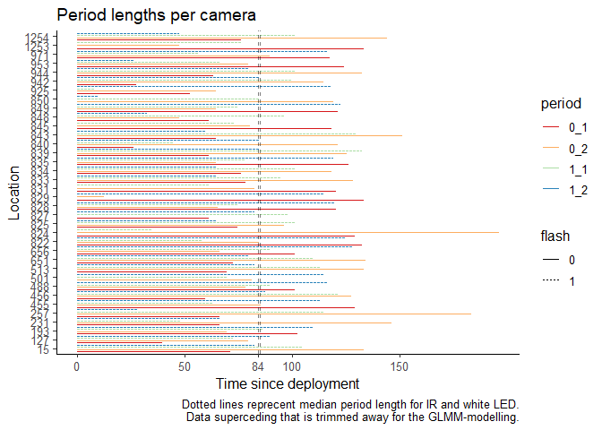<!-- -->

``` r
# failed attempts that could inspire a better plot later
# p_td + geom_hline(aes(yintercept = h))+ # using median days as intercept 
#        scale_y_continuous(breaks = sort(c(ggplot_build(p_td)$layout$panel_ranges[[1]]$y.major_source, h)))
# geom_text(aes(25, h, label = "median", vjust = -1), nudge_y = 10, show.legend = F)
```

There was an overweight of IR-periods extending past the median line.

``` r
# remake plot with Control-group data, faceted
p_td2 <- time.dep3 %>% 
  ggplot(aes(loc, 10*time.deploy, col = period))  +
  geom_line(aes(linetype = period),
    position = position_dodge(width = 1), lineend = "square") +
  coord_flip() +  
  geom_hline(aes(yintercept = h), linetype = "dashed",  alpha =.5) +
  scale_y_continuous(breaks = sort(c(0, 50, h, 100, 150, 200))) +
  facet_grid(rows = "flash", scales = "free_y") +
  labs(#title = "Period lengths per camera",
       x = "Location", y = "Time since deployment",
       caption = "Vertical line reprecents median period length for IR.\n Data superceding that were trimmed away for the GLMM-modelling.")
  

p_td2 + ggpubr::theme_classic2() +
  theme(legend.position = "none", axis.text.y = element_blank(), axis.ticks.y = element_blank()) +
        scale_linetype_manual(values = rep(c("solid","solid"), 4) ) + #option to change to solid,dashed
        scale_color_manual(values = c(rep(c("#74add1","#4575b4"), each = 2), # trt-colr
                                      rep(c("#f46d43","#fdae61"),each = 2) ) ) #ctrl-colr
```

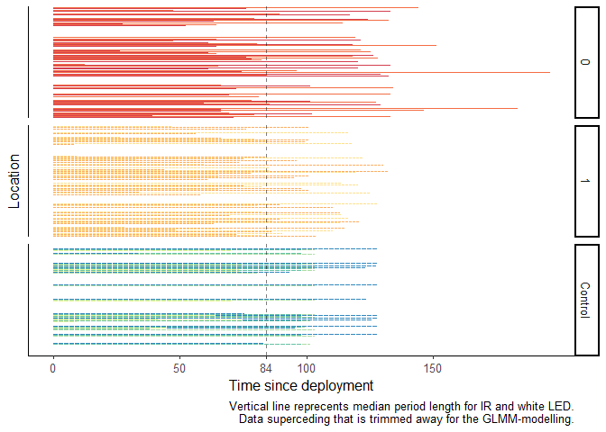<!-- -->

*Lastly, performing the filter:*

``` r
# filtering out periods longer than (shortest) median length.
time.dep4 <- time.dep3 %>% filter(time.deploy < h/10) # h is normal scale, must be rescaled by /10
```

# Modelling

## Roe deer

``` r
time.dep4$loc %>% unique() %>% is.na() %>% any() # no NAs in loc
summary(time.dep4) #
```

``` r
time_sp <- filter(time.dep4, species %in% sp) #.dep4 = trimmed data
# Model
m_sp  <- lme4::glmer(n.obs ~ time.deploy * flash + # fixed effects
            (1 | loc) + (1 | week), # random effects
            data   = time_sp,
            family = poisson) # poisson family of distributions

# ggpredict is similar to expand.grid
p_sp <- ggeffects::ggpredict(m_sp, terms = c("time.deploy [all]", "flash"))
# Diagnostics
plot(p_sp, add.data = TRUE) + labs(title = "add.data = TRUE")
plot(p_sp, residuals = TRUE) + labs(title = "residuals")
performance::check_model(m_sp) # check assumptions
```

The response variable is a summary of number of events per day. Most
days had no roe deer. In the performance-test for model assumptions *it
is clear that some assumptions aren’t met.*

#### Negative

In the non-normality of resiudals-plot, the residuals skew off from the
line when moving towards positive quantiles. There is *not* a
homogeneity of variance. *Maybe this could be fixed by centering the
n.obs-column?*

There appeares to be five influential observations in the Cook’s
distance-plot, maybe more, as the warning from ggrepel refers to 93
unlabeled data points due to overlaps.

#### Positive

Although the model has an interaction term between flash and time since
deployment, the multicollinearity between them is low! My random effects
follows a normal distribution.

#### Concluding

I am not sure about how to make up for breaking these assumptions. For
now, I will go on completing models for the rest of the species.

``` r
# Summary, report, model
summary(m_sp)
r_sp <- report::report(m_sp) # text-summary of my model, to include in a report
para_sp  <- model_parameters(m_sp,   standardize = "refit", two_sd = TRUE, exponentiate = TRUE) 
```

### Model interpretation

The intercept-value is considered significantly negative, which is to
say that there were a low chance of detecting any roe deer at an
IR-camera the same day I visited the camera.

> I saw a roe deer about to walk by a CT when I came to inspect it. The
> roe deer saw me and fled, right before it was detected by the camera.
> Chances are I’ve scared animals other times as well, but haven’t
> noticed it.

The effect of *Time since deployment* is non-significant, and
*β* = 0.008. That means there is no difference on the baseline detection
rate for an IR camera over time (after controlling for seasonal
changes).

For white LED flash *β* = 0.170, meaning that the intercept is slightly
higher than for IR, but the difference is non-significant (*p* = 0.18).
However, the detection rate is slightly decreasing the longer the white
LED stays, which differs from the IR, * but the effect is
non-significant* (*p* = 0.23).

#### Hypothesising

If there truly is an effect of the white LED for long periods on the
detection rate of roe deer, this effect could in turn account for the
different intercept values of IR and flash, as the IR periods often
start after a flash period.

Remembering my study design, 20 cameras start with white LED, 20 with
IR. *Intercept should be equal* (1st period). 2nd period; white LED
moved, new LED CTs (same intercept), new IR CTs (hypothetical lower
intercept due to flash effect). 3rd period; white LED moved, new LED CTs
(IR intercept), new IR CTs (hypothetical lower intercept). 4th period; -
- \|\| - - , new LED CTs (- - \| \| - - ), new IR CTs ( - - \| \| - - ).

Which sums up to 3 IR periods where detection rates could start lower
than that of white LED. And over time the lack of white LED flash in the
new IR sites would account for an *increase* in detection rates.

The effect would of course vary because some locations experienced
*gaps* due to full SD cards or empty batteries.
<!--_Maybe, after my thesis, I could try to pry out these differences-->

------------------------------------------------------------------------

#### Update!

After uptaded data from Neri; the effect of flash is now deemed
significant! Still the same pattern with higher intercept and a negative
slope along the time axis, which further supports my hypothesising
above. The interaction with time since deployment is, however, still
non-significant. *Now I want to look at a model including the
Control-group.*

``` r
time_sp <- filter(time.dep4, species %in% sp) #.dep4 = trimmed data
# Model
m_sp  <- lme4::glmer(n.obs ~ time.deploy * flash + # fixed effects
            (1 | loc) + (1 | week), # random effects
            data   = time_sp,
            family = poisson) # poisson family of distributions

# ggpredict is similar to expand.grid
p_sp <- ggeffects::ggpredict(m_sp, terms = c("time.deploy [all]", "flash"))
# Diagnostics
plot(p_sp, add.data = TRUE) + labs(title = "add.data = TRUE")
```

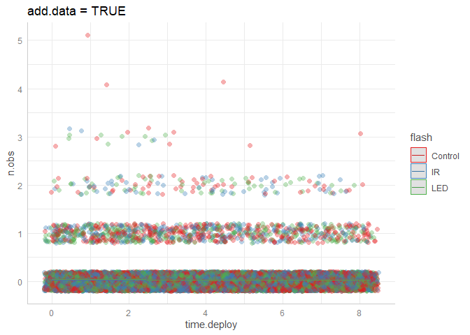<!-- -->

``` r
plot(p_sp, residuals = TRUE) + labs(title = "residuals")
```

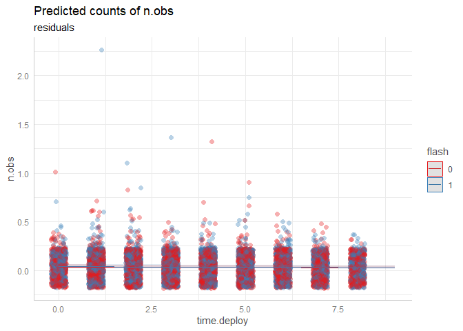<!-- -->

``` r
performance::check_model(m_sp) # check assumptions
```

    ## Loading required namespace: qqplotr

    ## `geom_smooth()` using formula 'y ~ x'

    ## `stat_bin()` using `bins = 30`. Pick better value with `binwidth`.

    ## Warning: Removed 14746 rows containing missing values (geom_text_repel).

    ## `geom_smooth()` using formula 'y ~ x'

    ## `geom_smooth()` using formula 'y ~ x'

    ## Warning: ggrepel: 295 unlabeled data points (too many overlaps). Consider
    ## increasing max.overlaps

<!-- -->

There are a couple of extreme counts in the Control-group, even after
having filtered away all observations with less than a 15 min interval
for each species (ie. setting 15 min margin as definition of an event).
These extreme counts are skewed to the left which probably will affect
the intercept of control quite a bit, but probably won’t deem the
intercept-value as significant (as these extreme values are outliers).

The homogeneity of variance is still off. It deems on me more and more
that this is due to these extreme count-values that is close to
time.deploy = 0. *Will it disappear if I divide by the standard
deviation?*

The multicollinearity is moderate for the interaction term of
time.deploy and flash when the control group is included. Still, the
change is small (in my layman eyes), with a increase in bar height from
\~ 4 to \~ 6.

``` r
# Summary, report, model
summary(m_sp)
```

    ## Generalized linear mixed model fit by maximum likelihood (Laplace
    ##   Approximation) [glmerMod]
    ##  Family: poisson  ( log )
    ## Formula: n.obs ~ time.deploy * flash + (1 | loc) + (1 | week)
    ##    Data: time_sp
    ## 
    ##      AIC      BIC   logLik deviance df.resid 
    ##   7669.3   7730.2  -3826.6   7653.3    15035 
    ## 
    ## Scaled residuals: 
    ##     Min      1Q  Median      3Q     Max 
    ## -1.1836 -0.2832 -0.1641 -0.0763 14.1894 
    ## 
    ## Random effects:
    ##  Groups Name        Variance Std.Dev.
    ##  loc    (Intercept) 2.6164   1.6175  
    ##  week   (Intercept) 0.3232   0.5685  
    ## Number of obs: 15043, groups:  loc, 53; week, 52
    ## 
    ## Fixed effects:
    ##                      Estimate Std. Error z value Pr(>|z|)    
    ## (Intercept)          -3.60407    0.43060  -8.370   <2e-16 ***
    ## time.deploy          -0.01127    0.02298  -0.490    0.624    
    ## flashIR               0.21104    0.51227   0.412    0.680    
    ## flashLED              0.32001    0.51138   0.626    0.531    
    ## time.deploy:flashIR  -0.01317    0.03205  -0.411    0.681    
    ## time.deploy:flashLED -0.02971    0.03132  -0.948    0.343    
    ## ---
    ## Signif. codes:  0 '***' 0.001 '**' 0.01 '*' 0.05 '.' 0.1 ' ' 1
    ## 
    ## Correlation of Fixed Effects:
    ##             (Intr) tm.dpl flshIR flsLED tm.:IR
    ## time.deploy -0.203                            
    ## flashIR     -0.802  0.163                     
    ## flashLED    -0.805  0.171  0.970              
    ## tm.dply:fIR  0.136 -0.683 -0.229 -0.130       
    ## tm.dply:LED  0.149 -0.744 -0.134 -0.224  0.573

``` r
r_sp <- report::report(m_sp) # text-summary of my model, to include in a report
para_sp  <- model_parameters(m_sp,   standardize = "refit", two_sd = TRUE, exponentiate = TRUE) 
```

    ## Warning in checkConv(attr(opt, "derivs"), opt$par, ctrl = control$checkConv, :
    ## Model failed to converge with max|grad| = 0.00228998 (tol = 0.002, component 1)

The control intercept is almost on top of the IR-intercept, but it has a
more negative trend than the IR-group. After I got updated data and
performed the event-filter, the slope of IR changed to a negative trend
over time, as well, “removing” any significance from the flash terms.
The important thing to note, then, is how small the p-values was, and
how easily they turned non-significant. Looking at the plot, the
confidence interval tells us all we need to know, as they almost
completely overlap. The groups are almost identical. The slope of the
control group is actually steeper than that of white LED (although only
minisculy). Further, the trend over time with the control-group
**should** be due to chance, *as time.deploy = 0 is seldom the actual
day I visited the cameras*. They were visited less often in general, and
the breaks leading to time.deploy = 0 are set manually by me, to make
period lengths that are similar to those of the IR and white LED group.

### Some parameter-plots from see and effectsize

The CI-plots of effectsize will be included in some form in my thesis.
For the equivalence-plot I’m not to sure if I’ll use it, but the
interpretation is neat with that method. From the bayesian statistics,
if a predictor is completely covered by the ROPE-area you can accept the
null hypothesis. This is not possible in a frequentist perspective (as
my models are), but one could claim *practical equivalence* if the
effect is non-significant AND completely inside the ROPE-interval.
Explanations from [Equivalence
vignette](https://easystats.github.io/parameters/reference/equivalence_test.lm.html):

> “classic” - The TOST rule (Lakens 2017) This rule follows the “TOST
> rule”, i.e. a two one-sided test procedure (Lakens 2017). Following
> this rule, practical equivalence of an effect (i.e. H0) is rejected,
> when the coefficient is statistically significant and the narrow
> confidence intervals (i.e. 1-2\*alpha) include or exceed the ROPE
> boundaries. Practical equivalence is assumed (i.e. H0 accepted) when
> the narrow confidence intervals are completely inside the ROPE, no
> matter if the effect is statistically significant or not. Else, the
> decision whether to accept or reject H0 is undecided. “cet” -
> Conditional Equivalence Testing (Campbell/Gustafson 2018) The
> Conditional Equivalence Testing as described by Campbell and Gustafson
> 2018. According to this rule, practical equivalence is rejected when
> the coefficient is statistically significant. When the effect is not
> significant and the narrow confidence intervals are completely inside
> the ROPE, we accept H0, else it is undecided

``` r
result <- model_parameters(m_sp) 
plot(result, size_text = 3) + labs(title = paste0(sp, " GLMM parameters") ,
                                    subtitle = ' not standardized ')
```

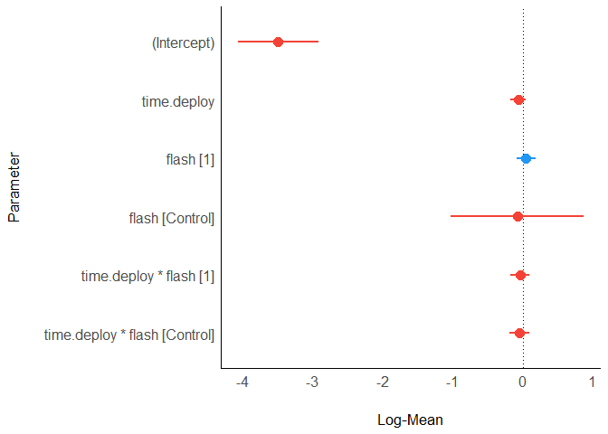<!-- -->

``` r
plot(para_sp, size_text = 3) + labs(title = paste0(sp, " GLMM parameters") ,
                                    subtitle = 'standardize  = "refit" ')
```

    ## Scale for 'y' is already present. Adding another scale for 'y', which will
    ## replace the existing scale.

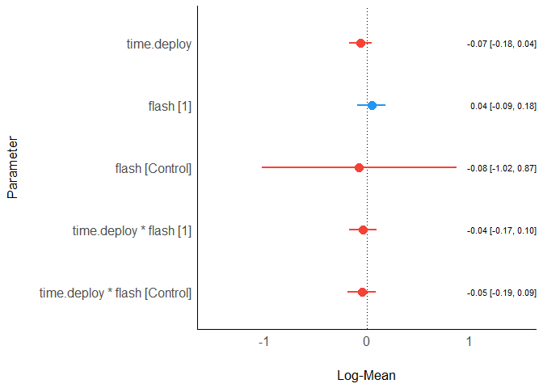<!-- -->

``` r
# default rules, like in bayestestR::equivalence_test()
result <- equivalence_test(m_sp)
plot(result)
```

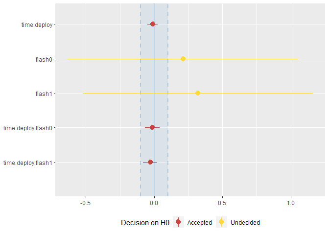<!-- -->

``` r
result
```

    ## # TOST-test for Practical Equivalence
    ## 
    ##   ROPE: [-0.10 0.10]
    ## 
    ##                  Parameter        H0 inside ROPE        90% CI
    ##                (Intercept)  Rejected      0.00 % [-4.31 -2.90]
    ##                time.deploy  Accepted    100.00 % [-0.05  0.03]
    ##                 flash [IR] Undecided     11.87 % [-0.63  1.05]
    ##                flash [LED] Undecided     11.89 % [-0.52  1.16]
    ##   time.deploy * flash [IR]  Accepted    100.00 % [-0.07  0.04]
    ##  time.deploy * flash [LED]  Accepted    100.00 % [-0.08  0.02]

``` r
summary(r_sp)
```

    ## We fitted a poisson mixed model to predict n.obs with time.deploy and flash. The model included loc and week as random effects. The model's total explanatory power is substantial (conditional R2 = 0.45) and the part related to the fixed effects alone (marginal R2) is of 1.88e-03. The model's intercept is at -3.60 (95% CI [-4.45, -2.76]). Within this model:
    ## 
    ##   - The effect of time.deploy is non-significantly negative (beta = -0.01, 95% CI [-0.06, 0.03], p = 0.624, Std. beta = -0.03)
    ##   - The effect of flash [IR] is non-significantly positive (beta = 0.21, 95% CI [-0.79, 1.22], p = 0.680, Std. beta = 0.16)
    ##   - The effect of flash [LED] is non-significantly positive (beta = 0.32, 95% CI [-0.68, 1.32], p = 0.531, Std. beta = 0.21)
    ##   - The interaction effect of flash [IR] on time.deploy is non-significantly negative (beta = -0.01, 95% CI [-0.08, 0.05], p = 0.681, Std. beta = -0.03)
    ##   - The interaction effect of flash [LED] on time.deploy is non-significantly negative (beta = -0.03, 95% CI [-0.09, 0.03], p = 0.343, Std. beta = -0.07)

``` r
as.report_table(r_sp)
```

    ## Parameter                 | Coefficient |         95% CI |     z |  df |      p | Std. Coef. | Std. Coef. 95% CI |      Fit
    ## ---------------------------------------------------------------------------------------------------------------------------
    ## (Intercept)               |       -3.60 | [-4.45, -2.76] | -8.37 | Inf | < .001 |      -3.65 |    [-4.47, -2.82] |         
    ## time.deploy               |       -0.01 | [-0.06,  0.03] | -0.49 | Inf | 0.624  |      -0.03 |    [-0.13,  0.08] |         
    ## flash [IR]                |        0.21 | [-0.79,  1.22] |  0.41 | Inf | 0.680  |       0.16 |    [-0.82,  1.14] |         
    ## flash [LED]               |        0.32 | [-0.68,  1.32] |  0.63 | Inf | 0.531  |       0.21 |    [-0.77,  1.18] |         
    ## time.deploy * flash [IR]  |       -0.01 | [-0.08,  0.05] | -0.41 | Inf | 0.681  |      -0.03 |    [-0.18,  0.12] |         
    ## time.deploy * flash [LED] |       -0.03 | [-0.09,  0.03] | -0.95 | Inf | 0.343  |      -0.07 |    [-0.21,  0.07] |         
    ##                           |             |                |       |     |        |            |                   |         
    ## AIC                       |             |                |       |     |        |            |                   |  7669.27
    ## BIC                       |             |                |       |     |        |            |                   |  7730.22
    ## R2 (conditional)          |             |                |       |     |        |            |                   |     0.45
    ## R2 (marginal)             |             |                |       |     |        |            |                   | 1.88e-03
    ## Sigma                     |             |                |       |     |        |            |                   |     1.00

``` r
# Storing species-specific objects for later
# Model
m_raa    = m_sp
# ggpredict 
p_raa    = p_sp
# report-object
r_raa    = r_sp
# parameters refit
para_raa = para_sp
```

sp sp-report sp-report2 parameters

objects

#### Skrivestopp

------------------------------------------------------------------------

## Red Fox

``` r
time_sp <- filter(time.dep4, species %in% sp) #.dep4 = trimmed data
# Model
m_sp  <- lme4::glmer(n.obs ~ time.deploy * flash + # fixed effects
            (1 | loc) + (1 | week), # random effects
            data   = time_sp,
            family = poisson) # poisson family of distributions

# ggpredict is similar to expand.grid
p_sp <- ggeffects::ggpredict(m_sp, terms = c("time.deploy [all]", "flash"))
# Diagnostics
plot(p_sp, add.data = TRUE) + labs(title = "add.data = TRUE")
```

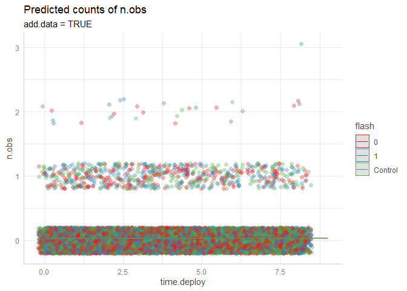<!-- -->

``` r
plot(p_sp, residuals = TRUE) + labs(title = "residuals")
```

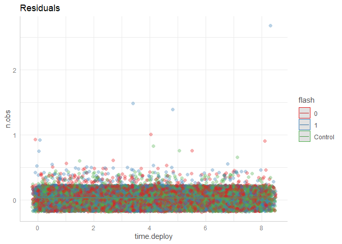<!-- -->

``` r
performance::check_model(m_sp) # check assumptions
```

    ## `geom_smooth()` using formula 'y ~ x'

    ## `stat_bin()` using `bins = 30`. Pick better value with `binwidth`.

    ## Warning: Removed 14853 rows containing missing values (geom_text_repel).

    ## `geom_smooth()` using formula 'y ~ x'

    ## `geom_smooth()` using formula 'y ~ x'

    ## Warning: ggrepel: 186 unlabeled data points (too many overlaps). Consider
    ## increasing max.overlaps

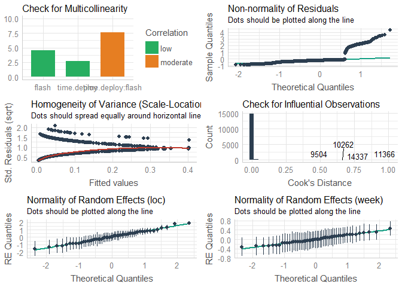<!-- -->

``` r
# Summary, report, model
summary(m_sp)
```

    ## Generalized linear mixed model fit by maximum likelihood (Laplace
    ##   Approximation) [glmerMod]
    ##  Family: poisson  ( log )
    ## Formula: n.obs ~ time.deploy * flash + (1 | loc) + (1 | week)
    ##    Data: time_sp
    ## 
    ##      AIC      BIC   logLik deviance df.resid 
    ##   5619.9   5680.8  -2801.9   5603.9    15035 
    ## 
    ## Scaled residuals: 
    ##     Min      1Q  Median      3Q     Max 
    ## -0.6303 -0.2405 -0.1838 -0.1304 13.6641 
    ## 
    ## Random effects:
    ##  Groups Name        Variance Std.Dev.
    ##  loc    (Intercept) 0.74693  0.8643  
    ##  week   (Intercept) 0.06125  0.2475  
    ## Number of obs: 15043, groups:  loc, 53; week, 52
    ## 
    ## Fixed effects:
    ##                        Estimate Std. Error z value Pr(>|z|)    
    ## (Intercept)          -3.4540659  0.2570878 -13.435   <2e-16 ***
    ## time.deploy          -0.0013144  0.0291773  -0.045    0.964    
    ## flashIR               0.0426336  0.3187784   0.134    0.894    
    ## flashLED              0.1958055  0.3169724   0.618    0.537    
    ## time.deploy:flashIR   0.0005195  0.0404086   0.013    0.990    
    ## time.deploy:flashLED -0.0081886  0.0395639  -0.207    0.836    
    ## ---
    ## Signif. codes:  0 '***' 0.001 '**' 0.01 '*' 0.05 '.' 0.1 ' ' 1
    ## 
    ## Correlation of Fixed Effects:
    ##             (Intr) tm.dpl flshIR flsLED tm.:IR
    ## time.deploy -0.443                            
    ## flashIR     -0.784  0.355                     
    ## flashLED    -0.790  0.360  0.864              
    ## tm.dply:fIR  0.313 -0.709 -0.488 -0.277       
    ## tm.dply:LED  0.324 -0.733 -0.281 -0.481  0.567

``` r
r_sp <- report::report(m_sp) # text-summary of my model, to include in a report
para_sp  <- model_parameters(m_sp,   standardize = "refit", two_sd = TRUE, exponentiate = TRUE) 
```

``` r
summary(r_sp)
```

    ## We fitted a poisson mixed model to predict n.obs with time.deploy and flash. The model included loc and week as random effects. The model's total explanatory power is moderate (conditional R2 = 0.19) and the part related to the fixed effects alone (marginal R2) is of 1.16e-03. The model's intercept is at -3.45 (95% CI [-3.96, -2.95]). Within this model:
    ## 
    ##   - The effect of time.deploy is non-significantly negative (beta = -1.31e-03, 95% CI [-0.06, 0.06], p = 0.964, Std. beta = -3.03e-03)
    ##   - The effect of flash [IR] is non-significantly positive (beta = 0.04, 95% CI [-0.58, 0.67], p = 0.894, Std. beta = 0.04)
    ##   - The effect of flash [LED] is non-significantly positive (beta = 0.20, 95% CI [-0.43, 0.82], p = 0.537, Std. beta = 0.16)
    ##   - The interaction effect of flash [IR] on time.deploy is non-significantly positive (beta = 5.20e-04, 95% CI [-0.08, 0.08], p = 0.990, Std. beta = 1.12e-03)
    ##   - The interaction effect of flash [LED] on time.deploy is non-significantly negative (beta = -8.19e-03, 95% CI [-0.09, 0.07], p = 0.836, Std. beta = -0.02)

``` r
as.report_table(r_sp)
```

    ## Parameter                 | Coefficient |         95% CI |      z |  df |      p | Std. Coef. | Std. Coef. 95% CI |      Fit
    ## ----------------------------------------------------------------------------------------------------------------------------
    ## (Intercept)               |       -3.45 | [-3.96, -2.95] | -13.44 | Inf | < .001 |      -3.46 |    [-3.91, -3.01] |         
    ## time.deploy               |   -1.31e-03 | [-0.06,  0.06] |  -0.05 | Inf | 0.964  |  -3.03e-03 |    [-0.14,  0.13] |         
    ## flash [IR]                |        0.04 | [-0.58,  0.67] |   0.13 | Inf | 0.894  |       0.04 |    [-0.50,  0.59] |         
    ## flash [LED]               |        0.20 | [-0.43,  0.82] |   0.62 | Inf | 0.537  |       0.16 |    [-0.38,  0.71] |         
    ## time.deploy * flash [IR]  |    5.20e-04 | [-0.08,  0.08] |   0.01 | Inf | 0.990  |   1.12e-03 |    [-0.18,  0.19] |         
    ## time.deploy * flash [LED] |   -8.19e-03 | [-0.09,  0.07] |  -0.21 | Inf | 0.836  |      -0.02 |    [-0.20,  0.16] |         
    ##                           |             |                |        |     |        |            |                   |         
    ## AIC                       |             |                |        |     |        |            |                   |  5619.86
    ## BIC                       |             |                |        |     |        |            |                   |  5680.81
    ## R2 (conditional)          |             |                |        |     |        |            |                   |     0.19
    ## R2 (marginal)             |             |                |        |     |        |            |                   | 1.16e-03
    ## Sigma                     |             |                |        |     |        |            |                   |     1.00

``` r
result <- model_parameters(m_sp) 
plot(result, size_text = 3) + labs(title = paste0(sp, " GLMM parameters") ,
                                    subtitle = ' not standardized ')
```

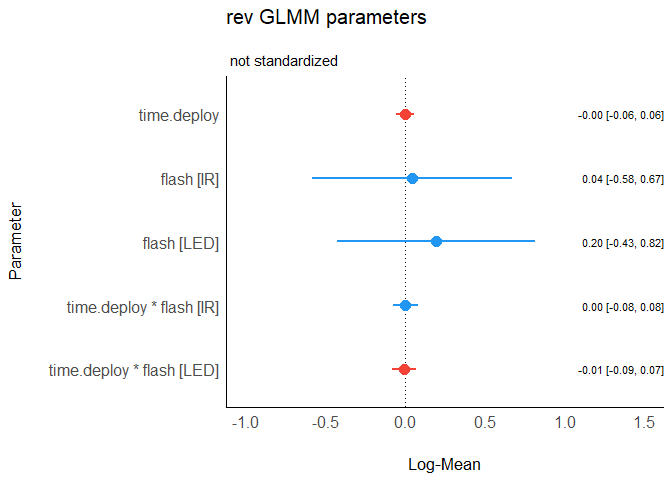<!-- -->

``` r
plot(para_sp, size_text = 3) + labs(title = paste0(sp, " GLMM parameters") ,
                                    subtitle = 'standardize  = "refit" ')
```

    ## Scale for 'y' is already present. Adding another scale for 'y', which will
    ## replace the existing scale.

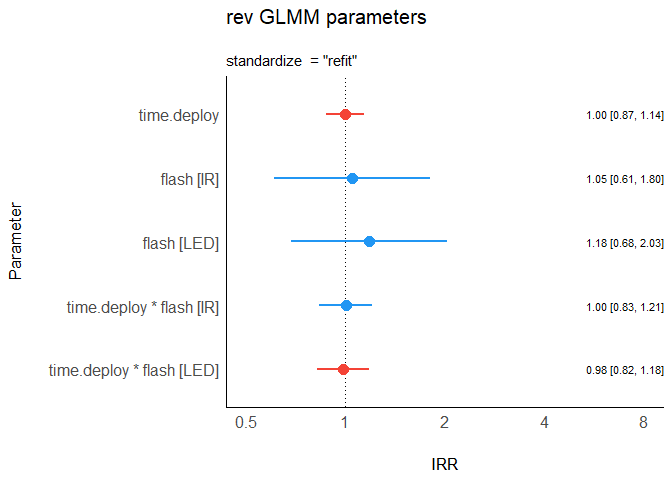<!-- -->

``` r
# default rules, like in bayestestR::equivalence_test()
result <- equivalence_test(m_sp)
plot(result)
```

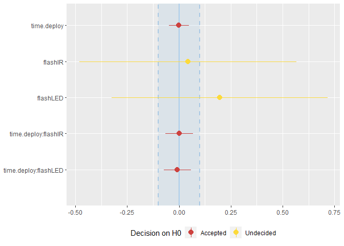<!-- -->

``` r
result
```

    ## # TOST-test for Practical Equivalence
    ## 
    ##   ROPE: [-0.10 0.10]
    ## 
    ##                  Parameter        H0 inside ROPE        90% CI
    ##                (Intercept)  Rejected      0.00 % [-3.88 -3.03]
    ##                time.deploy  Accepted    100.00 % [-0.05  0.05]
    ##                 flash [IR] Undecided     19.07 % [-0.48  0.57]
    ##                flash [LED] Undecided     19.18 % [-0.33  0.72]
    ##   time.deploy * flash [IR]  Accepted    100.00 % [-0.07  0.07]
    ##  time.deploy * flash [LED]  Accepted    100.00 % [-0.07  0.06]

``` r
# Model
m_rev    = m_sp
# ggpredict 
p_rev    = p_sp
# report-object
r_rev    = r_sp
# parameters refit
para_rev = para_sp
```

``` r
knitr::knit_exit() # to exit knitting process here instead of at the document end
```

## Badger

``` r
time_sp <- filter(time.dep4, species %in% sp) #.dep4 = trimmed data
# Model
m_sp  <- lme4::glmer(n.obs ~ time.deploy * flash + # fixed effects
            (1 | loc) + (1 | week), # random effects
            data   = time_sp,
            family = poisson) # poisson family of distributions

# ggpredict is similar to expand.grid
p_sp <- ggeffects::ggpredict(m_sp, terms = c("time.deploy [all]", "flash"))
# Diagnostics
plot(p_sp, add.data = TRUE) + labs(title = "add.data = TRUE")
```

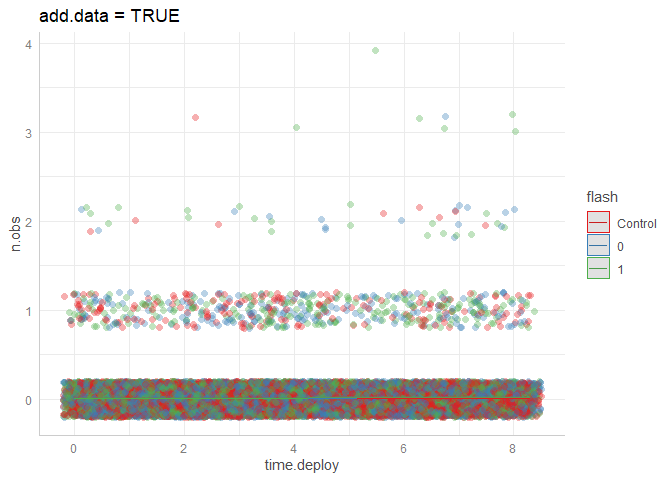<!-- -->

``` r
plot(p_sp, residuals = TRUE) + labs(title = "residuals")
```

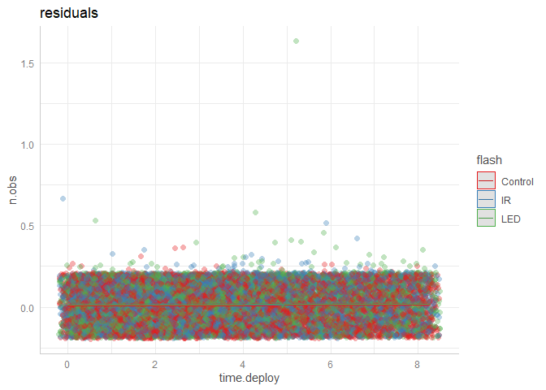<!-- -->

``` r
performance::check_model(m_sp) # check assumptions
```

    ## `geom_smooth()` using formula 'y ~ x'

    ## `stat_bin()` using `bins = 30`. Pick better value with `binwidth`.

    ## Warning: Removed 14752 rows containing missing values (geom_text_repel).

    ## `geom_smooth()` using formula 'y ~ x'

    ## `geom_smooth()` using formula 'y ~ x'

    ## Warning: ggrepel: 288 unlabeled data points (too many overlaps). Consider
    ## increasing max.overlaps

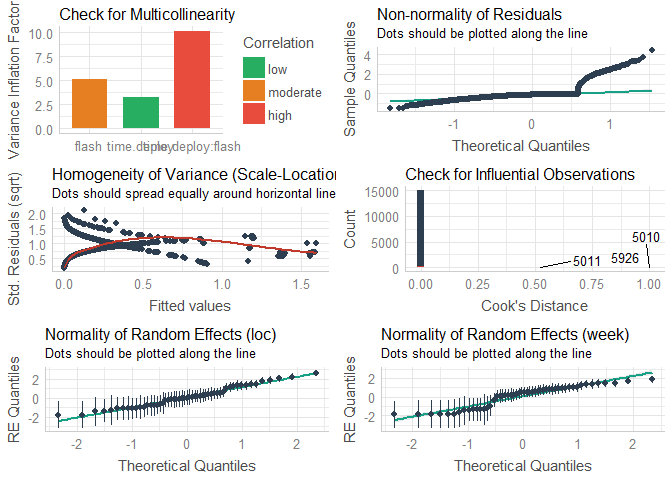<!-- -->

``` r
# Summary, report, model
summary(m_sp)
```

    ## Generalized linear mixed model fit by maximum likelihood (Laplace
    ##   Approximation) [glmerMod]
    ##  Family: poisson  ( log )
    ## Formula: n.obs ~ time.deploy * flash + (1 | loc) + (1 | week)
    ##    Data: time_sp
    ## 
    ##      AIC      BIC   logLik deviance df.resid 
    ##   4673.2   4734.2  -2328.6   4657.2    15035 
    ## 
    ## Scaled residuals: 
    ##     Min      1Q  Median      3Q     Max 
    ## -1.0953 -0.1976 -0.1167 -0.0628 29.5366 
    ## 
    ## Random effects:
    ##  Groups Name        Variance Std.Dev.
    ##  loc    (Intercept) 1.461    1.209   
    ##  week   (Intercept) 1.619    1.272   
    ## Number of obs: 15043, groups:  loc, 53; week, 52
    ## 
    ## Fixed effects:
    ##                      Estimate Std. Error z value Pr(>|z|)    
    ## (Intercept)          -4.65186    0.39382 -11.812   <2e-16 ***
    ## time.deploy           0.01214    0.03369   0.360    0.719    
    ## flashIR               0.15984    0.43265   0.369    0.712    
    ## flashLED              0.22107    0.42873   0.516    0.606    
    ## time.deploy:flashIR   0.04815    0.04878   0.987    0.324    
    ## time.deploy:flashLED  0.04702    0.04710   0.998    0.318    
    ## ---
    ## Signif. codes:  0 '***' 0.001 '**' 0.01 '*' 0.05 '.' 0.1 ' ' 1
    ## 
    ## Correlation of Fixed Effects:
    ##             (Intr) tm.dpl flshIR flsLED tm.:IR
    ## time.deploy -0.333                            
    ## flashIR     -0.705  0.334                     
    ## flashLED    -0.712  0.338  0.906              
    ## tm.dply:fIR  0.250 -0.751 -0.451 -0.285       
    ## tm.dply:LED  0.267 -0.789 -0.293 -0.439  0.662

``` r
r_sp <- report::report(m_sp) # text-summary of my model, to include in a report
para_sp  <- model_parameters(m_sp,   standardize = "refit", two_sd = TRUE, exponentiate = TRUE) 
```

``` r
summary(r_sp)
```

    ## We fitted a poisson mixed model to predict n.obs with time.deploy and flash. The model included loc and week as random effects. The model's total explanatory power is substantial (conditional R2 = 0.42) and the part related to the fixed effects alone (marginal R2) is of 5.93e-03. The model's intercept is at -4.65 (95% CI [-5.42, -3.88]). Within this model:
    ## 
    ##   - The effect of time.deploy is non-significantly positive (beta = 0.01, 95% CI [-0.05, 0.08], p = 0.719, Std. beta = 0.03)
    ##   - The effect of flash [IR] is non-significantly positive (beta = 0.16, 95% CI [-0.69, 1.01], p = 0.712, Std. beta = 0.35)
    ##   - The effect of flash [LED] is non-significantly positive (beta = 0.22, 95% CI [-0.62, 1.06], p = 0.606, Std. beta = 0.40)
    ##   - The interaction effect of flash [IR] on time.deploy is non-significantly positive (beta = 0.05, 95% CI [-0.05, 0.14], p = 0.324, Std. beta = 0.11)
    ##   - The interaction effect of flash [LED] on time.deploy is non-significantly positive (beta = 0.05, 95% CI [-0.05, 0.14], p = 0.318, Std. beta = 0.11)

``` r
as.report_table(r_sp)
```

    ## Parameter                 | Coefficient |         95% CI |      z |  df |      p | Std. Coef. | Std. Coef. 95% CI |      Fit
    ## ----------------------------------------------------------------------------------------------------------------------------
    ## (Intercept)               |       -4.65 | [-5.42, -3.88] | -11.81 | Inf | < .001 |      -4.61 |    [-5.33, -3.88] |         
    ## time.deploy               |        0.01 | [-0.05,  0.08] |   0.36 | Inf | 0.719  |       0.03 |    [-0.13,  0.18] |         
    ## flash [IR]                |        0.16 | [-0.69,  1.01] |   0.37 | Inf | 0.712  |       0.35 |    [-0.41,  1.10] |         
    ## flash [LED]               |        0.22 | [-0.62,  1.06] |   0.52 | Inf | 0.606  |       0.40 |    [-0.35,  1.16] |         
    ## time.deploy * flash [IR]  |        0.05 | [-0.05,  0.14] |   0.99 | Inf | 0.324  |       0.11 |    [-0.11,  0.34] |         
    ## time.deploy * flash [LED] |        0.05 | [-0.05,  0.14] |   1.00 | Inf | 0.318  |       0.11 |    [-0.11,  0.33] |         
    ##                           |             |                |        |     |        |            |                   |         
    ## AIC                       |             |                |        |     |        |            |                   |  4673.23
    ## BIC                       |             |                |        |     |        |            |                   |  4734.18
    ## R2 (conditional)          |             |                |        |     |        |            |                   |     0.42
    ## R2 (marginal)             |             |                |        |     |        |            |                   | 5.93e-03
    ## Sigma                     |             |                |        |     |        |            |                   |     1.00

``` r
result <- model_parameters(m_sp) 
plot(result, size_text = 3) + labs(title = paste0(sp, " GLMM parameters") ,
                                    subtitle = ' not standardized ')
```

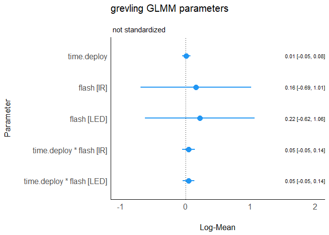<!-- -->

``` r
plot(para_sp, size_text = 3) + labs(title = paste0(sp, " GLMM parameters") ,
                                    subtitle = 'standardize  = "refit" ')
```

    ## Scale for 'y' is already present. Adding another scale for 'y', which will
    ## replace the existing scale.

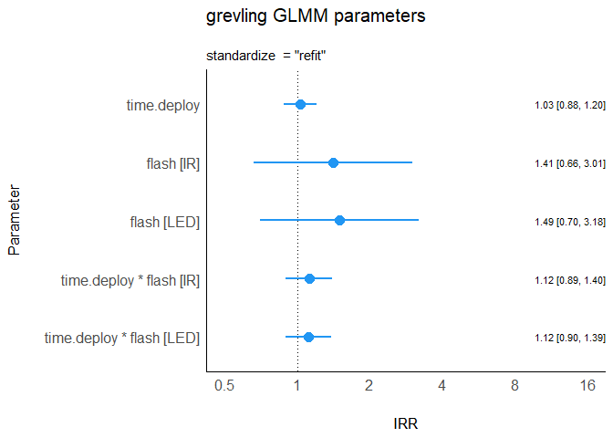<!-- -->

``` r
# default rules, like in bayestestR::equivalence_test()
result <- equivalence_test(m_sp)
plot(result)
```

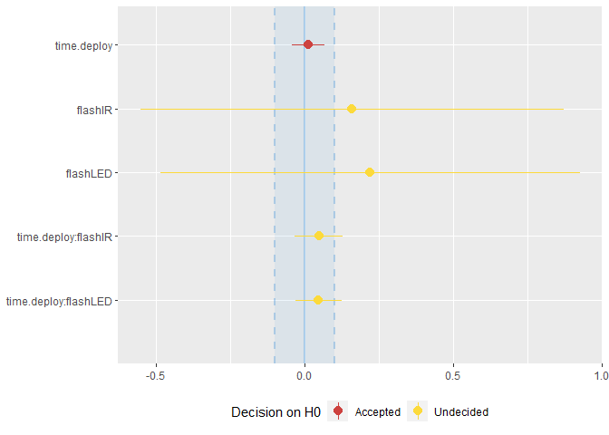<!-- -->

``` r
result
```

    ## # TOST-test for Practical Equivalence
    ## 
    ##   ROPE: [-0.10 0.10]
    ## 
    ##                  Parameter        H0 inside ROPE        90% CI
    ##                (Intercept)  Rejected      0.00 % [-5.30 -4.00]
    ##                time.deploy  Accepted    100.00 % [-0.04  0.07]
    ##                 flash [IR] Undecided     14.05 % [-0.55  0.87]
    ##                flash [LED] Undecided     14.18 % [-0.48  0.93]
    ##   time.deploy * flash [IR] Undecided     82.31 % [-0.03  0.13]
    ##  time.deploy * flash [LED] Undecided     84.19 % [-0.03  0.12]

``` r
# Model
m_grvl    = m_sp
# ggpredict 
p_grvl    = p_sp
# report-object
r_grvl    = r_sp
# parameters refit
para_grvl = para_sp
```

## Moose

``` r
time_sp <- filter(time.dep4, species %in% sp) #.dep4 = trimmed data
# Model
m_sp  <- lme4::glmer(n.obs ~ time.deploy * flash + # fixed effects
            (1 | loc) + (1 | week), # random effects
            data   = time_sp,
            family = poisson) # poisson family of distributions
```

    ## Warning in checkConv(attr(opt, "derivs"), opt$par, ctrl = control$checkConv, :
    ## Model failed to converge with max|grad| = 0.00315998 (tol = 0.002, component 1)

``` r
# ggpredict is similar to expand.grid
p_sp <- ggeffects::ggpredict(m_sp, terms = c("time.deploy [all]", "flash"))
# Diagnostics
plot(p_sp, add.data = TRUE) + labs(title = "add.data = TRUE")
```

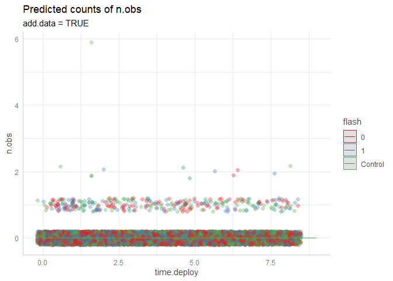<!-- -->

``` r
plot(p_sp, residuals = TRUE) + labs(title = "residuals")
```

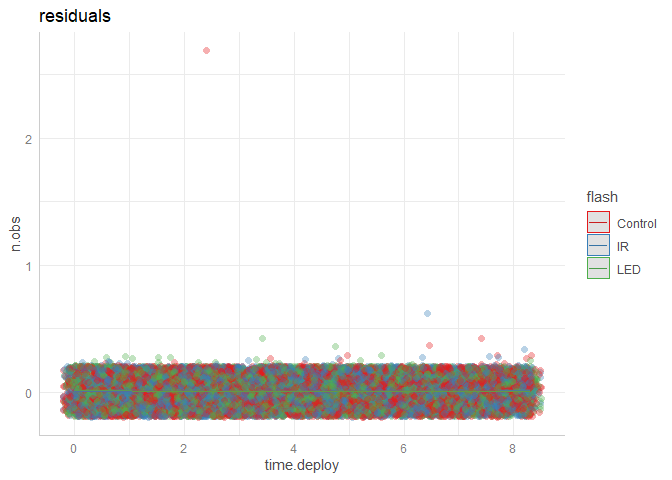<!-- -->

``` r
performance::check_model(m_sp) # check assumptions
```

    ## `geom_smooth()` using formula 'y ~ x'

    ## `stat_bin()` using `bins = 30`. Pick better value with `binwidth`.

    ## Warning: Removed 14807 rows containing missing values (geom_text_repel).

    ## `geom_smooth()` using formula 'y ~ x'

    ## `geom_smooth()` using formula 'y ~ x'

    ## Warning: ggrepel: 234 unlabeled data points (too many overlaps). Consider
    ## increasing max.overlaps

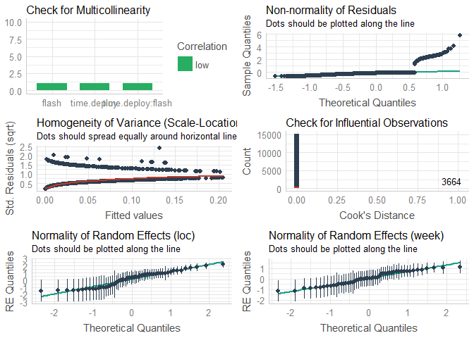<!-- -->

``` r
# Summary, report, model
summary(m_sp)
```

    ## Generalized linear mixed model fit by maximum likelihood (Laplace
    ##   Approximation) [glmerMod]
    ##  Family: poisson  ( log )
    ## Formula: n.obs ~ time.deploy * flash + (1 | loc) + (1 | week)
    ##    Data: time_sp
    ## 
    ##      AIC      BIC   logLik deviance df.resid 
    ##   2981.9   3042.8  -1482.9   2965.9    15035 
    ## 
    ## Scaled residuals: 
    ##     Min      1Q  Median      3Q     Max 
    ## -0.4528 -0.1618 -0.1053 -0.0675 20.3353 
    ## 
    ## Random effects:
    ##  Groups Name        Variance Std.Dev.
    ##  loc    (Intercept) 1.3638   1.1678  
    ##  week   (Intercept) 0.5544   0.7446  
    ## Number of obs: 15043, groups:  loc, 53; week, 52
    ## 
    ## Fixed effects:
    ##                      Estimate Std. Error z value Pr(>|z|)    
    ## (Intercept)          -4.84060    0.39269 -12.327   <2e-16 ***
    ## time.deploy           0.01557    0.04624   0.337    0.736    
    ## flashIR               0.07402    0.46979   0.158    0.875    
    ## flashLED              0.45778    0.46087   0.993    0.321    
    ## time.deploy:flashIR   0.03184    0.06479   0.492    0.623    
    ## time.deploy:flashLED -0.02959    0.06171  -0.480    0.632    
    ## ---
    ## Signif. codes:  0 '***' 0.001 '**' 0.01 '*' 0.05 '.' 0.1 ' ' 1
    ## 
    ## Correlation of Fixed Effects:
    ##             (Intr) tm.dpl flshIR flsLED tm.:IR
    ## time.deploy -0.485                            
    ## flashIR     -0.754  0.426                     
    ## flashLED    -0.769  0.429  0.865              
    ## tm.dply:fIR  0.333 -0.716 -0.552 -0.341       
    ## tm.dply:LED  0.366 -0.760 -0.364 -0.537  0.617
    ## optimizer (Nelder_Mead) convergence code: 0 (OK)
    ## Model failed to converge with max|grad| = 0.00315998 (tol = 0.002, component 1)

``` r
r_sp <- report::report(m_sp) # text-summary of my model, to include in a report
para_sp  <- model_parameters(m_sp,   standardize = "refit", two_sd = TRUE, exponentiate = TRUE) 
```

``` r
summary(r_sp)
```

    ## We fitted a poisson mixed model to predict n.obs with time.deploy and flash. The model included loc and week as random effects. The model's total explanatory power is substantial (conditional R2 = 0.30) and the part related to the fixed effects alone (marginal R2) is of 3.75e-03. The model's intercept is at -4.84 (95% CI [-5.61, -4.07]). Within this model:
    ## 
    ##   - The effect of time.deploy is non-significantly positive (beta = 0.02, 95% CI [-0.08, 0.11], p = 0.736, Std. beta = 0.04)
    ##   - The effect of flash [IR] is non-significantly positive (beta = 0.07, 95% CI [-0.85, 0.99], p = 0.875, Std. beta = 0.20)
    ##   - The effect of flash [LED] is non-significantly positive (beta = 0.46, 95% CI [-0.45, 1.36], p = 0.321, Std. beta = 0.34)
    ##   - The interaction effect of flash [IR] on time.deploy is non-significantly positive (beta = 0.03, 95% CI [-0.10, 0.16], p = 0.623, Std. beta = 0.07)
    ##   - The interaction effect of flash [LED] on time.deploy is non-significantly negative (beta = -0.03, 95% CI [-0.15, 0.09], p = 0.632, Std. beta = -0.07)

``` r
as.report_table(r_sp)
```

    ## Parameter                 | Coefficient |         95% CI |      z |  df |      p | Std. Coef. | Std. Coef. 95% CI |      Fit
    ## ----------------------------------------------------------------------------------------------------------------------------
    ## (Intercept)               |       -4.84 | [-5.61, -4.07] | -12.33 | Inf | < .001 |      -4.78 |    [-5.45, -4.11] |         
    ## time.deploy               |        0.02 | [-0.08,  0.11] |   0.34 | Inf | 0.736  |       0.04 |    [-0.18,  0.25] |         
    ## flash [IR]                |        0.07 | [-0.85,  0.99] |   0.16 | Inf | 0.875  |       0.20 |    [-0.57,  0.96] |         
    ## flash [LED]               |        0.46 | [-0.45,  1.36] |   0.99 | Inf | 0.321  |       0.34 |    [-0.42,  1.11] |         
    ## time.deploy * flash [IR]  |        0.03 | [-0.10,  0.16] |   0.49 | Inf | 0.623  |       0.07 |    [-0.22,  0.37] |         
    ## time.deploy * flash [LED] |       -0.03 | [-0.15,  0.09] |  -0.48 | Inf | 0.632  |      -0.07 |    [-0.35,  0.21] |         
    ##                           |             |                |        |     |        |            |                   |         
    ## AIC                       |             |                |        |     |        |            |                   |  2981.89
    ## BIC                       |             |                |        |     |        |            |                   |  3042.84
    ## R2 (conditional)          |             |                |        |     |        |            |                   |     0.30
    ## R2 (marginal)             |             |                |        |     |        |            |                   | 3.75e-03
    ## Sigma                     |             |                |        |     |        |            |                   |     1.00

``` r
result <- model_parameters(m_sp) 
plot(result, size_text = 3) + labs(title = paste0(sp, " GLMM parameters") ,
                                    subtitle = ' not standardized ')
```

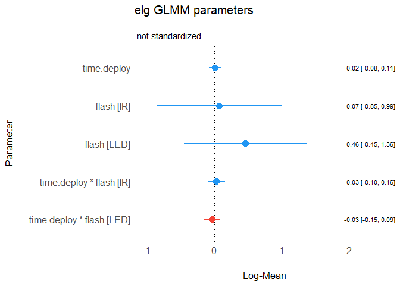<!-- -->

``` r
plot(para_sp, size_text = 3) + labs(title = paste0(sp, " GLMM parameters") ,
                                    subtitle = 'standardize  = "refit" ')
```

    ## Scale for 'y' is already present. Adding another scale for 'y', which will
    ## replace the existing scale.

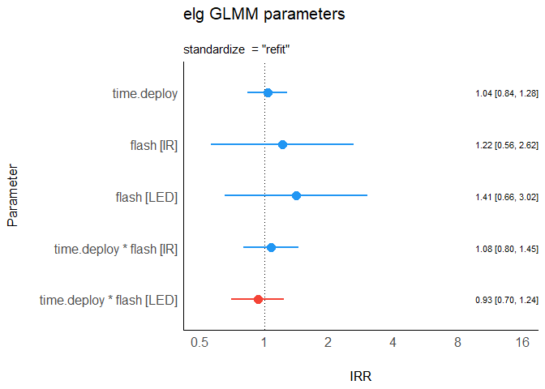<!-- -->

``` r
# default rules, like in bayestestR::equivalence_test()
result <- equivalence_test(m_sp)
plot(result)
```

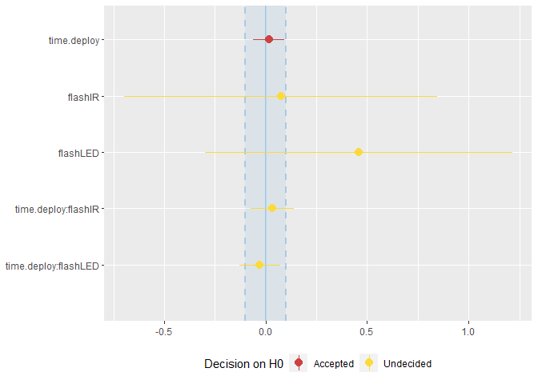<!-- -->

``` r
result
```

    ## # TOST-test for Practical Equivalence
    ## 
    ##   ROPE: [-0.10 0.10]
    ## 
    ##                  Parameter        H0 inside ROPE        90% CI
    ##                (Intercept)  Rejected      0.00 % [-5.49 -4.19]
    ##                time.deploy  Accepted    100.00 % [-0.06  0.09]
    ##                 flash [IR] Undecided     12.94 % [-0.70  0.85]
    ##                flash [LED] Undecided     13.19 % [-0.30  1.22]
    ##   time.deploy * flash [IR] Undecided     81.98 % [-0.07  0.14]
    ##  time.deploy * flash [LED] Undecided     84.68 % [-0.13  0.07]

``` r
# Model
m_elg    = m_sp
# ggpredict 
p_elg    = p_sp
# report-object
r_elg    = r_sp
# parameters refit
para_elg = para_sp
```

## Red deer

``` r
time_sp <- filter(time.dep4, species %in% sp) #.dep4 = trimmed data
# Model
m_sp  <- lme4::glmer(n.obs ~ time.deploy * flash + # fixed effects
            (1 | loc) + (1 | week), # random effects
            data   = time_sp,
            family = poisson) # poisson family of distributions

# ggpredict is similar to expand.grid
p_sp <- ggeffects::ggpredict(m_sp, terms = c("time.deploy [all]", "flash"))
# Diagnostics
plot(p_sp, add.data = TRUE) + labs(title = "add.data = TRUE")
```

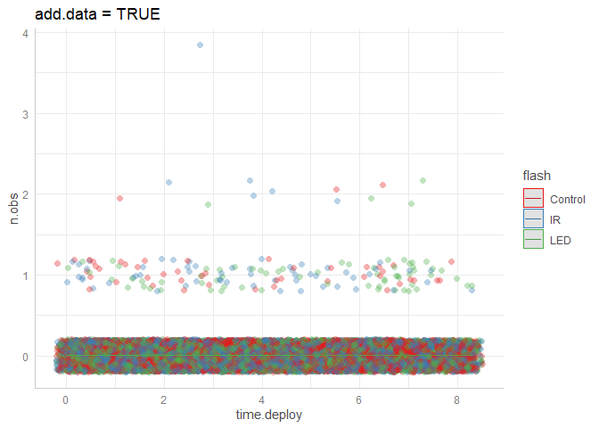<!-- -->

``` r
plot(p_sp, residuals = TRUE) + labs(title = "residuals")
```

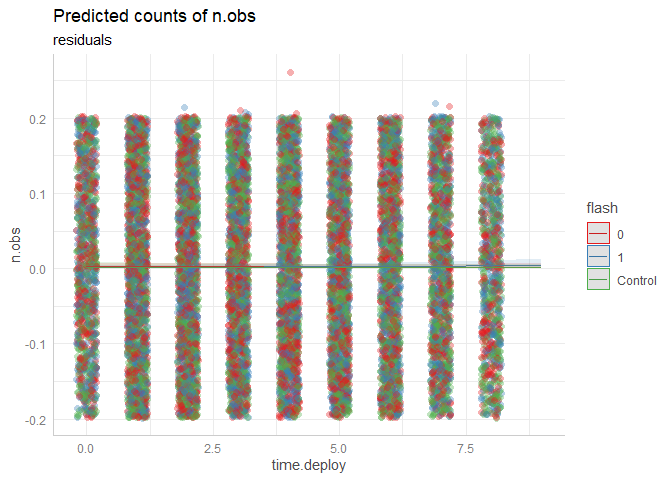<!-- -->

``` r
performance::check_model(m_sp) # check assumptions
```

    ## `geom_smooth()` using formula 'y ~ x'

    ## `stat_bin()` using `bins = 30`. Pick better value with `binwidth`.

    ## Warning: Removed 14660 rows containing missing values (geom_text_repel).

    ## `geom_smooth()` using formula 'y ~ x'

    ## `geom_smooth()` using formula 'y ~ x'

    ## Warning: ggrepel: 382 unlabeled data points (too many overlaps). Consider
    ## increasing max.overlaps

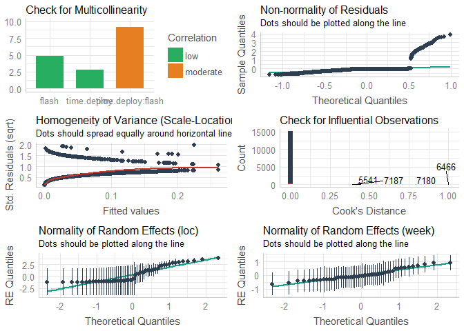<!-- -->

``` r
# Summary, report, model
summary(m_sp)
```

    ## Generalized linear mixed model fit by maximum likelihood (Laplace
    ##   Approximation) [glmerMod]
    ##  Family: poisson  ( log )
    ## Formula: n.obs ~ time.deploy * flash + (1 | loc) + (1 | week)
    ##    Data: time_sp
    ## 
    ##      AIC      BIC   logLik deviance df.resid 
    ##     1788     1849     -886     1772    15035 
    ## 
    ## Scaled residuals: 
    ##     Min      1Q  Median      3Q     Max 
    ## -0.5198 -0.1101 -0.0394 -0.0256 24.8152 
    ## 
    ## Random effects:
    ##  Groups Name        Variance Std.Dev.
    ##  loc    (Intercept) 4.5261   2.1275  
    ##  week   (Intercept) 0.2999   0.5476  
    ## Number of obs: 15043, groups:  loc, 53; week, 52
    ## 
    ## Fixed effects:
    ##                      Estimate Std. Error z value Pr(>|z|)    
    ## (Intercept)          -6.13225    0.72326  -8.479   <2e-16 ***
    ## time.deploy          -0.06455    0.06330  -1.020   0.3078    
    ## flashIR               0.17311    0.81582   0.212   0.8320    
    ## flashLED             -0.46259    0.83274  -0.555   0.5786    
    ## time.deploy:flashIR   0.03858    0.08456   0.456   0.6482    
    ## time.deploy:flashLED  0.19528    0.08558   2.282   0.0225 *  
    ## ---
    ## Signif. codes:  0 '***' 0.001 '**' 0.01 '*' 0.05 '.' 0.1 ' ' 1
    ## 
    ## Correlation of Fixed Effects:
    ##             (Intr) tm.dpl flshIR flsLED tm.:IR
    ## time.deploy -0.323                            
    ## flashIR     -0.753  0.278                     
    ## flashLED    -0.745  0.283  0.901              
    ## tm.dply:fIR  0.228 -0.720 -0.380 -0.221       
    ## tm.dply:LED  0.245 -0.738 -0.219 -0.418  0.571

``` r
r_sp <- report::report(m_sp) # text-summary of my model, to include in a report
para_sp  <- model_parameters(m_sp,   standardize = "refit", two_sd = TRUE, exponentiate = TRUE) 
```

    ## Warning in checkConv(attr(opt, "derivs"), opt$par, ctrl = control$checkConv, :
    ## Model failed to converge with max|grad| = 0.00660776 (tol = 0.002, component 1)

``` r
summary(r_sp)
```

    ## We fitted a poisson mixed model to predict n.obs with time.deploy and flash. The model included loc and week as random effects. The model's total explanatory power is substantial (conditional R2 = 0.44) and the part related to the fixed effects alone (marginal R2) is of 5.52e-03. The model's intercept is at -6.13 (95% CI [-7.55, -4.71]). Within this model:
    ## 
    ##   - The effect of time.deploy is non-significantly negative (beta = -0.06, 95% CI [-0.19, 0.06], p = 0.308, Std. beta = -0.15)
    ##   - The effect of flash [IR] is non-significantly positive (beta = 0.17, 95% CI [-1.43, 1.77], p = 0.832, Std. beta = 0.33)
    ##   - The effect of flash [LED] is non-significantly negative (beta = -0.46, 95% CI [-2.09, 1.17], p = 0.579, Std. beta = 0.29)
    ##   - The interaction effect of flash [IR] on time.deploy is non-significantly positive (beta = 0.04, 95% CI [-0.13, 0.20], p = 0.648, Std. beta = 0.09)
    ##   - The interaction effect of flash [LED] on time.deploy is significantly positive (beta = 0.20, 95% CI [0.03, 0.36], p < .05, Std. beta = 0.46)

``` r
as.report_table(r_sp)
```

    ## Parameter                 | Coefficient |         95% CI |     z |  df |      p | Std. Coef. | Std. Coef. 95% CI |      Fit
    ## ---------------------------------------------------------------------------------------------------------------------------
    ## (Intercept)               |       -6.13 | [-7.55, -4.71] | -8.48 | Inf | < .001 |      -6.38 |    [-7.73, -5.04] |         
    ## time.deploy               |       -0.06 | [-0.19,  0.06] | -1.02 | Inf | 0.308  |      -0.15 |    [-0.44,  0.14] |         
    ## flash [IR]                |        0.17 | [-1.43,  1.77] |  0.21 | Inf | 0.832  |       0.33 |    [-1.15,  1.80] |         
    ## flash [LED]               |       -0.46 | [-2.09,  1.17] | -0.56 | Inf | 0.579  |       0.29 |    [-1.19,  1.78] |         
    ## time.deploy * flash [IR]  |        0.04 | [-0.13,  0.20] |  0.46 | Inf | 0.648  |       0.09 |    [-0.30,  0.48] |         
    ## time.deploy * flash [LED] |        0.20 | [ 0.03,  0.36] |  2.28 | Inf | 0.023  |       0.46 |    [ 0.06,  0.85] |         
    ##                           |             |                |       |     |        |            |                   |         
    ## AIC                       |             |                |       |     |        |            |                   |  1788.00
    ## BIC                       |             |                |       |     |        |            |                   |  1848.95
    ## R2 (conditional)          |             |                |       |     |        |            |                   |     0.44
    ## R2 (marginal)             |             |                |       |     |        |            |                   | 5.52e-03
    ## Sigma                     |             |                |       |     |        |            |                   |     1.00

``` r
result <- model_parameters(m_sp) 
plot(result, size_text = 3) + labs(title = paste0(sp, " GLMM parameters") ,
                                    subtitle = ' not standardized ')
```

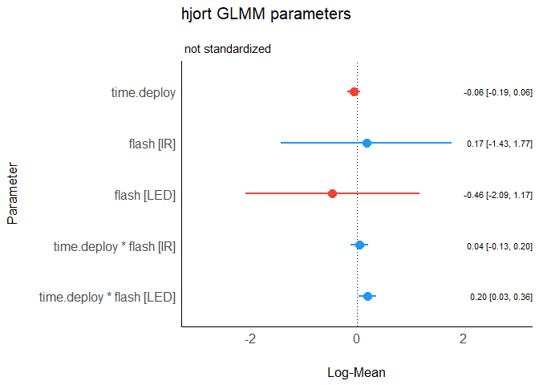<!-- -->

``` r
plot(para_sp, size_text = 3) + labs(title = paste0(sp, " GLMM parameters") ,
                                    subtitle = 'standardize  = "refit" ')
```

    ## Scale for 'y' is already present. Adding another scale for 'y', which will
    ## replace the existing scale.

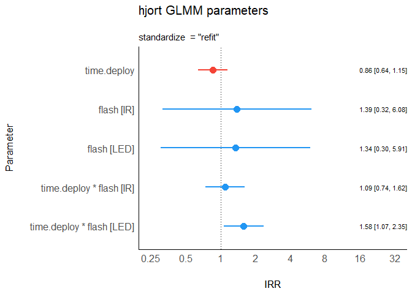<!-- -->

``` r
# default rules, like in bayestestR::equivalence_test()
result <- equivalence_test(m_sp)
plot(result)
```

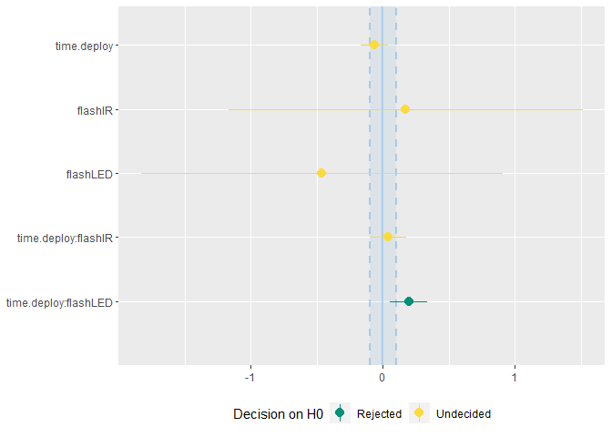<!-- -->

``` r
result
```

    ## # TOST-test for Practical Equivalence
    ## 
    ##   ROPE: [-0.10 0.10]
    ## 
    ##                  Parameter        H0 inside ROPE        90% CI
    ##                (Intercept)  Rejected      0.00 % [-7.32 -4.94]
    ##                time.deploy Undecided     67.02 % [-0.17  0.04]
    ##                 flash [IR] Undecided      7.45 % [-1.17  1.52]
    ##                flash [LED] Undecided      7.30 % [-1.83  0.91]
    ##   time.deploy * flash [IR] Undecided     71.89 % [-0.10  0.18]
    ##  time.deploy * flash [LED]  Rejected     16.16 % [ 0.05  0.34]

``` r
# Model
m_hjort    = m_sp
# ggpredict 
p_hjort    = p_sp
# report-object
r_hjort    = r_sp
# parameters refit
para_hjort = para_sp
```

## Lynx

``` r
time_sp <- filter(time.dep4, species %in% sp) #.dep4 = trimmed data
# Model
m_sp  <- lme4::glmer(n.obs ~ time.deploy * flash + # fixed effects
            (1 | loc) + (1 | week), # random effects
            data   = time_sp,
            family = poisson) # poisson family of distributions

# ggpredict is similar to expand.grid
p_sp <- ggeffects::ggpredict(m_sp, terms = c("time.deploy [all]", "flash"))
# Diagnostics
plot(p_sp, add.data = TRUE) + labs(title = "add.data = TRUE")
```

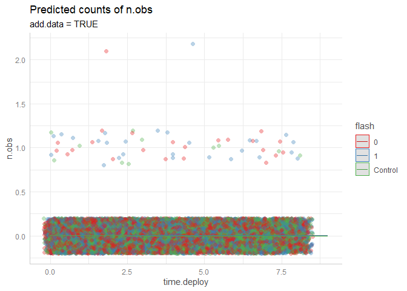<!-- -->

``` r
plot(p_sp, residuals = TRUE) + labs(title = "residuals")
```

<!-- -->

``` r
performance::check_model(m_sp) # check assumptions
```

    ## `geom_smooth()` using formula 'y ~ x'

    ## `stat_bin()` using `bins = 30`. Pick better value with `binwidth`.

    ## Warning: Removed 14788 rows containing missing values (geom_text_repel).

    ## `geom_smooth()` using formula 'y ~ x'

    ## `geom_smooth()` using formula 'y ~ x'

    ## Warning: ggrepel: 252 unlabeled data points (too many overlaps). Consider
    ## increasing max.overlaps

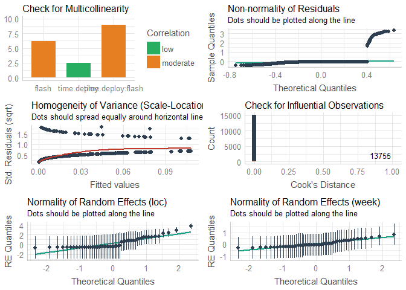<!-- -->

``` r
# Summary, report, model
summary(m_sp)
```

    ## Generalized linear mixed model fit by maximum likelihood (Laplace
    ##   Approximation) [glmerMod]
    ##  Family: poisson  ( log )
    ## Formula: n.obs ~ time.deploy * flash + (1 | loc) + (1 | week)
    ##    Data: time_sp
    ## 
    ##      AIC      BIC   logLik deviance df.resid 
    ##    747.7    808.6   -365.8    731.7    15035 
    ## 
    ## Scaled residuals: 
    ##     Min      1Q  Median      3Q     Max 
    ## -0.3291 -0.0556 -0.0319 -0.0254 23.5992 
    ## 
    ## Random effects:
    ##  Groups Name        Variance Std.Dev.
    ##  loc    (Intercept) 2.2787   1.5095  
    ##  week   (Intercept) 0.3044   0.5517  
    ## Number of obs: 15043, groups:  loc, 53; week, 52
    ## 
    ## Fixed effects:
    ##                      Estimate Std. Error z value Pr(>|z|)    
    ## (Intercept)          -6.83448    0.74649  -9.155   <2e-16 ***
    ## time.deploy          -0.06326    0.13124  -0.482    0.630    
    ## flashIR              -0.04830    0.86926  -0.056    0.956    
    ## flashLED              0.31196    0.86197   0.362    0.717    
    ## time.deploy:flashIR   0.09730    0.15789   0.616    0.538    
    ## time.deploy:flashLED  0.10416    0.15664   0.665    0.506    
    ## ---
    ## Signif. codes:  0 '***' 0.001 '**' 0.01 '*' 0.05 '.' 0.1 ' ' 1
    ## 
    ## Correlation of Fixed Effects:
    ##             (Intr) tm.dpl flshIR flsLED tm.:IR
    ## time.deploy -0.627                            
    ## flashIR     -0.736  0.532                     
    ## flashLED    -0.762  0.548  0.791              
    ## tm.dply:fIR  0.510 -0.822 -0.670 -0.459       
    ## tm.dply:LED  0.526 -0.842 -0.461 -0.673  0.705

``` r
r_sp <- report::report(m_sp) # text-summary of my model, to include in a report
para_sp  <- model_parameters(m_sp,   standardize = "refit", two_sd = TRUE, exponentiate = TRUE) 
```

``` r
summary(r_sp)
```

    ## We fitted a poisson mixed model to predict n.obs with time.deploy and flash. The model included loc and week as random effects. The model's total explanatory power is substantial (conditional R2 = 0.29) and the part related to the fixed effects alone (marginal R2) is of 0.01. The model's intercept is at -6.83 (95% CI [-8.30, -5.37]). Within this model:
    ## 
    ##   - The effect of time.deploy is non-significantly negative (beta = -0.06, 95% CI [-0.32, 0.19], p = 0.630, Std. beta = -0.15)
    ##   - The effect of flash [IR] is non-significantly negative (beta = -0.05, 95% CI [-1.75, 1.66], p = 0.956, Std. beta = 0.33)
    ##   - The effect of flash [LED] is non-significantly positive (beta = 0.31, 95% CI [-1.38, 2.00], p = 0.717, Std. beta = 0.71)
    ##   - The interaction effect of flash [IR] on time.deploy is non-significantly positive (beta = 0.10, 95% CI [-0.21, 0.41], p = 0.538, Std. beta = 0.23)
    ##   - The interaction effect of flash [LED] on time.deploy is non-significantly positive (beta = 0.10, 95% CI [-0.20, 0.41], p = 0.506, Std. beta = 0.24)

``` r
as.report_table(r_sp)
```

    ## Parameter                 | Coefficient |         95% CI |     z |  df |      p | Std. Coef. | Std. Coef. 95% CI |    Fit
    ## -------------------------------------------------------------------------------------------------------------------------
    ## (Intercept)               |       -6.83 | [-8.30, -5.37] | -9.16 | Inf | < .001 |      -7.08 |    [-8.22, -5.94] |       
    ## time.deploy               |       -0.06 | [-0.32,  0.19] | -0.48 | Inf | 0.630  |      -0.15 |    [-0.75,  0.46] |       
    ## flash [IR]                |       -0.05 | [-1.75,  1.66] | -0.06 | Inf | 0.956  |       0.33 |    [-0.94,  1.59] |       
    ## flash [LED]               |        0.31 | [-1.38,  2.00] |  0.36 | Inf | 0.717  |       0.71 |    [-0.54,  1.96] |       
    ## time.deploy * flash [IR]  |        0.10 | [-0.21,  0.41] |  0.62 | Inf | 0.538  |       0.23 |    [-0.50,  0.96] |       
    ## time.deploy * flash [LED] |        0.10 | [-0.20,  0.41] |  0.66 | Inf | 0.506  |       0.24 |    [-0.48,  0.97] |       
    ##                           |             |                |       |     |        |            |                   |       
    ## AIC                       |             |                |       |     |        |            |                   | 747.66
    ## BIC                       |             |                |       |     |        |            |                   | 808.61
    ## R2 (conditional)          |             |                |       |     |        |            |                   |   0.29
    ## R2 (marginal)             |             |                |       |     |        |            |                   |   0.01
    ## Sigma                     |             |                |       |     |        |            |                   |   1.00

``` r
result <- model_parameters(m_sp) 
plot(result, size_text = 3) + labs(title = paste0(sp, " GLMM parameters") ,
                                    subtitle = ' not standardized ')
```

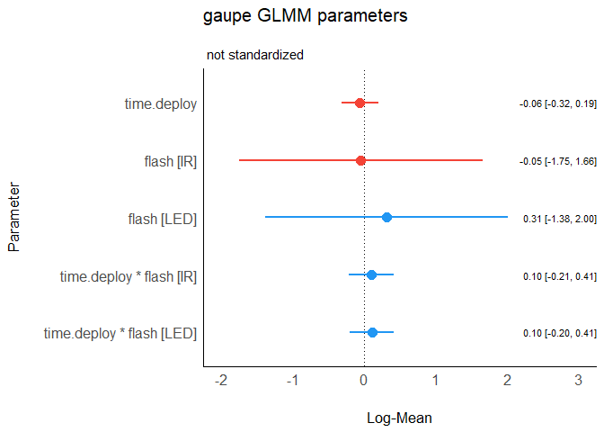<!-- -->

``` r
plot(para_sp, size_text = 3) + labs(title = paste0(sp, " GLMM parameters") ,
                                    subtitle = 'standardize  = "refit" ')
```

    ## Scale for 'y' is already present. Adding another scale for 'y', which will
    ## replace the existing scale.

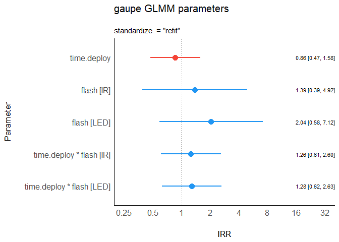<!-- -->

``` r
# default rules, like in bayestestR::equivalence_test()
result <- equivalence_test(m_sp)
plot(result)
```

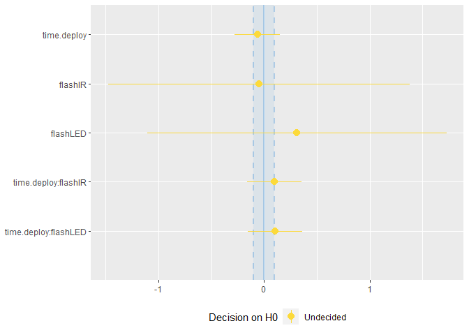<!-- -->

``` r
result
```

    ## # TOST-test for Practical Equivalence
    ## 
    ##   ROPE: [-0.10 0.10]
    ## 
    ##                  Parameter        H0 inside ROPE        90% CI
    ##                (Intercept)  Rejected      0.00 % [-8.06 -5.61]
    ##                time.deploy Undecided     46.32 % [-0.28  0.15]
    ##                 flash [IR] Undecided      6.99 % [-1.48  1.38]
    ##                flash [LED] Undecided      7.05 % [-1.11  1.73]
    ##   time.deploy * flash [IR] Undecided     38.51 % [-0.16  0.36]
    ##  time.deploy * flash [LED] Undecided     38.81 % [-0.15  0.36]

``` r
# Model
m_gaup    = m_sp
# ggpredict 
p_gaup    = p_sp
# report-object
r_gaup    = r_sp
# parameters refit
para_gaup = para_sp
```

# Small species

Added late, because I was unsure about whether it made sense to include
them or not. After having learned about the random effects, I think it
does make sense, even though the cameras in my study were set up with
the original aim of photo capturing lynx.

## Hare

``` r
time_sp <- filter(time.dep4, species %in% sp) #.dep4 = trimmed data
# Model
m_sp  <- lme4::glmer(n.obs ~ time.deploy * flash + # fixed effects
            (1 | loc) + (1 | week), # random effects
            data   = time_sp,
            family = poisson) # poisson family of distributions
```

    ## Warning in checkConv(attr(opt, "derivs"), opt$par, ctrl = control$checkConv, :
    ## Model failed to converge with max|grad| = 0.00986637 (tol = 0.002, component 1)

``` r
# ggpredict is similar to expand.grid
p_sp <- ggeffects::ggpredict(m_sp, terms = c("time.deploy [all]", "flash"))
# Diagnostics
plot(p_sp, add.data = TRUE) + labs(title = "add.data = TRUE")
```

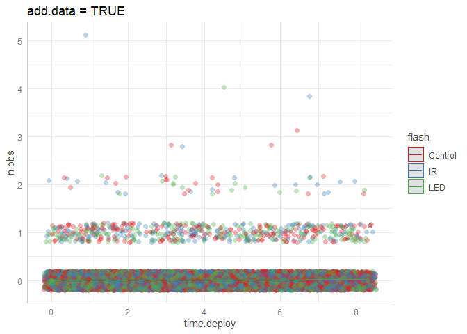<!-- -->

``` r
plot(p_sp, residuals = TRUE) + labs(title = "residuals")
```

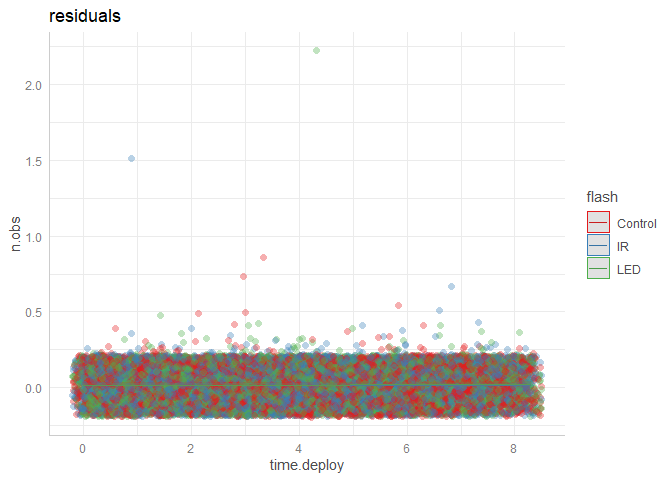<!-- -->

``` r
performance::check_model(m_sp) # check assumptions
```

    ## `geom_smooth()` using formula 'y ~ x'

    ## `stat_bin()` using `bins = 30`. Pick better value with `binwidth`.

    ## Warning: Removed 14815 rows containing missing values (geom_text_repel).

    ## `geom_smooth()` using formula 'y ~ x'

    ## `geom_smooth()` using formula 'y ~ x'

    ## Warning: ggrepel: 227 unlabeled data points (too many overlaps). Consider
    ## increasing max.overlaps

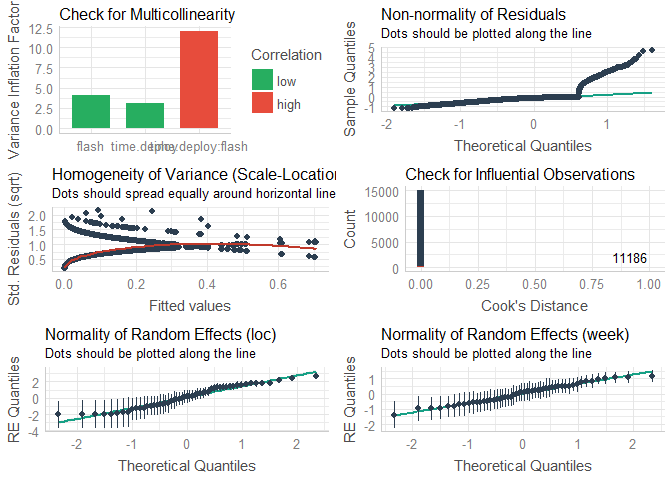<!-- -->

``` r
# Summary, report, model
summary(m_sp)
```

    ## Generalized linear mixed model fit by maximum likelihood (Laplace
    ##   Approximation) [glmerMod]
    ##  Family: poisson  ( log )
    ## Formula: n.obs ~ time.deploy * flash + (1 | loc) + (1 | week)
    ##    Data: time_sp
    ## 
    ##      AIC      BIC   logLik deviance df.resid 
    ##   4896.7   4957.6  -2440.3   4880.7    15035 
    ## 
    ## Scaled residuals: 
    ##     Min      1Q  Median      3Q     Max 
    ## -0.8402 -0.2186 -0.1216 -0.0676 22.0540 
    ## 
    ## Random effects:
    ##  Groups Name        Variance Std.Dev.
    ##  loc    (Intercept) 2.276    1.5085  
    ##  week   (Intercept) 0.492    0.7014  
    ## Number of obs: 15043, groups:  loc, 53; week, 52
    ## 
    ## Fixed effects:
    ##                      Estimate Std. Error z value Pr(>|z|)    
    ## (Intercept)          -4.25356    0.42252 -10.067   <2e-16 ***
    ## time.deploy           0.02071    0.03230   0.641    0.521    
    ## flashIR               0.20461    0.50804   0.403    0.687    
    ## flashLED              0.05787    0.50804   0.114    0.909    
    ## time.deploy:flashIR  -0.03629    0.04684  -0.775    0.439    
    ## time.deploy:flashLED  0.02081    0.04658   0.447    0.655    
    ## ---
    ## Signif. codes:  0 '***' 0.001 '**' 0.01 '*' 0.05 '.' 0.1 ' ' 1
    ## 
    ## Correlation of Fixed Effects:
    ##             (Intr) tm.dpl flshIR flsLED tm.:IR
    ## time.deploy -0.305                            
    ## flashIR     -0.785  0.275                     
    ## flashLED    -0.783  0.275  0.936              
    ## tm.dply:fIR  0.234 -0.746 -0.366 -0.232       
    ## tm.dply:LED  0.231 -0.747 -0.242 -0.370  0.633
    ## optimizer (Nelder_Mead) convergence code: 0 (OK)
    ## Model failed to converge with max|grad| = 0.00986637 (tol = 0.002, component 1)

``` r
r_sp <- report::report(m_sp) # text-summary of my model, to include in a report
para_sp  <- model_parameters(m_sp,   standardize = "refit", two_sd = TRUE, exponentiate = TRUE) 
```

``` r
summary(r_sp)
```

    ## We fitted a poisson mixed model to predict n.obs with time.deploy and flash. The model included loc and week as random effects. The model's total explanatory power is substantial (conditional R2 = 0.40) and the part related to the fixed effects alone (marginal R2) is of 1.07e-03. The model's intercept is at -4.25 (95% CI [-5.08, -3.43]). Within this model:
    ## 
    ##   - The effect of time.deploy is non-significantly positive (beta = 0.02, 95% CI [-0.04, 0.08], p = 0.521, Std. beta = 0.05)
    ##   - The effect of flash [IR] is non-significantly positive (beta = 0.20, 95% CI [-0.79, 1.20], p = 0.687, Std. beta = 0.07)
    ##   - The effect of flash [LED] is non-significantly positive (beta = 0.06, 95% CI [-0.94, 1.05], p = 0.909, Std. beta = 0.14)
    ##   - The interaction effect of flash [IR] on time.deploy is non-significantly negative (beta = -0.04, 95% CI [-0.13, 0.06], p = 0.439, Std. beta = -0.08)
    ##   - The interaction effect of flash [LED] on time.deploy is non-significantly positive (beta = 0.02, 95% CI [-0.07, 0.11], p = 0.655, Std. beta = 0.05)

``` r
as.report_table(r_sp)
```

    ## Parameter                 | Coefficient |         95% CI |      z |  df |      p | Std. Coef. | Std. Coef. 95% CI |      Fit
    ## ----------------------------------------------------------------------------------------------------------------------------
    ## (Intercept)               |       -4.25 | [-5.08, -3.43] | -10.07 | Inf | < .001 |      -4.17 |    [-4.96, -3.39] |         
    ## time.deploy               |        0.02 | [-0.04,  0.08] |   0.64 | Inf | 0.521  |       0.05 |    [-0.10,  0.20] |         
    ## flash [IR]                |        0.20 | [-0.79,  1.20] |   0.40 | Inf | 0.687  |       0.07 |    [-0.86,  0.99] |         
    ## flash [LED]               |        0.06 | [-0.94,  1.05] |   0.11 | Inf | 0.909  |       0.14 |    [-0.79,  1.06] |         
    ## time.deploy * flash [IR]  |       -0.04 | [-0.13,  0.06] |  -0.77 | Inf | 0.439  |      -0.08 |    [-0.30,  0.13] |         
    ## time.deploy * flash [LED] |        0.02 | [-0.07,  0.11] |   0.45 | Inf | 0.655  |       0.05 |    [-0.17,  0.26] |         
    ##                           |             |                |        |     |        |            |                   |         
    ## AIC                       |             |                |        |     |        |            |                   |  4896.67
    ## BIC                       |             |                |        |     |        |            |                   |  4957.62
    ## R2 (conditional)          |             |                |        |     |        |            |                   |     0.40
    ## R2 (marginal)             |             |                |        |     |        |            |                   | 1.07e-03
    ## Sigma                     |             |                |        |     |        |            |                   |     1.00

``` r
result <- model_parameters(m_sp) 
plot(result, size_text = 3) + labs(title = paste0(sp, " GLMM parameters") ,
                                    subtitle = ' not standardized ')
```

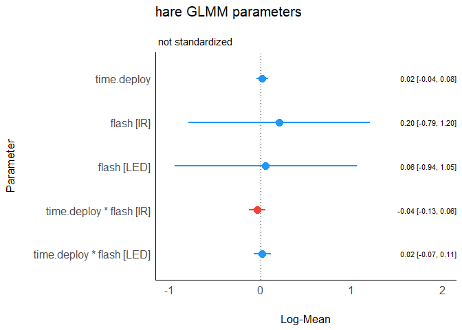<!-- -->

``` r
plot(para_sp, size_text = 3) + labs(title = paste0(sp, " GLMM parameters") ,
                                    subtitle = 'standardize  = "refit" ')
```

    ## Scale for 'y' is already present. Adding another scale for 'y', which will
    ## replace the existing scale.

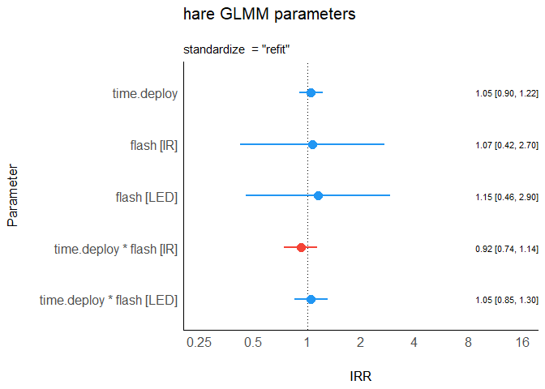<!-- -->

``` r
# default rules, like in bayestestR::equivalence_test()
result <- equivalence_test(m_sp)
plot(result)
```

<!-- -->

``` r
result
```

    ## # TOST-test for Practical Equivalence
    ## 
    ##   ROPE: [-0.10 0.10]
    ## 
    ##                  Parameter        H0 inside ROPE        90% CI
    ##                (Intercept)  Rejected      0.00 % [-4.95 -3.56]
    ##                time.deploy  Accepted    100.00 % [-0.03  0.07]
    ##                 flash [IR] Undecided     11.97 % [-0.63  1.04]
    ##                flash [LED] Undecided     11.97 % [-0.78  0.89]
    ##   time.deploy * flash [IR] Undecided     91.35 % [-0.11  0.04]
    ##  time.deploy * flash [LED]  Accepted    100.00 % [-0.06  0.10]

``` r
# Model
m_hare    = m_sp
# ggpredict 
p_hare    = p_sp
# report-object
r_hare    = r_sp
# parameters refit
para_hare = para_sp
```

## Red squirrel

``` r
time_sp <- filter(time.dep4, species %in% sp) #.dep4 = trimmed data
# Model
m_sp  <- lme4::glmer(n.obs ~ time.deploy * flash + # fixed effects
            (1 | loc) + (1 | week), # random effects
            data   = time_sp,
            family = poisson) # poisson family of distributions
```

    ## Warning in checkConv(attr(opt, "derivs"), opt$par, ctrl = control$checkConv, :
    ## Model failed to converge with max|grad| = 0.113243 (tol = 0.002, component 1)

    ## Warning in checkConv(attr(opt, "derivs"), opt$par, ctrl = control$checkConv, : Model is nearly unidentifiable: very large eigenvalue
    ##  - Rescale variables?

``` r
# ggpredict is similar to expand.grid
p_sp <- ggeffects::ggpredict(m_sp, terms = c("time.deploy [all]", "flash"))
# Diagnostics
plot(p_sp, add.data = TRUE) + labs(title = "add.data = TRUE")
```

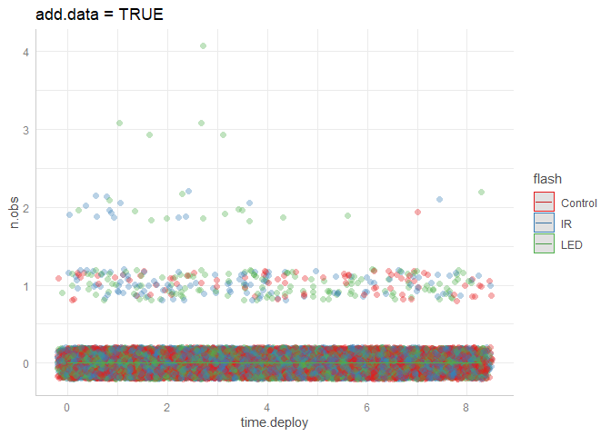<!-- -->

``` r
plot(p_sp, residuals = TRUE) + labs(title = "residuals")
```

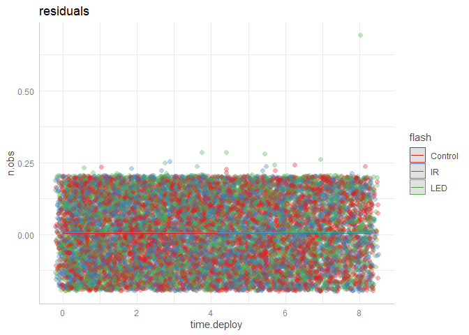<!-- -->

``` r
performance::check_model(m_sp) # check assumptions
```

    ## `geom_smooth()` using formula 'y ~ x'

    ## `stat_bin()` using `bins = 30`. Pick better value with `binwidth`.

    ## Warning: Removed 14752 rows containing missing values (geom_text_repel).

    ## `geom_smooth()` using formula 'y ~ x'

    ## `geom_smooth()` using formula 'y ~ x'

    ## Warning: ggrepel: 288 unlabeled data points (too many overlaps). Consider
    ## increasing max.overlaps

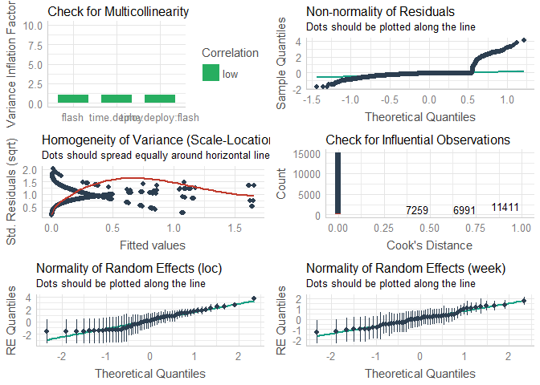<!-- -->

``` r
# Summary, report, model
summary(m_sp)
```

    ## Generalized linear mixed model fit by maximum likelihood (Laplace
    ##   Approximation) [glmerMod]
    ##  Family: poisson  ( log )
    ## Formula: n.obs ~ time.deploy * flash + (1 | loc) + (1 | week)
    ##    Data: time_sp
    ## 
    ##      AIC      BIC   logLik deviance df.resid 
    ##   2863.7   2924.7  -1423.9   2847.7    15035 
    ## 
    ## Scaled residuals: 
    ##     Min      1Q  Median      3Q     Max 
    ## -1.2882 -0.1412 -0.0774 -0.0431 26.0796 
    ## 
    ## Random effects:
    ##  Groups Name        Variance Std.Dev.
    ##  loc    (Intercept) 2.6310   1.6220  
    ##  week   (Intercept) 0.7605   0.8721  
    ## Number of obs: 15043, groups:  loc, 53; week, 52
    ## 
    ## Fixed effects:
    ##                        Estimate Std. Error  z value Pr(>|z|)    
    ## (Intercept)          -5.3159691  0.0006262 -8488.99   <2e-16 ***
    ## time.deploy          -0.0363285  0.0006265   -57.99   <2e-16 ***
    ## flashIR               0.4878993  0.0006261   779.26   <2e-16 ***
    ## flashLED              0.1477795  0.0006261   236.05   <2e-16 ***
    ## time.deploy:flashIR  -0.0693089  0.0006262  -110.68   <2e-16 ***
    ## time.deploy:flashLED  0.0852263  0.0006260   136.15   <2e-16 ***
    ## ---
    ## Signif. codes:  0 '***' 0.001 '**' 0.01 '*' 0.05 '.' 0.1 ' ' 1
    ## 
    ## Correlation of Fixed Effects:
    ##             (Intr) tm.dpl flshIR flsLED tm.:IR
    ## time.deploy 0.000                             
    ## flashIR     0.000  0.000                      
    ## flashLED    0.000  0.000  0.000               
    ## tm.dply:fIR 0.000  0.000  0.000  0.000        
    ## tm.dply:LED 0.000  0.000  0.000  0.000  0.000 
    ## optimizer (Nelder_Mead) convergence code: 0 (OK)
    ## Model failed to converge with max|grad| = 0.113243 (tol = 0.002, component 1)
    ## Model is nearly unidentifiable: very large eigenvalue
    ##  - Rescale variables?

``` r
r_sp <- report::report(m_sp) # text-summary of my model, to include in a report
para_sp  <- model_parameters(m_sp,   standardize = "refit", two_sd = TRUE, exponentiate = TRUE) 
```

    ## Warning in checkConv(attr(opt, "derivs"), opt$par, ctrl = control$checkConv, : Model failed to converge with max|grad| = 0.114356 (tol = 0.002, component 1)

    ## Warning in checkConv(attr(opt, "derivs"), opt$par, ctrl = control$checkConv, : Model is nearly unidentifiable: very large eigenvalue
    ##  - Rescale variables?

``` r
summary(r_sp)
```

    ## We fitted a poisson mixed model to predict n.obs with time.deploy and flash. The model included loc and week as random effects. The model's total explanatory power is substantial (conditional R2 = 0.40) and the part related to the fixed effects alone (marginal R2) is of 7.44e-03. The model's intercept is at -5.32 (95% CI [-5.32, -5.31]). Within this model:
    ## 
    ##   - The effect of time.deploy is significantly negative (beta = -0.04, 95% CI [-0.04, -0.04], p < .001, Std. beta = -0.10)
    ##   - The effect of flash [IR] is significantly positive (beta = 0.49, 95% CI [0.49, 0.49], p < .001, Std. beta = 0.22)
    ##   - The effect of flash [LED] is significantly positive (beta = 0.15, 95% CI [0.15, 0.15], p < .001, Std. beta = 0.47)
    ##   - The interaction effect of flash [IR] on time.deploy is significantly negative (beta = -0.07, 95% CI [-0.07, -0.07], p < .001, Std. beta = -0.15)
    ##   - The interaction effect of flash [LED] on time.deploy is significantly positive (beta = 0.09, 95% CI [0.08, 0.09], p < .001, Std. beta = 0.21)

``` r
as.report_table(r_sp)
```

    ## Parameter                 | Coefficient |         95% CI |        z |  df |      p | Std. Coef. | Std. Coef. 95% CI |      Fit
    ## ------------------------------------------------------------------------------------------------------------------------------
    ## (Intercept)               |       -5.32 | [-5.32, -5.31] | -8488.99 | Inf | < .001 |      -5.45 |    [-5.45, -5.45] |         
    ## time.deploy               |       -0.04 | [-0.04, -0.04] |   -57.99 | Inf | < .001 |      -0.10 |    [-0.10, -0.10] |         
    ## flash [IR]                |        0.49 | [ 0.49,  0.49] |   779.26 | Inf | < .001 |       0.22 |    [ 0.22,  0.22] |         
    ## flash [LED]               |        0.15 | [ 0.15,  0.15] |   236.05 | Inf | < .001 |       0.47 |    [ 0.47,  0.47] |         
    ## time.deploy * flash [IR]  |       -0.07 | [-0.07, -0.07] |  -110.68 | Inf | < .001 |      -0.15 |    [-0.15, -0.15] |         
    ## time.deploy * flash [LED] |        0.09 | [ 0.08,  0.09] |   136.15 | Inf | < .001 |       0.21 |    [ 0.21,  0.21] |         
    ##                           |             |                |          |     |        |            |                   |         
    ## AIC                       |             |                |          |     |        |            |                   |  2863.72
    ## BIC                       |             |                |          |     |        |            |                   |  2924.67
    ## R2 (conditional)          |             |                |          |     |        |            |                   |     0.40
    ## R2 (marginal)             |             |                |          |     |        |            |                   | 7.44e-03
    ## Sigma                     |             |                |          |     |        |            |                   |     1.00

``` r
result <- model_parameters(m_sp) 
plot(result, size_text = 3) + labs(title = paste0(sp, " GLMM parameters") ,
                                    subtitle = ' not standardized ')
```

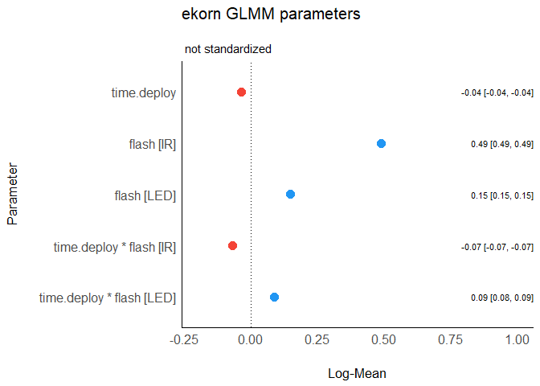<!-- -->

``` r
plot(para_sp, size_text = 3) + labs(title = paste0(sp, " GLMM parameters") ,
                                    subtitle = 'standardize  = "refit" ')
```

    ## Scale for 'y' is already present. Adding another scale for 'y', which will
    ## replace the existing scale.

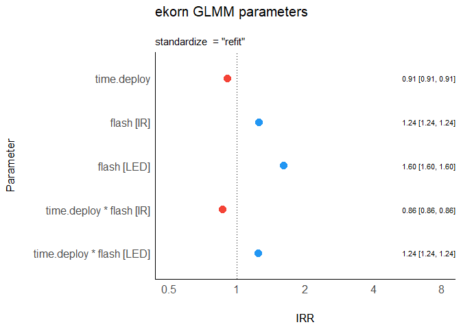<!-- -->

``` r
# default rules, like in bayestestR::equivalence_test()
result <- equivalence_test(m_sp)
plot(result)
```

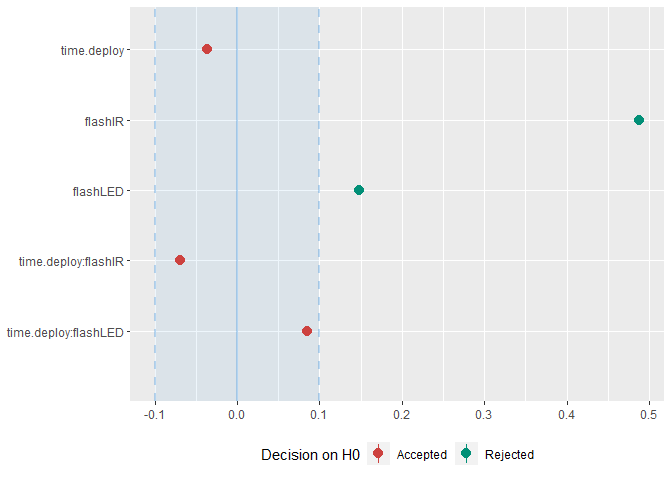<!-- -->

``` r
result
```

    ## # TOST-test for Practical Equivalence
    ## 
    ##   ROPE: [-0.10 0.10]
    ## 
    ##                  Parameter       H0 inside ROPE        90% CI
    ##                (Intercept) Rejected      0.00 % [-5.32 -5.31]
    ##                time.deploy Accepted    100.00 % [-0.04 -0.04]
    ##                 flash [IR] Rejected      0.00 % [ 0.49  0.49]
    ##                flash [LED] Rejected      0.00 % [ 0.15  0.15]
    ##   time.deploy * flash [IR] Accepted    100.00 % [-0.07 -0.07]
    ##  time.deploy * flash [LED] Accepted    100.00 % [ 0.08  0.09]

``` r
# Model
m_ekorn    = m_sp
# ggpredict 
p_ekorn    = p_sp
# report-object
r_ekorn    = r_sp
# parameters refit
para_ekorn = para_sp
```

## European Pine marten

``` r
time_sp <- filter(time.dep4, species %in% sp) #.dep4 = trimmed data
# Model
m_sp  <- lme4::glmer(n.obs ~ time.deploy * flash + # fixed effects
            (1 | loc) + (1 | week), # random effects
            data   = time_sp,
            family = poisson) # poisson family of distributions

# ggpredict is similar to expand.grid
p_sp <- ggeffects::ggpredict(m_sp, terms = c("time.deploy [all]", "flash"))
# Diagnostics
plot(p_sp, add.data = TRUE) + labs(title = "add.data = TRUE")
```

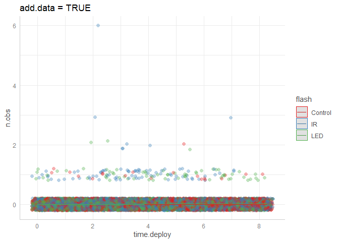<!-- -->

``` r
plot(p_sp, residuals = TRUE) + labs(title = "residuals")
```

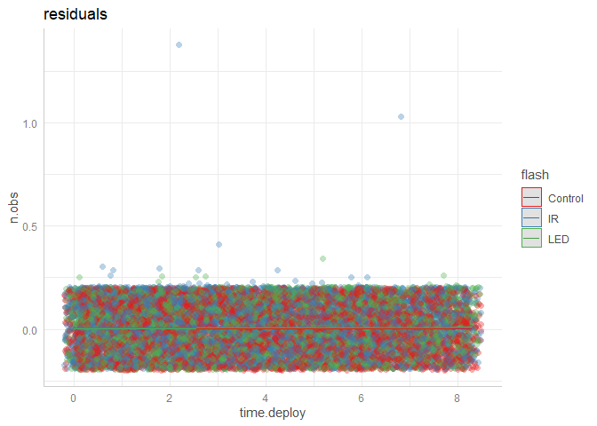<!-- -->

``` r
performance::check_model(m_sp) # check assumptions
```

    ## `geom_smooth()` using formula 'y ~ x'

    ## `stat_bin()` using `bins = 30`. Pick better value with `binwidth`.

    ## Warning: Removed 14489 rows containing missing values (geom_text_repel).

    ## `geom_smooth()` using formula 'y ~ x'

    ## `geom_smooth()` using formula 'y ~ x'

    ## Warning: ggrepel: 553 unlabeled data points (too many overlaps). Consider
    ## increasing max.overlaps

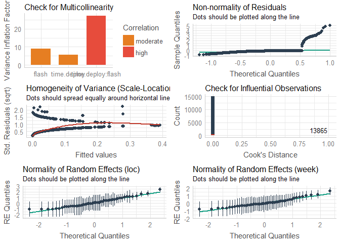<!-- -->

``` r
# Summary, report, model
summary(m_sp)
```

    ## Generalized linear mixed model fit by maximum likelihood (Laplace
    ##   Approximation) [glmerMod]
    ##  Family: poisson  ( log )
    ## Formula: n.obs ~ time.deploy * flash + (1 | loc) + (1 | week)
    ##    Data: time_sp
    ## 
    ##      AIC      BIC   logLik deviance df.resid 
    ##   1815.0   1875.9   -899.5   1799.0    15035 
    ## 
    ## Scaled residuals: 
    ##     Min      1Q  Median      3Q     Max 
    ## -0.6267 -0.1062 -0.0690 -0.0501 29.5936 
    ## 
    ## Random effects:
    ##  Groups Name        Variance Std.Dev.
    ##  loc    (Intercept) 1.0194   1.010   
    ##  week   (Intercept) 0.4956   0.704   
    ## Number of obs: 15043, groups:  loc, 53; week, 52
    ## 
    ## Fixed effects:
    ##                      Estimate Std. Error z value Pr(>|z|)    
    ## (Intercept)          -6.04902    0.53409 -11.326   <2e-16 ***
    ## time.deploy           0.01182    0.09185   0.129   0.8976    
    ## flashIR               1.35459    0.59653   2.271   0.0232 *  
    ## flashLED              0.44709    0.62472   0.716   0.4742    
    ## time.deploy:flashIR  -0.03211    0.10764  -0.298   0.7655    
    ## time.deploy:flashLED  0.10500    0.11080   0.948   0.3433    
    ## ---
    ## Signif. codes:  0 '***' 0.001 '**' 0.01 '*' 0.05 '.' 0.1 ' ' 1
    ## 
    ## Correlation of Fixed Effects:
    ##             (Intr) tm.dpl flshIR flsLED tm.:IR
    ## time.deploy -0.720                            
    ## flashIR     -0.844  0.661                     
    ## flashLED    -0.807  0.634  0.851              
    ## tm.dply:fIR  0.608 -0.860 -0.729 -0.572       
    ## tm.dply:LED  0.595 -0.840 -0.581 -0.751  0.763

``` r
r_sp <- report::report(m_sp) # text-summary of my model, to include in a report
para_sp  <- model_parameters(m_sp,   standardize = "refit", two_sd = TRUE, exponentiate = TRUE) 
```

``` r
summary(r_sp)
```

    ## We fitted a poisson mixed model to predict n.obs with time.deploy and flash. The model included loc and week as random effects. The model's total explanatory power is moderate (conditional R2 = 0.26) and the part related to the fixed effects alone (marginal R2) is of 0.04. The model's intercept is at -6.05 (95% CI [-7.10, -5.00]). Within this model:
    ## 
    ##   - The effect of time.deploy is non-significantly positive (beta = 0.01, 95% CI [-0.17, 0.19], p = 0.898, Std. beta = 0.03)
    ##   - The effect of flash [IR] is significantly positive (beta = 1.35, 95% CI [0.19, 2.52], p < .05, Std. beta = 1.23)
    ##   - The effect of flash [LED] is non-significantly positive (beta = 0.45, 95% CI [-0.78, 1.67], p = 0.474, Std. beta = 0.85)
    ##   - The interaction effect of flash [IR] on time.deploy is non-significantly negative (beta = -0.03, 95% CI [-0.24, 0.18], p = 0.765, Std. beta = -0.08)
    ##   - The interaction effect of flash [LED] on time.deploy is non-significantly positive (beta = 0.10, 95% CI [-0.11, 0.32], p = 0.343, Std. beta = 0.25)

``` r
as.report_table(r_sp)
```

    ## Parameter                 | Coefficient |         95% CI |      z |  df |      p | Std. Coef. | Std. Coef. 95% CI |     Fit
    ## ---------------------------------------------------------------------------------------------------------------------------
    ## (Intercept)               |       -6.05 | [-7.10, -5.00] | -11.33 | Inf | < .001 |      -6.00 |    [-6.73, -5.27] |        
    ## time.deploy               |        0.01 | [-0.17,  0.19] |   0.13 | Inf | 0.898  |       0.03 |    [-0.40,  0.45] |        
    ## flash [IR]                |        1.35 | [ 0.19,  2.52] |   2.27 | Inf | 0.023  |       1.23 |    [ 0.43,  2.03] |        
    ## flash [LED]               |        0.45 | [-0.78,  1.67] |   0.72 | Inf | 0.474  |       0.85 |    [ 0.04,  1.66] |        
    ## time.deploy * flash [IR]  |       -0.03 | [-0.24,  0.18] |  -0.30 | Inf | 0.765  |      -0.08 |    [-0.57,  0.42] |        
    ## time.deploy * flash [LED] |        0.10 | [-0.11,  0.32] |   0.95 | Inf | 0.343  |       0.25 |    [-0.26,  0.76] |        
    ##                           |             |                |        |     |        |            |                   |        
    ## AIC                       |             |                |        |     |        |            |                   | 1814.96
    ## BIC                       |             |                |        |     |        |            |                   | 1875.91
    ## R2 (conditional)          |             |                |        |     |        |            |                   |    0.26
    ## R2 (marginal)             |             |                |        |     |        |            |                   |    0.04
    ## Sigma                     |             |                |        |     |        |            |                   |    1.00

``` r
result <- model_parameters(m_sp) 
plot(result, size_text = 3) + labs(title = paste0(sp, " GLMM parameters") ,
                                    subtitle = ' not standardized ')
```

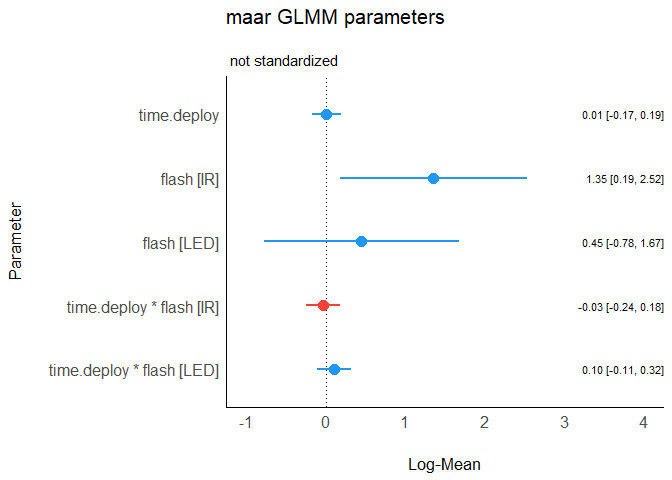<!-- -->

``` r
plot(para_sp, size_text = 3) + labs(title = paste0(sp, " GLMM parameters") ,
                                    subtitle = 'standardize  = "refit" ')
```

    ## Scale for 'y' is already present. Adding another scale for 'y', which will
    ## replace the existing scale.

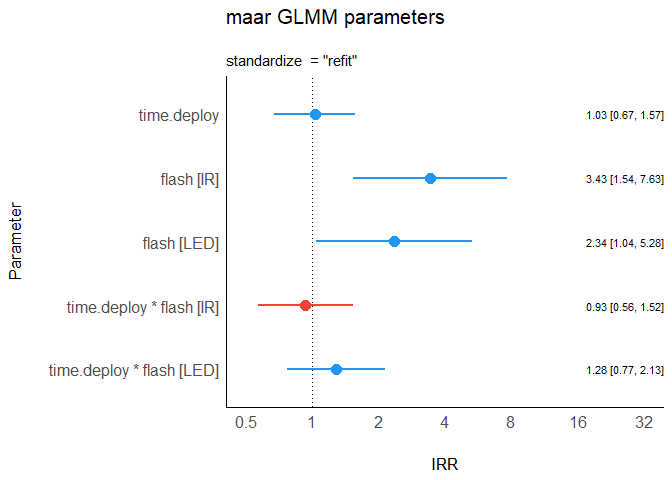<!-- -->

``` r
# default rules, like in bayestestR::equivalence_test()
result <- equivalence_test(m_sp)
plot(result)
```

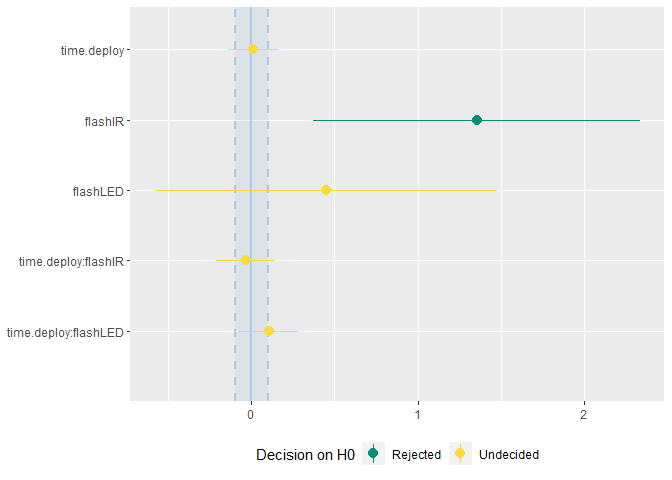<!-- -->

``` r
result
```

    ## # TOST-test for Practical Equivalence
    ## 
    ##   ROPE: [-0.10 0.10]
    ## 
    ##                  Parameter        H0 inside ROPE        90% CI
    ##                (Intercept)  Rejected      0.00 % [-6.93 -5.17]
    ##                time.deploy Undecided     66.19 % [-0.14  0.16]
    ##                 flash [IR]  Rejected      0.00 % [ 0.37  2.34]
    ##                flash [LED] Undecided      9.73 % [-0.58  1.47]
    ##   time.deploy * flash [IR] Undecided     56.48 % [-0.21  0.14]
    ##  time.deploy * flash [LED] Undecided     48.63 % [-0.08  0.29]

``` r
# Model
m_maar    = m_sp
# ggpredict 
p_maar    = p_sp
# report-object
r_maar    = r_sp
# parameters refit
para_maar = para_sp
```

|                                                                                                                                                                                                                                                                                                                                                                                                                                                                                                                                                                                                                                                                                                                                                                                                                                                                                                                                                                                                                                                                                                                                                                                                                                                                 |
|:----------------------------------------------------------------------------------------------------------------------------------------------------------------------------------------------------------------------------------------------------------------------------------------------------------------------------------------------------------------------------------------------------------------------------------------------------------------------------------------------------------------------------------------------------------------------------------------------------------------------------------------------------------------------------------------------------------------------------------------------------------------------------------------------------------------------------------------------------------------------------------------------------------------------------------------------------------------------------------------------------------------------------------------------------------------------------------------------------------------------------------------------------------------------------------------------------------------------------------------------------------------|
| \# All models                                                                                                                                                                                                                                                                                                                                                                                                                                                                                                                                                                                                                                                                                                                                                                                                                                                                                                                                                                                                                                                                                                                                                                                                                                                   |
| `r # rmarkdown::render("glmm_sp.Rmd", output_format = "github_document")`                                                                                                                                                                                                                                                                                                                                                                                                                                                                                                                                                                                                                                                                                                                                                                                                                                                                                                                                                                                                                                                                                                                                                                                       |
| \#\# Parameter-table                                                                                                                                                                                                                                                                                                                                                                                                                                                                                                                                                                                                                                                                                                                                                                                                                                                                                                                                                                                                                                                                                                                                                                                                                                            |
| `r library(xtable)  # To make a latex-table for the thesis`                                                                                                                                                                                                                                                                                                                                                                                                                                                                                                                                                                                                                                                                                                                                                                                                                                                                                                                                                                                                                                                                                                                                                                                                     |
| `## ## Attaching package: 'xtable'`                                                                                                                                                                                                                                                                                                                                                                                                                                                                                                                                                                                                                                                                                                                                                                                                                                                                                                                                                                                                                                                                                                                                                                                                                             |
| `## The following object is masked from 'package:parameters': ## ##     display`                                                                                                                                                                                                                                                                                                                                                                                                                                                                                                                                                                                                                                                                                                                                                                                                                                                                                                                                                                                                                                                                                                                                                                                |
| `## The following object is masked from 'package:performance': ## ##     display`                                                                                                                                                                                                                                                                                                                                                                                                                                                                                                                                                                                                                                                                                                                                                                                                                                                                                                                                                                                                                                                                                                                                                                               |
| \`\`\`r para\_raa &lt;- para\_raa %&gt;% add\_row(Parameter = “Roe deer”, .before = 1) \# adds a row for species name in the resulting table para\_rev &lt;- para\_rev %&gt;% add\_row(Parameter = “Red fox”, .before = 1) para\_grvl &lt;- para\_grvl %&gt;% add\_row(Parameter = “Badger”, .before = 1) para\_elg &lt;- para\_elg %&gt;% add\_row(Parameter = “Moose”, .before = 1) para\_hjort&lt;- para\_hjort %&gt;% add\_row(Parameter = “Red deer”, .before = 1) para\_gaup &lt;- para\_gaup %&gt;% add\_row(Parameter = “Lynx”, .before = 1) para\_hare &lt;- para\_hare %&gt;% add\_row(Parameter = “Hare”, .before = 1) para\_maar &lt;- para\_maar %&gt;% add\_row(Parameter = “European Pine Marten”, .before = 1) para\_ekorn&lt;- para\_ekorn %&gt;% add\_row(Parameter = “Red squirrel”, .before = 1)                                                                                                                                                                                                                                                                                                                                                                                                                                            |
| \# bind tables together para\_all &lt;- bind\_rows(para\_raa, para\_rev, para\_grvl,para\_elg,para\_hjort,para\_gaup,para\_hare,para\_ekorn,para\_maar) %&gt;% insight::format\_table(ci\_brackets = c(“(”, “)”)) %&gt;% \#prettier ci-brackets select(!df) \# remove the df-column, containing “Inf” for every species                                                                                                                                                                                                                                                                                                                                                                                                                                                                                                                                                                                                                                                                                                                                                                                                                                                                                                                                         |
| \# save as latex-table in the Thesis folder print(xtable(para\_all, type = “latex”), include.colnames = F, file = “../Thesis/tex/tab/parameters.tex”)                                                                                                                                                                                                                                                                                                                                                                                                                                                                                                                                                                                                                                                                                                                                                                                                                                                                                                                                                                                                                                                                                                           |
| \# unable to find a automated way of removing \\end{table} \`\`\`                                                                                                                                                                                                                                                                                                                                                                                                                                                                                                                                                                                                                                                                                                                                                                                                                                                                                                                                                                                                                                                                                                                                                                                               |
| \#\# Joint forest-plots                                                                                                                                                                                                                                                                                                                                                                                                                                                                                                                                                                                                                                                                                                                                                                                                                                                                                                                                                                                                                                                                                                                                                                                                                                         |
| Plots divided into size-based groups of three x three species. Thus, ungulates are one group, the largest carnivores are one, and the smallest three form the most mixed group of hare, squirrel and pine marten                                                                                                                                                                                                                                                                                                                                                                                                                                                                                                                                                                                                                                                                                                                                                                                                                                                                                                                                                                                                                                                |
| `r sjPlot::plot_models(m_rev, m_grvl, m_gaup, spacing = 0.4, legend.title = "Species", m.labels = c("Badger","Lynx","Red fox"))`                                                                                                                                                                                                                                                                                                                                                                                                                                                                                                                                                                                                                                                                                                                                                                                                                                                                                                                                                                                                                                                                                                                                |
| 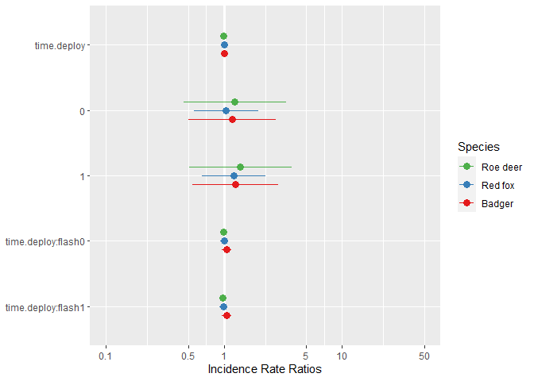<!-- -->                                                                                                                                                                                                                                                                                                                                                                                                                                                                                                                                                                                                                                                                                                                                                                                                                                                                                                                                                                                                                                                                                                                                                                                                            |
| `r sjPlot::plot_models(m_raa, m_elg, m_hjort, spacing = 0.4, legend.title = "Species", m.labels = c("Roe deer","Moose","Red deer"))`                                                                                                                                                                                                                                                                                                                                                                                                                                                                                                                                                                                                                                                                                                                                                                                                                                                                                                                                                                                                                                                                                                                            |
| 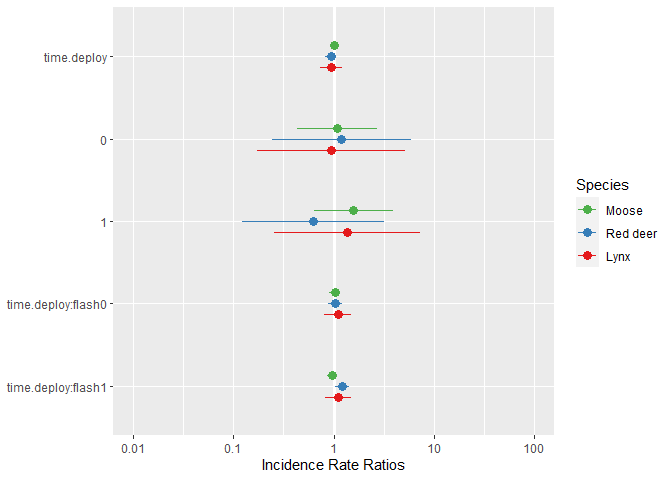<!-- -->                                                                                                                                                                                                                                                                                                                                                                                                                                                                                                                                                                                                                                                                                                                                                                                                                                                                                                                                                                                                                                                                                                                                                                                                            |
| `r sjPlot::plot_models(m_ekorn, m_hare, m_maar, spacing = 0.4, legend.title = "Species", m.labels = c("Hare","Pine marten","Red squirrel"))`                                                                                                                                                                                                                                                                                                                                                                                                                                                                                                                                                                                                                                                                                                                                                                                                                                                                                                                                                                                                                                                                                                                    |
| 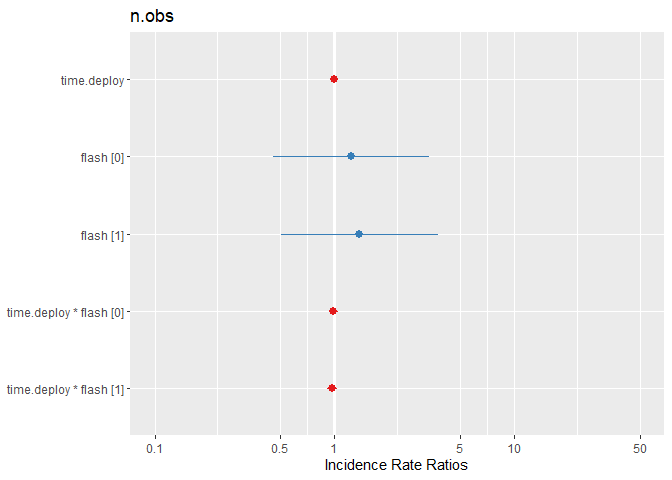<!-- -->                                                                                                                                                                                                                                                                                                                                                                                                                                                                                                                                                                                                                                                                                                                                                                                                                                                                                                                                                                                                                                                                                                                                                                                                            |
| \#\# Predict-plots                                                                                                                                                                                                                                                                                                                                                                                                                                                                                                                                                                                                                                                                                                                                                                                                                                                                                                                                                                                                                                                                                                                                                                                                                                              |
| ggpredict-plots for marginal effects.                                                                                                                                                                                                                                                                                                                                                                                                                                                                                                                                                                                                                                                                                                                                                                                                                                                                                                                                                                                                                                                                                                                                                                                                                           |
| `r p_raa   %>% plot() + labs(title = "", subtitle = "Roe deer" )`                                                                                                                                                                                                                                                                                                                                                                                                                                                                                                                                                                                                                                                                                                                                                                                                                                                                                                                                                                                                                                                                                                                                                                                               |
| 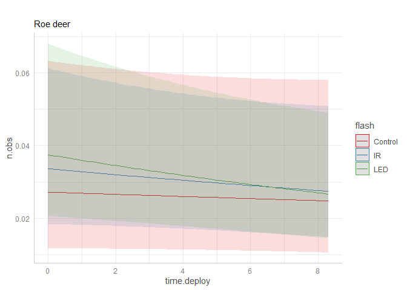<!-- -->                                                                                                                                                                                                                                                                                                                                                                                                                                                                                                                                                                                                                                                                                                                                                                                                                                                                                                                                                                                                                                                                                                                                                                                                         |
| `r p_rev   %>% plot() + labs(title = "", subtitle = "Red fox " )`                                                                                                                                                                                                                                                                                                                                                                                                                                                                                                                                                                                                                                                                                                                                                                                                                                                                                                                                                                                                                                                                                                                                                                                               |
| <!-- -->                                                                                                                                                                                                                                                                                                                                                                                                                                                                                                                                                                                                                                                                                                                                                                                                                                                                                                                                                                                                                                                                                                                                                                                                         |
| `r p_grvl  %>% plot() + labs(title = "", subtitle = "Badger "  )`                                                                                                                                                                                                                                                                                                                                                                                                                                                                                                                                                                                                                                                                                                                                                                                                                                                                                                                                                                                                                                                                                                                                                                                               |
| 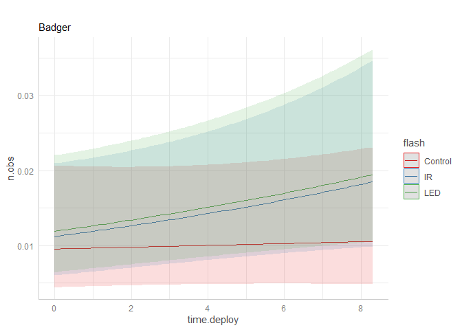<!-- -->                                                                                                                                                                                                                                                                                                                                                                                                                                                                                                                                                                                                                                                                                                                                                                                                                                                                                                                                                                                                                                                                                                                                                                                                         |
| `r p_elg   %>% plot() + labs(title = "", subtitle = "Moose "   )`                                                                                                                                                                                                                                                                                                                                                                                                                                                                                                                                                                                                                                                                                                                                                                                                                                                                                                                                                                                                                                                                                                                                                                                               |
| 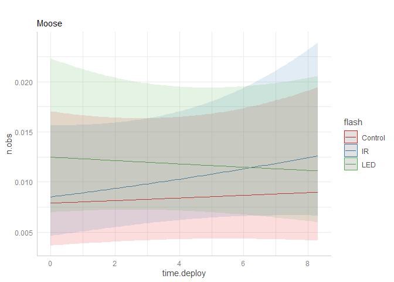<!-- -->                                                                                                                                                                                                                                                                                                                                                                                                                                                                                                                                                                                                                                                                                                                                                                                                                                                                                                                                                                                                                                                                                                                                                                                                         |
| `r p_hjort %>% plot() + labs(title = "", subtitle = "Red deer" )`                                                                                                                                                                                                                                                                                                                                                                                                                                                                                                                                                                                                                                                                                                                                                                                                                                                                                                                                                                                                                                                                                                                                                                                               |
| 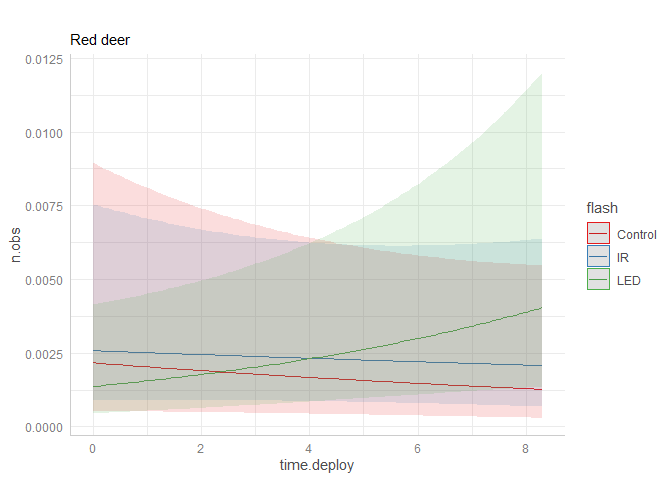<!-- -->                                                                                                                                                                                                                                                                                                                                                                                                                                                                                                                                                                                                                                                                                                                                                                                                                                                                                                                                                                                                                                                                                                                                                                                                         |
| `r p_gaup  %>% plot() + labs(title = "", subtitle = "Lynx "    )`                                                                                                                                                                                                                                                                                                                                                                                                                                                                                                                                                                                                                                                                                                                                                                                                                                                                                                                                                                                                                                                                                                                                                                                               |
| 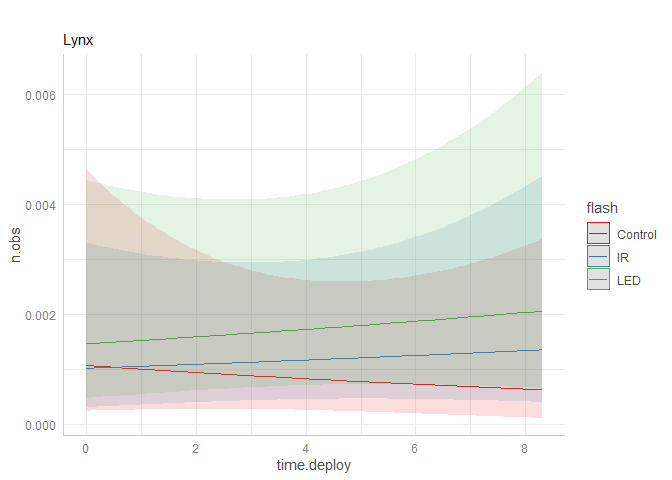<!-- -->                                                                                                                                                                                                                                                                                                                                                                                                                                                                                                                                                                                                                                                                                                                                                                                                                                                                                                                                                                                                                                                                                                                                                                                                         |
| `r p_hare  %>% plot() + labs(title = "", subtitle = "Hare"    )`                                                                                                                                                                                                                                                                                                                                                                                                                                                                                                                                                                                                                                                                                                                                                                                                                                                                                                                                                                                                                                                                                                                                                                                                |
| 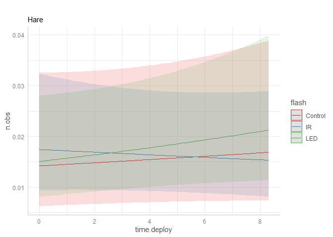<!-- -->                                                                                                                                                                                                                                                                                                                                                                                                                                                                                                                                                                                                                                                                                                                                                                                                                                                                                                                                                                                                                                                                                                                                                                                                         |
| `r p_maar  %>% plot() + labs(title = "", subtitle = "European Pine marten"    )`                                                                                                                                                                                                                                                                                                                                                                                                                                                                                                                                                                                                                                                                                                                                                                                                                                                                                                                                                                                                                                                                                                                                                                                |
| 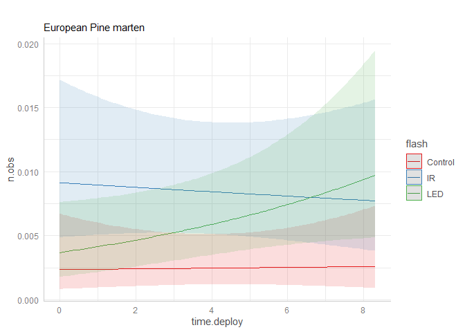<!-- -->                                                                                                                                                                                                                                                                                                                                                                                                                                                                                                                                                                                                                                                                                                                                                                                                                                                                                                                                                                                                                                                                                                                                                                                                         |
| `r p_ekorn %>% plot() + labs(title = "", subtitle = "Red squirrel"    )`                                                                                                                                                                                                                                                                                                                                                                                                                                                                                                                                                                                                                                                                                                                                                                                                                                                                                                                                                                                                                                                                                                                                                                                        |
| 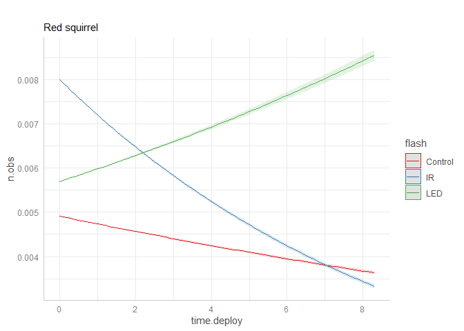<!-- -->                                                                                                                                                                                                                                                                                                                                                                                                                                                                                                                                                                                                                                                                                                                                                                                                                                                                                                                                                                                                                                                                                                                                                                                                         |
| \#\# Model comparison-plots                                                                                                                                                                                                                                                                                                                                                                                                                                                                                                                                                                                                                                                                                                                                                                                                                                                                                                                                                                                                                                                                                                                                                                                                                                     |
| Whichs species’ detection rates was best explained by the my model formula?                                                                                                                                                                                                                                                                                                                                                                                                                                                                                                                                                                                                                                                                                                                                                                                                                                                                                                                                                                                                                                                                                                                                                                                     |
| `r m_compare <- compare_performance(m_raa,m_rev,m_grvl,m_elg,m_hjort, m_gaup, m_hare, m_ekorn, m_maar, metrics = "common", rank=T) # "common" will compute AIC, BIC, R2, ICC and RMSE`                                                                                                                                                                                                                                                                                                                                                                                                                                                                                                                                                                                                                                                                                                                                                                                                                                                                                                                                                                                                                                                                          |
| `## Warning: When comparing models, please note that probably not all models were ## fit from same data.`                                                                                                                                                                                                                                                                                                                                                                                                                                                                                                                                                                                                                                                                                                                                                                                                                                                                                                                                                                                                                                                                                                                                                       |
| `r m_compare`                                                                                                                                                                                                                                                                                                                                                                                                                                                                                                                                                                                                                                                                                                                                                                                                                                                                                                                                                                                                                                                                                                                                                                                                                                                   |
| `## # Comparison of Model Performance Indices ## ## Name    |    Model |      AIC |      BIC | R2 (cond.) | R2 (marg.) |   ICC |  RMSE | Performance-Score ## ------------------------------------------------------------------------------------------------------ ## m_hjort | glmerMod | 1788.005 | 1848.954 |      0.481 |      0.006 | 0.478 | 0.119 |            76.76% ## m_gaup  | glmerMod |  747.658 |  808.607 |      0.337 |      0.012 | 0.329 | 0.065 |            73.91% ## m_maar  | glmerMod | 1814.960 | 1875.909 |      0.255 |      0.041 | 0.223 | 0.122 |            67.80% ## m_ekorn | glmerMod | 2863.725 | 2924.674 |      0.396 |      0.007 | 0.391 | 0.158 |            61.20% ## m_elg   | glmerMod | 2981.889 | 3042.839 |      0.269 |      0.003 | 0.267 | 0.155 |            47.11% ## m_grvl  | glmerMod | 4673.231 | 4734.180 |      0.372 |      0.005 | 0.369 | 0.210 |            45.81% ## m_hare  | glmerMod | 4896.671 | 4957.620 |      0.345 |  9.179e-04 | 0.344 | 0.223 |            39.56% ## m_raa   | glmerMod | 7669.274 | 7730.224 |      0.359 |      0.001 | 0.358 | 0.307 |            21.96% ## m_rev   | glmerMod | 5619.865 | 5680.814 |      0.134 |  8.091e-04 | 0.133 | 0.220 |            15.87%` |
| `` r m_compare %>% plot() #A `range` must be provided for data with only one observation. ``                                                                                                                                                                                                                                                                                                                                                                                                                                                                                                                                                                                                                                                                                                                                                                                                                                                                                                                                                                                                                                                                                                                                                                    |
| 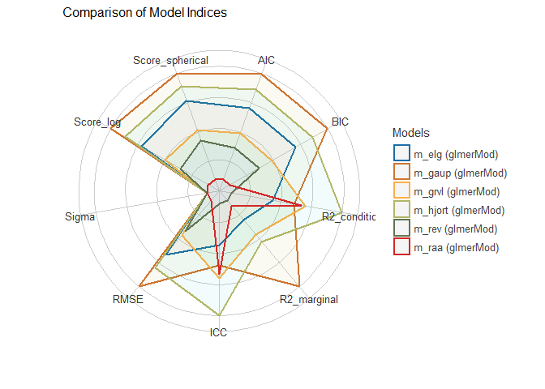<!-- -->                                                                                                                                                                                                                                                                                                                                                                                                                                                                                                                                                                                                                                                                                                                                                                                                                                                                                                                                                                                                                                                                                                                                                                                                     |
| `r # test_performance(m_raa,m_rev,m_grvl,m_elg,m_hjort,m_gaup) #models don't have the same response variable, # which is because they are different subsets of each other`                                                                                                                                                                                                                                                                                                                                                                                                                                                                                                                                                                                                                                                                                                                                                                                                                                                                                                                                                                                                                                                                                      |
| `r check_overdispersion(m_raa)   # No overdispersion detected`                                                                                                                                                                                                                                                                                                                                                                                                                                                                                                                                                                                                                                                                                                                                                                                                                                                                                                                                                                                                                                                                                                                                                                                                  |
| `## # Overdispersion test ## ##        dispersion ratio =     0.805 ##   Pearson's Chi-Squared = 12106.261 ##                 p-value =         1`                                                                                                                                                                                                                                                                                                                                                                                                                                                                                                                                                                                                                                                                                                                                                                                                                                                                                                                                                                                                                                                                                                              |
| `## No overdispersion detected.`                                                                                                                                                                                                                                                                                                                                                                                                                                                                                                                                                                                                                                                                                                                                                                                                                                                                                                                                                                                                                                                                                                                                                                                                                                |
| `r check_overdispersion(m_rev)   # -     -    | |    -    -`                                                                                                                                                                                                                                                                                                                                                                                                                                                                                                                                                                                                                                                                                                                                                                                                                                                                                                                                                                                                                                                                                                                                                                                                    |
| `## # Overdispersion test ## ##        dispersion ratio =     0.874 ##   Pearson's Chi-Squared = 13146.532 ##                 p-value =         1`                                                                                                                                                                                                                                                                                                                                                                                                                                                                                                                                                                                                                                                                                                                                                                                                                                                                                                                                                                                                                                                                                                              |
| `## No overdispersion detected.`                                                                                                                                                                                                                                                                                                                                                                                                                                                                                                                                                                                                                                                                                                                                                                                                                                                                                                                                                                                                                                                                                                                                                                                                                                |
| `r check_overdispersion(m_grvl)  # -     -    | |    -    -`                                                                                                                                                                                                                                                                                                                                                                                                                                                                                                                                                                                                                                                                                                                                                                                                                                                                                                                                                                                                                                                                                                                                                                                                    |
| `## # Overdispersion test ## ##        dispersion ratio =     0.753 ##   Pearson's Chi-Squared = 11319.647 ##                 p-value =         1`                                                                                                                                                                                                                                                                                                                                                                                                                                                                                                                                                                                                                                                                                                                                                                                                                                                                                                                                                                                                                                                                                                              |
| `## No overdispersion detected.`                                                                                                                                                                                                                                                                                                                                                                                                                                                                                                                                                                                                                                                                                                                                                                                                                                                                                                                                                                                                                                                                                                                                                                                                                                |
| `r check_overdispersion(m_elg)   # -     -    | |    -    -`                                                                                                                                                                                                                                                                                                                                                                                                                                                                                                                                                                                                                                                                                                                                                                                                                                                                                                                                                                                                                                                                                                                                                                                                    |
| `## # Overdispersion test ## ##        dispersion ratio =     0.725 ##   Pearson's Chi-Squared = 10906.898 ##                 p-value =         1`                                                                                                                                                                                                                                                                                                                                                                                                                                                                                                                                                                                                                                                                                                                                                                                                                                                                                                                                                                                                                                                                                                              |
| `## No overdispersion detected.`                                                                                                                                                                                                                                                                                                                                                                                                                                                                                                                                                                                                                                                                                                                                                                                                                                                                                                                                                                                                                                                                                                                                                                                                                                |
| `r check_overdispersion(m_hjort) # -     -    | |    -    -`                                                                                                                                                                                                                                                                                                                                                                                                                                                                                                                                                                                                                                                                                                                                                                                                                                                                                                                                                                                                                                                                                                                                                                                                    |
| `## # Overdispersion test ## ##        dispersion ratio =    0.513 ##   Pearson's Chi-Squared = 7717.267 ##                 p-value =        1`                                                                                                                                                                                                                                                                                                                                                                                                                                                                                                                                                                                                                                                                                                                                                                                                                                                                                                                                                                                                                                                                                                                 |
| `## No overdispersion detected.`                                                                                                                                                                                                                                                                                                                                                                                                                                                                                                                                                                                                                                                                                                                                                                                                                                                                                                                                                                                                                                                                                                                                                                                                                                |
| `r check_overdispersion(m_gaup)  # -     -    | |    -    -`                                                                                                                                                                                                                                                                                                                                                                                                                                                                                                                                                                                                                                                                                                                                                                                                                                                                                                                                                                                                                                                                                                                                                                                                    |
| `## # Overdispersion test ## ##        dispersion ratio =    0.463 ##   Pearson's Chi-Squared = 6957.452 ##                 p-value =        1`                                                                                                                                                                                                                                                                                                                                                                                                                                                                                                                                                                                                                                                                                                                                                                                                                                                                                                                                                                                                                                                                                                                 |
| `## No overdispersion detected.`                                                                                                                                                                                                                                                                                                                                                                                                                                                                                                                                                                                                                                                                                                                                                                                                                                                                                                                                                                                                                                                                                                                                                                                                                                |
| `r check_zeroinflation(m_raa)   # Model seems ok, ratio of observed and`                                                                                                                                                                                                                                                                                                                                                                                                                                                                                                                                                                                                                                                                                                                                                                                                                                                                                                                                                                                                                                                                                                                                                                                        |
| `## # Check for zero-inflation ## ##    Observed zeros: 13874 ##   Predicted zeros: 13854 ##             Ratio: 1.00`                                                                                                                                                                                                                                                                                                                                                                                                                                                                                                                                                                                                                                                                                                                                                                                                                                                                                                                                                                                                                                                                                                                                           |
| `## Model seems ok, ratio of observed and predicted zeros is within the tolerance range.`                                                                                                                                                                                                                                                                                                                                                                                                                                                                                                                                                                                                                                                                                                                                                                                                                                                                                                                                                                                                                                                                                                                                                                       |
| `r check_zeroinflation(m_rev)   #    predicted zeros is within the tolerance range.`                                                                                                                                                                                                                                                                                                                                                                                                                                                                                                                                                                                                                                                                                                                                                                                                                                                                                                                                                                                                                                                                                                                                                                            |
| `## # Check for zero-inflation ## ##    Observed zeros: 14327 ##   Predicted zeros: 14335 ##             Ratio: 1.00`                                                                                                                                                                                                                                                                                                                                                                                                                                                                                                                                                                                                                                                                                                                                                                                                                                                                                                                                                                                                                                                                                                                                           |
| `## Model seems ok, ratio of observed and predicted zeros is within the tolerance range.`                                                                                                                                                                                                                                                                                                                                                                                                                                                                                                                                                                                                                                                                                                                                                                                                                                                                                                                                                                                                                                                                                                                                                                       |
| `r check_zeroinflation(m_grvl)  #          -     -    | |    -    -`                                                                                                                                                                                                                                                                                                                                                                                                                                                                                                                                                                                                                                                                                                                                                                                                                                                                                                                                                                                                                                                                                                                                                                                            |
| `## # Check for zero-inflation ## ##    Observed zeros: 14400 ##   Predicted zeros: 14412 ##             Ratio: 1.00`                                                                                                                                                                                                                                                                                                                                                                                                                                                                                                                                                                                                                                                                                                                                                                                                                                                                                                                                                                                                                                                                                                                                           |
| `## Model seems ok, ratio of observed and predicted zeros is within the tolerance range.`                                                                                                                                                                                                                                                                                                                                                                                                                                                                                                                                                                                                                                                                                                                                                                                                                                                                                                                                                                                                                                                                                                                                                                       |
| `r check_zeroinflation(m_elg)   #          -     -    | |    -    -`                                                                                                                                                                                                                                                                                                                                                                                                                                                                                                                                                                                                                                                                                                                                                                                                                                                                                                                                                                                                                                                                                                                                                                                            |
| `## # Check for zero-inflation ## ##    Observed zeros: 14727 ##   Predicted zeros: 14724 ##             Ratio: 1.00`                                                                                                                                                                                                                                                                                                                                                                                                                                                                                                                                                                                                                                                                                                                                                                                                                                                                                                                                                                                                                                                                                                                                           |
| `## Model seems ok, ratio of observed and predicted zeros is within the tolerance range.`                                                                                                                                                                                                                                                                                                                                                                                                                                                                                                                                                                                                                                                                                                                                                                                                                                                                                                                                                                                                                                                                                                                                                                       |
| `r check_zeroinflation(m_hjort) #          -     -    | |    -    -`                                                                                                                                                                                                                                                                                                                                                                                                                                                                                                                                                                                                                                                                                                                                                                                                                                                                                                                                                                                                                                                                                                                                                                                            |
| `## # Check for zero-inflation ## ##    Observed zeros: 14864 ##   Predicted zeros: 14859 ##             Ratio: 1.00`                                                                                                                                                                                                                                                                                                                                                                                                                                                                                                                                                                                                                                                                                                                                                                                                                                                                                                                                                                                                                                                                                                                                           |
| `## Model seems ok, ratio of observed and predicted zeros is within the tolerance range.`                                                                                                                                                                                                                                                                                                                                                                                                                                                                                                                                                                                                                                                                                                                                                                                                                                                                                                                                                                                                                                                                                                                                                                       |
| `r check_zeroinflation(m_gaup)  #          -     -    | |    -    -`                                                                                                                                                                                                                                                                                                                                                                                                                                                                                                                                                                                                                                                                                                                                                                                                                                                                                                                                                                                                                                                                                                                                                                                            |
| `## # Check for zero-inflation ## ##    Observed zeros: 14982 ##   Predicted zeros: 14987 ##             Ratio: 1.00`                                                                                                                                                                                                                                                                                                                                                                                                                                                                                                                                                                                                                                                                                                                                                                                                                                                                                                                                                                                                                                                                                                                                           |
| `## Model seems ok, ratio of observed and predicted zeros is within the tolerance range.`                                                                                                                                                                                                                                                                                                                                                                                                                                                                                                                                                                                                                                                                                                                                                                                                                                                                                                                                                                                                                                                                                                                                                                       |
| `r check_singularity(m_raa)   # FALSE`                                                                                                                                                                                                                                                                                                                                                                                                                                                                                                                                                                                                                                                                                                                                                                                                                                                                                                                                                                                                                                                                                                                                                                                                                          |
| `## [1] FALSE`                                                                                                                                                                                                                                                                                                                                                                                                                                                                                                                                                                                                                                                                                                                                                                                                                                                                                                                                                                                                                                                                                                                                                                                                                                                  |
| `r check_singularity(m_rev)   #--||--`                                                                                                                                                                                                                                                                                                                                                                                                                                                                                                                                                                                                                                                                                                                                                                                                                                                                                                                                                                                                                                                                                                                                                                                                                          |
| `## [1] FALSE`                                                                                                                                                                                                                                                                                                                                                                                                                                                                                                                                                                                                                                                                                                                                                                                                                                                                                                                                                                                                                                                                                                                                                                                                                                                  |
| `r check_singularity(m_grvl)  #--||--`                                                                                                                                                                                                                                                                                                                                                                                                                                                                                                                                                                                                                                                                                                                                                                                                                                                                                                                                                                                                                                                                                                                                                                                                                          |
| `## [1] FALSE`                                                                                                                                                                                                                                                                                                                                                                                                                                                                                                                                                                                                                                                                                                                                                                                                                                                                                                                                                                                                                                                                                                                                                                                                                                                  |
| `r check_singularity(m_elg)   #--||--`                                                                                                                                                                                                                                                                                                                                                                                                                                                                                                                                                                                                                                                                                                                                                                                                                                                                                                                                                                                                                                                                                                                                                                                                                          |
| `## [1] FALSE`                                                                                                                                                                                                                                                                                                                                                                                                                                                                                                                                                                                                                                                                                                                                                                                                                                                                                                                                                                                                                                                                                                                                                                                                                                                  |
| `r check_singularity(m_hjort) #--||--`                                                                                                                                                                                                                                                                                                                                                                                                                                                                                                                                                                                                                                                                                                                                                                                                                                                                                                                                                                                                                                                                                                                                                                                                                          |
| `## [1] FALSE`                                                                                                                                                                                                                                                                                                                                                                                                                                                                                                                                                                                                                                                                                                                                                                                                                                                                                                                                                                                                                                                                                                                                                                                                                                                  |
| `r check_singularity(m_gaup)  #--||--`                                                                                                                                                                                                                                                                                                                                                                                                                                                                                                                                                                                                                                                                                                                                                                                                                                                                                                                                                                                                                                                                                                                                                                                                                          |
| `## [1] FALSE`                                                                                                                                                                                                                                                                                                                                                                                                                                                                                                                                                                                                                                                                                                                                                                                                                                                                                                                                                                                                                                                                                                                                                                                                                                                  |

# Hare, deer and squirrelywhere (and pine marten)

Blueprint for other species in chunk below:

<!---->

``` r
time_sp <- filter(time.dep4, species %in% sp) #.dep4 = trimmed data
# Model
m_sp  <- lme4::glmer(n.obs ~ time.deploy * flash + # fixed effects
            (1 | loc) + (1 | week), # random effects
            data   = time_sp,
            family = poisson) # poisson family of distributions

# ggpredict is similar to expand.grid
p_sp <- ggeffects::ggpredict(m_sp, terms = c("time.deploy [all]", "flash"))
# Diagnostics
plot(p_sp, add.data = TRUE) + labs(title = "add.data = TRUE")
plot(p_sp, residuals = TRUE) + labs(title = "residuals")
performance::check_model(m_sp) # check assumptions
# Summary, report, model
summary(m_sp)
r_sp <- report::report(m_sp) # text-summary of my model, to include in a report
para_sp  <- model_parameters(m_sp,   standardize = "refit", two_sd = TRUE, exponentiate = TRUE) 
```

``` r
summary(r_sp)
as.report_table(r_sp)
result <- model_parameters(m_sp) 
plot(result, size_text = 3) + labs(title = paste0(sp, " GLMM parameters") ,
                                    subtitle = ' not standardized ')

plot(para_sp, size_text = 3) + labs(title = paste0(sp, " GLMM parameters") ,
                                    subtitle = 'standardize  = "refit" ')

# default rules, like in bayestestR::equivalence_test()
result <- equivalence_test(m_sp)
plot(result)
result
```

``` r
# Model
m_xx    = m_sp
# ggpredict 
p_xx    = p_sp
# report-object
r_xx    = r_sp
# parameters refit
para_xx = para_sp
```

------------------------------------------------------------------------

# SessionInfo

``` r
sessionInfo()
```

    ## R version 4.0.3 (2020-10-10)
    ## Platform: x86_64-w64-mingw32/x64 (64-bit)
    ## Running under: Windows 10 x64 (build 19041)
    ## 
    ## Matrix products: default
    ## 
    ## locale:
    ## [1] LC_COLLATE=Norwegian Bokmål_Norway.1252 
    ## [2] LC_CTYPE=Norwegian Bokmål_Norway.1252   
    ## [3] LC_MONETARY=Norwegian Bokmål_Norway.1252
    ## [4] LC_NUMERIC=C                            
    ## [5] LC_TIME=Norwegian Bokmål_Norway.1252    
    ## 
    ## attached base packages:
    ## [1] stats     graphics  grDevices utils     datasets  methods   base     
    ## 
    ## other attached packages:
    ##  [1] xtable_1.8-4        see_0.6.2.1         sjPlot_2.8.7       
    ##  [4] parameters_0.12.0.1 ggeffects_1.0.1     report_0.2.0       
    ##  [7] performance_0.7.0.1 lme4_1.1-26         Matrix_1.2-18      
    ## [10] forcats_0.5.0       stringr_1.4.0       dplyr_1.0.5        
    ## [13] purrr_0.3.4         readr_1.4.0         tidyr_1.1.3        
    ## [16] tibble_3.1.0        ggplot2_3.3.3       tidyverse_1.3.0    
    ## 
    ## loaded via a namespace (and not attached):
    ##  [1] minqa_1.2.4        colorspace_2.0-0   ggsignif_0.6.0     ellipsis_0.3.1    
    ##  [5] rio_0.5.16         ggridges_0.5.3     sjlabelled_1.1.7   estimability_1.3  
    ##  [9] fs_1.5.0           rstudioapi_0.13    ggpubr_0.4.0       farver_2.1.0      
    ## [13] ggrepel_0.9.1      fansi_0.4.2        mvtnorm_1.1-1      lubridate_1.7.9.2 
    ## [17] xml2_1.3.2         splines_4.0.3      robustbase_0.93-7  knitr_1.31        
    ## [21] sjmisc_2.8.6       jsonlite_1.7.2     nloptr_1.2.2.2     broom_0.7.4       
    ## [25] dbplyr_2.0.0       effectsize_0.4.3-1 compiler_4.0.3     httr_1.4.2        
    ## [29] sjstats_0.18.1     emmeans_1.5.3      backports_1.2.1    assertthat_0.2.1  
    ## [33] cli_2.3.1          htmltools_0.5.1.1  tools_4.0.3        coda_0.19-4       
    ## [37] gtable_0.3.0       glue_1.4.2         Rcpp_1.0.6         carData_3.0-4     
    ## [41] cellranger_1.1.0   vctrs_0.3.6        nlme_3.1-149       insight_0.13.1.1  
    ## [45] xfun_0.21          openxlsx_4.2.3     rvest_0.3.6        lifecycle_1.0.0   
    ## [49] statmod_1.4.35     rstatix_0.6.0      DEoptimR_1.0-8     MASS_7.3-53       
    ## [53] scales_1.1.1       hms_1.0.0          qqplotr_0.0.4      RColorBrewer_1.1-2
    ## [57] yaml_2.2.1         curl_4.3           gridExtra_2.3      stringi_1.5.3     
    ## [61] highr_0.8          bayestestR_0.8.3.1 boot_1.3-25        zip_2.1.1         
    ## [65] rlang_0.4.10       pkgconfig_2.0.3    evaluate_0.14      lattice_0.20-41   
    ## [69] labeling_0.4.2     tidyselect_1.1.0   plyr_1.8.6         magrittr_2.0.1    
    ## [73] R6_2.5.0           generics_0.1.0     DBI_1.1.1          mgcv_1.8-33       
    ## [77] pillar_1.5.1       haven_2.3.1        foreign_0.8-80     withr_2.4.1       
    ## [81] abind_1.4-5        modelr_0.1.8       crayon_1.4.1       car_3.0-10        
    ## [85] utf8_1.1.4         rmarkdown_2.7.3    grid_4.0.3         readxl_1.3.1      
    ## [89] data.table_1.13.6  reprex_0.3.0       digest_0.6.27      munsell_0.5.0

``` r
report_parameters(sessionInfo()) # output to include in Appendix
```

    ##   - xtable (version 1.8.4; David Dahl et al., 2019)
    ##   - Matrix (version 1.2.18; Douglas Bates and Martin Maechler, 2019)
    ##   - lme4 (version 1.1.26; Douglas Bates et al., 2015)
    ##   - ggplot2 (version 3.3.3; Wickham. ggplot2: Elegant Graphics for Data Analysis. Springer-Verlag New York, 2016.)
    ##   - stringr (version 1.4.0; Hadley Wickham, 2019)
    ##   - forcats (version 0.5.0; Hadley Wickham, 2020)
    ##   - tidyr (version 1.1.3; Hadley Wickham, 2021)
    ##   - readr (version 1.4.0; Hadley Wickham and Jim Hester, 2020)
    ##   - dplyr (version 1.0.5; Hadley Wickham et al., 2021)
    ##   - tibble (version 3.1.0; Kirill Müller and Hadley Wickham, 2021)
    ##   - purrr (version 0.3.4; Lionel Henry and Hadley Wickham, 2020)
    ##   - ggeffects (version 1.0.1; Lüdecke D, 2018)
    ##   - sjPlot (version 2.8.7; Lüdecke D, 2021)
    ##   - parameters (version 0.12.0.1; Lüdecke D et al., 2020)
    ##   - see (version 0.6.2.1; Lüdecke et al., 2020)
    ##   - performance (version 0.7.0.1; Lüdecke et al., 2020)
    ##   - report (version 0.2.0; Makowski et al., 2020)
    ##   - R (version 4.0.3; R Core Team, 2020)
    ##   - tidyverse (version 1.3.0; Wickham et al., 2019)
