GLMM per art
================
Torgeir
21 februar, 2021

``` r
library(tidyverse)
library(lme4)
library(ggeffects) # Estimated Marginal Means and Marginal Effects from Regression Models
# more at: https://strengejacke.github.io/ggeffects/
library(performance) # diagnostic-plots to check assumptions
library(report) # Result-summaries in text-format
# Data drom Data_exploration2_nesting.R
time.dep <- readRDS("timedep.rds")
```

## Purpose

This notebook is meant to set up the final GLMModels going into my
thesis. Upset is identical to the “glmm\_in\_process”-file, but
structure is different as I’m going to make one model for each species.
I will write my thoughts about each model as I go along, which will
guide me in the writing of method, result and discussion.

# About the model

### Why GLMM?

Response from a [stackexchange
question](https://stats.stackexchange.com/questions/226946/r-lmer-vs-glmer)
about the differences of `lmer` and `glmer`-functions:

> lmer is used to fit linear mixed-effect models, so it assumes that the
> residual error has a Gaussian distribution. If your dependent variable
> A is a binary outcome (e.g. a yes/no response), then the error
> distribution is binomial and not Gaussian. In this case you have to
> use glmer, which allow to fit a generalized linear mixed-effects
> model: these models include a link function that allows to predict
> response variables with non-Gaussian distributions. One example of
> link function that could work in your case is the logistic function,
> which takes an input with any value from negative to positive infinity
> and return an output that always takes values between zero and one,
> which is interpretable as the probability of the binary outcome
> (e.g. the probability of the subject responding ‘yes’).

### Formula

The model formula I will use is $n  time.deploy \* flash $ for each
species, and my *α* = 0.05.

``` r
sp <- c("raadyr", "rev", "hjort", "grevling", "elg", "gaupe")
ctrl <- c("Control_1", "Control_2", "Control_3","Control_4")
time.dep2 <- time.dep %>% 
  rename(species = validated_species) %>%  #shortening name
  filter(species %in% sp) %>% #filtering out species
  # including Control as part of the flash-column, since it differs from flash=0
  mutate(flash = factor(
        ifelse(period %in% ctrl, "Control", flash)),
         week = lubridate::isoweek(date))
# time.dep2 <- time.dep2c %>% 
#   filter(!period %in% ctrl) %>%  # but removing it for now, because it is set up in a longer timeframe
#   mutate(flash = factor(flash, levels = c(0,1)) )
# class(time.dep2$flash)
```

Not all periods have identical length. Hence, I need to set a maximum
length for my period durations. As proposed by Neri, I will calculate
the median for white LED-periods and IR-periods, and use the smallest
median to shorten all periods overextending that value.

First I’ll filter out any periods shorter than 4 days ( *as of
18.02.2021, only 1 period* ). Then I’ll cut the duration of all periods
overextending the smallest median.

``` r
# filter out shortest periods, and find median period length
cut <- .5 # setting the minimum length of a period
# find lengths
time.period <- time.dep2 %>% group_by(loc, period, flash) %>% 
  summarise(period_length = max(time.deploy))
# checking which periods will be removed
time.period %>% filter(period_length <= cut) %>%
  arrange(period_length) #%>% kableExtra::kable("html")
```

    ## # A tibble: 3 x 4
    ## # Groups:   loc, period [3]
    ##   loc   period    flash   period_length
    ##   <fct> <chr>     <fct>           <dbl>
    ## 1 829   1_1       1                 0  
    ## 2 258   Control_1 Control           0.4
    ## 3 460   Control_1 Control           0.5

``` r
# then merge lengths and filter based on that
time.dep3 <- time.dep2 %>% left_join(time.period) %>%
  filter(period_length >= cut)
# find median length after filtering short lengths out
time.period %>% filter(period_length >= cut) %>% filter(flash == 1) %>%  
  summary() # median period length 85 days, mean: 84
```

    ##       loc        period              flash    period_length   
    ##  15     : 2   Length:67          0      : 0   Min.   : 0.800  
    ##  127    : 2   Class :character   1      :67   1st Qu.: 6.550  
    ##  193    : 2   Mode  :character   Control: 0   Median : 8.500  
    ##  231    : 2                                   Mean   : 8.409  
    ##  257    : 2                                   3rd Qu.:11.000  
    ##  455    : 2                                   Max.   :13.200  
    ##  (Other):55

``` r
time.period %>% filter(period_length >= cut) %>% filter(flash == 0) %>%  
  summary() # median period length 79 days, mean: 89
```

    ##       loc        period              flash    period_length   
    ##  15     : 2   Length:69          0      :69   Min.   : 1.200  
    ##  127    : 2   Class :character   1      : 0   1st Qu.: 6.600  
    ##  193    : 2   Mode  :character   Control: 0   Median : 8.400  
    ##  231    : 2                                   Mean   : 9.423  
    ##  257    : 2                                   3rd Qu.:12.500  
    ##  455    : 2                                   Max.   :19.600  
    ##  (Other):57

``` r
# extract lengths of each unique period
h <- time.dep3 %>% group_by(loc, period, period_length, flash)%>% nest() %>% 
  select(!data) 
#extracting median and multiplying by 10, to use in the correctly scaled plot
hh <-       h$period_length[h$flash == 1] %>%  median()       # median white LED
hh <- c(hh, h$period_length[h$flash == 0] %>%  median()) * 10 # + median IR
# smallest median 
h <- min(hh)
```

79 days is the median period length of IR-periods, and it is shorter
than the median of white LED flash. The summary also tells us that

**Update:** With the updated dataset, the IR median has shifted to 84
days, white LED to 85. 84 is the new trimming value.

Periods below 5 days has now been removed, which as of 18.02.2021
(before updated data from Neri) were 1 period. With new data and Control
group, there are 3 periods filtered out, two of which were
Control-periods:

| loc | period | flash | period\_length |
|-----|--------|-------|:--------------:|
| 829 | 1\_1   | 1     |  0.0 = 0 days  |
| 258 | Ctrl1  | Ctrl  |  0.4 = 4 days  |
| 460 | Ctrl1  | Ctrl  |  0.5 = 5 days  |

``` r
# plot periods with median as intercept
p_td <- time.dep3 %>% filter(!period %in% ctrl) %>% 
  ggplot(aes(loc, 10*time.deploy, colour = period, ))  +
  geom_line(aes(linetype = flash),position = position_dodge(width = 1), lineend = "square") +
  coord_flip() + 
  labs(title = "Period lengths per camera",
       x = "Location", y = "Time since deployment",
       caption = "Dotted lines reprecent median period length for IR and white LED.\n Data superceding that is trimmed away for the GLMM-modelling.") +
  ggpubr::theme_classic2() #+ theme(legend.position = "right") find way to set legend inside
p_td + geom_hline(aes(yintercept = h), linetype = "dashed",  alpha =.5) +
  geom_hline(aes(yintercept = max(hh)), linetype = "dashed",  alpha =.5) +
  #annotate(geom = "text",x=4, y=h+8.6, label = "- median", size = 3, alpha =.7) +
  scale_y_continuous(breaks = sort(c(0, 50, h, 100, 150))) +
  scale_color_brewer(palette = "Spectral")
```

<!-- -->

``` r
# failed attempts that could inspire a better plot later
# p_td + geom_hline(aes(yintercept = h))+ # using median days as intercept 
#        scale_y_continuous(breaks = sort(c(ggplot_build(p_td)$layout$panel_ranges[[1]]$y.major_source, h)))
# geom_text(aes(25, h, label = "median", vjust = -1), nudge_y = 10, show.legend = F)
```

There was an overweight of IR-periods extending past the median line.

``` r
# remake plot with Control-group data, faceted
p_td2 <- time.dep3 %>% 
  ggplot(aes(loc, 10*time.deploy, colour = period))  +
  geom_line(aes(linetype = flash),position = position_dodge(width = 1), lineend = "square") +
  coord_flip() +  
  geom_hline(aes(yintercept = h), linetype = "dashed",  alpha =.5) +
  scale_y_continuous(breaks = sort(c(0, 50, h, 100, 150))) + facet_grid(rows = "flash") +
  labs(title = "Period lengths per camera", x = "Location", y = "Time since deployment",
       caption = "Dotted lines reprecent median period length for IR and white LED.\n Data superceding that is trimmed away for the GLMM-modelling.")
  

p_td2 + ggpubr::theme_classic2() +
  theme(legend.position = "none", axis.text.y = element_blank(), axis.ticks.y = element_blank()) +
        scale_colour_brewer(palette="Spectral")
```

<!-- -->

*Lastly, performing the filter:*

``` r
# filtering out periods longer than (shortest) median length.
time.dep4 <- time.dep3 %>% filter(time.deploy < h/10)
```

# Modelling

## Roe deer

### Diagnostics

``` r
time.dep4$loc %>% unique() %>% is.na() %>% any()
```

    ## [1] FALSE

``` r
summary(time.dep4)
```

    ##       loc             date              species              flash          period           time.deploy        n.obs        
    ##  488    : 1986   Min.   :2019-01-15   Length:91044       0      :30672   Length:91044       Min.   :0.000   Min.   :0.00000  
    ##  494    : 1974   1st Qu.:2019-04-19   Class :character   1      :29268   Class :character   1st Qu.:1.800   1st Qu.:0.00000  
    ##  864    : 1974   Median :2019-07-31   Mode  :character   Control:31104   Mode  :character   Median :3.750   Median :0.00000  
    ##  861    : 1968   Mean   :2019-07-21                                                         Mean   :3.846   Mean   :0.03757  
    ##  863    : 1968   3rd Qu.:2019-10-17                                                         3rd Qu.:5.800   3rd Qu.:0.00000  
    ##  830    : 1950   Max.   :2020-02-20                                                         Max.   :8.300   Max.   :6.00000  
    ##  (Other):79224                                                                                                               
    ##      month            week       period_length   
    ##  08     : 9156   Min.   : 1.00   Min.   : 0.500  
    ##  09     : 8892   1st Qu.:15.00   1st Qu.: 7.700  
    ##  10     : 8892   Median :29.00   Median : 8.900  
    ##  06     : 8688   Mean   :27.97   Mean   : 9.526  
    ##  03     : 8556   3rd Qu.:41.00   3rd Qu.:11.800  
    ##  11     : 8304   Max.   :52.00   Max.   :19.600  
    ##  (Other):38556

``` r
# filter species
sp = "raadyr"
time_sp <- filter(time.dep4, species %in% sp, !period %in% ctrl) #.dep4 = trimmed data
# Model
m_sp  <- lme4::glmer(n.obs ~ time.deploy * flash + # fixed effects
            (1 | loc) + (1 | week), # random effects
            data   = time_sp,
            family = poisson) # poisson family of distributions

# ggpredict is similar to expand.grid
p_sp <- ggeffects::ggpredict(m_sp, terms = c("time.deploy", "flash"))
# Diagnostics
plot(p_sp, add.data = TRUE) + labs(subtitle = "add.data = TRUE")
```

<!-- -->

``` r
plot(p_sp, residuals = TRUE) + labs(subtitle = "residuals")
```

<!-- -->

``` r
performance::check_model(m_sp) # check assumptions
```

    ## `geom_smooth()` using formula 'y ~ x'

    ## `stat_bin()` using `bins = 30`. Pick better value with `binwidth`.

    ## Warning: Removed 9846 rows containing missing values (geom_text_repel).

    ## `geom_smooth()` using formula 'y ~ x'

    ## `geom_smooth()` using formula 'y ~ x'

    ## Warning: ggrepel: 139 unlabeled data points (too many overlaps). Consider increasing max.overlaps

<!-- -->

The response variable is a summary of number of events per day. Most
days had no roe deer. In the performance-test for model assumptions *it
is clear that some assumptions aren’t met.*

#### Negative

In the non-normality of resiudals-plot, the residuals skew off from the
line when moving towards positive quantiles. There is *not* a
homogeneity of variance. *Maybe this could be fixed by centering the
n.obs-column?*

There appeares to be five influential observations in the Cook’s
distance-plot, maybe more, as the warning from ggrepel refers to 93
unlabeled data points due to overlaps.

#### Positive

Although the model has an interaction term between flash and time since
deployment, the multicollinearity between them is low! My random effects
follows a normal distribution.

#### Concluding

I am not sure about how to make up for breaking these assumptions. For
now, I will go on completing models for the rest of the species.

``` r
# Summary, report, model
summary(m_sp)
```

    ## Generalized linear mixed model fit by maximum likelihood (Laplace Approximation) ['glmerMod']
    ##  Family: poisson  ( log )
    ## Formula: n.obs ~ time.deploy * flash + (1 | loc) + (1 | week)
    ##    Data: time_sp
    ## 
    ##      AIC      BIC   logLik deviance df.resid 
    ##   5044.5   5087.8  -2516.3   5032.5     9984 
    ## 
    ## Scaled residuals: 
    ##     Min      1Q  Median      3Q     Max 
    ## -1.1278 -0.2871 -0.1761 -0.0897 13.2825 
    ## 
    ## Random effects:
    ##  Groups Name        Variance Std.Dev.
    ##  week   (Intercept) 0.3011   0.5487  
    ##  loc    (Intercept) 2.0987   1.4487  
    ## Number of obs: 9990, groups:  week, 52; loc, 36
    ## 
    ## Fixed effects:
    ##                    Estimate Std. Error z value Pr(>|z|)    
    ## (Intercept)        -3.35669    0.28430 -11.807   <2e-16 ***
    ## time.deploy        -0.02660    0.02560  -1.039    0.299    
    ## flash1              0.10871    0.12880   0.844    0.399    
    ## time.deploy:flash1 -0.01120    0.02998  -0.374    0.709    
    ## ---
    ## Signif. codes:  0 '***' 0.001 '**' 0.01 '*' 0.05 '.' 0.1 ' ' 1
    ## 
    ## Correlation of Fixed Effects:
    ##             (Intr) tm.dpl flash1
    ## time.deploy -0.328              
    ## flash1      -0.247  0.562       
    ## tm.dply:fl1  0.219 -0.681 -0.832

``` r
# report::report(m_sp) # text-summary of my model, to include in a report
plot(p_sp)
```

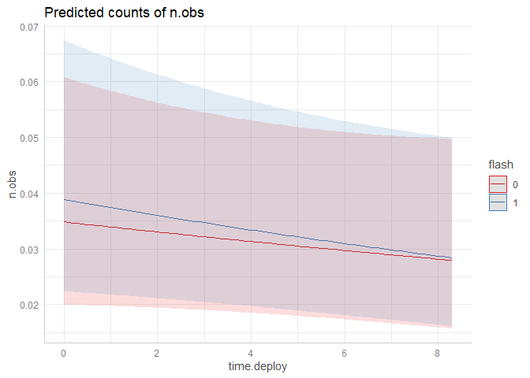<!-- -->

### Model interpretation

The intercept-value is considered significantly negative, which is to
say that there were a low chance of detecting any roe deer at an
IR-camera the same day I visited the camera.

> I saw a roe deer about to walk by a CT when I came to inspect it. The
> roe deer saw me and fled, right before it was detected by the camera.
> Chances are I’ve scared animals other times as well, but haven’t
> noticed it.

The effect of *Time since deployment* is non-significant, and
*β* = 0.008. That means there is no difference on the baseline detection
rate for an IR camera over time (after controlling for seasonal
changes).

For white LED flash *β* = 0.170, meaning that the intercept is slightly
higher than for IR, but the difference is non-significant (*p* = 0.18).
However, the detection rate is slightly decreasing the longer the white
LED stays, which differs from the IR, * but the effect is
non-significant* (*p* = 0.23).

#### Hypothesising

If there truly is an effect of the white LED for long periods on the
detection rate of roe deer, this effect could in turn account for the
different intercept values of IR and flash, as the IR periods often
start after a flash period.

Remembering my study design, 20 cameras start with white LED, 20 with
IR. *Intercept should be equal* (1st period). 2nd period; white LED
moved, new LED CTs (same intercept), new IR CTs (hypothetical lower
intercept due to flash effect). 3rd period; white LED moved, new LED CTs
(IR intercept), new IR CTs (hypothetical lower intercept). 4th period; -
- \|\| - - , new LED CTs (- - \| \| - - ), new IR CTs ( - - \| \| - - ).

Which sums up to 3 IR periods where detection rates could start lower
than that of white LED. And over time the lack of white LED flash in the
new IR sites would account for an *increase* in detection rates.

The effect would of course vary because some locations experienced
*gaps* due to full SD cards or empty batteries.
<!--_Maybe, after my thesis, I could try to pry out these differences-->

------------------------------------------------------------------------

#### Update!

After uptaded data from Neri; the effect of flash is now deemed
significant! Still the same pattern with higher intercept and a negative
slope along the time axis, which further supports my hypothesising
above. The interaction with time since deployment is, however, still
non-significant. *Now I want to look at a model including the
Control-group.*

``` r
# filter species
sp = "raadyr"
time_sp <- filter(time.dep4, species %in% sp) #.dep4 = trimmed data

# Model
m_raa  <- glmer(n.obs ~ time.deploy * flash + # fixed effects
              (1 | loc) + (1 | week), # random effects
            data   = time_sp,
            family = poisson) # poisson family of distributions
# --------------------------------------------------------------------
# ggpredict is similar to expand.grid
p_sp <- ggeffects::ggpredict(m_raa, terms = c("time.deploy", "flash"))
# Diagnostics
plot(p_sp, add.data = TRUE) + labs(subtitle  = "Raw data")
```

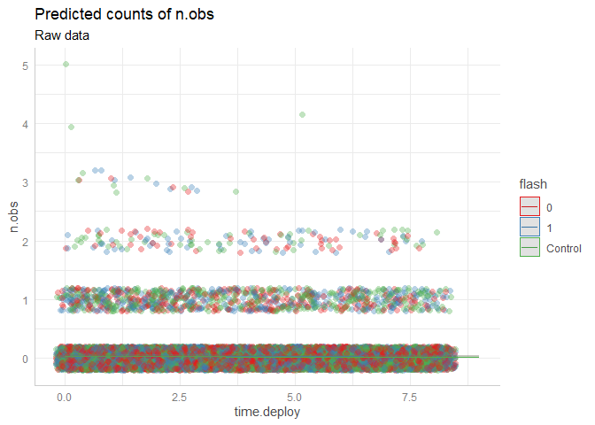<!-- -->

``` r
plot(p_sp, residuals = TRUE) + labs(subtitle  = "residuals")
```

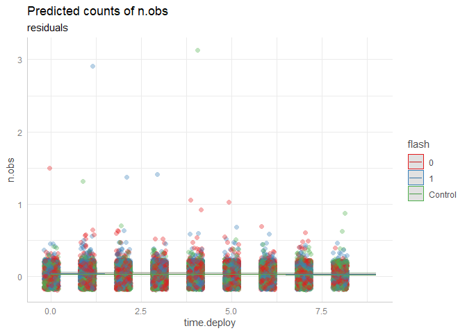<!-- -->

``` r
performance::check_model(m_raa) # check assumptions
```

    ## `geom_smooth()` using formula 'y ~ x'

    ## `stat_bin()` using `bins = 30`. Pick better value with `binwidth`.

    ## Warning: Removed 14916 rows containing missing values (geom_text_repel).

    ## `geom_smooth()` using formula 'y ~ x'

    ## `geom_smooth()` using formula 'y ~ x'

    ## Warning: ggrepel: 256 unlabeled data points (too many overlaps). Consider increasing max.overlaps

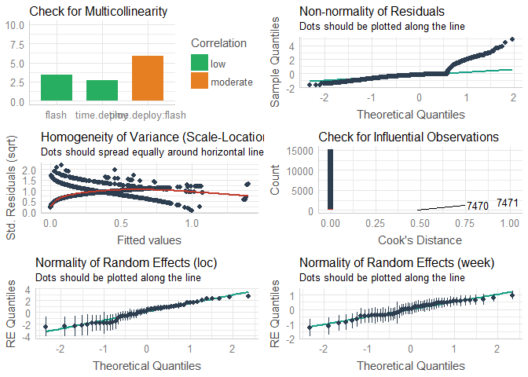<!-- -->

There are a couple of extreme counts in the Control-group, even after
having filtered away all observations with less than a 15 min interval
for each species (ie. setting 15 min margin as definition of an event).
These extreme counts are skewed to the left which probably will affect
the intercept of control quite a bit, but probably won’t deem the
intercept-value as significant (as these extreme values are outliers).

The homogeneity of variance is still off. It deems on me more and more
that this is due to these extreme count-values that is close to
time.deploy = 0. *Will it disappear if I divide by the standard
deviation?*

The multicollinearity is moderate for the interaction term of
time.deploy and flash when the control group is included. Still, the
change is small (in my layman eyes), with a increase in bar height from
\~ 4 to \~ 6.

``` r
# Summary, report, model
summary(m_raa)
```

    ## Generalized linear mixed model fit by maximum likelihood (Laplace Approximation) ['glmerMod']
    ##  Family: poisson  ( log )
    ## Formula: n.obs ~ time.deploy * flash + (1 | loc) + (1 | week)
    ##    Data: time_sp
    ## 
    ##      AIC      BIC   logLik deviance df.resid 
    ##   7749.6   7810.6  -3866.8   7733.6    15166 
    ## 
    ## Scaled residuals: 
    ##     Min      1Q  Median      3Q     Max 
    ## -1.1843 -0.2845 -0.1672 -0.0773 15.3935 
    ## 
    ## Random effects:
    ##  Groups Name        Variance Std.Dev.
    ##  loc    (Intercept) 2.5485   1.5964  
    ##  week   (Intercept) 0.3237   0.5689  
    ## Number of obs: 15174, groups:  loc, 54; week, 52
    ## 
    ## Fixed effects:
    ##                           Estimate Std. Error z value Pr(>|z|)    
    ## (Intercept)              -3.378885   0.303690 -11.126   <2e-16 ***
    ## time.deploy              -0.028470   0.023925  -1.190    0.234    
    ## flash1                    0.108747   0.126387   0.860    0.390    
    ## flashControl              0.002284   0.494570   0.005    0.996    
    ## time.deploy:flash1       -0.016694   0.029470  -0.566    0.571    
    ## time.deploy:flashControl -0.021027   0.030219  -0.696    0.487    
    ## ---
    ## Signif. codes:  0 '***' 0.001 '**' 0.01 '*' 0.05 '.' 0.1 ' ' 1
    ## 
    ## Correlation of Fixed Effects:
    ##             (Intr) tm.dpl flash1 flshCn tm.d:1
    ## time.deploy -0.284                            
    ## flash1      -0.227  0.579                     
    ## flashContrl -0.553  0.141  0.133              
    ## tm.dply:fl1  0.197 -0.698 -0.831 -0.110       
    ## tm.dply:flC  0.190 -0.667 -0.418 -0.220  0.502

``` r
# report::report(m_raa) # text-summary of my model, to include in a report
plot(p_sp)
```

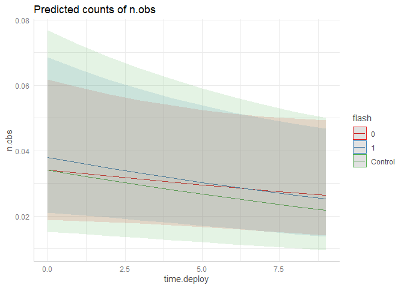<!-- -->

The control intercept is almost on top of the IR-intercept, but it has a
more negative trend than the IR-group. After I got updated data and
performed the event-filter, the slope of IR changed to a negative trend
over time, as well, “removing” any significance from the flash terms.
The important thing to note, then, is how small the p-values was, and
how easily they turned non-significant. Looking at the plot, the
confidence interval tells us all we need to know, as they almost
completely overlap. The groups are almost identical. The slope of the
control group is actually steeper than that of white LED (although only
minisculy). Further, the trend over time with the control-group
**should** be due to chance, *as time.deploy = 0 is seldom the actual
day I visited the cameras*. They were visited less often in general, and
the breaks leading to time.deploy = 0 are set manually by me, to make
period lengths that are similar to those of the IR and white LED group.

### Some parameter-plots from see and effectsize

The CI-plots of effectsize will be included in some form in my thesis.
For the equivalence-plot I’m not to sure if I’ll use it, but the
interpretation is neat with that method. From the bayesian statistics,
if a predictor is completely covered by the ROPE-area you can accept the
null hypothesis. This is not possible in a frequentist perspective (as
my models are), but one could claim *practical equivalence* if the
effect is non-significant AND completely inside the ROPE-interval.
Explanations from [Equivalence
vignette](https://easystats.github.io/parameters/reference/equivalence_test.lm.html):

> “classic” - The TOST rule (Lakens 2017) This rule follows the “TOST
> rule”, i.e. a two one-sided test procedure (Lakens 2017). Following
> this rule, practical equivalence of an effect (i.e. H0) is rejected,
> when the coefficient is statistically significant and the narrow
> confidence intervals (i.e. 1-2\*alpha) include or exceed the ROPE
> boundaries. Practical equivalence is assumed (i.e. H0 accepted) when
> the narrow confidence intervals are completely inside the ROPE, no
> matter if the effect is statistically significant or not. Else, the
> decision whether to accept or reject H0 is undecided. “cet” -
> Conditional Equivalence Testing (Campbell/Gustafson 2018) The
> Conditional Equivalence Testing as described by Campbell and Gustafson
> 2018. According to this rule, practical equivalence is rejected when
> the coefficient is statistically significant. When the effect is not
> significant and the narrow confidence intervals are completely inside
> the ROPE, we accept H0, else it is undecided

``` r
library(parameters)
library(effectsize)
library(see)
result <- model_parameters(m_raa, standardize = "refit")
plot(result, show_intercept = TRUE)
```

<!-- -->

``` r
plot(result, size_text = 3)
```

<!-- -->

``` r
# default rules, like in bayestestR::equivalence_test()
result <- equivalence_test(m_raa)
plot(result, size_text = 3)
```

<!-- -->

``` r
result
```

    ## # TOST-test for Practical Equivalence
    ## 
    ##   ROPE: [-0.10 0.10]
    ## 
    ##                      Parameter        H0 inside ROPE        90% CI
    ##                    (Intercept)  Rejected      0.00 % [-3.88 -2.88]
    ##                    time.deploy  Accepted    100.00 % [-0.07  0.01]
    ##                      flash [1] Undecided     47.90 % [-0.10  0.32]
    ##                flash [Control] Undecided     12.29 % [-0.81  0.82]
    ##        time.deploy * flash [1]  Accepted    100.00 % [-0.07  0.03]
    ##  time.deploy * flash [Control]  Accepted    100.00 % [-0.07  0.03]

``` r
result_sim <- simulate_parameters(m_raa)
plot(result_sim, stack = FALSE,
     normalize_height = TRUE)
```

    ## Warning in out$Effects[out$Parameter == i] <- params$Effects[params$Parameter == : number of items to replace is not a multiple of
    ## replacement length

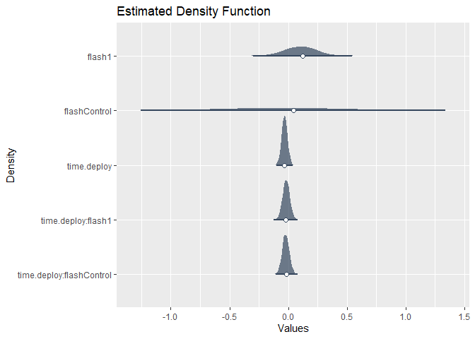<!-- -->

# Skrivestopp

## Red Fox

``` r
# filter species
sp = "rev"
time_sp <- filter(time.dep4, species %in% sp) #.dep4 = trimmed data
# Model
m_rev  <- glmer(n.obs ~ time.deploy * flash + # fixed effects
              (1 | loc) + (1 | week), # random effects
            data   = time_sp,
            family = poisson) # poisson family of distributions

# ggpredict is similar to expand.grid
p_sp <- ggeffects::ggpredict(m_rev, terms = c("time.deploy", "flash"))
# Diagnostics
plot(p_sp, add.data = TRUE) + labs(subtitle = "add.data = TRUE")
```

<!-- -->

``` r
plot(p_sp, residuals = TRUE) + labs(subtitle = "residuals")
```

<!-- -->

``` r
performance::check_model(m_rev) # check assumptions
```

    ## `geom_smooth()` using formula 'y ~ x'

    ## `stat_bin()` using `bins = 30`. Pick better value with `binwidth`.

    ## Warning: Removed 14978 rows containing missing values (geom_text_repel).

    ## `geom_smooth()` using formula 'y ~ x'

    ## `geom_smooth()` using formula 'y ~ x'

    ## Warning: ggrepel: 192 unlabeled data points (too many overlaps). Consider increasing max.overlaps

<!-- -->

### Interpret

``` r
# Summary, report, model
summary(m_rev)
```

    ## Generalized linear mixed model fit by maximum likelihood (Laplace Approximation) ['glmerMod']
    ##  Family: poisson  ( log )
    ## Formula: n.obs ~ time.deploy * flash + (1 | loc) + (1 | week)
    ##    Data: time_sp
    ## 
    ##      AIC      BIC   logLik deviance df.resid 
    ##   5635.1   5696.1  -2809.6   5619.1    15166 
    ## 
    ## Scaled residuals: 
    ##     Min      1Q  Median      3Q     Max 
    ## -0.6351 -0.2388 -0.1825 -0.1329 13.5052 
    ## 
    ## Random effects:
    ##  Groups Name        Variance Std.Dev.
    ##  loc    (Intercept) 0.70962  0.8424  
    ##  week   (Intercept) 0.06712  0.2591  
    ## Number of obs: 15174, groups:  loc, 54; week, 52
    ## 
    ## Fixed effects:
    ##                           Estimate Std. Error z value Pr(>|z|)    
    ## (Intercept)              -3.416837   0.196168 -17.418   <2e-16 ***
    ## time.deploy               0.001272   0.028683   0.044    0.965    
    ## flash1                    0.153262   0.165932   0.924    0.356    
    ## flashControl             -0.092784   0.308708  -0.301    0.764    
    ## time.deploy:flash1       -0.008945   0.037264  -0.240    0.810    
    ## time.deploy:flashControl  0.005019   0.039664   0.127    0.899    
    ## ---
    ## Signif. codes:  0 '***' 0.001 '**' 0.01 '*' 0.05 '.' 0.1 ' ' 1
    ## 
    ## Correlation of Fixed Effects:
    ##             (Intr) tm.dpl flash1 flshCn tm.d:1
    ## time.deploy -0.551                            
    ## flash1      -0.445  0.586                     
    ## flashContrl -0.594  0.324  0.277              
    ## tm.dply:fl1  0.383 -0.693 -0.848 -0.235       
    ## tm.dply:flC  0.378 -0.675 -0.411 -0.496  0.485

``` r
# report::report(m_rev) # text-summary of my model, to include in a report
plot(p_sp)
```

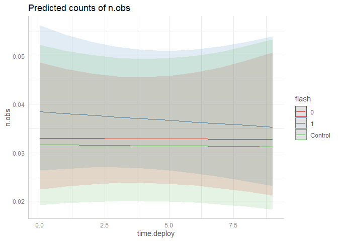<!-- -->

## Badger

``` r
# filter species
sp = "grevling"
time_sp <- filter(time.dep4, species %in% sp) #.dep4 = trimmed data
# Model
m_grvl  <- glmer(n.obs ~ time.deploy * flash + # fixed effects
              (1 | loc) + (1 | week), # random effects
            data   = time_sp,
            family = poisson) # poisson family of distributions

# ggpredict is similar to expand.grid
p_sp <- ggeffects::ggpredict(m_grvl, terms = c("time.deploy", "flash"))
# Diagnostics
plot(p_sp, add.data = TRUE) + labs(subtitle  = "add.data = TRUE")
```

<!-- -->

``` r
plot(p_sp, residuals = TRUE) + labs(subtitle  = "residuals")
```

<!-- -->

``` r
performance::check_model(m_grvl) # check assumptions
```

    ## `geom_smooth()` using formula 'y ~ x'

    ## `stat_bin()` using `bins = 30`. Pick better value with `binwidth`.

    ## Warning: Removed 14905 rows containing missing values (geom_text_repel).

    ## `geom_smooth()` using formula 'y ~ x'

    ## `geom_smooth()` using formula 'y ~ x'

    ## Warning: ggrepel: 268 unlabeled data points (too many overlaps). Consider increasing max.overlaps

<!-- -->

### Interpret

``` r
# Summary, report, model
summary(m_grvl)
```

    ## Generalized linear mixed model fit by maximum likelihood (Laplace Approximation) ['glmerMod']
    ##  Family: poisson  ( log )
    ## Formula: n.obs ~ time.deploy * flash + (1 | loc) + (1 | week)
    ##    Data: time_sp
    ## 
    ##      AIC      BIC   logLik deviance df.resid 
    ##   4697.0   4758.0  -2340.5   4681.0    15166 
    ## 
    ## Scaled residuals: 
    ##     Min      1Q  Median      3Q     Max 
    ## -1.1199 -0.1986 -0.1174 -0.0634 29.8996 
    ## 
    ## Random effects:
    ##  Groups Name        Variance Std.Dev.
    ##  loc    (Intercept) 1.389    1.178   
    ##  week   (Intercept) 1.611    1.269   
    ## Number of obs: 15174, groups:  loc, 54; week, 52
    ## 
    ## Fixed effects:
    ##                           Estimate Std. Error z value Pr(>|z|)    
    ## (Intercept)              -4.496225   0.315472 -14.252   <2e-16 ***
    ## time.deploy               0.064902   0.032160   2.018   0.0436 *  
    ## flash1                    0.059652   0.186498   0.320   0.7491    
    ## flashControl             -0.156004   0.413242  -0.378   0.7058    
    ## time.deploy:flash1       -0.001911   0.039527  -0.048   0.9614    
    ## time.deploy:flashControl -0.044088   0.044609  -0.988   0.3230    
    ## ---
    ## Signif. codes:  0 '***' 0.001 '**' 0.01 '*' 0.05 '.' 0.1 ' ' 1
    ## 
    ## Correlation of Fixed Effects:
    ##             (Intr) tm.dpl flash1 flshCn tm.d:1
    ## time.deploy -0.416                            
    ## flash1      -0.325  0.595                     
    ## flashContrl -0.480  0.294  0.236              
    ## tm.dply:fl1  0.296 -0.694 -0.872 -0.200       
    ## tm.dply:flC  0.291 -0.668 -0.402 -0.445  0.454

``` r
# report::report(m_grvl) # text-summary of my model, to include in a report
plot(p_sp)
```

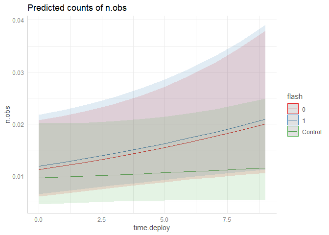<!-- -->

## Moose

``` r
# filter species
sp = "elg"
time_sp <- filter(time.dep4, species %in% sp) #.dep4 = trimmed data
# Model
m_elg  <- glmer(n.obs ~ time.deploy * flash + # fixed effects
              (1 | loc) + (1 | week), # random effects
            data   = time_sp,
            family = poisson) # poisson family of distributions
```

    ## Warning in checkConv(attr(opt, "derivs"), opt$par, ctrl = control$checkConv, : Model failed to converge with max|grad| = 0.102875 (tol =
    ## 0.002, component 1)

    ## Warning in checkConv(attr(opt, "derivs"), opt$par, ctrl = control$checkConv, : Model is nearly unidentifiable: very large eigenvalue
    ##  - Rescale variables?

``` r
# ggpredict is similar to expand.grid
p_sp <- ggeffects::ggpredict(m_elg, terms = c("time.deploy", "flash"))
# Diagnostics
plot(p_sp, add.data = TRUE) + labs(subtitle  = "add.data = TRUE")
```

<!-- -->

``` r
plot(p_sp, residuals = TRUE) + labs(subtitle  = "residuals")
```

<!-- -->

``` r
performance::check_model(m_elg) # check assumptions
```

    ## `geom_smooth()` using formula 'y ~ x'

    ## `stat_bin()` using `bins = 30`. Pick better value with `binwidth`.

    ## Warning: Removed 14786 rows containing missing values (geom_text_repel).

    ## `geom_smooth()` using formula 'y ~ x'

    ## `geom_smooth()` using formula 'y ~ x'

    ## Warning: ggrepel: 387 unlabeled data points (too many overlaps). Consider increasing max.overlaps

<!-- -->

### Interpret

``` r
# Summary, report, model
summary(m_elg)
```

    ## Generalized linear mixed model fit by maximum likelihood (Laplace Approximation) ['glmerMod']
    ##  Family: poisson  ( log )
    ## Formula: n.obs ~ time.deploy * flash + (1 | loc) + (1 | week)
    ##    Data: time_sp
    ## 
    ##      AIC      BIC   logLik deviance df.resid 
    ##   3000.5   3061.5  -1492.3   2984.5    15166 
    ## 
    ## Scaled residuals: 
    ##     Min      1Q  Median      3Q     Max 
    ## -0.4530 -0.1637 -0.1043 -0.0649 21.4688 
    ## 
    ## Random effects:
    ##  Groups Name        Variance Std.Dev.
    ##  loc    (Intercept) 1.5407   1.2412  
    ##  week   (Intercept) 0.5748   0.7582  
    ## Number of obs: 15174, groups:  loc, 54; week, 52
    ## 
    ## Fixed effects:
    ##                            Estimate Std. Error  z value Pr(>|z|)    
    ## (Intercept)              -4.8406269  0.0006874 -7041.59   <2e-16 ***
    ## time.deploy               0.0540166  0.0006879    78.52   <2e-16 ***
    ## flash1                    0.3904263  0.0006872   568.11   <2e-16 ***
    ## flashControl              0.0271764  0.0006873    39.54   <2e-16 ***
    ## time.deploy:flash1       -0.0630713  0.0006872   -91.78   <2e-16 ***
    ## time.deploy:flashControl -0.0852395  0.0006875  -123.99   <2e-16 ***
    ## ---
    ## Signif. codes:  0 '***' 0.001 '**' 0.01 '*' 0.05 '.' 0.1 ' ' 1
    ## 
    ## Correlation of Fixed Effects:
    ##             (Intr) tm.dpl flash1 flshCn tm.d:1
    ## time.deploy 0.000                             
    ## flash1      0.000  0.000                      
    ## flashContrl 0.000  0.000  0.000               
    ## tm.dply:fl1 0.000  0.000  0.000  0.000        
    ## tm.dply:flC 0.000  0.000  0.000  0.000  0.000 
    ## optimizer (Nelder_Mead) convergence code: 0 (OK)
    ## Model failed to converge with max|grad| = 0.102875 (tol = 0.002, component 1)
    ## Model is nearly unidentifiable: very large eigenvalue
    ##  - Rescale variables?

``` r
# report::report(m_elg) # text-summary of my model, to include in a report
plot(p_sp)
```

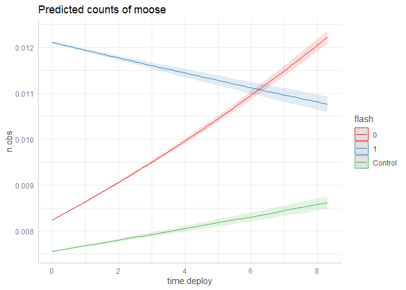<!-- -->

## Red deer

``` r
# filter species
sp = "hjort"
time_sp <- filter(time.dep4, species %in% sp) #.dep4 = trimmed data
# Model
m_hjort  <- glmer(n.obs ~ time.deploy * flash + # fixed effects
              (1 | loc) + (1 | week), # random effects
            data   = time_sp,
            family = poisson) # poisson family of distributions

# ggpredict is similar to expand.grid
p_sp <- ggeffects::ggpredict(m_hjort, terms = c("time.deploy", "flash"))
# Diagnostics
plot(p_sp, add.data = TRUE) + labs(subtitle  = "add.data = TRUE")
```

<!-- -->

``` r
plot(p_sp, residuals = TRUE) + labs(subtitle  = "residuals")
```

<!-- -->

``` r
performance::check_model(m_hjort) # check assumptions
```

    ## `geom_smooth()` using formula 'y ~ x'

    ## `stat_bin()` using `bins = 30`. Pick better value with `binwidth`.

    ## Warning: Removed 14808 rows containing missing values (geom_text_repel).

    ## `geom_smooth()` using formula 'y ~ x'

    ## `geom_smooth()` using formula 'y ~ x'

    ## Warning: ggrepel: 362 unlabeled data points (too many overlaps). Consider increasing max.overlaps

<!-- -->

### Interpret

``` r
# Summary, report, model
summary(m_hjort)
```

    ## Generalized linear mixed model fit by maximum likelihood (Laplace Approximation) ['glmerMod']
    ##  Family: poisson  ( log )
    ## Formula: n.obs ~ time.deploy * flash + (1 | loc) + (1 | week)
    ##    Data: time_sp
    ## 
    ##      AIC      BIC   logLik deviance df.resid 
    ##   1786.6   1847.6   -885.3   1770.6    15166 
    ## 
    ## Scaled residuals: 
    ##     Min      1Q  Median      3Q     Max 
    ## -0.5111 -0.1066 -0.0389 -0.0255 24.8921 
    ## 
    ## Random effects:
    ##  Groups Name        Variance Std.Dev.
    ##  loc    (Intercept) 4.6003   2.1448  
    ##  week   (Intercept) 0.2946   0.5428  
    ## Number of obs: 15174, groups:  loc, 54; week, 52
    ## 
    ## Fixed effects:
    ##                          Estimate Std. Error z value Pr(>|z|)    
    ## (Intercept)              -5.97483    0.55214 -10.821   <2e-16 ***
    ## time.deploy              -0.02588    0.05938  -0.436   0.6630    
    ## flash1                   -0.65646    0.36876  -1.780   0.0750 .  
    ## flashControl             -0.12771    0.81072  -0.158   0.8748    
    ## time.deploy:flash1        0.16443    0.07906   2.080   0.0375 *  
    ## time.deploy:flashControl -0.09726    0.08446  -1.151   0.2495    
    ## ---
    ## Signif. codes:  0 '***' 0.001 '**' 0.01 '*' 0.05 '.' 0.1 ' ' 1
    ## 
    ## Correlation of Fixed Effects:
    ##             (Intr) tm.dpl flash1 flshCn tm.d:1
    ## time.deploy -0.396                            
    ## flash1      -0.288  0.523                     
    ## flashContrl -0.493  0.245  0.177              
    ## tm.dply:fl1  0.282 -0.692 -0.869 -0.165       
    ## tm.dply:flC  0.272 -0.661 -0.350 -0.370  0.456

``` r
# report::report(m_hjort) # text-summary of my model, to include in a report
plot(p_sp)
```

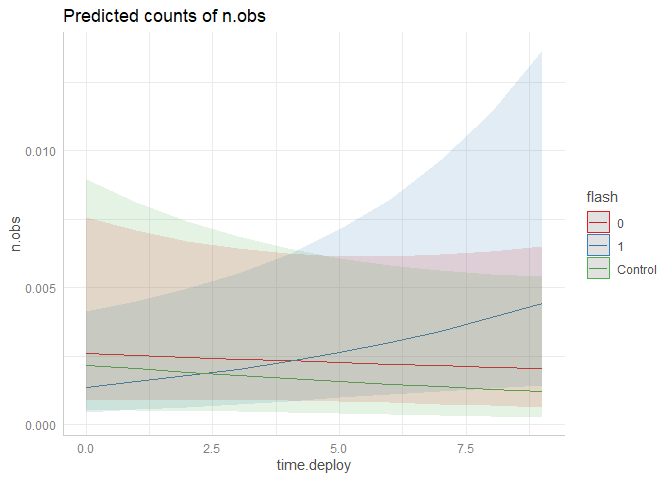<!-- -->

## Lynx

``` r
# filter species
sp = "gaupe"
time_sp <- filter(time.dep4, species %in% sp) #.dep4 = trimmed data
# Model
m_gaup  <- glmer(n.obs ~ time.deploy * flash + # fixed effects
              (1 | loc) + (1 | week), # random effects
            data   = time_sp,
            family = poisson) # poisson family of distributions

# ggpredict is similar to expand.grid
p_sp <- ggeffects::ggpredict(m_gaup, terms = c("time.deploy", "flash"))
# Diagnostics
plot(p_sp, add.data = TRUE) + labs(subtitle  = "add.data = TRUE")
```

<!-- -->

``` r
plot(p_sp, residuals = TRUE) + labs(subtitle  = "residuals")
```

<!-- -->

``` r
performance::check_model(m_gaup) # check assumptions
```

    ## `geom_smooth()` using formula 'y ~ x'

    ## `stat_bin()` using `bins = 30`. Pick better value with `binwidth`.

    ## Warning: Removed 14882 rows containing missing values (geom_text_repel).

    ## `geom_smooth()` using formula 'y ~ x'

    ## `geom_smooth()` using formula 'y ~ x'

    ## Warning: ggrepel: 291 unlabeled data points (too many overlaps). Consider increasing max.overlaps

<!-- -->

### Interpret

``` r
# Summary, report, model
summary(m_gaup)
```

    ## Generalized linear mixed model fit by maximum likelihood (Laplace Approximation) ['glmerMod']
    ##  Family: poisson  ( log )
    ## Formula: n.obs ~ time.deploy * flash + (1 | loc) + (1 | week)
    ##    Data: time_sp
    ## 
    ##      AIC      BIC   logLik deviance df.resid 
    ##    747.8    808.8   -365.9    731.8    15166 
    ## 
    ## Scaled residuals: 
    ##     Min      1Q  Median      3Q     Max 
    ## -0.3290 -0.0547 -0.0317 -0.0252 22.6375 
    ## 
    ## Random effects:
    ##  Groups Name        Variance Std.Dev.
    ##  loc    (Intercept) 2.2890   1.5129  
    ##  week   (Intercept) 0.3056   0.5528  
    ## Number of obs: 15174, groups:  loc, 54; week, 52
    ## 
    ## Fixed effects:
    ##                           Estimate Std. Error z value Pr(>|z|)    
    ## (Intercept)              -6.878880   0.597482 -11.513   <2e-16 ***
    ## time.deploy               0.032035   0.089933   0.356    0.722    
    ## flash1                    0.354846   0.559780   0.634    0.526    
    ## flashControl              0.113508   0.856945   0.132    0.895    
    ## time.deploy:flash1        0.008386   0.120814   0.069    0.945    
    ## time.deploy:flashControl -0.129462   0.159468  -0.812    0.417    
    ## ---
    ## Signif. codes:  0 '***' 0.001 '**' 0.01 '*' 0.05 '.' 0.1 ' ' 1
    ## 
    ## Correlation of Fixed Effects:
    ##             (Intr) tm.dpl flash1 flshCn tm.d:1
    ## time.deploy -0.601                            
    ## flash1      -0.523  0.610                     
    ## flashContrl -0.535  0.393  0.335              
    ## tm.dply:fl1  0.421 -0.714 -0.852 -0.275       
    ## tm.dply:flC  0.328 -0.535 -0.324 -0.662  0.380

``` r
# report::report(m_gaup) # text-summary of my model, to include in a report
plot(p_sp)
```

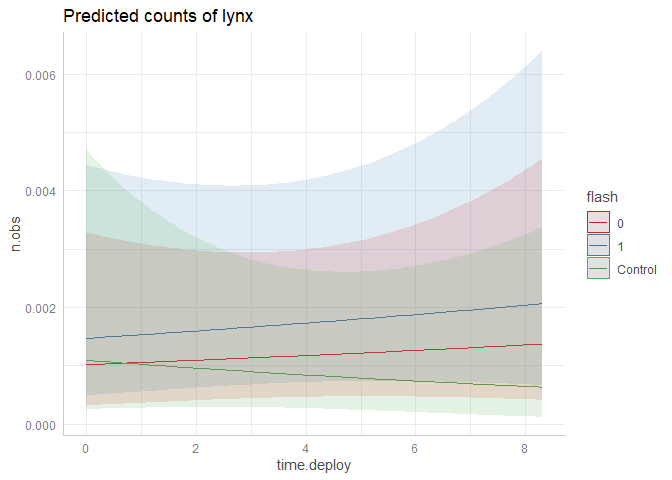<!-- -->

------------------------------------------------------------------------

``` r
# library(rstanarm)
# #result <- #compare_parameters(m_raa, m_rev, m_grvl, m_elg, m_hjort, m_gaup) #can't find function :-/
# plot(result)
# 
# rmarkdown::render("glmm_sp.Rmd", output_format = "github_document")
```

# Hare, deer and squirrelywhere (and pine marten)

Blueprint for other species in chunk below:

### Diagnostics

``` r
# filter species
sp = "xx"
time_sp <- filter(time.dep4, species %in% sp) #.dep4 = trimmed data
# Model
m_sp  <- glmer(n.obs ~ time.deploy * flash + # fixed effects
              (1 | loc) + (1 | week), # random effects
            data   = time_sp,
            family = poisson) # poisson family of distributions

# ggpredict is similar to expand.grid
p_sp <- ggeffects::ggpredict(m_sp, terms = c("time.deploy", "flash"))
# Diagnostics
plot(p_sp, add.data = TRUE) + labs(subtitle  = "add.data = TRUE")
plot(p_sp, residuals = TRUE) + labs(subtitle  = "residuals")
performance::check_model(m_sp) # check assumptions
```

### Interpret

``` r
# Summary, report, model
summary(m_sp)
report::report(m_sp) # text-summary of my model, to include in a report
plot(p_sp)
```
