```r
library(tidyverse)
```

```
## -- Attaching packages --------------------------------------- tidyverse 1.3.0 --
```

```
## v ggplot2 3.3.3     v purrr   0.3.4
## v tibble  3.1.0     v dplyr   1.0.5
## v tidyr   1.1.3     v stringr 1.4.0
## v readr   1.4.0     v forcats 0.5.1
```

```
## -- Conflicts ------------------------------------------ tidyverse_conflicts() --
## x dplyr::filter() masks stats::filter()
## x dplyr::lag()    masks stats::lag()
```

```r
library(lme4)
```

```
## Loading required package: Matrix
```

```
## 
## Attaching package: 'Matrix'
```

```
## The following objects are masked from 'package:tidyr':
## 
##     expand, pack, unpack
```

```r
library(cowplot)
library(performance) # diagnostic-plots to check assumptions
library(report)      # Result-summaries in text-format
```

```
## report is in alpha - help us improve by reporting bugs on github.com/easystats/report/issues
```

```r
library(ggeffects)   # Estimated Marginal Means and Marginal Effects from Regression Models
```

```
## 
## Attaching package: 'ggeffects'
```

```
## The following object is masked from 'package:cowplot':
## 
##     get_title
```

```r
                          # more at: https://strengejacke.github.io/ggeffects/
library(parameters)  # extract model-parameters etc. from (most) models
library(sjPlot)      # parameters + sjPlot probably does a similar and better job than ggeffects
```

```
## Install package "strengejacke" from GitHub (`devtools::install_github("strengejacke/strengejacke")`) to load all sj-packages at once!
```

```
## 
## Attaching package: 'sjPlot'
```

```
## The following objects are masked from 'package:cowplot':
## 
##     plot_grid, save_plot
```

```r
library(see)         # plot-related package from the easystats-verse

# Data drom Data_exploration2_nesting.R
time.dep <- readRDS("timedep.rds")

ctrl <- c("Control_1", "Control_2", "Control_3","Control_4")
obs      <- readRDS("Observations_prepared1.rds") %>% 
  mutate(flash = ifelse(period %in% ctrl, "Control",flash))
obs <- obs %>% 
  mutate(species = validated_species,
         Hour = as.numeric(format(obs$datetime, "%H")), # for density-plots
         flash = factor(obs$flash, labels = c("IR", "wLED","Control"))) # --||--
# Set global plot theme
theme_set(ggpubr::theme_classic2())
```

```
## Registered S3 methods overwritten by 'car':
##   method                          from
##   influence.merMod                lme4
##   cooks.distance.influence.merMod lme4
##   dfbeta.influence.merMod         lme4
##   dfbetas.influence.merMod        lme4
```

## Purpose

Modelling detection rates of the nine most common wild animals in my dataset, producing the plots I am going to use in my thesis

# About the model

### Why GLMM?

Response from a [stackexchange question](https://stats.stackexchange.com/questions/226946/r-lmer-vs-glmer)
about the differences of `lmer` and `glmer`-functions:

>lmer is used to fit linear mixed-effect models, so it assumes that the residual error has a Gaussian distribution. If your dependent variable A is a binary outcome (e.g. a yes/no response), then the error distribution is binomial and not Gaussian. In this case you have to use glmer, which allow to fit a generalized linear mixed-effects model: these models include a link function that allows to predict response variables with non-Gaussian distributions. One example of link function that could work in your case is the logistic function, which takes an input with any value from negative to positive infinity and return an output that always takes values between zero and one, which is interpretable as the probability of the binary outcome (e.g. the probability of the subject responding 'yes').


### Formula
The model formula I will use is $n \sim \ time.deploy\ * flash $ for each species, and my $\alpha = 0.05$.


```r
sp <- c("raadyr", "rev", "grevling", "hare", "ekorn", "elg", "hjort", "maar", "gaupe")
time.dep2 <- time.dep %>% 
  rename(species = validated_species) %>%  #shortening name
#  filter(species %in% sp) %>% #filtering out species
  # including Control as part of the flash-column, since it differs from flash=0
  mutate(flash = factor(
        ifelse(period %in% ctrl, "Control", flash)),
        week = lubridate::isoweek(date),
        period = factor(period))
time.dep2 <- time.dep2 %>% 
   mutate(flash = fct_relevel(flash, "Control","0","1")) # relevel to make Control the model intercept
levels(time.dep2$flash) <- c("Control", "IR", "wLED")
levels(time.dep2$period) <- c("IR_1", "IR_2", "wLED_1", "wLED_2", "Control_1", "Control_2", "Control_3", "Control_4")
```


```r
# stations <- readRDS("stations.rds") %>% mutate(loc = as.factor(loc))
# time.dep2 <- time.dep2 %>% left_join(stations) 
# # IR-periods in group C are identical to Control-groups
# time.dep2$flash[time.dep2$period == "IR_1" & time.dep2$abc == "C"] <- "Control"
```


Not all periods have identical length. Hence, I need to set a maximum length for my period durations. As proposed by my supervisor Neri Thorsen, I will calculate the median for the different types of periods, and use the smallest median to shorten all periods overextending that value.


```r
# find median period length
time.period <- time.dep2 %>% group_by(loc, period, flash) %>% 
  summarise(period_length = max(time.deploy))

# checking shortest periods
time.period %>% arrange(period_length) # 1 period (wLED) is 0 days
```

```
## # A tibble: 211 x 4
## # Groups:   loc, period [211]
##    loc   period    flash   period_length
##    <fct> <fct>     <fct>           <dbl>
##  1 829   wLED_1    wLED              0  
##  2 925   wLED_1    wLED              0.8
##  3 850   wLED_2    wLED              0.9
##  4 664   Control_2 Control           1.1
##  5 829   IR_2      IR                1.2
##  6 855   Control_3 Control           1.8
##  7 840   IR_1      IR                2.6
##  8 953   wLED_2    wLED              2.6
##  9 258   Control_1 Control           2.7
## 10 942   IR_1      IR                2.7
## # ... with 201 more rows
```

```r
# then merge lengths and filter out period of 0 days
time.dep3 <- time.dep2 %>% left_join(time.period) %>% 
  filter(period_length > 0)

# find median length 
time.period %>% filter(flash == "wLED") %>%  
  summary() # median period length 85 days, mean: 84
```

```
##       loc           period       flash    period_length   
##  15     : 2   wLED_1   :37   Control: 0   Min.   : 0.000  
##  127    : 2   wLED_2   :32   IR     : 0   1st Qu.: 6.500  
##  193    : 2   IR_1     : 0   wLED   :69   Median : 8.450  
##  231    : 2   IR_2     : 0                Mean   : 8.285  
##  257    : 2   Control_1: 0                3rd Qu.:11.000  
##  455    : 2   Control_2: 0                Max.   :13.200  
##  (Other):57   (Other)  : 0                NA's   :1
```

```r
time.period %>% filter(flash == "IR") %>%  
  summary() # median period length 84 days, mean: 89
```

```
##       loc           period       flash    period_length   
##  15     : 2   IR_1     :35   Control: 0   Min.   : 1.200  
##  127    : 2   IR_2     :35   IR     :70   1st Qu.: 6.600  
##  193    : 2   wLED_1   : 0   wLED   : 0   Median : 8.400  
##  231    : 2   wLED_2   : 0                Mean   : 9.423  
##  257    : 2   Control_1: 0                3rd Qu.:12.500  
##  455    : 2   Control_2: 0                Max.   :19.600  
##  (Other):58   (Other)  : 0                NA's   :1
```

```r
time.period %>% filter(flash == "Control") %>%  
  summary() # median period length 89 days, mean: 93
```

```
##       loc           period       flash    period_length   
##  258    : 4   Control_4:19   Control:72   Min.   : 1.100  
##  494    : 4   Control_1:18   IR     : 0   1st Qu.: 8.200  
##  535    : 4   Control_3:18   wLED   : 0   Median : 8.900  
##  638    : 4   Control_2:17                Mean   : 8.819  
##  662    : 4   IR_1     : 0                3rd Qu.:10.300  
##  664    : 4   IR_2     : 0                Max.   :12.800  
##  (Other):48   (Other)  : 0                NA's   :4
```

```r
# extract lengths of each unique period
h <- time.dep3 %>% group_by(loc, period, period_length, flash)%>% nest() %>% 
  select(!data) 
#extracting median and multiplying by 10, to use in the correctly scaled plot
hh <-       h$period_length[h$flash == "wLED"]      %>%  median()       #  white LED
hh <- c(hh, h$period_length[h$flash == "IR" ]      %>%  median())      # +  IR
hh <- c(hh, h$period_length[h$flash == "Control" ] %>%  median()) * 10 # +  Control
# smallest median 
h <- min(hh)
h # 84 shortest median (IR)
```

```
## [1] 84
```


The IR median is 84 days, white LED is 84,5 and control is 89. 84 is trimming value.


```r
# plot periods with median as intercept
p_td <- time.dep3 %>% filter(!period %in% ctrl) %>% #removing ctrl-periods
  ggplot(aes(loc, 10*time.deploy, colour = period, ))  +
  geom_line(aes(linetype = flash),position = position_dodge(width = 1), lineend = "square") +
  coord_flip() + 
  labs(title = "Period lengths per camera",
       x = "Location", y = "Time since deployment",
       caption = "Vertical lines reprecent median period lengths for IR and white LED.\n Data superceding that were trimmed away for the GLMM-modelling.") 
  #ggpubr::theme_classic2() #+ theme(legend.position = "right") find way to set legend inside
p_td + geom_hline(aes(yintercept = h), linetype = "dashed",  alpha =.5) +
  geom_hline(aes(yintercept = max(hh)), linetype = "dashed",  alpha =.5) +
  #annotate(geom = "text",x=4, y=h+8.6, label = "- median", size = 3, alpha =.7) +
  scale_y_continuous(breaks = sort(c(0, 50, h, 100, 150))) +
  scale_color_brewer(palette = "Spectral")
# failed attempts that could inspire a better plot later
# p_td + geom_hline(aes(yintercept = h))+ # using median days as intercept 
#        scale_y_continuous(breaks = sort(c(ggplot_build(p_td)$layout$panel_ranges[[1]]$y.major_source, h)))
# geom_text(aes(25, h, label = "median", vjust = -1), nudge_y = 10, show.legend = F)
```


```r
# remake plot with Control-group data, faceted
p_td2 <- time.dep3 %>% 
  ggplot(aes(loc, 10*time.deploy, col = period))  +
  geom_line(aes(linetype = period),
    position = position_dodge(width = 1), lineend = "square") +
  coord_flip() +  
  geom_hline(aes(yintercept = h), linetype = "dashed",  alpha =.5) +
  scale_y_continuous(breaks = sort(c(0, 50, h, 100, 150, 200))) +
  facet_grid(rows = "flash", scales = "free_y") +
  labs(#title = "Period lengths per camera",
       x = "Location", y = "Days since deployment") # 
  

p_td2 + #ggpubr::theme_classic2() +
  theme(legend.position = "none", axis.text.y = element_blank(), axis.ticks.y = element_blank()) +
        scale_linetype_manual(values = rep(c("solid","solid"), 4) ) + #option to change to solid,dashed
        scale_color_manual(values = c(rep(c("#74add1","#4575b4"), each = 2), # trt-colr
                                      rep(c("#fdae61","#f46d43"),each = 2) ) )  #ctrl-colr
```

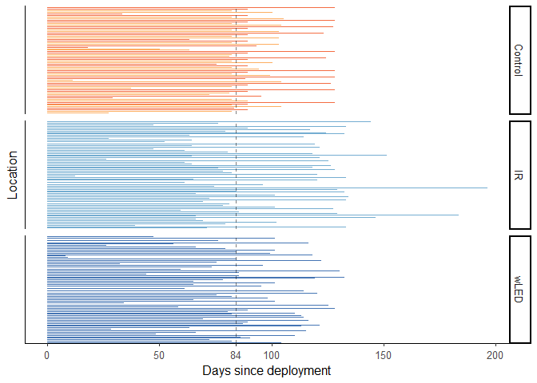<!-- -->

```r
  #labs(caption = "Vertical line represents the median IR period length. \n Data superceding that were trimmed away for the GLMM")
```


_Lastly, performing the filter:_

```r
# filtering out periods longer than (shortest) median length.
time.dep4 <- time.dep3 %>% filter(time.deploy < h/10) # h is normal scale, must be rescaled by /10
# time.dep5 <- time.dep4 %>% mutate(time.deploy = time.deploy / .7) # scaled by 1 weeks (84=12*7(1w))

time.dep4$loc %>% unique() %>% is.na() %>% any() # no NAs in loc
```

```
## [1] FALSE
```

```r
summary(time.dep4) #            
```

```
##       loc              date              species              flash       
##  494    : 10050   Min.   :2019-01-15   Length:457470      Control:157770  
##  818    : 10050   1st Qu.:2019-04-25   Class :character   IR     :153360  
##  830    : 10050   Median :2019-07-29   Mode  :character   wLED   :146340  
##  861    : 10050   Mean   :2019-07-22                                      
##  863    : 10050   3rd Qu.:2019-10-14                                      
##  864    : 10050   Max.   :2020-02-26                                      
##  (Other):397170                                                           
##        period       time.deploy        n.obs              month       
##  IR_2     :80160   Min.   :0.000   Min.   : 0.00000   08     : 45780  
##  wLED_1   :77040   1st Qu.:1.800   1st Qu.: 0.00000   09     : 44460  
##  IR_1     :73200   Median :3.800   Median : 0.00000   06     : 43440  
##  wLED_2   :69300   Mean   :3.881   Mean   : 0.03715   03     : 42780  
##  Control_4:40500   3rd Qu.:5.900   3rd Qu.: 0.00000   07     : 41850  
##  Control_3:39270   Max.   :8.300   Max.   :25.00000   10     : 41460  
##  (Other)  :78000                                      (Other):197700  
##       week       period_length   
##  Min.   : 1.00   Min.   : 0.800  
##  1st Qu.:14.00   1st Qu.: 7.900  
##  Median :29.00   Median : 8.900  
##  Mean   :27.89   Mean   : 9.463  
##  3rd Qu.:40.00   3rd Qu.:11.800  
##  Max.   :52.00   Max.   :19.600  
## 
```

# Counts of species


```r
sp_focus <- c("raadyr", "rev", "grevling", "hare", "ekorn", "elg", "hjort", "maar", "gaupe")
sp_eng <- c("Roe deer", "Red fox", "Badger", "Hare", "Red squirrel", "Moose", "Red deer", "Pine marten","Lynx")
sp_eng <- sp_eng[9:1] # reverse order
sp_count <- time.dep4 %>% group_by(species, flash) %>% filter(n.obs > 0, species %in% sp_focus) %>% 
  summarise(count = sum(n.obs))
```

```
## `summarise()` has grouped output by 'species'. You can override using the `.groups` argument.
```

```r
p_count <- ggplot(sp_count, aes(reorder(species, count, FUN = mean),count)) +
  labs(x= "Species", y = "Events") +
  # scale_y_continuous(breaks = sp_count$count) + guides(x = guide_axis(n.dodge = 2))
  scale_y_continuous(n.breaks = 10) + scale_x_discrete(labels = sp_eng) +
  geom_col(aes(fill=flash), colour = "black") +
  scale_fill_bluebrown(reverse=T) +
  theme(axis.title.x = element_blank(),legend.position = "none",
        legend.title = element_blank()) 

 p_count + coord_flip() +
   theme(legend.box.background = element_rect(),axis.title.y = element_blank(),
                legend.position = c(.8, .3),legend.justification = c("left", "top"))
```

<!-- -->

```r
# data without flash-grouping
sp_count_trim <- time.dep4 %>% group_by(species) %>% filter(n.obs > 0, species %in% sp_focus) %>% 
  summarise(count = sum(n.obs))
sp_count_full <- time.dep3 %>% group_by(species) %>% filter(n.obs > 0, species %in% sp_focus) %>% 
  summarise(count = sum(n.obs))
# plot full and trimmed on top of each other
ggplot(sp_count_full, aes(reorder(species, count, FUN = mean),count)) +
  labs(x= "Species", y = "Events") +
  scale_y_continuous(n.breaks = 10) + 
  geom_col() +
  geom_col(data=sp_count_trim, fill="blue") +
  geom_label(aes(x=species,y=count,label = count))
```

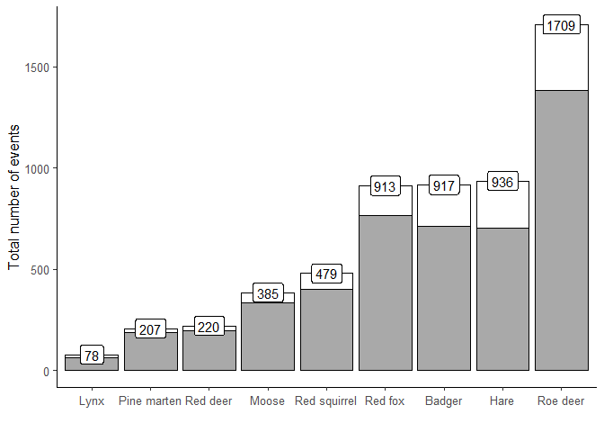<!-- -->


```r
active_trimmed <- time.dep4 %>% group_by(loc, period, period_length, flash) %>% 
  summarise(days_trim = max(time.deploy))
```

```
## `summarise()` has grouped output by 'loc', 'period', 'period_length'. You can override using the `.groups` argument.
```

```r
# by flash
active_f <- active_trimmed %>% group_by(flash) %>% 
  summarise(Trimmed = sum(days_trim * 10), # rescaling to true n days
            Full = sum(period_length * 10) ) %>% # for both variables
  reshape2::melt(measure=c("Full","Trimmed"), id="flash") #melt both into one variable
# plot
ggplot(active_f,aes(flash,value,fill=variable)) +
  geom_col(position = "dodge") +
  scale_fill_bluebrown() + labs(x= "Period group", y= "Number of active camera trapping days",
                                caption = "Total number of active camera trapping days per period group in blue,\n and active camera days included in the GLMM after trimming the periods.") +
   geom_label(aes(label=value),nudge_x = rep(c(-.23,.23),each=3), show.legend = F ) +
  theme(legend.position = "bottom", legend.title = element_blank(),
        axis.title.x = element_blank())
```

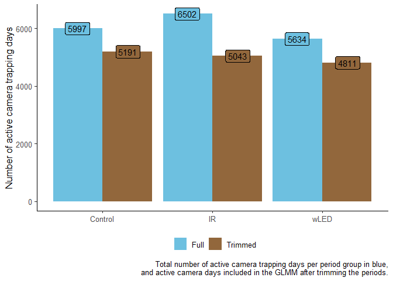<!-- -->

```r
# by period
active_p <- active_trimmed %>% group_by(period, flash) %>% 
  summarise(Trimmed = sum(days_trim * 10), # rescaling to true n days
            Full = sum(period_length * 10) ) %>% # for both variables
  reshape2::melt(measure=c("Full","Trimmed"), id=c("period","flash")) #melt both into one variable
```

```
## `summarise()` has grouped output by 'period'. You can override using the `.groups` argument.
```

```r
ggplot(active_p,aes(period,value,fill=variable)) +
  geom_col(position = "dodge") +
  scale_fill_bluebrown() + labs(x= "Period group", y= "Number of active camera trapping days") +
  facet_wrap(~flash, scales = "free_x") +
  guides(x = guide_axis(check.overlap = T)) +
  theme(legend.position = "bottom", legend.title = element_blank(),
        axis.title.x = element_blank())
```

<!-- -->

```r
# periods stacked on flash + faceted
p_days <- active_p %>% mutate(period = fct_rev(period)) %>% 
ggplot(aes(flash,value,fill=flash,col=period)) +
  geom_col() +
  scale_fill_bluebrown(reverse = T) + #flash fill colours
  scale_color_grey(start = 0, end = 0) + #black surrounding colour
  labs(x= "Period group", y= "Active camera trapping days") +
  geom_text(aes(label = period), position = position_stack(vjust = 0.5)) + # ,show.legend = F) +
  facet_wrap(~variable) +
  theme(legend.position = "none", axis.title.x = element_blank())
p_days
```

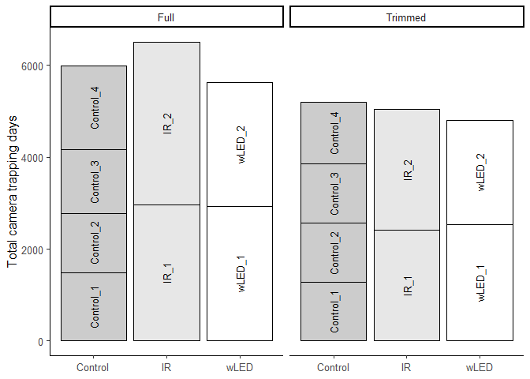<!-- -->

```r
 active_p %>% mutate(period = fct_rev(period)) %>% 
ggplot(aes(flash,value,fill=flash,col=period)) +
  geom_col(aes(group=variable),position = "dodge") +
  scale_fill_bluebrown(reverse = T) + #flash fill colours
  scale_color_grey(start = 0, end = 0) + #black surrounding colour
  labs(x= "Period group", y= "Active camera trapping days") +
  geom_text(aes(label = period), position = position_stack(vjust = 0.5)) + # ,show.legend = F) +
  theme(legend.position = "none", axis.title.x = element_blank())
```

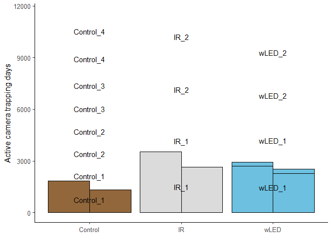<!-- -->


```r
plot_grid(p_count + scale_y_continuous(breaks = c(100,300,500,700,900,1100,1300),
                                       sec.axis = dup_axis(name = element_blank())) ,
          p_days + scale_y_continuous(#n.breaks = 7,
                                       sec.axis = dup_axis(name = element_blank()) ),
          nrow = 2,
          rel_heights = c(2,3))
```


# Modelling

The following code chunks are written in a modular fashion, so that everything will be done identically for each species. Any changes made will affect all species.


```r
# sp ="raadyr"  #(shortcut for when editing)
# n locations that detected the species
n_loc <- time.dep4$loc[time.dep4$n.obs > 0 & time.dep4$species %in% sp] %>% unique()
# subsetting data for species, and the locations where it was detected
time_sp <- filter(time.dep4,       #.dep4 = trimmed data
                  species %in% sp, # filtering species
                  loc %in% n_loc)  # filtering locations
# Model
m_sp  <- lme4::glmer(n.obs ~ time.deploy * flash + # fixed effects
            (1 | loc) + (1 | week),                # random effects
            data   = time_sp,       # subset data
            family = poisson) # poisson family of distributions because of count data

# ggeffect calls effects::Effect - for plotting marginal effects 
p_sp    <- ggeffects::ggeffect(m_sp, terms = c("time.deploy [all]", "flash"))
# Diagnostics
assumpt <- performance::check_model(m_sp) # check assumptions
# va_r <- insight::get_variance(m_sp)
```


```r
# Summary, report, model
summary(m_sp)
r_sp <- report::report(m_sp) # text-summary of my model, to include in a report
para_sp  <- model_parameters(m_sp,   standardize = "refit") # model parameters
saveRDS(m_sp, file = paste0("m_",sp,".rds")) # save model objects as shortcut for when editing etc.
```


## Roe deer

In the following chunk, knitr will call the code chunks referenced in the 'ref.label' command. The same effect can be achieved by calling the code chunk name inside '<< >>'.


```r
# sp ="raadyr"  #(shortcut for when editing)
# n locations that detected the species
n_loc <- time.dep4$loc[time.dep4$n.obs > 0 & time.dep4$species %in% sp] %>% unique()
# subsetting data for species, and the locations where it was detected
time_sp <- filter(time.dep4,       #.dep4 = trimmed data
                  species %in% sp, # filtering species
                  loc %in% n_loc)  # filtering locations
# Model
m_sp  <- lme4::glmer(n.obs ~ time.deploy * flash + # fixed effects
            (1 | loc) + (1 | week),                # random effects
            data   = time_sp,       # subset data
            family = poisson) # poisson family of distributions because of count data

# ggeffect calls effects::Effect - for plotting marginal effects 
p_sp    <- ggeffects::ggeffect(m_sp, terms = c("time.deploy [all]", "flash"))
# Diagnostics
assumpt <- performance::check_model(m_sp) # check assumptions
# va_r <- insight::get_variance(m_sp)
# Summary, report, model
summary(m_sp)
```

```
## Generalized linear mixed model fit by maximum likelihood (Laplace
##   Approximation) [glmerMod]
##  Family: poisson  ( log )
## Formula: n.obs ~ time.deploy * flash + (1 | loc) + (1 | week)
##    Data: time_sp
## 
##      AIC      BIC   logLik deviance df.resid 
##   7685.6   7745.8  -3834.8   7669.6    13589 
## 
## Scaled residuals: 
##     Min      1Q  Median      3Q     Max 
## -1.1420 -0.2991 -0.1886 -0.1052 14.4688 
## 
## Random effects:
##  Groups Name        Variance Std.Dev.
##  week   (Intercept) 0.3112   0.5579  
##  loc    (Intercept) 1.6675   1.2913  
## Number of obs: 13597, groups:  week, 52; loc, 47
## 
## Fixed effects:
##                        Estimate Std. Error z value Pr(>|z|)    
## (Intercept)           -2.845002   0.375683  -7.573 3.65e-14 ***
## time.deploy           -0.050346   0.022439  -2.244   0.0249 *  
## flashIR               -0.258452   0.439949  -0.587   0.5569    
## flashwLED             -0.133521   0.438404  -0.305   0.7607    
## time.deploy:flashIR    0.020254   0.028440   0.712   0.4764    
## time.deploy:flashwLED  0.003374   0.027095   0.125   0.9009    
## ---
## Signif. codes:  0 '***' 0.001 '**' 0.01 '*' 0.05 '.' 0.1 ' ' 1
## 
## Correlation of Fixed Effects:
##             (Intr) tm.dpl flshIR flsLED tm.:IR
## time.deploy -0.233                            
## flashIR     -0.801  0.146                     
## flashwLED   -0.804  0.151  0.958              
## tm.dply:fIR  0.125 -0.556 -0.239 -0.101       
## tm.dply:LED  0.143 -0.627 -0.111 -0.228  0.435
```

```r
r_sp <- report::report(m_sp) # text-summary of my model, to include in a report
para_sp  <- model_parameters(m_sp,   standardize = "refit") # model parameters
saveRDS(m_sp, file = paste0("m_",sp,".rds")) # save model objects as shortcut for when editing etc.
```


### Plots


```r
# just a shortcut for when editing
## I still haven't found out how to make knitr calling other chunks
## without actually knitting (which is timeconsuming).
sp="raadyr"
m_sp <- readRDS("m_raadyr.rds")
# m_sp <- readRDS("m_grevling.rds")
p_sp <- ggeffects::ggeffect(m_sp, terms = c("time.deploy [all]", "flash"))
va_r <- insight::get_variance(m_sp)
```


```r
# trying to include total counts in labels:
c <- obs %>% filter(species %in% sp) %>% 
  group_by(flash) %>% 
  summarise(count = n())
lab_ctrl <- paste0("Control (",c[3,2],")")
lab_IR   <- paste0("IR \    (",c[1,2],")")
lab_LED  <- paste0("wLED \   (",c[2,2],")")


# Density plots
p_dens <- obs %>% filter(species %in% sp) %>% 
  mutate(flash = fct_shift(flash,-1)) %>% #reordering flash-factor
  ggplot(aes(Hour)) +
  geom_bar(col="black", fill="white") +
  geom_density(aes(y=..density..*20*count, #scaling density with the count
                   fill=flash, alpha=.1),
               show.legend = c(alpha = F), bw=1.2) +
  scale_x_continuous(breaks = seq(0,23, by=4)) + # which x-ticks
  scale_y_continuous(n.breaks = 6) + # n y-ticks
  theme(legend.position = c(1, 1), legend.justification = c(.1, 2), #legend placement
        legend.title = element_blank(), legend.key.size = unit(2, 'mm'), #size
        legend.box.just = "right")+ 
  scale_fill_bluebrown(reverse = T, breaks = c("Control", "IR", "wLED")
                    #labels=c(lab_ctrl, lab_IR, lab_LED)
                    )


# Trying to map activity patterns to before and after sunrise/sunset

# library(overlap)
# obs$hour <- as.numeric(format(obs$datetime, "%H")) # setting up time cols 
# obs$mins <- as.numeric(format(obs$datetime, "%M")) # in a way that overlap
# obs$rad <- ((obs$hour * 60 + obs$mins)/(24 * 60)) * 2 * pi  # understands
# 
# overlap_flash <- function(x, colour = c("black", "blue", "brown"), rug = FALSE, main = str_to_title(x), ...) {
#   x0 <- obs[obs$species %in% x & obs$flash == "IR", ]$rad
#   x1 <- obs[obs$species %in% x & obs$flash == "LED", ]$rad
#   x2 <- obs[obs$species %in% x & obs$flash == "Control", ]$rad
#   overlapPlot(x2, x1, x0, linecol = rep(colour, 3), rug = rug, main = main, 
#               linewidth = c(2, 2), olapcol = "darkgrey", extend = "lightgrey", ...)
#   x.est <- round(overlapEst(x1, x0, type = "Dhat4"), 2)
#   n0 <- length(x0)
#   n1 <- length(x1)
#   legend("top", legend = str_c("Dhat4", x.est, sep = " = "), bty = "n")
# #  legend("bottomleft", legend = c(str_c("LED n", n1, sep = " = "), str_c("    IR n", n0, sep = " = ")),
# #         col = colour, lty = c(1, 2), lwd = 2, bty = "7")
# }
# 
# overlap_flash("rev", rug=T)
# obs$species
# 
#   x0 <- obs[obs$species %in% sp & obs$flash == "IR", ]$rad
#   x1 <- obs[obs$species %in% sp & obs$flash == "LED", ]$rad
#   x2 <- obs[obs$species %in% sp & obs$flash == "Control", ]$rad
# overlapPlot(x0,x1)
# 
# overlap::sunTime()
```


```r
library(cowplot) # to make grid-plots
library(magick)
# ggpredict
p_sp1 <- plot(p_sp, ci.style = c("dash"), line.size = 1, #ci.styles: “ribbon”, “errorbar”, “dash”, “dot”
               colors = c("black","#e41a1c","#377eb8")) +
   labs(title="", x="Time since deployment (per 10 days) \ ", y="Detection rate") +
   ggpubr::theme_classic2() +
  theme(legend.position = "top", legend.title = element_blank(),
        axis.title = element_text(size = 11)) 

# standardized plots aren't very different, other than on the scale
#plot(para_sp, size_text = 3) + labs(title = paste0(sp, " GLMM parameters") ,
#                                    subtitle = 'standardize  = "refit" ')

# Equivalence test
result <- equivalence_test(m_sp)
result
```

```
## # TOST-test for Practical Equivalence
## 
##   ROPE: [-0.10 0.10]
## 
##                   Parameter        H0 inside ROPE        90% CI
##                 (Intercept)  Rejected      0.00 % [-3.46 -2.23]
##                 time.deploy  Accepted    100.00 % [-0.09 -0.01]
##                  flash [IR] Undecided     13.82 % [-0.98  0.47]
##                flash [wLED] Undecided     13.87 % [-0.85  0.59]
##    time.deploy * flash [IR]  Accepted    100.00 % [-0.03  0.07]
##  time.deploy * flash [wLED]  Accepted    100.00 % [-0.04  0.05]
```

```r
# labels for equivalence test - prettier to the human eye
par_lab <- c("Time", "IR", "wLED", "Time * IR", "Time * wLED")
par_lab <- par_lab[5:1]
# Equivalence plot
p_eq <- plot(result) + labs(y = "Log-Mean") + 
    scale_x_discrete(labels = par_lab) + # new axis names
    theme(#legend.position = c(1, .5), legend.justification = c(1, 1),#legend placement
        legend.position = "top") +#,  
        # axis.text.y = element_text(vjust = -0.7, hjust = 0, # axis-text inside
        #                          margin = margin(l = 10, r = -55)),
        #   axis.ticks.length.y = unit(-1,"mm")) + # inward axis ticks
    guides(colour = guide_legend(nrow = 2, override.aes = list(size = .5),
                                 title.theme = element_text( 
                                   size=10, #adjusting legend appearance
                                   face="italic"))) 
```

```
## Scale for 'x' is already present. Adding another scale for 'x', which will
## replace the existing scale.
```

```r
# cowplot::plot_grid(NULL,NULL,p_dens,NULL,
#                    #nrow = 2,
#                    # rel_widths = c(3,4,6,1),
#                    # rel_heights = c(3,2),
#                    labels="auto",
#                    axis = "r"
# ) 


sp_file <- paste0("jpg/",sp,".JPG")
jpg <- ggdraw() + draw_image(sp_file, halign = 1)

p_grid <- cowplot::plot_grid(p_sp1,
                             p_eq,
                             p_dens,
                             jpg,
                   #nrow = 2,
                   rel_widths = c(3,4),
                   rel_heights = c(3,2),
                   labels="auto"
                   #align = "h"
) + labs(title = paste0(sp, " present at ",n_loc," sites."))
p_grid #+ draw_image(sp_file, scale = .4, x = 0.9,
```

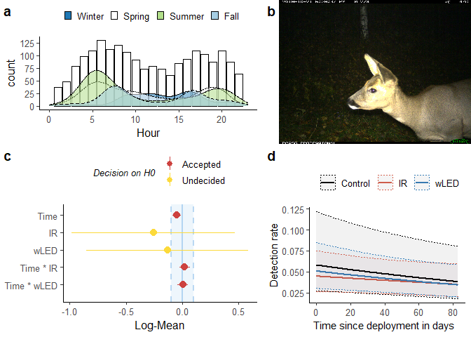<!-- -->

```r
       #  hjust = 1, halign = 1, valign = 0)
```


```r
summary(r_sp)
```

```
## We fitted a poisson mixed model to predict n.obs with time.deploy and flash. The model included loc and week as random effects. The model's total explanatory power is substantial (conditional R2 = 0.38) and the part related to the fixed effects alone (marginal R2) is of 2.97e-03. The model's intercept is at -2.85 (95% CI [-3.58, -2.11]). Within this model:
## 
##   - The effect of time.deploy is significantly negative (beta = -0.05, 95% CI [-0.09, -6.37e-03], p < .05, Std. beta = -0.12)
##   - The effect of flash [IR] is non-significantly negative (beta = -0.26, 95% CI [-1.12, 0.60], p = 0.557, Std. beta = -0.18)
##   - The effect of flash [wLED] is non-significantly negative (beta = -0.13, 95% CI [-0.99, 0.73], p = 0.761, Std. beta = -0.12)
##   - The interaction effect of flash [IR] on time.deploy is non-significantly positive (beta = 0.02, 95% CI [-0.04, 0.08], p = 0.476, Std. beta = 0.05)
##   - The interaction effect of flash [wLED] on time.deploy is non-significantly positive (beta = 3.37e-03, 95% CI [-0.05, 0.06], p = 0.901, Std. beta = 7.96e-03)
```

```r
as.report_table(r_sp)
```

```
## Parameter                  | Coefficient |         95% CI |     z |  df |      p | Std. Coef. | Std. Coef. 95% CI |      Fit
## ----------------------------------------------------------------------------------------------------------------------------
## (Intercept)                |       -2.85 | [-3.58, -2.11] | -7.57 | Inf | < .001 |      -3.04 |    [-3.76, -2.32] |         
## time.deploy                |       -0.05 | [-0.09, -0.01] | -2.24 | Inf | 0.025  |      -0.12 |    [-0.22, -0.02] |         
## flash [IR]                 |       -0.26 | [-1.12,  0.60] | -0.59 | Inf | 0.557  |      -0.18 |    [-1.02,  0.66] |         
## flash [wLED]               |       -0.13 | [-0.99,  0.73] | -0.30 | Inf | 0.761  |      -0.12 |    [-0.96,  0.72] |         
## time.deploy * flash [IR]   |        0.02 | [-0.04,  0.08] |  0.71 | Inf | 0.476  |       0.05 |    [-0.08,  0.18] |         
## time.deploy * flash [wLED] |    3.37e-03 | [-0.05,  0.06] |  0.12 | Inf | 0.901  |   7.96e-03 |    [-0.12,  0.13] |         
##                            |             |                |       |     |        |            |                   |         
## AIC                        |             |                |       |     |        |            |                   |  7685.62
## BIC                        |             |                |       |     |        |            |                   |  7745.76
## R2 (conditional)           |             |                |       |     |        |            |                   |     0.38
## R2 (marginal)              |             |                |       |     |        |            |                   | 2.97e-03
## Sigma                      |             |                |       |     |        |            |                   |     1.00
```


```r
# Storing species-specific objects for later, as shortcuts
# Model
m_raa    = m_sp
# ggpredict 
p_raa    = p_sp
# report-object
r_raa    = r_sp
# parameters refit
para_raa = para_sp
```

__Chunk order:__

1. sp
1. sp-report
1. sp-report2
1. parameters
1. objects


## Red Fox

 
This is where I change the content of the species object 'sp'. I have to do it before calling the pre-defined code chunks.

Now, sp contains rev.


```r
# sp ="raadyr"  #(shortcut for when editing)
# n locations that detected the species
n_loc <- time.dep4$loc[time.dep4$n.obs > 0 & time.dep4$species %in% sp] %>% unique()
# subsetting data for species, and the locations where it was detected
time_sp <- filter(time.dep4,       #.dep4 = trimmed data
                  species %in% sp, # filtering species
                  loc %in% n_loc)  # filtering locations
# Model
m_sp  <- lme4::glmer(n.obs ~ time.deploy * flash + # fixed effects
            (1 | loc) + (1 | week),                # random effects
            data   = time_sp,       # subset data
            family = poisson) # poisson family of distributions because of count data

# ggeffect calls effects::Effect - for plotting marginal effects 
p_sp    <- ggeffects::ggeffect(m_sp, terms = c("time.deploy [all]", "flash"))
# Diagnostics
assumpt <- performance::check_model(m_sp) # check assumptions
# va_r <- insight::get_variance(m_sp)
# Summary, report, model
summary(m_sp)
```

```
## Generalized linear mixed model fit by maximum likelihood (Laplace
##   Approximation) [glmerMod]
##  Family: poisson  ( log )
## Formula: n.obs ~ time.deploy * flash + (1 | loc) + (1 | week)
##    Data: time_sp
## 
##      AIC      BIC   logLik deviance df.resid 
##   5740.1   5801.2  -2862.1   5724.1    15241 
## 
## Scaled residuals: 
##     Min      1Q  Median      3Q     Max 
## -0.6332 -0.2445 -0.1816 -0.1298 13.0526 
## 
## Random effects:
##  Groups Name        Variance Std.Dev.
##  loc    (Intercept) 0.74933  0.8656  
##  week   (Intercept) 0.07133  0.2671  
## Number of obs: 15249, groups:  loc, 53; week, 52
## 
## Fixed effects:
##                         Estimate Std. Error z value Pr(>|z|)    
## (Intercept)           -3.4391866  0.2565890 -13.403   <2e-16 ***
## time.deploy           -0.0005472  0.0282401  -0.019    0.985    
## flashIR                0.0294434  0.3151412   0.093    0.926    
## flashwLED              0.1764789  0.3136447   0.563    0.574    
## time.deploy:flashIR   -0.0024082  0.0378228  -0.064    0.949    
## time.deploy:flashwLED -0.0111628  0.0370606  -0.301    0.763    
## ---
## Signif. codes:  0 '***' 0.001 '**' 0.01 '*' 0.05 '.' 0.1 ' ' 1
## 
## Correlation of Fixed Effects:
##             (Intr) tm.dpl flshIR flsLED tm.:IR
## time.deploy -0.442                            
## flashIR     -0.776  0.326                     
## flashwLED   -0.782  0.335  0.860              
## tm.dply:fIR  0.289 -0.653 -0.472 -0.244       
## tm.dply:LED  0.302 -0.682 -0.248 -0.467  0.504
```

```r
r_sp <- report::report(m_sp) # text-summary of my model, to include in a report
para_sp  <- model_parameters(m_sp,   standardize = "refit") # model parameters
saveRDS(m_sp, file = paste0("m_",sp,".rds")) # save model objects as shortcut for when editing etc.
```
### Plot


```r
summary(r_sp)
```

```
## We fitted a poisson mixed model to predict n.obs with time.deploy and flash. The model included loc and week as random effects. The model's total explanatory power is moderate (conditional R2 = 0.19) and the part related to the fixed effects alone (marginal R2) is of 8.63e-04. The model's intercept is at -3.44 (95% CI [-3.94, -2.94]). Within this model:
## 
##   - The effect of time.deploy is non-significantly negative (beta = -5.47e-04, 95% CI [-0.06, 0.05], p = 0.985, Std. beta = -1.29e-03)
##   - The effect of flash [IR] is non-significantly positive (beta = 0.03, 95% CI [-0.59, 0.65], p = 0.926, Std. beta = 0.02)
##   - The effect of flash [wLED] is non-significantly positive (beta = 0.18, 95% CI [-0.44, 0.79], p = 0.574, Std. beta = 0.13)
##   - The interaction effect of flash [IR] on time.deploy is non-significantly negative (beta = -2.41e-03, 95% CI [-0.08, 0.07], p = 0.949, Std. beta = -5.69e-03)
##   - The interaction effect of flash [wLED] on time.deploy is non-significantly negative (beta = -0.01, 95% CI [-0.08, 0.06], p = 0.763, Std. beta = -0.03)
```

```r
as.report_table(r_sp)
```

```
## Parameter                  | Coefficient |         95% CI |      z |  df |      p | Std. Coef. | Std. Coef. 95% CI |      Fit
## -----------------------------------------------------------------------------------------------------------------------------
## (Intercept)                |       -3.44 | [-3.94, -2.94] | -13.40 | Inf | < .001 |      -3.44 |    [-3.89, -2.99] |         
## time.deploy                |   -5.47e-04 | [-0.06,  0.05] |  -0.02 | Inf | 0.985  |  -1.29e-03 |    [-0.13,  0.13] |         
## flash [IR]                 |        0.03 | [-0.59,  0.65] |   0.09 | Inf | 0.926  |       0.02 |    [-0.52,  0.56] |         
## flash [wLED]               |        0.18 | [-0.44,  0.79] |   0.56 | Inf | 0.574  |       0.13 |    [-0.41,  0.68] |         
## time.deploy * flash [IR]   |   -2.41e-03 | [-0.08,  0.07] |  -0.06 | Inf | 0.949  |  -5.69e-03 |    [-0.18,  0.17] |         
## time.deploy * flash [wLED] |       -0.01 | [-0.08,  0.06] |  -0.30 | Inf | 0.763  |      -0.03 |    [-0.20,  0.15] |         
##                            |             |                |        |     |        |            |                   |         
## AIC                        |             |                |        |     |        |            |                   |  5740.11
## BIC                        |             |                |        |     |        |            |                   |  5801.17
## R2 (conditional)           |             |                |        |     |        |            |                   |     0.19
## R2 (marginal)              |             |                |        |     |        |            |                   | 8.63e-04
## Sigma                      |             |                |        |     |        |            |                   |     1.00
```

```r
library(cowplot) # to make grid-plots
library(magick)
# ggpredict
p_sp1 <- plot(p_sp, ci.style = c("dash"), line.size = 1, #ci.styles: “ribbon”, “errorbar”, “dash”, “dot”
               colors = c("black","#e41a1c","#377eb8")) +
   labs(title="", x="Time since deployment (per 10 days) \ ", y="Detection rate") +
   ggpubr::theme_classic2() +
  theme(legend.position = "top", legend.title = element_blank(),
        axis.title = element_text(size = 11)) 

# standardized plots aren't very different, other than on the scale
#plot(para_sp, size_text = 3) + labs(title = paste0(sp, " GLMM parameters") ,
#                                    subtitle = 'standardize  = "refit" ')

# Equivalence test
result <- equivalence_test(m_sp)
result
```

```
## # TOST-test for Practical Equivalence
## 
##   ROPE: [-0.10 0.10]
## 
##                   Parameter        H0 inside ROPE        90% CI
##                 (Intercept)  Rejected      0.00 % [-3.86 -3.02]
##                 time.deploy  Accepted    100.00 % [-0.05  0.05]
##                  flash [IR] Undecided     19.29 % [-0.49  0.55]
##                flash [wLED] Undecided     19.38 % [-0.34  0.69]
##    time.deploy * flash [IR]  Accepted    100.00 % [-0.06  0.06]
##  time.deploy * flash [wLED]  Accepted    100.00 % [-0.07  0.05]
```

```r
# labels for equivalence test - prettier to the human eye
par_lab <- c("Time", "IR", "wLED", "Time * IR", "Time * wLED")
par_lab <- par_lab[5:1]
# Equivalence plot
p_eq <- plot(result) + labs(y = "Log-Mean") + 
    scale_x_discrete(labels = par_lab) + # new axis names
    theme(#legend.position = c(1, .5), legend.justification = c(1, 1),#legend placement
        legend.position = "top") +#,  
        # axis.text.y = element_text(vjust = -0.7, hjust = 0, # axis-text inside
        #                          margin = margin(l = 10, r = -55)),
        #   axis.ticks.length.y = unit(-1,"mm")) + # inward axis ticks
    guides(colour = guide_legend(nrow = 2, override.aes = list(size = .5),
                                 title.theme = element_text( 
                                   size=10, #adjusting legend appearance
                                   face="italic"))) 
```

```
## Scale for 'x' is already present. Adding another scale for 'x', which will
## replace the existing scale.
```

```r
# cowplot::plot_grid(NULL,NULL,p_dens,NULL,
#                    #nrow = 2,
#                    # rel_widths = c(3,4,6,1),
#                    # rel_heights = c(3,2),
#                    labels="auto",
#                    axis = "r"
# ) 


sp_file <- paste0("jpg/",sp,".JPG")
jpg <- ggdraw() + draw_image(sp_file, halign = 1)

p_grid <- cowplot::plot_grid(p_sp1,
                             p_eq,
                             p_dens,
                             jpg,
                   #nrow = 2,
                   rel_widths = c(3,4),
                   rel_heights = c(3,2),
                   labels="auto"
                   #align = "h"
) + labs(title = paste0(sp, " present at ",n_loc," sites."))
p_grid #+ draw_image(sp_file, scale = .4, x = 0.9,
```

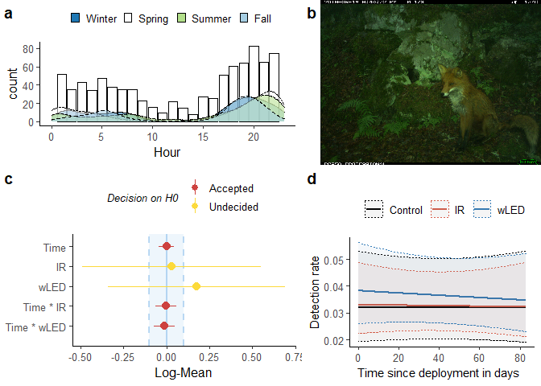<!-- -->

```r
       #  hjust = 1, halign = 1, valign = 0)
```


```r
# Model
m_rev    = m_sp
# ggpredict 
p_rev    = p_sp
# report-object
r_rev    = r_sp
# parameters refit
para_rev = para_sp
```


```r
knitr::knit_exit() # to exit knitting process here instead of at the document end
```


## Badger


Now, sp contains grevling.


```r
# sp ="raadyr"  #(shortcut for when editing)
# n locations that detected the species
n_loc <- time.dep4$loc[time.dep4$n.obs > 0 & time.dep4$species %in% sp] %>% unique()
# subsetting data for species, and the locations where it was detected
time_sp <- filter(time.dep4,       #.dep4 = trimmed data
                  species %in% sp, # filtering species
                  loc %in% n_loc)  # filtering locations
# Model
m_sp  <- lme4::glmer(n.obs ~ time.deploy * flash + # fixed effects
            (1 | loc) + (1 | week),                # random effects
            data   = time_sp,       # subset data
            family = poisson) # poisson family of distributions because of count data

# ggeffect calls effects::Effect - for plotting marginal effects 
p_sp    <- ggeffects::ggeffect(m_sp, terms = c("time.deploy [all]", "flash"))
# Diagnostics
assumpt <- performance::check_model(m_sp) # check assumptions
# va_r <- insight::get_variance(m_sp)
# Summary, report, model
summary(m_sp)
```

```
## Generalized linear mixed model fit by maximum likelihood (Laplace
##   Approximation) [glmerMod]
##  Family: poisson  ( log )
## Formula: n.obs ~ time.deploy * flash + (1 | loc) + (1 | week)
##    Data: time_sp
## 
##      AIC      BIC   logLik deviance df.resid 
##   4728.3   4788.6  -2356.1   4712.3    13890 
## 
## Scaled residuals: 
##     Min      1Q  Median      3Q     Max 
## -1.1151 -0.2166 -0.1326 -0.0764 28.2591 
## 
## Random effects:
##  Groups Name        Variance Std.Dev.
##  week   (Intercept) 1.60     1.265   
##  loc    (Intercept) 1.01     1.005   
## Number of obs: 13898, groups:  week, 52; loc, 48
## 
## Fixed effects:
##                        Estimate Std. Error z value Pr(>|z|)    
## (Intercept)           -4.489893   0.370455 -12.120   <2e-16 ***
## time.deploy            0.063753   0.034385   1.854   0.0637 .  
## flashIR                0.171324   0.386347   0.443   0.6574    
## flashwLED              0.244428   0.382821   0.638   0.5232    
## time.deploy:flashIR    0.011448   0.041787   0.274   0.7841    
## time.deploy:flashwLED  0.004346   0.040130   0.108   0.9138    
## ---
## Signif. codes:  0 '***' 0.001 '**' 0.01 '*' 0.05 '.' 0.1 ' ' 1
## 
## Correlation of Fixed Effects:
##             (Intr) tm.dpl flshIR flsLED tm.:IR
## time.deploy -0.416                            
## flashIR     -0.685  0.340                     
## flashwLED   -0.694  0.351  0.882              
## tm.dply:fIR  0.269 -0.638 -0.480 -0.266       
## tm.dply:LED  0.294 -0.693 -0.277 -0.471  0.537
```

```r
r_sp <- report::report(m_sp) # text-summary of my model, to include in a report
para_sp  <- model_parameters(m_sp,   standardize = "refit") # model parameters
```

```
## Warning in checkConv(attr(opt, "derivs"), opt$par, ctrl = control$checkConv, :
## Model failed to converge with max|grad| = 0.00454548 (tol = 0.002, component 1)
```

```r
saveRDS(m_sp, file = paste0("m_",sp,".rds")) # save model objects as shortcut for when editing etc.
```

### Plot


```r
summary(r_sp)
```

```
## We fitted a poisson mixed model to predict n.obs with time.deploy and flash. The model included loc and week as random effects. The model's total explanatory power is substantial (conditional R2 = 0.39) and the part related to the fixed effects alone (marginal R2) is of 5.65e-03. The model's intercept is at -4.49 (95% CI [-5.22, -3.76]). Within this model:
## 
##   - The effect of time.deploy is non-significantly positive (beta = 0.06, 95% CI [-3.64e-03, 0.13], p = 0.064, Std. beta = 0.15)
##   - The effect of flash [IR] is non-significantly positive (beta = 0.17, 95% CI [-0.59, 0.93], p = 0.657, Std. beta = 0.22)
##   - The effect of flash [wLED] is non-significantly positive (beta = 0.24, 95% CI [-0.51, 0.99], p = 0.523, Std. beta = 0.26)
##   - The interaction effect of flash [IR] on time.deploy is non-significantly positive (beta = 0.01, 95% CI [-0.07, 0.09], p = 0.784, Std. beta = 0.03)
##   - The interaction effect of flash [wLED] on time.deploy is non-significantly positive (beta = 4.35e-03, 95% CI [-0.07, 0.08], p = 0.914, Std. beta = 0.01)
```

```r
as.report_table(r_sp)
```

```
## Parameter                  | Coefficient |         95% CI |      z |  df |      p | Std. Coef. | Std. Coef. 95% CI |      Fit
## -----------------------------------------------------------------------------------------------------------------------------
## (Intercept)                |       -4.49 | [-5.22, -3.76] | -12.12 | Inf | < .001 |      -4.24 |    [-4.90, -3.58] |         
## time.deploy                |        0.06 | [ 0.00,  0.13] |   1.85 | Inf | 0.064  |       0.15 |    [-0.01,  0.31] |         
## flash [IR]                 |        0.17 | [-0.59,  0.93] |   0.44 | Inf | 0.657  |       0.22 |    [-0.45,  0.88] |         
## flash [wLED]               |        0.24 | [-0.51,  0.99] |   0.64 | Inf | 0.523  |       0.26 |    [-0.40,  0.93] |         
## time.deploy * flash [IR]   |        0.01 | [-0.07,  0.09] |   0.27 | Inf | 0.784  |       0.03 |    [-0.17,  0.22] |         
## time.deploy * flash [wLED] |    4.35e-03 | [-0.07,  0.08] |   0.11 | Inf | 0.914  |       0.01 |    [-0.18,  0.20] |         
##                            |             |                |        |     |        |            |                   |         
## AIC                        |             |                |        |     |        |            |                   |  4728.27
## BIC                        |             |                |        |     |        |            |                   |  4788.59
## R2 (conditional)           |             |                |        |     |        |            |                   |     0.39
## R2 (marginal)              |             |                |        |     |        |            |                   | 5.65e-03
## Sigma                      |             |                |        |     |        |            |                   |     1.00
```

```r
library(cowplot) # to make grid-plots
library(magick)
# ggpredict
p_sp1 <- plot(p_sp, ci.style = c("dash"), line.size = 1, #ci.styles: “ribbon”, “errorbar”, “dash”, “dot”
               colors = c("black","#e41a1c","#377eb8")) +
   labs(title="", x="Time since deployment (per 10 days) \ ", y="Detection rate") +
   ggpubr::theme_classic2() +
  theme(legend.position = "top", legend.title = element_blank(),
        axis.title = element_text(size = 11)) 

# standardized plots aren't very different, other than on the scale
#plot(para_sp, size_text = 3) + labs(title = paste0(sp, " GLMM parameters") ,
#                                    subtitle = 'standardize  = "refit" ')

# Equivalence test
result <- equivalence_test(m_sp)
result
```

```
## # TOST-test for Practical Equivalence
## 
##   ROPE: [-0.10 0.10]
## 
##                   Parameter        H0 inside ROPE        90% CI
##                 (Intercept)  Rejected      0.00 % [-5.10 -3.88]
##                 time.deploy  Rejected     82.04 % [ 0.01  0.12]
##                  flash [IR] Undecided     15.74 % [-0.46  0.81]
##                flash [wLED] Undecided     15.88 % [-0.39  0.87]
##    time.deploy * flash [IR]  Accepted    100.00 % [-0.06  0.08]
##  time.deploy * flash [wLED]  Accepted    100.00 % [-0.06  0.07]
```

```r
# labels for equivalence test - prettier to the human eye
par_lab <- c("Time", "IR", "wLED", "Time * IR", "Time * wLED")
par_lab <- par_lab[5:1]
# Equivalence plot
p_eq <- plot(result) + labs(y = "Log-Mean") + 
    scale_x_discrete(labels = par_lab) + # new axis names
    theme(#legend.position = c(1, .5), legend.justification = c(1, 1),#legend placement
        legend.position = "top") +#,  
        # axis.text.y = element_text(vjust = -0.7, hjust = 0, # axis-text inside
        #                          margin = margin(l = 10, r = -55)),
        #   axis.ticks.length.y = unit(-1,"mm")) + # inward axis ticks
    guides(colour = guide_legend(nrow = 2, override.aes = list(size = .5),
                                 title.theme = element_text( 
                                   size=10, #adjusting legend appearance
                                   face="italic"))) 
```

```
## Scale for 'x' is already present. Adding another scale for 'x', which will
## replace the existing scale.
```

```r
# cowplot::plot_grid(NULL,NULL,p_dens,NULL,
#                    #nrow = 2,
#                    # rel_widths = c(3,4,6,1),
#                    # rel_heights = c(3,2),
#                    labels="auto",
#                    axis = "r"
# ) 


sp_file <- paste0("jpg/",sp,".JPG")
jpg <- ggdraw() + draw_image(sp_file, halign = 1)

p_grid <- cowplot::plot_grid(p_sp1,
                             p_eq,
                             p_dens,
                             jpg,
                   #nrow = 2,
                   rel_widths = c(3,4),
                   rel_heights = c(3,2),
                   labels="auto"
                   #align = "h"
) + labs(title = paste0(sp, " present at ",n_loc," sites."))
p_grid #+ draw_image(sp_file, scale = .4, x = 0.9,
```

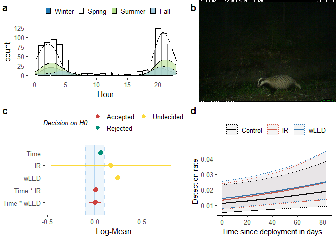<!-- -->

```r
       #  hjust = 1, halign = 1, valign = 0)
```


```r
# Model
m_grvl    = m_sp
# ggpredict 
p_grvl    = p_sp
# report-object
r_grvl    = r_sp
# parameters refit
para_grvl = para_sp
```


## Moose


Now, sp contains elg.


```r
# sp ="raadyr"  #(shortcut for when editing)
# n locations that detected the species
n_loc <- time.dep4$loc[time.dep4$n.obs > 0 & time.dep4$species %in% sp] %>% unique()
# subsetting data for species, and the locations where it was detected
time_sp <- filter(time.dep4,       #.dep4 = trimmed data
                  species %in% sp, # filtering species
                  loc %in% n_loc)  # filtering locations
# Model
m_sp  <- lme4::glmer(n.obs ~ time.deploy * flash + # fixed effects
            (1 | loc) + (1 | week),                # random effects
            data   = time_sp,       # subset data
            family = poisson) # poisson family of distributions because of count data

# ggeffect calls effects::Effect - for plotting marginal effects 
p_sp    <- ggeffects::ggeffect(m_sp, terms = c("time.deploy [all]", "flash"))
# Diagnostics
assumpt <- performance::check_model(m_sp) # check assumptions
# va_r <- insight::get_variance(m_sp)
# Summary, report, model
summary(m_sp)
```

```
## Generalized linear mixed model fit by maximum likelihood (Laplace
##   Approximation) [glmerMod]
##  Family: poisson  ( log )
## Formula: n.obs ~ time.deploy * flash + (1 | loc) + (1 | week)
##    Data: time_sp
## 
##      AIC      BIC   logLik deviance df.resid 
##   2956.3   3015.4  -1470.2   2940.3    11943 
## 
## Scaled residuals: 
##     Min      1Q  Median      3Q     Max 
## -0.4229 -0.1843 -0.1363 -0.1026 17.4246 
## 
## Random effects:
##  Groups Name        Variance Std.Dev.
##  week   (Intercept) 0.5270   0.7260  
##  loc    (Intercept) 0.4014   0.6335  
## Number of obs: 11951, groups:  week, 52; loc, 41
## 
## Fixed effects:
##                        Estimate Std. Error z value Pr(>|z|)    
## (Intercept)           -4.153451   0.302125 -13.747   <2e-16 ***
## time.deploy            0.006304   0.045516   0.138    0.890    
## flashIR               -0.081991   0.349354  -0.235    0.814    
## flashwLED              0.301856   0.338919   0.891    0.373    
## time.deploy:flashIR    0.050860   0.059004   0.862    0.389    
## time.deploy:flashwLED -0.006982   0.056859  -0.123    0.902    
## ---
## Signif. codes:  0 '***' 0.001 '**' 0.01 '*' 0.05 '.' 0.1 ' ' 1
## 
## Correlation of Fixed Effects:
##             (Intr) tm.dpl flshIR flsLED tm.:IR
## time.deploy -0.626                            
## flashIR     -0.680  0.462                     
## flashwLED   -0.712  0.485  0.746              
## tm.dply:fIR  0.372 -0.629 -0.670 -0.357       
## tm.dply:LED  0.431 -0.703 -0.384 -0.655  0.529
```

```r
r_sp <- report::report(m_sp) # text-summary of my model, to include in a report
para_sp  <- model_parameters(m_sp,   standardize = "refit") # model parameters
saveRDS(m_sp, file = paste0("m_",sp,".rds")) # save model objects as shortcut for when editing etc.
```

### Plot


```r
summary(r_sp)
```

```
## We fitted a poisson mixed model to predict n.obs with time.deploy and flash. The model included loc and week as random effects. The model's total explanatory power is moderate (conditional R2 = 0.19) and the part related to the fixed effects alone (marginal R2) is of 3.72e-03. The model's intercept is at -4.15 (95% CI [-4.75, -3.56]). Within this model:
## 
##   - The effect of time.deploy is non-significantly positive (beta = 6.30e-03, 95% CI [-0.08, 0.10], p = 0.890, Std. beta = 0.01)
##   - The effect of flash [IR] is non-significantly negative (beta = -0.08, 95% CI [-0.77, 0.60], p = 0.814, Std. beta = 0.12)
##   - The effect of flash [wLED] is non-significantly positive (beta = 0.30, 95% CI [-0.36, 0.97], p = 0.373, Std. beta = 0.27)
##   - The interaction effect of flash [IR] on time.deploy is non-significantly positive (beta = 0.05, 95% CI [-0.06, 0.17], p = 0.389, Std. beta = 0.12)
##   - The interaction effect of flash [wLED] on time.deploy is non-significantly negative (beta = -6.98e-03, 95% CI [-0.12, 0.10], p = 0.902, Std. beta = -0.02)
```

```r
as.report_table(r_sp)
```

```
## Parameter                  | Coefficient |         95% CI |      z |  df |      p | Std. Coef. | Std. Coef. 95% CI |      Fit
## -----------------------------------------------------------------------------------------------------------------------------
## (Intercept)                |       -4.15 | [-4.75, -3.56] | -13.75 | Inf | < .001 |      -4.13 |    [-4.59, -3.67] |         
## time.deploy                |    6.30e-03 | [-0.08,  0.10] |   0.14 | Inf | 0.890  |       0.01 |    [-0.20,  0.23] |         
## flash [IR]                 |       -0.08 | [-0.77,  0.60] |  -0.23 | Inf | 0.814  |       0.12 |    [-0.39,  0.62] |         
## flash [wLED]               |        0.30 | [-0.36,  0.97] |   0.89 | Inf | 0.373  |       0.27 |    [-0.23,  0.78] |         
## time.deploy * flash [IR]   |        0.05 | [-0.06,  0.17] |   0.86 | Inf | 0.389  |       0.12 |    [-0.15,  0.39] |         
## time.deploy * flash [wLED] |   -6.98e-03 | [-0.12,  0.10] |  -0.12 | Inf | 0.902  |      -0.02 |    [-0.28,  0.25] |         
##                            |             |                |        |     |        |            |                   |         
## AIC                        |             |                |        |     |        |            |                   |  2956.30
## BIC                        |             |                |        |     |        |            |                   |  3015.41
## R2 (conditional)           |             |                |        |     |        |            |                   |     0.19
## R2 (marginal)              |             |                |        |     |        |            |                   | 3.72e-03
## Sigma                      |             |                |        |     |        |            |                   |     1.00
```

```r
library(cowplot) # to make grid-plots
library(magick)
# ggpredict
p_sp1 <- plot(p_sp, ci.style = c("dash"), line.size = 1, #ci.styles: “ribbon”, “errorbar”, “dash”, “dot”
               colors = c("black","#e41a1c","#377eb8")) +
   labs(title="", x="Time since deployment (per 10 days) \ ", y="Detection rate") +
   ggpubr::theme_classic2() +
  theme(legend.position = "top", legend.title = element_blank(),
        axis.title = element_text(size = 11)) 

# standardized plots aren't very different, other than on the scale
#plot(para_sp, size_text = 3) + labs(title = paste0(sp, " GLMM parameters") ,
#                                    subtitle = 'standardize  = "refit" ')

# Equivalence test
result <- equivalence_test(m_sp)
result
```

```
## # TOST-test for Practical Equivalence
## 
##   ROPE: [-0.10 0.10]
## 
##                   Parameter        H0 inside ROPE        90% CI
##                 (Intercept)  Rejected      0.00 % [-4.65 -3.66]
##                 time.deploy  Accepted    100.00 % [-0.07  0.08]
##                  flash [IR] Undecided     17.40 % [-0.66  0.49]
##                flash [wLED] Undecided     17.94 % [-0.26  0.86]
##    time.deploy * flash [IR] Undecided     75.32 % [-0.05  0.15]
##  time.deploy * flash [wLED] Undecided     99.73 % [-0.10  0.09]
```

```r
# labels for equivalence test - prettier to the human eye
par_lab <- c("Time", "IR", "wLED", "Time * IR", "Time * wLED")
par_lab <- par_lab[5:1]
# Equivalence plot
p_eq <- plot(result) + labs(y = "Log-Mean") + 
    scale_x_discrete(labels = par_lab) + # new axis names
    theme(#legend.position = c(1, .5), legend.justification = c(1, 1),#legend placement
        legend.position = "top") +#,  
        # axis.text.y = element_text(vjust = -0.7, hjust = 0, # axis-text inside
        #                          margin = margin(l = 10, r = -55)),
        #   axis.ticks.length.y = unit(-1,"mm")) + # inward axis ticks
    guides(colour = guide_legend(nrow = 2, override.aes = list(size = .5),
                                 title.theme = element_text( 
                                   size=10, #adjusting legend appearance
                                   face="italic"))) 
```

```
## Scale for 'x' is already present. Adding another scale for 'x', which will
## replace the existing scale.
```

```r
# cowplot::plot_grid(NULL,NULL,p_dens,NULL,
#                    #nrow = 2,
#                    # rel_widths = c(3,4,6,1),
#                    # rel_heights = c(3,2),
#                    labels="auto",
#                    axis = "r"
# ) 


sp_file <- paste0("jpg/",sp,".JPG")
jpg <- ggdraw() + draw_image(sp_file, halign = 1)

p_grid <- cowplot::plot_grid(p_sp1,
                             p_eq,
                             p_dens,
                             jpg,
                   #nrow = 2,
                   rel_widths = c(3,4),
                   rel_heights = c(3,2),
                   labels="auto"
                   #align = "h"
) + labs(title = paste0(sp, " present at ",n_loc," sites."))
p_grid #+ draw_image(sp_file, scale = .4, x = 0.9,
```

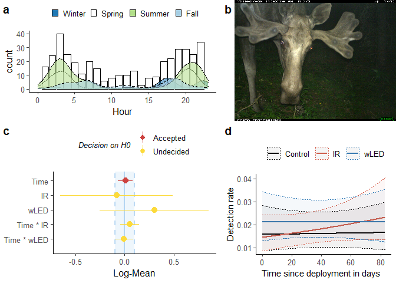<!-- -->

```r
       #  hjust = 1, halign = 1, valign = 0)
```


```r
# Model
m_elg    = m_sp
# ggpredict 
p_elg    = p_sp
# report-object
r_elg    = r_sp
# parameters refit
para_elg = para_sp
```

## Red deer


Now, sp contains hjort.


```r
# sp ="raadyr"  #(shortcut for when editing)
# n locations that detected the species
n_loc <- time.dep4$loc[time.dep4$n.obs > 0 & time.dep4$species %in% sp] %>% unique()
# subsetting data for species, and the locations where it was detected
time_sp <- filter(time.dep4,       #.dep4 = trimmed data
                  species %in% sp, # filtering species
                  loc %in% n_loc)  # filtering locations
# Model
m_sp  <- lme4::glmer(n.obs ~ time.deploy * flash + # fixed effects
            (1 | loc) + (1 | week),                # random effects
            data   = time_sp,       # subset data
            family = poisson) # poisson family of distributions because of count data

# ggeffect calls effects::Effect - for plotting marginal effects 
p_sp    <- ggeffects::ggeffect(m_sp, terms = c("time.deploy [all]", "flash"))
# Diagnostics
assumpt <- performance::check_model(m_sp) # check assumptions
# va_r <- insight::get_variance(m_sp)
# Summary, report, model
summary(m_sp)
```

```
## Generalized linear mixed model fit by maximum likelihood (Laplace
##   Approximation) [glmerMod]
##  Family: poisson  ( log )
## Formula: n.obs ~ time.deploy * flash + (1 | loc) + (1 | week)
##    Data: time_sp
## 
##      AIC      BIC   logLik deviance df.resid 
##   1743.4   1798.6   -863.7   1727.4     7336 
## 
## Scaled residuals: 
##     Min      1Q  Median      3Q     Max 
## -0.4840 -0.1774 -0.1283 -0.0927 16.1188 
## 
## Random effects:
##  Groups Name        Variance Std.Dev.
##  week   (Intercept) 0.2568   0.5067  
##  loc    (Intercept) 0.7147   0.8454  
## Number of obs: 7344, groups:  week, 52; loc, 26
## 
## Fixed effects:
##                        Estimate Std. Error z value Pr(>|z|)    
## (Intercept)           -3.891154   0.407582  -9.547  < 2e-16 ***
## time.deploy           -0.094938   0.058353  -1.627  0.10374    
## flashIR               -0.009873   0.498299  -0.020  0.98419    
## flashwLED             -0.687348   0.526986  -1.304  0.19213    
## time.deploy:flashIR    0.061810   0.076779   0.805  0.42080    
## time.deploy:flashwLED  0.231225   0.078062   2.962  0.00306 ** 
## ---
## Signif. codes:  0 '***' 0.001 '**' 0.01 '*' 0.05 '.' 0.1 ' ' 1
## 
## Correlation of Fixed Effects:
##             (Intr) tm.dpl flshIR flsLED tm.:IR
## time.deploy -0.509                            
## flashIR     -0.759  0.386                     
## flashwLED   -0.738  0.388  0.767              
## tm.dply:fIR  0.344 -0.687 -0.555 -0.289       
## tm.dply:LED  0.373 -0.713 -0.302 -0.609  0.531
```

```r
r_sp <- report::report(m_sp) # text-summary of my model, to include in a report
para_sp  <- model_parameters(m_sp,   standardize = "refit") # model parameters
saveRDS(m_sp, file = paste0("m_",sp,".rds")) # save model objects as shortcut for when editing etc.
```

### Plot


```r
summary(r_sp)
```

```
## We fitted a poisson mixed model to predict n.obs with time.deploy and flash. The model included loc and week as random effects. The model's total explanatory power is moderate (conditional R2 = 0.20) and the part related to the fixed effects alone (marginal R2) is of 0.01. The model's intercept is at -3.89 (95% CI [-4.69, -3.09]). Within this model:
## 
##   - The effect of time.deploy is non-significantly negative (beta = -0.09, 95% CI [-0.21, 0.02], p = 0.104, Std. beta = -0.22)
##   - The effect of flash [IR] is non-significantly negative (beta = -9.87e-03, 95% CI [-0.99, 0.97], p = 0.984, Std. beta = 0.23)
##   - The effect of flash [wLED] is non-significantly negative (beta = -0.69, 95% CI [-1.72, 0.35], p = 0.192, Std. beta = 0.21)
##   - The interaction effect of flash [IR] on time.deploy is non-significantly positive (beta = 0.06, 95% CI [-0.09, 0.21], p = 0.421, Std. beta = 0.15)
##   - The interaction effect of flash [wLED] on time.deploy is significantly positive (beta = 0.23, 95% CI [0.08, 0.38], p < .01, Std. beta = 0.55)
```

```r
as.report_table(r_sp)
```

```
## Parameter                  | Coefficient |         95% CI |     z |  df |      p | Std. Coef. | Std. Coef. 95% CI |     Fit
## ---------------------------------------------------------------------------------------------------------------------------
## (Intercept)                |       -3.89 | [-4.69, -3.09] | -9.55 | Inf | < .001 |      -4.26 |    [-4.95, -3.57] |        
## time.deploy                |       -0.09 | [-0.21,  0.02] | -1.63 | Inf | 0.104  |      -0.22 |    [-0.50,  0.05] |        
## flash [IR]                 |   -9.87e-03 | [-0.99,  0.97] | -0.02 | Inf | 0.984  |       0.23 |    [-0.58,  1.04] |        
## flash [wLED]               |       -0.69 | [-1.72,  0.35] | -1.30 | Inf | 0.192  |       0.21 |    [-0.61,  1.03] |        
## time.deploy * flash [IR]   |        0.06 | [-0.09,  0.21] |  0.81 | Inf | 0.421  |       0.15 |    [-0.21,  0.50] |        
## time.deploy * flash [wLED] |        0.23 | [ 0.08,  0.38] |  2.96 | Inf | 0.003  |       0.55 |    [ 0.19,  0.91] |        
##                            |             |                |       |     |        |            |                   |        
## AIC                        |             |                |       |     |        |            |                   | 1743.43
## BIC                        |             |                |       |     |        |            |                   | 1798.64
## R2 (conditional)           |             |                |       |     |        |            |                   |    0.20
## R2 (marginal)              |             |                |       |     |        |            |                   |    0.01
## Sigma                      |             |                |       |     |        |            |                   |    1.00
```

```r
library(cowplot) # to make grid-plots
library(magick)
# ggpredict
p_sp1 <- plot(p_sp, ci.style = c("dash"), line.size = 1, #ci.styles: “ribbon”, “errorbar”, “dash”, “dot”
               colors = c("black","#e41a1c","#377eb8")) +
   labs(title="", x="Time since deployment (per 10 days) \ ", y="Detection rate") +
   ggpubr::theme_classic2() +
  theme(legend.position = "top", legend.title = element_blank(),
        axis.title = element_text(size = 11)) 

# standardized plots aren't very different, other than on the scale
#plot(para_sp, size_text = 3) + labs(title = paste0(sp, " GLMM parameters") ,
#                                    subtitle = 'standardize  = "refit" ')

# Equivalence test
result <- equivalence_test(m_sp)
result
```

```
## # TOST-test for Practical Equivalence
## 
##   ROPE: [-0.10 0.10]
## 
##                   Parameter        H0 inside ROPE        90% CI
##                 (Intercept)  Rejected      0.00 % [-4.56 -3.22]
##                 time.deploy Undecided     52.64 % [-0.19  0.00]
##                  flash [IR] Undecided     12.20 % [-0.83  0.81]
##                flash [wLED] Undecided     11.54 % [-1.55  0.18]
##    time.deploy * flash [IR] Undecided     65.12 % [-0.06  0.19]
##  time.deploy * flash [wLED]  Rejected      0.00 % [ 0.10  0.36]
```

```r
# labels for equivalence test - prettier to the human eye
par_lab <- c("Time", "IR", "wLED", "Time * IR", "Time * wLED")
par_lab <- par_lab[5:1]
# Equivalence plot
p_eq <- plot(result) + labs(y = "Log-Mean") + 
    scale_x_discrete(labels = par_lab) + # new axis names
    theme(#legend.position = c(1, .5), legend.justification = c(1, 1),#legend placement
        legend.position = "top") +#,  
        # axis.text.y = element_text(vjust = -0.7, hjust = 0, # axis-text inside
        #                          margin = margin(l = 10, r = -55)),
        #   axis.ticks.length.y = unit(-1,"mm")) + # inward axis ticks
    guides(colour = guide_legend(nrow = 2, override.aes = list(size = .5),
                                 title.theme = element_text( 
                                   size=10, #adjusting legend appearance
                                   face="italic"))) 
```

```
## Scale for 'x' is already present. Adding another scale for 'x', which will
## replace the existing scale.
```

```r
# cowplot::plot_grid(NULL,NULL,p_dens,NULL,
#                    #nrow = 2,
#                    # rel_widths = c(3,4,6,1),
#                    # rel_heights = c(3,2),
#                    labels="auto",
#                    axis = "r"
# ) 


sp_file <- paste0("jpg/",sp,".JPG")
jpg <- ggdraw() + draw_image(sp_file, halign = 1)

p_grid <- cowplot::plot_grid(p_sp1,
                             p_eq,
                             p_dens,
                             jpg,
                   #nrow = 2,
                   rel_widths = c(3,4),
                   rel_heights = c(3,2),
                   labels="auto"
                   #align = "h"
) + labs(title = paste0(sp, " present at ",n_loc," sites."))
p_grid #+ draw_image(sp_file, scale = .4, x = 0.9,
```

<!-- -->

```r
       #  hjust = 1, halign = 1, valign = 0)
```


```r
# Model
m_hjort    = m_sp
# ggpredict 
p_hjort    = p_sp
# report-object
r_hjort    = r_sp
# parameters refit
para_hjort = para_sp
```


## Lynx


Now, sp contains gaupe.


```r
# sp ="raadyr"  #(shortcut for when editing)
# n locations that detected the species
n_loc <- time.dep4$loc[time.dep4$n.obs > 0 & time.dep4$species %in% sp] %>% unique()
# subsetting data for species, and the locations where it was detected
time_sp <- filter(time.dep4,       #.dep4 = trimmed data
                  species %in% sp, # filtering species
                  loc %in% n_loc)  # filtering locations
# Model
m_sp  <- lme4::glmer(n.obs ~ time.deploy * flash + # fixed effects
            (1 | loc) + (1 | week),                # random effects
            data   = time_sp,       # subset data
            family = poisson) # poisson family of distributions because of count data

# ggeffect calls effects::Effect - for plotting marginal effects 
p_sp    <- ggeffects::ggeffect(m_sp, terms = c("time.deploy [all]", "flash"))
# Diagnostics
assumpt <- performance::check_model(m_sp) # check assumptions
# va_r <- insight::get_variance(m_sp)
# Summary, report, model
summary(m_sp)
```

```
## Generalized linear mixed model fit by maximum likelihood (Laplace
##   Approximation) [glmerMod]
##  Family: poisson  ( log )
## Formula: n.obs ~ time.deploy * flash + (1 | loc) + (1 | week)
##    Data: time_sp
## 
##      AIC      BIC   logLik deviance df.resid 
##    686.2    739.9   -335.1    670.2     6083 
## 
## Scaled residuals: 
##     Min      1Q  Median      3Q     Max 
## -0.2932 -0.1020 -0.0814 -0.0654 19.4640 
## 
## Random effects:
##  Groups Name        Variance Std.Dev.
##  week   (Intercept) 0.2692   0.5188  
##  loc    (Intercept) 0.4612   0.6791  
## Number of obs: 6091, groups:  week, 52; loc, 22
## 
## Fixed effects:
##                       Estimate Std. Error z value Pr(>|z|)    
## (Intercept)            -4.8175     0.5848  -8.237   <2e-16 ***
## time.deploy            -0.2199     0.1389  -1.583    0.113    
## flashIR                -0.2004     0.7205  -0.278    0.781    
## flashwLED               0.1454     0.7163   0.203    0.839    
## time.deploy:flashIR     0.2484     0.1626   1.528    0.127    
## time.deploy:flashwLED   0.2577     0.1622   1.589    0.112    
## ---
## Signif. codes:  0 '***' 0.001 '**' 0.01 '*' 0.05 '.' 0.1 ' ' 1
## 
## Correlation of Fixed Effects:
##             (Intr) tm.dpl flshIR flsLED tm.:IR
## time.deploy -0.688                            
## flashIR     -0.750  0.545                     
## flashwLED   -0.775  0.564  0.703              
## tm.dply:fIR  0.573 -0.837 -0.717 -0.478       
## tm.dply:LED  0.587 -0.855 -0.478 -0.724  0.727
```

```r
r_sp <- report::report(m_sp) # text-summary of my model, to include in a report
para_sp  <- model_parameters(m_sp,   standardize = "refit") # model parameters
saveRDS(m_sp, file = paste0("m_",sp,".rds")) # save model objects as shortcut for when editing etc.
```

### Plot


```r
summary(r_sp)
```

```
## We fitted a poisson mixed model to predict n.obs with time.deploy and flash. The model included loc and week as random effects. The model's total explanatory power is moderate (conditional R2 = 0.18) and the part related to the fixed effects alone (marginal R2) is of 0.06. The model's intercept is at -4.82 (95% CI [-5.96, -3.67]). Within this model:
## 
##   - The effect of time.deploy is non-significantly negative (beta = -0.22, 95% CI [-0.49, 0.05], p = 0.113, Std. beta = -0.52)
##   - The effect of flash [IR] is non-significantly negative (beta = -0.20, 95% CI [-1.61, 1.21], p = 0.781, Std. beta = 0.76)
##   - The effect of flash [wLED] is non-significantly positive (beta = 0.15, 95% CI [-1.26, 1.55], p = 0.839, Std. beta = 1.15)
##   - The interaction effect of flash [IR] on time.deploy is non-significantly positive (beta = 0.25, 95% CI [-0.07, 0.57], p = 0.127, Std. beta = 0.59)
##   - The interaction effect of flash [wLED] on time.deploy is non-significantly positive (beta = 0.26, 95% CI [-0.06, 0.58], p = 0.112, Std. beta = 0.61)
```

```r
as.report_table(r_sp)
```

```
## Parameter                  | Coefficient |         95% CI |     z |  df |      p | Std. Coef. | Std. Coef. 95% CI |    Fit
## --------------------------------------------------------------------------------------------------------------------------
## (Intercept)                |       -4.82 | [-5.96, -3.67] | -8.24 | Inf | < .001 |      -5.67 |    [-6.54, -4.80] |       
## time.deploy                |       -0.22 | [-0.49,  0.05] | -1.58 | Inf | 0.113  |      -0.52 |    [-1.17,  0.12] |       
## flash [IR]                 |       -0.20 | [-1.61,  1.21] | -0.28 | Inf | 0.781  |       0.76 |    [-0.25,  1.77] |       
## flash [wLED]               |        0.15 | [-1.26,  1.55] |  0.20 | Inf | 0.839  |       1.15 |    [ 0.15,  2.14] |       
## time.deploy * flash [IR]   |        0.25 | [-0.07,  0.57] |  1.53 | Inf | 0.127  |       0.59 |    [-0.17,  1.35] |       
## time.deploy * flash [wLED] |        0.26 | [-0.06,  0.58] |  1.59 | Inf | 0.112  |       0.61 |    [-0.14,  1.37] |       
##                            |             |                |       |     |        |            |                   |       
## AIC                        |             |                |       |     |        |            |                   | 686.23
## BIC                        |             |                |       |     |        |            |                   | 739.94
## R2 (conditional)           |             |                |       |     |        |            |                   |   0.18
## R2 (marginal)              |             |                |       |     |        |            |                   |   0.06
## Sigma                      |             |                |       |     |        |            |                   |   1.00
```

```r
library(cowplot) # to make grid-plots
library(magick)
# ggpredict
p_sp1 <- plot(p_sp, ci.style = c("dash"), line.size = 1, #ci.styles: “ribbon”, “errorbar”, “dash”, “dot”
               colors = c("black","#e41a1c","#377eb8")) +
   labs(title="", x="Time since deployment (per 10 days) \ ", y="Detection rate") +
   ggpubr::theme_classic2() +
  theme(legend.position = "top", legend.title = element_blank(),
        axis.title = element_text(size = 11)) 

# standardized plots aren't very different, other than on the scale
#plot(para_sp, size_text = 3) + labs(title = paste0(sp, " GLMM parameters") ,
#                                    subtitle = 'standardize  = "refit" ')

# Equivalence test
result <- equivalence_test(m_sp)
result
```

```
## # TOST-test for Practical Equivalence
## 
##   ROPE: [-0.10 0.10]
## 
##                   Parameter        H0 inside ROPE        90% CI
##                 (Intercept)  Rejected      0.00 % [-5.78 -3.86]
##                 time.deploy Undecided     23.76 % [-0.45  0.01]
##                  flash [IR] Undecided      8.44 % [-1.39  0.98]
##                flash [wLED] Undecided      8.49 % [-1.03  1.32]
##    time.deploy * flash [IR] Undecided     22.25 % [-0.02  0.52]
##  time.deploy * flash [wLED] Undecided     20.45 % [-0.01  0.52]
```

```r
# labels for equivalence test - prettier to the human eye
par_lab <- c("Time", "IR", "wLED", "Time * IR", "Time * wLED")
par_lab <- par_lab[5:1]
# Equivalence plot
p_eq <- plot(result) + labs(y = "Log-Mean") + 
    scale_x_discrete(labels = par_lab) + # new axis names
    theme(#legend.position = c(1, .5), legend.justification = c(1, 1),#legend placement
        legend.position = "top") +#,  
        # axis.text.y = element_text(vjust = -0.7, hjust = 0, # axis-text inside
        #                          margin = margin(l = 10, r = -55)),
        #   axis.ticks.length.y = unit(-1,"mm")) + # inward axis ticks
    guides(colour = guide_legend(nrow = 2, override.aes = list(size = .5),
                                 title.theme = element_text( 
                                   size=10, #adjusting legend appearance
                                   face="italic"))) 
```

```
## Scale for 'x' is already present. Adding another scale for 'x', which will
## replace the existing scale.
```

```r
# cowplot::plot_grid(NULL,NULL,p_dens,NULL,
#                    #nrow = 2,
#                    # rel_widths = c(3,4,6,1),
#                    # rel_heights = c(3,2),
#                    labels="auto",
#                    axis = "r"
# ) 


sp_file <- paste0("jpg/",sp,".JPG")
jpg <- ggdraw() + draw_image(sp_file, halign = 1)

p_grid <- cowplot::plot_grid(p_sp1,
                             p_eq,
                             p_dens,
                             jpg,
                   #nrow = 2,
                   rel_widths = c(3,4),
                   rel_heights = c(3,2),
                   labels="auto"
                   #align = "h"
) + labs(title = paste0(sp, " present at ",n_loc," sites."))
p_grid #+ draw_image(sp_file, scale = .4, x = 0.9,
```

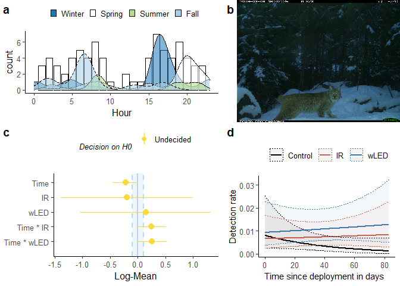<!-- -->

```r
       #  hjust = 1, halign = 1, valign = 0)
```


```r
# Model
m_gaup    = m_sp
# ggpredict 
p_gaup    = p_sp
# report-object
r_gaup    = r_sp
# parameters refit
para_gaup = para_sp
```


# Small species

Added late, because I was unsure about whether it made sense to include them or not.
After having learned about random effects in mixed effect models, I think it does make sense, even though the cameras in my study were set up with the original aim of photo capturing lynx.

## Hare


Now, sp contains hare.


```r
# sp ="raadyr"  #(shortcut for when editing)
# n locations that detected the species
n_loc <- time.dep4$loc[time.dep4$n.obs > 0 & time.dep4$species %in% sp] %>% unique()
# subsetting data for species, and the locations where it was detected
time_sp <- filter(time.dep4,       #.dep4 = trimmed data
                  species %in% sp, # filtering species
                  loc %in% n_loc)  # filtering locations
# Model
m_sp  <- lme4::glmer(n.obs ~ time.deploy * flash + # fixed effects
            (1 | loc) + (1 | week),                # random effects
            data   = time_sp,       # subset data
            family = poisson) # poisson family of distributions because of count data

# ggeffect calls effects::Effect - for plotting marginal effects 
p_sp    <- ggeffects::ggeffect(m_sp, terms = c("time.deploy [all]", "flash"))
# Diagnostics
assumpt <- performance::check_model(m_sp) # check assumptions
# va_r <- insight::get_variance(m_sp)
# Summary, report, model
summary(m_sp)
```

```
## Generalized linear mixed model fit by maximum likelihood (Laplace
##   Approximation) [glmerMod]
##  Family: poisson  ( log )
## Formula: n.obs ~ time.deploy * flash + (1 | loc) + (1 | week)
##    Data: time_sp
## 
##      AIC      BIC   logLik deviance df.resid 
##   4925.0   4984.8  -2454.5   4909.0    12941 
## 
## Scaled residuals: 
##     Min      1Q  Median      3Q     Max 
## -0.8564 -0.2406 -0.1523 -0.0946 19.4163 
## 
## Random effects:
##  Groups Name        Variance Std.Dev.
##  week   (Intercept) 0.4966   0.7047  
##  loc    (Intercept) 1.3168   1.1475  
## Number of obs: 12949, groups:  week, 52; loc, 45
## 
## Fixed effects:
##                        Estimate Std. Error z value Pr(>|z|)    
## (Intercept)           -3.906298   0.356946 -10.944   <2e-16 ***
## time.deploy            0.035417   0.031660   1.119    0.263    
## flashIR                0.382756   0.420738   0.910    0.363    
## flashwLED              0.249284   0.422826   0.590    0.555    
## time.deploy:flashIR   -0.050236   0.039998  -1.256    0.209    
## time.deploy:flashwLED  0.001273   0.041318   0.031    0.975    
## ---
## Signif. codes:  0 '***' 0.001 '**' 0.01 '*' 0.05 '.' 0.1 ' ' 1
## 
## Correlation of Fixed Effects:
##             (Intr) tm.dpl flshIR flsLED tm.:IR
## time.deploy -0.378                            
## flashIR     -0.759  0.268                     
## flashwLED   -0.760  0.288  0.906              
## tm.dply:fIR  0.243 -0.622 -0.395 -0.216       
## tm.dply:LED  0.250 -0.655 -0.225 -0.410  0.510
```

```r
r_sp <- report::report(m_sp) # text-summary of my model, to include in a report
para_sp  <- model_parameters(m_sp,   standardize = "refit") # model parameters
saveRDS(m_sp, file = paste0("m_",sp,".rds")) # save model objects as shortcut for when editing etc.
```

### Plot


```r
summary(r_sp)
```

```
## We fitted a poisson mixed model to predict n.obs with time.deploy and flash. The model included loc and week as random effects. The model's total explanatory power is substantial (conditional R2 = 0.33) and the part related to the fixed effects alone (marginal R2) is of 3.02e-03. The model's intercept is at -3.91 (95% CI [-4.61, -3.21]). Within this model:
## 
##   - The effect of time.deploy is non-significantly positive (beta = 0.04, 95% CI [-0.03, 0.10], p = 0.263, Std. beta = 0.08)
##   - The effect of flash [IR] is non-significantly positive (beta = 0.38, 95% CI [-0.44, 1.21], p = 0.363, Std. beta = 0.19)
##   - The effect of flash [wLED] is non-significantly positive (beta = 0.25, 95% CI [-0.58, 1.08], p = 0.555, Std. beta = 0.25)
##   - The interaction effect of flash [IR] on time.deploy is non-significantly negative (beta = -0.05, 95% CI [-0.13, 0.03], p = 0.209, Std. beta = -0.12)
##   - The interaction effect of flash [wLED] on time.deploy is non-significantly positive (beta = 1.27e-03, 95% CI [-0.08, 0.08], p = 0.975, Std. beta = 3.03e-03)
```

```r
as.report_table(r_sp)
```

```
## Parameter                  | Coefficient |         95% CI |      z |  df |      p | Std. Coef. | Std. Coef. 95% CI |      Fit
## -----------------------------------------------------------------------------------------------------------------------------
## (Intercept)                |       -3.91 | [-4.61, -3.21] | -10.94 | Inf | < .001 |      -3.77 |    [-4.42, -3.12] |         
## time.deploy                |        0.04 | [-0.03,  0.10] |   1.12 | Inf | 0.263  |       0.08 |    [-0.06,  0.23] |         
## flash [IR]                 |        0.38 | [-0.44,  1.21] |   0.91 | Inf | 0.363  |       0.19 |    [-0.57,  0.95] |         
## flash [wLED]               |        0.25 | [-0.58,  1.08] |   0.59 | Inf | 0.555  |       0.25 |    [-0.50,  1.01] |         
## time.deploy * flash [IR]   |       -0.05 | [-0.13,  0.03] |  -1.26 | Inf | 0.209  |      -0.12 |    [-0.30,  0.07] |         
## time.deploy * flash [wLED] |    1.27e-03 | [-0.08,  0.08] |   0.03 | Inf | 0.975  |   3.03e-03 |    [-0.19,  0.19] |         
##                            |             |                |        |     |        |            |                   |         
## AIC                        |             |                |        |     |        |            |                   |  4925.04
## BIC                        |             |                |        |     |        |            |                   |  4984.79
## R2 (conditional)           |             |                |        |     |        |            |                   |     0.33
## R2 (marginal)              |             |                |        |     |        |            |                   | 3.02e-03
## Sigma                      |             |                |        |     |        |            |                   |     1.00
```

```r
library(cowplot) # to make grid-plots
library(magick)
# ggpredict
p_sp1 <- plot(p_sp, ci.style = c("dash"), line.size = 1, #ci.styles: “ribbon”, “errorbar”, “dash”, “dot”
               colors = c("black","#e41a1c","#377eb8")) +
   labs(title="", x="Time since deployment (per 10 days) \ ", y="Detection rate") +
   ggpubr::theme_classic2() +
  theme(legend.position = "top", legend.title = element_blank(),
        axis.title = element_text(size = 11)) 

# standardized plots aren't very different, other than on the scale
#plot(para_sp, size_text = 3) + labs(title = paste0(sp, " GLMM parameters") ,
#                                    subtitle = 'standardize  = "refit" ')

# Equivalence test
result <- equivalence_test(m_sp)
result
```

```
## # TOST-test for Practical Equivalence
## 
##   ROPE: [-0.10 0.10]
## 
##                   Parameter        H0 inside ROPE        90% CI
##                 (Intercept)  Rejected      0.00 % [-4.49 -3.32]
##                 time.deploy  Accepted    100.00 % [-0.02  0.09]
##                  flash [IR] Undecided     14.45 % [-0.31  1.07]
##                flash [wLED] Undecided     14.38 % [-0.45  0.94]
##    time.deploy * flash [IR] Undecided     87.82 % [-0.12  0.02]
##  time.deploy * flash [wLED]  Accepted    100.00 % [-0.07  0.07]
```

```r
# labels for equivalence test - prettier to the human eye
par_lab <- c("Time", "IR", "wLED", "Time * IR", "Time * wLED")
par_lab <- par_lab[5:1]
# Equivalence plot
p_eq <- plot(result) + labs(y = "Log-Mean") + 
    scale_x_discrete(labels = par_lab) + # new axis names
    theme(#legend.position = c(1, .5), legend.justification = c(1, 1),#legend placement
        legend.position = "top") +#,  
        # axis.text.y = element_text(vjust = -0.7, hjust = 0, # axis-text inside
        #                          margin = margin(l = 10, r = -55)),
        #   axis.ticks.length.y = unit(-1,"mm")) + # inward axis ticks
    guides(colour = guide_legend(nrow = 2, override.aes = list(size = .5),
                                 title.theme = element_text( 
                                   size=10, #adjusting legend appearance
                                   face="italic"))) 
```

```
## Scale for 'x' is already present. Adding another scale for 'x', which will
## replace the existing scale.
```

```r
# cowplot::plot_grid(NULL,NULL,p_dens,NULL,
#                    #nrow = 2,
#                    # rel_widths = c(3,4,6,1),
#                    # rel_heights = c(3,2),
#                    labels="auto",
#                    axis = "r"
# ) 


sp_file <- paste0("jpg/",sp,".JPG")
jpg <- ggdraw() + draw_image(sp_file, halign = 1)

p_grid <- cowplot::plot_grid(p_sp1,
                             p_eq,
                             p_dens,
                             jpg,
                   #nrow = 2,
                   rel_widths = c(3,4),
                   rel_heights = c(3,2),
                   labels="auto"
                   #align = "h"
) + labs(title = paste0(sp, " present at ",n_loc," sites."))
p_grid #+ draw_image(sp_file, scale = .4, x = 0.9,
```

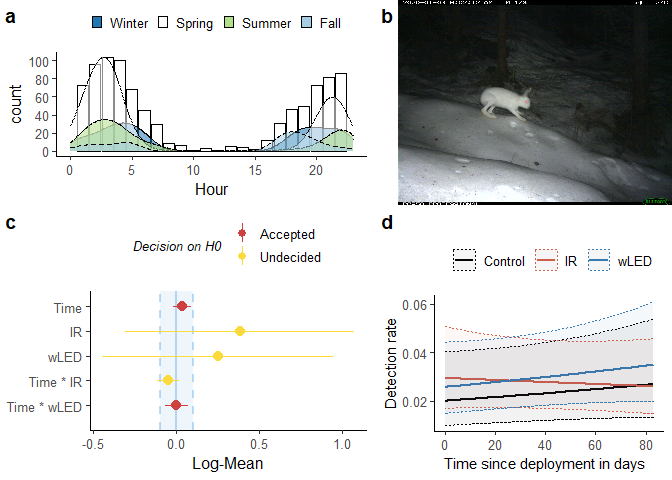<!-- -->

```r
       #  hjust = 1, halign = 1, valign = 0)
```


```r
# Model
m_hare    = m_sp
# ggpredict 
p_hare    = p_sp
# report-object
r_hare    = r_sp
# parameters refit
para_hare = para_sp
```


## Red squirrel


Now, sp contains ekorn.


```r
time_sp <- filter(time.dep4, species %in% sp) #.dep4 = trimmed data
# Model
m_sp  <- lme4::glmer(n.obs ~ time.deploy * flash + # fixed effects
            (1 | loc) + (1 | week), # random effects
            data   = time_sp,
            family = poisson,
            nAGQ = 0) # change optimizer to oenalized iteratively reweighted least squares step
# ggeffect calls effects::Effect
p_sp    <- ggeffects::ggeffect(m_sp, terms = c("time.deploy [all]", "flash"))
# Diagnostics
assumpt <- performance::check_model(m_sp) # check assumptions
va_r <- insight::get_variance(m_sp)
```

```
## Warning: mu of 0.0 is too close to zero, estimate of random effect variances may
## be unreliable.
```


```r
# Summary, report, model
summary(m_sp)
```

```
## Generalized linear mixed model fit by maximum likelihood (Adaptive
##   Gauss-Hermite Quadrature, nAGQ = 0) [glmerMod]
##  Family: poisson  ( log )
## Formula: n.obs ~ time.deploy * flash + (1 | loc) + (1 | week)
##    Data: time_sp
## 
##      AIC      BIC   logLik deviance df.resid 
##   2965.2   3026.2  -1474.6   2949.2    15241 
## 
## Scaled residuals: 
##     Min      1Q  Median      3Q     Max 
## -1.2422 -0.1461 -0.0804 -0.0448 24.4439 
## 
## Random effects:
##  Groups Name        Variance Std.Dev.
##  loc    (Intercept) 2.7175   1.6485  
##  week   (Intercept) 0.6661   0.8162  
## Number of obs: 15249, groups:  loc, 53; week, 52
## 
## Fixed effects:
##                       Estimate Std. Error z value Pr(>|z|)    
## (Intercept)           -5.41726    0.51635 -10.491  < 2e-16 ***
## time.deploy            0.08142    0.05059   1.609  0.10757    
## flashIR                0.82010    0.60332   1.359  0.17405    
## flashwLED              0.50022    0.60747   0.823  0.41026    
## time.deploy:flashIR   -0.17665    0.06337  -2.787  0.00531 ** 
## time.deploy:flashwLED -0.01604    0.06216  -0.258  0.79639    
## ---
## Signif. codes:  0 '***' 0.001 '**' 0.01 '*' 0.05 '.' 0.1 ' ' 1
## 
## Correlation of Fixed Effects:
##             (Intr) tm.dpl flshIR flsLED tm.:IR
## time.deploy -0.457                            
## flashIR     -0.801  0.371                     
## flashwLED   -0.788  0.355  0.925              
## tm.dply:fIR  0.339 -0.745 -0.435 -0.291       
## tm.dply:LED  0.326 -0.719 -0.307 -0.456  0.588
```

```r
r_sp <- report::report(m_sp) # text-summary of my model, to include in a report
para_sp  <- model_parameters(m_sp,   standardize = "refit") # model parameters
saveRDS(m_sp, file = paste0("m_",sp,".rds")) # save model objects as shortcut for when editing etc.
```

### Plot


```r
summary(r_sp)
```

```
## We fitted a poisson mixed model to predict n.obs with time.deploy and flash. The model included loc and week as random effects. The model's total explanatory power is substantial (conditional R2 = 0.41) and the part related to the fixed effects alone (marginal R2) is of 8.18e-03. The model's intercept is at -5.42 (95% CI [-6.43, -4.41]). Within this model:
## 
##   - The effect of time.deploy is non-significantly positive (beta = 0.08, 95% CI [-0.02, 0.18], p = 0.108, Std. beta = 0.19)
##   - The effect of flash [IR] is non-significantly positive (beta = 0.82, 95% CI [-0.36, 2.00], p = 0.174, Std. beta = 0.13)
##   - The effect of flash [wLED] is non-significantly positive (beta = 0.50, 95% CI [-0.69, 1.69], p = 0.410, Std. beta = 0.44)
##   - The interaction effect of flash [IR] on time.deploy is significantly negative (beta = -0.18, 95% CI [-0.30, -0.05], p < .01, Std. beta = -0.42)
##   - The interaction effect of flash [wLED] on time.deploy is non-significantly negative (beta = -0.02, 95% CI [-0.14, 0.11], p = 0.796, Std. beta = -0.04)
```

```r
as.report_table(r_sp)
```

```
## Parameter                  | Coefficient |         95% CI |      z |  df |      p | Std. Coef. | Std. Coef. 95% CI |      Fit
## -----------------------------------------------------------------------------------------------------------------------------
## (Intercept)                |       -5.42 | [-6.43, -4.41] | -10.49 | Inf | < .001 |      -5.10 |    [-6.00, -4.20] |         
## time.deploy                |        0.08 | [-0.02,  0.18] |   1.61 | Inf | 0.108  |       0.19 |    [-0.04,  0.43] |         
## flash [IR]                 |        0.82 | [-0.36,  2.00] |   1.36 | Inf | 0.174  |       0.13 |    [-0.93,  1.20] |         
## flash [wLED]               |        0.50 | [-0.69,  1.69] |   0.82 | Inf | 0.410  |       0.44 |    [-0.62,  1.50] |         
## time.deploy * flash [IR]   |       -0.18 | [-0.30, -0.05] |  -2.79 | Inf | 0.005  |      -0.42 |    [-0.71, -0.12] |         
## time.deploy * flash [wLED] |       -0.02 | [-0.14,  0.11] |  -0.26 | Inf | 0.796  |      -0.04 |    [-0.33,  0.25] |         
##                            |             |                |        |     |        |            |                   |         
## AIC                        |             |                |        |     |        |            |                   |  2965.19
## BIC                        |             |                |        |     |        |            |                   |  3026.25
## R2 (conditional)           |             |                |        |     |        |            |                   |     0.41
## R2 (marginal)              |             |                |        |     |        |            |                   | 8.18e-03
## Sigma                      |             |                |        |     |        |            |                   |     1.00
```

```r
library(cowplot) # to make grid-plots
library(magick)
# ggpredict
p_sp1 <- plot(p_sp, ci.style = c("dash"), line.size = 1, #ci.styles: “ribbon”, “errorbar”, “dash”, “dot”
               colors = c("black","#e41a1c","#377eb8")) +
   labs(title="", x="Time since deployment (per 10 days) \ ", y="Detection rate") +
   ggpubr::theme_classic2() +
  theme(legend.position = "top", legend.title = element_blank(),
        axis.title = element_text(size = 11)) 

# standardized plots aren't very different, other than on the scale
#plot(para_sp, size_text = 3) + labs(title = paste0(sp, " GLMM parameters") ,
#                                    subtitle = 'standardize  = "refit" ')

# Equivalence test
result <- equivalence_test(m_sp)
result
```

```
## # TOST-test for Practical Equivalence
## 
##   ROPE: [-0.10 0.10]
## 
##                   Parameter        H0 inside ROPE        90% CI
##                 (Intercept)  Rejected      0.00 % [-6.27 -4.57]
##                 time.deploy Undecided     61.17 % [-0.00  0.16]
##                  flash [IR] Undecided     10.08 % [-0.17  1.81]
##                flash [wLED] Undecided     10.01 % [-0.50  1.50]
##    time.deploy * flash [IR]  Rejected     13.23 % [-0.28 -0.07]
##  time.deploy * flash [wLED] Undecided     91.06 % [-0.12  0.09]
```

```r
# labels for equivalence test - prettier to the human eye
par_lab <- c("Time", "IR", "wLED", "Time * IR", "Time * wLED")
par_lab <- par_lab[5:1]
# Equivalence plot
p_eq <- plot(result) + labs(y = "Log-Mean") + 
    scale_x_discrete(labels = par_lab) + # new axis names
    theme(#legend.position = c(1, .5), legend.justification = c(1, 1),#legend placement
        legend.position = "top") +#,  
        # axis.text.y = element_text(vjust = -0.7, hjust = 0, # axis-text inside
        #                          margin = margin(l = 10, r = -55)),
        #   axis.ticks.length.y = unit(-1,"mm")) + # inward axis ticks
    guides(colour = guide_legend(nrow = 2, override.aes = list(size = .5),
                                 title.theme = element_text( 
                                   size=10, #adjusting legend appearance
                                   face="italic"))) 
```

```
## Scale for 'x' is already present. Adding another scale for 'x', which will
## replace the existing scale.
```

```r
# cowplot::plot_grid(NULL,NULL,p_dens,NULL,
#                    #nrow = 2,
#                    # rel_widths = c(3,4,6,1),
#                    # rel_heights = c(3,2),
#                    labels="auto",
#                    axis = "r"
# ) 


sp_file <- paste0("jpg/",sp,".JPG")
jpg <- ggdraw() + draw_image(sp_file, halign = 1)

p_grid <- cowplot::plot_grid(p_sp1,
                             p_eq,
                             p_dens,
                             jpg,
                   #nrow = 2,
                   rel_widths = c(3,4),
                   rel_heights = c(3,2),
                   labels="auto"
                   #align = "h"
) + labs(title = paste0(sp, " present at ",n_loc," sites."))
p_grid #+ draw_image(sp_file, scale = .4, x = 0.9,
```

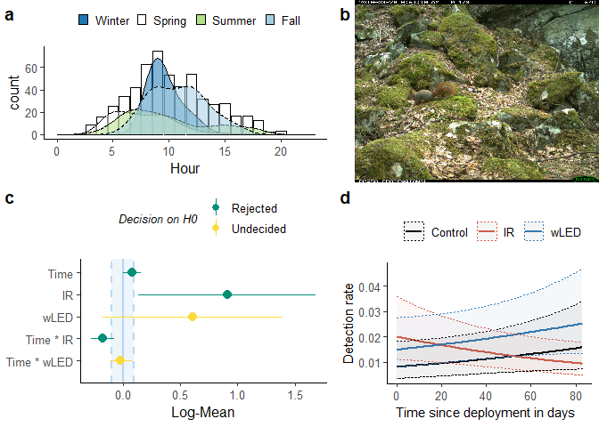<!-- -->

```r
       #  hjust = 1, halign = 1, valign = 0)
```


```r
# Model
m_ekorn    = m_sp
# ggpredict 
p_ekorn    = p_sp
# report-object
r_ekorn    = r_sp
# parameters refit
para_ekorn = para_sp
```


## European Pine marten


Now, sp contains maar.


```r
# sp ="raadyr"  #(shortcut for when editing)
# n locations that detected the species
n_loc <- time.dep4$loc[time.dep4$n.obs > 0 & time.dep4$species %in% sp] %>% unique()
# subsetting data for species, and the locations where it was detected
time_sp <- filter(time.dep4,       #.dep4 = trimmed data
                  species %in% sp, # filtering species
                  loc %in% n_loc)  # filtering locations
# Model
m_sp  <- lme4::glmer(n.obs ~ time.deploy * flash + # fixed effects
            (1 | loc) + (1 | week),                # random effects
            data   = time_sp,       # subset data
            family = poisson) # poisson family of distributions because of count data

# ggeffect calls effects::Effect - for plotting marginal effects 
p_sp    <- ggeffects::ggeffect(m_sp, terms = c("time.deploy [all]", "flash"))
# Diagnostics
assumpt <- performance::check_model(m_sp) # check assumptions
# va_r <- insight::get_variance(m_sp)
# Summary, report, model
summary(m_sp)
```

```
## Generalized linear mixed model fit by maximum likelihood (Laplace
##   Approximation) [glmerMod]
##  Family: poisson  ( log )
## Formula: n.obs ~ time.deploy * flash + (1 | loc) + (1 | week)
##    Data: time_sp
## 
##      AIC      BIC   logLik deviance df.resid 
##   1810.4   1869.5   -897.2   1794.4    12013 
## 
## Scaled residuals: 
##     Min      1Q  Median      3Q     Max 
## -0.6339 -0.1250 -0.0881 -0.0639 28.0161 
## 
## Random effects:
##  Groups Name        Variance Std.Dev.
##  week   (Intercept) 0.5191   0.7205  
##  loc    (Intercept) 0.5419   0.7361  
## Number of obs: 12021, groups:  week, 52; loc, 42
## 
## Fixed effects:
##                       Estimate Std. Error z value Pr(>|z|)    
## (Intercept)           -5.95070    0.54365 -10.946  < 2e-16 ***
## time.deploy            0.09221    0.09492   0.972  0.33130    
## flashIR                1.68930    0.57922   2.917  0.00354 ** 
## flashwLED              0.76081    0.60660   1.254  0.20976    
## time.deploy:flashIR   -0.11214    0.10513  -1.067  0.28612    
## time.deploy:flashwLED  0.03203    0.10845   0.295  0.76776    
## ---
## Signif. codes:  0 '***' 0.001 '**' 0.01 '*' 0.05 '.' 0.1 ' ' 1
## 
## Correlation of Fixed Effects:
##             (Intr) tm.dpl flshIR flsLED tm.:IR
## time.deploy -0.809                            
## flashIR     -0.860  0.731                     
## flashwLED   -0.821  0.700  0.842              
## tm.dply:fIR  0.684 -0.853 -0.799 -0.631       
## tm.dply:LED  0.666 -0.832 -0.639 -0.815  0.753
```

```r
r_sp <- report::report(m_sp) # text-summary of my model, to include in a report
para_sp  <- model_parameters(m_sp,   standardize = "refit") # model parameters
saveRDS(m_sp, file = paste0("m_",sp,".rds")) # save model objects as shortcut for when editing etc.
```

### Plot


```r
summary(r_sp)
```

```
## We fitted a poisson mixed model to predict n.obs with time.deploy and flash. The model included loc and week as random effects. The model's total explanatory power is moderate (conditional R2 = 0.22) and the part related to the fixed effects alone (marginal R2) is of 0.05. The model's intercept is at -5.95 (95% CI [-7.02, -4.89]). Within this model:
## 
##   - The effect of time.deploy is non-significantly positive (beta = 0.09, 95% CI [-0.09, 0.28], p = 0.331, Std. beta = 0.22)
##   - The effect of flash [IR] is significantly positive (beta = 1.69, 95% CI [0.55, 2.82], p < .01, Std. beta = 1.25)
##   - The effect of flash [wLED] is non-significantly positive (beta = 0.76, 95% CI [-0.43, 1.95], p = 0.210, Std. beta = 0.89)
##   - The interaction effect of flash [IR] on time.deploy is non-significantly negative (beta = -0.11, 95% CI [-0.32, 0.09], p = 0.286, Std. beta = -0.26)
##   - The interaction effect of flash [wLED] on time.deploy is non-significantly positive (beta = 0.03, 95% CI [-0.18, 0.24], p = 0.768, Std. beta = 0.08)
```

```r
as.report_table(r_sp)
```

```
## Parameter                  | Coefficient |         95% CI |      z |  df |      p | Std. Coef. | Std. Coef. 95% CI |     Fit
## ----------------------------------------------------------------------------------------------------------------------------
## (Intercept)                |       -5.95 | [-7.02, -4.89] | -10.95 | Inf | < .001 |      -5.59 |    [-6.23, -4.95] |        
## time.deploy                |        0.09 | [-0.09,  0.28] |   0.97 | Inf | 0.331  |       0.22 |    [-0.22,  0.66] |        
## flash [IR]                 |        1.69 | [ 0.55,  2.82] |   2.92 | Inf | 0.004  |       1.25 |    [ 0.56,  1.95] |        
## flash [wLED]               |        0.76 | [-0.43,  1.95] |   1.25 | Inf | 0.210  |       0.89 |    [ 0.18,  1.59] |        
## time.deploy * flash [IR]   |       -0.11 | [-0.32,  0.09] |  -1.07 | Inf | 0.286  |      -0.26 |    [-0.75,  0.22] |        
## time.deploy * flash [wLED] |        0.03 | [-0.18,  0.24] |   0.30 | Inf | 0.768  |       0.08 |    [-0.43,  0.58] |        
##                            |             |                |        |     |        |            |                   |        
## AIC                        |             |                |        |     |        |            |                   | 1810.36
## BIC                        |             |                |        |     |        |            |                   | 1869.51
## R2 (conditional)           |             |                |        |     |        |            |                   |    0.22
## R2 (marginal)              |             |                |        |     |        |            |                   |    0.05
## Sigma                      |             |                |        |     |        |            |                   |    1.00
```

```r
library(cowplot) # to make grid-plots
library(magick)
# ggpredict
p_sp1 <- plot(p_sp, ci.style = c("dash"), line.size = 1, #ci.styles: “ribbon”, “errorbar”, “dash”, “dot”
               colors = c("black","#e41a1c","#377eb8")) +
   labs(title="", x="Time since deployment (per 10 days) \ ", y="Detection rate") +
   ggpubr::theme_classic2() +
  theme(legend.position = "top", legend.title = element_blank(),
        axis.title = element_text(size = 11)) 

# standardized plots aren't very different, other than on the scale
#plot(para_sp, size_text = 3) + labs(title = paste0(sp, " GLMM parameters") ,
#                                    subtitle = 'standardize  = "refit" ')

# Equivalence test
result <- equivalence_test(m_sp)
result
```

```
## # TOST-test for Practical Equivalence
## 
##   ROPE: [-0.10 0.10]
## 
##                   Parameter        H0 inside ROPE        90% CI
##                 (Intercept)  Rejected      0.00 % [-6.84 -5.06]
##                 time.deploy Undecided     52.49 % [-0.06  0.25]
##                  flash [IR]  Rejected      0.00 % [ 0.74  2.64]
##                flash [wLED] Undecided     10.02 % [-0.24  1.76]
##    time.deploy * flash [IR] Undecided     46.49 % [-0.29  0.06]
##  time.deploy * flash [wLED] Undecided     56.06 % [-0.15  0.21]
```

```r
# labels for equivalence test - prettier to the human eye
par_lab <- c("Time", "IR", "wLED", "Time * IR", "Time * wLED")
par_lab <- par_lab[5:1]
# Equivalence plot
p_eq <- plot(result) + labs(y = "Log-Mean") + 
    scale_x_discrete(labels = par_lab) + # new axis names
    theme(#legend.position = c(1, .5), legend.justification = c(1, 1),#legend placement
        legend.position = "top") +#,  
        # axis.text.y = element_text(vjust = -0.7, hjust = 0, # axis-text inside
        #                          margin = margin(l = 10, r = -55)),
        #   axis.ticks.length.y = unit(-1,"mm")) + # inward axis ticks
    guides(colour = guide_legend(nrow = 2, override.aes = list(size = .5),
                                 title.theme = element_text( 
                                   size=10, #adjusting legend appearance
                                   face="italic"))) 
```

```
## Scale for 'x' is already present. Adding another scale for 'x', which will
## replace the existing scale.
```

```r
# cowplot::plot_grid(NULL,NULL,p_dens,NULL,
#                    #nrow = 2,
#                    # rel_widths = c(3,4,6,1),
#                    # rel_heights = c(3,2),
#                    labels="auto",
#                    axis = "r"
# ) 


sp_file <- paste0("jpg/",sp,".JPG")
jpg <- ggdraw() + draw_image(sp_file, halign = 1)

p_grid <- cowplot::plot_grid(p_sp1,
                             p_eq,
                             p_dens,
                             jpg,
                   #nrow = 2,
                   rel_widths = c(3,4),
                   rel_heights = c(3,2),
                   labels="auto"
                   #align = "h"
) + labs(title = paste0(sp, " present at ",n_loc," sites."))
p_grid #+ draw_image(sp_file, scale = .4, x = 0.9,
```

<!-- -->

```r
       #  hjust = 1, halign = 1, valign = 0)
```


```r
# Model
m_maar    = m_sp
# ggpredict 
p_maar    = p_sp
# report-object
r_maar    = r_sp
# parameters refit
para_maar = para_sp
```


----------------------------------------------

# All models


## Parameter-table

Making parameter-tables to include in my thesis. The first one contains standardized parameters, but since that differs from the format they are presented in the equivalence test, I will using the second one, which is not standardized


```r
library(xtable)  # To make a latex-table for the thesis
```

```
## 
## Attaching package: 'xtable'
```

```
## The following object is masked from 'package:parameters':
## 
##     display
```

```
## The following object is masked from 'package:performance':
## 
##     display
```

```r
para_raa  <- para_raa %>% 
  add_row(Parameter = "Roe deer", .before = 1) # adds a row for species name in the resulting table
para_rev  <- para_rev   %>% add_row(Parameter = "Red fox",  .before = 1)
para_grvl <- para_grvl  %>% add_row(Parameter = "Badger",   .before = 1)
para_elg  <- para_elg   %>% add_row(Parameter = "Moose",    .before = 1)
para_hjort<- para_hjort %>% add_row(Parameter = "Red deer", .before = 1)
para_gaup <- para_gaup  %>% add_row(Parameter = "Lynx",     .before = 1)
para_hare <- para_hare  %>% add_row(Parameter = "Hare",     .before = 1)
para_maar <- para_maar  %>% add_row(Parameter = "European Pine Marten", .before = 1)
para_ekorn<- para_ekorn %>% add_row(Parameter = "Red squirrel", .before = 1)

# bind tables together
para_all <- bind_rows(para_raa, para_rev, para_grvl,para_elg,para_hjort,para_gaup,para_hare,para_maar,para_ekorn) %>%
  insight::format_table(ci_brackets = c("(", ")")) %>% #prettier ci-brackets
  select(!df) # remove the df-column, containing "Inf" for every species

# save as latex-table in the Thesis folder
print(xtable(para_all, type = "latex"), include.rownames = F,
      file = "../Thesis/tex/tab/parameters.tex")
xtable(para_all) # output in Rmd
```

```
## % latex table generated in R 4.0.4 by xtable 1.8-4 package
## % Mon Mar 22 18:04:32 2021
## \begin{table}[ht]
## \centering
## \begin{tabular}{rllllll}
##   \hline
##  & Parameter & Coefficient & SE & 95\% CI & z & p \\ 
##   \hline
## 1 & Roe deer &  &  &  &  &        \\ 
##   2 & (Intercept) & -3.04 & 0.37 & (-3.76, -2.32) & -8.32 & $<$ .001 \\ 
##   3 & time.deploy & -0.12 & 0.05 & (-0.22, -0.02) & -2.24 & 0.025  \\ 
##   4 & flash [IR] & -0.18 & 0.43 & (-1.02,  0.66) & -0.42 & 0.674  \\ 
##   5 & flash [wLED] & -0.12 & 0.43 & (-0.96,  0.72) & -0.28 & 0.778  \\ 
##   6 & time.deploy * flash [IR] & 0.05 & 0.07 & (-0.08,  0.18) & 0.71 & 0.476  \\ 
##   7 & time.deploy * flash [wLED] & 7.96e-03 & 0.06 & (-0.12,  0.13) & 0.12 & 0.901  \\ 
##   8 & Red fox &  &  &  &  &        \\ 
##   9 & (Intercept) & 0.03 & 7.37e-03 & ( 0.02,  0.05) & -14.95 & $<$ .001 \\ 
##   10 & time.deploy & 1.00 & 0.07 & ( 0.88,  1.14) & -0.02 & 0.985  \\ 
##   11 & flashIR & 1.02 & 0.28 & ( 0.59,  1.76) & 0.07 & 0.942  \\ 
##   12 & flashLED & 1.14 & 0.32 & ( 0.66,  1.97) & 0.48 & 0.631  \\ 
##   13 & time.deploy:flashIR & 0.99 & 0.09 & ( 0.83,  1.18) & -0.06 & 0.949  \\ 
##   14 & time.deploy:flashLED & 0.97 & 0.09 & ( 0.82,  1.16) & -0.30 & 0.763  \\ 
##   15 & Badger &  &  &  &  &        \\ 
##   16 & (Intercept) & 0.01 & 3.90e-03 & ( 0.01,  0.02) & -12.45 & $<$ .001 \\ 
##   17 & time.deploy & 1.17 & 0.09 & ( 0.99,  1.37) & 1.90 & 0.058  \\ 
##   18 & flashIR & 1.34 & 0.51 & ( 0.64,  2.82) & 0.78 & 0.433  \\ 
##   19 & flashLED & 1.42 & 0.54 & ( 0.68,  2.97) & 0.93 & 0.352  \\ 
##   20 & time.deploy:flashIR & 1.02 & 0.10 & ( 0.84,  1.23) & 0.17 & 0.865  \\ 
##   21 & time.deploy:flashLED & 1.01 & 0.10 & ( 0.84,  1.22) & 0.10 & 0.922  \\ 
##   22 & Moose &  &  &  &  &        \\ 
##   23 & (Intercept) & 8.94e-03 & 2.95e-03 & ( 0.00,  0.02) & -14.31 & $<$ .001 \\ 
##   24 & time.deploy & 1.02 & 0.11 & ( 0.83,  1.26) & 0.21 & 0.830  \\ 
##   25 & flashIR & 1.15 & 0.43 & ( 0.55,  2.40) & 0.37 & 0.715  \\ 
##   26 & flashLED & 1.35 & 0.50 & ( 0.65,  2.80) & 0.79 & 0.427  \\ 
##   27 & time.deploy:flashIR & 1.11 & 0.15 & ( 0.85,  1.46) & 0.78 & 0.433  \\ 
##   28 & time.deploy:flashLED & 0.97 & 0.13 & ( 0.75,  1.27) & -0.19 & 0.849  \\ 
##   29 & Red deer &  &  &  &  &        \\ 
##   30 & (Intercept) & 1.73e-03 & 1.18e-03 & ( 0.00,  0.01) & -9.35 & $<$ .001 \\ 
##   31 & time.deploy & 0.80 & 0.12 & ( 0.60,  1.06) & -1.56 & 0.119  \\ 
##   32 & flashIR & 1.38 & 1.03 & ( 0.32,  6.01) & 0.43 & 0.671  \\ 
##   33 & flashLED & 1.34 & 1.01 & ( 0.31,  5.88) & 0.39 & 0.697  \\ 
##   34 & time.deploy:flashIR & 1.16 & 0.22 & ( 0.80,  1.69) & 0.80 & 0.424  \\ 
##   35 & time.deploy:flashLED & 1.72 & 0.33 & ( 1.18,  2.51) & 2.81 & 0.005  \\ 
##   36 & Lynx &  &  &  &  &        \\ 
##   37 & (Intercept) & 7.44e-04 & 4.45e-04 & ( 0.00,  0.00) & -12.03 & $<$ .001 \\ 
##   38 & time.deploy & 0.61 & 0.20 & ( 0.32,  1.15) & -1.52 & 0.128  \\ 
##   39 & flashIR & 1.56 & 1.03 & ( 0.43,  5.70) & 0.67 & 0.502  \\ 
##   40 & flashLED & 2.30 & 1.50 & ( 0.64,  8.26) & 1.28 & 0.202  \\ 
##   41 & time.deploy:flashIR & 1.76 & 0.68 & ( 0.83,  3.74) & 1.48 & 0.140  \\ 
##   42 & time.deploy:flashLED & 1.81 & 0.70 & ( 0.85,  3.84) & 1.54 & 0.124  \\ 
##   43 & Hare &  &  &  &  &        \\ 
##   44 & (Intercept) & 0.02 & 6.39e-03 & ( 0.01,  0.03) & -10.23 & $<$ .001 \\ 
##   45 & time.deploy & 1.09 & 0.08 & ( 0.94,  1.26) & 1.13 & 0.258  \\ 
##   46 & flashIR & 1.04 & 0.50 & ( 0.41,  2.65) & 0.08 & 0.933  \\ 
##   47 & flashLED & 1.12 & 0.53 & ( 0.44,  2.84) & 0.23 & 0.819  \\ 
##   48 & time.deploy:flashIR & 0.89 & 0.08 & ( 0.74,  1.07) & -1.28 & 0.199  \\ 
##   49 & time.deploy:flashLED & 1.00 & 0.10 & ( 0.83,  1.21) & 0.02 & 0.983  \\ 
##   50 & European Pine Marten &  &  &  &  &        \\ 
##   51 & (Intercept) & 2.45e-03 & 9.01e-04 & ( 0.00,  0.01) & -16.34 & $<$ .001 \\ 
##   52 & time.deploy & 1.25 & 0.28 & ( 0.81,  1.95) & 1.01 & 0.314  \\ 
##   53 & flashIR & 3.42 & 1.38 & ( 1.55,  7.53) & 3.06 & 0.002  \\ 
##   54 & flashLED & 2.35 & 0.96 & ( 1.05,  5.23) & 2.09 & 0.037  \\ 
##   55 & time.deploy:flashIR & 0.76 & 0.19 & ( 0.47,  1.24) & -1.08 & 0.280  \\ 
##   56 & time.deploy:flashLED & 1.06 & 0.27 & ( 0.64,  1.75) & 0.22 & 0.828  \\ 
##   57 & Red squirrel &  &  &  &  &        \\ 
##   58 & (Intercept) & 4.47e-03 & 2.78e-06 & ( 0.00,  0.00) & -8710.74 & $<$ .001 \\ 
##   59 & time.deploy & 1.22 & 7.55e-04 & ( 1.21,  1.22) & 314.46 & $<$ .001 \\ 
##   60 & flashIR & 1.17 & 7.24e-04 & ( 1.16,  1.17) & 247.49 & $<$ .001 \\ 
##   61 & flashLED & 1.58 & 9.84e-04 & ( 1.58,  1.59) & 740.62 & $<$ .001 \\ 
##   62 & time.deploy:flashIR & 0.66 & 4.07e-04 & ( 0.66,  0.66) & -679.35 & $<$ .001 \\ 
##   63 & time.deploy:flashLED & 0.96 & 5.96e-04 & ( 0.96,  0.96) & -65.39 & $<$ .001 \\ 
##    \hline
## \end{tabular}
## \end{table}
```


```r
library(xtable)  # To make a latex-table for the thesis
m_raa  <- readRDS("m_raadyr.rds")    
m_rev  <- readRDS("m_rev.rds") 
m_grvl <- readRDS("m_grevling.rds") 
m_elg  <- readRDS("m_elg.rds")
m_hjort<- readRDS("m_hjort.rds") 
m_gaup <- readRDS("m_gaupe.rds")
m_hare <- readRDS("m_hare.rds")
m_maar <- readRDS("m_maar.rds")
m_ekorn<- readRDS("m_ekorn.rds")
```


```r
# gather all models
m_all <- list(m_raa, m_rev ,m_grvl, m_hare, m_ekorn, m_elg, m_hjort, m_maar, m_gaup)
#sp <- c("raadyr", "rev", "grevling", "hare", "ekorn", "elg", "hjort", "maar", "gaupe")
# not standardized
para_all2 <- bind_rows(
model_parameters(m_raa)   %>% add_column(Species = c("Roe deer",            rep("",5)), .before = 1),
model_parameters(m_rev)   %>% add_column(Species = c("Red fox",             rep("",5)), .before = 1),
model_parameters(m_grvl)  %>% add_column(Species = c("Badger",              rep("",5)), .before = 1),
model_parameters(m_elg)   %>% add_column(Species = c("Moose",               rep("",5)), .before = 1),
model_parameters(m_hjort) %>% add_column(Species = c("Red deer",            rep("",5)), .before = 1),
model_parameters(m_gaup)  %>% add_column(Species = c("Lynx",                rep("",5)), .before = 1),
model_parameters(m_hare)  %>% add_column(Species = c("Hare",                rep("",5)), .before = 1),
model_parameters(m_maar)  %>% add_column(Species = c("European Pine Marten",rep("",5)), .before = 1),
model_parameters(m_ekorn) %>% add_column(Species = c("Red squirrel",        rep("",5)), .before = 1)
) %>% 
 insight::format_table(ci_brackets = c("(", ")")) %>% #prettier ci-brackets
  select(!df) # remove the df-column, containing "Inf" for every species
para_all2$Parameter <- rep(c("(Intercept)","TimeDeploy","IR","wLED", "TimeDeploy * IR", "TimeDeploy * wLED"), times=9)
# save as latex-table in the Thesis folder
print(xtable(para_all2, type = "latex"), include.rownames = F,
      file = "../Thesis/tex/tab/parameters2.tex")
```

## Joint forest-plots

Plots divided into size-based groups.
Unlikely to be included in the thesis.


```r
p_mds1<- sjPlot::plot_models(m_raa, m_rev, m_grvl, m_elg, m_hjort, spacing = .8,
                    legend.title = "Species",
                    m.labels = c("Roe deer","Red fox","Badger","Moose","Red deer"))
p_mds2 <- sjPlot::plot_models(m_hare, m_maar,m_ekorn,m_gaup, spacing = .8,
                    legend.title = "Species",
                    m.labels = c("Hare","Pine marten","Red squirrel","Lynx"))
```


## Model comparison-plots

Whichs species' detection rates was best explained by the my model formula?


```r
m_compare <- compare_performance(m_raa,m_rev,m_grvl,m_elg,m_hjort,
                                 m_gaup, m_hare, m_ekorn, m_maar,
            metrics = "common", rank=T) # "common" will compute AIC, BIC, R2, ICC and RMSE
```

```
## Warning: When comparing models, please note that probably not all models were
## fit from same data.
```

```r
m_compare
```

```
## # Comparison of Model Performance Indices
## 
## Name    |    Model |      AIC |      BIC | R2 (cond.) | R2 (marg.) |   ICC |  RMSE | Performance-Score
## ------------------------------------------------------------------------------------------------------
## m_gaup  | glmerMod |  745.849 |  806.907 |      0.369 |      0.028 | 0.350 | 0.065 |            80.16%
## m_hjort | glmerMod | 1821.564 | 1882.623 |      0.503 |      0.008 | 0.499 | 0.119 |            77.17%
## m_maar  | glmerMod | 1851.145 | 1912.203 |      0.277 |      0.046 | 0.242 | 0.122 |            68.23%
## m_ekorn | glmerMod | 2964.184 | 3025.242 |      0.421 |      0.008 | 0.416 | 0.159 |            61.61%
## m_elg   | glmerMod | 3024.207 | 3085.265 |      0.274 |      0.003 | 0.272 | 0.148 |            46.45%
## m_grvl  | glmerMod | 4756.822 | 4817.880 |      0.388 |      0.006 | 0.384 | 0.210 |            45.81%
## m_hare  | glmerMod | 4968.157 | 5029.215 |      0.370 |  9.358e-04 | 0.369 | 0.222 |            40.56%
## m_rev   | glmerMod | 5740.112 | 5801.171 |      0.146 |  6.490e-04 | 0.145 | 0.221 |            15.77%
## m_raa   | glmerMod | 7685.618 | 7745.758 |      0.293 |      0.002 | 0.291 | 0.319 |            14.30%
```

```r
m_compare %>% plot() #A `range` must be provided for data with only one observation.
```

<!-- -->

```r
# test_performance(m_raa,m_rev,m_grvl,m_elg,m_hjort,m_gaup) #models don't have the same response variable, 
# which is because they are different subsets of each other
```

## Model assumptions
The following section includes a lot of citing from other sources, mainly to help future me understand everything anew, and to get some pointers on where to read further.


```r
overd <- list()
zeroi <- list()
singu <- list()

for (i in 1:9) {
overd[[i]] <- check_overdispersion(m_all[[i]])
zeroi[[i]] <-  check_zeroinflation(m_all[[i]])
singu[[i]] <- check_singularity(m_all[[i]])
}

overd # No overdispersion detected
zeroi # Model seems ok, ratio of observed and predicted zeros is within the tolerance range.
singu %>% unique() # FALSE
#citation("performance")
performance::check_autocorrelation(m_raa)
```

Using the performance-package from easystats (Lüdecke, Makowski, Waggoner & Patil (2020)), no overdispersion was detected.
>Overdispersion occurs when the observed variance is higher than the variance of a theoretical model. For Poisson models, variance increases with the mean, thus, variance usually (roughly) equals the mean value. If the variance is much higher, the data are "overdispersed". (performance::check_singularity, R help file)

Dispersion ratios lied between 0.65 (squirrel) and 0.94 (pine marten).
>If the dispersion ratio is close to one, a Poisson model fits well to the data. Dispersion ratios larger than one indicate overdispersion, thus a negative binomial model or similar might fit better to the data. A p-value < .05 indicates overdispersion.

The R documentation also states that Poisson model's overdispersion test is based on the code from _Gelman and Hill (2007), page 115._ 
And that the function for mixed models only returns _approximate_ estimates, which is probably inaccurate for zer-inflated mixed models (fitted with glmmTMB). The documentations doesn't mention poisson mixed models specifically, but as no models were zero-inflated, I will assume the dispersion ratios are fine.

>If the amount of observed zeros is larger than the amount of predicted zeros, the model is underfitting zeros, which indicates a zero-inflation in the data. In such cases, it is recommended to use negative binomial or zero-inflated models. (performance::check_zeroinflation, R help file)

No models were zero-inflated, nor singular.
>If a model is "singular", this means that some dimensions of the variance-covariance matrix have been estimated as exactly zero. This often occurs for mixed models with complex random effects structures. (performance::check_singularity, R help file)

In other words, there weren't more zeros than predicted and my random effects structure wasn't overly complicated.


### Assumptions of Poisson regression 
(from https://www.statology.org/poisson-regression/, accessed 22.03.2021)

__Assumption 1:__ The response variable consists of count data. In traditional linear regression, the response variable consists of continuous data. To use Poisson regression, however, our response variable needs to consists of count data that include integers of 0 or greater (e.g. 0, 1, 2, 14, 34, 49, 200, etc.). Our response variable cannot contain negative values.

__Assumption 2:__ Observations are independent. Each observation in the dataset should be independent of one another. This means that one observation should not be able to provide any information about a different observation.

__Assumption 3:__ The distribution of counts follows a Poisson distribution. As a result, the observed and expected counts should be similar. One simple way to test for this is to plot the expected and observed counts and see if they are similar.

__Assumption 4:__ The mean and variance of the model are equal. This is a result of the assumption that the distribution of counts follows a Poisson distribution. For a Poisson distribution the variance has the same value as the mean. If this assumption is satisfied, then you have equidispersion. However, this assumption is often violated as overdispersion is a common problem.


--------------------------------------------


### Blueprint for other species in chunk below:

<!---->


```r
# sp ="raadyr"  #(shortcut for when editing)
# n locations that detected the species
n_loc <- time.dep4$loc[time.dep4$n.obs > 0 & time.dep4$species %in% sp] %>% unique()
# subsetting data for species, and the locations where it was detected
time_sp <- filter(time.dep4,       #.dep4 = trimmed data
                  species %in% sp, # filtering species
                  loc %in% n_loc)  # filtering locations
# Model
m_sp  <- lme4::glmer(n.obs ~ time.deploy * flash + # fixed effects
            (1 | loc) + (1 | week),                # random effects
            data   = time_sp,       # subset data
            family = poisson) # poisson family of distributions because of count data

# ggeffect calls effects::Effect - for plotting marginal effects 
p_sp    <- ggeffects::ggeffect(m_sp, terms = c("time.deploy [all]", "flash"))
# Diagnostics
assumpt <- performance::check_model(m_sp) # check assumptions
# va_r <- insight::get_variance(m_sp)
# Summary, report, model
summary(m_sp)
r_sp <- report::report(m_sp) # text-summary of my model, to include in a report
para_sp  <- model_parameters(m_sp,   standardize = "refit") # model parameters
saveRDS(m_sp, file = paste0("m_",sp,".rds")) # save model objects as shortcut for when editing etc.
```

```r
summary(r_sp)
as.report_table(r_sp)
library(cowplot) # to make grid-plots
library(magick)
# ggpredict
p_sp1 <- plot(p_sp, ci.style = c("dash"), line.size = 1, #ci.styles: “ribbon”, “errorbar”, “dash”, “dot”
               colors = c("black","#e41a1c","#377eb8")) +
   labs(title="", x="Time since deployment (per 10 days) \ ", y="Detection rate") +
   ggpubr::theme_classic2() +
  theme(legend.position = "top", legend.title = element_blank(),
        axis.title = element_text(size = 11)) 

# standardized plots aren't very different, other than on the scale
#plot(para_sp, size_text = 3) + labs(title = paste0(sp, " GLMM parameters") ,
#                                    subtitle = 'standardize  = "refit" ')

# Equivalence test
result <- equivalence_test(m_sp)
result

# labels for equivalence test - prettier to the human eye
par_lab <- c("Time", "IR", "wLED", "Time * IR", "Time * wLED")
par_lab <- par_lab[5:1]
# Equivalence plot
p_eq <- plot(result) + labs(y = "Log-Mean") + 
    scale_x_discrete(labels = par_lab) + # new axis names
    theme(#legend.position = c(1, .5), legend.justification = c(1, 1),#legend placement
        legend.position = "top") +#,  
        # axis.text.y = element_text(vjust = -0.7, hjust = 0, # axis-text inside
        #                          margin = margin(l = 10, r = -55)),
        #   axis.ticks.length.y = unit(-1,"mm")) + # inward axis ticks
    guides(colour = guide_legend(nrow = 2, override.aes = list(size = .5),
                                 title.theme = element_text( 
                                   size=10, #adjusting legend appearance
                                   face="italic"))) 


# cowplot::plot_grid(NULL,NULL,p_dens,NULL,
#                    #nrow = 2,
#                    # rel_widths = c(3,4,6,1),
#                    # rel_heights = c(3,2),
#                    labels="auto",
#                    axis = "r"
# ) 


sp_file <- paste0("jpg/",sp,".JPG")
jpg <- ggdraw() + draw_image(sp_file, halign = 1)

p_grid <- cowplot::plot_grid(p_sp1,
                             p_eq,
                             p_dens,
                             jpg,
                   #nrow = 2,
                   rel_widths = c(3,4),
                   rel_heights = c(3,2),
                   labels="auto"
                   #align = "h"
) + labs(title = paste0(sp, " present at ",n_loc," sites."))
p_grid #+ draw_image(sp_file, scale = .4, x = 0.9,
       #  hjust = 1, halign = 1, valign = 0)
```


```r
# Model
m_xx    = m_sp
# ggpredict 
p_xx    = p_sp
# report-object
r_xx    = r_sp
# parameters refit
para_xx = para_sp
```


----------------------------------------------

# SessionInfo


```r
sessionInfo()
```

```
## R version 4.0.4 (2021-02-15)
## Platform: x86_64-w64-mingw32/x64 (64-bit)
## Running under: Windows 10 x64 (build 19041)
## 
## Matrix products: default
## 
## locale:
## [1] LC_COLLATE=Norwegian Bokmål_Norway.1252 
## [2] LC_CTYPE=Norwegian Bokmål_Norway.1252   
## [3] LC_MONETARY=Norwegian Bokmål_Norway.1252
## [4] LC_NUMERIC=C                            
## [5] LC_TIME=Norwegian Bokmål_Norway.1252    
## 
## attached base packages:
## [1] stats     graphics  grDevices utils     datasets  methods   base     
## 
## other attached packages:
##  [1] xtable_1.8-4        magick_2.7.0        see_0.6.2.1        
##  [4] sjPlot_2.8.7        parameters_0.12.0.1 ggeffects_1.0.1    
##  [7] report_0.2.0        performance_0.7.0.1 cowplot_1.1.1      
## [10] lme4_1.1-26         Matrix_1.3-2        forcats_0.5.1      
## [13] stringr_1.4.0       dplyr_1.0.5         purrr_0.3.4        
## [16] readr_1.4.0         tidyr_1.1.3         tibble_3.1.0       
## [19] ggplot2_3.3.3       tidyverse_1.3.0    
## 
## loaded via a namespace (and not attached):
##  [1] minqa_1.2.4        colorspace_2.0-0   ggsignif_0.6.1     ellipsis_0.3.1    
##  [5] rio_0.5.26         ggridges_0.5.3     sjlabelled_1.1.7   estimability_1.3  
##  [9] fs_1.5.0           rstudioapi_0.13    ggpubr_0.4.0       farver_2.1.0      
## [13] fansi_0.4.2        mvtnorm_1.1-1      lubridate_1.7.10   xml2_1.3.2        
## [17] codetools_0.2-18   splines_4.0.4      knitr_1.31         sjmisc_2.8.6      
## [21] effects_4.2-0      jsonlite_1.7.2     nloptr_1.2.2.2     broom_0.7.5       
## [25] dbplyr_2.1.0       effectsize_0.4.3-1 compiler_4.0.4     httr_1.4.2        
## [29] sjstats_0.18.1     emmeans_1.5.4      backports_1.2.1    assertthat_0.2.1  
## [33] survey_4.0         cli_2.3.1          htmltools_0.5.1.1  tools_4.0.4       
## [37] coda_0.19-4        gtable_0.3.0       glue_1.4.2         reshape2_1.4.4    
## [41] Rcpp_1.0.6         carData_3.0-4      cellranger_1.1.0   jquerylib_0.1.3   
## [45] vctrs_0.3.6        nlme_3.1-152       insight_0.13.1.1   xfun_0.22         
## [49] openxlsx_4.2.3     rvest_1.0.0        lifecycle_1.0.0    statmod_1.4.35    
## [53] rstatix_0.7.0      MASS_7.3-53.1      scales_1.1.1       hms_1.0.0         
## [57] RColorBrewer_1.1-2 yaml_2.2.1         curl_4.3           sass_0.3.1        
## [61] stringi_1.5.3      highr_0.8          bayestestR_0.8.3.1 boot_1.3-27       
## [65] zip_2.1.1          rlang_0.4.10       pkgconfig_2.0.3    evaluate_0.14     
## [69] lattice_0.20-41    labeling_0.4.2     tidyselect_1.1.0   plyr_1.8.6        
## [73] magrittr_2.0.1     R6_2.5.0           generics_0.1.0     DBI_1.1.1         
## [77] pillar_1.5.1       haven_2.3.1        foreign_0.8-81     withr_2.4.1       
## [81] survival_3.2-7     abind_1.4-5        nnet_7.3-15        modelr_0.1.8      
## [85] crayon_1.4.1       car_3.0-10         utf8_1.1.4         rmarkdown_2.7.3   
## [89] grid_4.0.4         readxl_1.3.1       data.table_1.14.0  reprex_1.0.0      
## [93] digest_0.6.27      munsell_0.5.0      bslib_0.2.4.9002   mitools_2.4
```

```r
report_parameters(sessionInfo()) # output to include in Appendix
```

```
##   - cowplot (version 1.1.1; Claus Wilke, 2020)
##   - xtable (version 1.8.4; David Dahl et al., 2019)
##   - Matrix (version 1.3.2; Douglas Bates and Martin Maechler, 2021)
##   - lme4 (version 1.1.26; Douglas Bates et al., 2015)
##   - ggplot2 (version 3.3.3; Wickham. ggplot2: Elegant Graphics for Data Analysis. Springer-Verlag New York, 2016.)
##   - stringr (version 1.4.0; Hadley Wickham, 2019)
##   - forcats (version 0.5.1; Hadley Wickham, 2021)
##   - tidyr (version 1.1.3; Hadley Wickham, 2021)
##   - readr (version 1.4.0; Hadley Wickham and Jim Hester, 2020)
##   - dplyr (version 1.0.5; Hadley Wickham et al., 2021)
##   - magick (version 2.7.0; Jeroen Ooms, 2021)
##   - tibble (version 3.1.0; Kirill Müller and Hadley Wickham, 2021)
##   - purrr (version 0.3.4; Lionel Henry and Hadley Wickham, 2020)
##   - ggeffects (version 1.0.1; Lüdecke D, 2018)
##   - sjPlot (version 2.8.7; Lüdecke D, 2021)
##   - parameters (version 0.12.0.1; Lüdecke D et al., 2020)
##   - see (version 0.6.2.1; Lüdecke et al., 2020)
##   - performance (version 0.7.0.1; Lüdecke et al., 2020)
##   - report (version 0.2.0; Makowski et al., 2020)
##   - R (version 4.0.4; R Core Team, 2021)
##   - tidyverse (version 1.3.0; Wickham et al., 2019)
```

