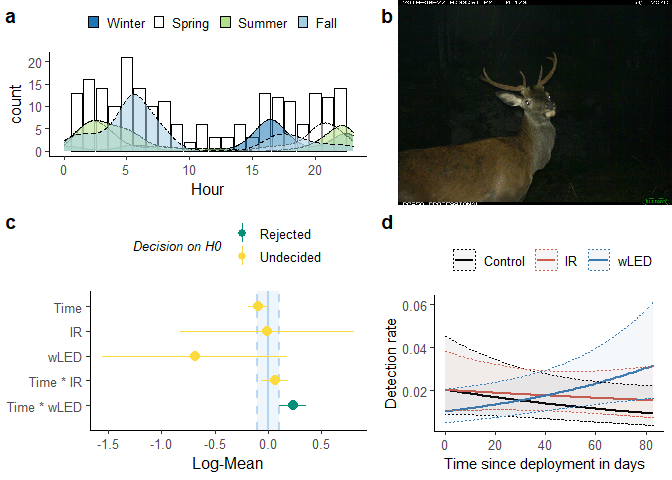
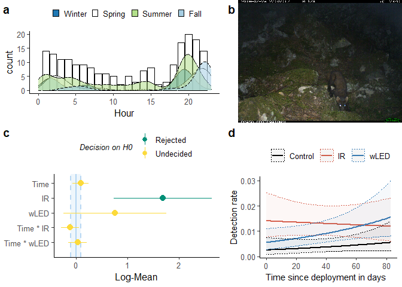

```r
library(tidyverse)
```

```
## -- Attaching packages --------------------------------------- tidyverse 1.3.0 --
```

```
## v ggplot2 3.3.3     v purrr   0.3.4
## v tibble  3.1.0     v dplyr   1.0.5
## v tidyr   1.1.3     v stringr 1.4.0
## v readr   1.4.0     v forcats 0.5.1
```

```
## -- Conflicts ------------------------------------------ tidyverse_conflicts() --
## x dplyr::filter() masks stats::filter()
## x dplyr::lag()    masks stats::lag()
```

```r
library(lme4)
```

```
## Loading required package: Matrix
```

```
## 
## Attaching package: 'Matrix'
```

```
## The following objects are masked from 'package:tidyr':
## 
##     expand, pack, unpack
```

```r
library(performance) # diagnostic-plots to check assumptions
library(report)      # Result-summaries in text-format
```

```
## report is in alpha - help us improve by reporting bugs on github.com/easystats/report/issues
```

```r
library(ggeffects)   # Estimated Marginal Means and Marginal Effects from Regression Models
                          # more at: https://strengejacke.github.io/ggeffects/
library(parameters)  # extract model-parameters etc. from (most) models
library(sjPlot)      # parameters + sjPlot probably does a similar and better job than ggeffects
```

```
## Learn more about sjPlot with 'browseVignettes("sjPlot")'.
```

```r
library(see)         # plot-related package from the easystats-verse

# Data drom Data_exploration2_nesting.R
time.dep <- readRDS("timedep.rds")

ctrl <- c("Control_1", "Control_2", "Control_3","Control_4")
obs      <- readRDS("Observations_prepared1.rds") %>% 
  mutate(flash = ifelse(period %in% ctrl, "Control",flash))
obs <- obs %>% 
  mutate(species = validated_species,
         Hour = as.numeric(format(obs$datetime, "%H")), # for density-plots
         flash = factor(obs$flash, labels = c("IR", "LED","Control"))) # --||--
# Set global plot theme
theme_set(ggpubr::theme_classic2())
```

```
## Registered S3 methods overwritten by 'car':
##   method                          from
##   influence.merMod                lme4
##   cooks.distance.influence.merMod lme4
##   dfbeta.influence.merMod         lme4
##   dfbetas.influence.merMod        lme4
```

## Purpose

Remaking glmm_sp in a modular fashion, so that changes in the script of one model affects all the rest.

# About the model

### Why GLMM?

Response from a [stackexchange question](https://stats.stackexchange.com/questions/226946/r-lmer-vs-glmer)
about the differences of `lmer` and `glmer`-functions:

>lmer is used to fit linear mixed-effect models, so it assumes that the residual error has a Gaussian distribution. If your dependent variable A is a binary outcome (e.g. a yes/no response), then the error distribution is binomial and not Gaussian. In this case you have to use glmer, which allow to fit a generalized linear mixed-effects model: these models include a link function that allows to predict response variables with non-Gaussian distributions. One example of link function that could work in your case is the logistic function, which takes an input with any value from negative to positive infinity and return an output that always takes values between zero and one, which is interpretable as the probability of the binary outcome (e.g. the probability of the subject responding 'yes').


### Formula
The model formula I will use is $n \sim \ time.deploy\ * flash $ for each species, and my $\alpha = 0.05$.


```r
sp <- c("raadyr", "rev", "hjort", "grevling", "elg", "gaupe", "ekorn", "hare", "maar")
ctrl <- c("Control_1", "Control_2", "Control_3","Control_4")
time.dep2 <- time.dep %>% 
  rename(species = validated_species) %>%  #shortening name
#  filter(species %in% sp) %>% #filtering out species
  # including Control as part of the flash-column, since it differs from flash=0
  mutate(flash = factor(
        ifelse(period %in% ctrl, "Control", flash)),
        week = lubridate::isoweek(date),
        period = factor(period))
time.dep2 <- time.dep2 %>% 
   mutate(flash = fct_relevel(flash, "Control","0","1")) # relevel to make Control the model intercept
levels(time.dep2$flash) <- c("Control", "IR", "LED")
levels(time.dep2$period) <- c("IR_1", "IR_2", "LED_1", "LED_2", "Control_1", "Control_2", "Control_3", "Control_4")
```

Not all periods have identical length. Hence, I need to set a maximum length for my period durations. As proposed by Neri, I will calculate the median for white LED-periods and IR-periods, and use the smallest median to shorten all periods overextending that value.

First I'll filter out any periods shorter than 4 days ( _as of 18.02.2021, only 1 period_ ). 
Then I'll cut the duration of all periods overextending the smallest median.


```r
# find median period length
time.period <- time.dep2 %>% group_by(loc, period, flash) %>% 
  summarise(period_length = max(time.deploy))

# checking shortest periods
time.period %>% arrange(period_length) # 1 period (LED) is 0 days
```

```
## # A tibble: 211 x 4
## # Groups:   loc, period [211]
##    loc   period    flash   period_length
##    <fct> <fct>     <fct>           <dbl>
##  1 829   LED_1     LED               0  
##  2 925   LED_1     LED               0.8
##  3 850   LED_2     LED               0.9
##  4 664   Control_2 Control           1.1
##  5 829   IR_2      IR                1.2
##  6 855   Control_3 Control           1.8
##  7 840   IR_1      IR                2.6
##  8 953   LED_2     LED               2.6
##  9 258   Control_1 Control           2.7
## 10 942   IR_1      IR                2.7
## # ... with 201 more rows
```

```r
# then merge lengths and filter out period of 0 days
time.dep3 <- time.dep2 %>% left_join(time.period) %>% 
  filter(period_length > 0)

# find median length 
time.period %>% filter(flash == "LED") %>%  
  summary() # median period length 85 days, mean: 84
```

```
##       loc           period       flash    period_length   
##  15     : 2   LED_1    :37   Control: 0   Min.   : 0.000  
##  127    : 2   LED_2    :32   IR     : 0   1st Qu.: 6.500  
##  193    : 2   IR_1     : 0   LED    :69   Median : 8.450  
##  231    : 2   IR_2     : 0                Mean   : 8.285  
##  257    : 2   Control_1: 0                3rd Qu.:11.000  
##  455    : 2   Control_2: 0                Max.   :13.200  
##  (Other):57   (Other)  : 0                NA's   :1
```

```r
time.period %>% filter(flash == "IR") %>%  
  summary() # median period length 79 days, mean: 89
```

```
##       loc           period       flash    period_length   
##  15     : 2   IR_1     :35   Control: 0   Min.   : 1.200  
##  127    : 2   IR_2     :35   IR     :70   1st Qu.: 6.600  
##  193    : 2   LED_1    : 0   LED    : 0   Median : 8.400  
##  231    : 2   LED_2    : 0                Mean   : 9.423  
##  257    : 2   Control_1: 0                3rd Qu.:12.500  
##  455    : 2   Control_2: 0                Max.   :19.600  
##  (Other):58   (Other)  : 0                NA's   :1
```

```r
# extract lengths of each unique period
h <- time.dep3 %>% group_by(loc, period, period_length, flash)%>% nest() %>% 
  select(!data) 
#extracting median and multiplying by 10, to use in the correctly scaled plot
hh <-       h$period_length[h$flash == "LED"] %>%  median()       # median white LED
hh <- c(hh, h$period_length[h$flash == "IR" ] %>%  median()) * 10 # + median IR
# smallest median 
h <- min(hh)
```


With the updated dataset, the IR median has shifted to 84 days, white LED to 85. 84 is the new trimming value.


```r
# plot periods with median as intercept
p_td <- time.dep3 %>% filter(!period %in% ctrl) %>% 
  ggplot(aes(loc, 10*time.deploy, colour = period, ))  +
  geom_line(aes(linetype = flash),position = position_dodge(width = 1), lineend = "square") +
  coord_flip() + 
  labs(title = "Period lengths per camera",
       x = "Location", y = "Time since deployment",
       caption = "Vertical lines reprecent median period lengths for IR and white LED.\n Data superceding that were trimmed away for the GLMM-modelling.") 
  #ggpubr::theme_classic2() #+ theme(legend.position = "right") find way to set legend inside
p_td + geom_hline(aes(yintercept = h), linetype = "dashed",  alpha =.5) +
  geom_hline(aes(yintercept = max(hh)), linetype = "dashed",  alpha =.5) +
  #annotate(geom = "text",x=4, y=h+8.6, label = "- median", size = 3, alpha =.7) +
  scale_y_continuous(breaks = sort(c(0, 50, h, 100, 150))) +
  scale_color_brewer(palette = "Spectral")
```

<!-- -->

```r
# failed attempts that could inspire a better plot later
# p_td + geom_hline(aes(yintercept = h))+ # using median days as intercept 
#        scale_y_continuous(breaks = sort(c(ggplot_build(p_td)$layout$panel_ranges[[1]]$y.major_source, h)))
# geom_text(aes(25, h, label = "median", vjust = -1), nudge_y = 10, show.legend = F)
```

There was an overweight of IR-periods extending past the median line.


```r
# remake plot with Control-group data, faceted
p_td2 <- time.dep3 %>% 
  ggplot(aes(loc, 10*time.deploy, col = period))  +
  geom_line(aes(linetype = period),
    position = position_dodge(width = 1), lineend = "square") +
  coord_flip() +  
  geom_hline(aes(yintercept = h), linetype = "dashed",  alpha =.5) +
  scale_y_continuous(breaks = sort(c(0, 50, h, 100, 150, 200))) +
  facet_grid(rows = "flash", scales = "free_y") +
  labs(#title = "Period lengths per camera",
       x = "Location", y = "Time since deployment") # 
  

p_td2 + #ggpubr::theme_classic2() +
  theme(legend.position = "none", axis.text.y = element_blank(), axis.ticks.y = element_blank()) +
        scale_linetype_manual(values = rep(c("solid","solid"), 4) ) + #option to change to solid,dashed
        scale_color_manual(values = c(rep(c("#74add1","#4575b4"), each = 2), # trt-colr
                                      rep(c("#f46d43","#fdae61"),each = 2) ) )  #ctrl-colr
```

<!-- -->

```r
  #labs(caption = "Vertical line represents the median IR period length. \n Data superceding that were trimmed away for the GLMM")
```


_Lastly, performing the filter:_

```r
# filtering out periods longer than (shortest) median length.
time.dep4 <- time.dep3 %>% filter(time.deploy < h/10) # h is normal scale, must be rescaled by /10
time.dep5 <- time.dep4 %>% mutate(time.deploy = time.deploy / 1.4) # scaled by 2 weeks (84=6*14(2w))

time.dep4$loc %>% unique() %>% is.na() %>% any() # no NAs in loc
```

```
## [1] FALSE
```

```r
summary(time.dep4) #            
```

```
##       loc              date              species              flash       
##  494    : 10050   Min.   :2019-01-15   Length:457470      Control:157770  
##  818    : 10050   1st Qu.:2019-04-25   Class :character   IR     :153360  
##  830    : 10050   Median :2019-07-29   Mode  :character   LED    :146340  
##  861    : 10050   Mean   :2019-07-22                                      
##  863    : 10050   3rd Qu.:2019-10-14                                      
##  864    : 10050   Max.   :2020-02-26                                      
##  (Other):397170                                                           
##        period       time.deploy        n.obs              month       
##  IR_2     :80160   Min.   :0.000   Min.   : 0.00000   08     : 45780  
##  LED_1    :77040   1st Qu.:1.800   1st Qu.: 0.00000   09     : 44460  
##  IR_1     :73200   Median :3.800   Median : 0.00000   06     : 43440  
##  LED_2    :69300   Mean   :3.881   Mean   : 0.03715   03     : 42780  
##  Control_4:40500   3rd Qu.:5.900   3rd Qu.: 0.00000   07     : 41850  
##  Control_3:39270   Max.   :8.300   Max.   :25.00000   10     : 41460  
##  (Other)  :78000                                      (Other):197700  
##       week       period_length   
##  Min.   : 1.00   Min.   : 0.800  
##  1st Qu.:14.00   1st Qu.: 7.900  
##  Median :29.00   Median : 8.900  
##  Mean   :27.89   Mean   : 9.463  
##  3rd Qu.:40.00   3rd Qu.:11.800  
##  Max.   :52.00   Max.   :19.600  
## 
```


# Modelling


## Roe deer


```r
# sp ="raadyr"
# time_sp <- filter(time.dep4, species %in% sp) #.dep4 = trimmed data
time_sp <- filter(time.dep5, species %in% sp) #.dep5 = fully scaled time.deploy
# Model
m_sp  <- lme4::glmer(n.obs ~ time.deploy * flash + # fixed effects
            (1 | loc) + (1 | week), # random effects
            data   = time_sp,
            family = poisson) # poisson family of distributions
# ggpredict is similar to expand.grid
p_sp    <- ggeffects::ggeffect(m_sp, terms = c("time.deploy [all]", "flash"))
# Diagnostics
assumpt <- performance::check_model(m_sp) # check assumptions
```


The response variable is a summary of number of events per day. Most days had no roe deer.
In the performance-test for model assumptions _it is clear that some assumptions aren't met._

#### Negative
In the non-normality of resiudals-plot, the residuals skew off from the line when moving towards positive quantiles.
There is _not_ a homogeneity of variance. _Maybe this could be fixed by centering the n.obs-column?_

There appeares to be five influential observations in the Cook's distance-plot, maybe more, as the warning from ggrepel refers to 93 unlabeled data points due to overlaps.

#### Positive
Although the model has an interaction term between flash and time since deployment, the multicollinearity between them is low!
My random effects follows a normal distribution.

#### Concluding
I am not sure about how to make up for breaking these assumptions. For now, I will go on completing models for the rest of the species.


```r
# Summary, report, model
summary(m_sp)
r_sp <- report::report(m_sp) # text-summary of my model, to include in a report
para_sp  <- model_parameters(m_sp,   standardize = "refit", two_sd = TRUE, exponentiate = TRUE)
saveRDS(m_sp, file = paste0("m_",sp,".rds"))
```

### Model interpretation
The intercept-value is considered significantly negative, which is to say that there were a low chance of detecting any roe deer at an IR-camera the same day I visited the camera.

> I saw a roe deer about to walk by a CT when I came to inspect it. The roe deer saw me and fled, right before it was detected by the camera. Chances are I've scared animals other times as well, but haven't noticed it.

The effect of _Time since deployment_ is non-significant, and $\beta = 0.008$.
That means there is no difference on the baseline detection rate for an IR camera over time (after controlling for seasonal changes). 

For white LED flash  $\beta = 0.170$, meaning that the intercept is slightly higher than for IR, but the difference is non-significant ($p = 0.18$).
However, the detection rate is slightly decreasing the longer the white LED stays, which differs from the IR, _
but the effect is non-significant_ ($p = 0.23$).

#### Hypothesising
If there truly is an effect of the white LED for long periods on the detection rate of roe deer, this effect could in turn account for the different intercept values of IR and flash, as the IR periods often start after a flash period.

Remembering my study design, 20 cameras start with white LED, 20 with IR. _Intercept should be equal_ (1st period).
2nd period; white LED moved, new LED CTs (same intercept), new IR CTs (hypothetical lower intercept due to flash effect).
3rd period; white LED moved, new LED CTs (IR intercept), new IR CTs (hypothetical lower intercept).
4th period;  - -  ||  - -  , new LED CTs (- - | | - - ), new IR CTs (   -  -  |  |  -  -  ).

Which sums up to 3 IR periods where detection rates could start lower than that of white LED. And over time the lack of white LED flash in the new IR sites would account for an _increase_ in detection rates.

The effect would of course vary because some locations experienced _gaps_ due to full SD cards or empty batteries.
<!--_Maybe, after my thesis, I could try to pry out these differences-->

-------------------------------------

#### Update!

After uptaded data from Neri; the effect of flash is now deemed significant!
Still the same pattern with higher intercept and a negative slope along the time axis, which further supports my hypothesising above.
The interaction with time since deployment is, however, still non-significant.
_Now I want to look at a model including the Control-group._


```r
# sp ="raadyr"
# time_sp <- filter(time.dep4, species %in% sp) #.dep4 = trimmed data
time_sp <- filter(time.dep5, species %in% sp) #.dep5 = fully scaled time.deploy
# Model
m_sp  <- lme4::glmer(n.obs ~ time.deploy * flash + # fixed effects
            (1 | loc) + (1 | week), # random effects
            data   = time_sp,
            family = poisson) # poisson family of distributions
# ggpredict is similar to expand.grid
p_sp    <- ggeffects::ggeffect(m_sp, terms = c("time.deploy [all]", "flash"))
# Diagnostics
assumpt <- performance::check_model(m_sp) # check assumptions
```


There are a couple of extreme counts in the Control-group, even after having filtered away all observations with less than a 15 min interval for each species (ie. setting 15 min margin as definition of an event). These extreme counts are skewed to the left which probably will affect the intercept of control quite a bit, but probably won't deem the intercept-value as significant (as these extreme values are outliers).

The homogeneity of variance is still off. It deems on me more and more that this is due to these extreme count-values that is close to time.deploy = 0. _Will it disappear if I divide by the standard deviation?_

The multicollinearity is moderate for the interaction term of time.deploy and flash when the control group is included. Still, the change is small (in my layman eyes), with a increase in bar height from ~ 4 to ~ 6.


```r
# Summary, report, model
summary(m_sp)
```

```
## Generalized linear mixed model fit by maximum likelihood (Laplace
##   Approximation) [glmerMod]
##  Family: poisson  ( log )
## Formula: n.obs ~ time.deploy * flash + (1 | loc) + (1 | week)
##    Data: time_sp
## 
##      AIC      BIC   logLik deviance df.resid 
##   7720.5   7781.6  -3852.3   7704.5    15241 
## 
## Scaled residuals: 
##     Min      1Q  Median      3Q     Max 
## -1.1449 -0.2822 -0.1668 -0.0740 15.6129 
## 
## Random effects:
##  Groups Name        Variance Std.Dev.
##  loc    (Intercept) 2.6233   1.6197  
##  week   (Intercept) 0.3125   0.5591  
## Number of obs: 15249, groups:  loc, 53; week, 52
## 
## Fixed effects:
##                       Estimate Std. Error z value Pr(>|z|)    
## (Intercept)          -3.467218   0.430585  -8.052 8.12e-16 ***
## time.deploy          -0.069660   0.031391  -2.219   0.0265 *  
## flashIR               0.079971   0.510659   0.157   0.8756    
## flashLED              0.204299   0.509207   0.401   0.6883    
## time.deploy:flashIR   0.027521   0.039792   0.692   0.4892    
## time.deploy:flashLED  0.004028   0.037889   0.106   0.9153    
## ---
## Signif. codes:  0 '***' 0.001 '**' 0.01 '*' 0.05 '.' 0.1 ' ' 1
## 
## Correlation of Fixed Effects:
##             (Intr) tm.dpl flshIR flsLED tm.:IR
## time.deploy -0.200                            
## flashIR     -0.799  0.123                     
## flashLED    -0.802  0.127  0.969              
## tm.dply:fIR  0.108 -0.556 -0.205 -0.086       
## tm.dply:LED  0.122 -0.627 -0.094 -0.194  0.435
```

```r
r_sp <- report::report(m_sp) # text-summary of my model, to include in a report
para_sp  <- model_parameters(m_sp,   standardize = "refit", two_sd = TRUE, exponentiate = TRUE)
```

```
## Warning in checkConv(attr(opt, "derivs"), opt$par, ctrl = control$checkConv, :
## Model failed to converge with max|grad| = 0.00534003 (tol = 0.002, component 1)
```

```r
saveRDS(m_sp, file = paste0("m_",sp,".rds"))
```


The control intercept is almost on top of the IR-intercept, but it has a more negative trend than the IR-group. After I got updated data and performed the event-filter, the slope of IR changed to a negative trend over time, as well, "removing" any significance from the flash terms. The important thing to note, then, is how small the p-values was, and how easily they turned non-significant.
Looking at the plot, the confidence interval tells us all we need to know, as they almost completely overlap.
The groups are almost identical. The slope of the control group is actually steeper than that of white LED (although only minisculy).
Further, the trend over time with the control-group __should__ be due to chance, _as time.deploy = 0 is seldom the actual day I visited the cameras_. They were visited less often in general, and the breaks leading to time.deploy = 0 are set manually by me, to make period lengths that are similar to those of the IR and white LED group.

### Some parameter-plots from see and effectsize

The CI-plots of effectsize will be included in some form in my thesis. For the equivalence-plot I'm not to sure if I'll use it, but the interpretation is neat with that method. From the bayesian statistics, if a predictor is completely covered by the ROPE-area you can accept the null hypothesis. This is not possible in a frequentist perspective (as my models are), but one could claim _practical equivalence_ if the effect is non-significant AND completely inside the ROPE-interval. Explanations from [Equivalence vignette](https://easystats.github.io/parameters/reference/equivalence_test.lm.html):

>"classic" - The TOST rule (Lakens 2017)
This rule follows the “TOST rule”, i.e. a two one-sided test procedure (Lakens 2017). Following this rule, practical equivalence of an effect (i.e. H0) is rejected, when the coefficient is statistically significant and the narrow confidence intervals (i.e. 1-2*alpha) include or exceed the ROPE boundaries. Practical equivalence is assumed (i.e. H0 accepted) when the narrow confidence intervals are completely inside the ROPE, no matter if the effect is statistically significant or not. Else, the decision whether to accept or reject H0 is undecided.
>"cet" - Conditional Equivalence Testing (Campbell/Gustafson 2018)
The Conditional Equivalence Testing as described by Campbell and Gustafson 2018. According to this rule, practical equivalence is rejected when the coefficient is statistically significant. When the effect is not significant and the narrow confidence intervals are completely inside the ROPE, we accept H0, else it is undecided

## Roe deer plot


```r
# just a shortcut for editing
sp="raadyr"
m_sp <- readRDS("m_raadyr.rds")
p_sp <- ggeffects::ggeffect(m_sp, terms = c("time.deploy [all]", "flash"))
```


```r
library(cowplot) # to make grid-plots
```

```
## 
## Attaching package: 'cowplot'
```

```
## The following objects are masked from 'package:sjPlot':
## 
##     plot_grid, save_plot
```

```
## The following object is masked from 'package:ggeffects':
## 
##     get_title
```

```r
library(magick)
```

```
## Linking to ImageMagick 6.9.11.57
## Enabled features: cairo, freetype, fftw, ghostscript, heic, lcms, pango, raw, rsvg, webp
## Disabled features: fontconfig, x11
```

```r
# ggpredict
p_sp1 <- plot(p_sp, ci.style = c("dash"), line.size = 1, #ci.styles: “ribbon”, “errorbar”, “dash”, “dot”
               colors = c("black","#e41a1c","#377eb8")) +
   labs(title="", x="Time since deployment (per 10 days) \ ", y="Detection rate") +
   ggpubr::theme_classic2() +
  theme(legend.position = "bottom", legend.title = element_blank(),
        axis.title = element_text(size = 11)) 

# standardized plots aren't very different, other than on the scale
#plot(para_sp, size_text = 3) + labs(title = paste0(sp, " GLMM parameters") ,
#                                    subtitle = 'standardize  = "refit" ')

# Equivalence test
result <- equivalence_test(m_sp)
result
```

```
## # TOST-test for Practical Equivalence
## 
##   ROPE: [-0.10 0.10]
## 
##                  Parameter        H0 inside ROPE        90% CI
##                (Intercept)  Rejected      0.00 % [-4.18 -2.76]
##                time.deploy  Rejected     79.38 % [-0.12 -0.02]
##                 flash [IR] Undecided     11.91 % [-0.76  0.92]
##                flash [LED] Undecided     11.94 % [-0.63  1.04]
##   time.deploy * flash [IR]  Accepted    100.00 % [-0.04  0.09]
##  time.deploy * flash [LED]  Accepted    100.00 % [-0.06  0.07]
```

```r
# labels for equivalence test - prettier to the human eye
par_lab <- c("Time", "IR", "LED", "Time * IR", "Time * LED")
par_lab <- par_lab[5:1]
# Equivalence plot
p_eq <- plot(result) + labs(y = "Log-Mean") + 
    scale_x_discrete(labels = par_lab) + # new axis names
    theme(legend.position = c(1, .5), legend.justification = c(1, 1),#legend placement
          axis.text.y = element_text(vjust = -0.7, hjust = 0, # axis-text inside
                                 margin = margin(l = 10, r = -55)),
          axis.ticks.length.y = unit(-1,"mm")) + # inward axis ticks
    guides(colour = guide_legend(nrow = 2, override.aes = list(size = .5),
                                 title.theme = element_text( 
                                   size=10, #adjusting legend appearance
                                   face="italic"))) 
```

```
## Scale for 'x' is already present. Adding another scale for 'x', which will
## replace the existing scale.
```

```r
# Density plots
p_dens <- obs %>% filter(species %in% sp) %>% 
  mutate(flash = fct_shift(flash,-1)) %>% #reordering flash-factor
  ggplot(aes(Hour)) +
  geom_bar(col="black", fill="white") +
  geom_density(aes(y=..density..*30*count, #scaling density with the count
                   fill=flash, alpha=.1),
               show.legend = c(alpha = F), bw=1.2) +
  scale_x_continuous(breaks = seq(0,23, by=4)) + # which x-ticks
  scale_y_continuous(n.breaks = 6) + # n y-ticks
  theme(legend.position = c(1, 1), legend.justification = c(.1, 2), #legend placement
        legend.title = element_blank(), legend.key.size = unit(2, 'mm'))+ #size
  scale_fill_bluebrown(reverse = T) 


# cowplot::plot_grid(NULL,p_eq,p_dens,NULL,
#                    #nrow = 2,
#                    # rel_widths = c(3,4),
#                    rel_heights = c(3,2),
#                    labels="auto"
#                    #align = "h"
# )


sp_file <- paste0("jpg/",sp,".JPG")
jpg <- ggdraw() + draw_image(sp_file)

p_grid <- cowplot::plot_grid(p_sp1,
                             p_eq,
                             p_dens,
                             jpg,
                   #nrow = 2,
                   #rel_widths = c(3,4),
                   rel_heights = c(3,2),
                   labels="auto"
                   #align = "h"
) 
p_grid #+ draw_image(sp_file, scale = .4, x = 0.9,
```

<!-- -->

```r
       #  hjust = 1, halign = 1, valign = 0)
```


```r
summary(r_sp)
```

```
## We fitted a poisson mixed model to predict n.obs with time.deploy and flash. The model included loc and week as random effects. The model's total explanatory power is substantial (conditional R2 = 0.45) and the part related to the fixed effects alone (marginal R2) is of 3.00e-03. The model's intercept is at -3.47 (95% CI [-4.31, -2.62]). Within this model:
## 
##   - The effect of time.deploy is significantly negative (beta = -0.07, 95% CI [-0.13, -8.13e-03], p < .05, Std. beta = -0.12)
##   - The effect of flash [IR] is non-significantly positive (beta = 0.08, 95% CI [-0.92, 1.08], p = 0.876, Std. beta = 0.16)
##   - The effect of flash [LED] is non-significantly positive (beta = 0.20, 95% CI [-0.79, 1.20], p = 0.688, Std. beta = 0.22)
##   - The interaction effect of flash [IR] on time.deploy is non-significantly positive (beta = 0.03, 95% CI [-0.05, 0.11], p = 0.489, Std. beta = 0.05)
##   - The interaction effect of flash [LED] on time.deploy is non-significantly positive (beta = 4.03e-03, 95% CI [-0.07, 0.08], p = 0.915, Std. beta = 6.79e-03)
```

```r
as.report_table(r_sp)
```

```
## Parameter                 | Coefficient |         95% CI |     z |  df |      p | Std. Coef. | Std. Coef. 95% CI |      Fit
## ---------------------------------------------------------------------------------------------------------------------------
## (Intercept)               |       -3.47 | [-4.31, -2.62] | -8.05 | Inf | < .001 |      -3.66 |    [-4.49, -2.84] |         
## time.deploy               |       -0.07 | [-0.13, -0.01] | -2.22 | Inf | 0.026  |      -0.12 |    [-0.22, -0.01] |         
## flash [IR]                |        0.08 | [-0.92,  1.08] |  0.16 | Inf | 0.876  |       0.16 |    [-0.82,  1.13] |         
## flash [LED]               |        0.20 | [-0.79,  1.20] |  0.40 | Inf | 0.688  |       0.22 |    [-0.76,  1.19] |         
## time.deploy * flash [IR]  |        0.03 | [-0.05,  0.11] |  0.69 | Inf | 0.489  |       0.05 |    [-0.09,  0.18] |         
## time.deploy * flash [LED] |    4.03e-03 | [-0.07,  0.08] |  0.11 | Inf | 0.915  |   6.79e-03 |    [-0.12,  0.13] |         
##                           |             |                |       |     |        |            |                   |         
## AIC                       |             |                |       |     |        |            |                   |  7720.52
## BIC                       |             |                |       |     |        |            |                   |  7781.58
## R2 (conditional)          |             |                |       |     |        |            |                   |     0.45
## R2 (marginal)             |             |                |       |     |        |            |                   | 3.00e-03
## Sigma                     |             |                |       |     |        |            |                   |     1.00
```


```r
# Storing species-specific objects for later
# Model
m_raa    = m_sp
# ggpredict 
p_raa    = p_sp
# report-object
r_raa    = r_sp
# parameters refit
para_raa = para_sp
```


sp
sp-report
sp-report2
parameters

objects


#### Skrivestopp

-------------------------------------------------------------

## Red Fox


```r
# sp ="raadyr"
# time_sp <- filter(time.dep4, species %in% sp) #.dep4 = trimmed data
time_sp <- filter(time.dep5, species %in% sp) #.dep5 = fully scaled time.deploy
# Model
m_sp  <- lme4::glmer(n.obs ~ time.deploy * flash + # fixed effects
            (1 | loc) + (1 | week), # random effects
            data   = time_sp,
            family = poisson) # poisson family of distributions
# ggpredict is similar to expand.grid
p_sp    <- ggeffects::ggeffect(m_sp, terms = c("time.deploy [all]", "flash"))
# Diagnostics
assumpt <- performance::check_model(m_sp) # check assumptions
# Summary, report, model
summary(m_sp)
```

```
## Generalized linear mixed model fit by maximum likelihood (Laplace
##   Approximation) [glmerMod]
##  Family: poisson  ( log )
## Formula: n.obs ~ time.deploy * flash + (1 | loc) + (1 | week)
##    Data: time_sp
## 
##      AIC      BIC   logLik deviance df.resid 
##   5740.1   5801.2  -2862.1   5724.1    15241 
## 
## Scaled residuals: 
##     Min      1Q  Median      3Q     Max 
## -0.6332 -0.2445 -0.1816 -0.1298 13.0527 
## 
## Random effects:
##  Groups Name        Variance Std.Dev.
##  loc    (Intercept) 0.74932  0.8656  
##  week   (Intercept) 0.07133  0.2671  
## Number of obs: 15249, groups:  loc, 53; week, 52
## 
## Fixed effects:
##                        Estimate Std. Error z value Pr(>|z|)    
## (Intercept)          -3.4391759  0.2565112 -13.408   <2e-16 ***
## time.deploy          -0.0007635  0.0395336  -0.019    0.985    
## flashIR               0.0294173  0.3150402   0.093    0.926    
## flashLED              0.1764516  0.3135509   0.563    0.574    
## time.deploy:flashIR  -0.0033743  0.0529486  -0.064    0.949    
## time.deploy:flashLED -0.0156308  0.0518825  -0.301    0.763    
## ---
## Signif. codes:  0 '***' 0.001 '**' 0.01 '*' 0.05 '.' 0.1 ' ' 1
## 
## Correlation of Fixed Effects:
##             (Intr) tm.dpl flshIR flsLED tm.:IR
## time.deploy -0.442                            
## flashIR     -0.776  0.326                     
## flashLED    -0.782  0.335  0.860              
## tm.dply:fIR  0.289 -0.653 -0.472 -0.244       
## tm.dply:LED  0.302 -0.682 -0.248 -0.466  0.504
```

```r
r_sp <- report::report(m_sp) # text-summary of my model, to include in a report
para_sp  <- model_parameters(m_sp,   standardize = "refit", two_sd = TRUE, exponentiate = TRUE)
saveRDS(m_sp, file = paste0("m_",sp,".rds"))
```
### Plot


```r
summary(r_sp)
```

```
## We fitted a poisson mixed model to predict n.obs with time.deploy and flash. The model included loc and week as random effects. The model's total explanatory power is moderate (conditional R2 = 0.19) and the part related to the fixed effects alone (marginal R2) is of 8.63e-04. The model's intercept is at -3.44 (95% CI [-3.94, -2.94]). Within this model:
## 
##   - The effect of time.deploy is non-significantly negative (beta = -7.64e-04, 95% CI [-0.08, 0.08], p = 0.985, Std. beta = -1.29e-03)
##   - The effect of flash [IR] is non-significantly positive (beta = 0.03, 95% CI [-0.59, 0.65], p = 0.926, Std. beta = 0.02)
##   - The effect of flash [LED] is non-significantly positive (beta = 0.18, 95% CI [-0.44, 0.79], p = 0.574, Std. beta = 0.13)
##   - The interaction effect of flash [IR] on time.deploy is non-significantly negative (beta = -3.37e-03, 95% CI [-0.11, 0.10], p = 0.949, Std. beta = -5.70e-03)
##   - The interaction effect of flash [LED] on time.deploy is non-significantly negative (beta = -0.02, 95% CI [-0.12, 0.09], p = 0.763, Std. beta = -0.03)
```

```r
as.report_table(r_sp)
```

```
## Parameter                 | Coefficient |         95% CI |      z |  df |      p | Std. Coef. | Std. Coef. 95% CI |      Fit
## ----------------------------------------------------------------------------------------------------------------------------
## (Intercept)               |       -3.44 | [-3.94, -2.94] | -13.41 | Inf | < .001 |      -3.44 |    [-3.89, -2.99] |         
## time.deploy               |   -7.64e-04 | [-0.08,  0.08] |  -0.02 | Inf | 0.985  |  -1.29e-03 |    [-0.13,  0.13] |         
## flash [IR]                |        0.03 | [-0.59,  0.65] |   0.09 | Inf | 0.926  |       0.02 |    [-0.52,  0.56] |         
## flash [LED]               |        0.18 | [-0.44,  0.79] |   0.56 | Inf | 0.574  |       0.13 |    [-0.41,  0.68] |         
## time.deploy * flash [IR]  |   -3.37e-03 | [-0.11,  0.10] |  -0.06 | Inf | 0.949  |  -5.70e-03 |    [-0.18,  0.17] |         
## time.deploy * flash [LED] |       -0.02 | [-0.12,  0.09] |  -0.30 | Inf | 0.763  |      -0.03 |    [-0.20,  0.15] |         
##                           |             |                |        |     |        |            |                   |         
## AIC                       |             |                |        |     |        |            |                   |  5740.11
## BIC                       |             |                |        |     |        |            |                   |  5801.17
## R2 (conditional)          |             |                |        |     |        |            |                   |     0.19
## R2 (marginal)             |             |                |        |     |        |            |                   | 8.63e-04
## Sigma                     |             |                |        |     |        |            |                   |     1.00
```

```r
library(cowplot) # to make grid-plots
library(magick)
# ggpredict
p_sp1 <- plot(p_sp, ci.style = c("dash"), line.size = 1, #ci.styles: “ribbon”, “errorbar”, “dash”, “dot”
               colors = c("black","#e41a1c","#377eb8")) +
   labs(title="", x="Time since deployment (per 10 days) \ ", y="Detection rate") +
   ggpubr::theme_classic2() +
  theme(legend.position = "bottom", legend.title = element_blank(),
        axis.title = element_text(size = 11)) 

# standardized plots aren't very different, other than on the scale
#plot(para_sp, size_text = 3) + labs(title = paste0(sp, " GLMM parameters") ,
#                                    subtitle = 'standardize  = "refit" ')

# Equivalence test
result <- equivalence_test(m_sp)
result
```

```
## # TOST-test for Practical Equivalence
## 
##   ROPE: [-0.10 0.10]
## 
##                  Parameter        H0 inside ROPE        90% CI
##                (Intercept)  Rejected      0.00 % [-3.86 -3.02]
##                time.deploy  Accepted    100.00 % [-0.07  0.06]
##                 flash [IR] Undecided     19.30 % [-0.49  0.55]
##                flash [LED] Undecided     19.39 % [-0.34  0.69]
##   time.deploy * flash [IR]  Accepted    100.00 % [-0.09  0.08]
##  time.deploy * flash [LED] Undecided     99.43 % [-0.10  0.07]
```

```r
# labels for equivalence test - prettier to the human eye
par_lab <- c("Time", "IR", "LED", "Time * IR", "Time * LED")
par_lab <- par_lab[5:1]
# Equivalence plot
p_eq <- plot(result) + labs(y = "Log-Mean") + 
    scale_x_discrete(labels = par_lab) + # new axis names
    theme(legend.position = c(1, .5), legend.justification = c(1, 1),#legend placement
          axis.text.y = element_text(vjust = -0.7, hjust = 0, # axis-text inside
                                 margin = margin(l = 10, r = -55)),
          axis.ticks.length.y = unit(-1,"mm")) + # inward axis ticks
    guides(colour = guide_legend(nrow = 2, override.aes = list(size = .5),
                                 title.theme = element_text( 
                                   size=10, #adjusting legend appearance
                                   face="italic"))) 
```

```
## Scale for 'x' is already present. Adding another scale for 'x', which will
## replace the existing scale.
```

```r
# Density plots
p_dens <- obs %>% filter(species %in% sp) %>% 
  mutate(flash = fct_shift(flash,-1)) %>% #reordering flash-factor
  ggplot(aes(Hour)) +
  geom_bar(col="black", fill="white") +
  geom_density(aes(y=..density..*30*count, #scaling density with the count
                   fill=flash, alpha=.1),
               show.legend = c(alpha = F), bw=1.2) +
  scale_x_continuous(breaks = seq(0,23, by=4)) + # which x-ticks
  scale_y_continuous(n.breaks = 6) + # n y-ticks
  theme(legend.position = c(1, 1), legend.justification = c(.1, 2), #legend placement
        legend.title = element_blank(), legend.key.size = unit(2, 'mm'))+ #size
  scale_fill_bluebrown(reverse = T) 


# cowplot::plot_grid(NULL,p_eq,p_dens,NULL,
#                    #nrow = 2,
#                    # rel_widths = c(3,4),
#                    rel_heights = c(3,2),
#                    labels="auto"
#                    #align = "h"
# )


sp_file <- paste0("jpg/",sp,".JPG")
jpg <- ggdraw() + draw_image(sp_file)

p_grid <- cowplot::plot_grid(p_sp1,
                             p_eq,
                             p_dens,
                             jpg,
                   #nrow = 2,
                   #rel_widths = c(3,4),
                   rel_heights = c(3,2),
                   labels="auto"
                   #align = "h"
) 
p_grid #+ draw_image(sp_file, scale = .4, x = 0.9,
```

<!-- -->

```r
       #  hjust = 1, halign = 1, valign = 0)
```


```r
# Model
m_rev    = m_sp
# ggpredict 
p_rev    = p_sp
# report-object
r_rev    = r_sp
# parameters refit
para_rev = para_sp
```


```r
knitr::knit_exit() # to exit knitting process here instead of at the document end
```


## Badger


```r
# sp ="raadyr"
# time_sp <- filter(time.dep4, species %in% sp) #.dep4 = trimmed data
time_sp <- filter(time.dep5, species %in% sp) #.dep5 = fully scaled time.deploy
# Model
m_sp  <- lme4::glmer(n.obs ~ time.deploy * flash + # fixed effects
            (1 | loc) + (1 | week), # random effects
            data   = time_sp,
            family = poisson) # poisson family of distributions
# ggpredict is similar to expand.grid
p_sp    <- ggeffects::ggeffect(m_sp, terms = c("time.deploy [all]", "flash"))
# Diagnostics
assumpt <- performance::check_model(m_sp) # check assumptions
# Summary, report, model
summary(m_sp)
```

```
## Generalized linear mixed model fit by maximum likelihood (Laplace
##   Approximation) [glmerMod]
##  Family: poisson  ( log )
## Formula: n.obs ~ time.deploy * flash + (1 | loc) + (1 | week)
##    Data: time_sp
## 
##      AIC      BIC   logLik deviance df.resid 
##   4756.8   4817.9  -2370.4   4740.8    15241 
## 
## Scaled residuals: 
##     Min      1Q  Median      3Q     Max 
## -1.1202 -0.2034 -0.1190 -0.0644 30.3963 
## 
## Random effects:
##  Groups Name        Variance Std.Dev.
##  loc    (Intercept) 1.402    1.184   
##  week   (Intercept) 1.607    1.268   
## Number of obs: 15249, groups:  loc, 53; week, 52
## 
## Fixed effects:
##                       Estimate Std. Error z value Pr(>|z|)    
## (Intercept)          -4.790387   0.394273 -12.150   <2e-16 ***
## time.deploy           0.091311   0.048117   1.898   0.0577 .  
## flashIR               0.268451   0.419913   0.639   0.5226    
## flashLED              0.335319   0.416426   0.805   0.4207    
## time.deploy:flashIR   0.009913   0.058454   0.170   0.8653    
## time.deploy:flashLED  0.005499   0.056126   0.098   0.9219    
## ---
## Signif. codes:  0 '***' 0.001 '**' 0.01 '*' 0.05 '.' 0.1 ' ' 1
## 
## Correlation of Fixed Effects:
##             (Intr) tm.dpl flshIR flsLED tm.:IR
## time.deploy -0.386                            
## flashIR     -0.699  0.308                     
## flashLED    -0.707  0.317  0.901              
## tm.dply:fIR  0.249 -0.639 -0.441 -0.244       
## tm.dply:LED  0.273 -0.693 -0.251 -0.429  0.537
```

```r
r_sp <- report::report(m_sp) # text-summary of my model, to include in a report
para_sp  <- model_parameters(m_sp,   standardize = "refit", two_sd = TRUE, exponentiate = TRUE)
saveRDS(m_sp, file = paste0("m_",sp,".rds"))
```

### Plot


```r
summary(r_sp)
```

```
## We fitted a poisson mixed model to predict n.obs with time.deploy and flash. The model included loc and week as random effects. The model's total explanatory power is substantial (conditional R2 = 0.41) and the part related to the fixed effects alone (marginal R2) is of 6.59e-03. The model's intercept is at -4.79 (95% CI [-5.56, -4.02]). Within this model:
## 
##   - The effect of time.deploy is non-significantly positive (beta = 0.09, 95% CI [-3.00e-03, 0.19], p = 0.058, Std. beta = 0.15)
##   - The effect of flash [IR] is non-significantly positive (beta = 0.27, 95% CI [-0.55, 1.09], p = 0.523, Std. beta = 0.30)
##   - The effect of flash [LED] is non-significantly positive (beta = 0.34, 95% CI [-0.48, 1.15], p = 0.421, Std. beta = 0.35)
##   - The interaction effect of flash [IR] on time.deploy is non-significantly positive (beta = 9.91e-03, 95% CI [-0.10, 0.12], p = 0.865, Std. beta = 0.02)
##   - The interaction effect of flash [LED] on time.deploy is non-significantly positive (beta = 5.50e-03, 95% CI [-0.10, 0.12], p = 0.922, Std. beta = 9.29e-03)
```

```r
as.report_table(r_sp)
```

```
## Parameter                 | Coefficient |         95% CI |      z |  df |      p | Std. Coef. | Std. Coef. 95% CI |      Fit
## ----------------------------------------------------------------------------------------------------------------------------
## (Intercept)               |       -4.79 | [-5.56, -4.02] | -12.15 | Inf | < .001 |      -4.54 |    [-5.25, -3.82] |         
## time.deploy               |        0.09 | [ 0.00,  0.19] |   1.90 | Inf | 0.058  |       0.15 |    [-0.01,  0.31] |         
## flash [IR]                |        0.27 | [-0.55,  1.09] |   0.64 | Inf | 0.523  |       0.30 |    [-0.44,  1.04] |         
## flash [LED]               |        0.34 | [-0.48,  1.15] |   0.81 | Inf | 0.421  |       0.35 |    [-0.39,  1.09] |         
## time.deploy * flash [IR]  |    9.91e-03 | [-0.10,  0.12] |   0.17 | Inf | 0.865  |       0.02 |    [-0.18,  0.21] |         
## time.deploy * flash [LED] |    5.50e-03 | [-0.10,  0.12] |   0.10 | Inf | 0.922  |   9.29e-03 |    [-0.18,  0.20] |         
##                           |             |                |        |     |        |            |                   |         
## AIC                       |             |                |        |     |        |            |                   |  4756.82
## BIC                       |             |                |        |     |        |            |                   |  4817.88
## R2 (conditional)          |             |                |        |     |        |            |                   |     0.41
## R2 (marginal)             |             |                |        |     |        |            |                   | 6.59e-03
## Sigma                     |             |                |        |     |        |            |                   |     1.00
```

```r
library(cowplot) # to make grid-plots
library(magick)
# ggpredict
p_sp1 <- plot(p_sp, ci.style = c("dash"), line.size = 1, #ci.styles: “ribbon”, “errorbar”, “dash”, “dot”
               colors = c("black","#e41a1c","#377eb8")) +
   labs(title="", x="Time since deployment (per 10 days) \ ", y="Detection rate") +
   ggpubr::theme_classic2() +
  theme(legend.position = "bottom", legend.title = element_blank(),
        axis.title = element_text(size = 11)) 

# standardized plots aren't very different, other than on the scale
#plot(para_sp, size_text = 3) + labs(title = paste0(sp, " GLMM parameters") ,
#                                    subtitle = 'standardize  = "refit" ')

# Equivalence test
result <- equivalence_test(m_sp)
result
```

```
## # TOST-test for Practical Equivalence
## 
##   ROPE: [-0.10 0.10]
## 
##                  Parameter        H0 inside ROPE        90% CI
##                (Intercept)  Rejected      0.00 % [-5.44 -4.14]
##                time.deploy  Rejected     55.49 % [ 0.01  0.17]
##                 flash [IR] Undecided     14.48 % [-0.42  0.96]
##                flash [LED] Undecided     14.60 % [-0.35  1.02]
##   time.deploy * flash [IR] Undecided     96.85 % [-0.09  0.11]
##  time.deploy * flash [LED]  Accepted    100.00 % [-0.09  0.10]
```

```r
# labels for equivalence test - prettier to the human eye
par_lab <- c("Time", "IR", "LED", "Time * IR", "Time * LED")
par_lab <- par_lab[5:1]
# Equivalence plot
p_eq <- plot(result) + labs(y = "Log-Mean") + 
    scale_x_discrete(labels = par_lab) + # new axis names
    theme(legend.position = c(1, .5), legend.justification = c(1, 1),#legend placement
          axis.text.y = element_text(vjust = -0.7, hjust = 0, # axis-text inside
                                 margin = margin(l = 10, r = -55)),
          axis.ticks.length.y = unit(-1,"mm")) + # inward axis ticks
    guides(colour = guide_legend(nrow = 2, override.aes = list(size = .5),
                                 title.theme = element_text( 
                                   size=10, #adjusting legend appearance
                                   face="italic"))) 
```

```
## Scale for 'x' is already present. Adding another scale for 'x', which will
## replace the existing scale.
```

```r
# Density plots
p_dens <- obs %>% filter(species %in% sp) %>% 
  mutate(flash = fct_shift(flash,-1)) %>% #reordering flash-factor
  ggplot(aes(Hour)) +
  geom_bar(col="black", fill="white") +
  geom_density(aes(y=..density..*30*count, #scaling density with the count
                   fill=flash, alpha=.1),
               show.legend = c(alpha = F), bw=1.2) +
  scale_x_continuous(breaks = seq(0,23, by=4)) + # which x-ticks
  scale_y_continuous(n.breaks = 6) + # n y-ticks
  theme(legend.position = c(1, 1), legend.justification = c(.1, 2), #legend placement
        legend.title = element_blank(), legend.key.size = unit(2, 'mm'))+ #size
  scale_fill_bluebrown(reverse = T) 


# cowplot::plot_grid(NULL,p_eq,p_dens,NULL,
#                    #nrow = 2,
#                    # rel_widths = c(3,4),
#                    rel_heights = c(3,2),
#                    labels="auto"
#                    #align = "h"
# )


sp_file <- paste0("jpg/",sp,".JPG")
jpg <- ggdraw() + draw_image(sp_file)

p_grid <- cowplot::plot_grid(p_sp1,
                             p_eq,
                             p_dens,
                             jpg,
                   #nrow = 2,
                   #rel_widths = c(3,4),
                   rel_heights = c(3,2),
                   labels="auto"
                   #align = "h"
) 
p_grid #+ draw_image(sp_file, scale = .4, x = 0.9,
```

<!-- -->

```r
       #  hjust = 1, halign = 1, valign = 0)
```


```r
# Model
m_grvl    = m_sp
# ggpredict 
p_grvl    = p_sp
# report-object
r_grvl    = r_sp
# parameters refit
para_grvl = para_sp
```


## Moose


```r
# sp ="raadyr"
# time_sp <- filter(time.dep4, species %in% sp) #.dep4 = trimmed data
time_sp <- filter(time.dep5, species %in% sp) #.dep5 = fully scaled time.deploy
# Model
m_sp  <- lme4::glmer(n.obs ~ time.deploy * flash + # fixed effects
            (1 | loc) + (1 | week), # random effects
            data   = time_sp,
            family = poisson) # poisson family of distributions
# ggpredict is similar to expand.grid
p_sp    <- ggeffects::ggeffect(m_sp, terms = c("time.deploy [all]", "flash"))
# Diagnostics
assumpt <- performance::check_model(m_sp) # check assumptions
# Summary, report, model
summary(m_sp)
```

```
## Generalized linear mixed model fit by maximum likelihood (Laplace
##   Approximation) [glmerMod]
##  Family: poisson  ( log )
## Formula: n.obs ~ time.deploy * flash + (1 | loc) + (1 | week)
##    Data: time_sp
## 
##      AIC      BIC   logLik deviance df.resid 
##   3024.2   3085.3  -1504.1   3008.2    15241 
## 
## Scaled residuals: 
##     Min      1Q  Median      3Q     Max 
## -0.4387 -0.1650 -0.1084 -0.0700 20.2528 
## 
## Random effects:
##  Groups Name        Variance Std.Dev.
##  loc    (Intercept) 1.2645   1.1245  
##  week   (Intercept) 0.5368   0.7327  
## Number of obs: 15249, groups:  loc, 53; week, 52
## 
## Fixed effects:
##                      Estimate Std. Error z value Pr(>|z|)    
## (Intercept)          -4.75448    0.37787 -12.582   <2e-16 ***
## time.deploy           0.01353    0.06301   0.215    0.830    
## flashIR              -0.04040    0.44080  -0.092    0.927    
## flashLED              0.33855    0.43319   0.782    0.434    
## time.deploy:flashIR   0.06409    0.08176   0.784    0.433    
## time.deploy:flashLED -0.01514    0.07923  -0.191    0.848    
## ---
## Signif. codes:  0 '***' 0.001 '**' 0.01 '*' 0.05 '.' 0.1 ' ' 1
## 
## Correlation of Fixed Effects:
##             (Intr) tm.dpl flshIR flsLED tm.:IR
## time.deploy -0.490                            
## flashIR     -0.725  0.357                     
## flashLED    -0.746  0.371  0.845              
## tm.dply:fIR  0.291 -0.629 -0.523 -0.276       
## tm.dply:LED  0.337 -0.701 -0.299 -0.507  0.530
```

```r
r_sp <- report::report(m_sp) # text-summary of my model, to include in a report
para_sp  <- model_parameters(m_sp,   standardize = "refit", two_sd = TRUE, exponentiate = TRUE)
saveRDS(m_sp, file = paste0("m_",sp,".rds"))
```

### Plot


```r
summary(r_sp)
```

```
## We fitted a poisson mixed model to predict n.obs with time.deploy and flash. The model included loc and week as random effects. The model's total explanatory power is substantial (conditional R2 = 0.28) and the part related to the fixed effects alone (marginal R2) is of 3.17e-03. The model's intercept is at -4.75 (95% CI [-5.50, -4.01]). Within this model:
## 
##   - The effect of time.deploy is non-significantly positive (beta = 0.01, 95% CI [-0.11, 0.14], p = 0.830, Std. beta = 0.02)
##   - The effect of flash [IR] is non-significantly negative (beta = -0.04, 95% CI [-0.90, 0.82], p = 0.927, Std. beta = 0.14)
##   - The effect of flash [LED] is non-significantly positive (beta = 0.34, 95% CI [-0.51, 1.19], p = 0.434, Std. beta = 0.30)
##   - The interaction effect of flash [IR] on time.deploy is non-significantly positive (beta = 0.06, 95% CI [-0.10, 0.22], p = 0.433, Std. beta = 0.11)
##   - The interaction effect of flash [LED] on time.deploy is non-significantly negative (beta = -0.02, 95% CI [-0.17, 0.14], p = 0.848, Std. beta = -0.03)
```

```r
as.report_table(r_sp)
```

```
## Parameter                 | Coefficient |         95% CI |      z |  df |      p | Std. Coef. | Std. Coef. 95% CI |      Fit
## ----------------------------------------------------------------------------------------------------------------------------
## (Intercept)               |       -4.75 | [-5.50, -4.01] | -12.58 | Inf | < .001 |      -4.72 |    [-5.36, -4.07] |         
## time.deploy               |        0.01 | [-0.11,  0.14] |   0.21 | Inf | 0.830  |       0.02 |    [-0.19,  0.23] |         
## flash [IR]                |       -0.04 | [-0.90,  0.82] |  -0.09 | Inf | 0.927  |       0.14 |    [-0.60,  0.87] |         
## flash [LED]               |        0.34 | [-0.51,  1.19] |   0.78 | Inf | 0.434  |       0.30 |    [-0.43,  1.03] |         
## time.deploy * flash [IR]  |        0.06 | [-0.10,  0.22] |   0.78 | Inf | 0.433  |       0.11 |    [-0.16,  0.38] |         
## time.deploy * flash [LED] |       -0.02 | [-0.17,  0.14] |  -0.19 | Inf | 0.848  |      -0.03 |    [-0.29,  0.24] |         
##                           |             |                |        |     |        |            |                   |         
## AIC                       |             |                |        |     |        |            |                   |  3024.21
## BIC                       |             |                |        |     |        |            |                   |  3085.27
## R2 (conditional)          |             |                |        |     |        |            |                   |     0.28
## R2 (marginal)             |             |                |        |     |        |            |                   | 3.17e-03
## Sigma                     |             |                |        |     |        |            |                   |     1.00
```

```r
library(cowplot) # to make grid-plots
library(magick)
# ggpredict
p_sp1 <- plot(p_sp, ci.style = c("dash"), line.size = 1, #ci.styles: “ribbon”, “errorbar”, “dash”, “dot”
               colors = c("black","#e41a1c","#377eb8")) +
   labs(title="", x="Time since deployment (per 10 days) \ ", y="Detection rate") +
   ggpubr::theme_classic2() +
  theme(legend.position = "bottom", legend.title = element_blank(),
        axis.title = element_text(size = 11)) 

# standardized plots aren't very different, other than on the scale
#plot(para_sp, size_text = 3) + labs(title = paste0(sp, " GLMM parameters") ,
#                                    subtitle = 'standardize  = "refit" ')

# Equivalence test
result <- equivalence_test(m_sp)
result
```

```
## # TOST-test for Practical Equivalence
## 
##   ROPE: [-0.10 0.10]
## 
##                  Parameter        H0 inside ROPE        90% CI
##                (Intercept)  Rejected      0.00 % [-5.38 -4.13]
##                time.deploy Undecided     91.72 % [-0.09  0.12]
##                 flash [IR] Undecided     13.79 % [-0.77  0.68]
##                flash [LED] Undecided     14.03 % [-0.37  1.05]
##   time.deploy * flash [IR] Undecided     63.35 % [-0.07  0.20]
##  time.deploy * flash [LED] Undecided     76.73 % [-0.15  0.12]
```

```r
# labels for equivalence test - prettier to the human eye
par_lab <- c("Time", "IR", "LED", "Time * IR", "Time * LED")
par_lab <- par_lab[5:1]
# Equivalence plot
p_eq <- plot(result) + labs(y = "Log-Mean") + 
    scale_x_discrete(labels = par_lab) + # new axis names
    theme(legend.position = c(1, .5), legend.justification = c(1, 1),#legend placement
          axis.text.y = element_text(vjust = -0.7, hjust = 0, # axis-text inside
                                 margin = margin(l = 10, r = -55)),
          axis.ticks.length.y = unit(-1,"mm")) + # inward axis ticks
    guides(colour = guide_legend(nrow = 2, override.aes = list(size = .5),
                                 title.theme = element_text( 
                                   size=10, #adjusting legend appearance
                                   face="italic"))) 
```

```
## Scale for 'x' is already present. Adding another scale for 'x', which will
## replace the existing scale.
```

```r
# Density plots
p_dens <- obs %>% filter(species %in% sp) %>% 
  mutate(flash = fct_shift(flash,-1)) %>% #reordering flash-factor
  ggplot(aes(Hour)) +
  geom_bar(col="black", fill="white") +
  geom_density(aes(y=..density..*30*count, #scaling density with the count
                   fill=flash, alpha=.1),
               show.legend = c(alpha = F), bw=1.2) +
  scale_x_continuous(breaks = seq(0,23, by=4)) + # which x-ticks
  scale_y_continuous(n.breaks = 6) + # n y-ticks
  theme(legend.position = c(1, 1), legend.justification = c(.1, 2), #legend placement
        legend.title = element_blank(), legend.key.size = unit(2, 'mm'))+ #size
  scale_fill_bluebrown(reverse = T) 


# cowplot::plot_grid(NULL,p_eq,p_dens,NULL,
#                    #nrow = 2,
#                    # rel_widths = c(3,4),
#                    rel_heights = c(3,2),
#                    labels="auto"
#                    #align = "h"
# )


sp_file <- paste0("jpg/",sp,".JPG")
jpg <- ggdraw() + draw_image(sp_file)

p_grid <- cowplot::plot_grid(p_sp1,
                             p_eq,
                             p_dens,
                             jpg,
                   #nrow = 2,
                   #rel_widths = c(3,4),
                   rel_heights = c(3,2),
                   labels="auto"
                   #align = "h"
) 
p_grid #+ draw_image(sp_file, scale = .4, x = 0.9,
```

<!-- -->

```r
       #  hjust = 1, halign = 1, valign = 0)
```


```r
# Model
m_elg    = m_sp
# ggpredict 
p_elg    = p_sp
# report-object
r_elg    = r_sp
# parameters refit
para_elg = para_sp
```

## Red deer


```r
# sp ="raadyr"
# time_sp <- filter(time.dep4, species %in% sp) #.dep4 = trimmed data
time_sp <- filter(time.dep5, species %in% sp) #.dep5 = fully scaled time.deploy
# Model
m_sp  <- lme4::glmer(n.obs ~ time.deploy * flash + # fixed effects
            (1 | loc) + (1 | week), # random effects
            data   = time_sp,
            family = poisson) # poisson family of distributions
# ggpredict is similar to expand.grid
p_sp    <- ggeffects::ggeffect(m_sp, terms = c("time.deploy [all]", "flash"))
# Diagnostics
assumpt <- performance::check_model(m_sp) # check assumptions
# Summary, report, model
summary(m_sp)
```

```
## Generalized linear mixed model fit by maximum likelihood (Laplace
##   Approximation) [glmerMod]
##  Family: poisson  ( log )
## Formula: n.obs ~ time.deploy * flash + (1 | loc) + (1 | week)
##    Data: time_sp
## 
##      AIC      BIC   logLik deviance df.resid 
##   1821.6   1882.6   -902.8   1805.6    15241 
## 
## Scaled residuals: 
##     Min      1Q  Median      3Q     Max 
## -0.5052 -0.1122 -0.0389 -0.0259 25.2297 
## 
## Random effects:
##  Groups Name        Variance Std.Dev.
##  loc    (Intercept) 4.5371   2.1301  
##  week   (Intercept) 0.2605   0.5104  
## Number of obs: 15249, groups:  loc, 53; week, 52
## 
## Fixed effects:
##                      Estimate Std. Error z value Pr(>|z|)    
## (Intercept)          -5.99142    0.71452  -8.385  < 2e-16 ***
## time.deploy          -0.13317    0.08544  -1.559  0.11908    
## flashIR               0.07062    0.80563   0.088  0.93015    
## flashLED             -0.59771    0.82458  -0.725  0.46854    
## time.deploy:flashIR   0.08989    0.11248   0.799  0.42418    
## time.deploy:flashLED  0.32164    0.11434   2.813  0.00491 ** 
## ---
## Signif. codes:  0 '***' 0.001 '**' 0.01 '*' 0.05 '.' 0.1 ' ' 1
## 
## Correlation of Fixed Effects:
##             (Intr) tm.dpl flshIR flsLED tm.:IR
## time.deploy -0.309                            
## flashIR     -0.748  0.253                     
## flashLED    -0.739  0.261  0.898              
## tm.dply:fIR  0.207 -0.689 -0.362 -0.195       
## tm.dply:LED  0.227 -0.711 -0.194 -0.407  0.528
```

```r
r_sp <- report::report(m_sp) # text-summary of my model, to include in a report
para_sp  <- model_parameters(m_sp,   standardize = "refit", two_sd = TRUE, exponentiate = TRUE)
```

```
## Warning in checkConv(attr(opt, "derivs"), opt$par, ctrl = control$checkConv, :
## Model failed to converge with max|grad| = 0.00207094 (tol = 0.002, component 1)
```

```r
saveRDS(m_sp, file = paste0("m_",sp,".rds"))
```

### Plot


```r
summary(r_sp)
```

```
## We fitted a poisson mixed model to predict n.obs with time.deploy and flash. The model included loc and week as random effects. The model's total explanatory power is substantial (conditional R2 = 0.44) and the part related to the fixed effects alone (marginal R2) is of 6.76e-03. The model's intercept is at -5.99 (95% CI [-7.39, -4.59]). Within this model:
## 
##   - The effect of time.deploy is non-significantly negative (beta = -0.13, 95% CI [-0.30, 0.03], p = 0.119, Std. beta = -0.22)
##   - The effect of flash [IR] is non-significantly positive (beta = 0.07, 95% CI [-1.51, 1.65], p = 0.930, Std. beta = 0.32)
##   - The effect of flash [LED] is non-significantly negative (beta = -0.60, 95% CI [-2.21, 1.02], p = 0.469, Std. beta = 0.29)
##   - The interaction effect of flash [IR] on time.deploy is non-significantly positive (beta = 0.09, 95% CI [-0.13, 0.31], p = 0.424, Std. beta = 0.15)
##   - The interaction effect of flash [LED] on time.deploy is significantly positive (beta = 0.32, 95% CI [0.10, 0.55], p < .01, Std. beta = 0.54)
```

```r
as.report_table(r_sp)
```

```
## Parameter                 | Coefficient |         95% CI |     z |  df |      p | Std. Coef. | Std. Coef. 95% CI |      Fit
## ---------------------------------------------------------------------------------------------------------------------------
## (Intercept)               |       -5.99 | [-7.39, -4.59] | -8.39 | Inf | < .001 |      -6.36 |    [-7.69, -5.03] |         
## time.deploy               |       -0.13 | [-0.30,  0.03] | -1.56 | Inf | 0.119  |      -0.22 |    [-0.51,  0.06] |         
## flash [IR]                |        0.07 | [-1.51,  1.65] |  0.09 | Inf | 0.930  |       0.32 |    [-1.15,  1.79] |         
## flash [LED]               |       -0.60 | [-2.21,  1.02] | -0.72 | Inf | 0.469  |       0.29 |    [-1.18,  1.77] |         
## time.deploy * flash [IR]  |        0.09 | [-0.13,  0.31] |  0.80 | Inf | 0.424  |       0.15 |    [-0.22,  0.52] |         
## time.deploy * flash [LED] |        0.32 | [ 0.10,  0.55] |  2.81 | Inf | 0.005  |       0.54 |    [ 0.16,  0.92] |         
##                           |             |                |       |     |        |            |                   |         
## AIC                       |             |                |       |     |        |            |                   |  1821.56
## BIC                       |             |                |       |     |        |            |                   |  1882.62
## R2 (conditional)          |             |                |       |     |        |            |                   |     0.44
## R2 (marginal)             |             |                |       |     |        |            |                   | 6.76e-03
## Sigma                     |             |                |       |     |        |            |                   |     1.00
```

```r
library(cowplot) # to make grid-plots
library(magick)
# ggpredict
p_sp1 <- plot(p_sp, ci.style = c("dash"), line.size = 1, #ci.styles: “ribbon”, “errorbar”, “dash”, “dot”
               colors = c("black","#e41a1c","#377eb8")) +
   labs(title="", x="Time since deployment (per 10 days) \ ", y="Detection rate") +
   ggpubr::theme_classic2() +
  theme(legend.position = "bottom", legend.title = element_blank(),
        axis.title = element_text(size = 11)) 

# standardized plots aren't very different, other than on the scale
#plot(para_sp, size_text = 3) + labs(title = paste0(sp, " GLMM parameters") ,
#                                    subtitle = 'standardize  = "refit" ')

# Equivalence test
result <- equivalence_test(m_sp)
result
```

```
## # TOST-test for Practical Equivalence
## 
##   ROPE: [-0.10 0.10]
## 
##                  Parameter        H0 inside ROPE        90% CI
##                (Intercept)  Rejected      0.00 % [-7.17 -4.82]
##                time.deploy Undecided     38.20 % [-0.27  0.01]
##                 flash [IR] Undecided      7.55 % [-1.25  1.40]
##                flash [LED] Undecided      7.37 % [-1.95  0.76]
##   time.deploy * flash [IR] Undecided     52.73 % [-0.10  0.27]
##  time.deploy * flash [LED]  Rejected      0.00 % [ 0.13  0.51]
```

```r
# labels for equivalence test - prettier to the human eye
par_lab <- c("Time", "IR", "LED", "Time * IR", "Time * LED")
par_lab <- par_lab[5:1]
# Equivalence plot
p_eq <- plot(result) + labs(y = "Log-Mean") + 
    scale_x_discrete(labels = par_lab) + # new axis names
    theme(legend.position = c(1, .5), legend.justification = c(1, 1),#legend placement
          axis.text.y = element_text(vjust = -0.7, hjust = 0, # axis-text inside
                                 margin = margin(l = 10, r = -55)),
          axis.ticks.length.y = unit(-1,"mm")) + # inward axis ticks
    guides(colour = guide_legend(nrow = 2, override.aes = list(size = .5),
                                 title.theme = element_text( 
                                   size=10, #adjusting legend appearance
                                   face="italic"))) 
```

```
## Scale for 'x' is already present. Adding another scale for 'x', which will
## replace the existing scale.
```

```r
# Density plots
p_dens <- obs %>% filter(species %in% sp) %>% 
  mutate(flash = fct_shift(flash,-1)) %>% #reordering flash-factor
  ggplot(aes(Hour)) +
  geom_bar(col="black", fill="white") +
  geom_density(aes(y=..density..*30*count, #scaling density with the count
                   fill=flash, alpha=.1),
               show.legend = c(alpha = F), bw=1.2) +
  scale_x_continuous(breaks = seq(0,23, by=4)) + # which x-ticks
  scale_y_continuous(n.breaks = 6) + # n y-ticks
  theme(legend.position = c(1, 1), legend.justification = c(.1, 2), #legend placement
        legend.title = element_blank(), legend.key.size = unit(2, 'mm'))+ #size
  scale_fill_bluebrown(reverse = T) 


# cowplot::plot_grid(NULL,p_eq,p_dens,NULL,
#                    #nrow = 2,
#                    # rel_widths = c(3,4),
#                    rel_heights = c(3,2),
#                    labels="auto"
#                    #align = "h"
# )


sp_file <- paste0("jpg/",sp,".JPG")
jpg <- ggdraw() + draw_image(sp_file)

p_grid <- cowplot::plot_grid(p_sp1,
                             p_eq,
                             p_dens,
                             jpg,
                   #nrow = 2,
                   #rel_widths = c(3,4),
                   rel_heights = c(3,2),
                   labels="auto"
                   #align = "h"
) 
p_grid #+ draw_image(sp_file, scale = .4, x = 0.9,
```

<!-- -->

```r
       #  hjust = 1, halign = 1, valign = 0)
```


```r
# Model
m_hjort    = m_sp
# ggpredict 
p_hjort    = p_sp
# report-object
r_hjort    = r_sp
# parameters refit
para_hjort = para_sp
```


## Lynx


```r
# sp ="raadyr"
# time_sp <- filter(time.dep4, species %in% sp) #.dep4 = trimmed data
time_sp <- filter(time.dep5, species %in% sp) #.dep5 = fully scaled time.deploy
# Model
m_sp  <- lme4::glmer(n.obs ~ time.deploy * flash + # fixed effects
            (1 | loc) + (1 | week), # random effects
            data   = time_sp,
            family = poisson) # poisson family of distributions
# ggpredict is similar to expand.grid
p_sp    <- ggeffects::ggeffect(m_sp, terms = c("time.deploy [all]", "flash"))
# Diagnostics
assumpt <- performance::check_model(m_sp) # check assumptions
# Summary, report, model
summary(m_sp)
```

```
## Generalized linear mixed model fit by maximum likelihood (Laplace
##   Approximation) [glmerMod]
##  Family: poisson  ( log )
## Formula: n.obs ~ time.deploy * flash + (1 | loc) + (1 | week)
##    Data: time_sp
## 
##      AIC      BIC   logLik deviance df.resid 
##    745.8    806.9   -364.9    729.8    15241 
## 
## Scaled residuals: 
##     Min      1Q  Median      3Q     Max 
## -0.3313 -0.0534 -0.0320 -0.0251 23.1599 
## 
## Random effects:
##  Groups Name        Variance Std.Dev.
##  loc    (Intercept) 2.2896   1.5131  
##  week   (Intercept) 0.3129   0.5594  
## Number of obs: 15249, groups:  loc, 53; week, 52
## 
## Fixed effects:
##                      Estimate Std. Error z value Pr(>|z|)    
## (Intercept)           -6.3836     0.7066  -9.035   <2e-16 ***
## time.deploy           -0.2959     0.1944  -1.522    0.128    
## flashIR               -0.4869     0.8304  -0.586    0.558    
## flashLED              -0.1388     0.8267  -0.168    0.867    
## time.deploy:flashIR    0.3358     0.2275   1.476    0.140    
## time.deploy:flashLED   0.3503     0.2278   1.538    0.124    
## ---
## Signif. codes:  0 '***' 0.001 '**' 0.01 '*' 0.05 '.' 0.1 ' ' 1
## 
## Correlation of Fixed Effects:
##             (Intr) tm.dpl flshIR flsLED tm.:IR
## time.deploy -0.566                            
## flashIR     -0.711  0.467                     
## flashLED    -0.738  0.487  0.772              
## tm.dply:fIR  0.466 -0.833 -0.621 -0.411       
## tm.dply:LED  0.481 -0.853 -0.410 -0.629  0.723
```

```r
r_sp <- report::report(m_sp) # text-summary of my model, to include in a report
para_sp  <- model_parameters(m_sp,   standardize = "refit", two_sd = TRUE, exponentiate = TRUE)
saveRDS(m_sp, file = paste0("m_",sp,".rds"))
```

### Plot


```r
summary(r_sp)
```

```
## We fitted a poisson mixed model to predict n.obs with time.deploy and flash. The model included loc and week as random effects. The model's total explanatory power is substantial (conditional R2 = 0.29) and the part related to the fixed effects alone (marginal R2) is of 0.02. The model's intercept is at -6.38 (95% CI [-7.77, -5.00]). Within this model:
## 
##   - The effect of time.deploy is non-significantly negative (beta = -0.30, 95% CI [-0.68, 0.09], p = 0.128, Std. beta = -0.50)
##   - The effect of flash [IR] is non-significantly negative (beta = -0.49, 95% CI [-2.11, 1.14], p = 0.558, Std. beta = 0.44)
##   - The effect of flash [LED] is non-significantly negative (beta = -0.14, 95% CI [-1.76, 1.48], p = 0.867, Std. beta = 0.83)
##   - The interaction effect of flash [IR] on time.deploy is non-significantly positive (beta = 0.34, 95% CI [-0.11, 0.78], p = 0.140, Std. beta = 0.57)
##   - The interaction effect of flash [LED] on time.deploy is non-significantly positive (beta = 0.35, 95% CI [-0.10, 0.80], p = 0.124, Std. beta = 0.59)
```

```r
as.report_table(r_sp)
```

```
## Parameter                 | Coefficient |         95% CI |     z |  df |      p | Std. Coef. | Std. Coef. 95% CI |    Fit
## -------------------------------------------------------------------------------------------------------------------------
## (Intercept)               |       -6.38 | [-7.77, -5.00] | -9.03 | Inf | < .001 |      -7.20 |    [-8.38, -6.03] |       
## time.deploy               |       -0.30 | [-0.68,  0.09] | -1.52 | Inf | 0.128  |      -0.50 |    [-1.14,  0.14] |       
## flash [IR]                |       -0.49 | [-2.11,  1.14] | -0.59 | Inf | 0.558  |       0.44 |    [-0.85,  1.74] |       
## flash [LED]               |       -0.14 | [-1.76,  1.48] | -0.17 | Inf | 0.867  |       0.83 |    [-0.45,  2.11] |       
## time.deploy * flash [IR]  |        0.34 | [-0.11,  0.78] |  1.48 | Inf | 0.140  |       0.57 |    [-0.19,  1.32] |       
## time.deploy * flash [LED] |        0.35 | [-0.10,  0.80] |  1.54 | Inf | 0.124  |       0.59 |    [-0.16,  1.35] |       
##                           |             |                |       |     |        |            |                   |       
## AIC                       |             |                |       |     |        |            |                   | 745.85
## BIC                       |             |                |       |     |        |            |                   | 806.91
## R2 (conditional)          |             |                |       |     |        |            |                   |   0.29
## R2 (marginal)             |             |                |       |     |        |            |                   |   0.02
## Sigma                     |             |                |       |     |        |            |                   |   1.00
```

```r
library(cowplot) # to make grid-plots
library(magick)
# ggpredict
p_sp1 <- plot(p_sp, ci.style = c("dash"), line.size = 1, #ci.styles: “ribbon”, “errorbar”, “dash”, “dot”
               colors = c("black","#e41a1c","#377eb8")) +
   labs(title="", x="Time since deployment (per 10 days) \ ", y="Detection rate") +
   ggpubr::theme_classic2() +
  theme(legend.position = "bottom", legend.title = element_blank(),
        axis.title = element_text(size = 11)) 

# standardized plots aren't very different, other than on the scale
#plot(para_sp, size_text = 3) + labs(title = paste0(sp, " GLMM parameters") ,
#                                    subtitle = 'standardize  = "refit" ')

# Equivalence test
result <- equivalence_test(m_sp)
result
```

```
## # TOST-test for Practical Equivalence
## 
##   ROPE: [-0.10 0.10]
## 
##                  Parameter        H0 inside ROPE        90% CI
##                (Intercept)  Rejected      0.00 % [-7.55 -5.22]
##                time.deploy Undecided     19.36 % [-0.62  0.02]
##                 flash [IR] Undecided      7.32 % [-1.85  0.88]
##                flash [LED] Undecided      7.35 % [-1.50  1.22]
##   time.deploy * flash [IR] Undecided     18.49 % [-0.04  0.71]
##  time.deploy * flash [LED] Undecided     16.59 % [-0.02  0.73]
```

```r
# labels for equivalence test - prettier to the human eye
par_lab <- c("Time", "IR", "LED", "Time * IR", "Time * LED")
par_lab <- par_lab[5:1]
# Equivalence plot
p_eq <- plot(result) + labs(y = "Log-Mean") + 
    scale_x_discrete(labels = par_lab) + # new axis names
    theme(legend.position = c(1, .5), legend.justification = c(1, 1),#legend placement
          axis.text.y = element_text(vjust = -0.7, hjust = 0, # axis-text inside
                                 margin = margin(l = 10, r = -55)),
          axis.ticks.length.y = unit(-1,"mm")) + # inward axis ticks
    guides(colour = guide_legend(nrow = 2, override.aes = list(size = .5),
                                 title.theme = element_text( 
                                   size=10, #adjusting legend appearance
                                   face="italic"))) 
```

```
## Scale for 'x' is already present. Adding another scale for 'x', which will
## replace the existing scale.
```

```r
# Density plots
p_dens <- obs %>% filter(species %in% sp) %>% 
  mutate(flash = fct_shift(flash,-1)) %>% #reordering flash-factor
  ggplot(aes(Hour)) +
  geom_bar(col="black", fill="white") +
  geom_density(aes(y=..density..*30*count, #scaling density with the count
                   fill=flash, alpha=.1),
               show.legend = c(alpha = F), bw=1.2) +
  scale_x_continuous(breaks = seq(0,23, by=4)) + # which x-ticks
  scale_y_continuous(n.breaks = 6) + # n y-ticks
  theme(legend.position = c(1, 1), legend.justification = c(.1, 2), #legend placement
        legend.title = element_blank(), legend.key.size = unit(2, 'mm'))+ #size
  scale_fill_bluebrown(reverse = T) 


# cowplot::plot_grid(NULL,p_eq,p_dens,NULL,
#                    #nrow = 2,
#                    # rel_widths = c(3,4),
#                    rel_heights = c(3,2),
#                    labels="auto"
#                    #align = "h"
# )


sp_file <- paste0("jpg/",sp,".JPG")
jpg <- ggdraw() + draw_image(sp_file)

p_grid <- cowplot::plot_grid(p_sp1,
                             p_eq,
                             p_dens,
                             jpg,
                   #nrow = 2,
                   #rel_widths = c(3,4),
                   rel_heights = c(3,2),
                   labels="auto"
                   #align = "h"
) 
p_grid #+ draw_image(sp_file, scale = .4, x = 0.9,
```

<!-- -->

```r
       #  hjust = 1, halign = 1, valign = 0)
```


```r
# Model
m_gaup    = m_sp
# ggpredict 
p_gaup    = p_sp
# report-object
r_gaup    = r_sp
# parameters refit
para_gaup = para_sp
```


# Small species

Added late, because I was unsure about whether it made sense to include them or not.
After having learned about the random effects, I think it does make sense, even though the cameras in my study were set up with the original aim of photo capturing lynx.

## Hare


```r
# sp ="raadyr"
# time_sp <- filter(time.dep4, species %in% sp) #.dep4 = trimmed data
time_sp <- filter(time.dep5, species %in% sp) #.dep5 = fully scaled time.deploy
# Model
m_sp  <- lme4::glmer(n.obs ~ time.deploy * flash + # fixed effects
            (1 | loc) + (1 | week), # random effects
            data   = time_sp,
            family = poisson) # poisson family of distributions
```

```
## Warning in checkConv(attr(opt, "derivs"), opt$par, ctrl = control$checkConv, :
## Model failed to converge with max|grad| = 0.00490516 (tol = 0.002, component 1)
```

```r
# ggpredict is similar to expand.grid
p_sp    <- ggeffects::ggeffect(m_sp, terms = c("time.deploy [all]", "flash"))
# Diagnostics
assumpt <- performance::check_model(m_sp) # check assumptions
# Summary, report, model
summary(m_sp)
```

```
## Generalized linear mixed model fit by maximum likelihood (Laplace
##   Approximation) [glmerMod]
##  Family: poisson  ( log )
## Formula: n.obs ~ time.deploy * flash + (1 | loc) + (1 | week)
##    Data: time_sp
## 
##      AIC      BIC   logLik deviance df.resid 
##   4968.2   5029.2  -2476.1   4952.2    15241 
## 
## Scaled residuals: 
##     Min      1Q  Median      3Q     Max 
## -0.8595 -0.2203 -0.1209 -0.0669 22.4654 
## 
## Random effects:
##  Groups Name        Variance Std.Dev.
##  loc    (Intercept) 2.3287   1.5260  
##  week   (Intercept) 0.4972   0.7051  
## Number of obs: 15249, groups:  loc, 53; week, 52
## 
## Fixed effects:
##                       Estimate Std. Error z value Pr(>|z|)    
## (Intercept)          -4.289877   0.426761 -10.052   <2e-16 ***
## time.deploy           0.050075   0.044304   1.130    0.258    
## flashIR               0.238312   0.504666   0.472    0.637    
## flashLED              0.105048   0.506412   0.207    0.836    
## time.deploy:flashIR  -0.071722   0.055907  -1.283    0.200    
## time.deploy:flashLED  0.001285   0.057690   0.022    0.982    
## ---
## Signif. codes:  0 '***' 0.001 '**' 0.01 '*' 0.05 '.' 0.1 ' ' 1
## 
## Correlation of Fixed Effects:
##             (Intr) tm.dpl flshIR flsLED tm.:IR
## time.deploy -0.312                            
## flashIR     -0.778  0.220                     
## flashLED    -0.778  0.236  0.935              
## tm.dply:fIR  0.202 -0.623 -0.327 -0.178       
## tm.dply:LED  0.207 -0.654 -0.186 -0.341  0.509
## optimizer (Nelder_Mead) convergence code: 0 (OK)
## Model failed to converge with max|grad| = 0.00490516 (tol = 0.002, component 1)
```

```r
r_sp <- report::report(m_sp) # text-summary of my model, to include in a report
para_sp  <- model_parameters(m_sp,   standardize = "refit", two_sd = TRUE, exponentiate = TRUE)
saveRDS(m_sp, file = paste0("m_",sp,".rds"))
```

### Plot


```r
summary(r_sp)
```

```
## We fitted a poisson mixed model to predict n.obs with time.deploy and flash. The model included loc and week as random effects. The model's total explanatory power is substantial (conditional R2 = 0.41) and the part related to the fixed effects alone (marginal R2) is of 1.03e-03. The model's intercept is at -4.29 (95% CI [-5.13, -3.45]). Within this model:
## 
##   - The effect of time.deploy is non-significantly positive (beta = 0.05, 95% CI [-0.04, 0.14], p = 0.258, Std. beta = 0.08)
##   - The effect of flash [IR] is non-significantly positive (beta = 0.24, 95% CI [-0.75, 1.23], p = 0.637, Std. beta = 0.04)
##   - The effect of flash [LED] is non-significantly positive (beta = 0.11, 95% CI [-0.89, 1.10], p = 0.836, Std. beta = 0.11)
##   - The interaction effect of flash [IR] on time.deploy is non-significantly negative (beta = -0.07, 95% CI [-0.18, 0.04], p = 0.200, Std. beta = -0.12)
##   - The interaction effect of flash [LED] on time.deploy is non-significantly positive (beta = 1.28e-03, 95% CI [-0.11, 0.11], p = 0.982, Std. beta = 2.12e-03)
```

```r
as.report_table(r_sp)
```

```
## Parameter                 | Coefficient |         95% CI |      z |  df |      p | Std. Coef. | Std. Coef. 95% CI |      Fit
## ----------------------------------------------------------------------------------------------------------------------------
## (Intercept)               |       -4.29 | [-5.13, -3.45] | -10.05 | Inf | < .001 |      -4.15 |    [-4.95, -3.36] |         
## time.deploy               |        0.05 | [-0.04,  0.14] |   1.13 | Inf | 0.258  |       0.08 |    [-0.06,  0.23] |         
## flash [IR]                |        0.24 | [-0.75,  1.23] |   0.47 | Inf | 0.637  |       0.04 |    [-0.90,  0.98] |         
## flash [LED]               |        0.11 | [-0.89,  1.10] |   0.21 | Inf | 0.836  |       0.11 |    [-0.83,  1.04] |         
## time.deploy * flash [IR]  |       -0.07 | [-0.18,  0.04] |  -1.28 | Inf | 0.200  |      -0.12 |    [-0.31,  0.06] |         
## time.deploy * flash [LED] |    1.28e-03 | [-0.11,  0.11] |   0.02 | Inf | 0.982  |   2.12e-03 |    [-0.19,  0.19] |         
##                           |             |                |        |     |        |            |                   |         
## AIC                       |             |                |        |     |        |            |                   |  4968.16
## BIC                       |             |                |        |     |        |            |                   |  5029.22
## R2 (conditional)          |             |                |        |     |        |            |                   |     0.41
## R2 (marginal)             |             |                |        |     |        |            |                   | 1.03e-03
## Sigma                     |             |                |        |     |        |            |                   |     1.00
```

```r
library(cowplot) # to make grid-plots
library(magick)
# ggpredict
p_sp1 <- plot(p_sp, ci.style = c("dash"), line.size = 1, #ci.styles: “ribbon”, “errorbar”, “dash”, “dot”
               colors = c("black","#e41a1c","#377eb8")) +
   labs(title="", x="Time since deployment (per 10 days) \ ", y="Detection rate") +
   ggpubr::theme_classic2() +
  theme(legend.position = "bottom", legend.title = element_blank(),
        axis.title = element_text(size = 11)) 

# standardized plots aren't very different, other than on the scale
#plot(para_sp, size_text = 3) + labs(title = paste0(sp, " GLMM parameters") ,
#                                    subtitle = 'standardize  = "refit" ')

# Equivalence test
result <- equivalence_test(m_sp)
result
```

```
## # TOST-test for Practical Equivalence
## 
##   ROPE: [-0.10 0.10]
## 
##                  Parameter        H0 inside ROPE        90% CI
##                (Intercept)  Rejected      0.00 % [-4.99 -3.59]
##                time.deploy Undecided     84.25 % [-0.02  0.12]
##                 flash [IR] Undecided     12.05 % [-0.59  1.07]
##                flash [LED] Undecided     12.01 % [-0.73  0.94]
##   time.deploy * flash [IR] Undecided     65.38 % [-0.16  0.02]
##  time.deploy * flash [LED]  Accepted    100.00 % [-0.09  0.10]
```

```r
# labels for equivalence test - prettier to the human eye
par_lab <- c("Time", "IR", "LED", "Time * IR", "Time * LED")
par_lab <- par_lab[5:1]
# Equivalence plot
p_eq <- plot(result) + labs(y = "Log-Mean") + 
    scale_x_discrete(labels = par_lab) + # new axis names
    theme(legend.position = c(1, .5), legend.justification = c(1, 1),#legend placement
          axis.text.y = element_text(vjust = -0.7, hjust = 0, # axis-text inside
                                 margin = margin(l = 10, r = -55)),
          axis.ticks.length.y = unit(-1,"mm")) + # inward axis ticks
    guides(colour = guide_legend(nrow = 2, override.aes = list(size = .5),
                                 title.theme = element_text( 
                                   size=10, #adjusting legend appearance
                                   face="italic"))) 
```

```
## Scale for 'x' is already present. Adding another scale for 'x', which will
## replace the existing scale.
```

```r
# Density plots
p_dens <- obs %>% filter(species %in% sp) %>% 
  mutate(flash = fct_shift(flash,-1)) %>% #reordering flash-factor
  ggplot(aes(Hour)) +
  geom_bar(col="black", fill="white") +
  geom_density(aes(y=..density..*30*count, #scaling density with the count
                   fill=flash, alpha=.1),
               show.legend = c(alpha = F), bw=1.2) +
  scale_x_continuous(breaks = seq(0,23, by=4)) + # which x-ticks
  scale_y_continuous(n.breaks = 6) + # n y-ticks
  theme(legend.position = c(1, 1), legend.justification = c(.1, 2), #legend placement
        legend.title = element_blank(), legend.key.size = unit(2, 'mm'))+ #size
  scale_fill_bluebrown(reverse = T) 


# cowplot::plot_grid(NULL,p_eq,p_dens,NULL,
#                    #nrow = 2,
#                    # rel_widths = c(3,4),
#                    rel_heights = c(3,2),
#                    labels="auto"
#                    #align = "h"
# )


sp_file <- paste0("jpg/",sp,".JPG")
jpg <- ggdraw() + draw_image(sp_file)

p_grid <- cowplot::plot_grid(p_sp1,
                             p_eq,
                             p_dens,
                             jpg,
                   #nrow = 2,
                   #rel_widths = c(3,4),
                   rel_heights = c(3,2),
                   labels="auto"
                   #align = "h"
) 
p_grid #+ draw_image(sp_file, scale = .4, x = 0.9,
```

<!-- -->

```r
       #  hjust = 1, halign = 1, valign = 0)
```


```r
# Model
m_hare    = m_sp
# ggpredict 
p_hare    = p_sp
# report-object
r_hare    = r_sp
# parameters refit
para_hare = para_sp
```


## Red squirrel


```r
# sp ="raadyr"
# time_sp <- filter(time.dep4, species %in% sp) #.dep4 = trimmed data
time_sp <- filter(time.dep5, species %in% sp) #.dep5 = fully scaled time.deploy
# Model
m_sp  <- lme4::glmer(n.obs ~ time.deploy * flash + # fixed effects
            (1 | loc) + (1 | week), # random effects
            data   = time_sp,
            family = poisson) # poisson family of distributions
```

```
## Warning in checkConv(attr(opt, "derivs"), opt$par, ctrl = control$checkConv, :
## Model failed to converge with max|grad| = 0.113955 (tol = 0.002, component 1)
```

```
## Warning in checkConv(attr(opt, "derivs"), opt$par, ctrl = control$checkConv, : Model is nearly unidentifiable: very large eigenvalue
##  - Rescale variables?
```

```r
# ggpredict is similar to expand.grid
p_sp    <- ggeffects::ggeffect(m_sp, terms = c("time.deploy [all]", "flash"))
# Diagnostics
assumpt <- performance::check_model(m_sp) # check assumptions
# Summary, report, model
summary(m_sp)
```

```
## Generalized linear mixed model fit by maximum likelihood (Laplace
##   Approximation) [glmerMod]
##  Family: poisson  ( log )
## Formula: n.obs ~ time.deploy * flash + (1 | loc) + (1 | week)
##    Data: time_sp
## 
##      AIC      BIC   logLik deviance df.resid 
##   2964.2   3025.2  -1474.1   2948.2    15241 
## 
## Scaled residuals: 
##     Min      1Q  Median      3Q     Max 
## -1.2461 -0.1449 -0.0785 -0.0428 25.3257 
## 
## Random effects:
##  Groups Name        Variance Std.Dev.
##  loc    (Intercept) 2.7725   1.6651  
##  week   (Intercept) 0.6682   0.8174  
## Number of obs: 15249, groups:  loc, 53; week, 52
## 
## Fixed effects:
##                        Estimate Std. Error  z value Pr(>|z|)    
## (Intercept)          -5.7179744  0.0006208 -9211.24   <2e-16 ***
## time.deploy           0.1148190  0.0006210   184.89   <2e-16 ***
## flashIR               0.8281780  0.0006206  1334.42   <2e-16 ***
## flashLED              0.5082323  0.0006206   818.90   <2e-16 ***
## time.deploy:flashIR  -0.2488743  0.0006207  -400.97   <2e-16 ***
## time.deploy:flashLED -0.0231609  0.0006207   -37.32   <2e-16 ***
## ---
## Signif. codes:  0 '***' 0.001 '**' 0.01 '*' 0.05 '.' 0.1 ' ' 1
## 
## Correlation of Fixed Effects:
##             (Intr) tm.dpl flshIR flsLED tm.:IR
## time.deploy 0.000                             
## flashIR     0.000  0.000                      
## flashLED    0.000  0.000  0.000               
## tm.dply:fIR 0.000  0.000  0.000  0.000        
## tm.dply:LED 0.000  0.000  0.000  0.000  0.000 
## optimizer (Nelder_Mead) convergence code: 0 (OK)
## Model failed to converge with max|grad| = 0.113955 (tol = 0.002, component 1)
## Model is nearly unidentifiable: very large eigenvalue
##  - Rescale variables?
```

```r
r_sp <- report::report(m_sp) # text-summary of my model, to include in a report
para_sp  <- model_parameters(m_sp,   standardize = "refit", two_sd = TRUE, exponentiate = TRUE)
```

```
## Warning in checkConv(attr(opt, "derivs"), opt$par, ctrl = control$checkConv, : Model failed to converge with max|grad| = 0.117581 (tol = 0.002, component 1)

## Warning in checkConv(attr(opt, "derivs"), opt$par, ctrl = control$checkConv, : Model is nearly unidentifiable: very large eigenvalue
##  - Rescale variables?
```

```r
saveRDS(m_sp, file = paste0("m_",sp,".rds"))
```

### Plot


```r
summary(r_sp)
```

```
## We fitted a poisson mixed model to predict n.obs with time.deploy and flash. The model included loc and week as random effects. The model's total explanatory power is substantial (conditional R2 = 0.40) and the part related to the fixed effects alone (marginal R2) is of 7.99e-03. The model's intercept is at -5.72 (95% CI [-5.72, -5.72]). Within this model:
## 
##   - The effect of time.deploy is significantly positive (beta = 0.11, 95% CI [0.11, 0.12], p < .001, Std. beta = 0.20)
##   - The effect of flash [IR] is significantly positive (beta = 0.83, 95% CI [0.83, 0.83], p < .001, Std. beta = 0.15)
##   - The effect of flash [LED] is significantly positive (beta = 0.51, 95% CI [0.51, 0.51], p < .001, Std. beta = 0.46)
##   - The interaction effect of flash [IR] on time.deploy is significantly negative (beta = -0.25, 95% CI [-0.25, -0.25], p < .001, Std. beta = -0.42)
##   - The interaction effect of flash [LED] on time.deploy is significantly negative (beta = -0.02, 95% CI [-0.02, -0.02], p < .001, Std. beta = -0.04)
```

```r
as.report_table(r_sp)
```

```
## Parameter                 | Coefficient |         95% CI |        z |  df |      p | Std. Coef. | Std. Coef. 95% CI |      Fit
## ------------------------------------------------------------------------------------------------------------------------------
## (Intercept)               |       -5.72 | [-5.72, -5.72] | -9211.24 | Inf | < .001 |      -5.41 |    [-5.41, -5.41] |         
## time.deploy               |        0.11 | [ 0.11,  0.12] |   184.89 | Inf | < .001 |       0.20 |    [ 0.19,  0.20] |         
## flash [IR]                |        0.83 | [ 0.83,  0.83] |  1334.42 | Inf | < .001 |       0.15 |    [ 0.15,  0.16] |         
## flash [LED]               |        0.51 | [ 0.51,  0.51] |   818.90 | Inf | < .001 |       0.46 |    [ 0.46,  0.46] |         
## time.deploy * flash [IR]  |       -0.25 | [-0.25, -0.25] |  -400.97 | Inf | < .001 |      -0.42 |    [-0.61, -0.23] |         
## time.deploy * flash [LED] |       -0.02 | [-0.02, -0.02] |   -37.32 | Inf | < .001 |      -0.04 |    [-0.04, -0.04] |         
##                           |             |                |          |     |        |            |                   |         
## AIC                       |             |                |          |     |        |            |                   |  2964.18
## BIC                       |             |                |          |     |        |            |                   |  3025.24
## R2 (conditional)          |             |                |          |     |        |            |                   |     0.40
## R2 (marginal)             |             |                |          |     |        |            |                   | 7.99e-03
## Sigma                     |             |                |          |     |        |            |                   |     1.00
```

```r
library(cowplot) # to make grid-plots
library(magick)
# ggpredict
p_sp1 <- plot(p_sp, ci.style = c("dash"), line.size = 1, #ci.styles: “ribbon”, “errorbar”, “dash”, “dot”
               colors = c("black","#e41a1c","#377eb8")) +
   labs(title="", x="Time since deployment (per 10 days) \ ", y="Detection rate") +
   ggpubr::theme_classic2() +
  theme(legend.position = "bottom", legend.title = element_blank(),
        axis.title = element_text(size = 11)) 

# standardized plots aren't very different, other than on the scale
#plot(para_sp, size_text = 3) + labs(title = paste0(sp, " GLMM parameters") ,
#                                    subtitle = 'standardize  = "refit" ')

# Equivalence test
result <- equivalence_test(m_sp)
result
```

```
## # TOST-test for Practical Equivalence
## 
##   ROPE: [-0.10 0.10]
## 
##                  Parameter       H0 inside ROPE        90% CI
##                (Intercept) Rejected      0.00 % [-5.72 -5.72]
##                time.deploy Rejected      0.00 % [ 0.11  0.12]
##                 flash [IR] Rejected      0.00 % [ 0.83  0.83]
##                flash [LED] Rejected      0.00 % [ 0.51  0.51]
##   time.deploy * flash [IR] Rejected      0.00 % [-0.25 -0.25]
##  time.deploy * flash [LED] Accepted    100.00 % [-0.02 -0.02]
```

```r
# labels for equivalence test - prettier to the human eye
par_lab <- c("Time", "IR", "LED", "Time * IR", "Time * LED")
par_lab <- par_lab[5:1]
# Equivalence plot
p_eq <- plot(result) + labs(y = "Log-Mean") + 
    scale_x_discrete(labels = par_lab) + # new axis names
    theme(legend.position = c(1, .5), legend.justification = c(1, 1),#legend placement
          axis.text.y = element_text(vjust = -0.7, hjust = 0, # axis-text inside
                                 margin = margin(l = 10, r = -55)),
          axis.ticks.length.y = unit(-1,"mm")) + # inward axis ticks
    guides(colour = guide_legend(nrow = 2, override.aes = list(size = .5),
                                 title.theme = element_text( 
                                   size=10, #adjusting legend appearance
                                   face="italic"))) 
```

```
## Scale for 'x' is already present. Adding another scale for 'x', which will
## replace the existing scale.
```

```r
# Density plots
p_dens <- obs %>% filter(species %in% sp) %>% 
  mutate(flash = fct_shift(flash,-1)) %>% #reordering flash-factor
  ggplot(aes(Hour)) +
  geom_bar(col="black", fill="white") +
  geom_density(aes(y=..density..*30*count, #scaling density with the count
                   fill=flash, alpha=.1),
               show.legend = c(alpha = F), bw=1.2) +
  scale_x_continuous(breaks = seq(0,23, by=4)) + # which x-ticks
  scale_y_continuous(n.breaks = 6) + # n y-ticks
  theme(legend.position = c(1, 1), legend.justification = c(.1, 2), #legend placement
        legend.title = element_blank(), legend.key.size = unit(2, 'mm'))+ #size
  scale_fill_bluebrown(reverse = T) 


# cowplot::plot_grid(NULL,p_eq,p_dens,NULL,
#                    #nrow = 2,
#                    # rel_widths = c(3,4),
#                    rel_heights = c(3,2),
#                    labels="auto"
#                    #align = "h"
# )


sp_file <- paste0("jpg/",sp,".JPG")
jpg <- ggdraw() + draw_image(sp_file)

p_grid <- cowplot::plot_grid(p_sp1,
                             p_eq,
                             p_dens,
                             jpg,
                   #nrow = 2,
                   #rel_widths = c(3,4),
                   rel_heights = c(3,2),
                   labels="auto"
                   #align = "h"
) 
p_grid #+ draw_image(sp_file, scale = .4, x = 0.9,
```

<!-- -->

```r
       #  hjust = 1, halign = 1, valign = 0)
```


```r
# Model
m_ekorn    = m_sp
# ggpredict 
p_ekorn    = p_sp
# report-object
r_ekorn    = r_sp
# parameters refit
para_ekorn = para_sp
```


## European Pine marten


```r
# sp ="raadyr"
# time_sp <- filter(time.dep4, species %in% sp) #.dep4 = trimmed data
time_sp <- filter(time.dep5, species %in% sp) #.dep5 = fully scaled time.deploy
# Model
m_sp  <- lme4::glmer(n.obs ~ time.deploy * flash + # fixed effects
            (1 | loc) + (1 | week), # random effects
            data   = time_sp,
            family = poisson) # poisson family of distributions
# ggpredict is similar to expand.grid
p_sp    <- ggeffects::ggeffect(m_sp, terms = c("time.deploy [all]", "flash"))
# Diagnostics
assumpt <- performance::check_model(m_sp) # check assumptions
# Summary, report, model
summary(m_sp)
```

```
## Generalized linear mixed model fit by maximum likelihood (Laplace
##   Approximation) [glmerMod]
##  Family: poisson  ( log )
## Formula: n.obs ~ time.deploy * flash + (1 | loc) + (1 | week)
##    Data: time_sp
## 
##      AIC      BIC   logLik deviance df.resid 
##   1851.1   1912.2   -917.6   1835.1    15241 
## 
## Scaled residuals: 
##     Min      1Q  Median      3Q     Max 
## -0.6441 -0.1077 -0.0705 -0.0496 29.6953 
## 
## Random effects:
##  Groups Name        Variance Std.Dev.
##  loc    (Intercept) 1.0187   1.0093  
##  week   (Intercept) 0.5181   0.7198  
## Number of obs: 15249, groups:  loc, 53; week, 52
## 
## Fixed effects:
##                      Estimate Std. Error z value Pr(>|z|)    
## (Intercept)          -6.38345    0.56941 -11.211  < 2e-16 ***
## time.deploy           0.13371    0.13277   1.007  0.31393    
## flashIR               1.67064    0.61088   2.735  0.00624 ** 
## flashLED              0.76169    0.63666   1.196  0.23155    
## time.deploy:flashIR  -0.15891    0.14713  -1.080  0.28009    
## time.deploy:flashLED  0.03292    0.15150   0.217  0.82798    
## ---
## Signif. codes:  0 '***' 0.001 '**' 0.01 '*' 0.05 '.' 0.1 ' ' 1
## 
## Correlation of Fixed Effects:
##             (Intr) tm.dpl flshIR flsLED tm.:IR
## time.deploy -0.774                            
## flashIR     -0.852  0.693                     
## flashLED    -0.816  0.665  0.857              
## tm.dply:fIR  0.654 -0.852 -0.758 -0.600       
## tm.dply:LED  0.636 -0.831 -0.605 -0.776  0.751
```

```r
r_sp <- report::report(m_sp) # text-summary of my model, to include in a report
para_sp  <- model_parameters(m_sp,   standardize = "refit", two_sd = TRUE, exponentiate = TRUE)
saveRDS(m_sp, file = paste0("m_",sp,".rds"))
```

### Plot


```r
summary(r_sp)
```

```
## We fitted a poisson mixed model to predict n.obs with time.deploy and flash. The model included loc and week as random effects. The model's total explanatory power is moderate (conditional R2 = 0.26) and the part related to the fixed effects alone (marginal R2) is of 0.04. The model's intercept is at -6.38 (95% CI [-7.50, -5.27]). Within this model:
## 
##   - The effect of time.deploy is non-significantly positive (beta = 0.13, 95% CI [-0.13, 0.39], p = 0.314, Std. beta = 0.23)
##   - The effect of flash [IR] is significantly positive (beta = 1.67, 95% CI [0.47, 2.87], p < .01, Std. beta = 1.23)
##   - The effect of flash [LED] is non-significantly positive (beta = 0.76, 95% CI [-0.49, 2.01], p = 0.232, Std. beta = 0.85)
##   - The interaction effect of flash [IR] on time.deploy is non-significantly negative (beta = -0.16, 95% CI [-0.45, 0.13], p = 0.280, Std. beta = -0.27)
##   - The interaction effect of flash [LED] on time.deploy is non-significantly positive (beta = 0.03, 95% CI [-0.26, 0.33], p = 0.828, Std. beta = 0.06)
```

```r
as.report_table(r_sp)
```

```
## Parameter                 | Coefficient |         95% CI |      z |  df |      p | Std. Coef. | Std. Coef. 95% CI |     Fit
## ---------------------------------------------------------------------------------------------------------------------------
## (Intercept)               |       -6.38 | [-7.50, -5.27] | -11.21 | Inf | < .001 |      -6.01 |    [-6.73, -5.29] |        
## time.deploy               |        0.13 | [-0.13,  0.39] |   1.01 | Inf | 0.314  |       0.23 |    [-0.21,  0.67] |        
## flash [IR]                |        1.67 | [ 0.47,  2.87] |   2.73 | Inf | 0.006  |       1.23 |    [ 0.44,  2.02] |        
## flash [LED]               |        0.76 | [-0.49,  2.01] |   1.20 | Inf | 0.232  |       0.85 |    [ 0.05,  1.65] |        
## time.deploy * flash [IR]  |       -0.16 | [-0.45,  0.13] |  -1.08 | Inf | 0.280  |      -0.27 |    [-0.76,  0.22] |        
## time.deploy * flash [LED] |        0.03 | [-0.26,  0.33] |   0.22 | Inf | 0.828  |       0.06 |    [-0.45,  0.56] |        
##                           |             |                |        |     |        |            |                   |        
## AIC                       |             |                |        |     |        |            |                   | 1851.14
## BIC                       |             |                |        |     |        |            |                   | 1912.20
## R2 (conditional)          |             |                |        |     |        |            |                   |    0.26
## R2 (marginal)             |             |                |        |     |        |            |                   |    0.04
## Sigma                     |             |                |        |     |        |            |                   |    1.00
```

```r
library(cowplot) # to make grid-plots
library(magick)
# ggpredict
p_sp1 <- plot(p_sp, ci.style = c("dash"), line.size = 1, #ci.styles: “ribbon”, “errorbar”, “dash”, “dot”
               colors = c("black","#e41a1c","#377eb8")) +
   labs(title="", x="Time since deployment (per 10 days) \ ", y="Detection rate") +
   ggpubr::theme_classic2() +
  theme(legend.position = "bottom", legend.title = element_blank(),
        axis.title = element_text(size = 11)) 

# standardized plots aren't very different, other than on the scale
#plot(para_sp, size_text = 3) + labs(title = paste0(sp, " GLMM parameters") ,
#                                    subtitle = 'standardize  = "refit" ')

# Equivalence test
result <- equivalence_test(m_sp)
result
```

```
## # TOST-test for Practical Equivalence
## 
##   ROPE: [-0.10 0.10]
## 
##                  Parameter        H0 inside ROPE        90% CI
##                (Intercept)  Rejected      0.00 % [-7.32 -5.45]
##                time.deploy Undecided     42.28 % [-0.08  0.35]
##                 flash [IR]  Rejected      0.00 % [ 0.67  2.68]
##                flash [LED] Undecided      9.55 % [-0.29  1.81]
##   time.deploy * flash [IR] Undecided     37.83 % [-0.40  0.08]
##  time.deploy * flash [LED] Undecided     40.13 % [-0.22  0.28]
```

```r
# labels for equivalence test - prettier to the human eye
par_lab <- c("Time", "IR", "LED", "Time * IR", "Time * LED")
par_lab <- par_lab[5:1]
# Equivalence plot
p_eq <- plot(result) + labs(y = "Log-Mean") + 
    scale_x_discrete(labels = par_lab) + # new axis names
    theme(legend.position = c(1, .5), legend.justification = c(1, 1),#legend placement
          axis.text.y = element_text(vjust = -0.7, hjust = 0, # axis-text inside
                                 margin = margin(l = 10, r = -55)),
          axis.ticks.length.y = unit(-1,"mm")) + # inward axis ticks
    guides(colour = guide_legend(nrow = 2, override.aes = list(size = .5),
                                 title.theme = element_text( 
                                   size=10, #adjusting legend appearance
                                   face="italic"))) 
```

```
## Scale for 'x' is already present. Adding another scale for 'x', which will
## replace the existing scale.
```

```r
# Density plots
p_dens <- obs %>% filter(species %in% sp) %>% 
  mutate(flash = fct_shift(flash,-1)) %>% #reordering flash-factor
  ggplot(aes(Hour)) +
  geom_bar(col="black", fill="white") +
  geom_density(aes(y=..density..*30*count, #scaling density with the count
                   fill=flash, alpha=.1),
               show.legend = c(alpha = F), bw=1.2) +
  scale_x_continuous(breaks = seq(0,23, by=4)) + # which x-ticks
  scale_y_continuous(n.breaks = 6) + # n y-ticks
  theme(legend.position = c(1, 1), legend.justification = c(.1, 2), #legend placement
        legend.title = element_blank(), legend.key.size = unit(2, 'mm'))+ #size
  scale_fill_bluebrown(reverse = T) 


# cowplot::plot_grid(NULL,p_eq,p_dens,NULL,
#                    #nrow = 2,
#                    # rel_widths = c(3,4),
#                    rel_heights = c(3,2),
#                    labels="auto"
#                    #align = "h"
# )


sp_file <- paste0("jpg/",sp,".JPG")
jpg <- ggdraw() + draw_image(sp_file)

p_grid <- cowplot::plot_grid(p_sp1,
                             p_eq,
                             p_dens,
                             jpg,
                   #nrow = 2,
                   #rel_widths = c(3,4),
                   rel_heights = c(3,2),
                   labels="auto"
                   #align = "h"
) 
p_grid #+ draw_image(sp_file, scale = .4, x = 0.9,
```

<!-- -->

```r
       #  hjust = 1, halign = 1, valign = 0)
```


```r
# Model
m_maar    = m_sp
# ggpredict 
p_maar    = p_sp
# report-object
r_maar    = r_sp
# parameters refit
para_maar = para_sp
```


----------------------------------------------

# All models


## Parameter-table


```r
library(xtable)  # To make a latex-table for the thesis
```

```
## 
## Attaching package: 'xtable'
```

```
## The following object is masked from 'package:parameters':
## 
##     display
```

```
## The following object is masked from 'package:performance':
## 
##     display
```

```r
para_raa  <- para_raa %>% 
  add_row(Parameter = "Roe deer", .before = 1) # adds a row for species name in the resulting table
para_rev  <- para_rev   %>% add_row(Parameter = "Red fox",  .before = 1)
para_grvl <- para_grvl  %>% add_row(Parameter = "Badger",   .before = 1)
para_elg  <- para_elg   %>% add_row(Parameter = "Moose",    .before = 1)
para_hjort<- para_hjort %>% add_row(Parameter = "Red deer", .before = 1)
para_gaup <- para_gaup  %>% add_row(Parameter = "Lynx",     .before = 1)
para_hare <- para_hare  %>% add_row(Parameter = "Hare",     .before = 1)
para_maar <- para_maar  %>% add_row(Parameter = "European Pine Marten", .before = 1)
para_ekorn<- para_ekorn %>% add_row(Parameter = "Red squirrel", .before = 1)

# bind tables together
para_all <- bind_rows(para_raa, para_rev, para_grvl,para_elg,para_hjort,para_gaup,para_hare,para_maar,para_ekorn) %>%
  insight::format_table(ci_brackets = c("(", ")")) %>% #prettier ci-brackets
  select(!df) # remove the df-column, containing "Inf" for every species

# save as latex-table in the Thesis folder
print(xtable(para_all, type = "latex"), include.rownames = F,
      file = "../Thesis/tex/tab/parameters.tex")
xtable(para_all) # output in Rmd
```

```
## % latex table generated in R 4.0.4 by xtable 1.8-4 package
## % Fri Mar 12 12:14:36 2021
## \begin{table}[ht]
## \centering
## \begin{tabular}{rllllll}
##   \hline
##  & Parameter & Coefficient & SE & 95\% CI & z & p \\ 
##   \hline
## 1 & Roe deer &  &  &  &  &        \\ 
##   2 & (Intercept) & 0.03 & 0.01 & (0.01, 0.06) & -8.69 & $<$ .001 \\ 
##   3 & time.deploy & 0.89 & 0.05 & (0.80, 0.99) & -2.22 & 0.026  \\ 
##   4 & flash [IR] & 1.17 & 0.58 & (0.44, 3.11) & 0.31 & 0.754  \\ 
##   5 & flash [LED] & 1.24 & 0.62 & (0.47, 3.29) & 0.43 & 0.666  \\ 
##   6 & time.deploy * flash [IR] & 1.05 & 0.07 & (0.92, 1.20) & 0.69 & 0.489  \\ 
##   7 & time.deploy * flash [LED] & 1.01 & 0.06 & (0.89, 1.14) & 0.11 & 0.915  \\ 
##   8 & Red fox &  &  &  &  &        \\ 
##   9 & (Intercept) & 0.03 & 7.37e-03 & (0.02, 0.05) & -14.95 & $<$ .001 \\ 
##   10 & time.deploy & 1.00 & 0.07 & (0.88, 1.14) & -0.02 & 0.985  \\ 
##   11 & flashIR & 1.02 & 0.28 & (0.59, 1.76) & 0.07 & 0.942  \\ 
##   12 & flashLED & 1.14 & 0.32 & (0.66, 1.97) & 0.48 & 0.631  \\ 
##   13 & time.deploy:flashIR & 0.99 & 0.09 & (0.83, 1.18) & -0.06 & 0.949  \\ 
##   14 & time.deploy:flashLED & 0.97 & 0.09 & (0.82, 1.16) & -0.30 & 0.763  \\ 
##   15 & Badger &  &  &  &  &        \\ 
##   16 & (Intercept) & 0.01 & 3.90e-03 & (0.01, 0.02) & -12.46 & $<$ .001 \\ 
##   17 & time.deploy & 1.17 & 0.09 & (0.99, 1.37) & 1.90 & 0.058  \\ 
##   18 & flashIR & 1.34 & 0.51 & (0.64, 2.82) & 0.78 & 0.433  \\ 
##   19 & flashLED & 1.42 & 0.54 & (0.68, 2.97) & 0.93 & 0.352  \\ 
##   20 & time.deploy:flashIR & 1.02 & 0.10 & (0.84, 1.23) & 0.17 & 0.865  \\ 
##   21 & time.deploy:flashLED & 1.01 & 0.10 & (0.84, 1.22) & 0.10 & 0.922  \\ 
##   22 & Moose &  &  &  &  &        \\ 
##   23 & (Intercept) & 8.94e-03 & 2.95e-03 & (0.00, 0.02) & -14.31 & $<$ .001 \\ 
##   24 & time.deploy & 1.02 & 0.11 & (0.83, 1.26) & 0.21 & 0.830  \\ 
##   25 & flashIR & 1.15 & 0.43 & (0.55, 2.40) & 0.37 & 0.715  \\ 
##   26 & flashLED & 1.35 & 0.50 & (0.65, 2.80) & 0.79 & 0.427  \\ 
##   27 & time.deploy:flashIR & 1.11 & 0.15 & (0.85, 1.46) & 0.78 & 0.433  \\ 
##   28 & time.deploy:flashLED & 0.97 & 0.13 & (0.75, 1.27) & -0.19 & 0.849  \\ 
##   29 & Red deer &  &  &  &  &        \\ 
##   30 & (Intercept) & 1.73e-03 & 1.17e-03 & (0.00, 0.01) & -9.36 & $<$ .001 \\ 
##   31 & time.deploy & 0.80 & 0.12 & (0.60, 1.06) & -1.56 & 0.119  \\ 
##   32 & flashIR & 1.38 & 1.04 & (0.32, 6.01) & 0.43 & 0.670  \\ 
##   33 & flashLED & 1.34 & 1.01 & (0.31, 5.88) & 0.39 & 0.696  \\ 
##   34 & time.deploy:flashIR & 1.16 & 0.22 & (0.80, 1.69) & 0.80 & 0.424  \\ 
##   35 & time.deploy:flashLED & 1.72 & 0.33 & (1.18, 2.51) & 2.81 & 0.005  \\ 
##   36 & Lynx &  &  &  &  &        \\ 
##   37 & (Intercept) & 7.44e-04 & 4.45e-04 & (0.00, 0.00) & -12.03 & $<$ .001 \\ 
##   38 & time.deploy & 0.61 & 0.20 & (0.32, 1.15) & -1.52 & 0.128  \\ 
##   39 & flashIR & 1.56 & 1.03 & (0.43, 5.70) & 0.67 & 0.502  \\ 
##   40 & flashLED & 2.30 & 1.50 & (0.64, 8.26) & 1.28 & 0.202  \\ 
##   41 & time.deploy:flashIR & 1.76 & 0.68 & (0.83, 3.74) & 1.48 & 0.140  \\ 
##   42 & time.deploy:flashLED & 1.81 & 0.70 & (0.85, 3.84) & 1.54 & 0.124  \\ 
##   43 & Hare &  &  &  &  &        \\ 
##   44 & (Intercept) & 0.02 & 6.39e-03 & (0.01, 0.03) & -10.23 & $<$ .001 \\ 
##   45 & time.deploy & 1.09 & 0.08 & (0.94, 1.26) & 1.13 & 0.258  \\ 
##   46 & flashIR & 1.04 & 0.50 & (0.41, 2.65) & 0.08 & 0.933  \\ 
##   47 & flashLED & 1.12 & 0.53 & (0.44, 2.84) & 0.23 & 0.819  \\ 
##   48 & time.deploy:flashIR & 0.89 & 0.08 & (0.74, 1.07) & -1.28 & 0.199  \\ 
##   49 & time.deploy:flashLED & 1.00 & 0.10 & (0.83, 1.21) & 0.02 & 0.983  \\ 
##   50 & European Pine Marten &  &  &  &  &        \\ 
##   51 & (Intercept) & 2.45e-03 & 9.00e-04 & (0.00, 0.01) & -16.34 & $<$ .001 \\ 
##   52 & time.deploy & 1.25 & 0.28 & (0.81, 1.95) & 1.01 & 0.314  \\ 
##   53 & flashIR & 3.42 & 1.38 & (1.56, 7.53) & 3.06 & 0.002  \\ 
##   54 & flashLED & 2.35 & 0.96 & (1.05, 5.23) & 2.09 & 0.037  \\ 
##   55 & time.deploy:flashIR & 0.76 & 0.19 & (0.47, 1.24) & -1.08 & 0.280  \\ 
##   56 & time.deploy:flashLED & 1.06 & 0.27 & (0.64, 1.75) & 0.22 & 0.828  \\ 
##   57 & Red squirrel &  &  &  &  &        \\ 
##   58 & (Intercept) & 4.47e-03 & 2.78e-06 & (0.00, 0.00) & -8711.31 & $<$ .001 \\ 
##   59 & time.deploy & 1.22 & 7.55e-04 & (1.21, 1.22) & 314.49 & $<$ .001 \\ 
##   60 & flashIR & 1.17 & 7.48e-04 & (1.16, 1.17) & 239.75 & $<$ .001 \\ 
##   61 & flashLED & 1.58 & 1.02e-03 & (1.58, 1.59) & 717.23 & $<$ .001 \\ 
##   62 & time.deploy:flashIR & 0.66 & 0.06 & (0.54, 0.79) & -4.33 & $<$ .001 \\ 
##   63 & time.deploy:flashLED & 0.96 & 5.96e-04 & (0.96, 0.96) & -65.41 & $<$ .001 \\ 
##    \hline
## \end{tabular}
## \end{table}
```


```r
library(xtable)  # To make a latex-table for the thesis
m_raa  <- readRDS("m_raadyr.rds")    
m_rev  <- readRDS("m_rev.rds") 
m_grvl <- readRDS("m_grevling.rds") 
m_elg  <- readRDS("m_elg.rds")
m_hjort<- readRDS("m_hjort.rds") 
m_gaup <- readRDS("m_gaupe.rds")
m_hare <- readRDS("m_hare.rds")
m_maar <- readRDS("m_maar.rds")
m_ekorn<- readRDS("m_ekorn.rds") 

# not standardized
para_all2 <- bind_rows(
model_parameters(m_raa)   %>% add_column(Species = c("Roe deer",            rep("",5)), .before = 1),
model_parameters(m_rev)   %>% add_column(Species = c("Red fox",             rep("",5)), .before = 1),
model_parameters(m_grvl)  %>% add_column(Species = c("Badger",              rep("",5)), .before = 1),
model_parameters(m_elg)   %>% add_column(Species = c("Moose",               rep("",5)), .before = 1),
model_parameters(m_hjort) %>% add_column(Species = c("Red deer",            rep("",5)), .before = 1),
model_parameters(m_gaup)  %>% add_column(Species = c("Lynx",                rep("",5)), .before = 1),
model_parameters(m_hare)  %>% add_column(Species = c("Hare",                rep("",5)), .before = 1),
model_parameters(m_maar)  %>% add_column(Species = c("European Pine Marten",rep("",5)), .before = 1),
model_parameters(m_ekorn) %>% add_column(Species = c("Red squirrel",        rep("",5)), .before = 1)
) %>% 
 insight::format_table(ci_brackets = c("(", ")")) %>% #prettier ci-brackets
  select(!df) # remove the df-column, containing "Inf" for every species
para_all2$Parameter <- rep(c("(Intercept)","TimeDeploy","IR","LED", "TimeDeploy * IR", "TimeDeploy * LED"), times=9)
# save as latex-table in the Thesis folder
print(xtable(para_all2, type = "latex"), include.rownames = F,
      file = "../Thesis/tex/tab/parameters2.tex")
```

## Joint forest-plots

Plots divided into size-based groups of three x three species.
Thus, ungulates are one group, the largest carnivores are one, and the smallest three form the most mixed group of hare, squirrel and pine marten 


```r
p_mds1<- sjPlot::plot_models(m_raa, m_rev, m_grvl, m_elg, m_hjort, spacing = .8,
                    legend.title = "Species",
                    m.labels = c("Roe deer","Red fox","Badger","Moose","Red deer"))
p_mds2 <- sjPlot::plot_models(m_hare, m_maar,m_ekorn,m_gaup, spacing = .8,
                    legend.title = "Species",
                    m.labels = c("Hare","Pine marten","Red squirrel","Lynx"))
p_mds1;p_mds2
```

<!-- --><!-- -->

```r
saveRDS(p_mds1, "pmds1.rds")
saveRDS(p_mds2, "pmds2.rds")
```


## Model comparison-plots

Whichs species' detection rates was best explained by the my model formula?


```r
m_compare <- compare_performance(m_raa,m_rev,m_grvl,m_elg,m_hjort,
                                 m_gaup, m_hare, m_ekorn, m_maar,
            metrics = "common", rank=T) # "common" will compute AIC, BIC, R2, ICC and RMSE
```

```
## Warning: When comparing models, please note that probably not all models were
## fit from same data.
```

```r
m_compare
```

```
## # Comparison of Model Performance Indices
## 
## Name    |    Model |      AIC |      BIC | R2 (cond.) | R2 (marg.) |   ICC |  RMSE | Performance-Score
## ------------------------------------------------------------------------------------------------------
## m_gaup  | glmerMod |  745.849 |  806.907 |      0.348 |      0.027 | 0.330 | 0.065 |            80.00%
## m_hjort | glmerMod | 1821.564 | 1882.623 |      0.480 |      0.007 | 0.476 | 0.119 |            76.99%
## m_maar  | glmerMod | 1851.145 | 1912.203 |      0.259 |      0.043 | 0.225 | 0.122 |            67.75%
## m_ekorn | glmerMod | 2964.184 | 3025.242 |      0.399 |      0.008 | 0.394 | 0.159 |            61.05%
## m_elg   | glmerMod | 3024.207 | 3085.265 |      0.256 |      0.003 | 0.254 | 0.148 |            45.86%
## m_grvl  | glmerMod | 4756.822 | 4817.880 |      0.367 |      0.006 | 0.363 | 0.210 |            44.99%
## m_hare  | glmerMod | 4968.157 | 5029.215 |      0.349 |  8.816e-04 | 0.348 | 0.222 |            39.64%
## m_raa   | glmerMod | 7720.524 | 7781.583 |      0.359 |      0.002 | 0.357 | 0.301 |            22.38%
## m_rev   | glmerMod | 5740.112 | 5801.171 |      0.135 |  5.999e-04 | 0.134 | 0.221 |            15.12%
```

```r
m_compare %>% plot() #A `range` must be provided for data with only one observation.
```

<!-- -->

```r
# test_performance(m_raa,m_rev,m_grvl,m_elg,m_hjort,m_gaup) #models don't have the same response variable, 
# which is because they are different subsets of each other
```


```r
check_overdispersion(m_raa)   # No overdispersion detected
check_overdispersion(m_rev)   # -     -    | |    -    -
check_overdispersion(m_grvl)  # -     -    | |    -    -
check_overdispersion(m_elg)   # -     -    | |    -    -
check_overdispersion(m_hjort) # -     -    | |    -    -
check_overdispersion(m_gaup)  # -     -    | |    -    -
check_zeroinflation(m_raa)   # Model seems ok, ratio of observed and 
check_zeroinflation(m_rev)   #    predicted zeros is within the tolerance range.  
check_zeroinflation(m_grvl)  #          -     -    | |    -    -   
check_zeroinflation(m_elg)   #          -     -    | |    -    -   
check_zeroinflation(m_hjort) #          -     -    | |    -    -  
check_zeroinflation(m_gaup)  #          -     -    | |    -    -
check_singularity(m_raa)   # FALSE
check_singularity(m_rev)   #--||--
check_singularity(m_grvl)  #--||--   
check_singularity(m_elg)   #--||--   
check_singularity(m_hjort) #--||--  
check_singularity(m_gaup)  #--||--
```


--------------------------------------------


### Blueprint for other species in chunk below:

<!---->


```r
# sp ="raadyr"
# time_sp <- filter(time.dep4, species %in% sp) #.dep4 = trimmed data
time_sp <- filter(time.dep5, species %in% sp) #.dep5 = fully scaled time.deploy
# Model
m_sp  <- lme4::glmer(n.obs ~ time.deploy * flash + # fixed effects
            (1 | loc) + (1 | week), # random effects
            data   = time_sp,
            family = poisson) # poisson family of distributions
# ggpredict is similar to expand.grid
p_sp    <- ggeffects::ggeffect(m_sp, terms = c("time.deploy [all]", "flash"))
# Diagnostics
assumpt <- performance::check_model(m_sp) # check assumptions
# Summary, report, model
summary(m_sp)
r_sp <- report::report(m_sp) # text-summary of my model, to include in a report
para_sp  <- model_parameters(m_sp,   standardize = "refit", two_sd = TRUE, exponentiate = TRUE)
saveRDS(m_sp, file = paste0("m_",sp,".rds"))
```

```r
summary(r_sp)
as.report_table(r_sp)
library(cowplot) # to make grid-plots
library(magick)
# ggpredict
p_sp1 <- plot(p_sp, ci.style = c("dash"), line.size = 1, #ci.styles: “ribbon”, “errorbar”, “dash”, “dot”
               colors = c("black","#e41a1c","#377eb8")) +
   labs(title="", x="Time since deployment (per 10 days) \ ", y="Detection rate") +
   ggpubr::theme_classic2() +
  theme(legend.position = "bottom", legend.title = element_blank(),
        axis.title = element_text(size = 11)) 

# standardized plots aren't very different, other than on the scale
#plot(para_sp, size_text = 3) + labs(title = paste0(sp, " GLMM parameters") ,
#                                    subtitle = 'standardize  = "refit" ')

# Equivalence test
result <- equivalence_test(m_sp)
result

# labels for equivalence test - prettier to the human eye
par_lab <- c("Time", "IR", "LED", "Time * IR", "Time * LED")
par_lab <- par_lab[5:1]
# Equivalence plot
p_eq <- plot(result) + labs(y = "Log-Mean") + 
    scale_x_discrete(labels = par_lab) + # new axis names
    theme(legend.position = c(1, .5), legend.justification = c(1, 1),#legend placement
          axis.text.y = element_text(vjust = -0.7, hjust = 0, # axis-text inside
                                 margin = margin(l = 10, r = -55)),
          axis.ticks.length.y = unit(-1,"mm")) + # inward axis ticks
    guides(colour = guide_legend(nrow = 2, override.aes = list(size = .5),
                                 title.theme = element_text( 
                                   size=10, #adjusting legend appearance
                                   face="italic"))) 

# Density plots
p_dens <- obs %>% filter(species %in% sp) %>% 
  mutate(flash = fct_shift(flash,-1)) %>% #reordering flash-factor
  ggplot(aes(Hour)) +
  geom_bar(col="black", fill="white") +
  geom_density(aes(y=..density..*30*count, #scaling density with the count
                   fill=flash, alpha=.1),
               show.legend = c(alpha = F), bw=1.2) +
  scale_x_continuous(breaks = seq(0,23, by=4)) + # which x-ticks
  scale_y_continuous(n.breaks = 6) + # n y-ticks
  theme(legend.position = c(1, 1), legend.justification = c(.1, 2), #legend placement
        legend.title = element_blank(), legend.key.size = unit(2, 'mm'))+ #size
  scale_fill_bluebrown(reverse = T) 


# cowplot::plot_grid(NULL,p_eq,p_dens,NULL,
#                    #nrow = 2,
#                    # rel_widths = c(3,4),
#                    rel_heights = c(3,2),
#                    labels="auto"
#                    #align = "h"
# )


sp_file <- paste0("jpg/",sp,".JPG")
jpg <- ggdraw() + draw_image(sp_file)

p_grid <- cowplot::plot_grid(p_sp1,
                             p_eq,
                             p_dens,
                             jpg,
                   #nrow = 2,
                   #rel_widths = c(3,4),
                   rel_heights = c(3,2),
                   labels="auto"
                   #align = "h"
) 
p_grid #+ draw_image(sp_file, scale = .4, x = 0.9,
       #  hjust = 1, halign = 1, valign = 0)
```


```r
# Model
m_xx    = m_sp
# ggpredict 
p_xx    = p_sp
# report-object
r_xx    = r_sp
# parameters refit
para_xx = para_sp
```


----------------------------------------------

# SessionInfo


```r
sessionInfo()
```

```
## R version 4.0.4 (2021-02-15)
## Platform: x86_64-w64-mingw32/x64 (64-bit)
## Running under: Windows 10 x64 (build 19041)
## 
## Matrix products: default
## 
## locale:
## [1] LC_COLLATE=Norwegian Bokmål_Norway.1252 
## [2] LC_CTYPE=Norwegian Bokmål_Norway.1252   
## [3] LC_MONETARY=Norwegian Bokmål_Norway.1252
## [4] LC_NUMERIC=C                            
## [5] LC_TIME=Norwegian Bokmål_Norway.1252    
## 
## attached base packages:
## [1] stats     graphics  grDevices utils     datasets  methods   base     
## 
## other attached packages:
##  [1] xtable_1.8-4        magick_2.7.0        cowplot_1.1.1      
##  [4] see_0.6.2.1         sjPlot_2.8.7        parameters_0.12.0.1
##  [7] ggeffects_1.0.1     report_0.2.0        performance_0.7.0.1
## [10] lme4_1.1-26         Matrix_1.3-2        forcats_0.5.1      
## [13] stringr_1.4.0       dplyr_1.0.5         purrr_0.3.4        
## [16] readr_1.4.0         tidyr_1.1.3         tibble_3.1.0       
## [19] ggplot2_3.3.3       tidyverse_1.3.0    
## 
## loaded via a namespace (and not attached):
##  [1] minqa_1.2.4        colorspace_2.0-0   ggsignif_0.6.1     ellipsis_0.3.1    
##  [5] rio_0.5.26         ggridges_0.5.3     sjlabelled_1.1.7   estimability_1.3  
##  [9] fs_1.5.0           rstudioapi_0.13    ggpubr_0.4.0       farver_2.1.0      
## [13] fansi_0.4.2        mvtnorm_1.1-1      lubridate_1.7.10   xml2_1.3.2        
## [17] codetools_0.2-18   splines_4.0.4      knitr_1.31         sjmisc_2.8.6      
## [21] effects_4.2-0      jsonlite_1.7.2     nloptr_1.2.2.2     broom_0.7.5       
## [25] dbplyr_2.1.0       effectsize_0.4.3-1 compiler_4.0.4     httr_1.4.2        
## [29] sjstats_0.18.1     emmeans_1.5.4      backports_1.2.1    assertthat_0.2.1  
## [33] survey_4.0         cli_2.3.1          htmltools_0.5.1.1  tools_4.0.4       
## [37] coda_0.19-4        gtable_0.3.0       glue_1.4.2         Rcpp_1.0.6        
## [41] carData_3.0-4      cellranger_1.1.0   jquerylib_0.1.3    vctrs_0.3.6       
## [45] nlme_3.1-152       insight_0.13.1.1   xfun_0.22          openxlsx_4.2.3    
## [49] rvest_1.0.0        lifecycle_1.0.0    statmod_1.4.35     rstatix_0.7.0     
## [53] MASS_7.3-53.1      scales_1.1.1       hms_1.0.0          RColorBrewer_1.1-2
## [57] yaml_2.2.1         curl_4.3           sass_0.3.1         stringi_1.5.3     
## [61] highr_0.8          bayestestR_0.8.3.1 boot_1.3-27        zip_2.1.1         
## [65] rlang_0.4.10       pkgconfig_2.0.3    evaluate_0.14      lattice_0.20-41   
## [69] labeling_0.4.2     tidyselect_1.1.0   plyr_1.8.6         magrittr_2.0.1    
## [73] R6_2.5.0           generics_0.1.0     DBI_1.1.1          pillar_1.5.1      
## [77] haven_2.3.1        foreign_0.8-81     withr_2.4.1        survival_3.2-7    
## [81] abind_1.4-5        nnet_7.3-15        modelr_0.1.8       crayon_1.4.1      
## [85] car_3.0-10         utf8_1.1.4         rmarkdown_2.7.3    grid_4.0.4        
## [89] readxl_1.3.1       data.table_1.14.0  reprex_1.0.0       digest_0.6.27     
## [93] munsell_0.5.0      bslib_0.2.4.9002   mitools_2.4
```

```r
report_parameters(sessionInfo()) # output to include in Appendix
```

```
##   - cowplot (version 1.1.1; Claus Wilke, 2020)
##   - xtable (version 1.8.4; David Dahl et al., 2019)
##   - Matrix (version 1.3.2; Douglas Bates and Martin Maechler, 2021)
##   - lme4 (version 1.1.26; Douglas Bates et al., 2015)
##   - ggplot2 (version 3.3.3; Wickham. ggplot2: Elegant Graphics for Data Analysis. Springer-Verlag New York, 2016.)
##   - stringr (version 1.4.0; Hadley Wickham, 2019)
##   - forcats (version 0.5.1; Hadley Wickham, 2021)
##   - tidyr (version 1.1.3; Hadley Wickham, 2021)
##   - readr (version 1.4.0; Hadley Wickham and Jim Hester, 2020)
##   - dplyr (version 1.0.5; Hadley Wickham et al., 2021)
##   - magick (version 2.7.0; Jeroen Ooms, 2021)
##   - tibble (version 3.1.0; Kirill Müller and Hadley Wickham, 2021)
##   - purrr (version 0.3.4; Lionel Henry and Hadley Wickham, 2020)
##   - ggeffects (version 1.0.1; Lüdecke D, 2018)
##   - sjPlot (version 2.8.7; Lüdecke D, 2021)
##   - parameters (version 0.12.0.1; Lüdecke D et al., 2020)
##   - see (version 0.6.2.1; Lüdecke et al., 2020)
##   - performance (version 0.7.0.1; Lüdecke et al., 2020)
##   - report (version 0.2.0; Makowski et al., 2020)
##   - R (version 4.0.4; R Core Team, 2021)
##   - tidyverse (version 1.3.0; Wickham et al., 2019)
```

