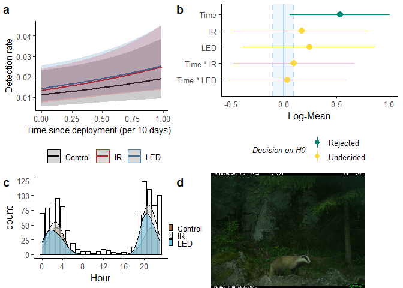
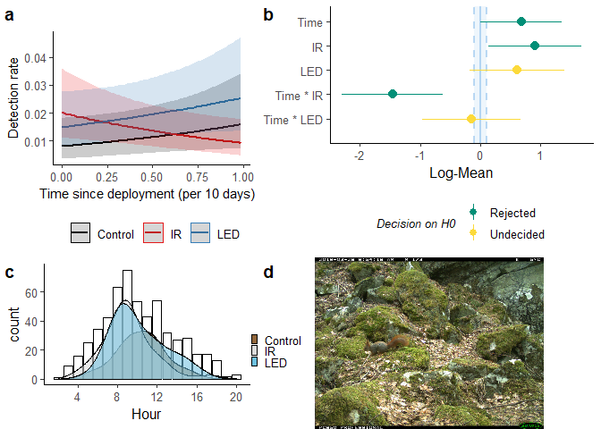

```r
library(tidyverse)
```

```
## -- Attaching packages --------------------------------------- tidyverse 1.3.0 --
```

```
## v ggplot2 3.3.3     v purrr   0.3.4
## v tibble  3.1.0     v dplyr   1.0.5
## v tidyr   1.1.3     v stringr 1.4.0
## v readr   1.4.0     v forcats 0.5.1
```

```
## -- Conflicts ------------------------------------------ tidyverse_conflicts() --
## x dplyr::filter() masks stats::filter()
## x dplyr::lag()    masks stats::lag()
```

```r
library(lme4)
```

```
## Loading required package: Matrix
```

```
## 
## Attaching package: 'Matrix'
```

```
## The following objects are masked from 'package:tidyr':
## 
##     expand, pack, unpack
```

```r
library(performance) # diagnostic-plots to check assumptions
library(report)      # Result-summaries in text-format
```

```
## report is in alpha - help us improve by reporting bugs on github.com/easystats/report/issues
```

```r
library(ggeffects)   # Estimated Marginal Means and Marginal Effects from Regression Models
                          # more at: https://strengejacke.github.io/ggeffects/
library(parameters)  # extract model-parameters etc. from (most) models
library(sjPlot)      # parameters + sjPlot probably does a similar and better job than ggeffects
```

```
## Learn more about sjPlot with 'browseVignettes("sjPlot")'.
```

```r
library(see)         # plot-related package from the easystats-verse

# Data drom Data_exploration2_nesting.R
time.dep <- readRDS("timedep.rds")

ctrl <- c("Control_1", "Control_2", "Control_3","Control_4")
obs      <- readRDS("Observations_prepared1.rds") %>% 
  mutate(flash = ifelse(period %in% ctrl, "Control",flash))
obs <- obs %>% 
  mutate(species = validated_species,
         Hour = as.numeric(format(obs$datetime, "%H")), # for density-plots
         flash = factor(obs$flash, labels = c("IR", "LED","Control"))) # --||--
# Set global plot theme
theme_set(ggpubr::theme_classic2())
```

```
## Registered S3 methods overwritten by 'car':
##   method                          from
##   influence.merMod                lme4
##   cooks.distance.influence.merMod lme4
##   dfbeta.influence.merMod         lme4
##   dfbetas.influence.merMod        lme4
```

## Purpose

Remaking glmm_sp to test periods instead of just flash type, and to do the models without weekly random effect. What happens to Time since deployment?


### Formula
The model formula I will use is $n \sim \ time.deploy\ * flash $ for each species, and my $\alpha = 0.05$.


```r
sp <- c("raadyr", "rev", "hjort", "grevling", "elg", "gaupe", "ekorn", "hare", "maar")
ctrl <- c("Control_1", "Control_2", "Control_3","Control_4")
time.dep2 <- time.dep %>% 
  rename(species = validated_species) %>%  #shortening name
#  filter(species %in% sp) %>% #filtering out species
  # including Control as part of the flash-column, since it differs from flash=0
  mutate(flash = factor(
        ifelse(period %in% ctrl, "Control", flash)),
        week = lubridate::isoweek(date),
        period = factor(period))
time.dep2 <- time.dep2 %>% 
   mutate(flash = fct_relevel(flash, "Control","0","1")) # relevel to make Control the model intercept
levels(time.dep2$flash) <- c("Control", "IR", "LED")
levels(time.dep2$period) <- c("IR_1", "IR_2", "LED_1", "LED_2", "Control_1", "Control_2", "Control_3", "Control_4")
```


```r
# find median period length
time.period <- time.dep2 %>% group_by(loc, period, flash) %>% 
  summarise(period_length = max(time.deploy))

# checking shortest periods
time.period %>% arrange(period_length) # 1 period (LED) is 0 days
```

```
## # A tibble: 211 x 4
## # Groups:   loc, period [211]
##    loc   period    flash   period_length
##    <fct> <fct>     <fct>           <dbl>
##  1 829   LED_1     LED               0  
##  2 925   LED_1     LED               0.8
##  3 850   LED_2     LED               0.9
##  4 664   Control_2 Control           1.1
##  5 829   IR_2      IR                1.2
##  6 855   Control_3 Control           1.8
##  7 840   IR_1      IR                2.6
##  8 953   LED_2     LED               2.6
##  9 258   Control_1 Control           2.7
## 10 942   IR_1      IR                2.7
## # ... with 201 more rows
```

```r
# then merge lengths and filter out period of 0 days
time.dep3 <- time.dep2 %>% left_join(time.period) %>% 
  filter(period_length > 0)

# find median length 
time.period %>% filter(flash == "LED") %>%  
  summary() # median period length 85 days, mean: 84
```

```
##       loc           period       flash    period_length   
##  15     : 2   LED_1    :37   Control: 0   Min.   : 0.000  
##  127    : 2   LED_2    :32   IR     : 0   1st Qu.: 6.500  
##  193    : 2   IR_1     : 0   LED    :69   Median : 8.450  
##  231    : 2   IR_2     : 0                Mean   : 8.285  
##  257    : 2   Control_1: 0                3rd Qu.:11.000  
##  455    : 2   Control_2: 0                Max.   :13.200  
##  (Other):57   (Other)  : 0                NA's   :1
```

```r
time.period %>% filter(flash == "IR") %>%  
  summary() # median period length 79 days, mean: 89
```

```
##       loc           period       flash    period_length   
##  15     : 2   IR_1     :35   Control: 0   Min.   : 1.200  
##  127    : 2   IR_2     :35   IR     :70   1st Qu.: 6.600  
##  193    : 2   LED_1    : 0   LED    : 0   Median : 8.400  
##  231    : 2   LED_2    : 0                Mean   : 9.423  
##  257    : 2   Control_1: 0                3rd Qu.:12.500  
##  455    : 2   Control_2: 0                Max.   :19.600  
##  (Other):58   (Other)  : 0                NA's   :1
```

```r
# extract lengths of each unique period
h <- time.dep3 %>% group_by(loc, period, period_length, flash)%>% nest() %>% 
  select(!data) 
#extracting median and multiplying by 10, to use in the correctly scaled plot
hh <-       h$period_length[h$flash == "LED"] %>%  median()       # median white LED
hh <- c(hh, h$period_length[h$flash == "IR" ] %>%  median()) * 10 # + median IR
# smallest median 
h <- min(hh)
```


_Lastly, performing the filter:_

```r
# filtering out periods longer than (shortest) median length.
time.dep4 <- time.dep3 %>% filter(time.deploy < h/10) # h is normal scale, must be rescaled by /10
time.dep5 <- time.dep4 %>% mutate(time.deploy = time.deploy / .7) # scaled by 1 weeks (84=12*7(1w))

time.dep4$loc %>% unique() %>% is.na() %>% any() # no NAs in loc
```

```
## [1] FALSE
```

```r
summary(time.dep4) #            
```

```
##       loc              date              species              flash       
##  494    : 10050   Min.   :2019-01-15   Length:457470      Control:157770  
##  818    : 10050   1st Qu.:2019-04-25   Class :character   IR     :153360  
##  830    : 10050   Median :2019-07-29   Mode  :character   LED    :146340  
##  861    : 10050   Mean   :2019-07-22                                      
##  863    : 10050   3rd Qu.:2019-10-14                                      
##  864    : 10050   Max.   :2020-02-26                                      
##  (Other):397170                                                           
##        period       time.deploy        n.obs              month       
##  IR_2     :80160   Min.   :0.000   Min.   : 0.00000   08     : 45780  
##  LED_1    :77040   1st Qu.:1.800   1st Qu.: 0.00000   09     : 44460  
##  IR_1     :73200   Median :3.800   Median : 0.00000   06     : 43440  
##  LED_2    :69300   Mean   :3.881   Mean   : 0.03715   03     : 42780  
##  Control_4:40500   3rd Qu.:5.900   3rd Qu.: 0.00000   07     : 41850  
##  Control_3:39270   Max.   :8.300   Max.   :25.00000   10     : 41460  
##  (Other)  :78000                                      (Other):197700  
##       week       period_length   
##  Min.   : 1.00   Min.   : 0.800  
##  1st Qu.:14.00   1st Qu.: 7.900  
##  Median :29.00   Median : 8.900  
##  Mean   :27.89   Mean   : 9.463  
##  3rd Qu.:40.00   3rd Qu.:11.800  
##  Max.   :52.00   Max.   :19.600  
## 
```


# Modelling


## Roe deer


```r
# sp ="raadyr"
# time_sp <- filter(time.dep4, species %in% sp) #.dep4 = trimmed data
time_sp <- filter(time.dep5, species %in% sp, !period %in% ctrl) #.dep5 = fully scaled time.deploy
# Model
m_sp  <- lme4::glmer(n.obs ~ time.deploy * period + # fixed effects
            (1 | loc) + (1 | week), # random effects
            data   = time_sp,
            family = poisson) # poisson family of distributions
# ggeffect calls effects::Effect
p_sp    <- ggeffects::ggeffect(m_sp, terms = c("time.deploy [all]", "period"))
# Diagnostics
assumpt <- performance::check_model(m_sp) # check assumptions
```


```r
# Summary, report, model
summary(m_sp)
r_sp <- report::report(m_sp) # text-summary of my model, to include in a report
para_sp  <- model_parameters(m_sp,   standardize = "refit", two_sd = TRUE, exponentiate = TRUE)
saveRDS(m_sp, file = paste0("m2_",sp,".rds")) # save model objects as shortcut for when editing etc.
```


```r
# sp ="raadyr"
# time_sp <- filter(time.dep4, species %in% sp) #.dep4 = trimmed data
time_sp <- filter(time.dep5, species %in% sp, !period %in% ctrl) #.dep5 = fully scaled time.deploy
# Model
m_sp  <- lme4::glmer(n.obs ~ time.deploy * period + # fixed effects
            (1 | loc) + (1 | week), # random effects
            data   = time_sp,
            family = poisson) # poisson family of distributions
```

```
## Warning in checkConv(attr(opt, "derivs"), opt$par, ctrl = control$checkConv, :
## Model failed to converge with max|grad| = 0.00212241 (tol = 0.002, component 1)
```

```r
# ggeffect calls effects::Effect
p_sp    <- ggeffects::ggeffect(m_sp, terms = c("time.deploy [all]", "period"))
# Diagnostics
assumpt <- performance::check_model(m_sp) # check assumptions
```


```r
# Summary, report, model
summary(m_sp)
```

```
## Generalized linear mixed model fit by maximum likelihood (Laplace
##   Approximation) [glmerMod]
##  Family: poisson  ( log )
## Formula: n.obs ~ time.deploy * period + (1 | loc) + (1 | week)
##    Data: time_sp
## 
##      AIC      BIC   logLik deviance df.resid 
##   4994.3   5066.4  -2487.2   4974.3     9980 
## 
## Scaled residuals: 
##     Min      1Q  Median      3Q     Max 
## -1.1483 -0.2819 -0.1744 -0.0877 13.5863 
## 
## Random effects:
##  Groups Name        Variance Std.Dev.
##  week   (Intercept) 0.2793   0.5285  
##  loc    (Intercept) 2.0874   1.4448  
## Number of obs: 9990, groups:  week, 52; loc, 36
## 
## Fixed effects:
##                           Estimate Std. Error z value Pr(>|z|)    
## (Intercept)             -3.4866730  0.3210648 -10.860   <2e-16 ***
## time.deploy             -0.0006582  0.0284476  -0.023   0.9815    
## periodIR_2               0.1777056  0.2670108   0.666   0.5057    
## periodLED_1              0.4689490  0.1953361   2.401   0.0164 *  
## periodLED_2             -0.0210289  0.2726440  -0.077   0.9385    
## time.deploy:periodIR_2  -0.0298221  0.0395957  -0.753   0.4514    
## time.deploy:periodLED_1 -0.0480980  0.0297090  -1.619   0.1055    
## time.deploy:periodLED_2 -0.0023359  0.0406101  -0.058   0.9541    
## ---
## Signif. codes:  0 '***' 0.001 '**' 0.01 '*' 0.05 '.' 0.1 ' ' 1
## 
## Correlation of Fixed Effects:
##             (Intr) tm.dpl prIR_2 pLED_1 pLED_2 t.:IR_ t.:LED_1
## time.deploy -0.496                                            
## periodIR_2  -0.469  0.687                                     
## periodLED_1 -0.400  0.639  0.514                              
## periodLED_2 -0.454  0.656  0.771  0.488                       
## tm.dpl:IR_2  0.356 -0.767 -0.790 -0.478 -0.561                
## tm.dp:LED_1  0.360 -0.728 -0.450 -0.862 -0.429  0.530         
## tm.dp:LED_2  0.345 -0.740 -0.583 -0.465 -0.784  0.689  0.516  
## optimizer (Nelder_Mead) convergence code: 0 (OK)
## Model failed to converge with max|grad| = 0.00212241 (tol = 0.002, component 1)
```

```r
r_sp <- report::report(m_sp) # text-summary of my model, to include in a report
para_sp  <- model_parameters(m_sp,   standardize = "refit", two_sd = TRUE, exponentiate = TRUE)
saveRDS(m_sp, file = paste0("m2_",sp,".rds")) # save model objects as shortcut for when editing etc.
```


## Roe deer plot


```r
# just a shortcut for editing
sp="raadyr"
m_sp <- readRDS("m_raadyr.rds")
p_sp <- ggeffects::ggeffect(m_sp, terms = c("time.deploy [all]", "flash"))
```


```r
library(cowplot) # to make grid-plots
```

```
## 
## Attaching package: 'cowplot'
```

```
## The following objects are masked from 'package:sjPlot':
## 
##     plot_grid, save_plot
```

```
## The following object is masked from 'package:ggeffects':
## 
##     get_title
```

```r
library(magick)
```

```
## Linking to ImageMagick 6.9.11.57
## Enabled features: cairo, freetype, fftw, ghostscript, heic, lcms, pango, raw, rsvg, webp
## Disabled features: fontconfig, x11
```

```r
# ggpredict
p_sp1 <- plot(p_sp, ci.style = c("dash"), line.size = 1, #ci.styles: “ribbon”, “errorbar”, “dash”, “dot”
              # colors = c("black","#e41a1c","#377eb8")
              ) +
   labs(title="", x="Time since deployment (per 10 days) \ ", y="Detection rate") +
   ggpubr::theme_classic2() +
  theme(#legend.position = "bottom", legend.title = element_blank(),
        axis.title = element_text(size = 11)) 

# standardized plots aren't very different, other than on the scale
#plot(para_sp, size_text = 3) + labs(title = paste0(sp, " GLMM parameters") ,
#                                    subtitle = 'standardize  = "refit" ')

# Equivalence test
result <- equivalence_test(m_sp)
result
```

```
## # TOST-test for Practical Equivalence
## 
##   ROPE: [-0.10 0.10]
## 
##                     Parameter        H0 inside ROPE        90% CI
##                   (Intercept)  Rejected      0.00 % [-4.01 -2.96]
##                   time.deploy  Accepted    100.00 % [-0.05  0.05]
##                 period [IR_2] Undecided     22.77 % [-0.26  0.62]
##                period [LED_1]  Rejected      0.00 % [ 0.15  0.79]
##                period [LED_2] Undecided     22.30 % [-0.47  0.43]
##   time.deploy * period [IR_2]  Accepted    100.00 % [-0.09  0.04]
##  time.deploy * period [LED_1]  Accepted    100.00 % [-0.10  0.00]
##  time.deploy * period [LED_2]  Accepted    100.00 % [-0.07  0.06]
```

```r
# labels for equivalence test - prettier to the human eye
# par_lab <- c("Time", "IR", "LED", "Time * IR", "Time * LED")
# par_lab <- par_lab[5:1]
# Equivalence plot
p_eq <- plot(result) + labs(y = "Log-Mean") + 
    # scale_x_discrete(labels = par_lab) + # new axis names
    theme(#legend.position = c(1, .5), legend.justification = c(1, 1),#legend placement
          axis.text.y = element_text(vjust = -0.7, hjust = 0, # axis-text inside
                                 margin = margin(l = 10, r = -75)),
          axis.ticks.length.y = unit(-1,"mm")) + # inward axis ticks
    guides(colour = guide_legend(nrow = 2, override.aes = list(size = .5),
                                 title.theme = element_text( 
                                   size=10, #adjusting legend appearance
                                   face="italic"))) 

# Density plots
p_dens <- obs %>% filter(species %in% sp) %>% 
  mutate(flash = fct_shift(flash,-1)) %>% #reordering flash-factor
  ggplot(aes(Hour)) +
  geom_bar(col="black", fill="white") +
  geom_density(aes(y=..density..*20*count, #scaling density with the count
                   fill=flash, alpha=.1),
               show.legend = c(alpha = F), bw=1.2) +
  scale_x_continuous(breaks = seq(0,23, by=4)) + # which x-ticks
  scale_y_continuous(n.breaks = 6) + # n y-ticks
  theme(legend.position = c(1, 1), legend.justification = c(.1, 2), #legend placement
        legend.title = element_blank(), legend.key.size = unit(2, 'mm'))+ #size
  scale_fill_bluebrown(reverse = T) 


# cowplot::plot_grid(NULL,p_eq,p_dens,NULL,
#                    #nrow = 2,
#                    # rel_widths = c(3,4),
#                    rel_heights = c(3,2),
#                    labels="auto"
#                    #align = "h"
# )


sp_file <- paste0("jpg/",sp,".JPG")
jpg <- ggdraw() + draw_image(sp_file)

p_grid <- cowplot::plot_grid(p_sp1,
                             p_eq,
                             p_dens,
                             jpg,
                   #nrow = 2,
                   rel_widths = c(3,4),
                   rel_heights = c(3,2),
                   labels="auto"
                   #align = "h"
) 
p_grid #+ draw_image(sp_file, scale = .4, x = 0.9,
```

<!-- -->

```r
       #  hjust = 1, halign = 1, valign = 0)
```


```r
summary(r_sp)
```

```
## We fitted a poisson mixed model to predict n.obs with time.deploy and period. The model included loc and week as random effects. The model's total explanatory power is substantial (conditional R2 = 0.41) and the part related to the fixed effects alone (marginal R2) is of 3.17e-03. The model's intercept is at -3.49 (95% CI [-4.12, -2.86]). Within this model:
## 
##   - The effect of time.deploy is non-significantly negative (beta = -6.58e-04, 95% CI [-0.06, 0.06], p = 0.982, Std. beta = -2.24e-03)
##   - The effect of period [IR_2] is non-significantly positive (beta = 0.18, 95% CI [-0.35, 0.70], p = 0.506, Std. beta = 0.01)
##   - The effect of period [LED_1] is significantly positive (beta = 0.47, 95% CI [0.09, 0.85], p < .05, Std. beta = 0.21)
##   - The effect of period [LED_2] is non-significantly negative (beta = -0.02, 95% CI [-0.56, 0.51], p = 0.939, Std. beta = -0.03)
##   - The interaction effect of period [IR_2] on time.deploy is non-significantly negative (beta = -0.03, 95% CI [-0.11, 0.05], p = 0.451, Std. beta = -0.10)
##   - The interaction effect of period [LED_1] on time.deploy is non-significantly negative (beta = -0.05, 95% CI [-0.11, 0.01], p = 0.105, Std. beta = -0.16)
##   - The interaction effect of period [LED_2] on time.deploy is non-significantly negative (beta = -2.34e-03, 95% CI [-0.08, 0.08], p = 0.954, Std. beta = -7.77e-03)
```

```r
as.report_table(r_sp)
```

```
## Parameter                    | Coefficient |         95% CI |      z |  df |      p | Std. Coef. | Std. Coef. 95% CI |      Fit
## -------------------------------------------------------------------------------------------------------------------------------
## (Intercept)                  |       -3.49 | [-4.12, -2.86] | -10.86 | Inf | < .001 |      -3.49 |    [-4.04, -2.94] |         
## time.deploy                  |   -6.58e-04 | [-0.06,  0.06] |  -0.02 | Inf | 0.982  |  -2.24e-03 |    [-0.19,  0.18] |         
## period [IR_2]                |        0.18 | [-0.35,  0.70] |   0.67 | Inf | 0.506  |       0.01 |    [-0.31,  0.34] |         
## period [LED_1]               |        0.47 | [ 0.09,  0.85] |   2.40 | Inf | 0.016  |       0.21 |    [ 0.01,  0.40] |         
## period [LED_2]               |       -0.02 | [-0.56,  0.51] |  -0.08 | Inf | 0.939  |      -0.03 |    [-0.37,  0.30] |         
## time.deploy * period [IR_2]  |       -0.03 | [-0.11,  0.05] |  -0.75 | Inf | 0.451  |      -0.10 |    [-0.36,  0.16] |         
## time.deploy * period [LED_1] |       -0.05 | [-0.11,  0.01] |  -1.62 | Inf | 0.105  |      -0.16 |    [-0.35,  0.03] |         
## time.deploy * period [LED_2] |   -2.34e-03 | [-0.08,  0.08] |  -0.06 | Inf | 0.954  |  -7.77e-03 |    [-0.27,  0.26] |         
##                              |             |                |        |     |        |            |                   |         
## AIC                          |             |                |        |     |        |            |                   |  4994.35
## BIC                          |             |                |        |     |        |            |                   |  5066.44
## R2 (conditional)             |             |                |        |     |        |            |                   |     0.41
## R2 (marginal)                |             |                |        |     |        |            |                   | 3.17e-03
## Sigma                        |             |                |        |     |        |            |                   |     1.00
```


```r
# Storing species-specific objects for later
# Model
m_raa    = m_sp
# ggpredict 
p_raa    = p_sp
# report-object
r_raa    = r_sp
# parameters refit
para_raa = para_sp
```


sp
sp-report
sp-report2
parameters

objects


#### Skrivestopp

-------------------------------------------------------------

## Red Fox


```r
# sp ="raadyr"
# time_sp <- filter(time.dep4, species %in% sp) #.dep4 = trimmed data
time_sp <- filter(time.dep5, species %in% sp, !period %in% ctrl) #.dep5 = fully scaled time.deploy
# Model
m_sp  <- lme4::glmer(n.obs ~ time.deploy * period + # fixed effects
            (1 | loc) + (1 | week), # random effects
            data   = time_sp,
            family = poisson) # poisson family of distributions
```

```
## Warning in checkConv(attr(opt, "derivs"), opt$par, ctrl = control$checkConv, :
## Model failed to converge with max|grad| = 0.00529036 (tol = 0.002, component 1)
```

```r
# ggeffect calls effects::Effect
p_sp    <- ggeffects::ggeffect(m_sp, terms = c("time.deploy [all]", "period"))
# Diagnostics
assumpt <- performance::check_model(m_sp) # check assumptions
# Summary, report, model
summary(m_sp)
```

```
## Generalized linear mixed model fit by maximum likelihood (Laplace
##   Approximation) [glmerMod]
##  Family: poisson  ( log )
## Formula: n.obs ~ time.deploy * period + (1 | loc) + (1 | week)
##    Data: time_sp
## 
##      AIC      BIC   logLik deviance df.resid 
##   3816.9   3889.0  -1898.5   3796.9     9980 
## 
## Scaled residuals: 
##     Min      1Q  Median      3Q     Max 
## -0.7042 -0.2403 -0.1797 -0.1279 12.3167 
## 
## Random effects:
##  Groups Name        Variance Std.Dev.
##  week   (Intercept) 0.08987  0.2998  
##  loc    (Intercept) 0.74487  0.8631  
## Number of obs: 9990, groups:  week, 52; loc, 36
## 
## Fixed effects:
##                         Estimate Std. Error z value Pr(>|z|)    
## (Intercept)             -3.43319    0.24858 -13.811   <2e-16 ***
## time.deploy             -0.01446    0.03149  -0.459   0.6460    
## periodIR_2               0.09539    0.27346   0.349   0.7272    
## periodLED_1              0.47414    0.22712   2.088   0.0368 *  
## periodLED_2             -0.25843    0.30157  -0.857   0.3915    
## time.deploy:periodIR_2   0.01048    0.04263   0.246   0.8059    
## time.deploy:periodLED_1 -0.01485    0.03598  -0.413   0.6799    
## time.deploy:periodLED_2  0.02496    0.04587   0.544   0.5864    
## ---
## Signif. codes:  0 '***' 0.001 '**' 0.01 '*' 0.05 '.' 0.1 ' ' 1
## 
## Correlation of Fixed Effects:
##             (Intr) tm.dpl prIR_2 pLED_1 pLED_2 t.:IR_ t.:LED_1
## time.deploy -0.659                                            
## periodIR_2  -0.588  0.634                                     
## periodLED_1 -0.573  0.636  0.525                              
## periodLED_2 -0.534  0.569  0.597  0.469                       
## tm.dpl:IR_2  0.488 -0.755 -0.833 -0.470 -0.491                
## tm.dp:LED_1  0.481 -0.726 -0.440 -0.853 -0.388  0.536         
## tm.dp:LED_2  0.457 -0.698 -0.502 -0.437 -0.838  0.602  0.495  
## optimizer (Nelder_Mead) convergence code: 0 (OK)
## Model failed to converge with max|grad| = 0.00529036 (tol = 0.002, component 1)
```

```r
r_sp <- report::report(m_sp) # text-summary of my model, to include in a report
para_sp  <- model_parameters(m_sp,   standardize = "refit", two_sd = TRUE, exponentiate = TRUE)
saveRDS(m_sp, file = paste0("m2_",sp,".rds")) # save model objects as shortcut for when editing etc.
```
### Plot


```r
summary(r_sp)
```

```
## We fitted a poisson mixed model to predict n.obs with time.deploy and period. The model included loc and week as random effects. The model's total explanatory power is moderate (conditional R2 = 0.20) and the part related to the fixed effects alone (marginal R2) is of 9.27e-03. The model's intercept is at -3.43 (95% CI [-3.92, -2.95]). Within this model:
## 
##   - The effect of time.deploy is non-significantly negative (beta = -0.01, 95% CI [-0.08, 0.05], p = 0.646, Std. beta = -0.05)
##   - The effect of period [IR_2] is non-significantly positive (beta = 0.10, 95% CI [-0.44, 0.63], p = 0.727, Std. beta = 0.15)
##   - The effect of period [LED_1] is significantly positive (beta = 0.47, 95% CI [0.03, 0.92], p < .05, Std. beta = 0.39)
##   - The effect of period [LED_2] is non-significantly negative (beta = -0.26, 95% CI [-0.85, 0.33], p = 0.391, Std. beta = -0.12)
##   - The interaction effect of period [IR_2] on time.deploy is non-significantly positive (beta = 0.01, 95% CI [-0.07, 0.09], p = 0.806, Std. beta = 0.04)
##   - The interaction effect of period [LED_1] on time.deploy is non-significantly negative (beta = -0.01, 95% CI [-0.09, 0.06], p = 0.680, Std. beta = -0.05)
##   - The interaction effect of period [LED_2] on time.deploy is non-significantly positive (beta = 0.02, 95% CI [-0.06, 0.11], p = 0.586, Std. beta = 0.08)
```

```r
as.report_table(r_sp)
```

```
## Parameter                    | Coefficient |         95% CI |      z |  df |      p | Std. Coef. | Std. Coef. 95% CI |      Fit
## -------------------------------------------------------------------------------------------------------------------------------
## (Intercept)                  |       -3.43 | [-3.92, -2.95] | -13.81 | Inf | < .001 |      -3.51 |    [-3.88, -3.15] |         
## time.deploy                  |       -0.01 | [-0.08,  0.05] |  -0.46 | Inf | 0.646  |      -0.05 |    [-0.25,  0.16] |         
## period [IR_2]                |        0.10 | [-0.44,  0.63] |   0.35 | Inf | 0.727  |       0.15 |    [-0.14,  0.45] |         
## period [LED_1]               |        0.47 | [ 0.03,  0.92] |   2.09 | Inf | 0.037  |       0.39 |    [ 0.16,  0.63] |         
## period [LED_2]               |       -0.26 | [-0.85,  0.33] |  -0.86 | Inf | 0.391  |      -0.12 |    [-0.44,  0.20] |         
## time.deploy * period [IR_2]  |        0.01 | [-0.07,  0.09] |   0.25 | Inf | 0.806  |       0.04 |    [-0.24,  0.31] |         
## time.deploy * period [LED_1] |       -0.01 | [-0.09,  0.06] |  -0.41 | Inf | 0.680  |      -0.05 |    [-0.28,  0.19] |         
## time.deploy * period [LED_2] |        0.02 | [-0.06,  0.11] |   0.54 | Inf | 0.586  |       0.08 |    [-0.22,  0.38] |         
##                              |             |                |        |     |        |            |                   |         
## AIC                          |             |                |        |     |        |            |                   |  3816.93
## BIC                          |             |                |        |     |        |            |                   |  3889.02
## R2 (conditional)             |             |                |        |     |        |            |                   |     0.20
## R2 (marginal)                |             |                |        |     |        |            |                   | 9.27e-03
## Sigma                        |             |                |        |     |        |            |                   |     1.00
```

```r
library(cowplot) # to make grid-plots
library(magick)
# ggpredict
p_sp1 <- plot(p_sp, ci.style = c("dash"), line.size = 1, #ci.styles: “ribbon”, “errorbar”, “dash”, “dot”
              # colors = c("black","#e41a1c","#377eb8")
              ) +
   labs(title="", x="Time since deployment (per 10 days) \ ", y="Detection rate") +
   ggpubr::theme_classic2() +
  theme(#legend.position = "bottom", legend.title = element_blank(),
        axis.title = element_text(size = 11)) 

# standardized plots aren't very different, other than on the scale
#plot(para_sp, size_text = 3) + labs(title = paste0(sp, " GLMM parameters") ,
#                                    subtitle = 'standardize  = "refit" ')

# Equivalence test
result <- equivalence_test(m_sp)
result
```

```
## # TOST-test for Practical Equivalence
## 
##   ROPE: [-0.10 0.10]
## 
##                     Parameter        H0 inside ROPE        90% CI
##                   (Intercept)  Rejected      0.00 % [-3.84 -3.02]
##                   time.deploy  Accepted    100.00 % [-0.07  0.04]
##                 period [IR_2] Undecided     22.23 % [-0.35  0.55]
##                period [LED_1]  Rejected      0.00 % [ 0.10  0.85]
##                period [LED_2] Undecided     20.16 % [-0.75  0.24]
##   time.deploy * period [IR_2]  Accepted    100.00 % [-0.06  0.08]
##  time.deploy * period [LED_1]  Accepted    100.00 % [-0.07  0.04]
##  time.deploy * period [LED_2] Undecided     99.73 % [-0.05  0.10]
```

```r
# labels for equivalence test - prettier to the human eye
# par_lab <- c("Time", "IR", "LED", "Time * IR", "Time * LED")
# par_lab <- par_lab[5:1]
# Equivalence plot
p_eq <- plot(result) + labs(y = "Log-Mean") + 
    # scale_x_discrete(labels = par_lab) + # new axis names
    theme(#legend.position = c(1, .5), legend.justification = c(1, 1),#legend placement
          axis.text.y = element_text(vjust = -0.7, hjust = 0, # axis-text inside
                                 margin = margin(l = 10, r = -75)),
          axis.ticks.length.y = unit(-1,"mm")) + # inward axis ticks
    guides(colour = guide_legend(nrow = 2, override.aes = list(size = .5),
                                 title.theme = element_text( 
                                   size=10, #adjusting legend appearance
                                   face="italic"))) 

# Density plots
p_dens <- obs %>% filter(species %in% sp) %>% 
  mutate(flash = fct_shift(flash,-1)) %>% #reordering flash-factor
  ggplot(aes(Hour)) +
  geom_bar(col="black", fill="white") +
  geom_density(aes(y=..density..*20*count, #scaling density with the count
                   fill=flash, alpha=.1),
               show.legend = c(alpha = F), bw=1.2) +
  scale_x_continuous(breaks = seq(0,23, by=4)) + # which x-ticks
  scale_y_continuous(n.breaks = 6) + # n y-ticks
  theme(legend.position = c(1, 1), legend.justification = c(.1, 2), #legend placement
        legend.title = element_blank(), legend.key.size = unit(2, 'mm'))+ #size
  scale_fill_bluebrown(reverse = T) 


# cowplot::plot_grid(NULL,p_eq,p_dens,NULL,
#                    #nrow = 2,
#                    # rel_widths = c(3,4),
#                    rel_heights = c(3,2),
#                    labels="auto"
#                    #align = "h"
# )


sp_file <- paste0("jpg/",sp,".JPG")
jpg <- ggdraw() + draw_image(sp_file)

p_grid <- cowplot::plot_grid(p_sp1,
                             p_eq,
                             p_dens,
                             jpg,
                   #nrow = 2,
                   rel_widths = c(3,4),
                   rel_heights = c(3,2),
                   labels="auto"
                   #align = "h"
) 
p_grid #+ draw_image(sp_file, scale = .4, x = 0.9,
```

<!-- -->

```r
       #  hjust = 1, halign = 1, valign = 0)
```


```r
# Model
m_rev    = m_sp
# ggpredict 
p_rev    = p_sp
# report-object
r_rev    = r_sp
# parameters refit
para_rev = para_sp
```


```r
knitr::knit_exit() # to exit knitting process here instead of at the document end
```


## Badger


```r
# sp ="raadyr"
# time_sp <- filter(time.dep4, species %in% sp) #.dep4 = trimmed data
time_sp <- filter(time.dep5, species %in% sp, !period %in% ctrl) #.dep5 = fully scaled time.deploy
# Model
m_sp  <- lme4::glmer(n.obs ~ time.deploy * period + # fixed effects
            (1 | loc) + (1 | week), # random effects
            data   = time_sp,
            family = poisson) # poisson family of distributions
```

```
## Warning in checkConv(attr(opt, "derivs"), opt$par, ctrl = control$checkConv, :
## Model failed to converge with max|grad| = 0.0188724 (tol = 0.002, component 1)
```

```r
# ggeffect calls effects::Effect
p_sp    <- ggeffects::ggeffect(m_sp, terms = c("time.deploy [all]", "period"))
# Diagnostics
assumpt <- performance::check_model(m_sp) # check assumptions
# Summary, report, model
summary(m_sp)
```

```
## Generalized linear mixed model fit by maximum likelihood (Laplace
##   Approximation) [glmerMod]
##  Family: poisson  ( log )
## Formula: n.obs ~ time.deploy * period + (1 | loc) + (1 | week)
##    Data: time_sp
## 
##      AIC      BIC   logLik deviance df.resid 
##   3282.7   3354.8  -1631.3   3262.7     9980 
## 
## Scaled residuals: 
##     Min      1Q  Median      3Q     Max 
## -1.1839 -0.2127 -0.1219 -0.0664 13.5423 
## 
## Random effects:
##  Groups Name        Variance Std.Dev.
##  week   (Intercept) 0.8896   0.9432  
##  loc    (Intercept) 1.3021   1.1411  
## Number of obs: 9990, groups:  week, 52; loc, 36
## 
## Fixed effects:
##                         Estimate Std. Error z value Pr(>|z|)    
## (Intercept)             -4.11746    0.33330 -12.354  < 2e-16 ***
## time.deploy              0.07261    0.03026   2.399  0.01643 *  
## periodIR_2              -0.20531    0.37797  -0.543  0.58700    
## periodLED_1              0.32846    0.24096   1.363  0.17284    
## periodLED_2             -0.48531    0.38709  -1.254  0.20994    
## time.deploy:periodIR_2  -0.15511    0.05605  -2.767  0.00565 ** 
## time.deploy:periodLED_1 -0.03542    0.03358  -1.055  0.29147    
## time.deploy:periodLED_2 -0.11514    0.05538  -2.079  0.03762 *  
## ---
## Signif. codes:  0 '***' 0.001 '**' 0.01 '*' 0.05 '.' 0.1 ' ' 1
## 
## Correlation of Fixed Effects:
##             (Intr) tm.dpl prIR_2 pLED_1 pLED_2 t.:IR_ t.:LED_1
## time.deploy -0.542                                            
## periodIR_2  -0.476  0.557                                     
## periodLED_1 -0.426  0.616  0.369                              
## periodLED_2 -0.457  0.536  0.670  0.351                       
## tm.dpl:IR_2  0.245 -0.571 -0.695 -0.325 -0.383                
## tm.dp:LED_1  0.384 -0.671 -0.326 -0.905 -0.305  0.352         
## tm.dp:LED_2  0.269 -0.598 -0.380 -0.362 -0.708  0.518  0.396  
## optimizer (Nelder_Mead) convergence code: 0 (OK)
## Model failed to converge with max|grad| = 0.0188724 (tol = 0.002, component 1)
```

```r
r_sp <- report::report(m_sp) # text-summary of my model, to include in a report
para_sp  <- model_parameters(m_sp,   standardize = "refit", two_sd = TRUE, exponentiate = TRUE)
saveRDS(m_sp, file = paste0("m2_",sp,".rds")) # save model objects as shortcut for when editing etc.
```

### Plot


```r
summary(r_sp)
```

```
## We fitted a poisson mixed model to predict n.obs with time.deploy and period. The model included loc and week as random effects. The model's total explanatory power is substantial (conditional R2 = 0.38) and the part related to the fixed effects alone (marginal R2) is of 0.06. The model's intercept is at -4.12 (95% CI [-4.77, -3.46]). Within this model:
## 
##   - The effect of time.deploy is significantly positive (beta = 0.07, 95% CI [0.01, 0.13], p < .05, Std. beta = 0.24)
##   - The effect of period [IR_2] is non-significantly negative (beta = -0.21, 95% CI [-0.95, 0.54], p = 0.587, Std. beta = -1.05)
##   - The effect of period [LED_1] is non-significantly positive (beta = 0.33, 95% CI [-0.14, 0.80], p = 0.173, Std. beta = 0.14)
##   - The effect of period [LED_2] is non-significantly negative (beta = -0.49, 95% CI [-1.24, 0.27], p = 0.210, Std. beta = -1.11)
##   - The interaction effect of period [IR_2] on time.deploy is significantly negative (beta = -0.16, 95% CI [-0.26, -0.05], p < .01, Std. beta = -0.52)
##   - The interaction effect of period [LED_1] on time.deploy is non-significantly negative (beta = -0.04, 95% CI [-0.10, 0.03], p = 0.291, Std. beta = -0.12)
##   - The interaction effect of period [LED_2] on time.deploy is significantly negative (beta = -0.12, 95% CI [-0.22, -6.59e-03], p < .05, Std. beta = -0.38)
```

```r
as.report_table(r_sp)
```

```
## Parameter                    | Coefficient |         95% CI |      z |  df |      p | Std. Coef. | Std. Coef. 95% CI |     Fit
## ------------------------------------------------------------------------------------------------------------------------------
## (Intercept)                  |       -4.12 | [-4.77, -3.46] | -12.35 | Inf | < .001 |      -3.72 |    [-4.27, -3.17] |        
## time.deploy                  |        0.07 | [ 0.01,  0.13] |   2.40 | Inf | 0.016  |       0.24 |    [ 0.04,  0.44] |        
## period [IR_2]                |       -0.21 | [-0.95,  0.54] |  -0.54 | Inf | 0.587  |      -1.05 |    [-1.59, -0.51] |        
## period [LED_1]               |        0.33 | [-0.14,  0.80] |   1.36 | Inf | 0.173  |       0.14 |    [-0.08,  0.35] |        
## period [LED_2]               |       -0.49 | [-1.24,  0.27] |  -1.25 | Inf | 0.210  |      -1.11 |    [-1.65, -0.57] |        
## time.deploy * period [IR_2]  |       -0.16 | [-0.26, -0.05] |  -2.77 | Inf | 0.006  |      -0.52 |    [-0.88, -0.15] |        
## time.deploy * period [LED_1] |       -0.04 | [-0.10,  0.03] |  -1.05 | Inf | 0.291  |      -0.12 |    [-0.34,  0.10] |        
## time.deploy * period [LED_2] |       -0.12 | [-0.22, -0.01] |  -2.08 | Inf | 0.038  |      -0.38 |    [-0.75, -0.02] |        
##                              |             |                |        |     |        |            |                   |        
## AIC                          |             |                |        |     |        |            |                   | 3282.68
## BIC                          |             |                |        |     |        |            |                   | 3354.78
## R2 (conditional)             |             |                |        |     |        |            |                   |    0.38
## R2 (marginal)                |             |                |        |     |        |            |                   |    0.06
## Sigma                        |             |                |        |     |        |            |                   |    1.00
```

```r
library(cowplot) # to make grid-plots
library(magick)
# ggpredict
p_sp1 <- plot(p_sp, ci.style = c("dash"), line.size = 1, #ci.styles: “ribbon”, “errorbar”, “dash”, “dot”
              # colors = c("black","#e41a1c","#377eb8")
              ) +
   labs(title="", x="Time since deployment (per 10 days) \ ", y="Detection rate") +
   ggpubr::theme_classic2() +
  theme(#legend.position = "bottom", legend.title = element_blank(),
        axis.title = element_text(size = 11)) 

# standardized plots aren't very different, other than on the scale
#plot(para_sp, size_text = 3) + labs(title = paste0(sp, " GLMM parameters") ,
#                                    subtitle = 'standardize  = "refit" ')

# Equivalence test
result <- equivalence_test(m_sp)
result
```

```
## # TOST-test for Practical Equivalence
## 
##   ROPE: [-0.10 0.10]
## 
##                     Parameter        H0 inside ROPE        90% CI
##                   (Intercept)  Rejected      0.00 % [-4.67 -3.57]
##                   time.deploy  Rejected     77.51 % [ 0.02  0.12]
##                 period [IR_2] Undecided     16.08 % [-0.83  0.42]
##                period [LED_1] Undecided     21.18 % [-0.07  0.72]
##                period [LED_2] Undecided     15.71 % [-1.12  0.15]
##   time.deploy * period [IR_2]  Rejected     20.11 % [-0.25 -0.06]
##  time.deploy * period [LED_1]  Accepted    100.00 % [-0.09  0.02]
##  time.deploy * period [LED_2]  Rejected     41.69 % [-0.21 -0.02]
```

```r
# labels for equivalence test - prettier to the human eye
# par_lab <- c("Time", "IR", "LED", "Time * IR", "Time * LED")
# par_lab <- par_lab[5:1]
# Equivalence plot
p_eq <- plot(result) + labs(y = "Log-Mean") + 
    # scale_x_discrete(labels = par_lab) + # new axis names
    theme(#legend.position = c(1, .5), legend.justification = c(1, 1),#legend placement
          axis.text.y = element_text(vjust = -0.7, hjust = 0, # axis-text inside
                                 margin = margin(l = 10, r = -75)),
          axis.ticks.length.y = unit(-1,"mm")) + # inward axis ticks
    guides(colour = guide_legend(nrow = 2, override.aes = list(size = .5),
                                 title.theme = element_text( 
                                   size=10, #adjusting legend appearance
                                   face="italic"))) 

# Density plots
p_dens <- obs %>% filter(species %in% sp) %>% 
  mutate(flash = fct_shift(flash,-1)) %>% #reordering flash-factor
  ggplot(aes(Hour)) +
  geom_bar(col="black", fill="white") +
  geom_density(aes(y=..density..*20*count, #scaling density with the count
                   fill=flash, alpha=.1),
               show.legend = c(alpha = F), bw=1.2) +
  scale_x_continuous(breaks = seq(0,23, by=4)) + # which x-ticks
  scale_y_continuous(n.breaks = 6) + # n y-ticks
  theme(legend.position = c(1, 1), legend.justification = c(.1, 2), #legend placement
        legend.title = element_blank(), legend.key.size = unit(2, 'mm'))+ #size
  scale_fill_bluebrown(reverse = T) 


# cowplot::plot_grid(NULL,p_eq,p_dens,NULL,
#                    #nrow = 2,
#                    # rel_widths = c(3,4),
#                    rel_heights = c(3,2),
#                    labels="auto"
#                    #align = "h"
# )


sp_file <- paste0("jpg/",sp,".JPG")
jpg <- ggdraw() + draw_image(sp_file)

p_grid <- cowplot::plot_grid(p_sp1,
                             p_eq,
                             p_dens,
                             jpg,
                   #nrow = 2,
                   rel_widths = c(3,4),
                   rel_heights = c(3,2),
                   labels="auto"
                   #align = "h"
) 
p_grid #+ draw_image(sp_file, scale = .4, x = 0.9,
```

<!-- -->

```r
       #  hjust = 1, halign = 1, valign = 0)
```


```r
# Model
m_grvl    = m_sp
# ggpredict 
p_grvl    = p_sp
# report-object
r_grvl    = r_sp
# parameters refit
para_grvl = para_sp
```


## Moose


```r
# sp ="raadyr"
# time_sp <- filter(time.dep4, species %in% sp) #.dep4 = trimmed data
time_sp <- filter(time.dep5, species %in% sp, !period %in% ctrl) #.dep5 = fully scaled time.deploy
# Model
m_sp  <- lme4::glmer(n.obs ~ time.deploy * period + # fixed effects
            (1 | loc) + (1 | week), # random effects
            data   = time_sp,
            family = poisson) # poisson family of distributions
# ggeffect calls effects::Effect
p_sp    <- ggeffects::ggeffect(m_sp, terms = c("time.deploy [all]", "period"))
# Diagnostics
assumpt <- performance::check_model(m_sp) # check assumptions
# Summary, report, model
summary(m_sp)
```

```
## Generalized linear mixed model fit by maximum likelihood (Laplace
##   Approximation) [glmerMod]
##  Family: poisson  ( log )
## Formula: n.obs ~ time.deploy * period + (1 | loc) + (1 | week)
##    Data: time_sp
## 
##      AIC      BIC   logLik deviance df.resid 
##   2060.7   2132.8  -1020.4   2040.7     9980 
## 
## Scaled residuals: 
##     Min      1Q  Median      3Q     Max 
## -0.4788 -0.1669 -0.1156 -0.0720 16.6750 
## 
## Random effects:
##  Groups Name        Variance Std.Dev.
##  week   (Intercept) 0.4768   0.6905  
##  loc    (Intercept) 1.2391   1.1131  
## Number of obs: 9990, groups:  week, 52; loc, 36
## 
## Fixed effects:
##                         Estimate Std. Error z value Pr(>|z|)    
## (Intercept)             -4.62204    0.39517 -11.696   <2e-16 ***
## time.deploy              0.02633    0.05122   0.514    0.607    
## periodIR_2              -0.04217    0.46241  -0.091    0.927    
## periodLED_1              0.47159    0.33490   1.408    0.159    
## periodLED_2              0.24716    0.46235   0.535    0.593    
## time.deploy:periodIR_2  -0.02471    0.06971  -0.355    0.723    
## time.deploy:periodLED_1 -0.04987    0.05607  -0.889    0.374    
## time.deploy:periodLED_2 -0.05336    0.07242  -0.737    0.461    
## ---
## Signif. codes:  0 '***' 0.001 '**' 0.01 '*' 0.05 '.' 0.1 ' ' 1
## 
## Correlation of Fixed Effects:
##             (Intr) tm.dpl prIR_2 pLED_1 pLED_2 t.:IR_ t.:LED_1
## time.deploy -0.705                                            
## periodIR_2  -0.619  0.637                                     
## periodLED_1 -0.558  0.627  0.482                              
## periodLED_2 -0.616  0.642  0.674  0.469                       
## tm.dpl:IR_2  0.525 -0.763 -0.817 -0.465 -0.562                
## tm.dp:LED_1  0.492 -0.728 -0.422 -0.845 -0.415  0.543         
## tm.dp:LED_2  0.509 -0.746 -0.529 -0.452 -0.822  0.678  0.528
```

```r
r_sp <- report::report(m_sp) # text-summary of my model, to include in a report
para_sp  <- model_parameters(m_sp,   standardize = "refit", two_sd = TRUE, exponentiate = TRUE)
saveRDS(m_sp, file = paste0("m2_",sp,".rds")) # save model objects as shortcut for when editing etc.
```

### Plot


```r
summary(r_sp)
```

```
## We fitted a poisson mixed model to predict n.obs with time.deploy and period. The model included loc and week as random effects. The model's total explanatory power is substantial (conditional R2 = 0.28) and the part related to the fixed effects alone (marginal R2) is of 3.90e-03. The model's intercept is at -4.62 (95% CI [-5.40, -3.85]). Within this model:
## 
##   - The effect of time.deploy is non-significantly positive (beta = 0.03, 95% CI [-0.07, 0.13], p = 0.607, Std. beta = 0.09)
##   - The effect of period [IR_2] is non-significantly negative (beta = -0.04, 95% CI [-0.95, 0.86], p = 0.927, Std. beta = -0.18)
##   - The effect of period [LED_1] is non-significantly positive (beta = 0.47, 95% CI [-0.18, 1.13], p = 0.159, Std. beta = 0.20)
##   - The effect of period [LED_2] is non-significantly positive (beta = 0.25, 95% CI [-0.66, 1.15], p = 0.593, Std. beta = -0.04)
##   - The interaction effect of period [IR_2] on time.deploy is non-significantly negative (beta = -0.02, 95% CI [-0.16, 0.11], p = 0.723, Std. beta = -0.08)
##   - The interaction effect of period [LED_1] on time.deploy is non-significantly negative (beta = -0.05, 95% CI [-0.16, 0.06], p = 0.374, Std. beta = -0.17)
##   - The interaction effect of period [LED_2] on time.deploy is non-significantly negative (beta = -0.05, 95% CI [-0.20, 0.09], p = 0.461, Std. beta = -0.18)
```

```r
as.report_table(r_sp)
```

```
## Parameter                    | Coefficient |         95% CI |      z |  df |      p | Std. Coef. | Std. Coef. 95% CI |      Fit
## -------------------------------------------------------------------------------------------------------------------------------
## (Intercept)                  |       -4.62 | [-5.40, -3.85] | -11.70 | Inf | < .001 |      -4.48 |    [-5.03, -3.93] |         
## time.deploy                  |        0.03 | [-0.07,  0.13] |   0.51 | Inf | 0.607  |       0.09 |    [-0.25,  0.42] |         
## period [IR_2]                |       -0.04 | [-0.95,  0.86] |  -0.09 | Inf | 0.927  |      -0.18 |    [-0.70,  0.35] |         
## period [LED_1]               |        0.47 | [-0.18,  1.13] |   1.41 | Inf | 0.159  |       0.20 |    [-0.15,  0.55] |         
## period [LED_2]               |        0.25 | [-0.66,  1.15] |   0.53 | Inf | 0.593  |      -0.04 |    [-0.56,  0.47] |         
## time.deploy * period [IR_2]  |       -0.02 | [-0.16,  0.11] |  -0.35 | Inf | 0.723  |      -0.08 |    [-0.54,  0.37] |         
## time.deploy * period [LED_1] |       -0.05 | [-0.16,  0.06] |  -0.89 | Inf | 0.374  |      -0.17 |    [-0.53,  0.20] |         
## time.deploy * period [LED_2] |       -0.05 | [-0.20,  0.09] |  -0.74 | Inf | 0.461  |      -0.18 |    [-0.65,  0.30] |         
##                              |             |                |        |     |        |            |                   |         
## AIC                          |             |                |        |     |        |            |                   |  2060.74
## BIC                          |             |                |        |     |        |            |                   |  2132.83
## R2 (conditional)             |             |                |        |     |        |            |                   |     0.28
## R2 (marginal)                |             |                |        |     |        |            |                   | 3.90e-03
## Sigma                        |             |                |        |     |        |            |                   |     1.00
```

```r
library(cowplot) # to make grid-plots
library(magick)
# ggpredict
p_sp1 <- plot(p_sp, ci.style = c("dash"), line.size = 1, #ci.styles: “ribbon”, “errorbar”, “dash”, “dot”
              # colors = c("black","#e41a1c","#377eb8")
              ) +
   labs(title="", x="Time since deployment (per 10 days) \ ", y="Detection rate") +
   ggpubr::theme_classic2() +
  theme(#legend.position = "bottom", legend.title = element_blank(),
        axis.title = element_text(size = 11)) 

# standardized plots aren't very different, other than on the scale
#plot(para_sp, size_text = 3) + labs(title = paste0(sp, " GLMM parameters") ,
#                                    subtitle = 'standardize  = "refit" ')

# Equivalence test
result <- equivalence_test(m_sp)
result
```

```
## # TOST-test for Practical Equivalence
## 
##   ROPE: [-0.10 0.10]
## 
##                     Parameter        H0 inside ROPE        90% CI
##                   (Intercept)  Rejected      0.00 % [-5.27 -3.97]
##                   time.deploy Undecided     93.72 % [-0.06  0.11]
##                 period [IR_2] Undecided     13.15 % [-0.80  0.72]
##                period [LED_1] Undecided     16.27 % [-0.08  1.02]
##                period [LED_2] Undecided     13.15 % [-0.51  1.01]
##   time.deploy * period [IR_2] Undecided     82.83 % [-0.14  0.09]
##  time.deploy * period [LED_1] Undecided     77.18 % [-0.14  0.04]
##  time.deploy * period [LED_2] Undecided     69.58 % [-0.17  0.07]
```

```r
# labels for equivalence test - prettier to the human eye
# par_lab <- c("Time", "IR", "LED", "Time * IR", "Time * LED")
# par_lab <- par_lab[5:1]
# Equivalence plot
p_eq <- plot(result) + labs(y = "Log-Mean") + 
    # scale_x_discrete(labels = par_lab) + # new axis names
    theme(#legend.position = c(1, .5), legend.justification = c(1, 1),#legend placement
          axis.text.y = element_text(vjust = -0.7, hjust = 0, # axis-text inside
                                 margin = margin(l = 10, r = -75)),
          axis.ticks.length.y = unit(-1,"mm")) + # inward axis ticks
    guides(colour = guide_legend(nrow = 2, override.aes = list(size = .5),
                                 title.theme = element_text( 
                                   size=10, #adjusting legend appearance
                                   face="italic"))) 

# Density plots
p_dens <- obs %>% filter(species %in% sp) %>% 
  mutate(flash = fct_shift(flash,-1)) %>% #reordering flash-factor
  ggplot(aes(Hour)) +
  geom_bar(col="black", fill="white") +
  geom_density(aes(y=..density..*20*count, #scaling density with the count
                   fill=flash, alpha=.1),
               show.legend = c(alpha = F), bw=1.2) +
  scale_x_continuous(breaks = seq(0,23, by=4)) + # which x-ticks
  scale_y_continuous(n.breaks = 6) + # n y-ticks
  theme(legend.position = c(1, 1), legend.justification = c(.1, 2), #legend placement
        legend.title = element_blank(), legend.key.size = unit(2, 'mm'))+ #size
  scale_fill_bluebrown(reverse = T) 


# cowplot::plot_grid(NULL,p_eq,p_dens,NULL,
#                    #nrow = 2,
#                    # rel_widths = c(3,4),
#                    rel_heights = c(3,2),
#                    labels="auto"
#                    #align = "h"
# )


sp_file <- paste0("jpg/",sp,".JPG")
jpg <- ggdraw() + draw_image(sp_file)

p_grid <- cowplot::plot_grid(p_sp1,
                             p_eq,
                             p_dens,
                             jpg,
                   #nrow = 2,
                   rel_widths = c(3,4),
                   rel_heights = c(3,2),
                   labels="auto"
                   #align = "h"
) 
p_grid #+ draw_image(sp_file, scale = .4, x = 0.9,
```

<!-- -->

```r
       #  hjust = 1, halign = 1, valign = 0)
```


```r
# Model
m_elg    = m_sp
# ggpredict 
p_elg    = p_sp
# report-object
r_elg    = r_sp
# parameters refit
para_elg = para_sp
```

## Red deer


```r
# sp ="raadyr"
# time_sp <- filter(time.dep4, species %in% sp) #.dep4 = trimmed data
time_sp <- filter(time.dep5, species %in% sp, !period %in% ctrl) #.dep5 = fully scaled time.deploy
# Model
m_sp  <- lme4::glmer(n.obs ~ time.deploy * period + # fixed effects
            (1 | loc) + (1 | week), # random effects
            data   = time_sp,
            family = poisson) # poisson family of distributions
```

```
## Warning in checkConv(attr(opt, "derivs"), opt$par, ctrl = control$checkConv, :
## Model failed to converge with max|grad| = 0.027101 (tol = 0.002, component 1)
```

```r
# ggeffect calls effects::Effect
p_sp    <- ggeffects::ggeffect(m_sp, terms = c("time.deploy [all]", "period"))
# Diagnostics
assumpt <- performance::check_model(m_sp) # check assumptions
# Summary, report, model
summary(m_sp)
```

```
## Generalized linear mixed model fit by maximum likelihood (Laplace
##   Approximation) [glmerMod]
##  Family: poisson  ( log )
## Formula: n.obs ~ time.deploy * period + (1 | loc) + (1 | week)
##    Data: time_sp
## 
##      AIC      BIC   logLik deviance df.resid 
##   1288.5   1360.6   -634.3   1268.5     9980 
## 
## Scaled residuals: 
##     Min      1Q  Median      3Q     Max 
## -0.5482 -0.1143 -0.0396 -0.0268 25.0565 
## 
## Random effects:
##  Groups Name        Variance Std.Dev.
##  week   (Intercept) 0.2616   0.5114  
##  loc    (Intercept) 4.5661   2.1368  
## Number of obs: 9990, groups:  week, 52; loc, 36
## 
## Fixed effects:
##                          Estimate Std. Error z value Pr(>|z|)    
## (Intercept)             -5.808970   0.623999  -9.309   <2e-16 ***
## time.deploy              0.005839   0.056392   0.104   0.9175    
## periodIR_2              -0.288677   0.543962  -0.531   0.5956    
## periodLED_1             -0.942524   0.515865  -1.827   0.0677 .  
## periodLED_2             -0.537615   0.575636  -0.934   0.3503    
## time.deploy:periodIR_2  -0.054767   0.090279  -0.607   0.5441    
## time.deploy:periodLED_1  0.079266   0.078188   1.014   0.3107    
## time.deploy:periodLED_2  0.090593   0.086090   1.052   0.2927    
## ---
## Signif. codes:  0 '***' 0.001 '**' 0.01 '*' 0.05 '.' 0.1 ' ' 1
## 
## Correlation of Fixed Effects:
##             (Intr) tm.dpl prIR_2 pLED_1 pLED_2 t.:IR_ t.:LED_1
## time.deploy -0.481                                            
## periodIR_2  -0.372  0.560                                     
## periodLED_1 -0.318  0.526  0.362                              
## periodLED_2 -0.374  0.533  0.482  0.337                       
## tm.dpl:IR_2  0.306 -0.648 -0.838 -0.340 -0.398                
## tm.dp:LED_1  0.302 -0.654 -0.344 -0.880 -0.320  0.422         
## tm.dp:LED_2  0.355 -0.700 -0.446 -0.371 -0.859  0.526  0.460  
## optimizer (Nelder_Mead) convergence code: 0 (OK)
## Model failed to converge with max|grad| = 0.027101 (tol = 0.002, component 1)
```

```r
r_sp <- report::report(m_sp) # text-summary of my model, to include in a report
para_sp  <- model_parameters(m_sp,   standardize = "refit", two_sd = TRUE, exponentiate = TRUE)
```

```
## Warning in checkConv(attr(opt, "derivs"), opt$par, ctrl = control$checkConv, :
## Model failed to converge with max|grad| = 0.0435696 (tol = 0.002, component 1)
```

```r
saveRDS(m_sp, file = paste0("m2_",sp,".rds")) # save model objects as shortcut for when editing etc.
```

### Plot


```r
summary(r_sp)
```

```
## We fitted a poisson mixed model to predict n.obs with time.deploy and period. The model included loc and week as random effects. The model's total explanatory power is substantial (conditional R2 = 0.45) and the part related to the fixed effects alone (marginal R2) is of 0.01. The model's intercept is at -5.81 (95% CI [-7.03, -4.59]). Within this model:
## 
##   - The effect of time.deploy is non-significantly positive (beta = 5.84e-03, 95% CI [-0.10, 0.12], p = 0.918, Std. beta = 0.02)
##   - The effect of period [IR_2] is non-significantly negative (beta = -0.29, 95% CI [-1.35, 0.78], p = 0.596, Std. beta = -0.59)
##   - The effect of period [LED_1] is non-significantly negative (beta = -0.94, 95% CI [-1.95, 0.07], p = 0.068, Std. beta = -0.51)
##   - The effect of period [LED_2] is non-significantly negative (beta = -0.54, 95% CI [-1.67, 0.59], p = 0.350, Std. beta = -0.05)
##   - The interaction effect of period [IR_2] on time.deploy is non-significantly negative (beta = -0.05, 95% CI [-0.23, 0.12], p = 0.544, Std. beta = -0.18)
##   - The interaction effect of period [LED_1] on time.deploy is non-significantly positive (beta = 0.08, 95% CI [-0.07, 0.23], p = 0.311, Std. beta = 0.27)
##   - The interaction effect of period [LED_2] on time.deploy is non-significantly positive (beta = 0.09, 95% CI [-0.08, 0.26], p = 0.293, Std. beta = 0.31)
```

```r
as.report_table(r_sp)
```

```
## Parameter                    | Coefficient |         95% CI |     z |  df |      p | Std. Coef. | Std. Coef. 95% CI |     Fit
## -----------------------------------------------------------------------------------------------------------------------------
## (Intercept)                  |       -5.81 | [-7.03, -4.59] | -9.31 | Inf | < .001 |      -5.78 |    [-6.85, -4.70] |        
## time.deploy                  |    5.84e-03 | [-0.10,  0.12] |  0.10 | Inf | 0.918  |       0.02 |    [-0.35,  0.39] |        
## period [IR_2]                |       -0.29 | [-1.35,  0.78] | -0.53 | Inf | 0.596  |      -0.59 |    [-1.17,  0.00] |        
## period [LED_1]               |       -0.94 | [-1.95,  0.07] | -1.83 | Inf | 0.068  |      -0.51 |    [-0.99, -0.02] |        
## period [LED_2]               |       -0.54 | [-1.67,  0.59] | -0.93 | Inf | 0.350  |      -0.05 |    [-0.63,  0.53] |        
## time.deploy * period [IR_2]  |       -0.05 | [-0.23,  0.12] | -0.61 | Inf | 0.544  |      -0.18 |    [-0.77,  0.41] |        
## time.deploy * period [LED_1] |        0.08 | [-0.07,  0.23] |  1.01 | Inf | 0.311  |       0.27 |    [-0.24,  0.78] |        
## time.deploy * period [LED_2] |        0.09 | [-0.08,  0.26] |  1.05 | Inf | 0.293  |       0.31 |    [-0.26,  0.87] |        
##                              |             |                |       |     |        |            |                   |        
## AIC                          |             |                |       |     |        |            |                   | 1288.54
## BIC                          |             |                |       |     |        |            |                   | 1360.63
## R2 (conditional)             |             |                |       |     |        |            |                   |    0.45
## R2 (marginal)                |             |                |       |     |        |            |                   |    0.01
## Sigma                        |             |                |       |     |        |            |                   |    1.00
```

```r
library(cowplot) # to make grid-plots
library(magick)
# ggpredict
p_sp1 <- plot(p_sp, ci.style = c("dash"), line.size = 1, #ci.styles: “ribbon”, “errorbar”, “dash”, “dot”
              # colors = c("black","#e41a1c","#377eb8")
              ) +
   labs(title="", x="Time since deployment (per 10 days) \ ", y="Detection rate") +
   ggpubr::theme_classic2() +
  theme(#legend.position = "bottom", legend.title = element_blank(),
        axis.title = element_text(size = 11)) 

# standardized plots aren't very different, other than on the scale
#plot(para_sp, size_text = 3) + labs(title = paste0(sp, " GLMM parameters") ,
#                                    subtitle = 'standardize  = "refit" ')

# Equivalence test
result <- equivalence_test(m_sp)
result
```

```
## # TOST-test for Practical Equivalence
## 
##   ROPE: [-0.10 0.10]
## 
##                     Parameter        H0 inside ROPE        90% CI
##                   (Intercept)  Rejected      0.00 % [-6.84 -4.78]
##                   time.deploy  Accepted    100.00 % [-0.09  0.10]
##                 period [IR_2] Undecided     11.18 % [-1.18  0.61]
##                period [LED_1]  Rejected      0.35 % [-1.79 -0.09]
##                period [LED_2] Undecided     10.56 % [-1.48  0.41]
##   time.deploy * period [IR_2] Undecided     65.23 % [-0.20  0.09]
##  time.deploy * period [LED_1] Undecided     58.06 % [-0.05  0.21]
##  time.deploy * period [LED_2] Undecided     53.32 % [-0.05  0.23]
```

```r
# labels for equivalence test - prettier to the human eye
# par_lab <- c("Time", "IR", "LED", "Time * IR", "Time * LED")
# par_lab <- par_lab[5:1]
# Equivalence plot
p_eq <- plot(result) + labs(y = "Log-Mean") + 
    # scale_x_discrete(labels = par_lab) + # new axis names
    theme(#legend.position = c(1, .5), legend.justification = c(1, 1),#legend placement
          axis.text.y = element_text(vjust = -0.7, hjust = 0, # axis-text inside
                                 margin = margin(l = 10, r = -75)),
          axis.ticks.length.y = unit(-1,"mm")) + # inward axis ticks
    guides(colour = guide_legend(nrow = 2, override.aes = list(size = .5),
                                 title.theme = element_text( 
                                   size=10, #adjusting legend appearance
                                   face="italic"))) 

# Density plots
p_dens <- obs %>% filter(species %in% sp) %>% 
  mutate(flash = fct_shift(flash,-1)) %>% #reordering flash-factor
  ggplot(aes(Hour)) +
  geom_bar(col="black", fill="white") +
  geom_density(aes(y=..density..*20*count, #scaling density with the count
                   fill=flash, alpha=.1),
               show.legend = c(alpha = F), bw=1.2) +
  scale_x_continuous(breaks = seq(0,23, by=4)) + # which x-ticks
  scale_y_continuous(n.breaks = 6) + # n y-ticks
  theme(legend.position = c(1, 1), legend.justification = c(.1, 2), #legend placement
        legend.title = element_blank(), legend.key.size = unit(2, 'mm'))+ #size
  scale_fill_bluebrown(reverse = T) 


# cowplot::plot_grid(NULL,p_eq,p_dens,NULL,
#                    #nrow = 2,
#                    # rel_widths = c(3,4),
#                    rel_heights = c(3,2),
#                    labels="auto"
#                    #align = "h"
# )


sp_file <- paste0("jpg/",sp,".JPG")
jpg <- ggdraw() + draw_image(sp_file)

p_grid <- cowplot::plot_grid(p_sp1,
                             p_eq,
                             p_dens,
                             jpg,
                   #nrow = 2,
                   rel_widths = c(3,4),
                   rel_heights = c(3,2),
                   labels="auto"
                   #align = "h"
) 
p_grid #+ draw_image(sp_file, scale = .4, x = 0.9,
```

<!-- -->

```r
       #  hjust = 1, halign = 1, valign = 0)
```


```r
# Model
m_hjort    = m_sp
# ggpredict 
p_hjort    = p_sp
# report-object
r_hjort    = r_sp
# parameters refit
para_hjort = para_sp
```


## Lynx


```r
# sp ="raadyr"
# time_sp <- filter(time.dep4, species %in% sp) #.dep4 = trimmed data
time_sp <- filter(time.dep5, species %in% sp, !period %in% ctrl) #.dep5 = fully scaled time.deploy
# Model
m_sp  <- lme4::glmer(n.obs ~ time.deploy * period + # fixed effects
            (1 | loc) + (1 | week), # random effects
            data   = time_sp,
            family = poisson) # poisson family of distributions
```

```
## Warning in checkConv(attr(opt, "derivs"), opt$par, ctrl = control$checkConv, :
## Model failed to converge with max|grad| = 0.0360551 (tol = 0.002, component 1)
```

```r
# ggeffect calls effects::Effect
p_sp    <- ggeffects::ggeffect(m_sp, terms = c("time.deploy [all]", "period"))
# Diagnostics
assumpt <- performance::check_model(m_sp) # check assumptions
# Summary, report, model
summary(m_sp)
```

```
## Generalized linear mixed model fit by maximum likelihood (Laplace
##   Approximation) [glmerMod]
##  Family: poisson  ( log )
## Formula: n.obs ~ time.deploy * period + (1 | loc) + (1 | week)
##    Data: time_sp
## 
##      AIC      BIC   logLik deviance df.resid 
##    591.2    663.3   -285.6    571.2     9980 
## 
## Scaled residuals: 
##     Min      1Q  Median      3Q     Max 
## -0.3583 -0.0587 -0.0297 -0.0231 22.1409 
## 
## Random effects:
##  Groups Name        Variance Std.Dev.
##  week   (Intercept) 0.353    0.5941  
##  loc    (Intercept) 3.032    1.7413  
## Number of obs: 9990, groups:  week, 52; loc, 36
## 
## Fixed effects:
##                         Estimate Std. Error z value Pr(>|z|)    
## (Intercept)             -7.22729    0.79173  -9.128   <2e-16 ***
## time.deploy              0.04693    0.08708   0.539    0.590    
## periodIR_2               0.40914    0.85205   0.480    0.631    
## periodLED_1              0.71060    0.76274   0.932    0.352    
## periodLED_2              0.18098    0.94101   0.192    0.847    
## time.deploy:periodIR_2  -0.07593    0.13360  -0.568    0.570    
## time.deploy:periodLED_1 -0.04827    0.11191  -0.431    0.666    
## time.deploy:periodLED_2  0.02292    0.13485   0.170    0.865    
## ---
## Signif. codes:  0 '***' 0.001 '**' 0.01 '*' 0.05 '.' 0.1 ' ' 1
## 
## Correlation of Fixed Effects:
##             (Intr) tm.dpl prIR_2 pLED_1 pLED_2 t.:IR_ t.:LED_1
## time.deploy -0.645                                            
## periodIR_2  -0.553  0.635                                     
## periodLED_1 -0.596  0.673  0.544                              
## periodLED_2 -0.520  0.558  0.527  0.492                       
## tm.dpl:IR_2  0.406 -0.668 -0.838 -0.438 -0.392                
## tm.dp:LED_1  0.476 -0.739 -0.455 -0.862 -0.394  0.488         
## tm.dp:LED_2  0.407 -0.652 -0.452 -0.437 -0.853  0.474  0.473  
## optimizer (Nelder_Mead) convergence code: 0 (OK)
## Model failed to converge with max|grad| = 0.0360551 (tol = 0.002, component 1)
```

```r
r_sp <- report::report(m_sp) # text-summary of my model, to include in a report
para_sp  <- model_parameters(m_sp,   standardize = "refit", two_sd = TRUE, exponentiate = TRUE)
```

```
## Warning in checkConv(attr(opt, "derivs"), opt$par, ctrl = control$checkConv, :
## Model failed to converge with max|grad| = 0.0321906 (tol = 0.002, component 1)
```

```r
saveRDS(m_sp, file = paste0("m2_",sp,".rds")) # save model objects as shortcut for when editing etc.
```

### Plot


```r
summary(r_sp)
```

```
## We fitted a poisson mixed model to predict n.obs with time.deploy and period. The model included loc and week as random effects. The model's total explanatory power is substantial (conditional R2 = 0.34) and the part related to the fixed effects alone (marginal R2) is of 6.03e-03. The model's intercept is at -7.23 (95% CI [-8.78, -5.68]). Within this model:
## 
##   - The effect of time.deploy is non-significantly positive (beta = 0.05, 95% CI [-0.12, 0.22], p = 0.590, Std. beta = 0.16)
##   - The effect of period [IR_2] is non-significantly positive (beta = 0.41, 95% CI [-1.26, 2.08], p = 0.631, Std. beta = -0.01)
##   - The effect of period [LED_1] is non-significantly positive (beta = 0.71, 95% CI [-0.78, 2.21], p = 0.352, Std. beta = 0.45)
##   - The effect of period [LED_2] is non-significantly positive (beta = 0.18, 95% CI [-1.66, 2.03], p = 0.847, Std. beta = 0.30)
##   - The interaction effect of period [IR_2] on time.deploy is non-significantly negative (beta = -0.08, 95% CI [-0.34, 0.19], p = 0.570, Std. beta = -0.26)
##   - The interaction effect of period [LED_1] on time.deploy is non-significantly negative (beta = -0.05, 95% CI [-0.27, 0.17], p = 0.666, Std. beta = -0.16)
##   - The interaction effect of period [LED_2] on time.deploy is non-significantly positive (beta = 0.02, 95% CI [-0.24, 0.29], p = 0.865, Std. beta = 0.07)
```

```r
as.report_table(r_sp)
```

```
## Parameter                    | Coefficient |         95% CI |     z |  df |      p | Std. Coef. | Std. Coef. 95% CI |      Fit
## ------------------------------------------------------------------------------------------------------------------------------
## (Intercept)                  |       -7.23 | [-8.78, -5.68] | -9.13 | Inf | < .001 |      -6.97 |    [-8.16, -5.78] |         
## time.deploy                  |        0.05 | [-0.12,  0.22] |  0.54 | Inf | 0.590  |       0.16 |    [-0.41,  0.73] |         
## period [IR_2]                |        0.41 | [-1.26,  2.08] |  0.48 | Inf | 0.631  |      -0.01 |    [-0.92,  0.90] |         
## period [LED_1]               |        0.71 | [-0.78,  2.21] |  0.93 | Inf | 0.352  |       0.45 |    [-0.32,  1.21] |         
## period [LED_2]               |        0.18 | [-1.66,  2.03] |  0.19 | Inf | 0.847  |       0.30 |    [-0.67,  1.27] |         
## time.deploy * period [IR_2]  |       -0.08 | [-0.34,  0.19] | -0.57 | Inf | 0.570  |      -0.26 |    [-1.13,  0.62] |         
## time.deploy * period [LED_1] |       -0.05 | [-0.27,  0.17] | -0.43 | Inf | 0.666  |      -0.16 |    [-0.89,  0.57] |         
## time.deploy * period [LED_2] |        0.02 | [-0.24,  0.29] |  0.17 | Inf | 0.865  |       0.07 |    [-0.81,  0.96] |         
##                              |             |                |       |     |        |            |                   |         
## AIC                          |             |                |       |     |        |            |                   |   591.23
## BIC                          |             |                |       |     |        |            |                   |   663.32
## R2 (conditional)             |             |                |       |     |        |            |                   |     0.34
## R2 (marginal)                |             |                |       |     |        |            |                   | 6.03e-03
## Sigma                        |             |                |       |     |        |            |                   |     1.00
```

```r
library(cowplot) # to make grid-plots
library(magick)
# ggpredict
p_sp1 <- plot(p_sp, ci.style = c("dash"), line.size = 1, #ci.styles: “ribbon”, “errorbar”, “dash”, “dot”
              # colors = c("black","#e41a1c","#377eb8")
              ) +
   labs(title="", x="Time since deployment (per 10 days) \ ", y="Detection rate") +
   ggpubr::theme_classic2() +
  theme(#legend.position = "bottom", legend.title = element_blank(),
        axis.title = element_text(size = 11)) 

# standardized plots aren't very different, other than on the scale
#plot(para_sp, size_text = 3) + labs(title = paste0(sp, " GLMM parameters") ,
#                                    subtitle = 'standardize  = "refit" ')

# Equivalence test
result <- equivalence_test(m_sp)
result
```

```
## # TOST-test for Practical Equivalence
## 
##   ROPE: [-0.10 0.10]
## 
##                     Parameter        H0 inside ROPE        90% CI
##                   (Intercept)  Rejected      0.00 % [-8.53 -5.93]
##                   time.deploy Undecided     68.52 % [-0.10  0.19]
##                 period [IR_2] Undecided      7.14 % [-0.99  1.81]
##                period [LED_1] Undecided      7.97 % [-0.54  1.97]
##                period [LED_2] Undecided      6.46 % [-1.37  1.73]
##   time.deploy * period [IR_2] Undecided     45.51 % [-0.30  0.14]
##  time.deploy * period [LED_1] Undecided     54.33 % [-0.23  0.14]
##  time.deploy * period [LED_2] Undecided     45.08 % [-0.20  0.24]
```

```r
# labels for equivalence test - prettier to the human eye
# par_lab <- c("Time", "IR", "LED", "Time * IR", "Time * LED")
# par_lab <- par_lab[5:1]
# Equivalence plot
p_eq <- plot(result) + labs(y = "Log-Mean") + 
    # scale_x_discrete(labels = par_lab) + # new axis names
    theme(#legend.position = c(1, .5), legend.justification = c(1, 1),#legend placement
          axis.text.y = element_text(vjust = -0.7, hjust = 0, # axis-text inside
                                 margin = margin(l = 10, r = -75)),
          axis.ticks.length.y = unit(-1,"mm")) + # inward axis ticks
    guides(colour = guide_legend(nrow = 2, override.aes = list(size = .5),
                                 title.theme = element_text( 
                                   size=10, #adjusting legend appearance
                                   face="italic"))) 

# Density plots
p_dens <- obs %>% filter(species %in% sp) %>% 
  mutate(flash = fct_shift(flash,-1)) %>% #reordering flash-factor
  ggplot(aes(Hour)) +
  geom_bar(col="black", fill="white") +
  geom_density(aes(y=..density..*20*count, #scaling density with the count
                   fill=flash, alpha=.1),
               show.legend = c(alpha = F), bw=1.2) +
  scale_x_continuous(breaks = seq(0,23, by=4)) + # which x-ticks
  scale_y_continuous(n.breaks = 6) + # n y-ticks
  theme(legend.position = c(1, 1), legend.justification = c(.1, 2), #legend placement
        legend.title = element_blank(), legend.key.size = unit(2, 'mm'))+ #size
  scale_fill_bluebrown(reverse = T) 


# cowplot::plot_grid(NULL,p_eq,p_dens,NULL,
#                    #nrow = 2,
#                    # rel_widths = c(3,4),
#                    rel_heights = c(3,2),
#                    labels="auto"
#                    #align = "h"
# )


sp_file <- paste0("jpg/",sp,".JPG")
jpg <- ggdraw() + draw_image(sp_file)

p_grid <- cowplot::plot_grid(p_sp1,
                             p_eq,
                             p_dens,
                             jpg,
                   #nrow = 2,
                   rel_widths = c(3,4),
                   rel_heights = c(3,2),
                   labels="auto"
                   #align = "h"
) 
p_grid #+ draw_image(sp_file, scale = .4, x = 0.9,
```

<!-- -->

```r
       #  hjust = 1, halign = 1, valign = 0)
```


```r
# Model
m_gaup    = m_sp
# ggpredict 
p_gaup    = p_sp
# report-object
r_gaup    = r_sp
# parameters refit
para_gaup = para_sp
```


# Small species

Added late, because I was unsure about whether it made sense to include them or not.
After having learned about the random effects, I think it does make sense, even though the cameras in my study were set up with the original aim of photo capturing lynx.

## Hare


```r
# sp ="raadyr"
# time_sp <- filter(time.dep4, species %in% sp) #.dep4 = trimmed data
time_sp <- filter(time.dep5, species %in% sp, !period %in% ctrl) #.dep5 = fully scaled time.deploy
# Model
m_sp  <- lme4::glmer(n.obs ~ time.deploy * period + # fixed effects
            (1 | loc) + (1 | week), # random effects
            data   = time_sp,
            family = poisson) # poisson family of distributions
```

```
## Warning in checkConv(attr(opt, "derivs"), opt$par, ctrl = control$checkConv, :
## Model failed to converge with max|grad| = 0.00657606 (tol = 0.002, component 1)
```

```r
# ggeffect calls effects::Effect
p_sp    <- ggeffects::ggeffect(m_sp, terms = c("time.deploy [all]", "period"))
# Diagnostics
assumpt <- performance::check_model(m_sp) # check assumptions
# Summary, report, model
summary(m_sp)
```

```
## Generalized linear mixed model fit by maximum likelihood (Laplace
##   Approximation) [glmerMod]
##  Family: poisson  ( log )
## Formula: n.obs ~ time.deploy * period + (1 | loc) + (1 | week)
##    Data: time_sp
## 
##      AIC      BIC   logLik deviance df.resid 
##   3234.7   3306.8  -1607.4   3214.7     9980 
## 
## Scaled residuals: 
##     Min      1Q  Median      3Q     Max 
## -0.8868 -0.2133 -0.1168 -0.0642 19.0826 
## 
## Random effects:
##  Groups Name        Variance Std.Dev.
##  week   (Intercept) 0.2771   0.5264  
##  loc    (Intercept) 2.4672   1.5707  
## Number of obs: 9990, groups:  week, 52; loc, 36
## 
## Fixed effects:
##                         Estimate Std. Error z value Pr(>|z|)    
## (Intercept)             -3.75437    0.34776 -10.796  < 2e-16 ***
## time.deploy             -0.01633    0.02993  -0.546 0.585296    
## periodIR_2              -0.92245    0.34878  -2.645 0.008173 ** 
## periodLED_1             -0.06953    0.22433  -0.310 0.756588    
## periodLED_2             -1.28167    0.37610  -3.408 0.000655 ***
## time.deploy:periodIR_2   0.03888    0.05119   0.759 0.447576    
## time.deploy:periodLED_1  0.05271    0.03538   1.490 0.136196    
## time.deploy:periodLED_2  0.09350    0.05294   1.766 0.077357 .  
## ---
## Signif. codes:  0 '***' 0.001 '**' 0.01 '*' 0.05 '.' 0.1 ' ' 1
## 
## Correlation of Fixed Effects:
##             (Intr) tm.dpl prIR_2 pLED_1 pLED_2 t.:IR_ t.:LED_1
## time.deploy -0.461                                            
## periodIR_2  -0.359  0.514                                     
## periodLED_1 -0.327  0.572  0.346                              
## periodLED_2 -0.332  0.451  0.530  0.298                       
## tm.dpl:IR_2  0.266 -0.621 -0.807 -0.340 -0.383                
## tm.dp:LED_1  0.243 -0.614 -0.277 -0.850 -0.224  0.375         
## tm.dp:LED_2  0.266 -0.576 -0.429 -0.318 -0.836  0.502  0.332  
## optimizer (Nelder_Mead) convergence code: 0 (OK)
## Model failed to converge with max|grad| = 0.00657606 (tol = 0.002, component 1)
```

```r
r_sp <- report::report(m_sp) # text-summary of my model, to include in a report
para_sp  <- model_parameters(m_sp,   standardize = "refit", two_sd = TRUE, exponentiate = TRUE)
saveRDS(m_sp, file = paste0("m2_",sp,".rds")) # save model objects as shortcut for when editing etc.
```

### Plot


```r
summary(r_sp)
```

```
## We fitted a poisson mixed model to predict n.obs with time.deploy and period. The model included loc and week as random effects. The model's total explanatory power is substantial (conditional R2 = 0.42) and the part related to the fixed effects alone (marginal R2) is of 0.03. The model's intercept is at -3.75 (95% CI [-4.44, -3.07]). Within this model:
## 
##   - The effect of time.deploy is non-significantly negative (beta = -0.02, 95% CI [-0.07, 0.04], p = 0.585, Std. beta = -0.05)
##   - The effect of period [IR_2] is significantly negative (beta = -0.92, 95% CI [-1.61, -0.24], p < .01, Std. beta = -0.71)
##   - The effect of period [LED_1] is non-significantly negative (beta = -0.07, 95% CI [-0.51, 0.37], p = 0.757, Std. beta = 0.22)
##   - The effect of period [LED_2] is significantly negative (beta = -1.28, 95% CI [-2.02, -0.54], p < .001, Std. beta = -0.77)
##   - The interaction effect of period [IR_2] on time.deploy is non-significantly positive (beta = 0.04, 95% CI [-0.06, 0.14], p = 0.448, Std. beta = 0.13)
##   - The interaction effect of period [LED_1] on time.deploy is non-significantly positive (beta = 0.05, 95% CI [-0.02, 0.12], p = 0.136, Std. beta = 0.18)
##   - The interaction effect of period [LED_2] on time.deploy is non-significantly positive (beta = 0.09, 95% CI [-0.01, 0.20], p = 0.077, Std. beta = 0.31)
```

```r
as.report_table(r_sp)
```

```
## Parameter                    | Coefficient |         95% CI |      z |  df |      p | Std. Coef. | Std. Coef. 95% CI |     Fit
## ------------------------------------------------------------------------------------------------------------------------------
## (Intercept)                  |       -3.75 | [-4.44, -3.07] | -10.80 | Inf | < .001 |      -3.84 |    [-4.45, -3.24] |        
## time.deploy                  |       -0.02 | [-0.07,  0.04] |  -0.55 | Inf | 0.585  |      -0.05 |    [-0.25,  0.14] |        
## period [IR_2]                |       -0.92 | [-1.61, -0.24] |  -2.64 | Inf | 0.008  |      -0.71 |    [-1.11, -0.31] |        
## period [LED_1]               |       -0.07 | [-0.51,  0.37] |  -0.31 | Inf | 0.757  |       0.22 |    [-0.01,  0.45] |        
## period [LED_2]               |       -1.28 | [-2.02, -0.54] |  -3.41 | Inf | < .001 |      -0.77 |    [-1.18, -0.36] |        
## time.deploy * period [IR_2]  |        0.04 | [-0.06,  0.14] |   0.76 | Inf | 0.448  |       0.13 |    [-0.21,  0.46] |        
## time.deploy * period [LED_1] |        0.05 | [-0.02,  0.12] |   1.49 | Inf | 0.136  |       0.18 |    [-0.06,  0.41] |        
## time.deploy * period [LED_2] |        0.09 | [-0.01,  0.20] |   1.77 | Inf | 0.077  |       0.31 |    [-0.03,  0.66] |        
##                              |             |                |        |     |        |            |                   |        
## AIC                          |             |                |        |     |        |            |                   | 3234.74
## BIC                          |             |                |        |     |        |            |                   | 3306.83
## R2 (conditional)             |             |                |        |     |        |            |                   |    0.42
## R2 (marginal)                |             |                |        |     |        |            |                   |    0.03
## Sigma                        |             |                |        |     |        |            |                   |    1.00
```

```r
library(cowplot) # to make grid-plots
library(magick)
# ggpredict
p_sp1 <- plot(p_sp, ci.style = c("dash"), line.size = 1, #ci.styles: “ribbon”, “errorbar”, “dash”, “dot”
              # colors = c("black","#e41a1c","#377eb8")
              ) +
   labs(title="", x="Time since deployment (per 10 days) \ ", y="Detection rate") +
   ggpubr::theme_classic2() +
  theme(#legend.position = "bottom", legend.title = element_blank(),
        axis.title = element_text(size = 11)) 

# standardized plots aren't very different, other than on the scale
#plot(para_sp, size_text = 3) + labs(title = paste0(sp, " GLMM parameters") ,
#                                    subtitle = 'standardize  = "refit" ')

# Equivalence test
result <- equivalence_test(m_sp)
result
```

```
## # TOST-test for Practical Equivalence
## 
##   ROPE: [-0.10 0.10]
## 
##                     Parameter        H0 inside ROPE        90% CI
##                   (Intercept)  Rejected      0.00 % [-4.33 -3.18]
##                   time.deploy  Accepted    100.00 % [-0.07  0.03]
##                 period [IR_2]  Rejected      0.00 % [-1.50 -0.35]
##                period [LED_1] Undecided     27.10 % [-0.44  0.30]
##                period [LED_2]  Rejected      0.00 % [-1.90 -0.66]
##   time.deploy * period [IR_2] Undecided     86.29 % [-0.05  0.12]
##  time.deploy * period [LED_1] Undecided     90.63 % [-0.01  0.11]
##  time.deploy * period [LED_2]  Rejected     53.73 % [ 0.01  0.18]
```

```r
# labels for equivalence test - prettier to the human eye
# par_lab <- c("Time", "IR", "LED", "Time * IR", "Time * LED")
# par_lab <- par_lab[5:1]
# Equivalence plot
p_eq <- plot(result) + labs(y = "Log-Mean") + 
    # scale_x_discrete(labels = par_lab) + # new axis names
    theme(#legend.position = c(1, .5), legend.justification = c(1, 1),#legend placement
          axis.text.y = element_text(vjust = -0.7, hjust = 0, # axis-text inside
                                 margin = margin(l = 10, r = -75)),
          axis.ticks.length.y = unit(-1,"mm")) + # inward axis ticks
    guides(colour = guide_legend(nrow = 2, override.aes = list(size = .5),
                                 title.theme = element_text( 
                                   size=10, #adjusting legend appearance
                                   face="italic"))) 

# Density plots
p_dens <- obs %>% filter(species %in% sp) %>% 
  mutate(flash = fct_shift(flash,-1)) %>% #reordering flash-factor
  ggplot(aes(Hour)) +
  geom_bar(col="black", fill="white") +
  geom_density(aes(y=..density..*20*count, #scaling density with the count
                   fill=flash, alpha=.1),
               show.legend = c(alpha = F), bw=1.2) +
  scale_x_continuous(breaks = seq(0,23, by=4)) + # which x-ticks
  scale_y_continuous(n.breaks = 6) + # n y-ticks
  theme(legend.position = c(1, 1), legend.justification = c(.1, 2), #legend placement
        legend.title = element_blank(), legend.key.size = unit(2, 'mm'))+ #size
  scale_fill_bluebrown(reverse = T) 


# cowplot::plot_grid(NULL,p_eq,p_dens,NULL,
#                    #nrow = 2,
#                    # rel_widths = c(3,4),
#                    rel_heights = c(3,2),
#                    labels="auto"
#                    #align = "h"
# )


sp_file <- paste0("jpg/",sp,".JPG")
jpg <- ggdraw() + draw_image(sp_file)

p_grid <- cowplot::plot_grid(p_sp1,
                             p_eq,
                             p_dens,
                             jpg,
                   #nrow = 2,
                   rel_widths = c(3,4),
                   rel_heights = c(3,2),
                   labels="auto"
                   #align = "h"
) 
p_grid #+ draw_image(sp_file, scale = .4, x = 0.9,
```

<!-- -->

```r
       #  hjust = 1, halign = 1, valign = 0)
```


```r
# Model
m_hare    = m_sp
# ggpredict 
p_hare    = p_sp
# report-object
r_hare    = r_sp
# parameters refit
para_hare = para_sp
```


## Red squirrel


```r
# sp ="raadyr"
# time_sp <- filter(time.dep4, species %in% sp) #.dep4 = trimmed data
time_sp <- filter(time.dep5, species %in% sp, !period %in% ctrl) #.dep5 = fully scaled time.deploy
# Model
m_sp  <- lme4::glmer(n.obs ~ time.deploy * period + # fixed effects
            (1 | loc) + (1 | week), # random effects
            data   = time_sp,
            family = poisson) # poisson family of distributions
```

```
## Warning in checkConv(attr(opt, "derivs"), opt$par, ctrl = control$checkConv, :
## Model failed to converge with max|grad| = 0.0986714 (tol = 0.002, component 1)
```

```
## Warning in checkConv(attr(opt, "derivs"), opt$par, ctrl = control$checkConv, : Model is nearly unidentifiable: very large eigenvalue
##  - Rescale variables?
```

```r
# ggeffect calls effects::Effect
p_sp    <- ggeffects::ggeffect(m_sp, terms = c("time.deploy [all]", "period"))
# Diagnostics
assumpt <- performance::check_model(m_sp) # check assumptions
# Summary, report, model
summary(m_sp)
```

```
## Generalized linear mixed model fit by maximum likelihood (Laplace
##   Approximation) [glmerMod]
##  Family: poisson  ( log )
## Formula: n.obs ~ time.deploy * period + (1 | loc) + (1 | week)
##    Data: time_sp
## 
##      AIC      BIC   logLik deviance df.resid 
##   2110.2   2182.2  -1045.1   2090.2     9980 
## 
## Scaled residuals: 
##     Min      1Q  Median      3Q     Max 
## -1.2732 -0.1485 -0.0802 -0.0418 20.5482 
## 
## Random effects:
##  Groups Name        Variance Std.Dev.
##  week   (Intercept) 0.5977   0.7731  
##  loc    (Intercept) 2.9347   1.7131  
## Number of obs: 9990, groups:  week, 52; loc, 36
## 
## Fixed effects:
##                           Estimate Std. Error  z value Pr(>|z|)    
## (Intercept)             -5.5285942  0.0007189 -7690.34   <2e-16 ***
## time.deploy             -0.0296273  0.0007196   -41.17   <2e-16 ***
## periodIR_2               1.1533314  0.0007187  1604.65   <2e-16 ***
## periodLED_1             -0.8182976  0.0007188 -1138.46   <2e-16 ***
## periodLED_2              0.8418159  0.0007187  1171.35   <2e-16 ***
## time.deploy:periodIR_2  -0.0500177  0.0007191   -69.56   <2e-16 ***
## time.deploy:periodLED_1  0.1488657  0.0007190   207.03   <2e-16 ***
## time.deploy:periodLED_2  0.0652012  0.0007182    90.78   <2e-16 ***
## ---
## Signif. codes:  0 '***' 0.001 '**' 0.01 '*' 0.05 '.' 0.1 ' ' 1
## 
## Correlation of Fixed Effects:
##             (Intr) tm.dpl prIR_2 pLED_1 pLED_2 t.:IR_ t.:LED_1
## time.deploy  0.000                                            
## periodIR_2   0.000  0.000                                     
## periodLED_1  0.000  0.000  0.000                              
## periodLED_2  0.000  0.000  0.000  0.000                       
## tm.dpl:IR_2  0.000  0.001  0.000  0.000  0.000                
## tm.dp:LED_1  0.000  0.001  0.000  0.000  0.000  0.001         
## tm.dp:LED_2  0.000 -0.001  0.000  0.000  0.000  0.000  0.000  
## optimizer (Nelder_Mead) convergence code: 0 (OK)
## Model failed to converge with max|grad| = 0.0986714 (tol = 0.002, component 1)
## Model is nearly unidentifiable: very large eigenvalue
##  - Rescale variables?
```

```r
r_sp <- report::report(m_sp) # text-summary of my model, to include in a report
para_sp  <- model_parameters(m_sp,   standardize = "refit", two_sd = TRUE, exponentiate = TRUE)
```

```
## Warning in checkConv(attr(opt, "derivs"), opt$par, ctrl = control$checkConv, : Model failed to converge with max|grad| = 0.102489 (tol = 0.002, component 1)

## Warning in checkConv(attr(opt, "derivs"), opt$par, ctrl = control$checkConv, : Model is nearly unidentifiable: very large eigenvalue
##  - Rescale variables?
```

```r
saveRDS(m_sp, file = paste0("m2_",sp,".rds")) # save model objects as shortcut for when editing etc.
```

### Plot


```r
summary(r_sp)
```

```
## We fitted a poisson mixed model to predict n.obs with time.deploy and period. The model included loc and week as random effects. The model's total explanatory power is substantial (conditional R2 = 0.42) and the part related to the fixed effects alone (marginal R2) is of 0.04. The model's intercept is at -5.53 (95% CI [-5.53, -5.53]). Within this model:
## 
##   - The effect of time.deploy is significantly negative (beta = -0.03, 95% CI [-0.03, -0.03], p < .001, Std. beta = -0.09)
##   - The effect of period [IR_2] is significantly positive (beta = 1.15, 95% CI [1.15, 1.15], p < .001, Std. beta = 0.90)
##   - The effect of period [LED_1] is significantly negative (beta = -0.82, 95% CI [-0.82, -0.82], p < .001, Std. beta = -3.26e-04)
##   - The effect of period [LED_2] is significantly positive (beta = 0.84, 95% CI [0.84, 0.84], p < .001, Std. beta = 1.22)
##   - The interaction effect of period [IR_2] on time.deploy is significantly negative (beta = -0.05, 95% CI [-0.05, -0.05], p < .001, Std. beta = -0.17)
##   - The interaction effect of period [LED_1] on time.deploy is significantly positive (beta = 0.15, 95% CI [0.15, 0.15], p < .001, Std. beta = 0.49)
##   - The interaction effect of period [LED_2] on time.deploy is significantly positive (beta = 0.07, 95% CI [0.06, 0.07], p < .001, Std. beta = 0.21)
```

```r
as.report_table(r_sp)
```

```
## Parameter                    | Coefficient |         95% CI |        z |  df |      p | Std. Coef. | Std. Coef. 95% CI |     Fit
## --------------------------------------------------------------------------------------------------------------------------------
## (Intercept)                  |       -5.53 | [-5.53, -5.53] | -7690.34 | Inf | < .001 |      -5.70 |    [-5.70, -5.70] |        
## time.deploy                  |       -0.03 | [-0.03, -0.03] |   -41.17 | Inf | < .001 |      -0.09 |    [-0.09, -0.09] |        
## period [IR_2]                |        1.15 | [ 1.15,  1.15] |  1604.65 | Inf | < .001 |       0.90 |    [ 0.90,  0.90] |        
## period [LED_1]               |       -0.82 | [-0.82, -0.82] | -1138.46 | Inf | < .001 |  -3.26e-04 |    [ 0.00,  0.00] |        
## period [LED_2]               |        0.84 | [ 0.84,  0.84] |  1171.34 | Inf | < .001 |       1.22 |    [ 1.22,  1.22] |        
## time.deploy * period [IR_2]  |       -0.05 | [-0.05, -0.05] |   -69.56 | Inf | < .001 |      -0.17 |    [-0.17, -0.17] |        
## time.deploy * period [LED_1] |        0.15 | [ 0.15,  0.15] |   207.04 | Inf | < .001 |       0.49 |    [ 0.49,  0.49] |        
## time.deploy * period [LED_2] |        0.07 | [ 0.06,  0.07] |    90.78 | Inf | < .001 |       0.21 |    [ 0.21,  0.21] |        
##                              |             |                |          |     |        |            |                   |        
## AIC                          |             |                |          |     |        |            |                   | 2110.15
## BIC                          |             |                |          |     |        |            |                   | 2182.25
## R2 (conditional)             |             |                |          |     |        |            |                   |    0.42
## R2 (marginal)                |             |                |          |     |        |            |                   |    0.04
## Sigma                        |             |                |          |     |        |            |                   |    1.00
```

```r
library(cowplot) # to make grid-plots
library(magick)
# ggpredict
p_sp1 <- plot(p_sp, ci.style = c("dash"), line.size = 1, #ci.styles: “ribbon”, “errorbar”, “dash”, “dot”
              # colors = c("black","#e41a1c","#377eb8")
              ) +
   labs(title="", x="Time since deployment (per 10 days) \ ", y="Detection rate") +
   ggpubr::theme_classic2() +
  theme(#legend.position = "bottom", legend.title = element_blank(),
        axis.title = element_text(size = 11)) 

# standardized plots aren't very different, other than on the scale
#plot(para_sp, size_text = 3) + labs(title = paste0(sp, " GLMM parameters") ,
#                                    subtitle = 'standardize  = "refit" ')

# Equivalence test
result <- equivalence_test(m_sp)
result
```

```
## # TOST-test for Practical Equivalence
## 
##   ROPE: [-0.10 0.10]
## 
##                     Parameter       H0 inside ROPE        90% CI
##                   (Intercept) Rejected      0.00 % [-5.53 -5.53]
##                   time.deploy Accepted    100.00 % [-0.03 -0.03]
##                 period [IR_2] Rejected      0.00 % [ 1.15  1.15]
##                period [LED_1] Rejected      0.00 % [-0.82 -0.82]
##                period [LED_2] Rejected      0.00 % [ 0.84  0.84]
##   time.deploy * period [IR_2] Accepted    100.00 % [-0.05 -0.05]
##  time.deploy * period [LED_1] Rejected      0.00 % [ 0.15  0.15]
##  time.deploy * period [LED_2] Accepted    100.00 % [ 0.06  0.07]
```

```r
# labels for equivalence test - prettier to the human eye
# par_lab <- c("Time", "IR", "LED", "Time * IR", "Time * LED")
# par_lab <- par_lab[5:1]
# Equivalence plot
p_eq <- plot(result) + labs(y = "Log-Mean") + 
    # scale_x_discrete(labels = par_lab) + # new axis names
    theme(#legend.position = c(1, .5), legend.justification = c(1, 1),#legend placement
          axis.text.y = element_text(vjust = -0.7, hjust = 0, # axis-text inside
                                 margin = margin(l = 10, r = -75)),
          axis.ticks.length.y = unit(-1,"mm")) + # inward axis ticks
    guides(colour = guide_legend(nrow = 2, override.aes = list(size = .5),
                                 title.theme = element_text( 
                                   size=10, #adjusting legend appearance
                                   face="italic"))) 

# Density plots
p_dens <- obs %>% filter(species %in% sp) %>% 
  mutate(flash = fct_shift(flash,-1)) %>% #reordering flash-factor
  ggplot(aes(Hour)) +
  geom_bar(col="black", fill="white") +
  geom_density(aes(y=..density..*20*count, #scaling density with the count
                   fill=flash, alpha=.1),
               show.legend = c(alpha = F), bw=1.2) +
  scale_x_continuous(breaks = seq(0,23, by=4)) + # which x-ticks
  scale_y_continuous(n.breaks = 6) + # n y-ticks
  theme(legend.position = c(1, 1), legend.justification = c(.1, 2), #legend placement
        legend.title = element_blank(), legend.key.size = unit(2, 'mm'))+ #size
  scale_fill_bluebrown(reverse = T) 


# cowplot::plot_grid(NULL,p_eq,p_dens,NULL,
#                    #nrow = 2,
#                    # rel_widths = c(3,4),
#                    rel_heights = c(3,2),
#                    labels="auto"
#                    #align = "h"
# )


sp_file <- paste0("jpg/",sp,".JPG")
jpg <- ggdraw() + draw_image(sp_file)

p_grid <- cowplot::plot_grid(p_sp1,
                             p_eq,
                             p_dens,
                             jpg,
                   #nrow = 2,
                   rel_widths = c(3,4),
                   rel_heights = c(3,2),
                   labels="auto"
                   #align = "h"
) 
p_grid #+ draw_image(sp_file, scale = .4, x = 0.9,
```

<!-- -->

```r
       #  hjust = 1, halign = 1, valign = 0)
```


```r
# Model
m_ekorn    = m_sp
# ggpredict 
p_ekorn    = p_sp
# report-object
r_ekorn    = r_sp
# parameters refit
para_ekorn = para_sp
```


## European Pine marten


```r
# sp ="raadyr"
# time_sp <- filter(time.dep4, species %in% sp) #.dep4 = trimmed data
time_sp <- filter(time.dep5, species %in% sp, !period %in% ctrl) #.dep5 = fully scaled time.deploy
# Model
m_sp  <- lme4::glmer(n.obs ~ time.deploy * period + # fixed effects
            (1 | loc) + (1 | week), # random effects
            data   = time_sp,
            family = poisson) # poisson family of distributions
```

```
## Warning in checkConv(attr(opt, "derivs"), opt$par, ctrl = control$checkConv, :
## Model failed to converge with max|grad| = 0.0125605 (tol = 0.002, component 1)
```

```r
# ggeffect calls effects::Effect
p_sp    <- ggeffects::ggeffect(m_sp, terms = c("time.deploy [all]", "period"))
# Diagnostics
assumpt <- performance::check_model(m_sp) # check assumptions
# Summary, report, model
summary(m_sp)
```

```
## Generalized linear mixed model fit by maximum likelihood (Laplace
##   Approximation) [glmerMod]
##  Family: poisson  ( log )
## Formula: n.obs ~ time.deploy * period + (1 | loc) + (1 | week)
##    Data: time_sp
## 
##      AIC      BIC   logLik deviance df.resid 
##   1523.6   1595.7   -751.8   1503.6     9980 
## 
## Scaled residuals: 
##     Min      1Q  Median      3Q     Max 
## -0.6894 -0.1258 -0.0805 -0.0532 19.3981 
## 
## Random effects:
##  Groups Name        Variance Std.Dev.
##  week   (Intercept) 0.5434   0.7371  
##  loc    (Intercept) 1.2704   1.1271  
## Number of obs: 9990, groups:  week, 52; loc, 36
## 
## Fixed effects:
##                         Estimate Std. Error z value Pr(>|z|)    
## (Intercept)             -4.74072    0.42131 -11.252   <2e-16 ***
## time.deploy              0.02145    0.05443   0.394   0.6935    
## periodIR_2              -0.09054    0.51779  -0.175   0.8612    
## periodLED_1             -1.09653    0.45477  -2.411   0.0159 *  
## periodLED_2             -0.56515    0.58854  -0.960   0.3369    
## time.deploy:periodIR_2  -0.07760    0.08341  -0.930   0.3522    
## time.deploy:periodLED_1  0.12690    0.06946   1.827   0.0677 .  
## time.deploy:periodLED_2 -0.09481    0.09763  -0.971   0.3315    
## ---
## Signif. codes:  0 '***' 0.001 '**' 0.01 '*' 0.05 '.' 0.1 ' ' 1
## 
## Correlation of Fixed Effects:
##             (Intr) tm.dpl prIR_2 pLED_1 pLED_2 t.:IR_ t.:LED_1
## time.deploy -0.681                                            
## periodIR_2  -0.570  0.580                                     
## periodLED_1 -0.379  0.473  0.319                              
## periodLED_2 -0.499  0.503  0.560  0.252                       
## tm.dpl:IR_2  0.445 -0.683 -0.800 -0.311 -0.428                
## tm.dp:LED_1  0.393 -0.637 -0.323 -0.888 -0.265  0.419         
## tm.dp:LED_2  0.389 -0.582 -0.421 -0.246 -0.809  0.508  0.346  
## optimizer (Nelder_Mead) convergence code: 0 (OK)
## Model failed to converge with max|grad| = 0.0125605 (tol = 0.002, component 1)
```

```r
r_sp <- report::report(m_sp) # text-summary of my model, to include in a report
para_sp  <- model_parameters(m_sp,   standardize = "refit", two_sd = TRUE, exponentiate = TRUE)
```

```
## Warning in checkConv(attr(opt, "derivs"), opt$par, ctrl = control$checkConv, :
## Model failed to converge with max|grad| = 0.00368206 (tol = 0.002, component 1)
```

```r
saveRDS(m_sp, file = paste0("m2_",sp,".rds")) # save model objects as shortcut for when editing etc.
```

### Plot


```r
summary(r_sp)
```

```
## We fitted a poisson mixed model to predict n.obs with time.deploy and period. The model included loc and week as random effects. The model's total explanatory power is substantial (conditional R2 = 0.29) and the part related to the fixed effects alone (marginal R2) is of 0.03. The model's intercept is at -4.74 (95% CI [-5.57, -3.91]). Within this model:
## 
##   - The effect of time.deploy is non-significantly positive (beta = 0.02, 95% CI [-0.09, 0.13], p = 0.694, Std. beta = 0.07)
##   - The effect of period [IR_2] is non-significantly negative (beta = -0.09, 95% CI [-1.11, 0.92], p = 0.861, Std. beta = -0.51)
##   - The effect of period [LED_1] is significantly negative (beta = -1.10, 95% CI [-1.99, -0.21], p < .05, Std. beta = -0.40)
##   - The effect of period [LED_2] is non-significantly negative (beta = -0.57, 95% CI [-1.72, 0.59], p = 0.337, Std. beta = -1.08)
##   - The interaction effect of period [IR_2] on time.deploy is non-significantly negative (beta = -0.08, 95% CI [-0.24, 0.09], p = 0.352, Std. beta = -0.26)
##   - The interaction effect of period [LED_1] on time.deploy is non-significantly positive (beta = 0.13, 95% CI [-9.24e-03, 0.26], p = 0.068, Std. beta = 0.42)
##   - The interaction effect of period [LED_2] on time.deploy is non-significantly negative (beta = -0.09, 95% CI [-0.29, 0.10], p = 0.332, Std. beta = -0.32)
```

```r
as.report_table(r_sp)
```

```
## Parameter                    | Coefficient |         95% CI |      z |  df |      p | Std. Coef. | Std. Coef. 95% CI |     Fit
## ------------------------------------------------------------------------------------------------------------------------------
## (Intercept)                  |       -4.74 | [-5.57, -3.91] | -11.25 | Inf | < .001 |      -4.62 |    [-5.23, -4.02] |        
## time.deploy                  |        0.02 | [-0.09,  0.13] |   0.39 | Inf | 0.694  |       0.07 |    [-0.29,  0.43] |        
## period [IR_2]                |       -0.09 | [-1.11,  0.92] |  -0.17 | Inf | 0.861  |      -0.51 |    [-1.13,  0.10] |        
## period [LED_1]               |       -1.10 | [-1.99, -0.21] |  -2.41 | Inf | 0.016  |      -0.40 |    [-0.82,  0.01] |        
## period [LED_2]               |       -0.57 | [-1.72,  0.59] |  -0.96 | Inf | 0.337  |      -1.08 |    [-1.77, -0.40] |        
## time.deploy * period [IR_2]  |       -0.08 | [-0.24,  0.09] |  -0.93 | Inf | 0.352  |      -0.26 |    [-0.80,  0.29] |        
## time.deploy * period [LED_1] |        0.13 | [-0.01,  0.26] |   1.83 | Inf | 0.068  |       0.42 |    [-0.03,  0.88] |        
## time.deploy * period [LED_2] |       -0.09 | [-0.29,  0.10] |  -0.97 | Inf | 0.332  |      -0.32 |    [-0.95,  0.32] |        
##                              |             |                |        |     |        |            |                   |        
## AIC                          |             |                |        |     |        |            |                   | 1523.56
## BIC                          |             |                |        |     |        |            |                   | 1595.65
## R2 (conditional)             |             |                |        |     |        |            |                   |    0.29
## R2 (marginal)                |             |                |        |     |        |            |                   |    0.03
## Sigma                        |             |                |        |     |        |            |                   |    1.00
```

```r
library(cowplot) # to make grid-plots
library(magick)
# ggpredict
p_sp1 <- plot(p_sp, ci.style = c("dash"), line.size = 1, #ci.styles: “ribbon”, “errorbar”, “dash”, “dot”
              # colors = c("black","#e41a1c","#377eb8")
              ) +
   labs(title="", x="Time since deployment (per 10 days) \ ", y="Detection rate") +
   ggpubr::theme_classic2() +
  theme(#legend.position = "bottom", legend.title = element_blank(),
        axis.title = element_text(size = 11)) 

# standardized plots aren't very different, other than on the scale
#plot(para_sp, size_text = 3) + labs(title = paste0(sp, " GLMM parameters") ,
#                                    subtitle = 'standardize  = "refit" ')

# Equivalence test
result <- equivalence_test(m_sp)
result
```

```
## # TOST-test for Practical Equivalence
## 
##   ROPE: [-0.10 0.10]
## 
##                     Parameter        H0 inside ROPE        90% CI
##                   (Intercept)  Rejected      0.00 % [-5.43 -4.05]
##                   time.deploy Undecided     93.87 % [-0.07  0.11]
##                 period [IR_2] Undecided     11.74 % [-0.94  0.76]
##                period [LED_1]  Rejected      0.00 % [-1.84 -0.35]
##                period [LED_2] Undecided     10.33 % [-1.53  0.40]
##   time.deploy * period [IR_2] Undecided     58.16 % [-0.21  0.06]
##  time.deploy * period [LED_1]  Rejected     38.23 % [ 0.01  0.24]
##  time.deploy * period [LED_2] Undecided     51.62 % [-0.26  0.07]
```

```r
# labels for equivalence test - prettier to the human eye
# par_lab <- c("Time", "IR", "LED", "Time * IR", "Time * LED")
# par_lab <- par_lab[5:1]
# Equivalence plot
p_eq <- plot(result) + labs(y = "Log-Mean") + 
    # scale_x_discrete(labels = par_lab) + # new axis names
    theme(#legend.position = c(1, .5), legend.justification = c(1, 1),#legend placement
          axis.text.y = element_text(vjust = -0.7, hjust = 0, # axis-text inside
                                 margin = margin(l = 10, r = -75)),
          axis.ticks.length.y = unit(-1,"mm")) + # inward axis ticks
    guides(colour = guide_legend(nrow = 2, override.aes = list(size = .5),
                                 title.theme = element_text( 
                                   size=10, #adjusting legend appearance
                                   face="italic"))) 

# Density plots
p_dens <- obs %>% filter(species %in% sp) %>% 
  mutate(flash = fct_shift(flash,-1)) %>% #reordering flash-factor
  ggplot(aes(Hour)) +
  geom_bar(col="black", fill="white") +
  geom_density(aes(y=..density..*20*count, #scaling density with the count
                   fill=flash, alpha=.1),
               show.legend = c(alpha = F), bw=1.2) +
  scale_x_continuous(breaks = seq(0,23, by=4)) + # which x-ticks
  scale_y_continuous(n.breaks = 6) + # n y-ticks
  theme(legend.position = c(1, 1), legend.justification = c(.1, 2), #legend placement
        legend.title = element_blank(), legend.key.size = unit(2, 'mm'))+ #size
  scale_fill_bluebrown(reverse = T) 


# cowplot::plot_grid(NULL,p_eq,p_dens,NULL,
#                    #nrow = 2,
#                    # rel_widths = c(3,4),
#                    rel_heights = c(3,2),
#                    labels="auto"
#                    #align = "h"
# )


sp_file <- paste0("jpg/",sp,".JPG")
jpg <- ggdraw() + draw_image(sp_file)

p_grid <- cowplot::plot_grid(p_sp1,
                             p_eq,
                             p_dens,
                             jpg,
                   #nrow = 2,
                   rel_widths = c(3,4),
                   rel_heights = c(3,2),
                   labels="auto"
                   #align = "h"
) 
p_grid #+ draw_image(sp_file, scale = .4, x = 0.9,
```

<!-- -->

```r
       #  hjust = 1, halign = 1, valign = 0)
```


```r
# Model
m_maar    = m_sp
# ggpredict 
p_maar    = p_sp
# report-object
r_maar    = r_sp
# parameters refit
para_maar = para_sp
```


----------------------------------------------

# All models


## Joint forest-plots

Plots divided into size-based groups of three x three species.
Thus, ungulates are one group, the largest carnivores are one, and the smallest three form the most mixed group of hare, squirrel and pine marten 


```r
p_mds1<- sjPlot::plot_models(m_raa, m_rev, m_grvl, m_elg, m_hjort, spacing = .8,
                    legend.title = "Species",
                    m.labels = c("Roe deer","Red fox","Badger","Moose","Red deer"))
p_mds2 <- sjPlot::plot_models(m_hare, m_maar,m_ekorn,m_gaup, spacing = .8,
                    legend.title = "Species",
                    m.labels = c("Hare","Pine marten","Red squirrel","Lynx"))
p_mds1;p_mds2
```

<!-- --><!-- -->

```r
# saveRDS(p_mds1, "pmds1.rds")
# saveRDS(p_mds2, "pmds2.rds")
```


## Model comparison-plots

Whichs species' detection rates was best explained by the my model formula?


```r
m_compare <- compare_performance(m_raa,m_rev,m_grvl,m_elg,m_hjort,
                                 m_gaup, m_hare, m_ekorn, m_maar,
            metrics = "common", rank=T) # "common" will compute AIC, BIC, R2, ICC and RMSE
```

```
## Warning: When comparing models, please note that probably not all models were
## fit from same data.
```

```r
m_compare
```

```
## # Comparison of Model Performance Indices
## 
## Name    |    Model |      AIC |      BIC | R2 (cond.) | R2 (marg.) |   ICC |  RMSE | Performance-Score
## ------------------------------------------------------------------------------------------------------
## m_hjort | glmerMod | 1288.541 | 1360.634 |      0.494 |      0.012 | 0.488 | 0.126 |            77.67%
## m_gaup  | glmerMod |  591.228 |  663.321 |      0.405 |      0.007 | 0.400 | 0.073 |            76.52%
## m_ekorn | glmerMod | 2110.152 | 2182.246 |      0.433 |      0.038 | 0.411 | 0.171 |            70.56%
## m_maar  | glmerMod | 1523.559 | 1595.652 |      0.287 |      0.032 | 0.263 | 0.142 |            61.00%
## m_grvl  | glmerMod | 3282.684 | 3354.777 |      0.336 |      0.049 | 0.302 | 0.217 |            52.34%
## m_hare  | glmerMod | 3234.736 | 3306.830 |      0.368 |      0.026 | 0.351 | 0.222 |            47.92%
## m_elg   | glmerMod | 2060.741 | 2132.834 |      0.256 |      0.004 | 0.253 | 0.151 |            44.06%
## m_raa   | glmerMod | 4994.350 | 5066.443 |      0.320 |      0.002 | 0.318 | 0.297 |            16.81%
## m_rev   | glmerMod | 3816.930 | 3889.023 |      0.147 |      0.007 | 0.141 | 0.224 |            15.82%
```

```r
m_compare %>% plot() #A `range` must be provided for data with only one observation.
```

<!-- -->

```r
# test_performance(m_raa,m_rev,m_grvl,m_elg,m_hjort,m_gaup) #models don't have the same response variable, 
# which is because they are different subsets of each other
```


```r
check_overdispersion(m_raa)   # No overdispersion detected
check_overdispersion(m_rev)   # -     -    | |    -    -
check_overdispersion(m_grvl)  # -     -    | |    -    -
check_overdispersion(m_elg)   # -     -    | |    -    -
check_overdispersion(m_hjort) # -     -    | |    -    -
check_overdispersion(m_gaup)  # -     -    | |    -    -
check_zeroinflation(m_raa)   # Model seems ok, ratio of observed and 
check_zeroinflation(m_rev)   #    predicted zeros is within the tolerance range.  
check_zeroinflation(m_grvl)  #          -     -    | |    -    -   
check_zeroinflation(m_elg)   #          -     -    | |    -    -   
check_zeroinflation(m_hjort) #          -     -    | |    -    -  
check_zeroinflation(m_gaup)  #          -     -    | |    -    -
check_singularity(m_raa)   # FALSE
check_singularity(m_rev)   #--||--
check_singularity(m_grvl)  #--||--   
check_singularity(m_elg)   #--||--   
check_singularity(m_hjort) #--||--  
check_singularity(m_gaup)  #--||--
```


--------------------------------------------


### Blueprint for other species in chunk below:

<!---->


```r
# sp ="raadyr"
# time_sp <- filter(time.dep4, species %in% sp) #.dep4 = trimmed data
time_sp <- filter(time.dep5, species %in% sp, !period %in% ctrl) #.dep5 = fully scaled time.deploy
# Model
m_sp  <- lme4::glmer(n.obs ~ time.deploy * period + # fixed effects
            (1 | loc) + (1 | week), # random effects
            data   = time_sp,
            family = poisson) # poisson family of distributions
# ggeffect calls effects::Effect
p_sp    <- ggeffects::ggeffect(m_sp, terms = c("time.deploy [all]", "period"))
# Diagnostics
assumpt <- performance::check_model(m_sp) # check assumptions
# Summary, report, model
summary(m_sp)
r_sp <- report::report(m_sp) # text-summary of my model, to include in a report
para_sp  <- model_parameters(m_sp,   standardize = "refit", two_sd = TRUE, exponentiate = TRUE)
saveRDS(m_sp, file = paste0("m2_",sp,".rds")) # save model objects as shortcut for when editing etc.
```

```r
summary(r_sp)
as.report_table(r_sp)
library(cowplot) # to make grid-plots
library(magick)
# ggpredict
p_sp1 <- plot(p_sp, ci.style = c("dash"), line.size = 1, #ci.styles: “ribbon”, “errorbar”, “dash”, “dot”
              # colors = c("black","#e41a1c","#377eb8")
              ) +
   labs(title="", x="Time since deployment (per 10 days) \ ", y="Detection rate") +
   ggpubr::theme_classic2() +
  theme(#legend.position = "bottom", legend.title = element_blank(),
        axis.title = element_text(size = 11)) 

# standardized plots aren't very different, other than on the scale
#plot(para_sp, size_text = 3) + labs(title = paste0(sp, " GLMM parameters") ,
#                                    subtitle = 'standardize  = "refit" ')

# Equivalence test
result <- equivalence_test(m_sp)
result

# labels for equivalence test - prettier to the human eye
# par_lab <- c("Time", "IR", "LED", "Time * IR", "Time * LED")
# par_lab <- par_lab[5:1]
# Equivalence plot
p_eq <- plot(result) + labs(y = "Log-Mean") + 
    # scale_x_discrete(labels = par_lab) + # new axis names
    theme(#legend.position = c(1, .5), legend.justification = c(1, 1),#legend placement
          axis.text.y = element_text(vjust = -0.7, hjust = 0, # axis-text inside
                                 margin = margin(l = 10, r = -75)),
          axis.ticks.length.y = unit(-1,"mm")) + # inward axis ticks
    guides(colour = guide_legend(nrow = 2, override.aes = list(size = .5),
                                 title.theme = element_text( 
                                   size=10, #adjusting legend appearance
                                   face="italic"))) 

# Density plots
p_dens <- obs %>% filter(species %in% sp) %>% 
  mutate(flash = fct_shift(flash,-1)) %>% #reordering flash-factor
  ggplot(aes(Hour)) +
  geom_bar(col="black", fill="white") +
  geom_density(aes(y=..density..*20*count, #scaling density with the count
                   fill=flash, alpha=.1),
               show.legend = c(alpha = F), bw=1.2) +
  scale_x_continuous(breaks = seq(0,23, by=4)) + # which x-ticks
  scale_y_continuous(n.breaks = 6) + # n y-ticks
  theme(legend.position = c(1, 1), legend.justification = c(.1, 2), #legend placement
        legend.title = element_blank(), legend.key.size = unit(2, 'mm'))+ #size
  scale_fill_bluebrown(reverse = T) 


# cowplot::plot_grid(NULL,p_eq,p_dens,NULL,
#                    #nrow = 2,
#                    # rel_widths = c(3,4),
#                    rel_heights = c(3,2),
#                    labels="auto"
#                    #align = "h"
# )


sp_file <- paste0("jpg/",sp,".JPG")
jpg <- ggdraw() + draw_image(sp_file)

p_grid <- cowplot::plot_grid(p_sp1,
                             p_eq,
                             p_dens,
                             jpg,
                   #nrow = 2,
                   rel_widths = c(3,4),
                   rel_heights = c(3,2),
                   labels="auto"
                   #align = "h"
) 
p_grid #+ draw_image(sp_file, scale = .4, x = 0.9,
       #  hjust = 1, halign = 1, valign = 0)
```


```r
# Model
m_xx    = m_sp
# ggpredict 
p_xx    = p_sp
# report-object
r_xx    = r_sp
# parameters refit
para_xx = para_sp
```


----------------------------------------------

# SessionInfo


```r
sessionInfo()
```

```
## R version 4.0.4 (2021-02-15)
## Platform: x86_64-w64-mingw32/x64 (64-bit)
## Running under: Windows 10 x64 (build 19041)
## 
## Matrix products: default
## 
## locale:
## [1] LC_COLLATE=Norwegian Bokmål_Norway.1252 
## [2] LC_CTYPE=Norwegian Bokmål_Norway.1252   
## [3] LC_MONETARY=Norwegian Bokmål_Norway.1252
## [4] LC_NUMERIC=C                            
## [5] LC_TIME=Norwegian Bokmål_Norway.1252    
## 
## attached base packages:
## [1] stats     graphics  grDevices utils     datasets  methods   base     
## 
## other attached packages:
##  [1] magick_2.7.0        cowplot_1.1.1       see_0.6.2.1        
##  [4] sjPlot_2.8.7        parameters_0.12.0.1 ggeffects_1.0.1    
##  [7] report_0.2.0        performance_0.7.0.1 lme4_1.1-26        
## [10] Matrix_1.3-2        forcats_0.5.1       stringr_1.4.0      
## [13] dplyr_1.0.5         purrr_0.3.4         readr_1.4.0        
## [16] tidyr_1.1.3         tibble_3.1.0        ggplot2_3.3.3      
## [19] tidyverse_1.3.0    
## 
## loaded via a namespace (and not attached):
##  [1] minqa_1.2.4        colorspace_2.0-0   ggsignif_0.6.1     ellipsis_0.3.1    
##  [5] rio_0.5.26         ggridges_0.5.3     sjlabelled_1.1.7   estimability_1.3  
##  [9] fs_1.5.0           rstudioapi_0.13    farver_2.1.0       ggpubr_0.4.0      
## [13] fansi_0.4.2        mvtnorm_1.1-1      lubridate_1.7.10   xml2_1.3.2        
## [17] splines_4.0.4      knitr_1.31         sjmisc_2.8.6       effects_4.2-0     
## [21] jsonlite_1.7.2     nloptr_1.2.2.2     broom_0.7.5        dbplyr_2.1.0      
## [25] effectsize_0.4.3-1 compiler_4.0.4     httr_1.4.2         sjstats_0.18.1    
## [29] emmeans_1.5.4      backports_1.2.1    assertthat_0.2.1   survey_4.0        
## [33] cli_2.3.1          htmltools_0.5.1.1  tools_4.0.4        coda_0.19-4       
## [37] gtable_0.3.0       glue_1.4.2         Rcpp_1.0.6         carData_3.0-4     
## [41] cellranger_1.1.0   jquerylib_0.1.3    vctrs_0.3.6        nlme_3.1-152      
## [45] insight_0.13.1.1   xfun_0.22          openxlsx_4.2.3     rvest_1.0.0       
## [49] lifecycle_1.0.0    statmod_1.4.35     rstatix_0.7.0      MASS_7.3-53.1     
## [53] scales_1.1.1       hms_1.0.0          RColorBrewer_1.1-2 yaml_2.2.1        
## [57] curl_4.3           sass_0.3.1         stringi_1.5.3      highr_0.8         
## [61] bayestestR_0.8.3.1 boot_1.3-27        zip_2.1.1          rlang_0.4.10      
## [65] pkgconfig_2.0.3    evaluate_0.14      lattice_0.20-41    labeling_0.4.2    
## [69] tidyselect_1.1.0   plyr_1.8.6         magrittr_2.0.1     R6_2.5.0          
## [73] generics_0.1.0     DBI_1.1.1          pillar_1.5.1       haven_2.3.1       
## [77] foreign_0.8-81     withr_2.4.1        survival_3.2-7     abind_1.4-5       
## [81] nnet_7.3-15        modelr_0.1.8       crayon_1.4.1       car_3.0-10        
## [85] utf8_1.1.4         rmarkdown_2.7.3    grid_4.0.4         readxl_1.3.1      
## [89] data.table_1.14.0  reprex_1.0.0       digest_0.6.27      xtable_1.8-4      
## [93] munsell_0.5.0      bslib_0.2.4.9002   mitools_2.4
```

```r
report_parameters(sessionInfo()) # output to include in Appendix
```

```
##   - cowplot (version 1.1.1; Claus Wilke, 2020)
##   - Matrix (version 1.3.2; Douglas Bates and Martin Maechler, 2021)
##   - lme4 (version 1.1.26; Douglas Bates et al., 2015)
##   - ggplot2 (version 3.3.3; Wickham. ggplot2: Elegant Graphics for Data Analysis. Springer-Verlag New York, 2016.)
##   - stringr (version 1.4.0; Hadley Wickham, 2019)
##   - forcats (version 0.5.1; Hadley Wickham, 2021)
##   - tidyr (version 1.1.3; Hadley Wickham, 2021)
##   - readr (version 1.4.0; Hadley Wickham and Jim Hester, 2020)
##   - dplyr (version 1.0.5; Hadley Wickham et al., 2021)
##   - magick (version 2.7.0; Jeroen Ooms, 2021)
##   - tibble (version 3.1.0; Kirill Müller and Hadley Wickham, 2021)
##   - purrr (version 0.3.4; Lionel Henry and Hadley Wickham, 2020)
##   - ggeffects (version 1.0.1; Lüdecke D, 2018)
##   - sjPlot (version 2.8.7; Lüdecke D, 2021)
##   - parameters (version 0.12.0.1; Lüdecke D et al., 2020)
##   - see (version 0.6.2.1; Lüdecke et al., 2020)
##   - performance (version 0.7.0.1; Lüdecke et al., 2020)
##   - report (version 0.2.0; Makowski et al., 2020)
##   - R (version 4.0.4; R Core Team, 2021)
##   - tidyverse (version 1.3.0; Wickham et al., 2019)
```

