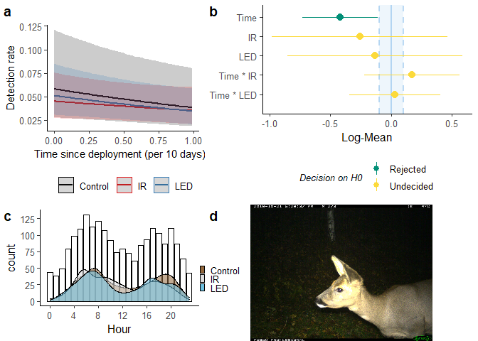
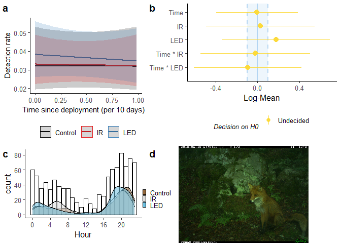
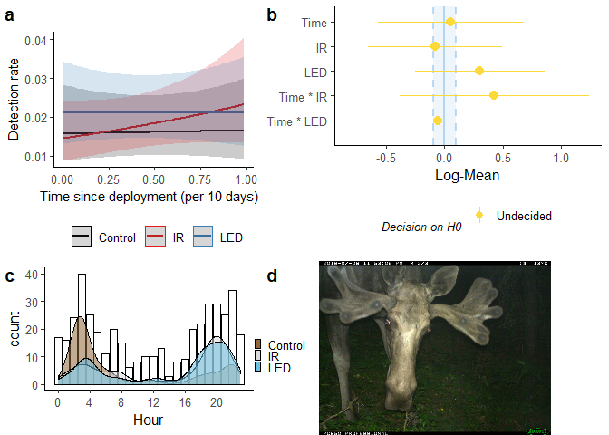
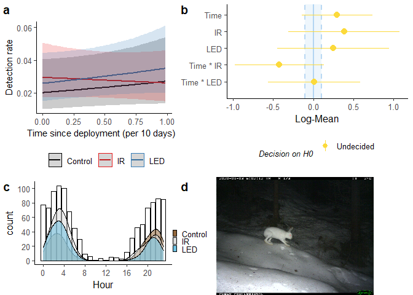
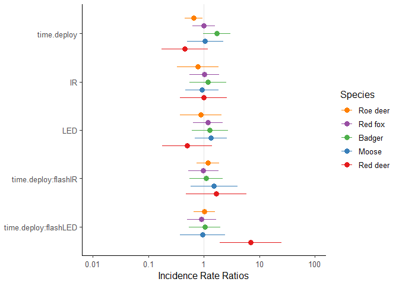

```r
library(tidyverse)
```

```
## -- Attaching packages --------------------------------------- tidyverse 1.3.0 --
```

```
## v ggplot2 3.3.3     v purrr   0.3.4
## v tibble  3.1.0     v dplyr   1.0.5
## v tidyr   1.1.3     v stringr 1.4.0
## v readr   1.4.0     v forcats 0.5.1
```

```
## -- Conflicts ------------------------------------------ tidyverse_conflicts() --
## x dplyr::filter() masks stats::filter()
## x dplyr::lag()    masks stats::lag()
```

```r
library(lme4)
```

```
## Loading required package: Matrix
```

```
## 
## Attaching package: 'Matrix'
```

```
## The following objects are masked from 'package:tidyr':
## 
##     expand, pack, unpack
```

```r
library(performance) # diagnostic-plots to check assumptions
library(report)      # Result-summaries in text-format
```

```
## report is in alpha - help us improve by reporting bugs on github.com/easystats/report/issues
```

```r
library(ggeffects)   # Estimated Marginal Means and Marginal Effects from Regression Models
                          # more at: https://strengejacke.github.io/ggeffects/
library(parameters)  # extract model-parameters etc. from (most) models
library(sjPlot)      # parameters + sjPlot probably does a similar and better job than ggeffects
library(see)         # plot-related package from the easystats-verse

# Data drom Data_exploration2_nesting.R
time.dep <- readRDS("timedep.rds")

ctrl <- c("Control_1", "Control_2", "Control_3","Control_4")
obs      <- readRDS("Observations_prepared1.rds") %>% 
  mutate(flash = ifelse(period %in% ctrl, "Control",flash))
obs <- obs %>% 
  mutate(species = validated_species,
         Hour = as.numeric(format(obs$datetime, "%H")), # for density-plots
         flash = factor(obs$flash, labels = c("IR", "LED","Control"))) # --||--
# Set global plot theme
theme_set(ggpubr::theme_classic2())
```

```
## Registered S3 methods overwritten by 'car':
##   method                          from
##   influence.merMod                lme4
##   cooks.distance.influence.merMod lme4
##   dfbeta.influence.merMod         lme4
##   dfbetas.influence.merMod        lme4
```

## Purpose

Remaking glmm_sp to test whether removing locations that never detected any individuals of each species. Bad formulation... For each species specific model, I removed the locations that never saw any individuals of said species.
And I did it to see if my models improved.

Rationale: Of course type of flash won't be able to predict any detection rate changes at cameras that never detected any individuals of a species.


### Formula
The model formula I will use is $n \sim \ time.deploy\ * flash $ for each species, and my $\alpha = 0.05$.


```r
sp <- c("raadyr", "rev", "hjort", "grevling", "elg", "gaupe", "ekorn", "hare", "maar")
ctrl <- c("Control_1", "Control_2", "Control_3","Control_4")
time.dep2 <- time.dep %>% 
  rename(species = validated_species) %>%  #shortening name
#  filter(species %in% sp) %>% #filtering out species
  # including Control as part of the flash-column, since it differs from flash=0
  mutate(flash = factor(
        ifelse(period %in% ctrl, "Control", flash)),
        week = lubridate::isoweek(date),
        period = factor(period))
time.dep2 <- time.dep2 %>% 
   mutate(flash = fct_relevel(flash, "Control","0","1")) # relevel to make Control the model intercept
levels(time.dep2$flash) <- c("Control", "IR", "LED")
levels(time.dep2$period) <- c("IR_1", "IR_2", "LED_1", "LED_2", "Control_1", "Control_2", "Control_3", "Control_4")
```


```r
# find median period length
time.period <- time.dep2 %>% group_by(loc, period, flash) %>% 
  summarise(period_length = max(time.deploy))

# checking shortest periods
time.period %>% arrange(period_length) # 1 period (LED) is 0 days
```

```
## # A tibble: 211 x 4
## # Groups:   loc, period [211]
##    loc   period    flash   period_length
##    <fct> <fct>     <fct>           <dbl>
##  1 829   LED_1     LED               0  
##  2 925   LED_1     LED               0.8
##  3 850   LED_2     LED               0.9
##  4 664   Control_2 Control           1.1
##  5 829   IR_2      IR                1.2
##  6 855   Control_3 Control           1.8
##  7 840   IR_1      IR                2.6
##  8 953   LED_2     LED               2.6
##  9 258   Control_1 Control           2.7
## 10 942   IR_1      IR                2.7
## # ... with 201 more rows
```

```r
# then merge lengths and filter out period of 0 days
time.dep3 <- time.dep2 %>% left_join(time.period) %>% 
  filter(period_length > 0)

# find median length 
time.period %>% filter(flash == "LED") %>%  
  summary() # median period length 85 days, mean: 84
```

```
##       loc           period       flash    period_length   
##  15     : 2   LED_1    :37   Control: 0   Min.   : 0.000  
##  127    : 2   LED_2    :32   IR     : 0   1st Qu.: 6.500  
##  193    : 2   IR_1     : 0   LED    :69   Median : 8.450  
##  231    : 2   IR_2     : 0                Mean   : 8.285  
##  257    : 2   Control_1: 0                3rd Qu.:11.000  
##  455    : 2   Control_2: 0                Max.   :13.200  
##  (Other):57   (Other)  : 0                NA's   :1
```

```r
time.period %>% filter(flash == "IR") %>%  
  summary() # median period length 79 days, mean: 89
```

```
##       loc           period       flash    period_length   
##  15     : 2   IR_1     :35   Control: 0   Min.   : 1.200  
##  127    : 2   IR_2     :35   IR     :70   1st Qu.: 6.600  
##  193    : 2   LED_1    : 0   LED    : 0   Median : 8.400  
##  231    : 2   LED_2    : 0                Mean   : 9.423  
##  257    : 2   Control_1: 0                3rd Qu.:12.500  
##  455    : 2   Control_2: 0                Max.   :19.600  
##  (Other):58   (Other)  : 0                NA's   :1
```

```r
# extract lengths of each unique period
h <- time.dep3 %>% group_by(loc, period, period_length, flash)%>% nest() %>% 
  select(!data) 
#extracting median and multiplying by 10, to use in the correctly scaled plot
hh <-       h$period_length[h$flash == "LED"] %>%  median()       # median white LED
hh <- c(hh, h$period_length[h$flash == "IR" ] %>%  median()) * 10 # + median IR
# smallest median 
h <- min(hh)
```


_Lastly, performing the filter:_

```r
habitat <- readRDS("habitat.rds") %>% 
  mutate(loc = factor(loc))
# filtering out periods longer than (shortest) median length.
time.dep4 <- time.dep3 %>% filter(time.deploy < h/10) %>%  # h is normal scale, must be rescaled by /10
  left_join(habitat, by = "loc") 
# time.dep5 <- time.dep4 %>% filter(loc[n.obs > 0])
```


# Modelling


## Roe deer


```r
# sp ="maar"
loc1 <- time.dep4$loc[time.dep4$n.obs > 0 & time.dep4$species %in% sp] %>% unique()
time_sp <- filter(time.dep4, species %in% sp, loc %in% loc1) #.dep4 = trimmed data
# time_sp <- filter(time.dep5, species %in% sp, !period %in% ctrl) #.dep5 = test-transformations
# Model
m_sp  <- lme4::glmer(n.obs ~ time.deploy * flash + # fixed effects
            (1 | loc) + (1 | week), # random effects
            data   = time_sp,
            family = poisson) # poisson family of distributions
# ggeffect calls effects::Effect
p_sp    <- ggeffects::ggeffect(m_sp, terms = c("time.deploy [all]", "flash"))
# Diagnostics
assumpt <- performance::check_model(m_sp) # check assumptions
```


```r
# Summary, report, model
summary(m_sp)
r_sp <- report::report(m_sp) # text-summary of my model, to include in a report
para_sp  <- model_parameters(m_sp,   standardize = "refit", two_sd = TRUE, exponentiate = TRUE)
# saveRDS(m_sp, file = paste0("m2_",sp,".rds")) # save model objects as shortcut for when editing etc.
```


```r
# sp ="maar"
loc1 <- time.dep4$loc[time.dep4$n.obs > 0 & time.dep4$species %in% sp] %>% unique()
time_sp <- filter(time.dep4, species %in% sp, loc %in% loc1) #.dep4 = trimmed data
# time_sp <- filter(time.dep5, species %in% sp, !period %in% ctrl) #.dep5 = test-transformations
# Model
m_sp  <- lme4::glmer(n.obs ~ time.deploy * flash + # fixed effects
            (1 | loc) + (1 | week), # random effects
            data   = time_sp,
            family = poisson) # poisson family of distributions
# ggeffect calls effects::Effect
p_sp    <- ggeffects::ggeffect(m_sp, terms = c("time.deploy [all]", "flash"))
# Diagnostics
assumpt <- performance::check_model(m_sp) # check assumptions
```


```r
# Summary, report, model
summary(m_sp)
```

```
## Generalized linear mixed model fit by maximum likelihood (Laplace
##   Approximation) [glmerMod]
##  Family: poisson  ( log )
## Formula: n.obs ~ time.deploy * flash + (1 | loc) + (1 | week)
##    Data: time_sp
## 
##      AIC      BIC   logLik deviance df.resid 
##   7685.6   7745.8  -3834.8   7669.6    13589 
## 
## Scaled residuals: 
##     Min      1Q  Median      3Q     Max 
## -1.1420 -0.2991 -0.1886 -0.1052 14.4688 
## 
## Random effects:
##  Groups Name        Variance Std.Dev.
##  week   (Intercept) 0.3112   0.5579  
##  loc    (Intercept) 1.6675   1.2913  
## Number of obs: 13597, groups:  week, 52; loc, 47
## 
## Fixed effects:
##                       Estimate Std. Error z value Pr(>|z|)    
## (Intercept)          -2.845002   0.375683  -7.573 3.65e-14 ***
## time.deploy          -0.050346   0.022439  -2.244   0.0249 *  
## flashIR              -0.258452   0.439949  -0.587   0.5569    
## flashLED             -0.133521   0.438404  -0.305   0.7607    
## time.deploy:flashIR   0.020254   0.028440   0.712   0.4764    
## time.deploy:flashLED  0.003374   0.027095   0.125   0.9009    
## ---
## Signif. codes:  0 '***' 0.001 '**' 0.01 '*' 0.05 '.' 0.1 ' ' 1
## 
## Correlation of Fixed Effects:
##             (Intr) tm.dpl flshIR flsLED tm.:IR
## time.deploy -0.233                            
## flashIR     -0.801  0.146                     
## flashLED    -0.804  0.151  0.958              
## tm.dply:fIR  0.125 -0.556 -0.239 -0.101       
## tm.dply:LED  0.143 -0.627 -0.111 -0.228  0.435
```

```r
r_sp <- report::report(m_sp) # text-summary of my model, to include in a report
para_sp  <- model_parameters(m_sp,   standardize = "refit", two_sd = TRUE, exponentiate = TRUE)
# saveRDS(m_sp, file = paste0("m2_",sp,".rds")) # save model objects as shortcut for when editing etc.
```


## Roe deer plot


```r
# just a shortcut for editing
sp="raadyr"
m_sp <- readRDS("m_raadyr.rds")
p_sp <- ggeffects::ggeffect(m_sp, terms = c("time.deploy [all]", "flash"))
```


```r
library(cowplot) # to make grid-plots
```

```
## 
## Attaching package: 'cowplot'
```

```
## The following objects are masked from 'package:sjPlot':
## 
##     plot_grid, save_plot
```

```
## The following object is masked from 'package:ggeffects':
## 
##     get_title
```

```r
library(magick)
```

```
## Linking to ImageMagick 6.9.11.57
## Enabled features: cairo, freetype, fftw, ghostscript, heic, lcms, pango, raw, rsvg, webp
## Disabled features: fontconfig, x11
```

```r
# ggpredict
p_sp1 <- plot(p_sp, ci.style = c("dash"), line.size = 1, #ci.styles: “ribbon”, “errorbar”, “dash”, “dot”
               colors = c("black","#e41a1c","#377eb8"),
              ) +
   labs(title="", x="Time since deployment (per 10 days) \ ", y="Detection rate") +
   ggpubr::theme_classic2() +
  theme(legend.position = "bottom", legend.title = element_blank(),
        axis.title = element_text(size = 11)) 

# standardized plots aren't very different, other than on the scale
#plot(para_sp, size_text = 3) + labs(title = paste0(sp, " GLMM parameters") ,
#                                    subtitle = 'standardize  = "refit" ')

# Equivalence test
result <- equivalence_test(m_sp)
result
```

```
## # TOST-test for Practical Equivalence
## 
##   ROPE: [-0.10 0.10]
## 
##                  Parameter        H0 inside ROPE        90% CI
##                (Intercept)  Rejected      0.00 % [-3.46 -2.23]
##                time.deploy  Accepted    100.00 % [-0.09 -0.01]
##                 flash [IR] Undecided     13.82 % [-0.98  0.47]
##                flash [LED] Undecided     13.87 % [-0.85  0.59]
##   time.deploy * flash [IR]  Accepted    100.00 % [-0.03  0.07]
##  time.deploy * flash [LED]  Accepted    100.00 % [-0.04  0.05]
```

```r
# labels for equivalence test - prettier to the human eye
par_lab <- c("Time", "IR", "LED", "Time * IR", "Time * LED")
par_lab <- par_lab[5:1]
# Equivalence plot
p_eq <- plot(result) + labs(y = "Log-Mean") + 
    scale_x_discrete(labels = par_lab) + # new axis names
    guides(colour = guide_legend(nrow = 2, override.aes = list(size = .5),
                                 title.theme = element_text( 
                                   size=10, #adjusting legend appearance
                                   face="italic"))) 
```

```
## Scale for 'x' is already present. Adding another scale for 'x', which will
## replace the existing scale.
```

```r
# Density plots
p_dens <- obs %>% filter(species %in% sp) %>% 
  mutate(flash = fct_shift(flash,-1)) %>% #reordering flash-factor
  ggplot(aes(Hour)) +
  geom_bar(col="black", fill="white") +
  geom_density(aes(y=..density..*20*count, #scaling density with the count
                   fill=flash, alpha=.1),
               show.legend = c(alpha = F), bw=1.2) +
  scale_x_continuous(breaks = seq(0,23, by=4)) + # which x-ticks
  scale_y_continuous(n.breaks = 6) + # n y-ticks
  theme(legend.position = c(1, 1), legend.justification = c(.1, 2), #legend placement
        legend.title = element_blank(), legend.key.size = unit(2, 'mm'))+ #size
  scale_fill_bluebrown(reverse = T) 


# cowplot::plot_grid(NULL,p_eq,p_dens,NULL,
#                    #nrow = 2,
#                    # rel_widths = c(3,4),
#                    rel_heights = c(3,2),
#                    labels="auto"
#                    #align = "h"
# )


sp_file <- paste0("jpg/",sp,".JPG")
jpg <- ggdraw() + draw_image(sp_file)

p_grid <- cowplot::plot_grid(p_sp1,
                             p_eq,
                             p_dens,
                             jpg,
                   #nrow = 2,
                   rel_widths = c(3,4),
                   rel_heights = c(3,2),
                   labels="auto"
                   #align = "h"
) 
p_grid #+ draw_image(sp_file, scale = .4, x = 0.9,
```

<!-- -->

```r
       #  hjust = 1, halign = 1, valign = 0)
```


```r
summary(r_sp)
```

```
## We fitted a poisson mixed model to predict n.obs with time.deploy and flash. The model included loc and week as random effects. The model's total explanatory power is substantial (conditional R2 = 0.38) and the part related to the fixed effects alone (marginal R2) is of 2.97e-03. The model's intercept is at -2.85 (95% CI [-3.58, -2.11]). Within this model:
## 
##   - The effect of time.deploy is significantly negative (beta = -0.05, 95% CI [-0.09, -6.37e-03], p < .05, Std. beta = -0.12)
##   - The effect of flash [IR] is non-significantly negative (beta = -0.26, 95% CI [-1.12, 0.60], p = 0.557, Std. beta = -0.18)
##   - The effect of flash [LED] is non-significantly negative (beta = -0.13, 95% CI [-0.99, 0.73], p = 0.761, Std. beta = -0.12)
##   - The interaction effect of flash [IR] on time.deploy is non-significantly positive (beta = 0.02, 95% CI [-0.04, 0.08], p = 0.476, Std. beta = 0.05)
##   - The interaction effect of flash [LED] on time.deploy is non-significantly positive (beta = 3.37e-03, 95% CI [-0.05, 0.06], p = 0.901, Std. beta = 7.96e-03)
```

```r
as.report_table(r_sp)
```

```
## Parameter                 | Coefficient |         95% CI |     z |  df |      p | Std. Coef. | Std. Coef. 95% CI |      Fit
## ---------------------------------------------------------------------------------------------------------------------------
## (Intercept)               |       -2.85 | [-3.58, -2.11] | -7.57 | Inf | < .001 |      -3.04 |    [-3.76, -2.32] |         
## time.deploy               |       -0.05 | [-0.09, -0.01] | -2.24 | Inf | 0.025  |      -0.12 |    [-0.22, -0.02] |         
## flash [IR]                |       -0.26 | [-1.12,  0.60] | -0.59 | Inf | 0.557  |      -0.18 |    [-1.02,  0.66] |         
## flash [LED]               |       -0.13 | [-0.99,  0.73] | -0.30 | Inf | 0.761  |      -0.12 |    [-0.96,  0.72] |         
## time.deploy * flash [IR]  |        0.02 | [-0.04,  0.08] |  0.71 | Inf | 0.476  |       0.05 |    [-0.08,  0.18] |         
## time.deploy * flash [LED] |    3.37e-03 | [-0.05,  0.06] |  0.12 | Inf | 0.901  |   7.96e-03 |    [-0.12,  0.13] |         
##                           |             |                |       |     |        |            |                   |         
## AIC                       |             |                |       |     |        |            |                   |  7685.62
## BIC                       |             |                |       |     |        |            |                   |  7745.76
## R2 (conditional)          |             |                |       |     |        |            |                   |     0.38
## R2 (marginal)             |             |                |       |     |        |            |                   | 2.97e-03
## Sigma                     |             |                |       |     |        |            |                   |     1.00
```


```r
# Storing species-specific objects for later
# Model
m_raa    = m_sp
# ggpredict 
p_raa    = p_sp
# report-object
r_raa    = r_sp
# parameters refit
para_raa = para_sp
```


sp
sp-report
sp-report2
parameters

objects


#### Skrivestopp

-------------------------------------------------------------

## Red Fox


```r
# sp ="maar"
loc1 <- time.dep4$loc[time.dep4$n.obs > 0 & time.dep4$species %in% sp] %>% unique()
time_sp <- filter(time.dep4, species %in% sp, loc %in% loc1) #.dep4 = trimmed data
# time_sp <- filter(time.dep5, species %in% sp, !period %in% ctrl) #.dep5 = test-transformations
# Model
m_sp  <- lme4::glmer(n.obs ~ time.deploy * flash + # fixed effects
            (1 | loc) + (1 | week), # random effects
            data   = time_sp,
            family = poisson) # poisson family of distributions
# ggeffect calls effects::Effect
p_sp    <- ggeffects::ggeffect(m_sp, terms = c("time.deploy [all]", "flash"))
# Diagnostics
assumpt <- performance::check_model(m_sp) # check assumptions
# Summary, report, model
summary(m_sp)
```

```
## Generalized linear mixed model fit by maximum likelihood (Laplace
##   Approximation) [glmerMod]
##  Family: poisson  ( log )
## Formula: n.obs ~ time.deploy * flash + (1 | loc) + (1 | week)
##    Data: time_sp
## 
##      AIC      BIC   logLik deviance df.resid 
##   5740.1   5801.2  -2862.1   5724.1    15241 
## 
## Scaled residuals: 
##     Min      1Q  Median      3Q     Max 
## -0.6332 -0.2445 -0.1816 -0.1298 13.0526 
## 
## Random effects:
##  Groups Name        Variance Std.Dev.
##  loc    (Intercept) 0.74933  0.8656  
##  week   (Intercept) 0.07133  0.2671  
## Number of obs: 15249, groups:  loc, 53; week, 52
## 
## Fixed effects:
##                        Estimate Std. Error z value Pr(>|z|)    
## (Intercept)          -3.4391866  0.2565890 -13.403   <2e-16 ***
## time.deploy          -0.0005472  0.0282401  -0.019    0.985    
## flashIR               0.0294434  0.3151412   0.093    0.926    
## flashLED              0.1764789  0.3136447   0.563    0.574    
## time.deploy:flashIR  -0.0024082  0.0378228  -0.064    0.949    
## time.deploy:flashLED -0.0111628  0.0370606  -0.301    0.763    
## ---
## Signif. codes:  0 '***' 0.001 '**' 0.01 '*' 0.05 '.' 0.1 ' ' 1
## 
## Correlation of Fixed Effects:
##             (Intr) tm.dpl flshIR flsLED tm.:IR
## time.deploy -0.442                            
## flashIR     -0.776  0.326                     
## flashLED    -0.782  0.335  0.860              
## tm.dply:fIR  0.289 -0.653 -0.472 -0.244       
## tm.dply:LED  0.302 -0.682 -0.248 -0.467  0.504
```

```r
r_sp <- report::report(m_sp) # text-summary of my model, to include in a report
para_sp  <- model_parameters(m_sp,   standardize = "refit", two_sd = TRUE, exponentiate = TRUE)
# saveRDS(m_sp, file = paste0("m2_",sp,".rds")) # save model objects as shortcut for when editing etc.
```
### Plot


```r
summary(r_sp)
```

```
## We fitted a poisson mixed model to predict n.obs with time.deploy and flash. The model included loc and week as random effects. The model's total explanatory power is moderate (conditional R2 = 0.19) and the part related to the fixed effects alone (marginal R2) is of 8.63e-04. The model's intercept is at -3.44 (95% CI [-3.94, -2.94]). Within this model:
## 
##   - The effect of time.deploy is non-significantly negative (beta = -5.47e-04, 95% CI [-0.06, 0.05], p = 0.985, Std. beta = -1.29e-03)
##   - The effect of flash [IR] is non-significantly positive (beta = 0.03, 95% CI [-0.59, 0.65], p = 0.926, Std. beta = 0.02)
##   - The effect of flash [LED] is non-significantly positive (beta = 0.18, 95% CI [-0.44, 0.79], p = 0.574, Std. beta = 0.13)
##   - The interaction effect of flash [IR] on time.deploy is non-significantly negative (beta = -2.41e-03, 95% CI [-0.08, 0.07], p = 0.949, Std. beta = -5.69e-03)
##   - The interaction effect of flash [LED] on time.deploy is non-significantly negative (beta = -0.01, 95% CI [-0.08, 0.06], p = 0.763, Std. beta = -0.03)
```

```r
as.report_table(r_sp)
```

```
## Parameter                 | Coefficient |         95% CI |      z |  df |      p | Std. Coef. | Std. Coef. 95% CI |      Fit
## ----------------------------------------------------------------------------------------------------------------------------
## (Intercept)               |       -3.44 | [-3.94, -2.94] | -13.40 | Inf | < .001 |      -3.44 |    [-3.89, -2.99] |         
## time.deploy               |   -5.47e-04 | [-0.06,  0.05] |  -0.02 | Inf | 0.985  |  -1.29e-03 |    [-0.13,  0.13] |         
## flash [IR]                |        0.03 | [-0.59,  0.65] |   0.09 | Inf | 0.926  |       0.02 |    [-0.52,  0.56] |         
## flash [LED]               |        0.18 | [-0.44,  0.79] |   0.56 | Inf | 0.574  |       0.13 |    [-0.41,  0.68] |         
## time.deploy * flash [IR]  |   -2.41e-03 | [-0.08,  0.07] |  -0.06 | Inf | 0.949  |  -5.69e-03 |    [-0.18,  0.17] |         
## time.deploy * flash [LED] |       -0.01 | [-0.08,  0.06] |  -0.30 | Inf | 0.763  |      -0.03 |    [-0.20,  0.15] |         
##                           |             |                |        |     |        |            |                   |         
## AIC                       |             |                |        |     |        |            |                   |  5740.11
## BIC                       |             |                |        |     |        |            |                   |  5801.17
## R2 (conditional)          |             |                |        |     |        |            |                   |     0.19
## R2 (marginal)             |             |                |        |     |        |            |                   | 8.63e-04
## Sigma                     |             |                |        |     |        |            |                   |     1.00
```

```r
library(cowplot) # to make grid-plots
library(magick)
# ggpredict
p_sp1 <- plot(p_sp, ci.style = c("dash"), line.size = 1, #ci.styles: “ribbon”, “errorbar”, “dash”, “dot”
               colors = c("black","#e41a1c","#377eb8"),
              ) +
   labs(title="", x="Time since deployment (per 10 days) \ ", y="Detection rate") +
   ggpubr::theme_classic2() +
  theme(legend.position = "bottom", legend.title = element_blank(),
        axis.title = element_text(size = 11)) 

# standardized plots aren't very different, other than on the scale
#plot(para_sp, size_text = 3) + labs(title = paste0(sp, " GLMM parameters") ,
#                                    subtitle = 'standardize  = "refit" ')

# Equivalence test
result <- equivalence_test(m_sp)
result
```

```
## # TOST-test for Practical Equivalence
## 
##   ROPE: [-0.10 0.10]
## 
##                  Parameter        H0 inside ROPE        90% CI
##                (Intercept)  Rejected      0.00 % [-3.86 -3.02]
##                time.deploy  Accepted    100.00 % [-0.05  0.05]
##                 flash [IR] Undecided     19.29 % [-0.49  0.55]
##                flash [LED] Undecided     19.38 % [-0.34  0.69]
##   time.deploy * flash [IR]  Accepted    100.00 % [-0.06  0.06]
##  time.deploy * flash [LED]  Accepted    100.00 % [-0.07  0.05]
```

```r
# labels for equivalence test - prettier to the human eye
par_lab <- c("Time", "IR", "LED", "Time * IR", "Time * LED")
par_lab <- par_lab[5:1]
# Equivalence plot
p_eq <- plot(result) + labs(y = "Log-Mean") + 
    scale_x_discrete(labels = par_lab) + # new axis names
    guides(colour = guide_legend(nrow = 2, override.aes = list(size = .5),
                                 title.theme = element_text( 
                                   size=10, #adjusting legend appearance
                                   face="italic"))) 
```

```
## Scale for 'x' is already present. Adding another scale for 'x', which will
## replace the existing scale.
```

```r
# Density plots
p_dens <- obs %>% filter(species %in% sp) %>% 
  mutate(flash = fct_shift(flash,-1)) %>% #reordering flash-factor
  ggplot(aes(Hour)) +
  geom_bar(col="black", fill="white") +
  geom_density(aes(y=..density..*20*count, #scaling density with the count
                   fill=flash, alpha=.1),
               show.legend = c(alpha = F), bw=1.2) +
  scale_x_continuous(breaks = seq(0,23, by=4)) + # which x-ticks
  scale_y_continuous(n.breaks = 6) + # n y-ticks
  theme(legend.position = c(1, 1), legend.justification = c(.1, 2), #legend placement
        legend.title = element_blank(), legend.key.size = unit(2, 'mm'))+ #size
  scale_fill_bluebrown(reverse = T) 


# cowplot::plot_grid(NULL,p_eq,p_dens,NULL,
#                    #nrow = 2,
#                    # rel_widths = c(3,4),
#                    rel_heights = c(3,2),
#                    labels="auto"
#                    #align = "h"
# )


sp_file <- paste0("jpg/",sp,".JPG")
jpg <- ggdraw() + draw_image(sp_file)

p_grid <- cowplot::plot_grid(p_sp1,
                             p_eq,
                             p_dens,
                             jpg,
                   #nrow = 2,
                   rel_widths = c(3,4),
                   rel_heights = c(3,2),
                   labels="auto"
                   #align = "h"
) 
p_grid #+ draw_image(sp_file, scale = .4, x = 0.9,
```

<!-- -->

```r
       #  hjust = 1, halign = 1, valign = 0)
```


```r
# Model
m_rev    = m_sp
# ggpredict 
p_rev    = p_sp
# report-object
r_rev    = r_sp
# parameters refit
para_rev = para_sp
```


```{r knit-exit, eval=TRUE
}
knitr::knit_exit() # to exit knitting process here instead of at the document end
```


## Badger


```r
# sp ="maar"
loc1 <- time.dep4$loc[time.dep4$n.obs > 0 & time.dep4$species %in% sp] %>% unique()
time_sp <- filter(time.dep4, species %in% sp, loc %in% loc1) #.dep4 = trimmed data
# time_sp <- filter(time.dep5, species %in% sp, !period %in% ctrl) #.dep5 = test-transformations
# Model
m_sp  <- lme4::glmer(n.obs ~ time.deploy * flash + # fixed effects
            (1 | loc) + (1 | week), # random effects
            data   = time_sp,
            family = poisson) # poisson family of distributions
# ggeffect calls effects::Effect
p_sp    <- ggeffects::ggeffect(m_sp, terms = c("time.deploy [all]", "flash"))
# Diagnostics
assumpt <- performance::check_model(m_sp) # check assumptions
# Summary, report, model
summary(m_sp)
```

```
## Generalized linear mixed model fit by maximum likelihood (Laplace
##   Approximation) [glmerMod]
##  Family: poisson  ( log )
## Formula: n.obs ~ time.deploy * flash + (1 | loc) + (1 | week)
##    Data: time_sp
## 
##      AIC      BIC   logLik deviance df.resid 
##   4728.3   4788.6  -2356.1   4712.3    13890 
## 
## Scaled residuals: 
##     Min      1Q  Median      3Q     Max 
## -1.1151 -0.2166 -0.1326 -0.0764 28.2591 
## 
## Random effects:
##  Groups Name        Variance Std.Dev.
##  week   (Intercept) 1.60     1.265   
##  loc    (Intercept) 1.01     1.005   
## Number of obs: 13898, groups:  week, 52; loc, 48
## 
## Fixed effects:
##                       Estimate Std. Error z value Pr(>|z|)    
## (Intercept)          -4.489893   0.370455 -12.120   <2e-16 ***
## time.deploy           0.063753   0.034385   1.854   0.0637 .  
## flashIR               0.171324   0.386347   0.443   0.6574    
## flashLED              0.244428   0.382821   0.638   0.5232    
## time.deploy:flashIR   0.011448   0.041787   0.274   0.7841    
## time.deploy:flashLED  0.004346   0.040130   0.108   0.9138    
## ---
## Signif. codes:  0 '***' 0.001 '**' 0.01 '*' 0.05 '.' 0.1 ' ' 1
## 
## Correlation of Fixed Effects:
##             (Intr) tm.dpl flshIR flsLED tm.:IR
## time.deploy -0.416                            
## flashIR     -0.685  0.340                     
## flashLED    -0.694  0.351  0.882              
## tm.dply:fIR  0.269 -0.638 -0.480 -0.266       
## tm.dply:LED  0.294 -0.693 -0.277 -0.471  0.537
```

```r
r_sp <- report::report(m_sp) # text-summary of my model, to include in a report
para_sp  <- model_parameters(m_sp,   standardize = "refit", two_sd = TRUE, exponentiate = TRUE)
```

```
## Warning in checkConv(attr(opt, "derivs"), opt$par, ctrl = control$checkConv, :
## Model failed to converge with max|grad| = 0.00454548 (tol = 0.002, component 1)
```

```r
# saveRDS(m_sp, file = paste0("m2_",sp,".rds")) # save model objects as shortcut for when editing etc.
```

### Plot


```r
summary(r_sp)
```

```
## We fitted a poisson mixed model to predict n.obs with time.deploy and flash. The model included loc and week as random effects. The model's total explanatory power is substantial (conditional R2 = 0.39) and the part related to the fixed effects alone (marginal R2) is of 5.65e-03. The model's intercept is at -4.49 (95% CI [-5.22, -3.76]). Within this model:
## 
##   - The effect of time.deploy is non-significantly positive (beta = 0.06, 95% CI [-3.64e-03, 0.13], p = 0.064, Std. beta = 0.15)
##   - The effect of flash [IR] is non-significantly positive (beta = 0.17, 95% CI [-0.59, 0.93], p = 0.657, Std. beta = 0.22)
##   - The effect of flash [LED] is non-significantly positive (beta = 0.24, 95% CI [-0.51, 0.99], p = 0.523, Std. beta = 0.26)
##   - The interaction effect of flash [IR] on time.deploy is non-significantly positive (beta = 0.01, 95% CI [-0.07, 0.09], p = 0.784, Std. beta = 0.03)
##   - The interaction effect of flash [LED] on time.deploy is non-significantly positive (beta = 4.35e-03, 95% CI [-0.07, 0.08], p = 0.914, Std. beta = 0.01)
```

```r
as.report_table(r_sp)
```

```
## Parameter                 | Coefficient |         95% CI |      z |  df |      p | Std. Coef. | Std. Coef. 95% CI |      Fit
## ----------------------------------------------------------------------------------------------------------------------------
## (Intercept)               |       -4.49 | [-5.22, -3.76] | -12.12 | Inf | < .001 |      -4.24 |    [-4.90, -3.58] |         
## time.deploy               |        0.06 | [ 0.00,  0.13] |   1.85 | Inf | 0.064  |       0.15 |    [-0.01,  0.31] |         
## flash [IR]                |        0.17 | [-0.59,  0.93] |   0.44 | Inf | 0.657  |       0.22 |    [-0.45,  0.88] |         
## flash [LED]               |        0.24 | [-0.51,  0.99] |   0.64 | Inf | 0.523  |       0.26 |    [-0.40,  0.93] |         
## time.deploy * flash [IR]  |        0.01 | [-0.07,  0.09] |   0.27 | Inf | 0.784  |       0.03 |    [-0.17,  0.22] |         
## time.deploy * flash [LED] |    4.35e-03 | [-0.07,  0.08] |   0.11 | Inf | 0.914  |       0.01 |    [-0.18,  0.20] |         
##                           |             |                |        |     |        |            |                   |         
## AIC                       |             |                |        |     |        |            |                   |  4728.27
## BIC                       |             |                |        |     |        |            |                   |  4788.59
## R2 (conditional)          |             |                |        |     |        |            |                   |     0.39
## R2 (marginal)             |             |                |        |     |        |            |                   | 5.65e-03
## Sigma                     |             |                |        |     |        |            |                   |     1.00
```

```r
library(cowplot) # to make grid-plots
library(magick)
# ggpredict
p_sp1 <- plot(p_sp, ci.style = c("dash"), line.size = 1, #ci.styles: “ribbon”, “errorbar”, “dash”, “dot”
               colors = c("black","#e41a1c","#377eb8"),
              ) +
   labs(title="", x="Time since deployment (per 10 days) \ ", y="Detection rate") +
   ggpubr::theme_classic2() +
  theme(legend.position = "bottom", legend.title = element_blank(),
        axis.title = element_text(size = 11)) 

# standardized plots aren't very different, other than on the scale
#plot(para_sp, size_text = 3) + labs(title = paste0(sp, " GLMM parameters") ,
#                                    subtitle = 'standardize  = "refit" ')

# Equivalence test
result <- equivalence_test(m_sp)
result
```

```
## # TOST-test for Practical Equivalence
## 
##   ROPE: [-0.10 0.10]
## 
##                  Parameter        H0 inside ROPE        90% CI
##                (Intercept)  Rejected      0.00 % [-5.10 -3.88]
##                time.deploy  Rejected     82.04 % [ 0.01  0.12]
##                 flash [IR] Undecided     15.74 % [-0.46  0.81]
##                flash [LED] Undecided     15.88 % [-0.39  0.87]
##   time.deploy * flash [IR]  Accepted    100.00 % [-0.06  0.08]
##  time.deploy * flash [LED]  Accepted    100.00 % [-0.06  0.07]
```

```r
# labels for equivalence test - prettier to the human eye
par_lab <- c("Time", "IR", "LED", "Time * IR", "Time * LED")
par_lab <- par_lab[5:1]
# Equivalence plot
p_eq <- plot(result) + labs(y = "Log-Mean") + 
    scale_x_discrete(labels = par_lab) + # new axis names
    guides(colour = guide_legend(nrow = 2, override.aes = list(size = .5),
                                 title.theme = element_text( 
                                   size=10, #adjusting legend appearance
                                   face="italic"))) 
```

```
## Scale for 'x' is already present. Adding another scale for 'x', which will
## replace the existing scale.
```

```r
# Density plots
p_dens <- obs %>% filter(species %in% sp) %>% 
  mutate(flash = fct_shift(flash,-1)) %>% #reordering flash-factor
  ggplot(aes(Hour)) +
  geom_bar(col="black", fill="white") +
  geom_density(aes(y=..density..*20*count, #scaling density with the count
                   fill=flash, alpha=.1),
               show.legend = c(alpha = F), bw=1.2) +
  scale_x_continuous(breaks = seq(0,23, by=4)) + # which x-ticks
  scale_y_continuous(n.breaks = 6) + # n y-ticks
  theme(legend.position = c(1, 1), legend.justification = c(.1, 2), #legend placement
        legend.title = element_blank(), legend.key.size = unit(2, 'mm'))+ #size
  scale_fill_bluebrown(reverse = T) 


# cowplot::plot_grid(NULL,p_eq,p_dens,NULL,
#                    #nrow = 2,
#                    # rel_widths = c(3,4),
#                    rel_heights = c(3,2),
#                    labels="auto"
#                    #align = "h"
# )


sp_file <- paste0("jpg/",sp,".JPG")
jpg <- ggdraw() + draw_image(sp_file)

p_grid <- cowplot::plot_grid(p_sp1,
                             p_eq,
                             p_dens,
                             jpg,
                   #nrow = 2,
                   rel_widths = c(3,4),
                   rel_heights = c(3,2),
                   labels="auto"
                   #align = "h"
) 
p_grid #+ draw_image(sp_file, scale = .4, x = 0.9,
```

<!-- -->

```r
       #  hjust = 1, halign = 1, valign = 0)
```


```r
# Model
m_grvl    = m_sp
# ggpredict 
p_grvl    = p_sp
# report-object
r_grvl    = r_sp
# parameters refit
para_grvl = para_sp
```


## Moose


```r
# sp ="maar"
loc1 <- time.dep4$loc[time.dep4$n.obs > 0 & time.dep4$species %in% sp] %>% unique()
time_sp <- filter(time.dep4, species %in% sp, loc %in% loc1) #.dep4 = trimmed data
# time_sp <- filter(time.dep5, species %in% sp, !period %in% ctrl) #.dep5 = test-transformations
# Model
m_sp  <- lme4::glmer(n.obs ~ time.deploy * flash + # fixed effects
            (1 | loc) + (1 | week), # random effects
            data   = time_sp,
            family = poisson) # poisson family of distributions
# ggeffect calls effects::Effect
p_sp    <- ggeffects::ggeffect(m_sp, terms = c("time.deploy [all]", "flash"))
# Diagnostics
assumpt <- performance::check_model(m_sp) # check assumptions
# Summary, report, model
summary(m_sp)
```

```
## Generalized linear mixed model fit by maximum likelihood (Laplace
##   Approximation) [glmerMod]
##  Family: poisson  ( log )
## Formula: n.obs ~ time.deploy * flash + (1 | loc) + (1 | week)
##    Data: time_sp
## 
##      AIC      BIC   logLik deviance df.resid 
##   2956.3   3015.4  -1470.2   2940.3    11943 
## 
## Scaled residuals: 
##     Min      1Q  Median      3Q     Max 
## -0.4229 -0.1843 -0.1363 -0.1026 17.4246 
## 
## Random effects:
##  Groups Name        Variance Std.Dev.
##  week   (Intercept) 0.5270   0.7260  
##  loc    (Intercept) 0.4014   0.6335  
## Number of obs: 11951, groups:  week, 52; loc, 41
## 
## Fixed effects:
##                       Estimate Std. Error z value Pr(>|z|)    
## (Intercept)          -4.153451   0.302125 -13.747   <2e-16 ***
## time.deploy           0.006304   0.045516   0.138    0.890    
## flashIR              -0.081991   0.349354  -0.235    0.814    
## flashLED              0.301856   0.338919   0.891    0.373    
## time.deploy:flashIR   0.050860   0.059004   0.862    0.389    
## time.deploy:flashLED -0.006982   0.056859  -0.123    0.902    
## ---
## Signif. codes:  0 '***' 0.001 '**' 0.01 '*' 0.05 '.' 0.1 ' ' 1
## 
## Correlation of Fixed Effects:
##             (Intr) tm.dpl flshIR flsLED tm.:IR
## time.deploy -0.626                            
## flashIR     -0.680  0.462                     
## flashLED    -0.712  0.485  0.746              
## tm.dply:fIR  0.372 -0.629 -0.670 -0.357       
## tm.dply:LED  0.431 -0.703 -0.384 -0.655  0.529
```

```r
r_sp <- report::report(m_sp) # text-summary of my model, to include in a report
para_sp  <- model_parameters(m_sp,   standardize = "refit", two_sd = TRUE, exponentiate = TRUE)
# saveRDS(m_sp, file = paste0("m2_",sp,".rds")) # save model objects as shortcut for when editing etc.
```

### Plot


```r
summary(r_sp)
```

```
## We fitted a poisson mixed model to predict n.obs with time.deploy and flash. The model included loc and week as random effects. The model's total explanatory power is moderate (conditional R2 = 0.19) and the part related to the fixed effects alone (marginal R2) is of 3.72e-03. The model's intercept is at -4.15 (95% CI [-4.75, -3.56]). Within this model:
## 
##   - The effect of time.deploy is non-significantly positive (beta = 6.30e-03, 95% CI [-0.08, 0.10], p = 0.890, Std. beta = 0.01)
##   - The effect of flash [IR] is non-significantly negative (beta = -0.08, 95% CI [-0.77, 0.60], p = 0.814, Std. beta = 0.12)
##   - The effect of flash [LED] is non-significantly positive (beta = 0.30, 95% CI [-0.36, 0.97], p = 0.373, Std. beta = 0.27)
##   - The interaction effect of flash [IR] on time.deploy is non-significantly positive (beta = 0.05, 95% CI [-0.06, 0.17], p = 0.389, Std. beta = 0.12)
##   - The interaction effect of flash [LED] on time.deploy is non-significantly negative (beta = -6.98e-03, 95% CI [-0.12, 0.10], p = 0.902, Std. beta = -0.02)
```

```r
as.report_table(r_sp)
```

```
## Parameter                 | Coefficient |         95% CI |      z |  df |      p | Std. Coef. | Std. Coef. 95% CI |      Fit
## ----------------------------------------------------------------------------------------------------------------------------
## (Intercept)               |       -4.15 | [-4.75, -3.56] | -13.75 | Inf | < .001 |      -4.13 |    [-4.59, -3.67] |         
## time.deploy               |    6.30e-03 | [-0.08,  0.10] |   0.14 | Inf | 0.890  |       0.01 |    [-0.20,  0.23] |         
## flash [IR]                |       -0.08 | [-0.77,  0.60] |  -0.23 | Inf | 0.814  |       0.12 |    [-0.39,  0.62] |         
## flash [LED]               |        0.30 | [-0.36,  0.97] |   0.89 | Inf | 0.373  |       0.27 |    [-0.23,  0.78] |         
## time.deploy * flash [IR]  |        0.05 | [-0.06,  0.17] |   0.86 | Inf | 0.389  |       0.12 |    [-0.15,  0.39] |         
## time.deploy * flash [LED] |   -6.98e-03 | [-0.12,  0.10] |  -0.12 | Inf | 0.902  |      -0.02 |    [-0.28,  0.25] |         
##                           |             |                |        |     |        |            |                   |         
## AIC                       |             |                |        |     |        |            |                   |  2956.30
## BIC                       |             |                |        |     |        |            |                   |  3015.41
## R2 (conditional)          |             |                |        |     |        |            |                   |     0.19
## R2 (marginal)             |             |                |        |     |        |            |                   | 3.72e-03
## Sigma                     |             |                |        |     |        |            |                   |     1.00
```

```r
library(cowplot) # to make grid-plots
library(magick)
# ggpredict
p_sp1 <- plot(p_sp, ci.style = c("dash"), line.size = 1, #ci.styles: “ribbon”, “errorbar”, “dash”, “dot”
               colors = c("black","#e41a1c","#377eb8"),
              ) +
   labs(title="", x="Time since deployment (per 10 days) \ ", y="Detection rate") +
   ggpubr::theme_classic2() +
  theme(legend.position = "bottom", legend.title = element_blank(),
        axis.title = element_text(size = 11)) 

# standardized plots aren't very different, other than on the scale
#plot(para_sp, size_text = 3) + labs(title = paste0(sp, " GLMM parameters") ,
#                                    subtitle = 'standardize  = "refit" ')

# Equivalence test
result <- equivalence_test(m_sp)
result
```

```
## # TOST-test for Practical Equivalence
## 
##   ROPE: [-0.10 0.10]
## 
##                  Parameter        H0 inside ROPE        90% CI
##                (Intercept)  Rejected      0.00 % [-4.65 -3.66]
##                time.deploy  Accepted    100.00 % [-0.07  0.08]
##                 flash [IR] Undecided     17.40 % [-0.66  0.49]
##                flash [LED] Undecided     17.94 % [-0.26  0.86]
##   time.deploy * flash [IR] Undecided     75.32 % [-0.05  0.15]
##  time.deploy * flash [LED] Undecided     99.73 % [-0.10  0.09]
```

```r
# labels for equivalence test - prettier to the human eye
par_lab <- c("Time", "IR", "LED", "Time * IR", "Time * LED")
par_lab <- par_lab[5:1]
# Equivalence plot
p_eq <- plot(result) + labs(y = "Log-Mean") + 
    scale_x_discrete(labels = par_lab) + # new axis names
    guides(colour = guide_legend(nrow = 2, override.aes = list(size = .5),
                                 title.theme = element_text( 
                                   size=10, #adjusting legend appearance
                                   face="italic"))) 
```

```
## Scale for 'x' is already present. Adding another scale for 'x', which will
## replace the existing scale.
```

```r
# Density plots
p_dens <- obs %>% filter(species %in% sp) %>% 
  mutate(flash = fct_shift(flash,-1)) %>% #reordering flash-factor
  ggplot(aes(Hour)) +
  geom_bar(col="black", fill="white") +
  geom_density(aes(y=..density..*20*count, #scaling density with the count
                   fill=flash, alpha=.1),
               show.legend = c(alpha = F), bw=1.2) +
  scale_x_continuous(breaks = seq(0,23, by=4)) + # which x-ticks
  scale_y_continuous(n.breaks = 6) + # n y-ticks
  theme(legend.position = c(1, 1), legend.justification = c(.1, 2), #legend placement
        legend.title = element_blank(), legend.key.size = unit(2, 'mm'))+ #size
  scale_fill_bluebrown(reverse = T) 


# cowplot::plot_grid(NULL,p_eq,p_dens,NULL,
#                    #nrow = 2,
#                    # rel_widths = c(3,4),
#                    rel_heights = c(3,2),
#                    labels="auto"
#                    #align = "h"
# )


sp_file <- paste0("jpg/",sp,".JPG")
jpg <- ggdraw() + draw_image(sp_file)

p_grid <- cowplot::plot_grid(p_sp1,
                             p_eq,
                             p_dens,
                             jpg,
                   #nrow = 2,
                   rel_widths = c(3,4),
                   rel_heights = c(3,2),
                   labels="auto"
                   #align = "h"
) 
p_grid #+ draw_image(sp_file, scale = .4, x = 0.9,
```

<!-- -->

```r
       #  hjust = 1, halign = 1, valign = 0)
```


```r
# Model
m_elg    = m_sp
# ggpredict 
p_elg    = p_sp
# report-object
r_elg    = r_sp
# parameters refit
para_elg = para_sp
```

## Red deer


```r
# sp ="maar"
loc1 <- time.dep4$loc[time.dep4$n.obs > 0 & time.dep4$species %in% sp] %>% unique()
time_sp <- filter(time.dep4, species %in% sp, loc %in% loc1) #.dep4 = trimmed data
# time_sp <- filter(time.dep5, species %in% sp, !period %in% ctrl) #.dep5 = test-transformations
# Model
m_sp  <- lme4::glmer(n.obs ~ time.deploy * flash + # fixed effects
            (1 | loc) + (1 | week), # random effects
            data   = time_sp,
            family = poisson) # poisson family of distributions
# ggeffect calls effects::Effect
p_sp    <- ggeffects::ggeffect(m_sp, terms = c("time.deploy [all]", "flash"))
# Diagnostics
assumpt <- performance::check_model(m_sp) # check assumptions
# Summary, report, model
summary(m_sp)
```

```
## Generalized linear mixed model fit by maximum likelihood (Laplace
##   Approximation) [glmerMod]
##  Family: poisson  ( log )
## Formula: n.obs ~ time.deploy * flash + (1 | loc) + (1 | week)
##    Data: time_sp
## 
##      AIC      BIC   logLik deviance df.resid 
##   1743.4   1798.6   -863.7   1727.4     7336 
## 
## Scaled residuals: 
##     Min      1Q  Median      3Q     Max 
## -0.4840 -0.1774 -0.1283 -0.0927 16.1188 
## 
## Random effects:
##  Groups Name        Variance Std.Dev.
##  week   (Intercept) 0.2568   0.5067  
##  loc    (Intercept) 0.7147   0.8454  
## Number of obs: 7344, groups:  week, 52; loc, 26
## 
## Fixed effects:
##                       Estimate Std. Error z value Pr(>|z|)    
## (Intercept)          -3.891154   0.407582  -9.547  < 2e-16 ***
## time.deploy          -0.094938   0.058353  -1.627  0.10374    
## flashIR              -0.009873   0.498299  -0.020  0.98419    
## flashLED             -0.687348   0.526986  -1.304  0.19213    
## time.deploy:flashIR   0.061810   0.076779   0.805  0.42080    
## time.deploy:flashLED  0.231225   0.078062   2.962  0.00306 ** 
## ---
## Signif. codes:  0 '***' 0.001 '**' 0.01 '*' 0.05 '.' 0.1 ' ' 1
## 
## Correlation of Fixed Effects:
##             (Intr) tm.dpl flshIR flsLED tm.:IR
## time.deploy -0.509                            
## flashIR     -0.759  0.386                     
## flashLED    -0.738  0.388  0.767              
## tm.dply:fIR  0.344 -0.687 -0.555 -0.289       
## tm.dply:LED  0.373 -0.713 -0.302 -0.609  0.531
```

```r
r_sp <- report::report(m_sp) # text-summary of my model, to include in a report
para_sp  <- model_parameters(m_sp,   standardize = "refit", two_sd = TRUE, exponentiate = TRUE)
# saveRDS(m_sp, file = paste0("m2_",sp,".rds")) # save model objects as shortcut for when editing etc.
```

### Plot


```r
summary(r_sp)
```

```
## We fitted a poisson mixed model to predict n.obs with time.deploy and flash. The model included loc and week as random effects. The model's total explanatory power is moderate (conditional R2 = 0.20) and the part related to the fixed effects alone (marginal R2) is of 0.01. The model's intercept is at -3.89 (95% CI [-4.69, -3.09]). Within this model:
## 
##   - The effect of time.deploy is non-significantly negative (beta = -0.09, 95% CI [-0.21, 0.02], p = 0.104, Std. beta = -0.22)
##   - The effect of flash [IR] is non-significantly negative (beta = -9.87e-03, 95% CI [-0.99, 0.97], p = 0.984, Std. beta = 0.23)
##   - The effect of flash [LED] is non-significantly negative (beta = -0.69, 95% CI [-1.72, 0.35], p = 0.192, Std. beta = 0.21)
##   - The interaction effect of flash [IR] on time.deploy is non-significantly positive (beta = 0.06, 95% CI [-0.09, 0.21], p = 0.421, Std. beta = 0.15)
##   - The interaction effect of flash [LED] on time.deploy is significantly positive (beta = 0.23, 95% CI [0.08, 0.38], p < .01, Std. beta = 0.55)
```

```r
as.report_table(r_sp)
```

```
## Parameter                 | Coefficient |         95% CI |     z |  df |      p | Std. Coef. | Std. Coef. 95% CI |     Fit
## --------------------------------------------------------------------------------------------------------------------------
## (Intercept)               |       -3.89 | [-4.69, -3.09] | -9.55 | Inf | < .001 |      -4.26 |    [-4.95, -3.57] |        
## time.deploy               |       -0.09 | [-0.21,  0.02] | -1.63 | Inf | 0.104  |      -0.22 |    [-0.50,  0.05] |        
## flash [IR]                |   -9.87e-03 | [-0.99,  0.97] | -0.02 | Inf | 0.984  |       0.23 |    [-0.58,  1.04] |        
## flash [LED]               |       -0.69 | [-1.72,  0.35] | -1.30 | Inf | 0.192  |       0.21 |    [-0.61,  1.03] |        
## time.deploy * flash [IR]  |        0.06 | [-0.09,  0.21] |  0.81 | Inf | 0.421  |       0.15 |    [-0.21,  0.50] |        
## time.deploy * flash [LED] |        0.23 | [ 0.08,  0.38] |  2.96 | Inf | 0.003  |       0.55 |    [ 0.19,  0.91] |        
##                           |             |                |       |     |        |            |                   |        
## AIC                       |             |                |       |     |        |            |                   | 1743.43
## BIC                       |             |                |       |     |        |            |                   | 1798.64
## R2 (conditional)          |             |                |       |     |        |            |                   |    0.20
## R2 (marginal)             |             |                |       |     |        |            |                   |    0.01
## Sigma                     |             |                |       |     |        |            |                   |    1.00
```

```r
library(cowplot) # to make grid-plots
library(magick)
# ggpredict
p_sp1 <- plot(p_sp, ci.style = c("dash"), line.size = 1, #ci.styles: “ribbon”, “errorbar”, “dash”, “dot”
               colors = c("black","#e41a1c","#377eb8"),
              ) +
   labs(title="", x="Time since deployment (per 10 days) \ ", y="Detection rate") +
   ggpubr::theme_classic2() +
  theme(legend.position = "bottom", legend.title = element_blank(),
        axis.title = element_text(size = 11)) 

# standardized plots aren't very different, other than on the scale
#plot(para_sp, size_text = 3) + labs(title = paste0(sp, " GLMM parameters") ,
#                                    subtitle = 'standardize  = "refit" ')

# Equivalence test
result <- equivalence_test(m_sp)
result
```

```
## # TOST-test for Practical Equivalence
## 
##   ROPE: [-0.10 0.10]
## 
##                  Parameter        H0 inside ROPE        90% CI
##                (Intercept)  Rejected      0.00 % [-4.56 -3.22]
##                time.deploy Undecided     52.64 % [-0.19  0.00]
##                 flash [IR] Undecided     12.20 % [-0.83  0.81]
##                flash [LED] Undecided     11.54 % [-1.55  0.18]
##   time.deploy * flash [IR] Undecided     65.12 % [-0.06  0.19]
##  time.deploy * flash [LED]  Rejected      0.00 % [ 0.10  0.36]
```

```r
# labels for equivalence test - prettier to the human eye
par_lab <- c("Time", "IR", "LED", "Time * IR", "Time * LED")
par_lab <- par_lab[5:1]
# Equivalence plot
p_eq <- plot(result) + labs(y = "Log-Mean") + 
    scale_x_discrete(labels = par_lab) + # new axis names
    guides(colour = guide_legend(nrow = 2, override.aes = list(size = .5),
                                 title.theme = element_text( 
                                   size=10, #adjusting legend appearance
                                   face="italic"))) 
```

```
## Scale for 'x' is already present. Adding another scale for 'x', which will
## replace the existing scale.
```

```r
# Density plots
p_dens <- obs %>% filter(species %in% sp) %>% 
  mutate(flash = fct_shift(flash,-1)) %>% #reordering flash-factor
  ggplot(aes(Hour)) +
  geom_bar(col="black", fill="white") +
  geom_density(aes(y=..density..*20*count, #scaling density with the count
                   fill=flash, alpha=.1),
               show.legend = c(alpha = F), bw=1.2) +
  scale_x_continuous(breaks = seq(0,23, by=4)) + # which x-ticks
  scale_y_continuous(n.breaks = 6) + # n y-ticks
  theme(legend.position = c(1, 1), legend.justification = c(.1, 2), #legend placement
        legend.title = element_blank(), legend.key.size = unit(2, 'mm'))+ #size
  scale_fill_bluebrown(reverse = T) 


# cowplot::plot_grid(NULL,p_eq,p_dens,NULL,
#                    #nrow = 2,
#                    # rel_widths = c(3,4),
#                    rel_heights = c(3,2),
#                    labels="auto"
#                    #align = "h"
# )


sp_file <- paste0("jpg/",sp,".JPG")
jpg <- ggdraw() + draw_image(sp_file)

p_grid <- cowplot::plot_grid(p_sp1,
                             p_eq,
                             p_dens,
                             jpg,
                   #nrow = 2,
                   rel_widths = c(3,4),
                   rel_heights = c(3,2),
                   labels="auto"
                   #align = "h"
) 
p_grid #+ draw_image(sp_file, scale = .4, x = 0.9,
```

<!-- -->

```r
       #  hjust = 1, halign = 1, valign = 0)
```


```r
# Model
m_hjort    = m_sp
# ggpredict 
p_hjort    = p_sp
# report-object
r_hjort    = r_sp
# parameters refit
para_hjort = para_sp
```


## Lynx


```r
# sp ="maar"
loc1 <- time.dep4$loc[time.dep4$n.obs > 0 & time.dep4$species %in% sp] %>% unique()
time_sp <- filter(time.dep4, species %in% sp, loc %in% loc1) #.dep4 = trimmed data
# time_sp <- filter(time.dep5, species %in% sp, !period %in% ctrl) #.dep5 = test-transformations
# Model
m_sp  <- lme4::glmer(n.obs ~ time.deploy * flash + # fixed effects
            (1 | loc) + (1 | week), # random effects
            data   = time_sp,
            family = poisson) # poisson family of distributions
# ggeffect calls effects::Effect
p_sp    <- ggeffects::ggeffect(m_sp, terms = c("time.deploy [all]", "flash"))
# Diagnostics
assumpt <- performance::check_model(m_sp) # check assumptions
# Summary, report, model
summary(m_sp)
```

```
## Generalized linear mixed model fit by maximum likelihood (Laplace
##   Approximation) [glmerMod]
##  Family: poisson  ( log )
## Formula: n.obs ~ time.deploy * flash + (1 | loc) + (1 | week)
##    Data: time_sp
## 
##      AIC      BIC   logLik deviance df.resid 
##    686.2    739.9   -335.1    670.2     6083 
## 
## Scaled residuals: 
##     Min      1Q  Median      3Q     Max 
## -0.2932 -0.1020 -0.0814 -0.0654 19.4640 
## 
## Random effects:
##  Groups Name        Variance Std.Dev.
##  week   (Intercept) 0.2692   0.5188  
##  loc    (Intercept) 0.4612   0.6791  
## Number of obs: 6091, groups:  week, 52; loc, 22
## 
## Fixed effects:
##                      Estimate Std. Error z value Pr(>|z|)    
## (Intercept)           -4.8175     0.5848  -8.237   <2e-16 ***
## time.deploy           -0.2199     0.1389  -1.583    0.113    
## flashIR               -0.2004     0.7205  -0.278    0.781    
## flashLED               0.1454     0.7163   0.203    0.839    
## time.deploy:flashIR    0.2484     0.1626   1.528    0.127    
## time.deploy:flashLED   0.2577     0.1622   1.589    0.112    
## ---
## Signif. codes:  0 '***' 0.001 '**' 0.01 '*' 0.05 '.' 0.1 ' ' 1
## 
## Correlation of Fixed Effects:
##             (Intr) tm.dpl flshIR flsLED tm.:IR
## time.deploy -0.688                            
## flashIR     -0.750  0.545                     
## flashLED    -0.775  0.564  0.703              
## tm.dply:fIR  0.573 -0.837 -0.717 -0.478       
## tm.dply:LED  0.587 -0.855 -0.478 -0.724  0.727
```

```r
r_sp <- report::report(m_sp) # text-summary of my model, to include in a report
para_sp  <- model_parameters(m_sp,   standardize = "refit", two_sd = TRUE, exponentiate = TRUE)
# saveRDS(m_sp, file = paste0("m2_",sp,".rds")) # save model objects as shortcut for when editing etc.
```

### Plot


```r
summary(r_sp)
```

```
## We fitted a poisson mixed model to predict n.obs with time.deploy and flash. The model included loc and week as random effects. The model's total explanatory power is moderate (conditional R2 = 0.18) and the part related to the fixed effects alone (marginal R2) is of 0.06. The model's intercept is at -4.82 (95% CI [-5.96, -3.67]). Within this model:
## 
##   - The effect of time.deploy is non-significantly negative (beta = -0.22, 95% CI [-0.49, 0.05], p = 0.113, Std. beta = -0.52)
##   - The effect of flash [IR] is non-significantly negative (beta = -0.20, 95% CI [-1.61, 1.21], p = 0.781, Std. beta = 0.76)
##   - The effect of flash [LED] is non-significantly positive (beta = 0.15, 95% CI [-1.26, 1.55], p = 0.839, Std. beta = 1.15)
##   - The interaction effect of flash [IR] on time.deploy is non-significantly positive (beta = 0.25, 95% CI [-0.07, 0.57], p = 0.127, Std. beta = 0.59)
##   - The interaction effect of flash [LED] on time.deploy is non-significantly positive (beta = 0.26, 95% CI [-0.06, 0.58], p = 0.112, Std. beta = 0.61)
```

```r
as.report_table(r_sp)
```

```
## Parameter                 | Coefficient |         95% CI |     z |  df |      p | Std. Coef. | Std. Coef. 95% CI |    Fit
## -------------------------------------------------------------------------------------------------------------------------
## (Intercept)               |       -4.82 | [-5.96, -3.67] | -8.24 | Inf | < .001 |      -5.67 |    [-6.54, -4.80] |       
## time.deploy               |       -0.22 | [-0.49,  0.05] | -1.58 | Inf | 0.113  |      -0.52 |    [-1.17,  0.12] |       
## flash [IR]                |       -0.20 | [-1.61,  1.21] | -0.28 | Inf | 0.781  |       0.76 |    [-0.25,  1.77] |       
## flash [LED]               |        0.15 | [-1.26,  1.55] |  0.20 | Inf | 0.839  |       1.15 |    [ 0.15,  2.14] |       
## time.deploy * flash [IR]  |        0.25 | [-0.07,  0.57] |  1.53 | Inf | 0.127  |       0.59 |    [-0.17,  1.35] |       
## time.deploy * flash [LED] |        0.26 | [-0.06,  0.58] |  1.59 | Inf | 0.112  |       0.61 |    [-0.14,  1.37] |       
##                           |             |                |       |     |        |            |                   |       
## AIC                       |             |                |       |     |        |            |                   | 686.23
## BIC                       |             |                |       |     |        |            |                   | 739.94
## R2 (conditional)          |             |                |       |     |        |            |                   |   0.18
## R2 (marginal)             |             |                |       |     |        |            |                   |   0.06
## Sigma                     |             |                |       |     |        |            |                   |   1.00
```

```r
library(cowplot) # to make grid-plots
library(magick)
# ggpredict
p_sp1 <- plot(p_sp, ci.style = c("dash"), line.size = 1, #ci.styles: “ribbon”, “errorbar”, “dash”, “dot”
               colors = c("black","#e41a1c","#377eb8"),
              ) +
   labs(title="", x="Time since deployment (per 10 days) \ ", y="Detection rate") +
   ggpubr::theme_classic2() +
  theme(legend.position = "bottom", legend.title = element_blank(),
        axis.title = element_text(size = 11)) 

# standardized plots aren't very different, other than on the scale
#plot(para_sp, size_text = 3) + labs(title = paste0(sp, " GLMM parameters") ,
#                                    subtitle = 'standardize  = "refit" ')

# Equivalence test
result <- equivalence_test(m_sp)
result
```

```
## # TOST-test for Practical Equivalence
## 
##   ROPE: [-0.10 0.10]
## 
##                  Parameter        H0 inside ROPE        90% CI
##                (Intercept)  Rejected      0.00 % [-5.78 -3.86]
##                time.deploy Undecided     23.76 % [-0.45  0.01]
##                 flash [IR] Undecided      8.44 % [-1.39  0.98]
##                flash [LED] Undecided      8.49 % [-1.03  1.32]
##   time.deploy * flash [IR] Undecided     22.25 % [-0.02  0.52]
##  time.deploy * flash [LED] Undecided     20.45 % [-0.01  0.52]
```

```r
# labels for equivalence test - prettier to the human eye
par_lab <- c("Time", "IR", "LED", "Time * IR", "Time * LED")
par_lab <- par_lab[5:1]
# Equivalence plot
p_eq <- plot(result) + labs(y = "Log-Mean") + 
    scale_x_discrete(labels = par_lab) + # new axis names
    guides(colour = guide_legend(nrow = 2, override.aes = list(size = .5),
                                 title.theme = element_text( 
                                   size=10, #adjusting legend appearance
                                   face="italic"))) 
```

```
## Scale for 'x' is already present. Adding another scale for 'x', which will
## replace the existing scale.
```

```r
# Density plots
p_dens <- obs %>% filter(species %in% sp) %>% 
  mutate(flash = fct_shift(flash,-1)) %>% #reordering flash-factor
  ggplot(aes(Hour)) +
  geom_bar(col="black", fill="white") +
  geom_density(aes(y=..density..*20*count, #scaling density with the count
                   fill=flash, alpha=.1),
               show.legend = c(alpha = F), bw=1.2) +
  scale_x_continuous(breaks = seq(0,23, by=4)) + # which x-ticks
  scale_y_continuous(n.breaks = 6) + # n y-ticks
  theme(legend.position = c(1, 1), legend.justification = c(.1, 2), #legend placement
        legend.title = element_blank(), legend.key.size = unit(2, 'mm'))+ #size
  scale_fill_bluebrown(reverse = T) 


# cowplot::plot_grid(NULL,p_eq,p_dens,NULL,
#                    #nrow = 2,
#                    # rel_widths = c(3,4),
#                    rel_heights = c(3,2),
#                    labels="auto"
#                    #align = "h"
# )


sp_file <- paste0("jpg/",sp,".JPG")
jpg <- ggdraw() + draw_image(sp_file)

p_grid <- cowplot::plot_grid(p_sp1,
                             p_eq,
                             p_dens,
                             jpg,
                   #nrow = 2,
                   rel_widths = c(3,4),
                   rel_heights = c(3,2),
                   labels="auto"
                   #align = "h"
) 
p_grid #+ draw_image(sp_file, scale = .4, x = 0.9,
```

<!-- -->

```r
       #  hjust = 1, halign = 1, valign = 0)
```


```r
# Model
m_gaup    = m_sp
# ggpredict 
p_gaup    = p_sp
# report-object
r_gaup    = r_sp
# parameters refit
para_gaup = para_sp
```


# Small species

Added late, because I was unsure about whether it made sense to include them or not.
After having learned about the random effects, I think it does make sense, even though the cameras in my study were set up with the original aim of photo capturing lynx.

## Hare


```r
# sp ="maar"
loc1 <- time.dep4$loc[time.dep4$n.obs > 0 & time.dep4$species %in% sp] %>% unique()
time_sp <- filter(time.dep4, species %in% sp, loc %in% loc1) #.dep4 = trimmed data
# time_sp <- filter(time.dep5, species %in% sp, !period %in% ctrl) #.dep5 = test-transformations
# Model
m_sp  <- lme4::glmer(n.obs ~ time.deploy * flash + # fixed effects
            (1 | loc) + (1 | week), # random effects
            data   = time_sp,
            family = poisson) # poisson family of distributions
# ggeffect calls effects::Effect
p_sp    <- ggeffects::ggeffect(m_sp, terms = c("time.deploy [all]", "flash"))
# Diagnostics
assumpt <- performance::check_model(m_sp) # check assumptions
# Summary, report, model
summary(m_sp)
```

```
## Generalized linear mixed model fit by maximum likelihood (Laplace
##   Approximation) [glmerMod]
##  Family: poisson  ( log )
## Formula: n.obs ~ time.deploy * flash + (1 | loc) + (1 | week)
##    Data: time_sp
## 
##      AIC      BIC   logLik deviance df.resid 
##   4925.0   4984.8  -2454.5   4909.0    12941 
## 
## Scaled residuals: 
##     Min      1Q  Median      3Q     Max 
## -0.8564 -0.2406 -0.1523 -0.0946 19.4163 
## 
## Random effects:
##  Groups Name        Variance Std.Dev.
##  week   (Intercept) 0.4966   0.7047  
##  loc    (Intercept) 1.3168   1.1475  
## Number of obs: 12949, groups:  week, 52; loc, 45
## 
## Fixed effects:
##                       Estimate Std. Error z value Pr(>|z|)    
## (Intercept)          -3.906298   0.356946 -10.944   <2e-16 ***
## time.deploy           0.035417   0.031660   1.119    0.263    
## flashIR               0.382756   0.420738   0.910    0.363    
## flashLED              0.249284   0.422826   0.590    0.555    
## time.deploy:flashIR  -0.050236   0.039998  -1.256    0.209    
## time.deploy:flashLED  0.001273   0.041318   0.031    0.975    
## ---
## Signif. codes:  0 '***' 0.001 '**' 0.01 '*' 0.05 '.' 0.1 ' ' 1
## 
## Correlation of Fixed Effects:
##             (Intr) tm.dpl flshIR flsLED tm.:IR
## time.deploy -0.378                            
## flashIR     -0.759  0.268                     
## flashLED    -0.760  0.288  0.906              
## tm.dply:fIR  0.243 -0.622 -0.395 -0.216       
## tm.dply:LED  0.250 -0.655 -0.225 -0.410  0.510
```

```r
r_sp <- report::report(m_sp) # text-summary of my model, to include in a report
para_sp  <- model_parameters(m_sp,   standardize = "refit", two_sd = TRUE, exponentiate = TRUE)
# saveRDS(m_sp, file = paste0("m2_",sp,".rds")) # save model objects as shortcut for when editing etc.
```

### Plot


```r
summary(r_sp)
```

```
## We fitted a poisson mixed model to predict n.obs with time.deploy and flash. The model included loc and week as random effects. The model's total explanatory power is substantial (conditional R2 = 0.33) and the part related to the fixed effects alone (marginal R2) is of 3.02e-03. The model's intercept is at -3.91 (95% CI [-4.61, -3.21]). Within this model:
## 
##   - The effect of time.deploy is non-significantly positive (beta = 0.04, 95% CI [-0.03, 0.10], p = 0.263, Std. beta = 0.08)
##   - The effect of flash [IR] is non-significantly positive (beta = 0.38, 95% CI [-0.44, 1.21], p = 0.363, Std. beta = 0.19)
##   - The effect of flash [LED] is non-significantly positive (beta = 0.25, 95% CI [-0.58, 1.08], p = 0.555, Std. beta = 0.25)
##   - The interaction effect of flash [IR] on time.deploy is non-significantly negative (beta = -0.05, 95% CI [-0.13, 0.03], p = 0.209, Std. beta = -0.12)
##   - The interaction effect of flash [LED] on time.deploy is non-significantly positive (beta = 1.27e-03, 95% CI [-0.08, 0.08], p = 0.975, Std. beta = 3.03e-03)
```

```r
as.report_table(r_sp)
```

```
## Parameter                 | Coefficient |         95% CI |      z |  df |      p | Std. Coef. | Std. Coef. 95% CI |      Fit
## ----------------------------------------------------------------------------------------------------------------------------
## (Intercept)               |       -3.91 | [-4.61, -3.21] | -10.94 | Inf | < .001 |      -3.77 |    [-4.42, -3.12] |         
## time.deploy               |        0.04 | [-0.03,  0.10] |   1.12 | Inf | 0.263  |       0.08 |    [-0.06,  0.23] |         
## flash [IR]                |        0.38 | [-0.44,  1.21] |   0.91 | Inf | 0.363  |       0.19 |    [-0.57,  0.95] |         
## flash [LED]               |        0.25 | [-0.58,  1.08] |   0.59 | Inf | 0.555  |       0.25 |    [-0.50,  1.01] |         
## time.deploy * flash [IR]  |       -0.05 | [-0.13,  0.03] |  -1.26 | Inf | 0.209  |      -0.12 |    [-0.30,  0.07] |         
## time.deploy * flash [LED] |    1.27e-03 | [-0.08,  0.08] |   0.03 | Inf | 0.975  |   3.03e-03 |    [-0.19,  0.19] |         
##                           |             |                |        |     |        |            |                   |         
## AIC                       |             |                |        |     |        |            |                   |  4925.04
## BIC                       |             |                |        |     |        |            |                   |  4984.79
## R2 (conditional)          |             |                |        |     |        |            |                   |     0.33
## R2 (marginal)             |             |                |        |     |        |            |                   | 3.02e-03
## Sigma                     |             |                |        |     |        |            |                   |     1.00
```

```r
library(cowplot) # to make grid-plots
library(magick)
# ggpredict
p_sp1 <- plot(p_sp, ci.style = c("dash"), line.size = 1, #ci.styles: “ribbon”, “errorbar”, “dash”, “dot”
               colors = c("black","#e41a1c","#377eb8"),
              ) +
   labs(title="", x="Time since deployment (per 10 days) \ ", y="Detection rate") +
   ggpubr::theme_classic2() +
  theme(legend.position = "bottom", legend.title = element_blank(),
        axis.title = element_text(size = 11)) 

# standardized plots aren't very different, other than on the scale
#plot(para_sp, size_text = 3) + labs(title = paste0(sp, " GLMM parameters") ,
#                                    subtitle = 'standardize  = "refit" ')

# Equivalence test
result <- equivalence_test(m_sp)
result
```

```
## # TOST-test for Practical Equivalence
## 
##   ROPE: [-0.10 0.10]
## 
##                  Parameter        H0 inside ROPE        90% CI
##                (Intercept)  Rejected      0.00 % [-4.49 -3.32]
##                time.deploy  Accepted    100.00 % [-0.02  0.09]
##                 flash [IR] Undecided     14.45 % [-0.31  1.07]
##                flash [LED] Undecided     14.38 % [-0.45  0.94]
##   time.deploy * flash [IR] Undecided     87.82 % [-0.12  0.02]
##  time.deploy * flash [LED]  Accepted    100.00 % [-0.07  0.07]
```

```r
# labels for equivalence test - prettier to the human eye
par_lab <- c("Time", "IR", "LED", "Time * IR", "Time * LED")
par_lab <- par_lab[5:1]
# Equivalence plot
p_eq <- plot(result) + labs(y = "Log-Mean") + 
    scale_x_discrete(labels = par_lab) + # new axis names
    guides(colour = guide_legend(nrow = 2, override.aes = list(size = .5),
                                 title.theme = element_text( 
                                   size=10, #adjusting legend appearance
                                   face="italic"))) 
```

```
## Scale for 'x' is already present. Adding another scale for 'x', which will
## replace the existing scale.
```

```r
# Density plots
p_dens <- obs %>% filter(species %in% sp) %>% 
  mutate(flash = fct_shift(flash,-1)) %>% #reordering flash-factor
  ggplot(aes(Hour)) +
  geom_bar(col="black", fill="white") +
  geom_density(aes(y=..density..*20*count, #scaling density with the count
                   fill=flash, alpha=.1),
               show.legend = c(alpha = F), bw=1.2) +
  scale_x_continuous(breaks = seq(0,23, by=4)) + # which x-ticks
  scale_y_continuous(n.breaks = 6) + # n y-ticks
  theme(legend.position = c(1, 1), legend.justification = c(.1, 2), #legend placement
        legend.title = element_blank(), legend.key.size = unit(2, 'mm'))+ #size
  scale_fill_bluebrown(reverse = T) 


# cowplot::plot_grid(NULL,p_eq,p_dens,NULL,
#                    #nrow = 2,
#                    # rel_widths = c(3,4),
#                    rel_heights = c(3,2),
#                    labels="auto"
#                    #align = "h"
# )


sp_file <- paste0("jpg/",sp,".JPG")
jpg <- ggdraw() + draw_image(sp_file)

p_grid <- cowplot::plot_grid(p_sp1,
                             p_eq,
                             p_dens,
                             jpg,
                   #nrow = 2,
                   rel_widths = c(3,4),
                   rel_heights = c(3,2),
                   labels="auto"
                   #align = "h"
) 
p_grid #+ draw_image(sp_file, scale = .4, x = 0.9,
```

<!-- -->

```r
       #  hjust = 1, halign = 1, valign = 0)
```


```r
# Model
m_hare    = m_sp
# ggpredict 
p_hare    = p_sp
# report-object
r_hare    = r_sp
# parameters refit
para_hare = para_sp
```


## Red squirrel


```r
# sp ="maar"
loc1 <- time.dep4$loc[time.dep4$n.obs > 0 & time.dep4$species %in% sp] %>% unique()
time_sp <- filter(time.dep4, species %in% sp, loc %in% loc1) #.dep4 = trimmed data
# time_sp <- filter(time.dep5, species %in% sp, !period %in% ctrl) #.dep5 = test-transformations
# Model
m_sp  <- lme4::glmer(n.obs ~ time.deploy * flash + # fixed effects
            (1 | loc) + (1 | week), # random effects
            data   = time_sp,
            family = poisson) # poisson family of distributions
# ggeffect calls effects::Effect
p_sp    <- ggeffects::ggeffect(m_sp, terms = c("time.deploy [all]", "flash"))
# Diagnostics
assumpt <- performance::check_model(m_sp) # check assumptions
# Summary, report, model
summary(m_sp)
```

```
## Generalized linear mixed model fit by maximum likelihood (Laplace
##   Approximation) [glmerMod]
##  Family: poisson  ( log )
## Formula: n.obs ~ time.deploy * flash + (1 | loc) + (1 | week)
##    Data: time_sp
## 
##      AIC      BIC   logLik deviance df.resid 
##   2901.9   2960.1  -1442.9   2885.9    10674 
## 
## Scaled residuals: 
##     Min      1Q  Median      3Q     Max 
## -1.2366 -0.1804 -0.1229 -0.0815 19.3057 
## 
## Random effects:
##  Groups Name        Variance Std.Dev.
##  week   (Intercept) 0.6568   0.8104  
##  loc    (Intercept) 1.0452   1.0224  
## Number of obs: 10682, groups:  week, 52; loc, 37
## 
## Fixed effects:
##                      Estimate Std. Error z value Pr(>|z|)    
## (Intercept)          -4.81560    0.41397 -11.633  < 2e-16 ***
## time.deploy           0.08105    0.04854   1.670  0.09498 .  
## flashIR               0.90884    0.47179   1.926  0.05406 .  
## flashLED              0.61034    0.47686   1.280  0.20058    
## time.deploy:flashIR  -0.17364    0.06091  -2.851  0.00436 ** 
## time.deploy:flashLED -0.01732    0.05962  -0.291  0.77141    
## ---
## Signif. codes:  0 '***' 0.001 '**' 0.01 '*' 0.05 '.' 0.1 ' ' 1
## 
## Correlation of Fixed Effects:
##             (Intr) tm.dpl flshIR flsLED tm.:IR
## time.deploy -0.543                            
## flashIR     -0.781  0.456                     
## flashLED    -0.761  0.436  0.887              
## tm.dply:fIR  0.398 -0.742 -0.532 -0.353       
## tm.dply:LED  0.383 -0.719 -0.374 -0.556  0.589
```

```r
r_sp <- report::report(m_sp) # text-summary of my model, to include in a report
para_sp  <- model_parameters(m_sp,   standardize = "refit", two_sd = TRUE, exponentiate = TRUE)
```

```
## Warning in checkConv(attr(opt, "derivs"), opt$par, ctrl = control$checkConv, :
## Model failed to converge with max|grad| = 0.00883651 (tol = 0.002, component 1)
```

```r
# saveRDS(m_sp, file = paste0("m2_",sp,".rds")) # save model objects as shortcut for when editing etc.
```

### Plot


```r
summary(r_sp)
```

```
## We fitted a poisson mixed model to predict n.obs with time.deploy and flash. The model included loc and week as random effects. The model's total explanatory power is substantial (conditional R2 = 0.30) and the part related to the fixed effects alone (marginal R2) is of 0.01. The model's intercept is at -4.82 (95% CI [-5.63, -4.00]). Within this model:
## 
##   - The effect of time.deploy is non-significantly positive (beta = 0.08, 95% CI [-0.01, 0.18], p = 0.095, Std. beta = 0.19)
##   - The effect of flash [IR] is non-significantly positive (beta = 0.91, 95% CI [-0.02, 1.83], p = 0.054, Std. beta = 0.24)
##   - The effect of flash [LED] is non-significantly positive (beta = 0.61, 95% CI [-0.32, 1.54], p = 0.201, Std. beta = 0.54)
##   - The interaction effect of flash [IR] on time.deploy is significantly negative (beta = -0.17, 95% CI [-0.29, -0.05], p < .01, Std. beta = -0.41)
##   - The interaction effect of flash [LED] on time.deploy is non-significantly negative (beta = -0.02, 95% CI [-0.13, 0.10], p = 0.771, Std. beta = -0.04)
```

```r
as.report_table(r_sp)
```

```
## Parameter                 | Coefficient |         95% CI |      z |  df |      p | Std. Coef. | Std. Coef. 95% CI |     Fit
## ---------------------------------------------------------------------------------------------------------------------------
## (Intercept)               |       -4.82 | [-5.63, -4.00] | -11.63 | Inf | < .001 |      -4.50 |    [-5.19, -3.82] |        
## time.deploy               |        0.08 | [-0.01,  0.18] |   1.67 | Inf | 0.095  |       0.19 |    [-0.03,  0.42] |        
## flash [IR]                |        0.91 | [-0.02,  1.83] |   1.93 | Inf | 0.054  |       0.24 |    [-0.55,  1.02] |        
## flash [LED]               |        0.61 | [-0.32,  1.54] |   1.28 | Inf | 0.201  |       0.54 |    [-0.24,  1.32] |        
## time.deploy * flash [IR]  |       -0.17 | [-0.29, -0.05] |  -2.85 | Inf | 0.004  |      -0.41 |    [-0.69, -0.13] |        
## time.deploy * flash [LED] |       -0.02 | [-0.13,  0.10] |  -0.29 | Inf | 0.771  |      -0.04 |    [-0.32,  0.23] |        
##                           |             |                |        |     |        |            |                   |        
## AIC                       |             |                |        |     |        |            |                   | 2901.88
## BIC                       |             |                |        |     |        |            |                   | 2960.09
## R2 (conditional)          |             |                |        |     |        |            |                   |    0.30
## R2 (marginal)             |             |                |        |     |        |            |                   |    0.01
## Sigma                     |             |                |        |     |        |            |                   |    1.00
```

```r
library(cowplot) # to make grid-plots
library(magick)
# ggpredict
p_sp1 <- plot(p_sp, ci.style = c("dash"), line.size = 1, #ci.styles: “ribbon”, “errorbar”, “dash”, “dot”
               colors = c("black","#e41a1c","#377eb8"),
              ) +
   labs(title="", x="Time since deployment (per 10 days) \ ", y="Detection rate") +
   ggpubr::theme_classic2() +
  theme(legend.position = "bottom", legend.title = element_blank(),
        axis.title = element_text(size = 11)) 

# standardized plots aren't very different, other than on the scale
#plot(para_sp, size_text = 3) + labs(title = paste0(sp, " GLMM parameters") ,
#                                    subtitle = 'standardize  = "refit" ')

# Equivalence test
result <- equivalence_test(m_sp)
result
```

```
## # TOST-test for Practical Equivalence
## 
##   ROPE: [-0.10 0.10]
## 
##                  Parameter        H0 inside ROPE        90% CI
##                (Intercept)  Rejected      0.00 % [-5.50 -4.13]
##                time.deploy  Rejected     61.86 % [ 0.00  0.16]
##                 flash [IR]  Rejected      0.00 % [ 0.13  1.68]
##                flash [LED] Undecided     12.75 % [-0.17  1.39]
##   time.deploy * flash [IR]  Rejected     13.25 % [-0.27 -0.07]
##  time.deploy * flash [LED] Undecided     92.16 % [-0.12  0.08]
```

```r
# labels for equivalence test - prettier to the human eye
par_lab <- c("Time", "IR", "LED", "Time * IR", "Time * LED")
par_lab <- par_lab[5:1]
# Equivalence plot
p_eq <- plot(result) + labs(y = "Log-Mean") + 
    scale_x_discrete(labels = par_lab) + # new axis names
    guides(colour = guide_legend(nrow = 2, override.aes = list(size = .5),
                                 title.theme = element_text( 
                                   size=10, #adjusting legend appearance
                                   face="italic"))) 
```

```
## Scale for 'x' is already present. Adding another scale for 'x', which will
## replace the existing scale.
```

```r
# Density plots
p_dens <- obs %>% filter(species %in% sp) %>% 
  mutate(flash = fct_shift(flash,-1)) %>% #reordering flash-factor
  ggplot(aes(Hour)) +
  geom_bar(col="black", fill="white") +
  geom_density(aes(y=..density..*20*count, #scaling density with the count
                   fill=flash, alpha=.1),
               show.legend = c(alpha = F), bw=1.2) +
  scale_x_continuous(breaks = seq(0,23, by=4)) + # which x-ticks
  scale_y_continuous(n.breaks = 6) + # n y-ticks
  theme(legend.position = c(1, 1), legend.justification = c(.1, 2), #legend placement
        legend.title = element_blank(), legend.key.size = unit(2, 'mm'))+ #size
  scale_fill_bluebrown(reverse = T) 


# cowplot::plot_grid(NULL,p_eq,p_dens,NULL,
#                    #nrow = 2,
#                    # rel_widths = c(3,4),
#                    rel_heights = c(3,2),
#                    labels="auto"
#                    #align = "h"
# )


sp_file <- paste0("jpg/",sp,".JPG")
jpg <- ggdraw() + draw_image(sp_file)

p_grid <- cowplot::plot_grid(p_sp1,
                             p_eq,
                             p_dens,
                             jpg,
                   #nrow = 2,
                   rel_widths = c(3,4),
                   rel_heights = c(3,2),
                   labels="auto"
                   #align = "h"
) 
p_grid #+ draw_image(sp_file, scale = .4, x = 0.9,
```

<!-- -->

```r
       #  hjust = 1, halign = 1, valign = 0)
```


```r
# Model
m_ekorn    = m_sp
# ggpredict 
p_ekorn    = p_sp
# report-object
r_ekorn    = r_sp
# parameters refit
para_ekorn = para_sp
```


## European Pine marten


```r
# sp ="maar"
loc1 <- time.dep4$loc[time.dep4$n.obs > 0 & time.dep4$species %in% sp] %>% unique()
time_sp <- filter(time.dep4, species %in% sp, loc %in% loc1) #.dep4 = trimmed data
# time_sp <- filter(time.dep5, species %in% sp, !period %in% ctrl) #.dep5 = test-transformations
# Model
m_sp  <- lme4::glmer(n.obs ~ time.deploy * flash + # fixed effects
            (1 | loc) + (1 | week), # random effects
            data   = time_sp,
            family = poisson) # poisson family of distributions
# ggeffect calls effects::Effect
p_sp    <- ggeffects::ggeffect(m_sp, terms = c("time.deploy [all]", "flash"))
# Diagnostics
assumpt <- performance::check_model(m_sp) # check assumptions
# Summary, report, model
summary(m_sp)
```

```
## Generalized linear mixed model fit by maximum likelihood (Laplace
##   Approximation) [glmerMod]
##  Family: poisson  ( log )
## Formula: n.obs ~ time.deploy * flash + (1 | loc) + (1 | week)
##    Data: time_sp
## 
##      AIC      BIC   logLik deviance df.resid 
##   1810.4   1869.5   -897.2   1794.4    12013 
## 
## Scaled residuals: 
##     Min      1Q  Median      3Q     Max 
## -0.6339 -0.1250 -0.0881 -0.0639 28.0161 
## 
## Random effects:
##  Groups Name        Variance Std.Dev.
##  week   (Intercept) 0.5191   0.7205  
##  loc    (Intercept) 0.5419   0.7361  
## Number of obs: 12021, groups:  week, 52; loc, 42
## 
## Fixed effects:
##                      Estimate Std. Error z value Pr(>|z|)    
## (Intercept)          -5.95070    0.54365 -10.946  < 2e-16 ***
## time.deploy           0.09221    0.09492   0.972  0.33130    
## flashIR               1.68930    0.57922   2.917  0.00354 ** 
## flashLED              0.76081    0.60660   1.254  0.20976    
## time.deploy:flashIR  -0.11214    0.10513  -1.067  0.28612    
## time.deploy:flashLED  0.03203    0.10845   0.295  0.76776    
## ---
## Signif. codes:  0 '***' 0.001 '**' 0.01 '*' 0.05 '.' 0.1 ' ' 1
## 
## Correlation of Fixed Effects:
##             (Intr) tm.dpl flshIR flsLED tm.:IR
## time.deploy -0.809                            
## flashIR     -0.860  0.731                     
## flashLED    -0.821  0.700  0.842              
## tm.dply:fIR  0.684 -0.853 -0.799 -0.631       
## tm.dply:LED  0.666 -0.832 -0.639 -0.815  0.753
```

```r
r_sp <- report::report(m_sp) # text-summary of my model, to include in a report
para_sp  <- model_parameters(m_sp,   standardize = "refit", two_sd = TRUE, exponentiate = TRUE)
# saveRDS(m_sp, file = paste0("m2_",sp,".rds")) # save model objects as shortcut for when editing etc.
```

### Plot


```r
summary(r_sp)
```

```
## We fitted a poisson mixed model to predict n.obs with time.deploy and flash. The model included loc and week as random effects. The model's total explanatory power is moderate (conditional R2 = 0.22) and the part related to the fixed effects alone (marginal R2) is of 0.05. The model's intercept is at -5.95 (95% CI [-7.02, -4.89]). Within this model:
## 
##   - The effect of time.deploy is non-significantly positive (beta = 0.09, 95% CI [-0.09, 0.28], p = 0.331, Std. beta = 0.22)
##   - The effect of flash [IR] is significantly positive (beta = 1.69, 95% CI [0.55, 2.82], p < .01, Std. beta = 1.25)
##   - The effect of flash [LED] is non-significantly positive (beta = 0.76, 95% CI [-0.43, 1.95], p = 0.210, Std. beta = 0.89)
##   - The interaction effect of flash [IR] on time.deploy is non-significantly negative (beta = -0.11, 95% CI [-0.32, 0.09], p = 0.286, Std. beta = -0.26)
##   - The interaction effect of flash [LED] on time.deploy is non-significantly positive (beta = 0.03, 95% CI [-0.18, 0.24], p = 0.768, Std. beta = 0.08)
```

```r
as.report_table(r_sp)
```

```
## Parameter                 | Coefficient |         95% CI |      z |  df |      p | Std. Coef. | Std. Coef. 95% CI |     Fit
## ---------------------------------------------------------------------------------------------------------------------------
## (Intercept)               |       -5.95 | [-7.02, -4.89] | -10.95 | Inf | < .001 |      -5.59 |    [-6.23, -4.95] |        
## time.deploy               |        0.09 | [-0.09,  0.28] |   0.97 | Inf | 0.331  |       0.22 |    [-0.22,  0.66] |        
## flash [IR]                |        1.69 | [ 0.55,  2.82] |   2.92 | Inf | 0.004  |       1.25 |    [ 0.56,  1.95] |        
## flash [LED]               |        0.76 | [-0.43,  1.95] |   1.25 | Inf | 0.210  |       0.89 |    [ 0.18,  1.59] |        
## time.deploy * flash [IR]  |       -0.11 | [-0.32,  0.09] |  -1.07 | Inf | 0.286  |      -0.26 |    [-0.75,  0.22] |        
## time.deploy * flash [LED] |        0.03 | [-0.18,  0.24] |   0.30 | Inf | 0.768  |       0.08 |    [-0.43,  0.58] |        
##                           |             |                |        |     |        |            |                   |        
## AIC                       |             |                |        |     |        |            |                   | 1810.36
## BIC                       |             |                |        |     |        |            |                   | 1869.51
## R2 (conditional)          |             |                |        |     |        |            |                   |    0.22
## R2 (marginal)             |             |                |        |     |        |            |                   |    0.05
## Sigma                     |             |                |        |     |        |            |                   |    1.00
```

```r
library(cowplot) # to make grid-plots
library(magick)
# ggpredict
p_sp1 <- plot(p_sp, ci.style = c("dash"), line.size = 1, #ci.styles: “ribbon”, “errorbar”, “dash”, “dot”
               colors = c("black","#e41a1c","#377eb8"),
              ) +
   labs(title="", x="Time since deployment (per 10 days) \ ", y="Detection rate") +
   ggpubr::theme_classic2() +
  theme(legend.position = "bottom", legend.title = element_blank(),
        axis.title = element_text(size = 11)) 

# standardized plots aren't very different, other than on the scale
#plot(para_sp, size_text = 3) + labs(title = paste0(sp, " GLMM parameters") ,
#                                    subtitle = 'standardize  = "refit" ')

# Equivalence test
result <- equivalence_test(m_sp)
result
```

```
## # TOST-test for Practical Equivalence
## 
##   ROPE: [-0.10 0.10]
## 
##                  Parameter        H0 inside ROPE        90% CI
##                (Intercept)  Rejected      0.00 % [-6.84 -5.06]
##                time.deploy Undecided     52.49 % [-0.06  0.25]
##                 flash [IR]  Rejected      0.00 % [ 0.74  2.64]
##                flash [LED] Undecided     10.02 % [-0.24  1.76]
##   time.deploy * flash [IR] Undecided     46.49 % [-0.29  0.06]
##  time.deploy * flash [LED] Undecided     56.06 % [-0.15  0.21]
```

```r
# labels for equivalence test - prettier to the human eye
par_lab <- c("Time", "IR", "LED", "Time * IR", "Time * LED")
par_lab <- par_lab[5:1]
# Equivalence plot
p_eq <- plot(result) + labs(y = "Log-Mean") + 
    scale_x_discrete(labels = par_lab) + # new axis names
    guides(colour = guide_legend(nrow = 2, override.aes = list(size = .5),
                                 title.theme = element_text( 
                                   size=10, #adjusting legend appearance
                                   face="italic"))) 
```

```
## Scale for 'x' is already present. Adding another scale for 'x', which will
## replace the existing scale.
```

```r
# Density plots
p_dens <- obs %>% filter(species %in% sp) %>% 
  mutate(flash = fct_shift(flash,-1)) %>% #reordering flash-factor
  ggplot(aes(Hour)) +
  geom_bar(col="black", fill="white") +
  geom_density(aes(y=..density..*20*count, #scaling density with the count
                   fill=flash, alpha=.1),
               show.legend = c(alpha = F), bw=1.2) +
  scale_x_continuous(breaks = seq(0,23, by=4)) + # which x-ticks
  scale_y_continuous(n.breaks = 6) + # n y-ticks
  theme(legend.position = c(1, 1), legend.justification = c(.1, 2), #legend placement
        legend.title = element_blank(), legend.key.size = unit(2, 'mm'))+ #size
  scale_fill_bluebrown(reverse = T) 


# cowplot::plot_grid(NULL,p_eq,p_dens,NULL,
#                    #nrow = 2,
#                    # rel_widths = c(3,4),
#                    rel_heights = c(3,2),
#                    labels="auto"
#                    #align = "h"
# )


sp_file <- paste0("jpg/",sp,".JPG")
jpg <- ggdraw() + draw_image(sp_file)

p_grid <- cowplot::plot_grid(p_sp1,
                             p_eq,
                             p_dens,
                             jpg,
                   #nrow = 2,
                   rel_widths = c(3,4),
                   rel_heights = c(3,2),
                   labels="auto"
                   #align = "h"
) 
p_grid #+ draw_image(sp_file, scale = .4, x = 0.9,
```

<!-- -->

```r
       #  hjust = 1, halign = 1, valign = 0)
```


```r
# Model
m_maar    = m_sp
# ggpredict 
p_maar    = p_sp
# report-object
r_maar    = r_sp
# parameters refit
para_maar = para_sp
```


----------------------------------------------

# All models


## Joint forest-plots

Plots divided into size-based groups of three x three species.
Thus, ungulates are one group, the largest carnivores are one, and the smallest three form the most mixed group of hare, squirrel and pine marten 


```r
p_mds1<- sjPlot::plot_models(m_raa, m_rev, m_grvl, m_elg, m_hjort, spacing = .8,
                    legend.title = "Species",
                    m.labels = c("Roe deer","Red fox","Badger","Moose","Red deer"))
p_mds2 <- sjPlot::plot_models(m_hare, m_maar,m_ekorn,m_gaup, spacing = .8,
                    legend.title = "Species",
                    m.labels = c("Hare","Pine marten","Red squirrel","Lynx"))
p_mds1;p_mds2
```

<!-- --><!-- -->

```r
# saveRDS(p_mds1, "pmds1.rds")
# saveRDS(p_mds2, "pmds2.rds")
```


## Model comparison-plots

Whichs species' detection rates was best explained by the my model formula?


```r
m_compare <- compare_performance(m_raa,m_rev,m_grvl,m_elg,m_hjort,
                                 m_gaup, m_hare, m_ekorn, m_maar,
            metrics = "common", rank=T) # "common" will compute AIC, BIC, R2, ICC and RMSE
```

```
## Warning: When comparing models, please note that probably not all models were
## fit from same data.
```

```r
m_compare
```

```
## # Comparison of Model Performance Indices
## 
## Name    |    Model |      AIC |      BIC | R2 (cond.) | R2 (marg.) |   ICC |  RMSE | Performance-Score
## ------------------------------------------------------------------------------------------------------
## m_gaup  | glmerMod |  686.228 |  739.944 |      0.183 |      0.060 | 0.132 | 0.103 |            69.65%
## m_maar  | glmerMod | 1810.358 | 1869.513 |      0.223 |      0.052 | 0.180 | 0.138 |            66.11%
## m_grvl  | glmerMod | 4728.274 | 4788.590 |      0.354 |      0.005 | 0.351 | 0.220 |            56.31%
## m_ekorn | glmerMod | 2901.882 | 2960.093 |      0.270 |      0.012 | 0.261 | 0.190 |            55.74%
## m_hjort | glmerMod | 1743.432 | 1798.645 |      0.177 |      0.011 | 0.168 | 0.172 |            47.80%
## m_hare  | glmerMod | 4925.041 | 4984.792 |      0.275 |      0.002 | 0.273 | 0.241 |            40.75%
## m_elg   | glmerMod | 2956.300 | 3015.409 |      0.164 |      0.003 | 0.161 | 0.167 |            38.67%
## m_raa   | glmerMod | 7685.618 | 7745.758 |      0.293 |      0.002 | 0.291 | 0.319 |            24.26%
## m_rev   | glmerMod | 5740.112 | 5801.171 |      0.146 |  6.490e-04 | 0.145 | 0.221 |            17.87%
```

```r
m_compare %>% plot() #A `range` must be provided for data with only one observation.
```

<!-- -->

```r
# test_performance(m_raa,m_rev,m_grvl,m_elg,m_hjort,m_gaup) #models don't have the same response variable, 
# which is because they are different subsets of each other
```


```r
check_overdispersion(m_raa)   # No overdispersion detected
check_overdispersion(m_rev)   # -     -    | |    -    -
check_overdispersion(m_grvl)  # -     -    | |    -    -
check_overdispersion(m_elg)   # -     -    | |    -    -
check_overdispersion(m_hjort) # -     -    | |    -    -
check_overdispersion(m_gaup)  # -     -    | |    -    -
check_zeroinflation(m_raa)   # Model seems ok, ratio of observed and 
check_zeroinflation(m_rev)   #    predicted zeros is within the tolerance range.  
check_zeroinflation(m_grvl)  #          -     -    | |    -    -   
check_zeroinflation(m_elg)   #          -     -    | |    -    -   
check_zeroinflation(m_hjort) #          -     -    | |    -    -  
check_zeroinflation(m_gaup)  #          -     -    | |    -    -
check_singularity(m_raa)   # FALSE
check_singularity(m_rev)   #--||--
check_singularity(m_grvl)  #--||--   
check_singularity(m_elg)   #--||--   
check_singularity(m_hjort) #--||--  
check_singularity(m_gaup)  #--||--
```


--------------------------------------------


### Blueprint for other species in chunk below:

<!---->


```r
# sp ="maar"
loc1 <- time.dep4$loc[time.dep4$n.obs > 0 & time.dep4$species %in% sp] %>% unique()
time_sp <- filter(time.dep4, species %in% sp, loc %in% loc1) #.dep4 = trimmed data
# time_sp <- filter(time.dep5, species %in% sp, !period %in% ctrl) #.dep5 = test-transformations
# Model
m_sp  <- lme4::glmer(n.obs ~ time.deploy * flash + # fixed effects
            (1 | loc) + (1 | week), # random effects
            data   = time_sp,
            family = poisson) # poisson family of distributions
# ggeffect calls effects::Effect
p_sp    <- ggeffects::ggeffect(m_sp, terms = c("time.deploy [all]", "flash"))
# Diagnostics
assumpt <- performance::check_model(m_sp) # check assumptions
# Summary, report, model
summary(m_sp)
r_sp <- report::report(m_sp) # text-summary of my model, to include in a report
para_sp  <- model_parameters(m_sp,   standardize = "refit", two_sd = TRUE, exponentiate = TRUE)
# saveRDS(m_sp, file = paste0("m2_",sp,".rds")) # save model objects as shortcut for when editing etc.
```

```r
summary(r_sp)
as.report_table(r_sp)
library(cowplot) # to make grid-plots
library(magick)
# ggpredict
p_sp1 <- plot(p_sp, ci.style = c("dash"), line.size = 1, #ci.styles: “ribbon”, “errorbar”, “dash”, “dot”
               colors = c("black","#e41a1c","#377eb8"),
              ) +
   labs(title="", x="Time since deployment (per 10 days) \ ", y="Detection rate") +
   ggpubr::theme_classic2() +
  theme(legend.position = "bottom", legend.title = element_blank(),
        axis.title = element_text(size = 11)) 

# standardized plots aren't very different, other than on the scale
#plot(para_sp, size_text = 3) + labs(title = paste0(sp, " GLMM parameters") ,
#                                    subtitle = 'standardize  = "refit" ')

# Equivalence test
result <- equivalence_test(m_sp)
result

# labels for equivalence test - prettier to the human eye
par_lab <- c("Time", "IR", "LED", "Time * IR", "Time * LED")
par_lab <- par_lab[5:1]
# Equivalence plot
p_eq <- plot(result) + labs(y = "Log-Mean") + 
    scale_x_discrete(labels = par_lab) + # new axis names
    guides(colour = guide_legend(nrow = 2, override.aes = list(size = .5),
                                 title.theme = element_text( 
                                   size=10, #adjusting legend appearance
                                   face="italic"))) 

# Density plots
p_dens <- obs %>% filter(species %in% sp) %>% 
  mutate(flash = fct_shift(flash,-1)) %>% #reordering flash-factor
  ggplot(aes(Hour)) +
  geom_bar(col="black", fill="white") +
  geom_density(aes(y=..density..*20*count, #scaling density with the count
                   fill=flash, alpha=.1),
               show.legend = c(alpha = F), bw=1.2) +
  scale_x_continuous(breaks = seq(0,23, by=4)) + # which x-ticks
  scale_y_continuous(n.breaks = 6) + # n y-ticks
  theme(legend.position = c(1, 1), legend.justification = c(.1, 2), #legend placement
        legend.title = element_blank(), legend.key.size = unit(2, 'mm'))+ #size
  scale_fill_bluebrown(reverse = T) 


# cowplot::plot_grid(NULL,p_eq,p_dens,NULL,
#                    #nrow = 2,
#                    # rel_widths = c(3,4),
#                    rel_heights = c(3,2),
#                    labels="auto"
#                    #align = "h"
# )


sp_file <- paste0("jpg/",sp,".JPG")
jpg <- ggdraw() + draw_image(sp_file)

p_grid <- cowplot::plot_grid(p_sp1,
                             p_eq,
                             p_dens,
                             jpg,
                   #nrow = 2,
                   rel_widths = c(3,4),
                   rel_heights = c(3,2),
                   labels="auto"
                   #align = "h"
) 
p_grid #+ draw_image(sp_file, scale = .4, x = 0.9,
       #  hjust = 1, halign = 1, valign = 0)
```


```r
# Model
m_xx    = m_sp
# ggpredict 
p_xx    = p_sp
# report-object
r_xx    = r_sp
# parameters refit
para_xx = para_sp
```


----------------------------------------------

# SessionInfo


```r
sessionInfo()
```

```
## R version 4.0.4 (2021-02-15)
## Platform: x86_64-w64-mingw32/x64 (64-bit)
## Running under: Windows 10 x64 (build 19041)
## 
## Matrix products: default
## 
## locale:
## [1] LC_COLLATE=Norwegian Bokmål_Norway.1252 
## [2] LC_CTYPE=Norwegian Bokmål_Norway.1252   
## [3] LC_MONETARY=Norwegian Bokmål_Norway.1252
## [4] LC_NUMERIC=C                            
## [5] LC_TIME=Norwegian Bokmål_Norway.1252    
## 
## attached base packages:
## [1] stats     graphics  grDevices utils     datasets  methods   base     
## 
## other attached packages:
##  [1] magick_2.7.0        cowplot_1.1.1       see_0.6.2.1        
##  [4] sjPlot_2.8.7        parameters_0.12.0.1 ggeffects_1.0.1    
##  [7] report_0.2.0        performance_0.7.0.1 lme4_1.1-26        
## [10] Matrix_1.3-2        forcats_0.5.1       stringr_1.4.0      
## [13] dplyr_1.0.5         purrr_0.3.4         readr_1.4.0        
## [16] tidyr_1.1.3         tibble_3.1.0        ggplot2_3.3.3      
## [19] tidyverse_1.3.0    
## 
## loaded via a namespace (and not attached):
##  [1] minqa_1.2.4        colorspace_2.0-0   ggsignif_0.6.1     ellipsis_0.3.1    
##  [5] rio_0.5.26         ggridges_0.5.3     sjlabelled_1.1.7   estimability_1.3  
##  [9] fs_1.5.0           rstudioapi_0.13    farver_2.1.0       ggpubr_0.4.0      
## [13] fansi_0.4.2        mvtnorm_1.1-1      lubridate_1.7.10   xml2_1.3.2        
## [17] splines_4.0.4      knitr_1.31         sjmisc_2.8.6       effects_4.2-0     
## [21] jsonlite_1.7.2     nloptr_1.2.2.2     broom_0.7.5        dbplyr_2.1.0      
## [25] effectsize_0.4.3-1 compiler_4.0.4     httr_1.4.2         sjstats_0.18.1    
## [29] emmeans_1.5.4      backports_1.2.1    assertthat_0.2.1   survey_4.0        
## [33] cli_2.3.1          htmltools_0.5.1.1  tools_4.0.4        coda_0.19-4       
## [37] gtable_0.3.0       glue_1.4.2         Rcpp_1.0.6         carData_3.0-4     
## [41] cellranger_1.1.0   jquerylib_0.1.3    vctrs_0.3.6        nlme_3.1-152      
## [45] insight_0.13.1.1   xfun_0.22          openxlsx_4.2.3     rvest_1.0.0       
## [49] lifecycle_1.0.0    statmod_1.4.35     rstatix_0.7.0      MASS_7.3-53.1     
## [53] scales_1.1.1       hms_1.0.0          RColorBrewer_1.1-2 yaml_2.2.1        
## [57] curl_4.3           sass_0.3.1         stringi_1.5.3      highr_0.8         
## [61] bayestestR_0.8.3.1 boot_1.3-27        zip_2.1.1          rlang_0.4.10      
## [65] pkgconfig_2.0.3    evaluate_0.14      lattice_0.20-41    labeling_0.4.2    
## [69] tidyselect_1.1.0   plyr_1.8.6         magrittr_2.0.1     R6_2.5.0          
## [73] generics_0.1.0     DBI_1.1.1          pillar_1.5.1       haven_2.3.1       
## [77] foreign_0.8-81     withr_2.4.1        survival_3.2-7     abind_1.4-5       
## [81] nnet_7.3-15        modelr_0.1.8       crayon_1.4.1       car_3.0-10        
## [85] utf8_1.1.4         rmarkdown_2.7.3    grid_4.0.4         readxl_1.3.1      
## [89] data.table_1.14.0  reprex_1.0.0       digest_0.6.27      xtable_1.8-4      
## [93] munsell_0.5.0      bslib_0.2.4.9002   mitools_2.4
```

```r
report_parameters(sessionInfo()) # output to include in Appendix
```

```
##   - cowplot (version 1.1.1; Claus Wilke, 2020)
##   - Matrix (version 1.3.2; Douglas Bates and Martin Maechler, 2021)
##   - lme4 (version 1.1.26; Douglas Bates et al., 2015)
##   - ggplot2 (version 3.3.3; Wickham. ggplot2: Elegant Graphics for Data Analysis. Springer-Verlag New York, 2016.)
##   - stringr (version 1.4.0; Hadley Wickham, 2019)
##   - forcats (version 0.5.1; Hadley Wickham, 2021)
##   - tidyr (version 1.1.3; Hadley Wickham, 2021)
##   - readr (version 1.4.0; Hadley Wickham and Jim Hester, 2020)
##   - dplyr (version 1.0.5; Hadley Wickham et al., 2021)
##   - magick (version 2.7.0; Jeroen Ooms, 2021)
##   - tibble (version 3.1.0; Kirill Müller and Hadley Wickham, 2021)
##   - purrr (version 0.3.4; Lionel Henry and Hadley Wickham, 2020)
##   - ggeffects (version 1.0.1; Lüdecke D, 2018)
##   - sjPlot (version 2.8.7; Lüdecke D, 2021)
##   - parameters (version 0.12.0.1; Lüdecke D et al., 2020)
##   - see (version 0.6.2.1; Lüdecke et al., 2020)
##   - performance (version 0.7.0.1; Lüdecke et al., 2020)
##   - report (version 0.2.0; Makowski et al., 2020)
##   - R (version 4.0.4; R Core Team, 2021)
##   - tidyverse (version 1.3.0; Wickham et al., 2019)
```

