Survival modelling
================
Torgeir
01 februar, 2021

# Purpose of this notebook

Transporting Neri’s survival analysis skript into a Rmd-notebook, as for
me to be able to write down thoughts and ideas along the way while
learning more about R and analysing *my* data.

This is not written as a lab-notebook from day to day, but rather as a
gross layout to what my results-section could end up looking like, or at
least a “behind the scenes”-approximation.

I’m also considering to implement the survival analysis into the
tidymodels framework, as I like their approach of connecting different
modelling-packages into one identical syntax. Thus it is easier to try
out different types of models (lm, glm, glmm, etc.). Also, it seems I
can make general models for all my species in conjunction that way,
following the roadmap layed out by Hadley Wickham in [R for Data Science
- Chapter 25: Many Models](https://r4ds.had.co.nz/many-models.html).
However, my attempts have not succeeded as of yet.

<!-- Comments look like this, instead of the LaTeX % -->
<!--  rmarkdown::render("surv_in_process.Rmd", output_format = "odt_document") 
for odt. word-document -->
<!-- output:
  html_document:
    code_folding: hide -->
<!-- github_document -->

------------------------------------------------------------------------

# Setting up the data

``` r
obs %>% 
  skimr::skim(species, period) 
```

|                                                  |            |
|:-------------------------------------------------|:-----------|
| Name                                             | Piped data |
| Number of rows                                   | 23223      |
| Number of columns                                | 18         |
| \_\_\_\_\_\_\_\_\_\_\_\_\_\_\_\_\_\_\_\_\_\_\_   |            |
| Column type frequency:                           |            |
| character                                        | 2          |
| \_\_\_\_\_\_\_\_\_\_\_\_\_\_\_\_\_\_\_\_\_\_\_\_ |            |
| Group variables                                  | None       |

Data summary

**Variable type: character**

| skim\_variable | n\_missing | complete\_rate | min | max | empty | n\_unique | whitespace |
|:---------------|-----------:|---------------:|----:|----:|------:|----------:|-----------:|
| species        |          0 |              1 |   2 |  14 |     0 |        28 |          0 |
| period         |          0 |              1 |   3 |   7 |     0 |         5 |          0 |

First, I’ll filter out the species I will focus on. As the cameras were
set up to detect lynx, I will filter out species that are significantly
smaller. Squirrel and hare are examples of species that can’t be
expected to get detected every time they pass close to the expected
travelling route, due to the average height of the cameras, and that
they are not angled towards the ground.

In addition I filter out non specific groups (e.g. birds), infrequent
sightings (i.e. &lt; 50), and irrelevant groups (cattle, vehicles,
humans). However, the “irrelevant” groups could be interesting to come
back to later, to see if their presence have predictive power in my
models.

``` r
fjern <- c("nothing","hund", "menneske", "kjoeretoey", "motorsykkel", "sykkel", "ukjent", "null",
           "sau", "ku", "fugl", "skogshons", "smagnagere", "andre_maardyr", "andre_pattedyr") # uninteresting or too general groups
passes <- obs %>% group_by(species) %>% 
  summarise(count = n(),  
            period = period, flash = flash) %>% 
  filter(!is.na(species), !(species %in% fjern))
```

    ## `summarise()` has grouped output by 'species'. You can override using the `.groups` argument.

``` r
  ggplot(passes) +
  geom_bar(aes(reorder(species, count, FUN = mean)), position = "dodge") +  # reorders by mean count
  geom_hline(yintercept = 50) + coord_flip() # flip the axes
```

<!-- -->

``` r
# removing small mammals
small <- c("maar", "ekorn", "hare")
p_sp_focus <- passes %>% 
  filter(count > 50, !species  %in% small) %>%  
  ggplot(aes(reorder(species, count, FUN = mean))) + coord_flip()
p_sp_focus + geom_bar(aes(fill = flash),position = "dodge") + geom_hline(yintercept = 50)
```

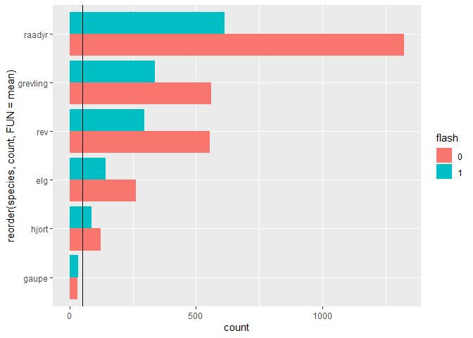<!-- -->

Having filtered out most sightings, we are left with the most common,
large mammals. There are very few sightings of lynx when divided by
times it was and wasn’t flashed by a white LED. For the rest of the
species in this plot, we can rest assured that we have a lot of
datapoints, and that the species are large enough to be photo captured
every time they pass the camera by the expected route.

``` r
library(tidymodels)
Control <- filter(obs, period == "Control")
obs %>% 
#  filter(!species %in% c("null", "nothing","ukjent")) %>%
  filter(species %in% c("raadyr","rev","elg", "grevling", "hjort","gaupe")) %>% 
  na.omit() %>% 
chisq_test(species ~ period)
```

    ## Warning in stats::chisq.test(table(x), ...): Chi-squared approximation may be
    ## incorrect

    ## # A tibble: 1 x 3
    ##   statistic chisq_df  p_value
    ##       <dbl>    <int>    <dbl>
    ## 1      110.       15 1.54e-16

``` r
obs_chisq <- obs %>%   filter(species %in% c("raadyr","rev","elg", "grevling", "hjort","gaupe")) %>% 
  select(species, flash) 
# calculate observed statistic
observed_indep_statistic <- obs_chisq %>%
  specify(species ~ flash) %>%
  calculate(stat = "Chisq")
# generate the null distribution using randomization
null_distribution_simulated <- obs_chisq %>%
 specify(species ~ flash) %>%
  hypothesize(null = "independence") %>%
  generate(reps = 5000, type = "permute") %>%
  calculate(stat = "Chisq")
# generate the null distribution by theoretical approximation
null_distribution_theoretical <- obs_chisq %>%
 specify(species ~ flash) %>%
  hypothesize(null = "independence") %>%
  # note that we skip the generation step here!
  calculate(stat = "Chisq")
# visualize the null distribution and test statistic!
null_distribution_simulated %>%
  visualize() + 
  shade_p_value(observed_indep_statistic,
                direction = "greater")
```

<!-- -->

``` r
# visualize the theoretical null distribution and test statistic!
obs_chisq %>%
  specify(species ~ flash) %>%
  hypothesize(null = "independence") %>%
  visualize(method = "theoretical") + 
  shade_p_value(observed_indep_statistic,
                direction = "greater")
```

    ## Warning: Check to make sure the conditions have been met for the theoretical
    ## method. {infer} currently does not check these for you.

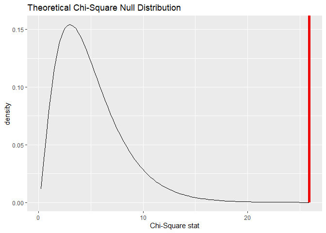<!-- -->

``` r
# visualize both null distributions and the test statistic!
null_distribution_simulated %>%
  visualize(method = "both") + 
  shade_p_value(observed_indep_statistic,
                direction = "greater")
```

    ## Warning: Check to make sure the conditions have been met for the theoretical
    ## method. {infer} currently does not check these for you.

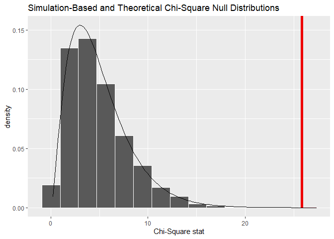<!-- -->

``` r
# calculate the p value from the observed statistic and null distribution
p_value_independence <- null_distribution_simulated %>%
  get_p_value(obs_stat = observed_indep_statistic,
              direction = "greater")
```

    ## Warning: Please be cautious in reporting a p-value of 0. This result is an
    ## approximation based on the number of `reps` chosen in the `generate()` step. See
    ## `?get_p_value()` for more information.

``` r
p_value_independence
```

    ## # A tibble: 1 x 1
    ##   p_value
    ##     <dbl>
    ## 1       0

``` r
#Please be cautious in reporting a p-value of 0. This result is an approximation based on the number of `reps` chosen in the `generate()` step. See `?get_p_value()` for more information.
```

# Build the model

### Baseline hazard function

The baseline hazard function *H*<sub>0</sub>(*t*) is the hazard at time
*t* when all predictors equals to zero. You can think about the
*H*<sub>0</sub>(*t*) being the intercept, although this is not strictly
true. That is because in reality, *H*<sub>0</sub>(*t*) varies over time,
and we can never know its true value. However, we can calculate the
hazard ratio between groups. We will never know a true hazard for any
given group at a given time, because we lack the knowledge of the
shifting baseline, but we can know the relative hazard between groups.

In other words, for my case, I do not know the true probability (hazard)
for any given species to get photo-captured by any of the cameras in my
study. Nor can I find it out, as this truly is an ever changing value.
Still, I can measure the relative difference in frequencies between the
groups equipped with a white LED flash, and the groups only equipped
with IR flash.

Ratios must stay constant over time, ie. if group B has twice the hazard
of group A at time *t*, the assumption is that this relationship will
stay that way at time *t* + 1. In other words, as I assume different
species will have different reactions to the white LED, I cannot
estimate the Hazard ratio between species. At least I think I can’t,
considering for example if a badger is indifferent to the white LED, his
ratio to any other *reacting* species will be constantly changing.

``` r
sp = "raadyr"
obs_sp <- obs %>% filter(species %in% sp & !period == "Control") # filtering out control + keeping only sp
mod0 <- coxph(Surv(t.diff, event, type = "right") ~ flashed, 
  data = obs_sp)                                            #  cleaner code with a temporary obs_sp
summary(mod0) 
```

    ## Call:
    ## coxph(formula = Surv(t.diff, event, type = "right") ~ flashed, 
    ##     data = obs_sp)
    ## 
    ##   n= 1243, number of events= 1158 
    ## 
    ##               coef exp(coef) se(coef)     z Pr(>|z|)
    ## flashedTRUE 0.1091    1.1153   0.0675 1.616    0.106
    ## 
    ##             exp(coef) exp(-coef) lower .95 upper .95
    ## flashedTRUE     1.115     0.8967    0.9771     1.273
    ## 
    ## Concordance= 0.515  (se = 0.007 )
    ## Likelihood ratio test= 2.56  on 1 df,   p=0.1
    ## Wald test            = 2.61  on 1 df,   p=0.1
    ## Score (logrank) test = 2.61  on 1 df,   p=0.1

So what am I really testing when I’m doing a survival analysis? I’m
testing whether or not the survival curves are significantly different
from each other. If it is, the summary-output of a model will show a
p-value ( Pr(&gt;\|z\|) ) lower than 0.05, and the lower and upper .95
interval should not contain the value ***1***.

The mod0 for roe deer has a *P**r*( &gt; \|*z*\|) = 0.0444 and the .95
confidence interval is 1.003 to 1.309. In other words the model is right
on the edge of being significant. This seems to hint at an actual effect
of the flash, but the p-score should keep us critical.

``` r
# Survival probabilty against time.
fit <- survfit(Surv(t.diff, event, type = "right") ~ flashed, 
  data = obs_sp)
ggsurvplot(fit, data = obs_sp, title = "roe deer", 
          risk.table = T, break.time.by = 20, ggtheme = theme_minimal(),
          censor.shape = "|", censor.size = 3,
          legend.labs =  c("IR","white LED"),
          tables.height = 0.2, tables.theme = theme_cleantable())
```

    ## Warning: Vectorized input to `element_text()` is not officially supported.
    ## Results may be unexpected or may change in future versions of ggplot2.

<!-- -->

``` r
ggsurvplot(fit, data = obs_sp, title = "roe deer",
          risk.table = T, break.time.by = 10, ggtheme = theme_minimal(),
          conf.int = T, xlim = c(0,50), censor.shape = "|", censor.size = 3,legend.labs =  c("IR","white LED"),
          tables.height = 0.2, tables.theme = theme_cleantable()
          #cumcensor = T
)
```

    ## Warning: Vectorized input to `element_text()` is not officially supported.
    ## Results may be unexpected or may change in future versions of ggplot2.

<!-- -->

``` r
ggsurvplot(fit, data = obs_sp, title = "roe deer - cumulative hazards", 
          break.time.by = 20, ggtheme = theme_minimal(),
          censor.shape = "|", censor.size = 3, fun = "cumhaz",
          legend.labs =  c("IR","white LED"),
          ncensor.plot = T, ncensor.plot.height = 0.25)
```

<!-- -->

``` r
# fun = "event" plots cumulative events (f(y) = 1-y), 
# "cumhaz" plots the cumulative hazard function (f(y) = -log(y)), and 
# "pct" for survival probability in percentage
```

Three different survival plots of the roe deer. Including the confidence
intervals shows that the IR curve is almost constantly enveloped in the
LED-curve confidence interval.

## Diagnosing the model

``` r
# A nicer way to visualize the coffecient estimate and the
# confidence interval. Since the interval doesn't overlap 
# 1 (hazard ratio of 1) the coeffecient estimate is significant.
ggforest(mod0, data = obs_sp)
```

<!-- -->

``` r
# Diagnostics - Are we violating the proportional hazard
# assumption?

# Test the proportional hazards assumption
d.mod0 <- cox.zph(mod0)  
d.mod0 # Non-significant --> we can assume proportional hazards.
```

    ##         chisq df    p
    ## flashed  1.95  1 0.16
    ## GLOBAL   1.95  1 0.16

``` r
summary(fit)$table
```

    ##               records n.max n.start events   *rmean *se(rmean)   median
    ## flashed=FALSE     930   930     930    863 6.695302  0.6071114 1.561887
    ## flashed=TRUE      313   313     313    295 6.422127  1.1027307 1.158935
    ##                 0.95LCL  0.95UCL
    ## flashed=FALSE 1.3264005 1.808727
    ## flashed=TRUE  0.9164468 1.519896

``` r
# Can also look at Schoenfeld residuals, there should be no
# pattern with time
ggcoxzph(d.mod0)
```

    ## Warning in regularize.values(x, y, ties, missing(ties), na.rm = na.rm):
    ## collapsing to unique 'x' values

<!-- -->

When the confidence intervals are included in the plot, the white LED CI
overlaps the IR curve almost constantly. Therefore it doesn’t seem to be
a large effect of our flash. Additionally, it is interesting to see that
the effect is of the blits is luring, rather than scaring. The survival
time is shorter for white LED, which means that roe deer either gets
drawn to the camera, or at least that their detection rate goes up.

The curves seem to cross eachother at a couple of points. However, the
Schoenfeld Individual test is non-significant, so we can assume
proportional hazards

------------------------------------------------------------------------

After having compared the two hazards, ie. extracted a hazard ratio, I
should check for confounding factors. To do that, I add variables to the
model formula, and check whether the intercept and the standard error of
my group changes. If they are approximately identical, the new factors
don’t seem to have any explanatory power.

# Models with spatial covariates

``` r
# Fitting model with spatial covariates
obs_sp <- obs %>%  # remaking obs_sp, to include the new covariates
  filter(species %in% sp & !period == "Control")

# Example with distance to forest roads and houses
mod1<-coxph(Surv(t.diff, event, type="right") ~ flashed +
              house_d2 + forestroad_d2, data=obs_sp)
summary(mod1)
```

    ## Call:
    ## coxph(formula = Surv(t.diff, event, type = "right") ~ flashed + 
    ##     house_d2 + forestroad_d2, data = obs_sp)
    ## 
    ##   n= 1243, number of events= 1158 
    ## 
    ##                     coef  exp(coef)   se(coef)      z Pr(>|z|)    
    ## flashedTRUE    5.398e-03  1.005e+00  6.998e-02  0.077  0.93852    
    ## house_d2      -2.146e-04  9.998e-01  7.338e-05 -2.925  0.00345 ** 
    ## forestroad_d2  3.452e-04  1.000e+00  5.111e-05  6.754 1.44e-11 ***
    ## ---
    ## Signif. codes:  0 '***' 0.001 '**' 0.01 '*' 0.05 '.' 0.1 ' ' 1
    ## 
    ##               exp(coef) exp(-coef) lower .95 upper .95
    ## flashedTRUE      1.0054     0.9946    0.8765    1.1532
    ## house_d2         0.9998     1.0002    0.9996    0.9999
    ## forestroad_d2    1.0003     0.9997    1.0002    1.0004
    ## 
    ## Concordance= 0.546  (se = 0.009 )
    ## Likelihood ratio test= 55.56  on 3 df,   p=5e-12
    ## Wald test            = 58.1  on 3 df,   p=1e-12
    ## Score (logrank) test = 58.95  on 3 df,   p=1e-12

``` r
ggforest(mod1, data = obs_sp)
```

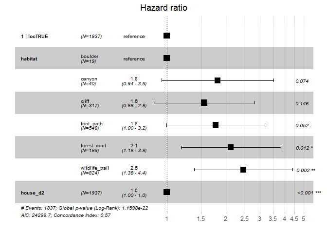<!-- -->

Just adding the house\_d2, and forestroad\_d2 covariates completely
changed the verdict on the effect of flashing. Closeness to house has a
slightly, but significant, *negative* predictive power, and closeness to
forest roads has a ever slightly, but significant, *positive* predictive
power However, I mistrust their confidence intervals. They are weirdly
narrow.

<!--Also, Neri started a sentence commenting on what the negative value of house_d2 signifies, but didn't complete it.
-->

Anyways, just thinking about my spatial covariates, and what they
represent, the way they are used in the model right now, is probably not
what I intend. I don’t expect an animal’s reaction to be linear with the
distance to a road or a house. Rather, I expect it to be exponentially
larger, the closer the animal gets, ie. the closer the camera’s position
is to a road or a house, as that is where I observe them. Worded
differently, I don’t think the difference of 1km and 3km to the nearest
house will affect a roe deer, as much as the difference of 50m and 500m
will. Therefore I need to log transform the spatial covariates, and in
doing so I have to be careful with 0-values. Many cameras are positioned
on or directly next to a forest road, and log transforming these values
would create infinite-values.

## Transforming the variables, and looking at correlations

``` r
obs$forestroad_d2_ln<-ifelse(obs$forestroad_d2>0,log(obs$forestroad_d2), 0)
obs$forestroad_d2_io <- ifelse(obs$forestroad_d2>10, 0, 1)
obs$house_d2_ln<-ifelse(obs$house_d2>0,log(obs$house_d2), 0)
# plotting distances
qplot(forestroad_d2_io, loc, data =obs)
```

<!-- -->

``` r
library(reshape2) # for melt function
```

    ## 
    ## Attaching package: 'reshape2'

    ## The following object is masked from 'package:tidyr':
    ## 
    ##     smiths

``` r
p_theme <- theme(
  panel.grid.major.x = element_blank(),panel.grid.minor.x = element_blank(),
  panel.grid.minor.y = element_blank(),axis.text.x = element_blank())   
  #theme(panel.background = element_rect(fill = "white", colour = "grey50"))

obs %>% melt(id = "loc", measure = c("forestroad_d2", "house_d2")) %>% 
  ggplot(aes(as.factor(loc), value)) + geom_point(aes(col=variable)) + 
  labs(title = "Distance") + p_theme 
```

<!-- -->

``` r
obs %>% melt(id = "loc", measure = c("forestroad_d2_ln", "house_d2_ln")) %>% 
  ggplot(aes(as.factor(loc), value)) + geom_point(aes(col=variable)) + 
  geom_smooth(span = 0.7) + labs(title = "Log-transformed distance") +
  p_theme #+ theme(legend.position = "top")
```

    ## `geom_smooth()` using method = 'gam' and formula 'y ~ s(x, bs = "cs")'

<!-- -->

``` r
ggplot(obs, aes(forestroad_d2, house_d2)) + geom_point() + 
  geom_smooth(method = "glm", formula = y ~ x, se = T) +
  labs(title = "Distance correlation")
```

<!-- -->

``` r
  #geom_smooth(span =.5)
library(corrplot)
```

    ## corrplot 0.84 loaded

``` r
covs %>% select(!c(1,3,4)) %>% cor() %>% 
corrplot(type = "upper", method = "number")
```

<!-- -->

``` r
names(covs)
```

    ##  [1] "LokalitetID"   "Latitude"      "Longitude"     "geometry"     
    ##  [5] "elev"          "slope"         "house_dens"    "build_dens"   
    ##  [9] "field_dens"    "house_d2"      "build_d2"      "field_d2"     
    ## [13] "forestroad_d2" "publicroad_d2"

The two variables are almost independent of eachother, although the
correlation increases somewhat when both are log-transformed. They will
likely be able to predict variation complimentary to each other Also,
they are both independent to my flashed-variable.

Remembering my own question as stated in the intro:

*In this study, I will attempt to quantify how the usage of white LED
flash affects the detection rate of the most common large mammal species
in the area and whether this effect correlates with other factors
\[such\] as urbanisation.*

Fores troads are absolutely a factor of human interference or something
like that, but is not exactly what I’m getting at with urbanisation.
Also, forest roads are known to attract many species \[citation?\] and
are therefore used actively in camera trapping studies, my own included.
So, including closeness to forest roads can probably account for some
“attraction” to camera sites, or rather, higher detection frequencies.
Maybe a TRUE/FALSE factor for camera being on forest road or not would
be better.

On the other hand, distance to house is closer to my urbanisation
statement, and is somewhat more of what I had in mind when articulating
it. Specifically, I was thinking about sources to Artificial Light At
Night (ALAN), as a possible predictor for how animals react to white LED
flash. Proximity to houses is a somewhat good proxy for that, but still,
I’ll be missing the ALAN from other types of infrastructure, such as
illuminated public roads, and heavily trafficked roads in general.

In any case, if I do get a hold of an actual proximity to ALAN-covariate
(or similar), I need to be mindful of whether it is the ALAN or
something correlating with the ALAN that can be causal to this
relationship.

``` r
sp = "raadyr"
obs_sp <- obs %>%  # remaking obs_sp, to include the new covariates
  filter(species %in% sp & !period == "Control")

mod2<-coxph(Surv(t.diff, event, type="right")~flashed+ house_d2_ln + forestroad_d2_io, data=obs_sp)
summary(mod2)
```

    ## Call:
    ## coxph(formula = Surv(t.diff, event, type = "right") ~ flashed + 
    ##     house_d2_ln + forestroad_d2_io, data = obs_sp)
    ## 
    ##   n= 1243, number of events= 1158 
    ## 
    ##                      coef exp(coef) se(coef)      z Pr(>|z|)    
    ## flashedTRUE       0.13849   1.14854  0.06819  2.031 0.042250 *  
    ## house_d2_ln      -0.17408   0.84023  0.04658 -3.737 0.000186 ***
    ## forestroad_d2_io  0.17196   1.18763  0.11969  1.437 0.150811    
    ## ---
    ## Signif. codes:  0 '***' 0.001 '**' 0.01 '*' 0.05 '.' 0.1 ' ' 1
    ## 
    ##                  exp(coef) exp(-coef) lower .95 upper .95
    ## flashedTRUE         1.1485     0.8707    1.0049    1.3128
    ## house_d2_ln         0.8402     1.1902    0.7669    0.9206
    ## forestroad_d2_io    1.1876     0.8420    0.9393    1.5016
    ## 
    ## Concordance= 0.549  (se = 0.01 )
    ## Likelihood ratio test= 16.77  on 3 df,   p=8e-04
    ## Wald test            = 16.47  on 3 df,   p=9e-04
    ## Score (logrank) test = 16.49  on 3 df,   p=9e-04

``` r
ggforest(mod2, data = obs_sp)
```

<!-- -->

``` r
# Test the proportional hazards assumption
d.mod2<-cox.zph(mod2) # Non-significant --> we can assume proportional hazards.
d.mod2
```

    ##                   chisq df    p
    ## flashed          2.0686  1 0.15
    ## house_d2_ln      0.0293  1 0.86
    ## forestroad_d2_io 0.0263  1 0.87
    ## GLOBAL           2.1753  3 0.54

``` r
# Can also look at Schoenfeld residuals, there should be no pattern with time
ggcoxzph(d.mod2)
```

    ## Warning in regularize.values(x, y, ties, missing(ties), na.rm = na.rm):
    ## collapsing to unique 'x' values

<!-- -->

Closeness to house, when log-transformed, was in fact highly significant
as a negative predictor. Forest roads are just barely positive, and
unsignificant. This could be because most cameras weren’t situated on
forest roads, and therefore it would predictively have no effect. The
roads aren’t a good predictor of where there are many animals, but
rather, the route many animals would choose to travel. In addition, they
are less obstructed by vegetation, and therefore it is easier to trigger
the camera, and easier to spot the animal. Yes/no transforming the
variable would also have the added benefit of removing most correlation
with the house distance-variable.

The CI of the flashed variable has shifted ever so slightly, now
including a Hazard ratio of 1. This model also leaves flash accounting
for a positive trend in survival, ie. more frequent redetection of roe
deer, but the effect doesn’t explain a significant amount of the
variation left after considering the other variables.

``` r
# Setting up model to test if the effect of flash is dependent on distance to house
mod3<-coxph(Surv(t.diff, event, type="right")~flashed*house_d2_ln + forestroad_d2_ln, data=obs_sp)
summary(mod3)
```

    ## Call:
    ## coxph(formula = Surv(t.diff, event, type = "right") ~ flashed * 
    ##     house_d2_ln + forestroad_d2_ln, data = obs_sp)
    ## 
    ##   n= 1243, number of events= 1158 
    ## 
    ##                             coef exp(coef) se(coef)      z Pr(>|z|)  
    ## flashedTRUE              1.29795   3.66177  0.80416  1.614    0.107  
    ## house_d2_ln             -0.11421   0.89207  0.04829 -2.365    0.018 *
    ## forestroad_d2_ln         0.02508   1.02540  0.01889  1.327    0.184  
    ## flashedTRUE:house_d2_ln -0.18739   0.82912  0.12881 -1.455    0.146  
    ## ---
    ## Signif. codes:  0 '***' 0.001 '**' 0.01 '*' 0.05 '.' 0.1 ' ' 1
    ## 
    ##                         exp(coef) exp(-coef) lower .95 upper .95
    ## flashedTRUE                3.6618     0.2731    0.7572   17.7089
    ## house_d2_ln                0.8921     1.1210    0.8115    0.9806
    ## forestroad_d2_ln           1.0254     0.9752    0.9881    1.0641
    ## flashedTRUE:house_d2_ln    0.8291     1.2061    0.6441    1.0672
    ## 
    ## Concordance= 0.555  (se = 0.01 )
    ## Likelihood ratio test= 19.23  on 4 df,   p=7e-04
    ## Wald test            = 19.35  on 4 df,   p=7e-04
    ## Score (logrank) test = 19.45  on 4 df,   p=6e-04

``` r
ggforest(mod3, data = obs_sp)
```

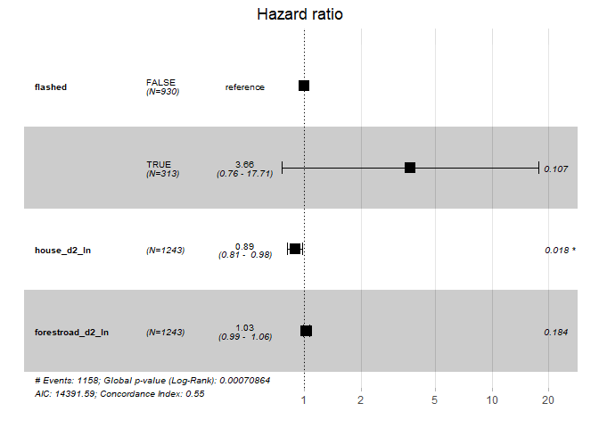<!-- -->

``` r
# Test the proportional hazards assumption
d.mod3<-cox.zph(mod3) # Non-significant --> we can assume proportional hazards.
d.mod3
```

    ##                      chisq df    p
    ## flashed             1.5701  1 0.21
    ## house_d2_ln         0.0292  1 0.86
    ## forestroad_d2_ln    0.2290  1 0.63
    ## flashed:house_d2_ln 1.0261  1 0.31
    ## GLOBAL              9.0537  4 0.06

``` r
# Can also look at Schoenfeld residuals, there should be no pattern with time
ggcoxzph(d.mod3,font.main = 12, ggtheme = theme_classic2()) #caption = "Caption goes here"
```

    ## Warning in regularize.values(x, y, ties, missing(ties), na.rm = na.rm):
    ## collapsing to unique 'x' values

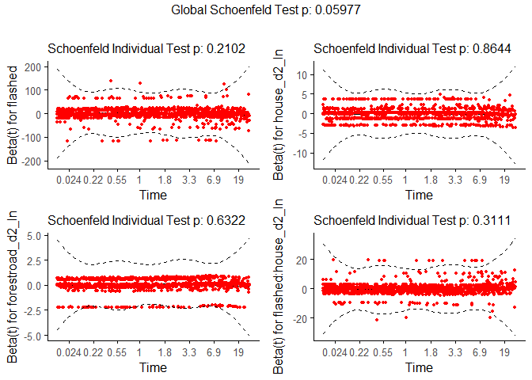<!-- --> The Global
Schoenfeld test has a dangerously low p-value (*p* = 0.06), but it is
still insignificant, and we may assume - carefully - proportional
hazards. Looking at the plots for flashed and flashed:house\_d2\_ln
there are some outliers surpassing the dashed line. However, the
Schoenfeld Individual Tests are all insignificant.

&lt;&lt;&lt;&lt;&lt;&lt;&lt; HEAD Interesting to note, is that the
flashed effect increases wildly in it’s confidence interval, leaving the
house\_d2\_ln variable seeming diminished in it’s variation / CI.
Importantly, though, there is no significance in the interaction between
flash and distance to house.

``` r
# Setting up model to test if the effect of flash is dependent on distance to house
mod4 <- coxph(Surv(t.diff, event, type="right") ~ flashed * house_d2 +
                forestroad_d2_ln, data=obs_sp)
summary(mod4)
```

    ## Call:
    ## coxph(formula = Surv(t.diff, event, type = "right") ~ flashed * 
    ##     house_d2 + forestroad_d2_ln, data = obs_sp)
    ## 
    ##   n= 1243, number of events= 1158 
    ## 
    ##                            coef  exp(coef)   se(coef)      z Pr(>|z|)  
    ## flashedTRUE           3.272e-01  1.387e+00  1.435e-01  2.281   0.0225 *
    ## house_d2             -1.476e-04  9.999e-01  7.784e-05 -1.896   0.0579 .
    ## forestroad_d2_ln      2.621e-02  1.027e+00  1.883e-02  1.392   0.1638  
    ## flashedTRUE:house_d2 -3.727e-04  9.996e-01  2.193e-04 -1.700   0.0892 .
    ## ---
    ## Signif. codes:  0 '***' 0.001 '**' 0.01 '*' 0.05 '.' 0.1 ' ' 1
    ## 
    ##                      exp(coef) exp(-coef) lower .95 upper .95
    ## flashedTRUE             1.3871     0.7209    1.0471     1.837
    ## house_d2                0.9999     1.0001    0.9997     1.000
    ## forestroad_d2_ln        1.0266     0.9741    0.9894     1.065
    ## flashedTRUE:house_d2    0.9996     1.0004    0.9992     1.000
    ## 
    ## Concordance= 0.549  (se = 0.01 )
    ## Likelihood ratio test= 18.06  on 4 df,   p=0.001
    ## Wald test            = 17.75  on 4 df,   p=0.001
    ## Score (logrank) test = 17.81  on 4 df,   p=0.001

``` r
ggforest(mod4, data = obs_sp)
```

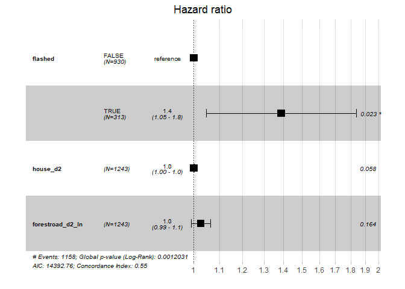<!-- -->

``` r
# Test the proportional hazards assumption
d.mod4<-cox.zph(mod4) # Non-significant --> we can assume proportional hazards.
d.mod4
```

    ##                    chisq df      p
    ## flashed           1.4680  1 0.2257
    ## house_d2          0.0458  1 0.8305
    ## forestroad_d2_ln  0.1614  1 0.6879
    ## flashed:house_d2  0.2939  1 0.5877
    ## GLOBAL           14.2076  4 0.0067

``` r
# Can also look at Schoenfeld residuals, there should be no pattern with time
ggcoxzph(d.mod4,font.main = 12, ggtheme = theme_classic2()) #caption = "Caption goes here"
```

    ## Warning in regularize.values(x, y, ties, missing(ties), na.rm = na.rm):
    ## collapsing to unique 'x' values

<!-- --> Reverting the
house\_d2 variable to it’s natural form ends up violating the global
Schoenfield test (p:0.0067 !)

``` r
# Setting up model to test if the effect of flash is dependent on distance to house
mod5 <- coxph(Surv(t.diff, event, type="right") ~ flashed * forestroad_d2_ln +
                 house_d2_ln, data=obs_sp)
summary(mod5)
```

    ## Call:
    ## coxph(formula = Surv(t.diff, event, type = "right") ~ flashed * 
    ##     forestroad_d2_ln + house_d2_ln, data = obs_sp)
    ## 
    ##   n= 1243, number of events= 1158 
    ## 
    ##                                  coef exp(coef) se(coef)      z Pr(>|z|)    
    ## flashedTRUE                  -0.85596   0.42488  0.28335 -3.021 0.002520 ** 
    ## forestroad_d2_ln             -0.01708   0.98306  0.02122 -0.805 0.420872    
    ## house_d2_ln                  -0.14226   0.86740  0.04572 -3.111 0.001863 ** 
    ## flashedTRUE:forestroad_d2_ln  0.16358   1.17772  0.04464  3.664 0.000248 ***
    ## ---
    ## Signif. codes:  0 '***' 0.001 '**' 0.01 '*' 0.05 '.' 0.1 ' ' 1
    ## 
    ##                              exp(coef) exp(-coef) lower .95 upper .95
    ## flashedTRUE                     0.4249     2.3536    0.2438    0.7404
    ## forestroad_d2_ln                0.9831     1.0172    0.9430    1.0248
    ## house_d2_ln                     0.8674     1.1529    0.7931    0.9487
    ## flashedTRUE:forestroad_d2_ln    1.1777     0.8491    1.0790    1.2854
    ## 
    ## Concordance= 0.561  (se = 0.009 )
    ## Likelihood ratio test= 32.11  on 4 df,   p=2e-06
    ## Wald test            = 29.52  on 4 df,   p=6e-06
    ## Score (logrank) test = 29.7  on 4 df,   p=6e-06

``` r
ggforest(mod5, data = obs_sp)
```

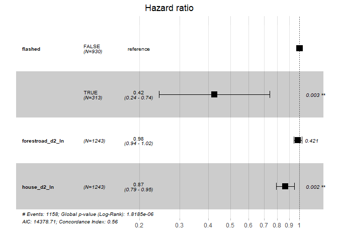<!-- -->

``` r
# Test the proportional hazards assumption
d.mod5<-cox.zph(mod5) # Non-significant --> we can assume proportional hazards.
d.mod5
```

    ##                             chisq df       p
    ## flashed                   0.82963  1 0.36238
    ## forestroad_d2_ln          0.12978  1 0.71866
    ## house_d2_ln               0.00517  1 0.94266
    ## flashed:forestroad_d2_ln  3.62253  1 0.05700
    ## GLOBAL                   22.51921  4 0.00016

``` r
# Can also look at Schoenfeld residuals, there should be no pattern with time
ggcoxzph(d.mod5,font.main = 12, ggtheme = theme_classic2()) #caption = "Caption goes here"
```

    ## Warning in regularize.values(x, y, ties, missing(ties), na.rm = na.rm):
    ## collapsing to unique 'x' values

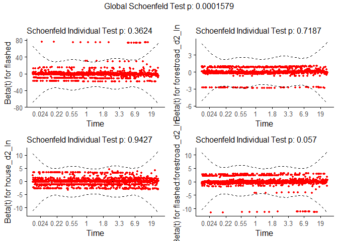<!-- --> The same thing
happens when checking for an interaction between the log-transformed
distance to forestroad-variable. The interaction seems to violate the
individual test, but the model all together completely fails the global
test. Interesting to note how the predicted effect of the flash suddenly
shifts to being negative!

Let’s see what happens using the normal distance to forestroad
covariate:

``` r
# Setting up model to test if the effect of flash is dependent on distance to house
mod6 <- coxph(Surv(t.diff, event, type="right") ~ flashed * forestroad_d2 +
                 house_d2_ln, data=obs_sp)
summary(mod6)
```

    ## Call:
    ## coxph(formula = Surv(t.diff, event, type = "right") ~ flashed * 
    ##     forestroad_d2 + house_d2_ln, data = obs_sp)
    ## 
    ##   n= 1243, number of events= 1158 
    ## 
    ##                                 coef  exp(coef)   se(coef)      z Pr(>|z|)    
    ## flashedTRUE               -4.104e-01  6.634e-01  1.226e-01 -3.347 0.000816 ***
    ## forestroad_d2              1.630e-04  1.000e+00  6.926e-05  2.354 0.018596 *  
    ## house_d2_ln               -1.477e-01  8.627e-01  4.546e-02 -3.248 0.001160 ** 
    ## flashedTRUE:forestroad_d2  4.994e-04  1.000e+00  1.082e-04  4.614 3.96e-06 ***
    ## ---
    ## Signif. codes:  0 '***' 0.001 '**' 0.01 '*' 0.05 '.' 0.1 ' ' 1
    ## 
    ##                           exp(coef) exp(-coef) lower .95 upper .95
    ## flashedTRUE                  0.6634     1.5074    0.5217    0.8436
    ## forestroad_d2                1.0002     0.9998    1.0000    1.0003
    ## house_d2_ln                  0.8627     1.1592    0.7892    0.9431
    ## flashedTRUE:forestroad_d2    1.0005     0.9995    1.0003    1.0007
    ## 
    ## Concordance= 0.562  (se = 0.009 )
    ## Likelihood ratio test= 82.48  on 4 df,   p=<2e-16
    ## Wald test            = 87.96  on 4 df,   p=<2e-16
    ## Score (logrank) test = 90.42  on 4 df,   p=<2e-16

``` r
ggforest(mod6, data = obs_sp)
```

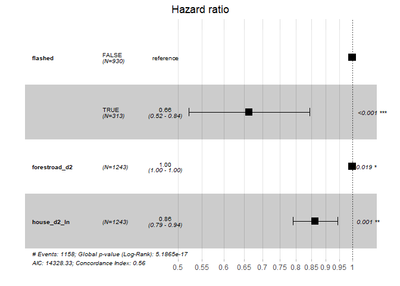<!-- -->

``` r
# Test the proportional hazards assumption
d.mod6<-cox.zph(mod6) # Non-significant --> we can assume proportional hazards.
d.mod6
```

    ##                         chisq df      p
    ## flashed                0.7651  1 0.3817
    ## forestroad_d2          6.7530  1 0.0094
    ## house_d2_ln            0.0111  1 0.9162
    ## flashed:forestroad_d2  0.1912  1 0.6620
    ## GLOBAL                12.8545  4 0.0120

``` r
# Can also look at Schoenfeld residuals, there should be no pattern with time
ggcoxzph(d.mod6,font.main = 12, ggtheme = theme_classic2()) #caption = "Caption goes here"
```

    ## Warning in regularize.values(x, y, ties, missing(ties), na.rm = na.rm):
    ## collapsing to unique 'x' values

<!-- --> Now, the
individual test for the forestroad\_d2 variable fails. The interaction
does not fail, although the global test fails again, just not that
strongly.

Something does seem to happen when flash is considered in conjunction
with a *“luring”* or attractive variable. There is something strange
going on with the distance to forestroad-variable, so maybe a variable
for trail type at the camera station would be a better fit. Strangely,
only 3 locations are considered to be on a forestroad, which surprises
me. I remember there to be more. At least there are more of tractor
roads, and none of the “claimed” forest roads are in any way highly
trafficked.

One way to extract a better forest road-variable could be to generate it
from the species variable (eg. **species %in% c(“kjoeretoy”,
“motorsykkel”, etc)**).

# Testing the models

## AIC-test

The best-fit model according to AIC is the one that explains the
greatest amount of variation using the fewest possible independent
variables.

[some tips on aic-referring in method
section](https://www.scribbr.com/statistics/akaike-information-criterion/)

``` r
# Which of the four different models have the lowest AIC?
mod.sel<-AIC(mod0,mod1,mod2,mod3,mod4,mod5,mod6)
mod.sel$d.AIC<-mod.sel$AIC-min(mod.sel$AIC)
mod.sel[order(mod.sel$d.AIC),]
```

    ##      df      AIC    d.AIC
    ## mod6  4 14328.33  0.00000
    ## mod1  3 14353.25 24.91873
    ## mod5  4 14378.71 50.37484
    ## mod3  4 14391.59 63.25382
    ## mod2  3 14392.04 63.70884
    ## mod4  4 14392.76 64.42605
    ## mod0  1 14402.25 73.91776

``` r
# mod1$formula
# What is your conclusion? 
```

The AIC score determines model 1 as the best model, excluding the two
last models violating the assumption of proportional hazards. Model 1
was the model with the raw distance to feature-covariates. However, the
other models are close on the score level, and should not be dismissed
completely. Maybe different transformations could fit the data better?
At least, it is interesting to note that mod3, that had interaction with
house\_d2 scored on level with mod2 without an interaction. The score
signifies that the model has a better fit, and that the better fit is
strong enough to be worth the penalty for a more complicated model!

And, maybe the forest road covariate isn’t the best predictor as only
three cameras seem to be classified as on a forest road.

0.0053979, -2.1464122^{-4}, 3.4516726^{-4}

## Likelihood ratio test

Then, enter the *likelihood ratio test*. I’ll use it to test if the full
model is significantly better than the reduced model *H*<sub>0</sub>: no
difference between models *H*<sub>1</sub>: the full model explains more
(larger predictive power) <sup>*G*</sup>*s**t**a**t* follows a
*x*<sup>2</sup>-distribution where df = k P&gt;\|chi\|: if significant
(&lt;0.05), then *H*<sub>1</sub> is our model

# Repeating for the other species

I haven’t spent much time here, as I’ve tried to find a cleaner approach
with tidymodels, but finally gave up.

Firstly, here’s a survival plot of all 6 species.

``` r
sp = c("elg","hjort","grevling","gaupe", "rev", "raadyr")
obs_sp <- obs %>%  # remaking obs_sp, to include all 6 species
  filter(species %in% sp & !period == "Control")

# Survival probabilty against time.
fit<-survfit(Surv(t.diff, event, type="right") ~ flashed +  species,
             data=obs_sp)

ggsurv <- ggsurvplot(fit, data = obs_sp, title = "white LED flash: dotted lines",
                     #fun = "cumhaz", conf.int = TRUE,
                     risk.table = T, #risk.table.height = "none",
                     risk.table.y.text.col = T,# colour risk table text annotations.
                     risk.table.y.text = FALSE,# show bars instead of names in text annotations
                     ggtheme = theme_minimal(),  
                     censor.shape = "|", censor.size = 3,
                     xlim = c(0,120),linetype = rep(c(1,2), each = 6),
                    # legend.labs =  c("white LED", "IR"),
                     tables.height = 0.2, tables.theme = theme_cleantable())
```

    ## Warning: Vectorized input to `element_text()` is not officially supported.
    ## Results may be unexpected or may change in future versions of ggplot2.

``` r
curv_facet <- ggsurv$plot + facet_wrap( ~ species) #+ theme(legend.position = "none")
curv_facet + theme(legend.position = "none")
```

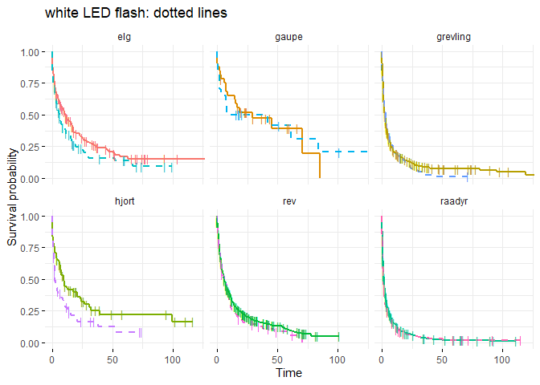<!-- -->

``` r
# ggsurv$table + facet_grid( ~ species, scales = "free") +
#   theme(legend.text = element_text(size = 6),legend.title = element_blank(),
                  # legend.key.size = unit(5, 'mm'))
```

For all species, the survival time is shorter in the periods with a
white LED flash, though, as glimpsed by the roe deer model 5 and 6,
there could be something else going on. The lynx curves are constantly
crossing each other, which is probably due to the low number of
sightings.

Also. the plot would benefit from having a fixed colour for flash/no
flash, but I haven’t figured that part out yet.

Then I’ve remade the mod0 and mod5 for all the remaining species. On the
complex models, the Schoenfeld test doesn’t fail for fox, moose and red
deer. When it fails for badger and lynx, it is for differing reasons,
highlighting the need for individual models when including covariates.

### Fox

``` r
sp = "rev"
# Fitting model with spatial covariates
obs_sp <- obs %>%  # remaking obs_sp, to include the new covariates
  filter(species %in% sp & !period == "Control")

# Example with distance to forest roads and houses
mod0_rev<-coxph(Surv(t.diff, event, type="right") ~ flashed,
                data=obs_sp)
summary(mod0_rev)
```

    ## Call:
    ## coxph(formula = Surv(t.diff, event, type = "right") ~ flashed, 
    ##     data = obs_sp)
    ## 
    ##   n= 567, number of events= 471 
    ## 
    ##               coef exp(coef) se(coef)     z Pr(>|z|)
    ## flashedTRUE 0.1234    1.1313   0.1296 0.952    0.341
    ## 
    ##             exp(coef) exp(-coef) lower .95 upper .95
    ## flashedTRUE     1.131     0.8839    0.8775     1.459
    ## 
    ## Concordance= 0.504  (se = 0.009 )
    ## Likelihood ratio test= 0.88  on 1 df,   p=0.3
    ## Wald test            = 0.91  on 1 df,   p=0.3
    ## Score (logrank) test = 0.91  on 1 df,   p=0.3

``` r
ggforest(mod0_rev, data = obs_sp)
```

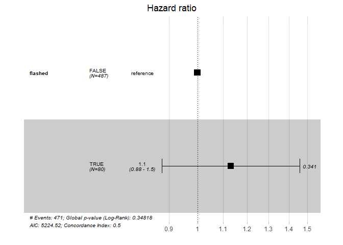<!-- -->

``` r
# Test the proportional hazards assumption
d.mod0_rev <- cox.zph(mod0_rev)  
d.mod0_rev 
```

    ##         chisq df    p
    ## flashed 0.679  1 0.41
    ## GLOBAL  0.679  1 0.41

``` r
summary(fit)$table
```

    ##                                 records n.max n.start events    *rmean
    ## flashed=FALSE, species=elg          175   175     175    126 32.539508
    ## flashed=FALSE, species=gaupe         32    32      32     19 38.894583
    ## flashed=FALSE, species=grevling     557   557     557    483 13.403604
    ## flashed=FALSE, species=hjort         78    78      78     54 36.064867
    ## flashed=FALSE, species=rev          487   487     487    401 19.535975
    ## flashed=FALSE, species=raadyr       930   930     930    863  6.986115
    ## flashed=TRUE, species=elg           105   105     105     83 22.854855
    ## flashed=TRUE, species=gaupe          20    20      20     13 48.748679
    ## flashed=TRUE, species=grevling       93    93      93     88  8.305752
    ## flashed=TRUE, species=hjort          64    64      64     51 18.840612
    ## flashed=TRUE, species=rev            80    80      80     70 13.461687
    ## flashed=TRUE, species=raadyr        313   313     313    295  6.895456
    ##                                 *se(rmean)    median    0.95LCL   0.95UCL
    ## flashed=FALSE, species=elg       4.2065633 10.345162  7.3583449 16.194248
    ## flashed=FALSE, species=gaupe     6.6539782 29.291632 14.8252431        NA
    ## flashed=FALSE, species=grevling  1.5734832  2.477361  2.0121296  2.978877
    ## flashed=FALSE, species=hjort     6.8551428  9.409271  6.9323264 20.762407
    ## flashed=FALSE, species=rev       1.9568937  5.759352  4.9085301  7.087569
    ## flashed=FALSE, species=raadyr    0.7027277  1.561887  1.3264005  1.808727
    ## flashed=TRUE, species=elg        4.5809133  5.894803  3.8539583 10.620475
    ## flashed=TRUE, species=gaupe     13.2212148 24.989439  3.3590046        NA
    ## flashed=TRUE, species=grevling   1.8807610  2.875405  1.7909491  4.223947
    ## flashed=TRUE, species=hjort      5.9187605  2.288808  1.5689699  7.456713
    ## flashed=TRUE, species=rev        2.2677592  6.770023  3.9475463  8.977454
    ## flashed=TRUE, species=raadyr     1.2896542  1.158935  0.9164468  1.519896

``` r
ggcoxzph(d.mod0_rev, font.main = 12, ggtheme = theme_classic2())
```

    ## Warning in regularize.values(x, y, ties, missing(ties), na.rm = na.rm):
    ## collapsing to unique 'x' values

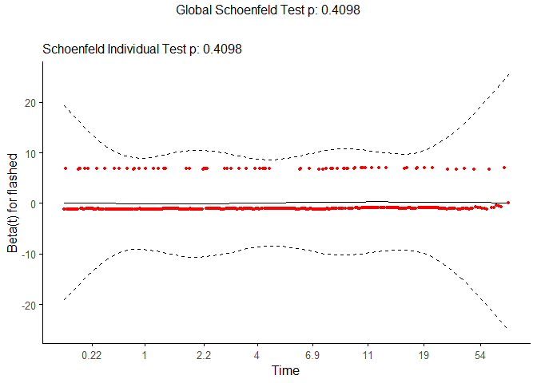<!-- -->

``` r
# Example with distance to forest roads and houses
mod5_rev<-coxph(Surv(t.diff, event, type="right") ~ flashed *
               forestroad_d2_ln + house_d2_ln, data=obs_sp)
summary(mod5_rev)
```

    ## Call:
    ## coxph(formula = Surv(t.diff, event, type = "right") ~ flashed * 
    ##     forestroad_d2_ln + house_d2_ln, data = obs_sp)
    ## 
    ##   n= 567, number of events= 471 
    ## 
    ##                                  coef exp(coef) se(coef)      z Pr(>|z|)    
    ## flashedTRUE                  -0.57252   0.56410  0.78931 -0.725    0.468    
    ## forestroad_d2_ln             -0.04022   0.96058  0.02753 -1.461    0.144    
    ## house_d2_ln                  -0.34106   0.71102  0.06819 -5.002 5.68e-07 ***
    ## flashedTRUE:forestroad_d2_ln  0.10220   1.10761  0.13075  0.782    0.434    
    ## ---
    ## Signif. codes:  0 '***' 0.001 '**' 0.01 '*' 0.05 '.' 0.1 ' ' 1
    ## 
    ##                              exp(coef) exp(-coef) lower .95 upper .95
    ## flashedTRUE                     0.5641     1.7727    0.1201    2.6499
    ## forestroad_d2_ln                0.9606     1.0410    0.9101    1.0138
    ## house_d2_ln                     0.7110     1.4064    0.6221    0.8127
    ## flashedTRUE:forestroad_d2_ln    1.1076     0.9028    0.8572    1.4311
    ## 
    ## Concordance= 0.581  (se = 0.014 )
    ## Likelihood ratio test= 26.85  on 4 df,   p=2e-05
    ## Wald test            = 26  on 4 df,   p=3e-05
    ## Score (logrank) test = 26.06  on 4 df,   p=3e-05

``` r
ggforest(mod5_rev, data = obs_sp)
```

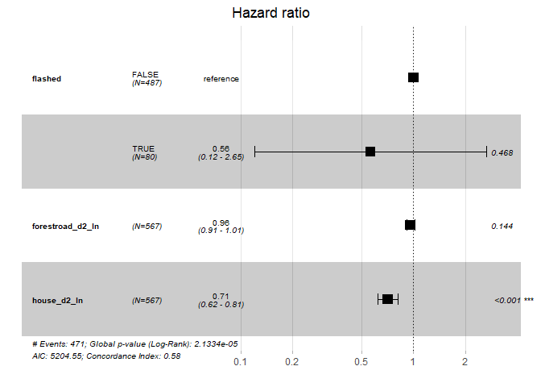<!-- -->

``` r
# Test the proportional hazards assumption
d.mod5_rev <- cox.zph(mod5_rev)  
d.mod5_rev 
```

    ##                          chisq df    p
    ## flashed                  0.391  1 0.53
    ## forestroad_d2_ln         0.545  1 0.46
    ## house_d2_ln              2.391  1 0.12
    ## flashed:forestroad_d2_ln 0.539  1 0.46
    ## GLOBAL                   3.880  4 0.42

``` r
summary(fit)$table
```

    ##                                 records n.max n.start events    *rmean
    ## flashed=FALSE, species=elg          175   175     175    126 32.539508
    ## flashed=FALSE, species=gaupe         32    32      32     19 38.894583
    ## flashed=FALSE, species=grevling     557   557     557    483 13.403604
    ## flashed=FALSE, species=hjort         78    78      78     54 36.064867
    ## flashed=FALSE, species=rev          487   487     487    401 19.535975
    ## flashed=FALSE, species=raadyr       930   930     930    863  6.986115
    ## flashed=TRUE, species=elg           105   105     105     83 22.854855
    ## flashed=TRUE, species=gaupe          20    20      20     13 48.748679
    ## flashed=TRUE, species=grevling       93    93      93     88  8.305752
    ## flashed=TRUE, species=hjort          64    64      64     51 18.840612
    ## flashed=TRUE, species=rev            80    80      80     70 13.461687
    ## flashed=TRUE, species=raadyr        313   313     313    295  6.895456
    ##                                 *se(rmean)    median    0.95LCL   0.95UCL
    ## flashed=FALSE, species=elg       4.2065633 10.345162  7.3583449 16.194248
    ## flashed=FALSE, species=gaupe     6.6539782 29.291632 14.8252431        NA
    ## flashed=FALSE, species=grevling  1.5734832  2.477361  2.0121296  2.978877
    ## flashed=FALSE, species=hjort     6.8551428  9.409271  6.9323264 20.762407
    ## flashed=FALSE, species=rev       1.9568937  5.759352  4.9085301  7.087569
    ## flashed=FALSE, species=raadyr    0.7027277  1.561887  1.3264005  1.808727
    ## flashed=TRUE, species=elg        4.5809133  5.894803  3.8539583 10.620475
    ## flashed=TRUE, species=gaupe     13.2212148 24.989439  3.3590046        NA
    ## flashed=TRUE, species=grevling   1.8807610  2.875405  1.7909491  4.223947
    ## flashed=TRUE, species=hjort      5.9187605  2.288808  1.5689699  7.456713
    ## flashed=TRUE, species=rev        2.2677592  6.770023  3.9475463  8.977454
    ## flashed=TRUE, species=raadyr     1.2896542  1.158935  0.9164468  1.519896

``` r
ggcoxzph(d.mod5_rev, font.main = 12, ggtheme = theme_classic2())
```

    ## Warning in regularize.values(x, y, ties, missing(ties), na.rm = na.rm):
    ## collapsing to unique 'x' values

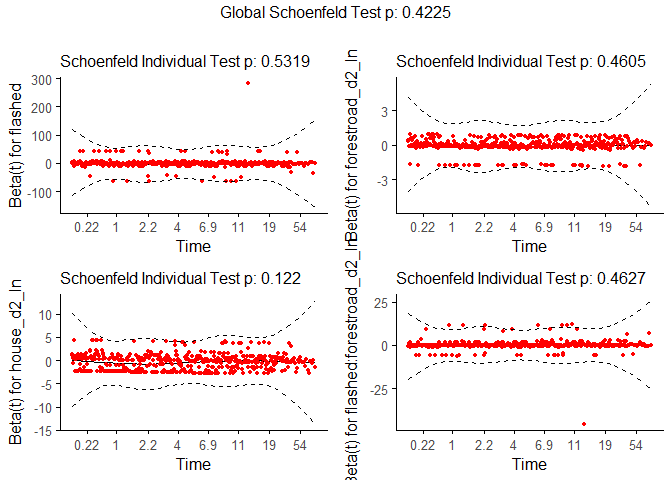<!-- -->

### Badger

``` r
# sp = c("elg","hjort","grevling","gaupe")
sp = "grevling"

# Fitting model with spatial covariates
obs_sp <- obs %>%  # remaking obs_sp, to include the new covariates
  filter(species %in% sp & !period == "Control")

# Example with distance to forest roads and houses
mod0_grevling<-coxph(Surv(t.diff, event, type="right") ~ flashed, data=obs_sp)
summary(mod0_grevling)
```

    ## Call:
    ## coxph(formula = Surv(t.diff, event, type = "right") ~ flashed, 
    ##     data = obs_sp)
    ## 
    ##   n= 650, number of events= 571 
    ## 
    ##                coef exp(coef) se(coef)     z Pr(>|z|)
    ## flashedTRUE 0.07251   1.07521  0.11603 0.625    0.532
    ## 
    ##             exp(coef) exp(-coef) lower .95 upper .95
    ## flashedTRUE     1.075     0.9301    0.8565      1.35
    ## 
    ## Concordance= 0.501  (se = 0.009 )
    ## Likelihood ratio test= 0.38  on 1 df,   p=0.5
    ## Wald test            = 0.39  on 1 df,   p=0.5
    ## Score (logrank) test = 0.39  on 1 df,   p=0.5

``` r
ggforest(mod0_grevling, data = obs_sp)
```

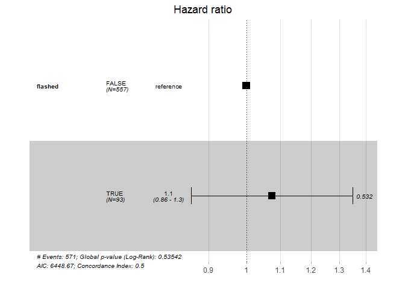<!-- -->

``` r
# Test the proportional hazards assumption
d.mod0_grevling <- cox.zph(mod0_grevling)  
d.mod0_grevling 
```

    ##         chisq df    p
    ## flashed 0.769  1 0.38
    ## GLOBAL  0.769  1 0.38

``` r
summary(fit)$table
```

    ##                                 records n.max n.start events    *rmean
    ## flashed=FALSE, species=elg          175   175     175    126 32.539508
    ## flashed=FALSE, species=gaupe         32    32      32     19 38.894583
    ## flashed=FALSE, species=grevling     557   557     557    483 13.403604
    ## flashed=FALSE, species=hjort         78    78      78     54 36.064867
    ## flashed=FALSE, species=rev          487   487     487    401 19.535975
    ## flashed=FALSE, species=raadyr       930   930     930    863  6.986115
    ## flashed=TRUE, species=elg           105   105     105     83 22.854855
    ## flashed=TRUE, species=gaupe          20    20      20     13 48.748679
    ## flashed=TRUE, species=grevling       93    93      93     88  8.305752
    ## flashed=TRUE, species=hjort          64    64      64     51 18.840612
    ## flashed=TRUE, species=rev            80    80      80     70 13.461687
    ## flashed=TRUE, species=raadyr        313   313     313    295  6.895456
    ##                                 *se(rmean)    median    0.95LCL   0.95UCL
    ## flashed=FALSE, species=elg       4.2065633 10.345162  7.3583449 16.194248
    ## flashed=FALSE, species=gaupe     6.6539782 29.291632 14.8252431        NA
    ## flashed=FALSE, species=grevling  1.5734832  2.477361  2.0121296  2.978877
    ## flashed=FALSE, species=hjort     6.8551428  9.409271  6.9323264 20.762407
    ## flashed=FALSE, species=rev       1.9568937  5.759352  4.9085301  7.087569
    ## flashed=FALSE, species=raadyr    0.7027277  1.561887  1.3264005  1.808727
    ## flashed=TRUE, species=elg        4.5809133  5.894803  3.8539583 10.620475
    ## flashed=TRUE, species=gaupe     13.2212148 24.989439  3.3590046        NA
    ## flashed=TRUE, species=grevling   1.8807610  2.875405  1.7909491  4.223947
    ## flashed=TRUE, species=hjort      5.9187605  2.288808  1.5689699  7.456713
    ## flashed=TRUE, species=rev        2.2677592  6.770023  3.9475463  8.977454
    ## flashed=TRUE, species=raadyr     1.2896542  1.158935  0.9164468  1.519896

``` r
ggcoxzph(d.mod0_grevling,font.main = 12, ggtheme = theme_classic2())
```

    ## Warning in regularize.values(x, y, ties, missing(ties), na.rm = na.rm):
    ## collapsing to unique 'x' values

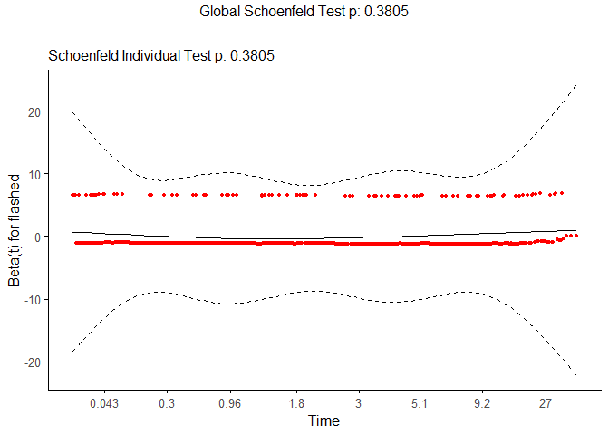<!-- -->

``` r
# Example with distance to forest roads and houses
mod5_grevling<-coxph(Surv(t.diff, event, type="right") ~ flashed *
              forestroad_d2_ln+ house_d2_ln, data=obs_sp)
summary(mod5_grevling)
```

    ## Call:
    ## coxph(formula = Surv(t.diff, event, type = "right") ~ flashed * 
    ##     forestroad_d2_ln + house_d2_ln, data = obs_sp)
    ## 
    ##   n= 650, number of events= 571 
    ## 
    ##                                  coef exp(coef) se(coef)      z Pr(>|z|)    
    ## flashedTRUE                   0.02907   1.02949  0.55370  0.052    0.958    
    ## forestroad_d2_ln              0.01850   1.01867  0.03366  0.550    0.583    
    ## house_d2_ln                  -0.63378   0.53058  0.06489 -9.767   <2e-16 ***
    ## flashedTRUE:forestroad_d2_ln  0.01425   1.01435  0.09141  0.156    0.876    
    ## ---
    ## Signif. codes:  0 '***' 0.001 '**' 0.01 '*' 0.05 '.' 0.1 ' ' 1
    ## 
    ##                              exp(coef) exp(-coef) lower .95 upper .95
    ## flashedTRUE                     1.0295     0.9714    0.3478    3.0474
    ## forestroad_d2_ln                1.0187     0.9817    0.9536    1.0881
    ## house_d2_ln                     0.5306     1.8847    0.4672    0.6025
    ## flashedTRUE:forestroad_d2_ln    1.0144     0.9859    0.8480    1.2134
    ## 
    ## Concordance= 0.637  (se = 0.012 )
    ## Likelihood ratio test= 111.7  on 4 df,   p=<2e-16
    ## Wald test            = 102.4  on 4 df,   p=<2e-16
    ## Score (logrank) test = 104.8  on 4 df,   p=<2e-16

``` r
ggforest(mod5_grevling, data = obs_sp)
```

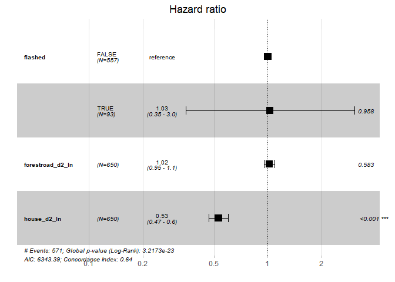<!-- -->

``` r
# Test the proportional hazards assumption
d.mod5_grevling <- cox.zph(mod5_grevling)  
d.mod5_grevling 
```

    ##                             chisq df      p
    ## flashed                  2.22e-04  1 0.9881
    ## forestroad_d2_ln         5.63e+00  1 0.0176
    ## house_d2_ln              3.24e+00  1 0.0717
    ## flashed:forestroad_d2_ln 4.59e-01  1 0.4980
    ## GLOBAL                   1.33e+01  4 0.0099

``` r
summary(fit)$table
```

    ##                                 records n.max n.start events    *rmean
    ## flashed=FALSE, species=elg          175   175     175    126 32.539508
    ## flashed=FALSE, species=gaupe         32    32      32     19 38.894583
    ## flashed=FALSE, species=grevling     557   557     557    483 13.403604
    ## flashed=FALSE, species=hjort         78    78      78     54 36.064867
    ## flashed=FALSE, species=rev          487   487     487    401 19.535975
    ## flashed=FALSE, species=raadyr       930   930     930    863  6.986115
    ## flashed=TRUE, species=elg           105   105     105     83 22.854855
    ## flashed=TRUE, species=gaupe          20    20      20     13 48.748679
    ## flashed=TRUE, species=grevling       93    93      93     88  8.305752
    ## flashed=TRUE, species=hjort          64    64      64     51 18.840612
    ## flashed=TRUE, species=rev            80    80      80     70 13.461687
    ## flashed=TRUE, species=raadyr        313   313     313    295  6.895456
    ##                                 *se(rmean)    median    0.95LCL   0.95UCL
    ## flashed=FALSE, species=elg       4.2065633 10.345162  7.3583449 16.194248
    ## flashed=FALSE, species=gaupe     6.6539782 29.291632 14.8252431        NA
    ## flashed=FALSE, species=grevling  1.5734832  2.477361  2.0121296  2.978877
    ## flashed=FALSE, species=hjort     6.8551428  9.409271  6.9323264 20.762407
    ## flashed=FALSE, species=rev       1.9568937  5.759352  4.9085301  7.087569
    ## flashed=FALSE, species=raadyr    0.7027277  1.561887  1.3264005  1.808727
    ## flashed=TRUE, species=elg        4.5809133  5.894803  3.8539583 10.620475
    ## flashed=TRUE, species=gaupe     13.2212148 24.989439  3.3590046        NA
    ## flashed=TRUE, species=grevling   1.8807610  2.875405  1.7909491  4.223947
    ## flashed=TRUE, species=hjort      5.9187605  2.288808  1.5689699  7.456713
    ## flashed=TRUE, species=rev        2.2677592  6.770023  3.9475463  8.977454
    ## flashed=TRUE, species=raadyr     1.2896542  1.158935  0.9164468  1.519896

``` r
ggcoxzph(d.mod5_grevling,font.main = 12, ggtheme = theme_classic2())
```

    ## Warning in regularize.values(x, y, ties, missing(ties), na.rm = na.rm):
    ## collapsing to unique 'x' values

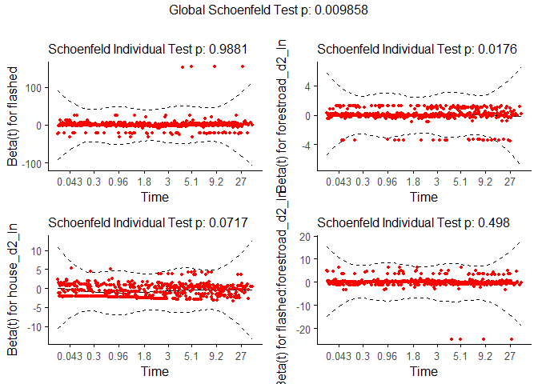<!-- -->

### Moose

``` r
# sp = c("elg","hjort","grevling","gaupe")
sp = "elg"
# Fitting model with spatial covariates
obs_sp <- obs %>%  # remaking obs_sp, to include the new covariates
  filter(species %in% sp & !period == "Control")

# Example with distance to forest roads and houses
mod0_elg<-coxph(Surv(t.diff, event, type="right") ~ flashed , data=obs_sp)
summary(mod0_elg)
```

    ## Call:
    ## coxph(formula = Surv(t.diff, event, type = "right") ~ flashed, 
    ##     data = obs_sp)
    ## 
    ##   n= 280, number of events= 209 
    ## 
    ##               coef exp(coef) se(coef)     z Pr(>|z|)  
    ## flashedTRUE 0.2716    1.3121   0.1418 1.915   0.0554 .
    ## ---
    ## Signif. codes:  0 '***' 0.001 '**' 0.01 '*' 0.05 '.' 0.1 ' ' 1
    ## 
    ##             exp(coef) exp(-coef) lower .95 upper .95
    ## flashedTRUE     1.312     0.7621    0.9937     1.733
    ## 
    ## Concordance= 0.534  (se = 0.018 )
    ## Likelihood ratio test= 3.59  on 1 df,   p=0.06
    ## Wald test            = 3.67  on 1 df,   p=0.06
    ## Score (logrank) test = 3.69  on 1 df,   p=0.05

``` r
ggforest(mod0_elg, data = obs_sp)
```

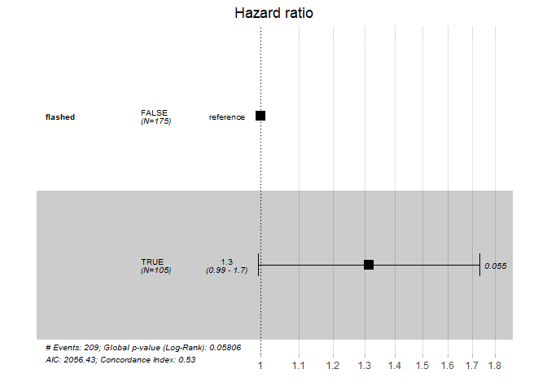<!-- -->

``` r
# Test the proportional hazards assumption
d.mod0_elg <- cox.zph(mod0_elg)  
d.mod0_elg 
```

    ##          chisq df    p
    ## flashed 0.0274  1 0.87
    ## GLOBAL  0.0274  1 0.87

``` r
summary(fit)$table
```

    ##                                 records n.max n.start events    *rmean
    ## flashed=FALSE, species=elg          175   175     175    126 32.539508
    ## flashed=FALSE, species=gaupe         32    32      32     19 38.894583
    ## flashed=FALSE, species=grevling     557   557     557    483 13.403604
    ## flashed=FALSE, species=hjort         78    78      78     54 36.064867
    ## flashed=FALSE, species=rev          487   487     487    401 19.535975
    ## flashed=FALSE, species=raadyr       930   930     930    863  6.986115
    ## flashed=TRUE, species=elg           105   105     105     83 22.854855
    ## flashed=TRUE, species=gaupe          20    20      20     13 48.748679
    ## flashed=TRUE, species=grevling       93    93      93     88  8.305752
    ## flashed=TRUE, species=hjort          64    64      64     51 18.840612
    ## flashed=TRUE, species=rev            80    80      80     70 13.461687
    ## flashed=TRUE, species=raadyr        313   313     313    295  6.895456
    ##                                 *se(rmean)    median    0.95LCL   0.95UCL
    ## flashed=FALSE, species=elg       4.2065633 10.345162  7.3583449 16.194248
    ## flashed=FALSE, species=gaupe     6.6539782 29.291632 14.8252431        NA
    ## flashed=FALSE, species=grevling  1.5734832  2.477361  2.0121296  2.978877
    ## flashed=FALSE, species=hjort     6.8551428  9.409271  6.9323264 20.762407
    ## flashed=FALSE, species=rev       1.9568937  5.759352  4.9085301  7.087569
    ## flashed=FALSE, species=raadyr    0.7027277  1.561887  1.3264005  1.808727
    ## flashed=TRUE, species=elg        4.5809133  5.894803  3.8539583 10.620475
    ## flashed=TRUE, species=gaupe     13.2212148 24.989439  3.3590046        NA
    ## flashed=TRUE, species=grevling   1.8807610  2.875405  1.7909491  4.223947
    ## flashed=TRUE, species=hjort      5.9187605  2.288808  1.5689699  7.456713
    ## flashed=TRUE, species=rev        2.2677592  6.770023  3.9475463  8.977454
    ## flashed=TRUE, species=raadyr     1.2896542  1.158935  0.9164468  1.519896

``` r
ggcoxzph(d.mod0_elg,font.main = 12, ggtheme = theme_classic2())
```

    ## Warning in regularize.values(x, y, ties, missing(ties), na.rm = na.rm):
    ## collapsing to unique 'x' values

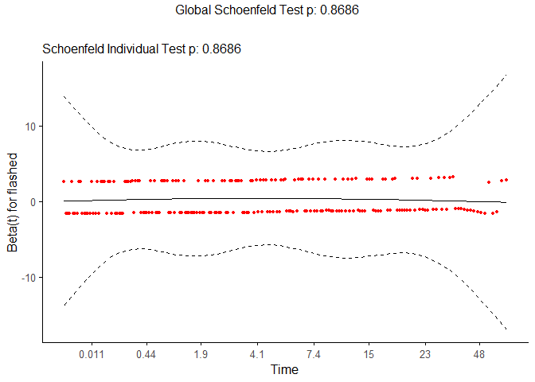<!-- -->

``` r
# Example with distance to forest roads and houses
mod5_elg<-coxph(Surv(t.diff, event, type="right") ~ flashed *
              forestroad_d2_ln+ house_d2_ln, data=obs_sp)
summary(mod5_elg)
```

    ## Call:
    ## coxph(formula = Surv(t.diff, event, type = "right") ~ flashed * 
    ##     forestroad_d2_ln + house_d2_ln, data = obs_sp)
    ## 
    ##   n= 280, number of events= 209 
    ## 
    ##                                  coef exp(coef) se(coef)      z Pr(>|z|)
    ## flashedTRUE                   0.21732   1.24274  0.44539  0.488    0.626
    ## forestroad_d2_ln             -0.03097   0.96951  0.04635 -0.668    0.504
    ## house_d2_ln                  -0.11039   0.89548  0.11408 -0.968    0.333
    ## flashedTRUE:forestroad_d2_ln  0.01066   1.01072  0.07993  0.133    0.894
    ## 
    ##                              exp(coef) exp(-coef) lower .95 upper .95
    ## flashedTRUE                     1.2427     0.8047    0.5191     2.975
    ## forestroad_d2_ln                0.9695     1.0314    0.8853     1.062
    ## house_d2_ln                     0.8955     1.1167    0.7161     1.120
    ## flashedTRUE:forestroad_d2_ln    1.0107     0.9894    0.8642     1.182
    ## 
    ## Concordance= 0.55  (se = 0.021 )
    ## Likelihood ratio test= 4.82  on 4 df,   p=0.3
    ## Wald test            = 4.82  on 4 df,   p=0.3
    ## Score (logrank) test = 4.85  on 4 df,   p=0.3

``` r
ggforest(mod5_elg, data = obs_sp)
```

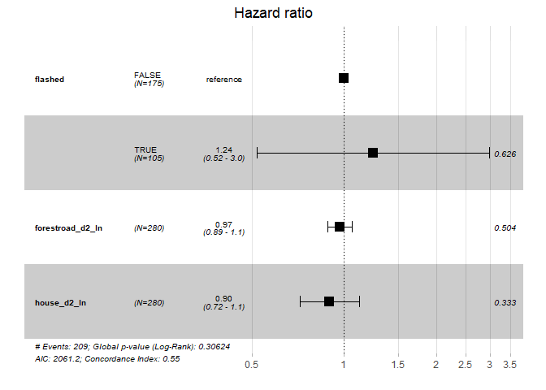<!-- -->

``` r
# Test the proportional hazards assumption
d.mod5_elg <- cox.zph(mod5_elg)  
d.mod5_elg 
```

    ##                           chisq df     p
    ## flashed                  0.0246  1 0.875
    ## forestroad_d2_ln         3.4828  1 0.062
    ## house_d2_ln              1.2166  1 0.270
    ## flashed:forestroad_d2_ln 0.7269  1 0.394
    ## GLOBAL                   6.2909  4 0.178

``` r
summary(fit)$table
```

    ##                                 records n.max n.start events    *rmean
    ## flashed=FALSE, species=elg          175   175     175    126 32.539508
    ## flashed=FALSE, species=gaupe         32    32      32     19 38.894583
    ## flashed=FALSE, species=grevling     557   557     557    483 13.403604
    ## flashed=FALSE, species=hjort         78    78      78     54 36.064867
    ## flashed=FALSE, species=rev          487   487     487    401 19.535975
    ## flashed=FALSE, species=raadyr       930   930     930    863  6.986115
    ## flashed=TRUE, species=elg           105   105     105     83 22.854855
    ## flashed=TRUE, species=gaupe          20    20      20     13 48.748679
    ## flashed=TRUE, species=grevling       93    93      93     88  8.305752
    ## flashed=TRUE, species=hjort          64    64      64     51 18.840612
    ## flashed=TRUE, species=rev            80    80      80     70 13.461687
    ## flashed=TRUE, species=raadyr        313   313     313    295  6.895456
    ##                                 *se(rmean)    median    0.95LCL   0.95UCL
    ## flashed=FALSE, species=elg       4.2065633 10.345162  7.3583449 16.194248
    ## flashed=FALSE, species=gaupe     6.6539782 29.291632 14.8252431        NA
    ## flashed=FALSE, species=grevling  1.5734832  2.477361  2.0121296  2.978877
    ## flashed=FALSE, species=hjort     6.8551428  9.409271  6.9323264 20.762407
    ## flashed=FALSE, species=rev       1.9568937  5.759352  4.9085301  7.087569
    ## flashed=FALSE, species=raadyr    0.7027277  1.561887  1.3264005  1.808727
    ## flashed=TRUE, species=elg        4.5809133  5.894803  3.8539583 10.620475
    ## flashed=TRUE, species=gaupe     13.2212148 24.989439  3.3590046        NA
    ## flashed=TRUE, species=grevling   1.8807610  2.875405  1.7909491  4.223947
    ## flashed=TRUE, species=hjort      5.9187605  2.288808  1.5689699  7.456713
    ## flashed=TRUE, species=rev        2.2677592  6.770023  3.9475463  8.977454
    ## flashed=TRUE, species=raadyr     1.2896542  1.158935  0.9164468  1.519896

``` r
ggcoxzph(d.mod5_elg,font.main = 12, ggtheme = theme_classic2())
```

    ## Warning in regularize.values(x, y, ties, missing(ties), na.rm = na.rm):
    ## collapsing to unique 'x' values

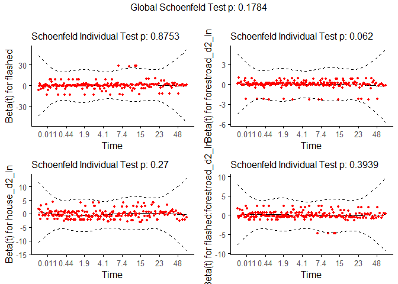<!-- -->

### Red deer

``` r
# sp = c("elg","hjort","grevling","gaupe")
sp = "hjort"
# Fitting model with spatial covariates
obs_sp <- obs %>%  # remaking obs_sp, to include the new covariates
  filter(species %in% sp & !period == "Control")

# Example with distance to forest roads and houses
mod0_hjort<-coxph(Surv(t.diff, event, type="right") ~ flashed , data=obs_sp)
summary(mod0_hjort)
```

    ## Call:
    ## coxph(formula = Surv(t.diff, event, type = "right") ~ flashed, 
    ##     data = obs_sp)
    ## 
    ##   n= 142, number of events= 105 
    ## 
    ##               coef exp(coef) se(coef)     z Pr(>|z|)  
    ## flashedTRUE 0.4628    1.5885   0.1980 2.337   0.0194 *
    ## ---
    ## Signif. codes:  0 '***' 0.001 '**' 0.01 '*' 0.05 '.' 0.1 ' ' 1
    ## 
    ##             exp(coef) exp(-coef) lower .95 upper .95
    ## flashedTRUE     1.589     0.6295     1.078     2.342
    ## 
    ## Concordance= 0.555  (se = 0.027 )
    ## Likelihood ratio test= 5.4  on 1 df,   p=0.02
    ## Wald test            = 5.46  on 1 df,   p=0.02
    ## Score (logrank) test = 5.56  on 1 df,   p=0.02

``` r
ggforest(mod0_hjort, data = obs_sp)
```

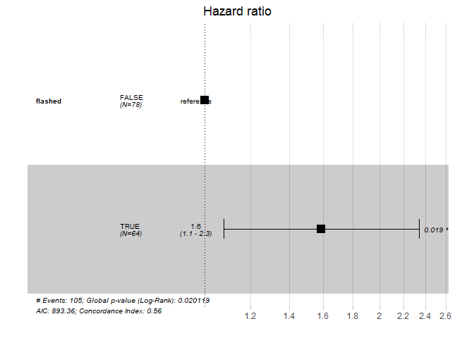<!-- -->

``` r
# Test the proportional hazards assumption
d.mod0_hjort <- cox.zph(mod0_hjort)  
d.mod0_hjort 
```

    ##          chisq df    p
    ## flashed 0.0774  1 0.78
    ## GLOBAL  0.0774  1 0.78

``` r
summary(fit)$table
```

    ##                                 records n.max n.start events    *rmean
    ## flashed=FALSE, species=elg          175   175     175    126 32.539508
    ## flashed=FALSE, species=gaupe         32    32      32     19 38.894583
    ## flashed=FALSE, species=grevling     557   557     557    483 13.403604
    ## flashed=FALSE, species=hjort         78    78      78     54 36.064867
    ## flashed=FALSE, species=rev          487   487     487    401 19.535975
    ## flashed=FALSE, species=raadyr       930   930     930    863  6.986115
    ## flashed=TRUE, species=elg           105   105     105     83 22.854855
    ## flashed=TRUE, species=gaupe          20    20      20     13 48.748679
    ## flashed=TRUE, species=grevling       93    93      93     88  8.305752
    ## flashed=TRUE, species=hjort          64    64      64     51 18.840612
    ## flashed=TRUE, species=rev            80    80      80     70 13.461687
    ## flashed=TRUE, species=raadyr        313   313     313    295  6.895456
    ##                                 *se(rmean)    median    0.95LCL   0.95UCL
    ## flashed=FALSE, species=elg       4.2065633 10.345162  7.3583449 16.194248
    ## flashed=FALSE, species=gaupe     6.6539782 29.291632 14.8252431        NA
    ## flashed=FALSE, species=grevling  1.5734832  2.477361  2.0121296  2.978877
    ## flashed=FALSE, species=hjort     6.8551428  9.409271  6.9323264 20.762407
    ## flashed=FALSE, species=rev       1.9568937  5.759352  4.9085301  7.087569
    ## flashed=FALSE, species=raadyr    0.7027277  1.561887  1.3264005  1.808727
    ## flashed=TRUE, species=elg        4.5809133  5.894803  3.8539583 10.620475
    ## flashed=TRUE, species=gaupe     13.2212148 24.989439  3.3590046        NA
    ## flashed=TRUE, species=grevling   1.8807610  2.875405  1.7909491  4.223947
    ## flashed=TRUE, species=hjort      5.9187605  2.288808  1.5689699  7.456713
    ## flashed=TRUE, species=rev        2.2677592  6.770023  3.9475463  8.977454
    ## flashed=TRUE, species=raadyr     1.2896542  1.158935  0.9164468  1.519896

``` r
ggcoxzph(d.mod0_hjort,font.main = 12, ggtheme = theme_classic2())
```

    ## Warning in regularize.values(x, y, ties, missing(ties), na.rm = na.rm):
    ## collapsing to unique 'x' values

<!-- -->

``` r
# Example with distance to forest roads and houses
mod5_hjort<-coxph(Surv(t.diff, event, type="right") ~ flashed *
              forestroad_d2_ln+ house_d2_ln, data=obs_sp)
summary(mod5_hjort)
```

    ## Call:
    ## coxph(formula = Surv(t.diff, event, type = "right") ~ flashed * 
    ##     forestroad_d2_ln + house_d2_ln, data = obs_sp)
    ## 
    ##   n= 142, number of events= 105 
    ## 
    ##                                  coef exp(coef) se(coef)      z Pr(>|z|)
    ## flashedTRUE                   0.62595   1.87002  0.51634  1.212    0.225
    ## forestroad_d2_ln              0.03726   1.03796  0.06769  0.550    0.582
    ## house_d2_ln                  -0.15428   0.85703  0.16243 -0.950    0.342
    ## flashedTRUE:forestroad_d2_ln -0.03087   0.96960  0.08951 -0.345    0.730
    ## 
    ##                              exp(coef) exp(-coef) lower .95 upper .95
    ## flashedTRUE                     1.8700     0.5348    0.6797     5.145
    ## forestroad_d2_ln                1.0380     0.9634    0.9090     1.185
    ## house_d2_ln                     0.8570     1.1668    0.6234     1.178
    ## flashedTRUE:forestroad_d2_ln    0.9696     1.0313    0.8136     1.156
    ## 
    ## Concordance= 0.572  (se = 0.032 )
    ## Likelihood ratio test= 6.9  on 4 df,   p=0.1
    ## Wald test            = 6.86  on 4 df,   p=0.1
    ## Score (logrank) test = 6.99  on 4 df,   p=0.1

``` r
ggforest(mod5_hjort, data = obs_sp)
```

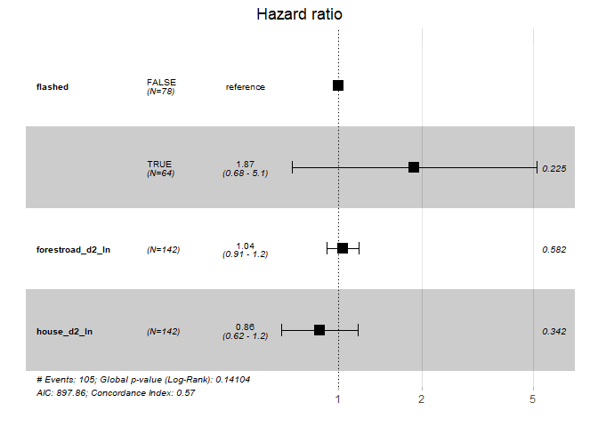<!-- -->

``` r
# Test the proportional hazards assumption
d.mod5_hjort <- cox.zph(mod5_hjort)  
d.mod5_hjort 
```

    ##                             chisq df    p
    ## flashed                  0.036249  1 0.85
    ## forestroad_d2_ln         1.729405  1 0.19
    ## house_d2_ln              2.024534  1 0.15
    ## flashed:forestroad_d2_ln 0.000255  1 0.99
    ## GLOBAL                   5.711035  4 0.22

``` r
summary(fit)$table
```

    ##                                 records n.max n.start events    *rmean
    ## flashed=FALSE, species=elg          175   175     175    126 32.539508
    ## flashed=FALSE, species=gaupe         32    32      32     19 38.894583
    ## flashed=FALSE, species=grevling     557   557     557    483 13.403604
    ## flashed=FALSE, species=hjort         78    78      78     54 36.064867
    ## flashed=FALSE, species=rev          487   487     487    401 19.535975
    ## flashed=FALSE, species=raadyr       930   930     930    863  6.986115
    ## flashed=TRUE, species=elg           105   105     105     83 22.854855
    ## flashed=TRUE, species=gaupe          20    20      20     13 48.748679
    ## flashed=TRUE, species=grevling       93    93      93     88  8.305752
    ## flashed=TRUE, species=hjort          64    64      64     51 18.840612
    ## flashed=TRUE, species=rev            80    80      80     70 13.461687
    ## flashed=TRUE, species=raadyr        313   313     313    295  6.895456
    ##                                 *se(rmean)    median    0.95LCL   0.95UCL
    ## flashed=FALSE, species=elg       4.2065633 10.345162  7.3583449 16.194248
    ## flashed=FALSE, species=gaupe     6.6539782 29.291632 14.8252431        NA
    ## flashed=FALSE, species=grevling  1.5734832  2.477361  2.0121296  2.978877
    ## flashed=FALSE, species=hjort     6.8551428  9.409271  6.9323264 20.762407
    ## flashed=FALSE, species=rev       1.9568937  5.759352  4.9085301  7.087569
    ## flashed=FALSE, species=raadyr    0.7027277  1.561887  1.3264005  1.808727
    ## flashed=TRUE, species=elg        4.5809133  5.894803  3.8539583 10.620475
    ## flashed=TRUE, species=gaupe     13.2212148 24.989439  3.3590046        NA
    ## flashed=TRUE, species=grevling   1.8807610  2.875405  1.7909491  4.223947
    ## flashed=TRUE, species=hjort      5.9187605  2.288808  1.5689699  7.456713
    ## flashed=TRUE, species=rev        2.2677592  6.770023  3.9475463  8.977454
    ## flashed=TRUE, species=raadyr     1.2896542  1.158935  0.9164468  1.519896

``` r
ggcoxzph(d.mod5_hjort,font.main = 12, ggtheme = theme_classic2())
```

    ## Warning in regularize.values(x, y, ties, missing(ties), na.rm = na.rm):
    ## collapsing to unique 'x' values

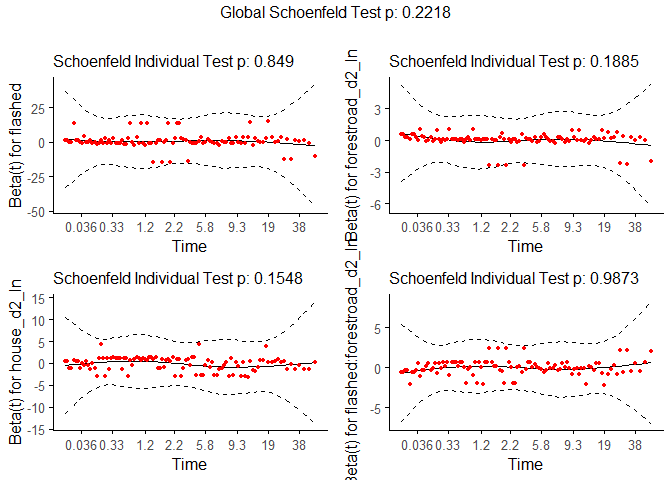<!-- -->

### Lynx

``` r
# sp = c("elg","hjort","grevling","gaupe")
sp = "gaupe"
# Fitting model with spatial covariates
obs_sp <- obs %>%  # remaking obs_sp, to include the new covariates
  filter(species %in% sp & !period == "Control")

# Example with distance to forest roads and houses
mod0_gaupe<-coxph(Surv(t.diff, event, type="right") ~ flashed , data=obs_sp)
summary(mod0_gaupe)
```

    ## Call:
    ## coxph(formula = Surv(t.diff, event, type = "right") ~ flashed, 
    ##     data = obs_sp)
    ## 
    ##   n= 52, number of events= 32 
    ## 
    ##                coef exp(coef) se(coef)     z Pr(>|z|)
    ## flashedTRUE 0.03046   1.03093  0.36785 0.083    0.934
    ## 
    ##             exp(coef) exp(-coef) lower .95 upper .95
    ## flashedTRUE     1.031       0.97    0.5013      2.12
    ## 
    ## Concordance= 0.529  (se = 0.049 )
    ## Likelihood ratio test= 0.01  on 1 df,   p=0.9
    ## Wald test            = 0.01  on 1 df,   p=0.9
    ## Score (logrank) test = 0.01  on 1 df,   p=0.9

``` r
ggforest(mod0_gaupe, data = obs_sp)
```

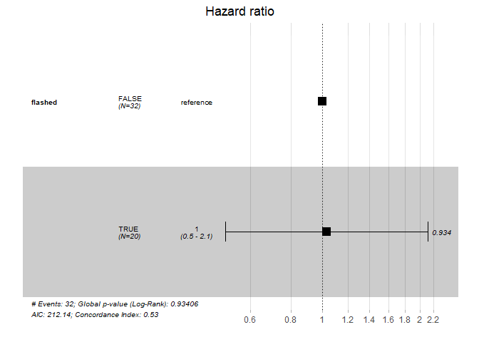<!-- -->

``` r
# Test the proportional hazards assumption
d.mod0_gaupe <- cox.zph(mod0_gaupe)  
d.mod0_gaupe 
```

    ##         chisq df    p
    ## flashed  2.14  1 0.14
    ## GLOBAL   2.14  1 0.14

``` r
summary(fit)$table
```

    ##                                 records n.max n.start events    *rmean
    ## flashed=FALSE, species=elg          175   175     175    126 32.539508
    ## flashed=FALSE, species=gaupe         32    32      32     19 38.894583
    ## flashed=FALSE, species=grevling     557   557     557    483 13.403604
    ## flashed=FALSE, species=hjort         78    78      78     54 36.064867
    ## flashed=FALSE, species=rev          487   487     487    401 19.535975
    ## flashed=FALSE, species=raadyr       930   930     930    863  6.986115
    ## flashed=TRUE, species=elg           105   105     105     83 22.854855
    ## flashed=TRUE, species=gaupe          20    20      20     13 48.748679
    ## flashed=TRUE, species=grevling       93    93      93     88  8.305752
    ## flashed=TRUE, species=hjort          64    64      64     51 18.840612
    ## flashed=TRUE, species=rev            80    80      80     70 13.461687
    ## flashed=TRUE, species=raadyr        313   313     313    295  6.895456
    ##                                 *se(rmean)    median    0.95LCL   0.95UCL
    ## flashed=FALSE, species=elg       4.2065633 10.345162  7.3583449 16.194248
    ## flashed=FALSE, species=gaupe     6.6539782 29.291632 14.8252431        NA
    ## flashed=FALSE, species=grevling  1.5734832  2.477361  2.0121296  2.978877
    ## flashed=FALSE, species=hjort     6.8551428  9.409271  6.9323264 20.762407
    ## flashed=FALSE, species=rev       1.9568937  5.759352  4.9085301  7.087569
    ## flashed=FALSE, species=raadyr    0.7027277  1.561887  1.3264005  1.808727
    ## flashed=TRUE, species=elg        4.5809133  5.894803  3.8539583 10.620475
    ## flashed=TRUE, species=gaupe     13.2212148 24.989439  3.3590046        NA
    ## flashed=TRUE, species=grevling   1.8807610  2.875405  1.7909491  4.223947
    ## flashed=TRUE, species=hjort      5.9187605  2.288808  1.5689699  7.456713
    ## flashed=TRUE, species=rev        2.2677592  6.770023  3.9475463  8.977454
    ## flashed=TRUE, species=raadyr     1.2896542  1.158935  0.9164468  1.519896

``` r
ggcoxzph(d.mod0_gaupe,font.main = 12, ggtheme = theme_classic2())
```

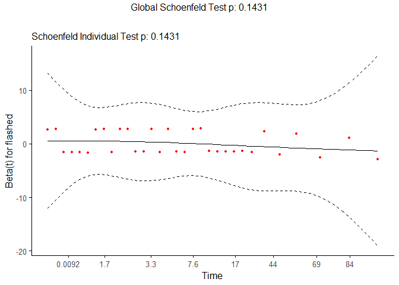<!-- -->

``` r
# Example with distance to forest roads and houses
mod5_gaupe<-coxph(Surv(t.diff, event, type="right") ~ flashed *
              forestroad_d2_ln+ house_d2_ln, data=obs_sp)
summary(mod5_gaupe)
```

    ## Call:
    ## coxph(formula = Surv(t.diff, event, type = "right") ~ flashed * 
    ##     forestroad_d2_ln + house_d2_ln, data = obs_sp)
    ## 
    ##   n= 52, number of events= 32 
    ## 
    ##                                 coef exp(coef) se(coef)      z Pr(>|z|)  
    ## flashedTRUE                  -1.2608    0.2834   2.7164 -0.464   0.6426  
    ## forestroad_d2_ln             -0.2605    0.7707   0.1588 -1.641   0.1009  
    ## house_d2_ln                  -0.9315    0.3940   0.4424 -2.105   0.0353 *
    ## flashedTRUE:forestroad_d2_ln  0.2493    1.2832   0.4601  0.542   0.5879  
    ## ---
    ## Signif. codes:  0 '***' 0.001 '**' 0.01 '*' 0.05 '.' 0.1 ' ' 1
    ## 
    ##                              exp(coef) exp(-coef) lower .95 upper .95
    ## flashedTRUE                     0.2834     3.5282  0.001381   58.1676
    ## forestroad_d2_ln                0.7707     1.2975  0.564593    1.0520
    ## house_d2_ln                     0.3940     2.5382  0.165530    0.9377
    ## flashedTRUE:forestroad_d2_ln    1.2832     0.7793  0.520729    3.1619
    ## 
    ## Concordance= 0.612  (se = 0.066 )
    ## Likelihood ratio test= 6.39  on 4 df,   p=0.2
    ## Wald test            = 5.6  on 4 df,   p=0.2
    ## Score (logrank) test = 5.76  on 4 df,   p=0.2

``` r
ggforest(mod5_gaupe, data = obs_sp)
```

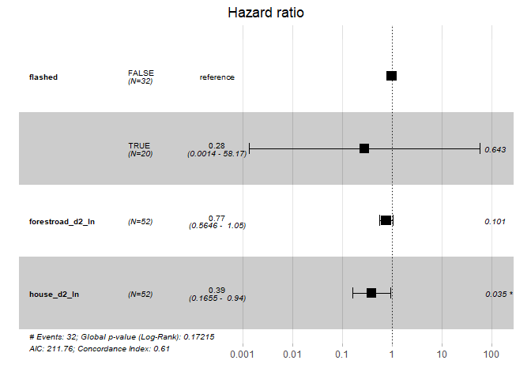<!-- -->

``` r
# Test the proportional hazards assumption
d.mod5_gaupe <- cox.zph(mod5_gaupe)  
d.mod5_gaupe 
```

    ##                            chisq df       p
    ## flashed                   1.6845  1   0.194
    ## forestroad_d2_ln          0.0603  1   0.806
    ## house_d2_ln              24.1284  1 9.0e-07
    ## flashed:forestroad_d2_ln  3.4607  1   0.063
    ## GLOBAL                   27.7276  4 1.4e-05

``` r
summary(fit)$table
```

    ##                                 records n.max n.start events    *rmean
    ## flashed=FALSE, species=elg          175   175     175    126 32.539508
    ## flashed=FALSE, species=gaupe         32    32      32     19 38.894583
    ## flashed=FALSE, species=grevling     557   557     557    483 13.403604
    ## flashed=FALSE, species=hjort         78    78      78     54 36.064867
    ## flashed=FALSE, species=rev          487   487     487    401 19.535975
    ## flashed=FALSE, species=raadyr       930   930     930    863  6.986115
    ## flashed=TRUE, species=elg           105   105     105     83 22.854855
    ## flashed=TRUE, species=gaupe          20    20      20     13 48.748679
    ## flashed=TRUE, species=grevling       93    93      93     88  8.305752
    ## flashed=TRUE, species=hjort          64    64      64     51 18.840612
    ## flashed=TRUE, species=rev            80    80      80     70 13.461687
    ## flashed=TRUE, species=raadyr        313   313     313    295  6.895456
    ##                                 *se(rmean)    median    0.95LCL   0.95UCL
    ## flashed=FALSE, species=elg       4.2065633 10.345162  7.3583449 16.194248
    ## flashed=FALSE, species=gaupe     6.6539782 29.291632 14.8252431        NA
    ## flashed=FALSE, species=grevling  1.5734832  2.477361  2.0121296  2.978877
    ## flashed=FALSE, species=hjort     6.8551428  9.409271  6.9323264 20.762407
    ## flashed=FALSE, species=rev       1.9568937  5.759352  4.9085301  7.087569
    ## flashed=FALSE, species=raadyr    0.7027277  1.561887  1.3264005  1.808727
    ## flashed=TRUE, species=elg        4.5809133  5.894803  3.8539583 10.620475
    ## flashed=TRUE, species=gaupe     13.2212148 24.989439  3.3590046        NA
    ## flashed=TRUE, species=grevling   1.8807610  2.875405  1.7909491  4.223947
    ## flashed=TRUE, species=hjort      5.9187605  2.288808  1.5689699  7.456713
    ## flashed=TRUE, species=rev        2.2677592  6.770023  3.9475463  8.977454
    ## flashed=TRUE, species=raadyr     1.2896542  1.158935  0.9164468  1.519896

``` r
ggcoxzph(d.mod5_gaupe,font.main = 12, ggtheme = theme_classic2())
```

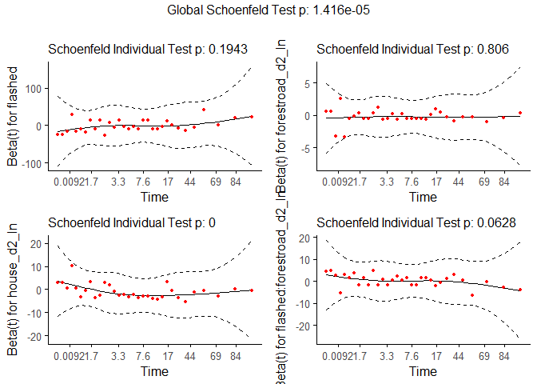<!-- -->

------------------------------------------------------------------------

# Session Info

``` r
sessionInfo()
```

    ## R version 4.0.3 (2020-10-10)
    ## Platform: x86_64-w64-mingw32/x64 (64-bit)
    ## Running under: Windows 10 x64 (build 19041)
    ## 
    ## Matrix products: default
    ## 
    ## locale:
    ## [1] LC_COLLATE=Norwegian Bokmål_Norway.1252 
    ## [2] LC_CTYPE=Norwegian Bokmål_Norway.1252   
    ## [3] LC_MONETARY=Norwegian Bokmål_Norway.1252
    ## [4] LC_NUMERIC=C                            
    ## [5] LC_TIME=Norwegian Bokmål_Norway.1252    
    ## 
    ## attached base packages:
    ## [1] stats     graphics  grDevices utils     datasets  methods   base     
    ## 
    ## other attached packages:
    ##  [1] corrplot_0.84      reshape2_1.4.4     equatiomatic_0.1.0 vip_0.3.2         
    ##  [5] survminer_0.4.8    ggpubr_0.4.0       survival_3.2-7     lubridate_1.7.9.2 
    ##  [9] yardstick_0.0.7    workflows_0.2.1    tune_0.1.2         rsample_0.0.8     
    ## [13] recipes_0.1.15     parsnip_0.1.5      modeldata_0.1.0    infer_0.5.4       
    ## [17] dials_0.0.9        scales_1.1.1       broom_0.7.3        tidymodels_0.1.2  
    ## [21] forcats_0.5.0      stringr_1.4.0      dplyr_1.0.3        purrr_0.3.4       
    ## [25] readr_1.4.0        tidyr_1.1.2        tibble_3.0.5       ggplot2_3.3.3     
    ## [29] tidyverse_1.3.0    report_0.2.0       pander_0.6.3      
    ## 
    ## loaded via a namespace (and not attached):
    ##   [1] readxl_1.3.1        backports_1.2.0     plyr_1.8.6         
    ##   [4] repr_1.1.3          splines_4.0.3       listenv_0.8.0      
    ##   [7] digest_0.6.27       foreach_1.5.1       htmltools_0.5.1.1  
    ##  [10] fansi_0.4.2         magrittr_2.0.1      openxlsx_4.2.3     
    ##  [13] globals_0.14.0      modelr_0.1.8        gower_0.2.2        
    ##  [16] colorspace_2.0-0    skimr_2.1.2         rvest_0.3.6        
    ##  [19] haven_2.3.1         xfun_0.20           crayon_1.3.4       
    ##  [22] jsonlite_1.7.2      zoo_1.8-8           iterators_1.0.13   
    ##  [25] glue_1.4.2          gtable_0.3.0        ipred_0.9-9        
    ##  [28] car_3.0-10          abind_1.4-5         DBI_1.1.1          
    ##  [31] rstatix_0.6.0       Rcpp_1.0.6          xtable_1.8-4       
    ##  [34] GPfit_1.0-8         foreign_0.8-80      km.ci_0.5-2        
    ##  [37] lava_1.6.8.1        prodlim_2019.11.13  httr_1.4.2         
    ##  [40] ellipsis_0.3.1      pkgconfig_2.0.3     farver_2.0.3       
    ##  [43] nnet_7.3-14         dbplyr_2.0.0        utf8_1.1.4         
    ##  [46] tidyselect_1.1.0    labeling_0.4.2      rlang_0.4.10       
    ##  [49] DiceDesign_1.8-1    effectsize_0.4.3.1  munsell_0.5.0      
    ##  [52] cellranger_1.1.0    tools_4.0.3         cli_2.2.0          
    ##  [55] generics_0.1.0      evaluate_0.14       yaml_2.2.1         
    ##  [58] knitr_1.31          fs_1.5.0            zip_2.1.1          
    ##  [61] survMisc_0.5.5      nlme_3.1-149        future_1.21.0      
    ##  [64] xml2_1.3.2          compiler_4.0.3      rstudioapi_0.13    
    ##  [67] curl_4.3            ggsignif_0.6.0      reprex_0.3.0       
    ##  [70] lhs_1.1.1           stringi_1.5.3       highr_0.8          
    ##  [73] parameters_0.11.0.1 lattice_0.20-41     Matrix_1.2-18      
    ##  [76] KMsurv_0.1-5        vctrs_0.3.6         pillar_1.4.7       
    ##  [79] lifecycle_0.2.0     furrr_0.2.1         data.table_1.13.6  
    ##  [82] cowplot_1.1.1       insight_0.12.0.1    R6_2.5.0           
    ##  [85] gridExtra_2.3       rio_0.5.16          parallelly_1.23.0  
    ##  [88] codetools_0.2-16    MASS_7.3-53         assertthat_0.2.1   
    ##  [91] withr_2.4.1         mgcv_1.8-33         bayestestR_0.8.2.1 
    ##  [94] parallel_4.0.3      hms_1.0.0           grid_4.0.3         
    ##  [97] rpart_4.1-15        timeDate_3043.102   class_7.3-17       
    ## [100] rmarkdown_2.6       carData_3.0-4       pROC_1.17.0.1      
    ## [103] base64enc_0.1-3

``` r
# packrat
# checkpoint
```

If you want your code to be reproducible in the long-run (i.e. so you
can come back to run it next month or next year), you’ll need to track
the versions of the packages that your code uses. A rigorous approach is
to use *packrat*, [link](http://rstudio.github.io/packrat/), which
stores packages in your project directory, or *checkpoint*,
[link](https://github.com/RevolutionAnalytics/checkpoint), which will
reinstall packages available on a specified date. A quick and dirty hack
is to include a chunk that runs sessionInfo() — that won’t let you
easily recreate your packages as they are today, but at least you’ll
know what they were.
