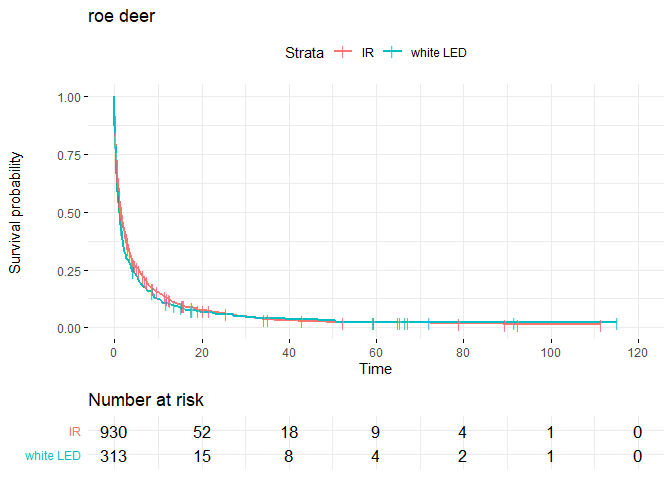
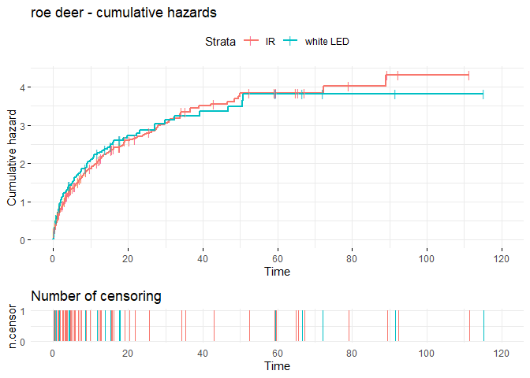
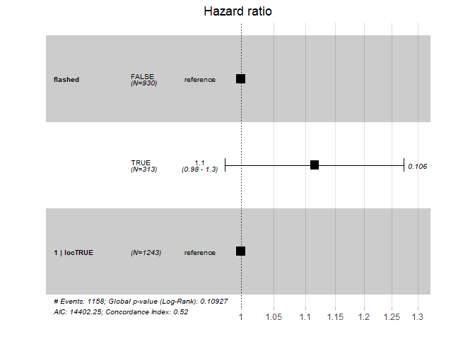
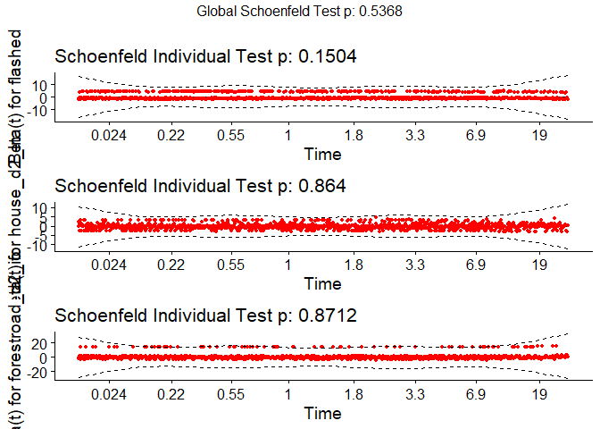

Survival modelling
================
Torgeir
27 januar, 2021

### Purpose of this notebook

Transporting Neri’s survival analysis skript into a Rmd-notebook, as for
me to be able to write down thoughts and ideas along the way while
learning more about R and analysing *my* data.

This is not written as a lab-notebook from day to day, but rather as a
gross layout to what my results-section could end up looking like, or at
least a “behind the scenes”-approximation.

I’m also considering to implement the survival analysis into the
tidymodels framework, as I like their approach of connecting different
modelling-packages into one identical syntax. It seems I can make
general models for all my species in conjunction that way, following the
roadmap layed out by Hadley Wickham in [R for Data Science - Chapter 25:
Many Models](https://r4ds.had.co.nz/many-models.html).

<!-- Comments look like this, instead of the LaTeX % -->

------------------------------------------------------------------------

# Setting up the data

``` r
obs %>% 
  skimr::skim(validated_species, period) 
```

|                                                  |            |
|:-------------------------------------------------|:-----------|
| Name                                             | Piped data |
| Number of rows                                   | 23223      |
| Number of columns                                | 18         |
| \_\_\_\_\_\_\_\_\_\_\_\_\_\_\_\_\_\_\_\_\_\_\_   |            |
| Column type frequency:                           |            |
| character                                        | 2          |
| \_\_\_\_\_\_\_\_\_\_\_\_\_\_\_\_\_\_\_\_\_\_\_\_ |            |
| Group variables                                  | None       |

Data summary

**Variable type: character**

| skim\_variable     | n\_missing | complete\_rate | min | max | empty | n\_unique | whitespace |
|:-------------------|-----------:|---------------:|----:|----:|------:|----------:|-----------:|
| validated\_species |          0 |              1 |   2 |  14 |     0 |        28 |          0 |
| period             |          0 |              1 |   3 |   7 |     0 |         5 |          0 |

First, I’ll filter out the species I will focus on. As the cameras were
set up to detect lynx, I will filter out species that are significantly
smaller. Squirrel and hare are examples of species that can’t be
expected to get detected every time they pass close to the expected
travelling route, due to the average height of the cameras, and that
they are not angled towards the ground.

In addition I filter out non specific groups (e.g. birds), infrequent
sightings (i.e. &lt; 50), and irrelevant groups (cattle, vehicles,
humans). However, the “irrelevant” groups could be interesting to come
back to later, to see if their presence have predictive power in my
models.

``` r
fjern <- c("nothing","hund", "menneske", "kjoeretoey", "motorsykkel", "sykkel", "ukjent", 
           "sau", "ku", "fugl", "skogshons", "smagnagere", "andre_maardyr", "andre_pattedyr") # uninteresting or too general groups
passes <- obs %>% group_by(validated_species) %>% 
  summarise(count = n(),   # flashed = mean(flash, na.rm = T), # don't know if i can find a relevant use of this
            period = period, flash = flash) %>% 
  filter(!is.na(validated_species), !(validated_species %in% fjern))
  ggplot(passes) +
  geom_bar(aes(reorder(validated_species, count, FUN = mean)), position = "dodge") +  # reorders by mean count
  geom_hline(yintercept = 50) + coord_flip() # flip the axes
```

<!-- -->

``` r
# removing small mammals
small <- c("maar", "ekorn", "hare")
p_sp_focus <- passes %>% 
  filter(count > 50, !validated_species  %in% small) %>%  
  ggplot(aes(reorder(validated_species, count, FUN = mean))) + coord_flip()
p_sp_focus + geom_bar(aes(fill = flash),position = "dodge") + geom_hline(yintercept = 50)
```

<!-- --> Having
filtered out most sightings, we are left with the most common, large
mammals. There are very few sightings of lynx when divided by times it
was and wasn’t flashed by a white LED. For the rest of the species in
this plot, we can rest assured that we have a lot of datapoints, and
that the species are large enough to be photo captured every time they
pass the camera by the expected route.

# Build the model

### Baseline hazard function

The baseline hazard function *H*<sub>0</sub>(*t*) is the hazard at time
*t* when all predictors equals to zero. You can think about the
*H*<sub>0</sub>(*t*) being the intercept, although this is not strictly
true. That is because in reality, *H*<sub>0</sub>(*t*) varies over time,
and we can never know its true value. However, we can calculate the
hazard ratio between groups. We will never know a true hazard for any
given group at a given time, because we lack the knowledge of the
shifting baseline, but we can know the relative hazard between groups.

In other words, for my case, I do not know the true probability (hazard)
for any given species to get photo-captured by any of the cameras in my
study. Nor can I find it out, as this truly is an ever changing value.
Still, I can measure the relative difference in frequencies between the
groups equipped with a white LED flash, and the groups only equipped
with IR flash.

Ratios must stay constant over time, ie. if group B has twice the hazard
of group A at time *t*, the assumption is that this relationship will
stay that way at time *t* + 1. In other words, as I assume different
species will have different reactions to the white LED, I cannot
estimate the Hazard ratio between them. *Or can I?* Actually, I think I
can’t, because if a badger is indifferent to the white LED, his ratio to
any other *reacting* species will be constantly changing.

``` r
sp = "raadyr"
obs_sp <- obs %>% filter(validated_species %in% sp & !period == "Control") # filtering out control + keeping only sp
mod0 <- coxph(Surv(t.diff, event, type = "right") ~ flashed, 
  data = obs_sp)                                            #  cleaner code with a temporary obs_sp
summary(mod0) 
```

    ## Call:
    ## coxph(formula = Surv(t.diff, event, type = "right") ~ flashed, 
    ##     data = obs_sp)
    ## 
    ##   n= 1243, number of events= 1158 
    ## 
    ##               coef exp(coef) se(coef)     z Pr(>|z|)
    ## flashedTRUE 0.1091    1.1153   0.0675 1.616    0.106
    ## 
    ##             exp(coef) exp(-coef) lower .95 upper .95
    ## flashedTRUE     1.115     0.8967    0.9771     1.273
    ## 
    ## Concordance= 0.515  (se = 0.007 )
    ## Likelihood ratio test= 2.56  on 1 df,   p=0.1
    ## Wald test            = 2.61  on 1 df,   p=0.1
    ## Score (logrank) test = 2.61  on 1 df,   p=0.1

So what am I really testing when I’m doing a survival analysis? I’m
testing whether or not the survival curves are significantly different
from each other. If it is, the summary-output of a model will show a
p-value ( Pr(&gt;\|z\|) ) lower than 0.05, and the lower and upper .95
interval should not contain the value ***1***.

The mod0 for roe deer has a *P**r*( &gt; \|*z*\|) = 0.0444 and the .95
confidence interval is 1.003 to 1.309. In other words the model is right
on the edge of being significant. This seems to hint at an actual effect
of the flash, but the p-score should keep us critical.

``` r
# Survival probabilty against time.
fit <- survfit(Surv(t.diff, event, type = "right") ~ flashed, 
  data = obs_sp)
ggsurvplot(fit, data = obs_sp, title = "roe deer", 
          risk.table = T, break.time.by = 20, ggtheme = theme_minimal(),
          censor.shape = "|", censor.size = 3,
          tables.height = 0.2, tables.theme = theme_cleantable())
```

<!-- -->

``` r
ggsurvplot(fit, data = obs_sp, title = "roe deer",
          risk.table = T, break.time.by = 10, ggtheme = theme_minimal(),
          conf.int = T, xlim = c(0,50), censor.shape = "|", censor.size = 3,
          tables.height = 0.2, tables.theme = theme_cleantable()
          #cumcensor = T
)
```

<!-- -->

``` r
#ggsurvplot(fit, data = obs_sp, title = "roe deer", coord_trans(x="log2")) #want to find a way to log transform x-axis

ggsurvplot(fit, data = obs_sp, title = "roe deer", 
          break.time.by = 20, ggtheme = theme_minimal(),
          censor.shape = "|", censor.size = 3, fun = "cumhaz" )
```

<!-- -->

``` r
# fun = "event" plots cumulative events (f(y) = 1-y), 
# "cumhaz" plots the cumulative hazard function (f(y) = -log(y)), and 
# "pct" for survival probability in percentage
```

## Diagnosing the model

``` r
# A nicer way to visualize the coffecient estimate and the
# confidence interval. Since the interval doesn't overlap 
# 1 (hazard ratio of 1) the coeffecient estimate is significant.
ggforest(mod0, data = obs_sp)
```

<!-- -->

``` r
# Diagnostics - Are we violating the proportional hazard
# assumption?

# Test the proportional hazards assumption
d.mod0 <- cox.zph(mod0)  
d.mod0 # Non-significant --> we can assume proportional hazards.
```

    ##         chisq df    p
    ## flashed  1.95  1 0.16
    ## GLOBAL   1.95  1 0.16

``` r
summary(fit)$table
```

    ##               records n.max n.start events   *rmean *se(rmean)   median
    ## flashed=FALSE     930   930     930    863 6.695302  0.6071114 1.561887
    ## flashed=TRUE      313   313     313    295 6.422127  1.1027307 1.158935
    ##                 0.95LCL  0.95UCL
    ## flashed=FALSE 1.3264005 1.808727
    ## flashed=TRUE  0.9164468 1.519896

``` r
# Can also look at Schoenfeld residuals, there should be no
# pattern with time
ggcoxzph(d.mod0)
```

<!-- --> When
the confidence intervals are included in the plot, the white LED CI
overlaps the IR curve almost constantly. Therefore it doesn’t seem to be
a large effect of our flash. Additionally, it is interesting to see that
the effect is of the blits is luring, rather than scaring. The survival
time is shorter for white LED, which means that roe deer either gets
drawn to the camera, or at least that their detection rate goes up.

The curves seem to cross eachother at a couple of points. However, the
Schoenfeld Individual test is non-significant, so we can assume
proportional hazards

------------------------------------------------------------------------

After having compared the two hazards, ie. extracted a hazard ratio, I
should check for confounding factors. To do that, I add variables to the
model formula, and check whether the intercept and the standard error of
my group changes. If they are approximately identical, the new factors
don’t seem to have any explanatory power.

# Models with spatial covariates

``` r
# Fitting model with spatial covariates
obs_sp <- obs %>%  # remaking obs_sp, to include the new covariates
  filter(validated_species %in% sp & !period == "Control")

# Example with distance to forestroads and houses
mod1<-coxph(Surv(t.diff, event, type="right") ~ flashed +
              house_d2 + forestroad_d2, data=obs_sp)
summary(mod1)
```

    ## Call:
    ## coxph(formula = Surv(t.diff, event, type = "right") ~ flashed + 
    ##     house_d2 + forestroad_d2, data = obs_sp)
    ## 
    ##   n= 1243, number of events= 1158 
    ## 
    ##                     coef  exp(coef)   se(coef)      z Pr(>|z|)    
    ## flashedTRUE    5.398e-03  1.005e+00  6.998e-02  0.077  0.93852    
    ## house_d2      -2.146e-04  9.998e-01  7.338e-05 -2.925  0.00345 ** 
    ## forestroad_d2  3.452e-04  1.000e+00  5.111e-05  6.754 1.44e-11 ***
    ## ---
    ## Signif. codes:  0 '***' 0.001 '**' 0.01 '*' 0.05 '.' 0.1 ' ' 1
    ## 
    ##               exp(coef) exp(-coef) lower .95 upper .95
    ## flashedTRUE      1.0054     0.9946    0.8765    1.1532
    ## house_d2         0.9998     1.0002    0.9996    0.9999
    ## forestroad_d2    1.0003     0.9997    1.0002    1.0004
    ## 
    ## Concordance= 0.546  (se = 0.009 )
    ## Likelihood ratio test= 55.56  on 3 df,   p=5e-12
    ## Wald test            = 58.1  on 3 df,   p=1e-12
    ## Score (logrank) test = 58.95  on 3 df,   p=1e-12

``` r
ggforest(mod1, data = obs_sp)
```

<!-- --> Just adding the
house\_d2, and forestroad\_d2 covariates completely changed the verdict
on the effect of flashing. Closeness to house has a slightly, but
significant, *negative* predictive power, and closeness to forest roads
has a ever slightly, but significant, *positive* predictive power
However, I mistrust their confidence intervals. They are weirdly narrow.

Also, Neri started a sentence commenting on what the negative value of
house\_d2 signifies, but didn’t complete it.

Anyways, just thinking about my spatial covariates, and what they
represent, the way they are used in the model right now, is probably not
what I intend. I don’t expect an animal’s reaction to be linear with the
distance to a road or a house. Rather, I expect it to be exponentially
larger, the closer the animal gets, ie. the closer the camera’s position
is to a road or a house, as that is where I observe them. Worded
differently, I don’t think the difference of 1km and 3km to the nearest
house will affect a roe deer, as much as the difference of 50m and 500m
will. Therefore I need to log transform the spatial covariates, and in
doing so I have to be careful with 0-values. Many cameras are positioned
on or directly next to a forest road, and log transforming these values
would create infinite-values.

``` r
obs$forestroad_d2_ln<-ifelse(obs$forestroad_d2>0,log(obs$forestroad_d2), 0)
obs$house_d2_ln<-ifelse(obs$house_d2>0,log(obs$house_d2), 0)
# plotting distances
library(reshape2) # for melt function
p_theme <- theme(
  panel.grid.major.x = element_blank(),panel.grid.minor.x = element_blank(),
  panel.grid.minor.y = element_blank(),axis.text.x = element_blank())   
  #theme(panel.background = element_rect(fill = "white", colour = "grey50"))

obs %>% melt(id = "loc", measure = c("forestroad_d2", "house_d2")) %>% 
  ggplot(aes(as.factor(loc), value)) + geom_point(aes(col=variable)) + 
  labs(title = "Distance") + p_theme 
```

<!-- -->

``` r
obs %>% melt(id = "loc", measure = c("forestroad_d2_ln", "house_d2_ln")) %>% 
  ggplot(aes(as.factor(loc), value)) + geom_point(aes(col=variable)) + 
  geom_smooth(span = 0.7) + labs(title = "Log-transformed distance") +
  p_theme #+ theme(legend.position = "top")
```

<!-- -->

``` r
ggplot(obs, aes(forestroad_d2, house_d2)) + geom_point() + 
  geom_smooth(method = "glm", formula = y ~ x, se = T) +
  labs(title = "Distance correlation")
```

<!-- -->

``` r
  #geom_smooth(span =.5)
```

There are definitively correlation between the two variables, although
the relationship is not completely linear, and they can have some
complimentary power in prediction.

Remembering my own question as stated in the intro:

*In this study, I will attempt to quantify how the usage of white LED
flash affects the detection rate of the most common large mammal species
in the area and whether this effect correlates with other factors
\[such\] as urbanisation.*

Forestroads are absolutely a factor of human interference or something
like that, but is not exactly what I’m getting at with urbanisation.
Also, forestroads are known to attract many species \[citation?\] and
are therefore used actively in camera trapping studies, my own included.
So, including closeness to forestroads can probably account for some
“attraction” to camera sites, or rather, higher detection frequencies.
Maybe a TRUE/FALSE factor for camera being on forestroad or not would be
better.

On the other hand, distance to house is closer to my urbanisation
statement, and is somewhat more of what I had in mind when articulating
it. Specifically, I was thinking about sources to Artificial Light At
Night (ALAN), as a possible predictor for how animals react to white LED
flash. Proximity to houses is a somewhat good proxy for that, but still,
I’ll be missing the ALAN from other types of infrastructure, such as
illuminated public roads, and heavily trafficked roads in general.

In any case, if I do get a hold of an actual proximity to ALAN-covariate
(or similar), I need to be mindful of whether it is the ALAN or
something correlating with the ALAN that can be causal to this
relationship.

``` r
obs_sp <- obs %>%  # remaking obs_sp, to include the new covariates
  filter(validated_species %in% sp & !period == "Control")

mod2<-coxph(Surv(t.diff, event, type="right")~flashed+ house_d2_ln + forestroad_d2_ln, data=obs_sp)
summary(mod2)
```

    ## Call:
    ## coxph(formula = Surv(t.diff, event, type = "right") ~ flashed + 
    ##     house_d2_ln + forestroad_d2_ln, data = obs_sp)
    ## 
    ##   n= 1243, number of events= 1158 
    ## 
    ##                      coef exp(coef) se(coef)      z Pr(>|z|)   
    ## flashedTRUE       0.12931   1.13805  0.06841  1.890  0.05871 . 
    ## house_d2_ln      -0.13881   0.87039  0.04528 -3.065  0.00217 **
    ## forestroad_d2_ln  0.02820   1.02860  0.01877  1.502  0.13303   
    ## ---
    ## Signif. codes:  0 '***' 0.001 '**' 0.01 '*' 0.05 '.' 0.1 ' ' 1
    ## 
    ##                  exp(coef) exp(-coef) lower .95 upper .95
    ## flashedTRUE         1.1380     0.8787    0.9953    1.3013
    ## house_d2_ln         0.8704     1.1489    0.7965    0.9512
    ## forestroad_d2_ln    1.0286     0.9722    0.9914    1.0672
    ## 
    ## Concordance= 0.55  (se = 0.01 )
    ## Likelihood ratio test= 17.11  on 3 df,   p=7e-04
    ## Wald test            = 16.72  on 3 df,   p=8e-04
    ## Score (logrank) test = 16.77  on 3 df,   p=8e-04

``` r
ggforest(mod2, data = obs_sp)
```

<!-- -->

``` r
# Test the proportional hazards assumption
d.mod2<-cox.zph(mod2) # Non-significant --> we can assume proportional hazards.
d.mod2
```

    ##                   chisq df    p
    ## flashed          1.8009  1 0.18
    ## house_d2_ln      0.0196  1 0.89
    ## forestroad_d2_ln 0.2931  1 0.59
    ## GLOBAL           2.0036  3 0.57

``` r
# Can also look at Schoenfeld residuals, there should be no pattern with time
ggcoxzph(d.mod2)
```

<!-- -->

# Testing the models

## AIC-test

## Likelihood ratio test

Then, enter the *likelihood ratio test*. I’ll use it to test if the full
model is significantly better than the reduced model *H*<sub>0</sub>: no
difference between models *H*<sub>1</sub>: the full model explains more
(larger predictive power) <sup>*G*</sup>*s**t**a**t* follows a
*x*<sup>2</sup>-distribution where df = k P&gt;\|chi\|: if significant
(&lt;0.05), then *H*<sub>1</sub> is our model

|                                                                                                                                                                                                                                                                                                                                                                                                                                                                                                                                                                                                                                                        |
|:-------------------------------------------------------------------------------------------------------------------------------------------------------------------------------------------------------------------------------------------------------------------------------------------------------------------------------------------------------------------------------------------------------------------------------------------------------------------------------------------------------------------------------------------------------------------------------------------------------------------------------------------------------|
| \#\# filtering out species I don’t know if this is specially useful for survival modelling, selecting variables and all that. My models should only include one species per time anyway.                                                                                                                                                                                                                                                                                                                                                                                                                                                               |
| `r sp_focus = c("raadyr","rev","grevling","elg","hjort", "gaupe") obs_focus <- obs %>% filter(validated_species  %in%  sp_focus) %>% # filtering for our species #  mutate() # mutating date col select(loc, date, validated_species, period, flash, flashed, t.diff, event, # selecting our variables datetime, ID, timeserie_id) #%>% #and including some ID variables for later #  na.omit() %>%     # Exclude missing data # For creating models, it is better to have qualitative columns # encoded as factors (instead of character strings) # mutate_if(is.character, as.factor) obs %>% count(flash) %>% mutate(prop = n/sum(n)) %>% pander()` |

| flash |   n   |  prop  |
|:-----:|:-----:|:------:|
|   0   | 15891 | 0.6843 |

## 1 7332 0.3157

``` r
obs_focus %>% 
  count(flash, flashed) %>% 
  mutate(prop = n/sum(n)) %>% 
  pander()
```

| flash | flashed |  n   |  prop  |
|:-----:|:-------:|:----:|:------:|
|   0   |  FALSE  | 2852 | 0.6532 |
|   1   |  FALSE  | 839  | 0.1922 |
|   1   |  TRUE   | 675  | 0.1546 |

Anyway, it’s nice to see that the proportions of flash 1/0 stays the
same after filtering out the focal species. This is probably mostly due
to the control cameras.

Somewhat strange to consider the count of flashed during a flash-period,
though. I need to get a new grasp of what the flashed-column means, ie.
how it’s actually made.

# In case I want to make a machine-learned model later

``` r
set.seed(121)
splits      <- obs %>% filter(!period == "Control") %>% # filter out control data
  initial_split(strata = flash)

obs_other <- training(splits)
obs_test  <- testing(splits)

# training set proportions by flash
obs_other %>% 
  count(flash) %>% 
  mutate(prop = n/sum(n)) %>% 
  pander()
```

| flash |  n   |  prop  |
|:-----:|:----:|:------:|
|   0   | 6265 | 0.5326 |
|   1   | 5499 | 0.4674 |

``` r
# test set proportions by flash
obs_test  %>% 
  count(flash) %>% 
  mutate(prop = n/sum(n)) %>% 
  pander()
```

| flash |  n   |  prop  |
|:-----:|:----:|:------:|
|   0   | 2088 | 0.5325 |
|   1   | 1833 | 0.4675 |

Inital split successfull

``` r
set.seed(254)
val_set <- validation_split(obs_other, 
                            strata = flash, 
                            prop = 0.80)
val_set
```

    ## # Validation Set Split (0.8/0.2)  using stratification 
    ## # A tibble: 1 x 2
    ##   splits              id        
    ##   <list>              <chr>     
    ## 1 <split [9.4K/2.4K]> validation

------------------------------------------------------------------------

# Session Info

``` r
sessionInfo()
```

    ## R version 4.0.3 (2020-10-10)
    ## Platform: x86_64-w64-mingw32/x64 (64-bit)
    ## Running under: Windows 10 x64 (build 19041)
    ## 
    ## Matrix products: default
    ## 
    ## locale:
    ## [1] LC_COLLATE=Norwegian Bokmål_Norway.1252 
    ## [2] LC_CTYPE=Norwegian Bokmål_Norway.1252   
    ## [3] LC_MONETARY=Norwegian Bokmål_Norway.1252
    ## [4] LC_NUMERIC=C                            
    ## [5] LC_TIME=Norwegian Bokmål_Norway.1252    
    ## 
    ## attached base packages:
    ## [1] stats     graphics  grDevices utils     datasets  methods   base     
    ## 
    ## other attached packages:
    ##  [1] reshape2_1.4.4     equatiomatic_0.1.0 vip_0.3.2          survminer_0.4.8   
    ##  [5] ggpubr_0.4.0       survival_3.2-7     lubridate_1.7.9.2  yardstick_0.0.7   
    ##  [9] workflows_0.2.1    tune_0.1.2         rsample_0.0.8      recipes_0.1.15    
    ## [13] parsnip_0.1.5      modeldata_0.1.0    infer_0.5.4        dials_0.0.9       
    ## [17] scales_1.1.1       broom_0.7.3        tidymodels_0.1.2   forcats_0.5.0     
    ## [21] stringr_1.4.0      dplyr_1.0.3        purrr_0.3.4        readr_1.4.0       
    ## [25] tidyr_1.1.2        tibble_3.0.5       ggplot2_3.3.3      tidyverse_1.3.0   
    ## [29] pander_0.6.3      
    ## 
    ## loaded via a namespace (and not attached):
    ##  [1] colorspace_2.0-0   ggsignif_0.6.0     ellipsis_0.3.1     class_7.3-17      
    ##  [5] rio_0.5.16         base64enc_0.1-3    fs_1.5.0           rstudioapi_0.13   
    ##  [9] farver_2.0.3       listenv_0.8.0      furrr_0.2.1        prodlim_2019.11.13
    ## [13] fansi_0.4.2        xml2_1.3.2         codetools_0.2-16   splines_4.0.3     
    ## [17] knitr_1.30         jsonlite_1.7.2     pROC_1.17.0.1      km.ci_0.5-2       
    ## [21] dbplyr_2.0.0       compiler_4.0.3     httr_1.4.2         backports_1.2.0   
    ## [25] assertthat_0.2.1   Matrix_1.2-18      cli_2.2.0          htmltools_0.5.1   
    ## [29] tools_4.0.3        gtable_0.3.0       glue_1.4.2         Rcpp_1.0.6        
    ## [33] carData_3.0-4      cellranger_1.1.0   DiceDesign_1.8-1   vctrs_0.3.6       
    ## [37] nlme_3.1-149       iterators_1.0.13   timeDate_3043.102  gower_0.2.2       
    ## [41] xfun_0.20          globals_0.14.0     openxlsx_4.2.3     rvest_0.3.6       
    ## [45] lifecycle_0.2.0    rstatix_0.6.0      future_1.21.0      zoo_1.8-8         
    ## [49] MASS_7.3-53        ipred_0.9-9        hms_1.0.0          parallel_4.0.3    
    ## [53] yaml_2.2.1         curl_4.3           gridExtra_2.3      KMsurv_0.1-5      
    ## [57] rpart_4.1-15       stringi_1.5.3      highr_0.8          foreach_1.5.1     
    ## [61] lhs_1.1.1          zip_2.1.1          lava_1.6.8.1       repr_1.1.3        
    ## [65] rlang_0.4.10       pkgconfig_2.0.3    evaluate_0.14      lattice_0.20-41   
    ## [69] labeling_0.4.2     cowplot_1.1.1      tidyselect_1.1.0   parallelly_1.23.0 
    ## [73] plyr_1.8.6         magrittr_2.0.1     R6_2.5.0           generics_0.1.0    
    ## [77] DBI_1.1.1          mgcv_1.8-33        pillar_1.4.7       haven_2.3.1       
    ## [81] foreign_0.8-80     withr_2.4.0        abind_1.4-5        nnet_7.3-14       
    ## [85] modelr_0.1.8       crayon_1.3.4       car_3.0-10         survMisc_0.5.5    
    ## [89] utf8_1.1.4         rmarkdown_2.6      grid_4.0.3         readxl_1.3.1      
    ## [93] data.table_1.13.6  reprex_0.3.0       digest_0.6.27      xtable_1.8-4      
    ## [97] GPfit_1.0-8        munsell_0.5.0      skimr_2.1.2

``` r
# packrat
# checkpoint
```

If you want your code to be reproducible in the long-run (i.e. so you
can come back to run it next month or next year), you’ll need to track
the versions of the packages that your code uses. A rigorous approach is
to use *packrat*, [link](http://rstudio.github.io/packrat/), which
stores packages in your project directory, or *checkpoint*,
[link](https://github.com/RevolutionAnalytics/checkpoint), which will
reinstall packages available on a specified date. A quick and dirty hack
is to include a chunk that runs sessionInfo() — that won’t let you
easily recreate your packages as they are today, but at least you’ll
know what they were.
